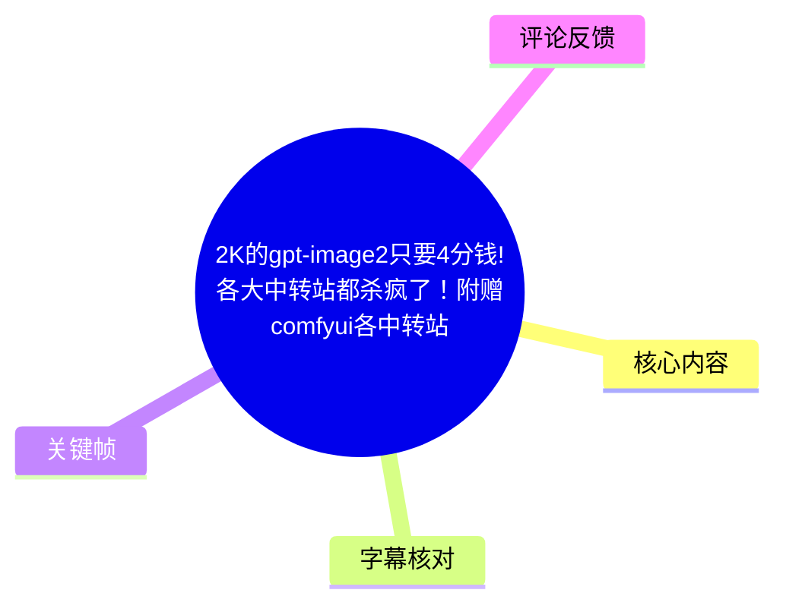
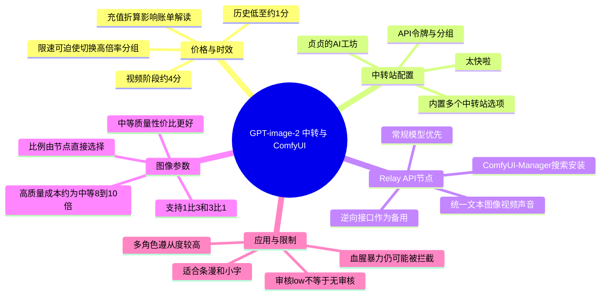
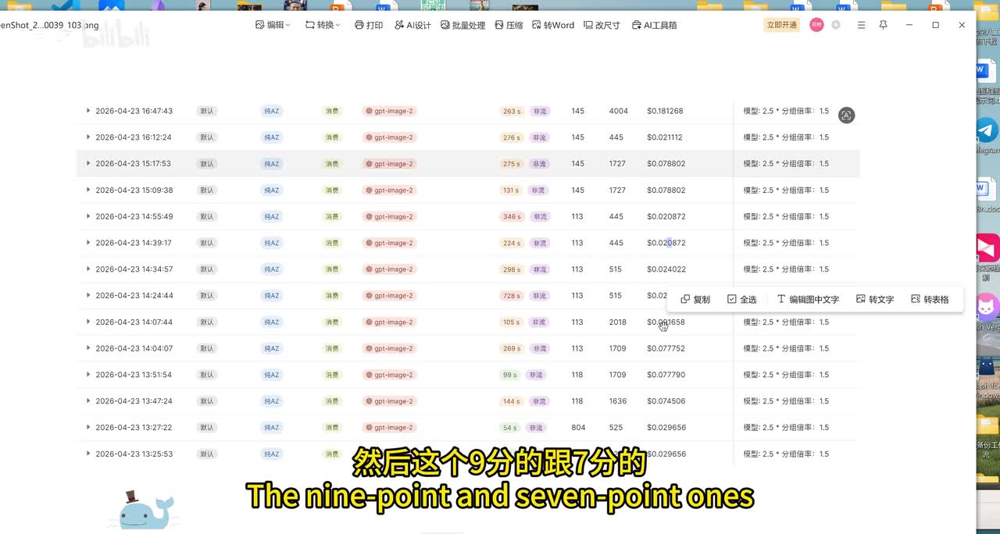
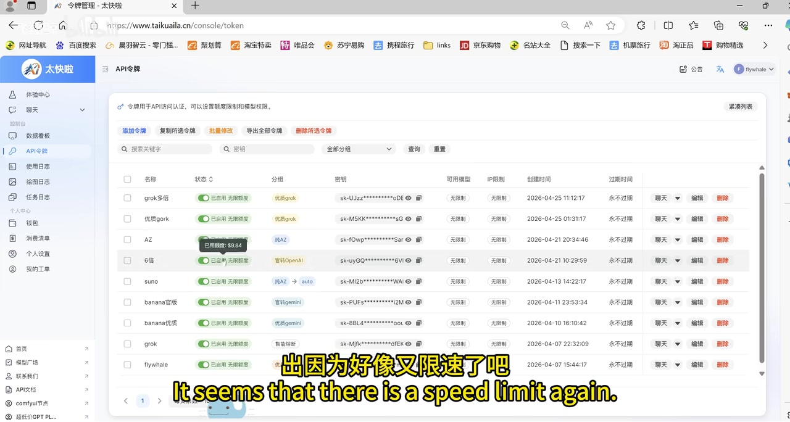
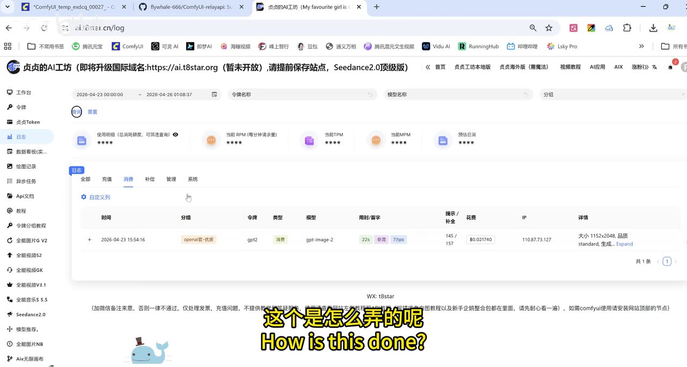

# 2K 的 GPT-image-2 低价中转实测、ComfyUI Relay API 节点与出图参数

> 来源：[Bilibili 视频](https://www.bilibili.com/video/BV1pyofB2EKC)<br>
> UP 主：飞翔鲸｜发布时间：2026-04-23｜视频时长：08:02

## 小结

视频讨论的是通过第三方中转站调用 `gpt-image-2` 的价格变化，以及如何借助 ComfyUI 的 `Relay API` 节点，在不同中转站之间切换并统一调用图像、文本、视频和声音能力。

UP 主展示的历史账单表明，在其截图记录时，简单提示词的 2K 图曾低至约 **1 分钱**；视频制作/发布阶段已涨至约 **4 分钱**。但这不是固定报价：中转站分组、限速状态、充值折算、质量档位、传图数量和分辨率都会明显改变单张成本。

操作上，视频建议在 ComfyUI-Manager 中搜索并安装 `relay API`，使用该节点填写中转站地址和 API Key，选择 GPT 对应的常规模型项，而非默认优先使用下方“逆向”选项。节点内可直接选画面比例，无须把比例再写进提示词。

最值得迁移的参数经验是：**质量优先选“中等（standard）”**。UP 主称“低”和“中”的价差仅约 1 分钱，但中等质量更好；“高”等质量相对中等可能高出 **8～10 倍**，且不一定带来肉眼可辨的提升。4K、多参考图与高质量叠加时，单张可能上升到 1～2 元量级。

视频还展示了 1:3、3:1 的极端长宽比，以及用 GPT 的小字能力制作条漫的工作流：将底图输入文本节点生成故事，再将故事写回图像提示词后生成条漫。UP 主认为其四角色遵从度较高，但仍存在小 Bug。

所有价格、分组可用性、限速和内容审核强度均属于视频录制时的中转站状态，变化非常快。尤其视频中已出现某分组无法出图、只能切换更高倍率分组的情况；不应将“4 分钱”或“可用分组”视作长期保证。

## 思维导图





## 目录

- [价格记录、充值折算与限速风险](#价格记录充值折算与限速风险)
- [中转站 API 令牌与分组选择](#中转站-api-令牌与分组选择)
- [ComfyUI Relay API 节点安装与模型选择](#comfyui-relay-api-节点安装与模型选择)
- [图像比例、质量和审核参数](#图像比例质量和审核参数)
- [2K 尺寸定义与条漫工作流](#2k-尺寸定义与条漫工作流)
- [实操步骤清单](#实操步骤清单)
- [限制、风险与时效性](#限制风险与时效性)
- [字幕比对](#字幕比对)
- [评论分析](#评论分析)
- [处理记录](#处理记录)

## 价格记录、充值折算与限速风险 [00:00:00](https://www.bilibili.com/video/BV1pyofB2EKC?t=0)

UP 主开场说明，标题中“2K 图只要 4 分钱”已经是价格上涨后的表述：其原先已经制作了“1 分钱”版本的海报和标题，但尚未发布，随后几天价格上涨到原来的四倍以上，因此改为“4 分钱”。

在 [00:00:40](https://www.bilibili.com/video/BV1pyofB2EKC?t=40)，UP 主基于 23 日保存的消费记录称：简单提示词条件下的 2K 图，折算后约为 **1 分多钱**。而提示词更长、上传图片更多的请求，账单上可见“7 分”“9 分”等数值，按其所在平台的充值规则折算后约为 **3～4 分钱**。



> 图：画面展示 `gpt-image-2` 调用记录、账单金额及右侧可见的“模型：2.5 × 分组倍率：1.5”等信息。它是理解视频“账单显示值还要折算”和“分组倍率会影响成本”两项结论的直接证据。

在 [00:01:13](https://www.bilibili.com/video/BV1pyofB2EKC?t=73)，UP 主还展示了另一中转服务的历史消费记录，称当时单次显示为 `1.02`、折算约为 2 分钱；但立刻强调“现在价格肯定不一样了”。

### 充值折算规则 [00:02:29](https://www.bilibili.com/video/BV1pyofB2EKC?t=149)

UP 主解释，所演示的“太快啦”平台按“**5 毛钱充值 1 块余额**”计算，因此页面显示的消费金额需 **除以 2** 才接近实际充值成本。这个规则仅适用于其展示的平台和当时的充值活动/政策，不能自动套用于其他中转服务。

### 限速导致的成本跳变 [00:01:54](https://www.bilibili.com/video/BV1pyofB2EKC?t=114)

视频称，某个较低倍率分组在当晚出现无法出图的情况，UP 主判断可能是又被限速，只能切到 `6 倍` 分组。其口述关系为：

- 较低倍率分组：`1.5 倍`；
- 备用分组：`6 倍`；
- `6 ÷ 1.5 = 4`，即备用分组相当于低倍率分组的 4 倍成本；
- 若原先约 4 分钱，则切换后约为 `4 × 4 = 16 分钱`，即约 **0.16 元/张**。



> 图：画面是“太快啦”后台的 API 令牌列表，可见不同令牌对应不同分组，包括“特惠grok”“特惠OpenAI”等标签。它说明视频所说的“选分组”是后台令牌/分组配置，而非单纯在 ComfyUI 提示词中切换模型名。

## 中转站 API 令牌与分组选择 [00:01:43](https://www.bilibili.com/video/BV1pyofB2EKC?t=103)

视频演示的第一步是在中转站后台准备 API 令牌。UP 主特别提醒，调用 GPT 图像能力时要注意令牌所属的分组；同一个中转站不同分组的倍率、可用性和成本可能不同。

在 [00:02:42](https://www.bilibili.com/video/BV1pyofB2EKC?t=162)，UP 主切换展示“贞贞的AI工坊”后台。从关键帧可辨识，该页面日志中出现：

- 模型：`gpt-image-2`
- 分组：`openai-专线`
- 画面右侧详情显示尺寸、质量档位等调用信息
- 账单记录中有单次消费数值



> 图：该关键帧展示另一中转站的调用日志与分组字段，是视频比较多个中转服务、说明价格与分组有关的画面依据。图中记录是演示账号的历史调用，不构成对任何用户当前价格或服务质量的保证。

UP 主称该站需要选择 OpenAI 官方相关分组，且视频当时倍率为 `4 倍`。由于 ASR 对专有名称存在误识别，正文以关键帧中可见的“贞贞的AI工坊”和 `openai-专线` 为准；“官方”“U 字”等口述细节无法仅凭素材确认其完整官方含义，故不扩展解释。

## ComfyUI Relay API 节点安装与模型选择 [00:03:07](https://www.bilibili.com/video/BV1pyofB2EKC?t=187)

UP 主为该类中转调用制作了 `Relay API` 节点。视频及简介说明该项目地址为：

<https://github.com/flywhale-666/ComfyUI-relayapi>

视频称该节点可以适配多个中转站，并同时支持：

- 文本；
- 图像；
- 视频；
- 声音。

安装方式是在 **ComfyUI-Manager** 内搜索 `relay API`。简介进一步提示：应选择最新的具体版本号安装；该视频的热评随后补充了更具体的版本建议，见“评论分析”。

### 模型和中转站选择逻辑 [00:03:36](https://www.bilibili.com/video/BV1pyofB2EKC?t=216)

节点内置若干中转站选项。视频口述可确认其中包括“太快啦”“贞贞的AI工坊”及另一个名称被 ASR 识别为 `BRA2` 的选项；由于无站内字幕且关键帧未清晰呈现第三个完整名称，本文不对该名称作主观补全。

关于模型项，UP 主的操作建议是：

1. 选择 GPT 时，直接选择 GPT 的常规模型项；
2. 不需要额外填写 API 分隔/分隔符字段；
3. 不要优先选下面标为“逆向”的 GPT 选项；
4. “逆向”接口只是偶尔可用的备用路径，通常应在上方常规模型不可用时再尝试。

视频还以“香蕉”及其 Pro 版本为例说明：不同中转站可能采用不同模型命名，需按站点实际提供的名称选取。此处“香蕉”是视频中的口语化称呼，素材未提供其完整标准模型名，因此不将其等同于某个特定官方模型。

## 图像比例、质量和审核参数 [00:04:18](https://www.bilibili.com/video/BV1pyofB2EKC?t=258)

### 比例在节点内选择 [00:04:42](https://www.bilibili.com/video/BV1pyofB2EKC?t=282)

UP 主说明，GPT 图像选项中，画面比例无需再写在提示词中：**节点里选什么比例，就按该比例生成**。该节点还提供：

- `1:3`
- `3:1`

两种极端比例。视频展示了 1:3 的 2K 结果，表明该配置在演示环境中实际跑通。

### 质量档位的成本/效果取舍 [00:05:02](https://www.bilibili.com/video/BV1pyofB2EKC?t=302)

这是视频最明确的参数建议之一。UP 主基于其约百张图的主观对比，给出如下判断：

| 质量档位 | 视频中的成本说法 | 视频中的效果判断 | 建议 |
| --- | --- | --- | --- |
| 低（low quality） | 约 3 分 | 比中等略差 | 通常不建议为省约 1 分而选低 |
| 中等（standard / medium） | 约 4 分 | 明显优于低；与高差异不明显 | **日常默认选择** |
| 高（high） | 为中等的约 8～10 倍 | UP 主认为多数情况下与中等难以分辨 | 非必要不选 |

UP 主进一步说明，社群中出现“一张图一块多”的情况，可能是误选了高质量；若同时传入更多图片并使用 4K，单张甚至可能接近 **2 元**。这些是 UP 主对其使用情境的经验归因，并非对所有平台账单的统一诊断。

### 审核强度并非绕过审核 [00:05:51](https://www.bilibili.com/video/BV1pyofB2EKC?t=351)

节点中的 `low` 在视频中被解释为审核相关设置。UP 主称，如果希望处理某些敏感人物主题，需选择 `low` 而不要选更高等级；但即便设为 `low`，对于血腥、暴力等内容，GPT 仍可能拒绝生成。

因此应将其理解为某项审核强度/策略参数，而不是“关闭审核”的开关。视频没有提供可复现的政策文档、参数枚举或绕过限制的方法；实际审核结果仍取决于上游模型、平台和请求内容。

## 2K 尺寸定义与条漫工作流 [00:06:31](https://www.bilibili.com/video/BV1pyofB2EKC?t=391)

UP 主强调，视频里的“2K”不是“长边等于 2048 像素”。其采用的是类似“香蕉 2K”的面积定义：总像素面积大致与 `2048 × 2048` 相当。

视频给出的 1:3 极端比例示例尺寸为：

```text
3536 × 1184
```

该尺寸的像素总量约为 `4,186,624`，接近 `2048 × 2048 = 4,194,304`，与 UP 主“保持总体面积一致”的说明相符。

### 条漫生成流程 [00:07:01](https://www.bilibili.com/video/BV1pyofB2EKC?t=421)

UP 主认为 GPT 对小字的支持较好，因此适合生成条漫。视频演示的逻辑流程如下：

1. 准备作为故事/角色依据的底图；
2. 将底图连接到文本相关节点；
3. 使用同一套 API Setting 配置调用模型，让模型根据图片写故事；
4. 将生成的故事文本粘贴或传递到图像节点的提示词；
5. 连接图像节点并出图；
6. 检查角色稳定性、文字和画面中是否出现小 Bug。


> 图：开场海报强调“GPT-image2 中转站”“2K 图只要 1 分钱”等卖点，画面本身是带大量中文文字的图像示例。它与后文“GPT 对小字支持较好、适合条漫”的应用方向相呼应，但不能单独证明文字准确率或生成质量的普遍性。

在 [00:07:39](https://www.bilibili.com/video/BV1pyofB2EKC?t=459)，UP 主展示四名角色的结果，并认为角色遵从度较高、角色没有混乱；同时明确承认仍有一些小 Bug。其对比称，另一“香蕉”方案输入四名角色时更容易混乱。这是创作者的实测体验，不代表严格的模型基准结论。

## 实操步骤清单 [00:03:07](https://www.bilibili.com/video/BV1pyofB2EKC?t=187)

以下按视频顺序整理为可执行清单；其中平台名、费用、倍率和模型可用状态均需以当前页面为准。

1. **安装节点**
   - 打开 ComfyUI-Manager。
   - 搜索 `relay API`。
   - 安装 `ComfyUI-relayapi` 的可用具体版本。
   - 视频简介提供项目地址：<https://github.com/flywhale-666/ComfyUI-relayapi>。

2. **准备中转站凭据**
   - 在拟使用的中转站后台创建或选择 API 令牌。
   - 核对令牌所属的模型分组及倍率。
   - 不同中转站可能有不同充值折算规则；不要直接用页面账单数值横向比较。

3. **在 Relay API 节点填写配置**
   - 选择目标中转站；
   - 填入该站点接口地址及 API Key；
   - 选择 GPT 对应的常规模型项；
   - 若常规接口正常，不优先使用“逆向”模型项；
   - API 分隔符字段按视频说法可不填。

4. **设置图像参数**
   - 在节点内直接选择比例，不必在提示词重复描述比例；
   - 需要长图时可尝试 `1:3` 或 `3:1`；
   - 质量选择“中等/standard”作为默认；
   - 避免无意选择高质量，尤其在 4K 或多图输入时先确认预算。

5. **处理受限或不可用情况**
   - 若低倍率分组因限速无法出图，可查看平台是否存在其他可用分组；
   - 切到更高倍率分组前，先按倍率估算成本；
   - 若上游接口均不可用，视频的结论是无法出图，而不是继续通过节点设置解决。

6. **条漫工作流（可选）**
   - 将底图接入文本节点，生成故事文本；
   - 把故事内容放入图像提示词；
   - 用图像节点生成结果；
   - 人工检查角色一致性、文字准确性及画面瑕疵。

## 限制、风险与时效性 [00:07:45](https://www.bilibili.com/video/BV1pyofB2EKC?t=465)

1. **价格强时效性**：视频开头已证明价格数天内可从约 1 分涨至约 4 分，且限速后可能升至约 0.16 元。任何单价均应视为历史实测，不是承诺价。
2. **中转服务风险**：第三方中转站的分组、额度、倍率、充值规则、接口稳定性和数据处理方式各不相同。使用前应阅读平台条款，避免在不可信服务中提交敏感图片、私密提示词或高价值 API 凭据。
3. **“2K”定义不统一**：本视频的 2K 指接近 `2048 × 2048` 总面积，不等同于长边 2048。比较价格时必须同时对比实际像素、比例、质量档位和输入图数量。
4. **质量经验来自个人实测**：中等与高等“看不出差异”、高等“没必要”等判断，是 UP 主基于约百张图的经验，不是公开盲测或标准化评测。
5. **审核仍然存在**：即使选择 `low`，血腥、暴力等请求依然可能被拒绝；不能把参数调整理解为对内容安全限制的规避。
6. **专有名词识别存在不确定性**：本次没有站内字幕，ASR 对部分平台名和模型口语称呼有误识别。本文只在关键帧可见或视频简介明确提供时进行了校正，无法确认的名称保留不确定性。
7. **项目版本会变化**：视频简介要求安装最新具体版本；热评则指定过 `1.3.2`。两者对应的时间点可能不同，应以 ComfyUI-Manager 当前可用版本、项目发布说明和兼容性为准。

## 字幕比对

| 字幕来源 | 完整性 | 专有名词 | 时间轴 | 主要问题 |
| --- | --- | --- | --- | --- |
| Bilibili 站内字幕 | 未提供可用字幕 | 无法评估 | 无法使用 | 素材明确标注“未提供可用站内字幕” |
| 本次 ASR 字幕 | 较完整，35 段，覆盖约 433.4 秒语音 / 481.86 秒视频 | 存在多处口语与专名误识别 | 可用，含毫秒级 SRT 起止时间 | 将部分平台名、模型名和术语转写为近音词，如“真正攻防”“config UI”“GP2”等 |

本次 ASR 使用 `medium` 模型，识别语言为中文，语言概率为 `0.9985`；诊断显示语音覆盖率为 `0.8994`，首段语音在 00:00:00.970，最后语音在 00:07:59.570，未报告大间隔或警告。ASR 结果**未标记 `noAudioStream=true`**，说明源视频存在音轨，本任务实际使用了带时间戳的 ASR SRT 作为所有章节时间轴依据。

结合关键帧、视频简介及上下文，对正文作出的重要校正/保留如下：

- `config UI`：校正为 **ComfyUI**；
- `relay API`：视频简介中的仓库名为 `ComfyUI-relayapi`，据此采用 **Relay API**；
- `真正攻防`：关键帧站点页眉可见“贞贞的AI工坊”，正文以此为准；
- `太快达`：关键帧左上角站点标识为“太快啦”，正文以此为准；
- `GP2`、`GPT-image2`：根据标题、日志和上下文统一书写为 **GPT-image-2 / gpt-image-2**，但不额外推断其官方产品版本；
- `香蕉`、第三个中转站名称等：缺乏足够的可见文字佐证，保留视频口语称呼或不作扩展。

## 评论分析

可获取的热评数据仅返回 **2 条**，少于“热评前三条”的上限；以下仅分析这 2 条，不补造第三条。

### 1. UP 主置顶补充：中等质量、CODEX 分组与节点版本

- 评论者：飞翔鲸（UP 主）
- 获赞：12
- 核心内容：
  - 再次强调应选择“中质量”；
  - 建议选择 **CODEX 分组**；
  - 称 2K 可到约 **3 分 5 厘钱**；
  - 提醒更新 ComfyUI；
  - 指出管理器 DB 选择“第三个”，版本选择 `1.3.2`。

这条评论是对视频操作细节的重要后续补充，尤其将视频中的泛化“选中等质量”落实到具体的节点版本 `1.3.2`。但该价格和分组依然是评论发布时的实测信息，且与视频中提到的分组描述存在时间差；应视作更新线索，而非稳定报价或普遍可用性保证。

### 2. 用户对 low 审核强度效果的质疑

- 评论者：缺田吗
- 获赞：10
- 核心内容：提问为何审核强度设置为 `low` 后，实际审核仍比 GPT 网页端严格。

这条评论与视频中“即使 low，血腥暴力内容仍可能被卡住”的提醒一致，反映实际用户体验可能比参数名称暗示的更严格。它是单一用户反馈，不能据此确认所有中转站都比网页端严格，但提示使用者不要预期 `low` 能稳定降低审核拦截。

## 处理记录

- Worker ID：`worker-mrj0wbly-5dc4e50c`
- 模型：`gpt-5.6-terra`
- 调用工具与素材：视频元数据、`asr/asr-result.json`、`asr/transcript.srt`、关键帧 `frames/`、`comments/comments.json`、视频简介与封面信息。
- 字幕选择：站内字幕未提供可用内容；已检查本次 ASR，确认存在音轨且 ASR 含真实 SRT 时间戳。因此正文以本次 ASR 的起止时间换算秒数生成 Bilibili 时间轴链接，并以关键帧和简介校正可确认专有名词。
- 关键帧选择依据：
  - `frame-002.jpg`：展示 gpt-image-2 消费记录和分组倍率；
  - `frame-003.jpg`：展示“贞贞的AI工坊”日志、模型与分组信息；
  - `frame-004.jpg`：展示“太快啦”API 令牌及分组；
  - `frame-001.jpg`：展示视频所强调的中文文字/海报应用方向。
- 评论处理：仅处理接口实际返回的前两条热评；未获取到第三条，不作虚构补全。
- 缓存清理：本任务仅使用已提供的结构化素材和关键帧路径，未产生需额外删除的下载缓存；未对源素材执行删除操作。
- 未解决问题：
  - 部分中转站/模型名称因 ASR 近音识别且关键帧不完整，无法完全确认；
  - 无法验证视频和热评所述价格、倍率、限速状态及版本号在当前时间是否仍有效；
  - 无法从现有素材验证各平台的隐私政策、计费规则和接口合规性。
