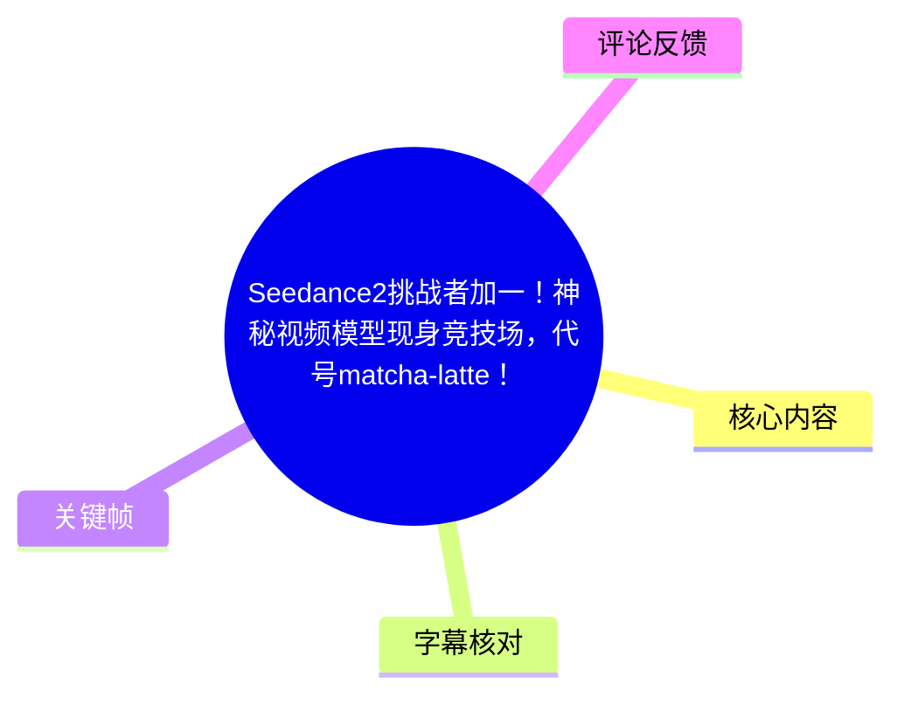
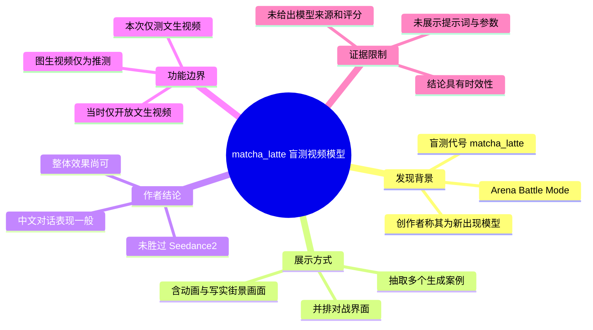
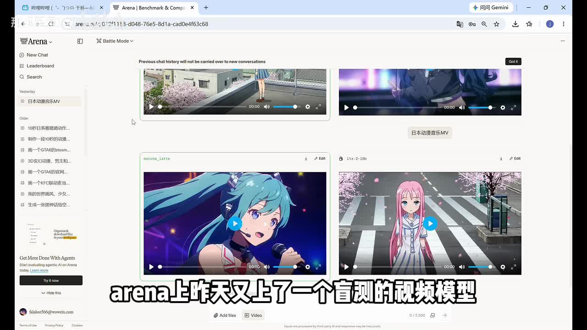
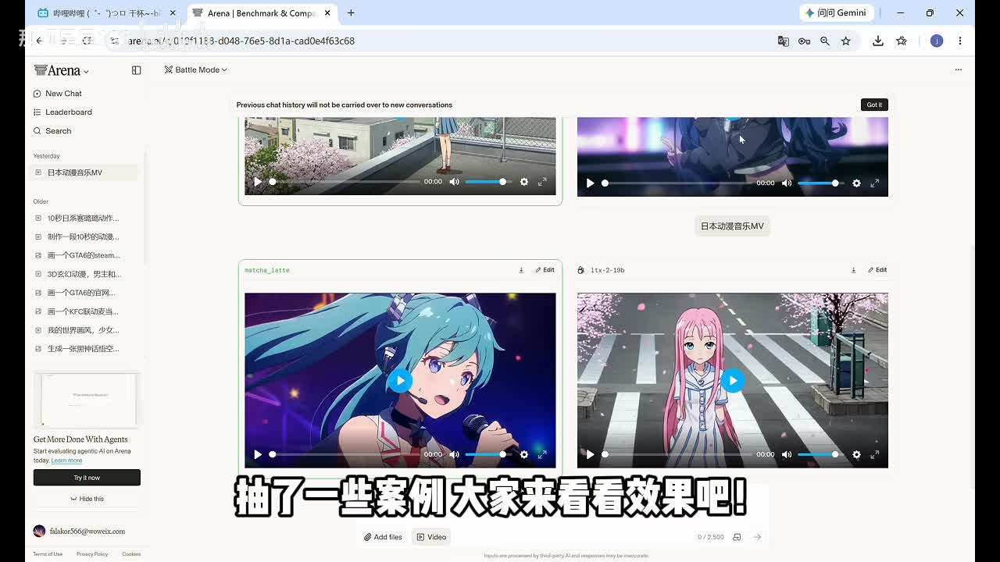
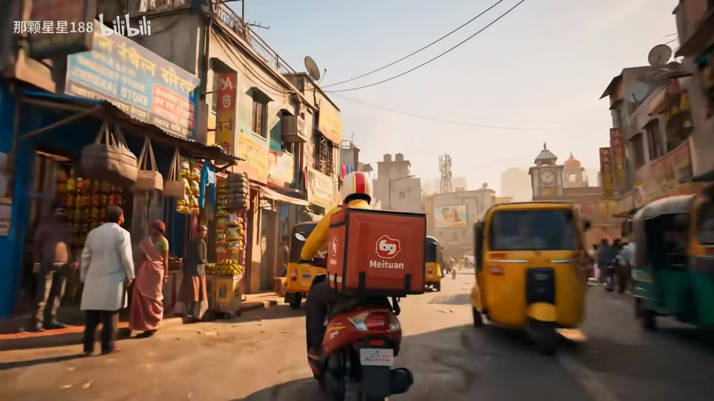
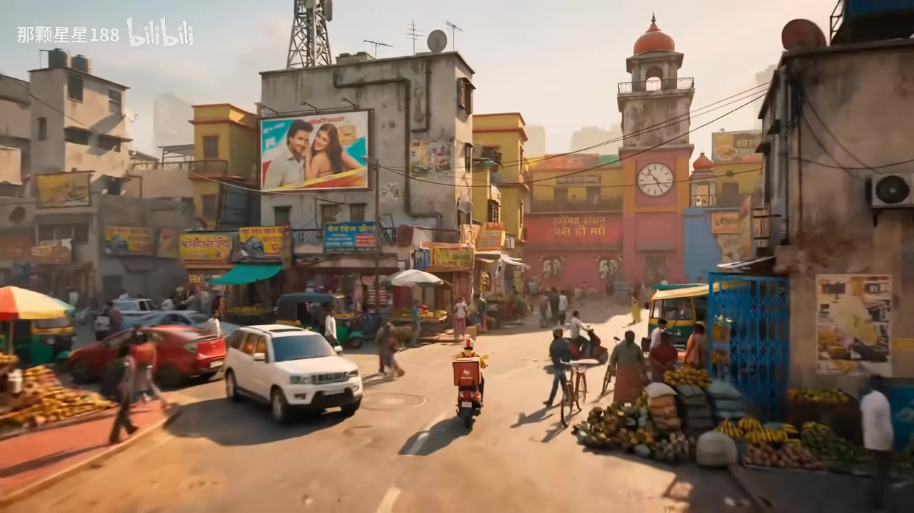

# Seedance2挑战者加一！神秘视频模型现身竞技场，代号matcha-latte！能挑战成功吗？

> 来源：[Bilibili 视频](https://www.bilibili.com/video/BV1g9KQ6SEdo) 
> UP 主：那颗星星188｜视频时长：01:10｜分辨率：1280×720  
> 信息抓取时间：2026-07-15；视频中“昨天”的表述为相对时间，不能据此换算成确切上架日期。

## 小结

视频报道了一个在 Arena（画面显示为 Arena 的 **Battle Mode**）中出现的盲测视频模型，界面代号为 `matcha_latte`，口播称其为“抹茶拿铁”。UP 主表示该模型是在 Arena 上新出现的，并从盲测结果中抽取若干案例展示。

展示内容以生成视频样例为主。开场画面可见 Arena 并排对战界面：一侧标注 `matcha_latte`，另一侧可见一个模型标识，但视频没有在口播或字幕中明确给出对手模型名称、输入提示词、生成时长、种子、分辨率、采样参数、评分结果或胜负票数。因此，这是一轮观感展示，而不是可复现的严格基准测试。

UP 主在结尾给出的主观结论是：该模型“依旧没打赢 Seedance2”，但整体效果“看起来还行”；又根据中文对话效果“一般”推测其“估计不是国产模型”。这两点均属于作者判断，视频未提供模型官方归属、研发方或技术报告来验证。

功能范围方面，UP 主称 Arena 当时“暂时只开放了文生视频”，故此次只测了文生视频；并根据模型能力推测其“应该是有图生的”。后半句并非已验证功能，不能将其当作该模型已开放图生视频的事实。

适合关注 AI 视频模型动态、Arena 盲测入口及 Seedance 系列竞品的读者。若要据此选择生产模型，还需要补测中文口型与语义一致性、长时序稳定性、可控性、图生视频可用性、价格、版权与审核策略等；本视频均未提供完整答案。

## 思维导图

## 目录

- [发现：Arena Battle Mode 中的 matcha_latte [00:00]](#发现arena-battle-mode-中的-matcha_latte-0000)
- [案例画面：盲测结果中的生成片段 [00:09]](#案例画面盲测结果中的生成片段-0009)
- [总结判断：效果、中文对话与模型归属推测 [00:49]](#总结判断效果中文对话与模型归属推测-0049)
- [实践入口与复测步骤 [00:00]](#实践入口与复测步骤-0000)
- [参数、限制与时效性 [00:49]](#参数限制与时效性-0049)
- [字幕比对](#字幕比对)
- [评论分析](#评论分析)
- [处理记录](#处理记录)

## 发现：Arena Battle Mode 中的 matcha_latte [00:00](https://www.bilibili.com/video/BV1g9KQ6SEdo?t=0)

视频开头说明，Arena 上出现了一个用于盲测的视频模型，代号为“抹茶拿铁”。从画面中的模型标签可见，其英文/界面写法为 `matcha_latte`。

这里的“盲测”是本视频所依托的测试情境：用户在 Arena 的 Battle Mode 中面对并排结果进行比较。视频画面显示了两个视频播放框以及下方模型标签，其中左侧展示为 `matcha_latte`。但该画面并未说明：

- 比较双方分别是哪两个模型；
- 两侧是否使用完全相同的提示词与配置；
- 是否存在人工后处理；
- 生成任务的具体提示词、时长、分辨率与采样次数；
- 用户选择了哪一侧，以及累计胜率、Elo 或排行榜结果。

因此，可以确认的是“`matcha_latte` 出现在 Arena 的盲测界面中”；不能由此进一步确认其公开产品名、开发机构、正式版本号或绝对能力排名。

> 图：画面展示 Arena 的 Battle Mode 双栏视频结果区域，左侧模型标签为 `matcha_latte`。该帧是确认模型代号、测试入口和“并排盲测”形式的直接视觉依据。

视频简介补充称，在 Arena.ai 的 Battle 模式中“有概率能抽到”该模型。这是 UP 主提供的使用提示，意味着模型可见性可能是随机分配或阶段性灰度开放；实际能否抽到、开放地区与规则，需以访问时的 Arena 页面为准。

## 案例画面：盲测结果中的生成片段 [00:09](https://www.bilibili.com/video/BV1g9KQ6SEdo?t=9)

开场后视频主要播放若干结果片段，期间解说很少。站内字幕记录了约 00:20—00:25 的中文对白：“你每天都让这里焕然一新，我注意你很久了。”这说明样例中至少出现了中文角色对白场景；但视频没有同步展示原始提示词，也没有给出角色、镜头、对白是否由提示词直接指定的信息。

在 Arena 界面帧中，可见多个不同风格的缩略结果：包含动漫人物演唱/表演、粉发动画人物街景等。这表明视频作者至少浏览了多类案例，但未披露这些案例是同一提示词下的横向对比，还是不同任务的独立抽样。

> 图：该帧呈现 Arena 页面内多个视频结果缩略图，并清楚保留 `matcha_latte` 标签。它说明视频并非只展示单一成片，而是基于对战界面抽取案例；不过缩略图无法提供生成参数或结果评分。

随后画面出现一段写实城市街景：镜头位于摩托车配送员后方，街道内有车辆、行人、店铺与道路环境。配送箱上可见 “Meituan” 字样，场景中还可见大量复杂的建筑、广告牌和交通元素。此类画面可用于观察模型在复杂主体、透视、运动和环境细节上的视觉表现。

> 图：该帧展示较复杂的写实城市街景、配送车辆、行人与建筑元素。其价值在于提供视频中实际展示的高复杂度视觉案例，但单帧不能验证时序稳定性、物理合理性、文字准确性或品牌元素是否持续一致。

另一帧给出更广角的街道路口，人物、非机动车、汽车、摊位和建筑同时出现。可将其视为作者展示“整体观感”的材料之一，但不能仅凭画面得出模型在所有复杂街景任务上都稳定可靠的结论。

> 图：该帧补充了更广的街景构图和多个运动主体，有助于读者理解案例的场景复杂度。由于素材未附帧级提示词、模型输出归属和完整运动过程，它只能作为展示样本，不能替代量化评测。

### 样例可确认与不可确认的范围

| 项目 | 视频可确认内容 | 不能从视频确认的内容 |
| --- | --- | --- |
| 样例来源 | 作者称从 Arena 盲测中抽取案例 | 每条片段是否都来自 `matcha_latte`，或是否含对手输出 |
| 内容类型 | 画面含动画风格、写实街景及中文对白片段 | 每类内容对应的完整提示词与任务要求 |
| 视觉表现 | 展示了复杂街景、多主体与车辆等画面 | 长时间运动稳定性、物理规律、失败率和平均质量 |
| 中文能力 | 作者认为中文对话一般 | 发音、口型、语义、文字生成分别在哪些条件下失效 |
| 对比结论 | 作者称未胜过 Seedance2 | 具体对手版本、评分统计、评价样本量与显著性 |

## 总结判断：效果、中文对话与模型归属推测 [00:49](https://www.bilibili.com/video/BV1g9KQ6SEdo?t=49)

从 00:49 起，UP 主明确给出本轮测试总结：

1. **与 Seedance2 的比较**：作者称该模型“依旧没打赢 Seedance2”，同时认为整体效果“看起来还行”。  
   - 这是基于其抽样案例形成的评测意见。  
   - 视频没有公开“打赢”的判定标准，也没有列出 Seedance2 的具体版本。标题写“Seedance2”，标签中另有 `seedance2.5`，评论也主要讨论 Seedance2.5；但口播和站内字幕均为“Seedance2”。整理时应保持原口播表述，不能擅自替换成 2.5。

2. **中文对话表现**：作者认为中文对话“一般”。  
   - 该说法有视频中的中文对白样例作为背景，但没有逐项分析语音清晰度、语义正确性、音画同步、口型匹配或多轮对话一致性。  
   - 因此，“一般”只能理解为作者的总体主观评价，而非标准化测评结论。

3. **模型归属判断**：作者据此推测模型“估计不是国产模型”。  
   - 此为推测，不是官方信息。中文对话的单项表现不足以反推出模型开发地区、训练数据来源或团队归属。  
   - 截至本视频素材，`matcha_latte` 仍应视为 Arena 中的匿名代号。

4. **已测能力范围**：作者称 Arena 当时仅开放“文生视频”，所以本次只测文生视频。  
   - 这构成当前最关键的测试边界：视频没有图生视频实测。  
   - 作者进一步说“以这种模型能力来说，应该是有图生的”，这只是基于能力水平作出的预期，尚未被展示或证实。

## 实践入口与复测步骤 [00:00](https://www.bilibili.com/video/BV1g9KQ6SEdo?t=0)

视频没有提供可复制的提示词、命令行、API 或参数配置，因此无法按原视频实现一比一复现。依据视频画面与简介中已给出的信息，可执行的最小验证流程如下：

1. 打开 Arena 的 **Battle Mode**。  
   视频画面直接显示该入口，简介称该模式“有概率”出现目标模型。

2. 输入自定义文生视频提示词并发起对战。  
   由于视频称当时只开放文生视频，复测应优先使用纯文本提示词，不应假定图生视频入口可用。

3. 检查匿名模型标识。  
   若结果区域出现 `matcha_latte`，记录其出现时间、页面状态和任务输入；如果未出现，不能据此判断模型已下线，因为简介已说明其可能是概率抽取。

4. 使用控制变量做横向观察。  
   对同一提示词重复测试，优先覆盖视频中涉及但未量化的维度：
   - 中文角色对白；
   - 动画人物表演；
   - 多主体写实街景；
   - 车辆、行人等运动对象；
   - 镜头推进或跟拍场景。

5. 保存可审计记录。  
   至少保存提示词原文、日期、页面截图、输出视频、对应匿名标签、生成时长和主观评价依据。若 Arena 显示对战选择或结果，也应一并留存。

> 注意：以上是基于视频信息整理出的复测建议，不是视频中逐条演示的操作教程。视频未展示提交按钮后的参数页、选边过程或最终评分。

## 参数、限制与时效性 [00:49](https://www.bilibili.com/video/BV1g9KQ6SEdo?t=49)

### 已披露参数与环境

| 项目 | 可确认信息 |
| --- | --- |
| 视频总时长 | 69.9849375 秒，元数据页标注 70 秒 |
| 视频分辨率 | 1280×720 |
| 测试平台 | Arena，画面显示 Battle Mode |
| 匿名代号 | `matcha_latte` |
| 可测模态 | 作者称当时仅开放文生视频 |
| 样例数量 | 作者称“抽了一些案例”，未给出确切数量 |
| 基准对手 | 作者口播称 Seedance2，具体版本未披露 |
| 图生视频 | 未实测；作者仅推测可能存在 |
| 成本与速度 | 未披露 |
| 提示词、种子、帧率、时长 | 未披露 |

### 结论的适用边界

- **不能将匿名代号等同于正式产品名。** `matcha_latte` 是界面中出现的盲测标签，视频没有给出官方发布公告或开发者信息。
- **不能把单次案例展示当作能力排行榜。** 没有样本量、投票数据、控制变量和评分规则，无法复核“未打赢 Seedance2”的统计意义。
- **中文对话判断证据有限。** 视频仅提供一小段中文对白及作者结论，未拆分语音、口型、语义和文本渲染问题。
- **图生视频不可据此认定已开放。** 视频明确只测试了文生视频，图生视频属于作者推断。
- **Arena 可用性具有即时性。** 模型是否仍会被随机抽到、支持哪些模式、盲测标签是否变化，均可能随平台更新而变化。应以实际访问日页面为准。
- **品牌与文字画面不等于授权信息。** 街景样例中可见 “Meituan” 字样，但视频没有说明其是否为提示词要求、模型偶发生成或任何授权关系，不能据此作商业使用判断。

## 字幕比对

| 字幕来源 | 完整性 | 专有名词 | 时间轴 | 主要问题 |
| --- | --- | --- | --- | --- |
| Bilibili 站内字幕 | 较完整：开场、00:20 左右对白、结尾总结均有分句记录；案例播放段大部分无口播字幕属正常 | “阿瑞娜”“抹茶拿铁”“sedan2”均为音译或误写，需结合画面与上下文校正 | 高：共 21 段，覆盖 00:00:00.100—00:01:09.960 | 将 Arena 写作“阿瑞娜”，将 Seedance2 写作“sedan2”；“文生”被误识为“纹身”，图生被误写为“徒生” |
| 本次 ASR 字幕 | 覆盖主要语音，共 3 个长段；识别诊断显示语音覆盖约 48.04%，中间大段样例播放无可识别旁白 | Arena 识别为“Arena”，但将 Seedance2 误为“Incidence 2” | 可用但粒度较粗：00:00:00.000—00:00:09.580、00:00:20.540—00:00:24.460、00:00:49.770—00:01:09.890 | 使用繁体字；“焕然一新”误为“缓然一新”；“文生”误为“文声”；结尾长段缺少细粒度断句 |

### 最终字幕选择与校正

正文时间轴优先采用站内 SRT 的细粒度分段：例如开场从 **00:00:00.100** 起，结论从 **00:00:49.700** 起。该选择符合站内字幕在该视频中分句更细、末段覆盖更完整的特点。本次 ASR 已执行，模型为 `medium`，识别语言为中文，置信度为 0.99658203125，时间戳可用；其作用主要是交叉核对语音存在区间与口播大意。

基于画面标签、标题、站内字幕与 ASR 上下文，做出以下必要校正：

- “阿瑞娜” / “Arena”统一记为 **Arena**；
- “抹茶拿铁”对应界面标签 **`matcha_latte`**；
- “sedan2”与“Incidence 2”统一校正为 **Seedance2**，因为标题、标签 `seedance` 及上下文均指向视频模型 Seedance 系列；
- “纹身”“文声”校正为 **文生视频**；
- “徒生”校正为 **图生视频**；
- ASR 的“缓然一新”按站内字幕校正为“焕然一新”。

## 评论分析

仅处理已获取的热评前三条。评论反映的是观众态度，不构成模型能力、开源状态或平台政策的验证证据。

1. **a8071521（16 赞）**  
   观点是：与其继续和 Seedance 系列竞争能力，不如尝试做“开源、无审核”的模型，并认为很难超过 Seedance2.5。  
   - 可补充的信息：评论揭示部分用户更重视部署自由度与审核策略，而不只关注生成质量。  
   - 可信度与边界：这是偏好和市场判断；视频未讨论开源、审核机制，也没有对 Seedance2.5 作正式基准比较，不能据此确认任何模型的审核或开源属性。

2. **可乐捏丶（13 赞）**  
   观点是：“什么都不可能挑战 Seedance2.5 了。”  
   - 可补充的信息：反映该评论者对 Seedance2.5 领先性的强烈预期。  
   - 可信度与边界：结论过于绝对，未提供测试数据；并且视频口播使用的是 Seedance2，未明确比较对象是否为 2.5。

3. **Wu理取鬧（4 赞）**  
   观点是：将该模型贬称为表现不佳的“路边一条”视频模型。  
   - 可补充的信息：表达了对匿名新模型质量的负面观感。  
   - 可信度与边界：未说明其实际测试条件、所见案例或失败点，属于情绪化评价，无法用于判断 `matcha_latte` 的真实能力。

## 处理记录

- Worker ID：`worker-mrj0wbly-5dc4e50c`
- 整理模型：`gpt-5.6-terra`
- 调用工具与模型：素材处理流水线已提供合并视频、音频、关键帧、站内字幕、评论数据；本次 ASR 模型为 `medium`，运行于 `cuda`，计算类型为 `float16`。
- 使用的素材：`merged.mp4`、`audio/audio.wav`、`asr/transcript.srt`、站内字幕 `p01-ai-zh.srt`、关键帧目录 `frames/`、`comments/comments.json`。
- 字幕选择：以站内 SRT 作为正文的主时间轴来源，因其分段更细；以本次 ASR 交叉验证语音区间和文本，并对 Arena、Seedance2、文生视频、图生视频等误识别词进行上下文校正。
- 关键帧选择依据：选用 `frame-001.jpg` 和 `frame-002.jpg` 说明 Arena Battle Mode、`matcha_latte` 标签与样例抽取环境；选用 `frame-003.jpg`、`frame-004.jpg` 说明视频实际展示的复杂写实街景样例。未将单帧画面外推为稳定能力证明。
- 评论范围：仅分析可获取热评前三条，分别为 16 赞、13 赞和 4 赞评论。
- 缓存清理：提供的素材清单未包含缓存清理执行日志，无法确认是否已清理；本记录不虚构清理结果。
- 未解决问题：匿名模型的正式名称、开发方、参数规模、开放地区、完整提示词、生成配置、评分数据、对手模型版本、图生视频是否存在及当前 Arena 可用状态，均未在素材中披露。
