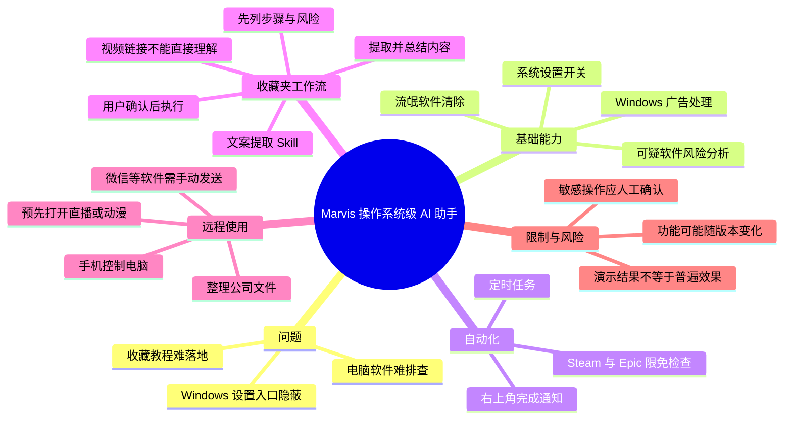
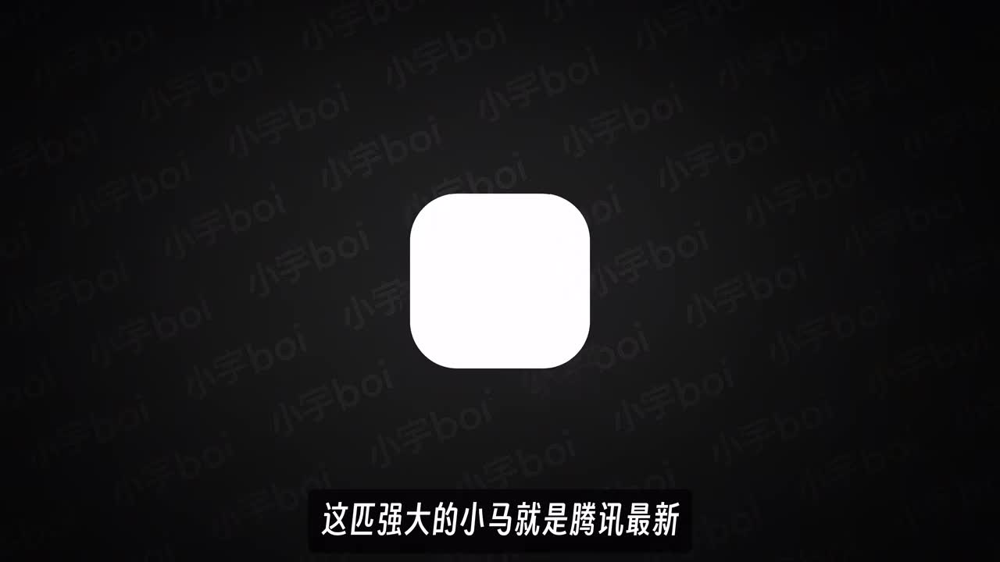
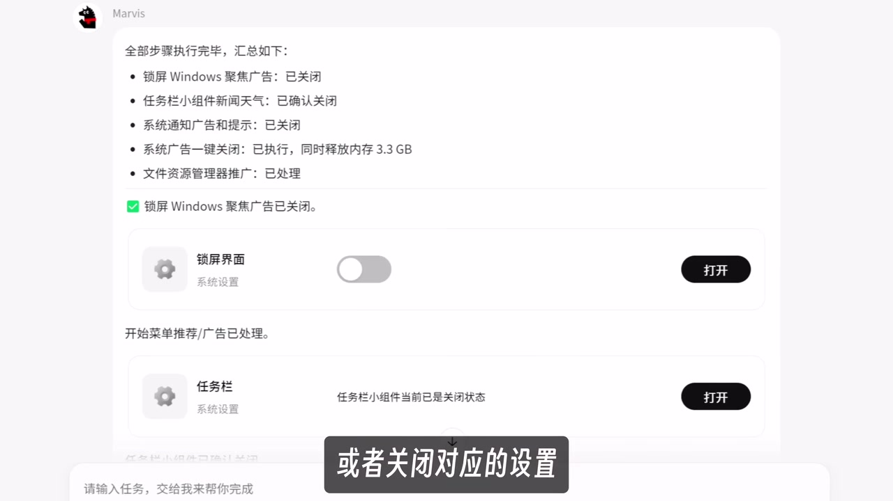
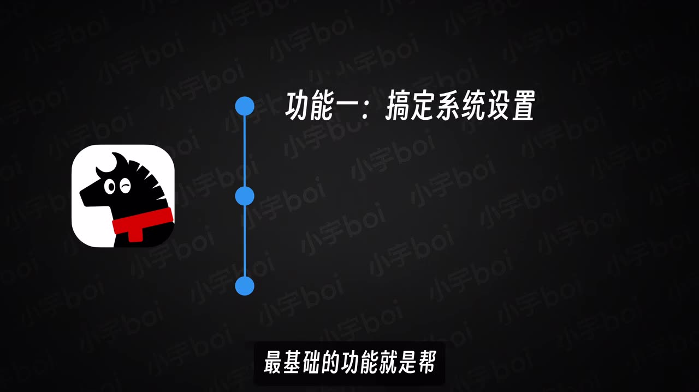

# 给电脑装上这个AI 后，你的收藏夹将不再吃灰！

> 来源：[Bilibili 视频](https://www.bilibili.com/video/BV1NJV46HEbN) 
> UP 主：小宇Boi｜发布时间：2026-05-29｜视频时长：03:56｜合集：AIcode

## 小结

视频介绍腾讯推出的操作系统级 AI 助手 **Marvis（马维斯）**。UP 主将它定位为“AI 电脑管家”：用户可用自然语言让它处理较隐蔽的 Windows 设置、排查疑似流氓软件、设置定时任务，以及按教程执行部分电脑操作。

视频最具代表性的思路不是单纯“问 AI”，而是把收藏的教程转化为可执行工作流：先让 Marvis 学习和总结教程内容，再要求其列出步骤与风险，最后由用户确认执行。UP 主为弥补其暂时不能直接通过视频链接理解视频内容的限制，制作了“视频文案提取 Skill”：输入 `/` 选择 Skill 后粘贴视频链接，即可先提取、再总结文案。

演示的能力包括关闭 Windows 自动更新及广告相关设置、扫描并按风险等级筛出可疑软件、清理 C 盘、创建系统还原点、关闭休眠文件，以及每天 10 点检查 Steam 与 Epic 限免游戏并推送结果。视频口述中称一次 C 盘清理成功腾出 **25GB** 空间；这属于该演示环境中的结果，并非所有电脑都能复现的固定参数。

实践上，视频给出的关键经验是：**涉及删除、系统设置、文件传输等敏感操作时，不应直接让 AI 执行，而要先索取具体步骤和风险说明，再按需要确认。** 此外，Marvis 不能直接操控微信等通讯软件；手机远程使用时，文件发送仍需用户在手机端接管屏幕并手动完成。

内容具有明显时效性。视频发布于 2026-05-29，素材抓取于 2026-07-16；Marvis 的功能边界、支持的软件、系统权限和 Skill 获取方式均可能已变化。视频描述称“视频文案提取 Skill”可后台私信 UP 主“小宇”获取，且使用教程会放在评论区，但本材料未提供该 Skill 的代码、下载地址或完整教程，不能据此复现其实现。

## 思维导图

## 目录

- [背景：从收藏教程到执行任务](#背景从收藏教程到执行任务)
- [Marvis 的定位与系统设置能力](#marvis-的定位与系统设置能力)
- [软件管理与定时自动化](#软件管理与定时自动化)
- [把收藏视频变成可执行流程](#把收藏视频变成可执行流程)
- [系统级执行边界与安全步骤](#系统级执行边界与安全步骤)
- [手机远程控制与通讯限制](#手机远程控制与通讯限制)
- [结论、适用范围与时效性](#结论适用范围与时效性)
- [字幕比对](#字幕比对)
- [评论分析](#评论分析)
- [处理记录](#处理记录)

## 背景：从收藏教程到执行任务 [00:00:29](https://www.bilibili.com/video/BV1NJV46HEbN?t=29)

视频针对的痛点是：用户收藏了大量电脑操作教程，却往往没有真正照着做。UP 主以 C 盘清理类教程为例，提出将教程交给 Marvis 学习、归纳，再由它给出操作步骤并执行的使用方式。

视频将 Marvis 称为腾讯最新推出的“操作系统级 AI 助手”。这里的“操作系统级”是视频对其能力范围的描述，重点是它不仅生成文字回答，还被演示为可以打开或改变系统设置、分析本机软件、进行清理，以及执行部分与系统相关的操作。

> 图：画面将“C 盘清理”教程封面与 Marvis 的马形图标并置，直观表达视频的核心设想：将收藏的教程交给 AI 处理，而不是用户自行逐步照做。

视频口述称，把 C 盘清理教程发给 Marvis 后，它会学习并总结内容，提供详细操作步骤；继续要求执行后，演示中清理出 **25GB** 空间。应注意两点：

1. **25GB 是个案演示结果。** 清理空间取决于磁盘占用、临时文件、休眠文件、系统版本及既有设置，不能理解为通用承诺。
2. 清理涉及文件删除和系统配置变更。即使 AI 可自动执行，也应先看清目标路径、删除项目、恢复方案与潜在副作用。

> 图：画面展示 Marvis 图标，并以字幕说明其为腾讯推出的产品；它有助于校正 ASR 中将产品名多次误识别为“马络斯”“马绥斯”等的问题。

## Marvis 的定位与系统设置能力 [00:00:31](https://www.bilibili.com/video/BV1NJV46HEbN?t=31)

UP 主认为，Marvis 最简单的用法是把它当作 AI 电脑管家。其基础功能是协助处理系统设置，特别是普通用户不容易找到的 Windows 配置入口。

视频举出的系统设置场景包括：

- 关闭 Windows 自动更新；
- 关闭 Windows 中的广告内容；
- 展示对应设置项，让用户点击打开或关闭；
- 处理锁屏 Windows 聚焦广告、任务栏小组件新闻天气、系统通知广告与提示、文件资源管理器推广等项目。

> 图：结果页列出锁屏 Windows 聚焦广告、任务栏小组件新闻天气、系统通知广告和提示、系统广告、文件资源管理器推广等处理项，并显示“系统广告一键关闭”时释放内存 3.3GB。该画面说明视频中的操作并非只给出文字建议，而是展示了逐项状态与开关入口；其中“释放内存 3.3GB”仍应视为演示页面中的结果提示，不能泛化。

对于这类功能，视频的价值在于降低“找到入口”的成本：用户用任务描述表达目的，Marvis 尝试映射为具体系统选项。但视频没有提供其调用系统接口的机制、支持的 Windows 版本、管理员权限要求，也未展示失败处理逻辑。因此，实际使用前仍应核对：

- 当前操作是仅跳转设置页，还是直接改变系统配置；
- 自动更新关闭是否影响安全补丁；
- “广告关闭”具体修改哪些系统项目；
- 是否可撤销、如何恢复默认值。

## 软件管理与定时自动化 [00:00:55](https://www.bilibili.com/video/BV1NJV46HEbN?t=55)

### 可疑软件扫描与清除 [00:00:55](https://www.bilibili.com/video/BV1NJV46HEbN?t=55)

除系统设置外，UP 主称 Marvis 可以管理整台电脑的软件，而不只是查找或卸载软件。当电脑变卡时，用户可要求它搜索可疑的流氓软件；系统会在搜索和分析后，按风险程度筛出可疑软件，并可进一步协助彻底清除。

这是一个高风险场景。视频没有披露“风险程度”的判定规则、检测准确率、软件白名单机制，亦未展示误报后的恢复流程。因此，较稳妥的实践顺序应是：

1. 让工具仅输出疑似软件清单、安装位置、风险理由和影响范围；
2. 核对软件名称、发布者、安装时间及是否为自己需要的软件；
3. 对重要数据和配置先备份，必要时创建还原点；
4. 只在明确确认目标后执行卸载或清除；
5. 清除后检查关键应用、浏览器扩展、启动项及网络设置是否正常。

### 每日限免游戏任务 [00:01:19](https://www.bilibili.com/video/BV1NJV46HEbN?t=79)

视频还展示定时自动任务。示例为：设置一个**每天 10 点**检查 Steam 和 Epic 限免游戏、自动“喜加一”并整理免费游戏清单的任务。任务完成后，用户会在屏幕右上角收到完成通知，点击后可查看整理结果。

这一案例说明视频所述能力至少包含三个环节：

| 环节 | 视频中的表达 | 用户应重点确认 |
| --- | --- | --- |
| 触发 | 每天 10 点运行 | 时区、电脑开机状态、任务是否会补跑 |
| 获取 | 检查 Steam 与 Epic 限免游戏 | 账号登录状态、平台页面变化、是否允许自动领取 |
| 输出 | 整理“白嫖游戏”清单并通知 | 清单来源、成功/失败状态、是否有遗漏 |

视频没有说明任务能否自动完成平台登录、验证码、二次验证或最终领取确认，也没有展示任务配置界面。这些条件不能从视频中推定为已支持。

## 把收藏视频变成可执行流程 [00:01:43](https://www.bilibili.com/video/BV1NJV46HEbN?t=103)

UP 主最初希望 Marvis 能直接读取并学习收藏视频的内容，然后完成视频中讲解的操作；但视频明确说明：**它暂时无法仅根据视频链接获取视频内容。**

为绕开这个限制，UP 主让 Marvis 搜索现成的文案提取网站，并让它编写了一个“一键提取视频文案”的 Skill。视频给出的实际使用路径为：

1. 在 Marvis 中输入斜杠 `/`；
2. 从菜单中选择已创建的视频文案提取 Skill；
3. 粘贴收藏视频的链接；
4. 让 Skill 提取视频文案；
5. 让 Marvis 对文案进行总结；
6. 基于总结内容，再请求执行其中的电脑操作。

该流程可以理解为“**视频链接 → 文案 → 结构化总结 → 操作计划 → 执行**”，而不是 Marvis 原生理解视频画面和音轨。其前提是第三方文案提取服务可用、目标视频可被提取、提取文本本身足够准确。

> 图：画面以“功能一：搞定系统设置”概括产品能力层级。它可帮助读者将后续的 C 盘清理、关闭休眠文件等操作理解为系统任务，而不是通用聊天问答。

视频描述补充称，文案提取 Skill 可通过后台私信 UP 主“小宇”获取，使用教程会放在评论区。本次素材没有提供 Skill 的提示词、代码、权限配置、外部网站名称或教程正文，因而以下内容均无法确认：Skill 是否仍可获取、是否免费、支持哪些站点、是否上传视频数据、是否保留用户链接与文本。

## 系统级执行边界与安全步骤 [00:02:07](https://www.bilibili.com/video/BV1NJV46HEbN?t=127)

UP 主称，作为操作系统级 AI 助手，Marvis 可以直接执行“大部分视频操作”。视频列举的例子包括：

- C 盘清理；
- 创建系统还原点；
- 关闭休眠文件；
- 根据用户提供的游戏优化设置完成配置。

其中，创建系统还原点是较值得保留的安全步骤；关闭休眠文件则应特别谨慎，因为其可能影响休眠功能，并与系统磁盘空间及电源管理习惯有关。视频未说明具体执行的命令、修改的系统项或恢复方法，因此不应将其视为可直接照抄的操作教程。

### 视频推荐的确认式工作流 [00:02:23](https://www.bilibili.com/video/BV1NJV46HEbN?t=143)

对于敏感操作，UP 主的建议是：先让 Marvis 列出具体步骤和风险，再根据需要让其执行。将该建议整理为可复用流程：

1. **明确目标。** 例如“释放 C 盘空间”或“按某套游戏设置优化”，避免用含糊指令直接要求“清理”“加速”。
2. **先生成计划。** 要求列出准备修改的设置、要删除的文件类别、预计影响和前置条件。
3. **识别风险。** 重点关注文件删除、注册表或启动项调整、驱动与安全更新、账号登录及软件卸载。
4. **建立恢复点。** 对系统级改动，优先创建还原点；对个人文件，先备份。
5. **人工确认。** 逐项确认后再执行，不把“AI 建议”自动视为正确操作。
6. **核验结果。** 执行后查看任务报告、磁盘剩余空间、软件可用性和系统设置是否符合预期。
7. **保留撤销路径。** 记录改变过的选项；若出现异常，利用还原点或恢复默认设置回退。

视频结尾再次强调，文案提取 Skill 及教程会放在评论区，并邀请观众提出希望 Marvis 完成的任务。这里属于 UP 主的资源说明和互动邀请，不构成对 Skill 持续可用性的保证。

## 手机远程控制与通讯限制 [00:02:47](https://www.bilibili.com/video/BV1NJV46HEbN?t=167)

视频称，除在电脑上让 Marvis 执行操作外，手机端也可以让 Marvis 操作电脑。给出的两个生活化场景是：

- 下班前提前打开想看的直播间或动漫，回家后无缝继续观看；
- 在家中紧急需要公司电脑里的重要文件时，让 Marvis 整理文件并发送给自己。

但视频同时给出明确限制：**Marvis 不能直接操作微信等通讯软件。** 若要发送文件，用户可在手机屏幕上接管电脑屏幕，然后手动完成发送动作。

这意味着远程工作流至少存在“AI 整理文件”和“用户通过通讯软件发出文件”的权限边界。针对公司文件，还应额外考虑企业数据分级、远程访问授权、文件外发审批和账号安全；视频没有讨论这些合规条件，不能据此推断产品支持绕过企业限制。

## 结论、适用范围与时效性 [00:03:36](https://www.bilibili.com/video/BV1NJV46HEbN?t=216)

UP 主的核心判断是：当前用户最常用的仍是 ChatGPT、豆包等对话式 AI 助手；未来能完成复杂任务的操作系统级 AI 助手会越来越多，电脑的使用逻辑正在变化。

从视频实际展示看，Marvis 更适合以下人群与任务：

- 经常收藏电脑教程、但缺少时间逐步操作的用户；
- 对 Windows 设置入口不熟悉、希望获得结构化引导的用户；
- 希望将重复性信息收集做成定时任务的用户；
- 愿意在关键节点审阅计划、承担系统操作决策的人。

不宜忽略的边界包括：

- 演示中的 25GB 清理空间、3.3GB 内存释放等均是单次展示结果；
- 视频没有给出版本号、系统兼容性、权限要求、定价、隐私策略及操作日志机制；
- 文案提取工作流依赖外部网站与自定义 Skill，准确性和可用性均可能变化；
- AI 对软件“风险”的判断不能替代用户对重要软件和数据的核对；
- 微信等通讯软件不能被直接操控，远程文件发送仍需人工完成；
- 视频发布于 2026-05-29，软件功能与支持边界应以使用时的官方说明和实际界面为准。

## 字幕比对

| 字幕来源 | 完整性 | 专有名词 | 时间轴 | 主要问题 |
| --- | --- | --- | --- | --- |
| Bilibili 站内字幕 | 未提供可用字幕 | 无法评估 | 无法评估 | 本次材料明确标注“未提供可用站内字幕”。 |
| 本次 ASR 字幕 | 覆盖约 202.93 秒语音，占 235.2 秒音频约 86.28% | 存在较多误识别 | 提供 10 个带时间戳分段，可用于章节定位 | 多个长句被压入单个分段；Marvis、Windows、AI、C 盘、流氓软件等词出现误识别，部分文字乱码或语义不通。 |

本次已检查 ASR 结果：识别语言为中文，模型为 `medium`，语言置信度为 `0.9990234375`，带时间戳；诊断未标记 `noAudioStream=true`，因此源视频存在可供识别的音轨。ASR 首段语音从 **00:00:29.830** 开始，最后一段截至 **00:03:54.400**。

由于没有站内字幕，正文以本次 ASR 的真实分段起始时间制作 Bilibili 时间轴链接；但文字内容依据画面、标题、视频描述与上下文进行了有限校正。主要校正如下：

| ASR 表达 | 正文采用 | 校正依据 |
| --- | --- | --- |
| 马络斯、马绥斯、马绪斯、马维思 | Marvis（马维斯） | 视频标题、简介、标签均标注 Marvis；关键帧展示相关应用图标。 |
| 操作系统通缉 AI 助手 | 操作系统级 AI 助手 | 视频主题与后文功能描述均指向系统层级执行能力；“通缉”在语境中明显不通。 |
| C盤、碎盘 | C 盘 | 画面中的“C盘清理”文字与视频主题一致。 |
| Windows Fire 人的自动更新 | Windows 自动更新 | ASR 误识别，后文持续讨论 Windows 设置。 |
| 流氟软器、流氓软奸 | 流氓软件 | 与“扫描可疑软件、按风险程度筛选、彻底清除”的上下文一致。 |
| 创建性的化验点 | 创建系统还原点 | 后文的系统安全操作语境及常见 Windows 功能对应。 |

需要保留的不确定性是：ASR 分段文本密度异常高，无法可靠地把每一句口述精确映射到段内秒点；因此正文只在能由 ASR 分段起始时间支持的位置设置章节时间轴，不对更细粒度的画面切换时间作猜测。

## 评论分析

以下仅分析本次可获取的热评前三条。评论反映的是用户态度与质疑，不是经过验证的产品事实。

1. **paulmenglol（123 赞）**：“这种软件就属于新手不会用 老手用不着。”
   - 观点：认为产品可能处于尴尬定位——新手缺乏使用能力，而熟练用户已有自己的操作方式。
   - 讨论价值：指出了 AI 自动化工具的上手门槛问题。视频虽强调自然语言交互，但仍涉及权限、风险确认、系统知识和任务表达，确实不是完全零门槛。
   - 可信度边界：这是主观评价，未提供具体使用案例或功能测试，不能据此判断产品实际易用性。

2. **行为矫正治疗（70 赞）**：“这软件花的推广费不少啊，为什么就不想想提升一下产品质量呢？这一类的软件连浏览器自动化都玩不明白，也好意思拿来推广。”
   - 观点：质疑推广力度与产品质量不匹配，并认为同类产品在浏览器自动化方面表现不佳。
   - 讨论价值：提醒读者不要只依据演示判断可靠性，特别应自行测试浏览器交互、网页登录、异常处理与任务成功率。
   - 可信度边界：评论没有给出 Marvis 的版本、设备、具体失败步骤或日志；“连浏览器自动化都玩不明白”不能直接视为已验证的 Marvis 产品结论。

3. **开菜啦（46 赞）**：“虽然不了解软件，但是了解腾讯的尿性。”
   - 观点：基于对厂商的既有印象表达不信任。
   - 讨论价值：反映部分用户会关注大厂产品的数据处理、推广方式与长期策略。
   - 可信度边界：评论者明确表示不了解软件，未包含可核实的功能、隐私或性能信息，不能作为产品评价证据。

## 处理记录

- Worker ID：`worker-mrj0wbly-5dc4e50c`
- 整理模型：`gpt-5.6-terra`
- ASR 模型：`medium`（CUDA / `float16`，语言：中文，时间戳可用）
- 使用的素材与工具结果：视频元数据、音频 ASR 结果与 SRT、12 张关键帧路径、视频描述、可获取热评前 3 条。
- 字幕选择：未提供可用 Bilibili 站内字幕；已检查本次 ASR，采用其真实 SRT 分段时间作为时间轴依据。正文对明显的专有名词和语义错误结合画面、元数据及上下文做了校正。
- 关键帧选择依据：选用 `frame-001.jpg` 展示“C 盘清理教程—Marvis”的核心使用设想，`frame-002.jpg` 用于识别 Marvis 图标与校正产品名称，`frame-003.jpg` 用于标示系统设置功能主题，`frame-004.jpg` 用于展示广告关闭任务的项目化结果与开关入口。未对未展示内容的其余关键帧做推断性描述。
- 缓存清理：素材中未提供缓存清理日志或清理结果，无法确认是否已执行缓存清理。
- 未解决问题：未提供 Marvis 的官方下载渠道、版本号、系统兼容性、权限说明、隐私政策、Skill 源码/提示词、第三方文案提取站点及完整教程；上述信息不能从现有视频素材中补全。
