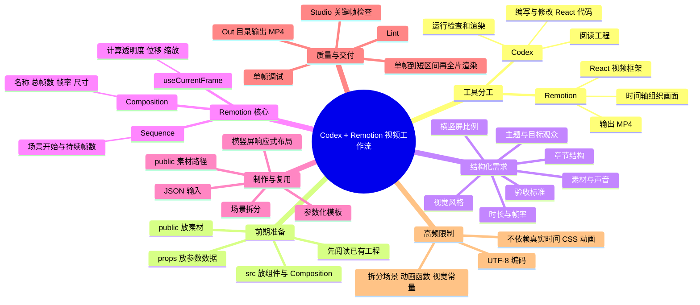
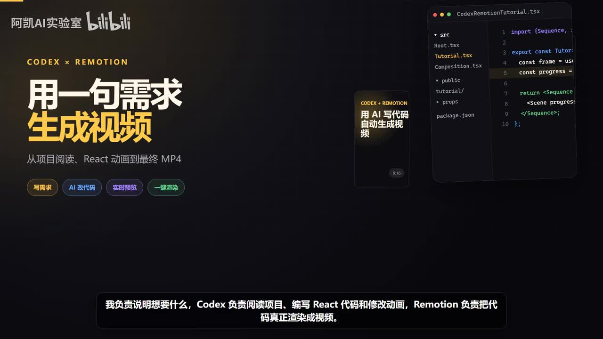
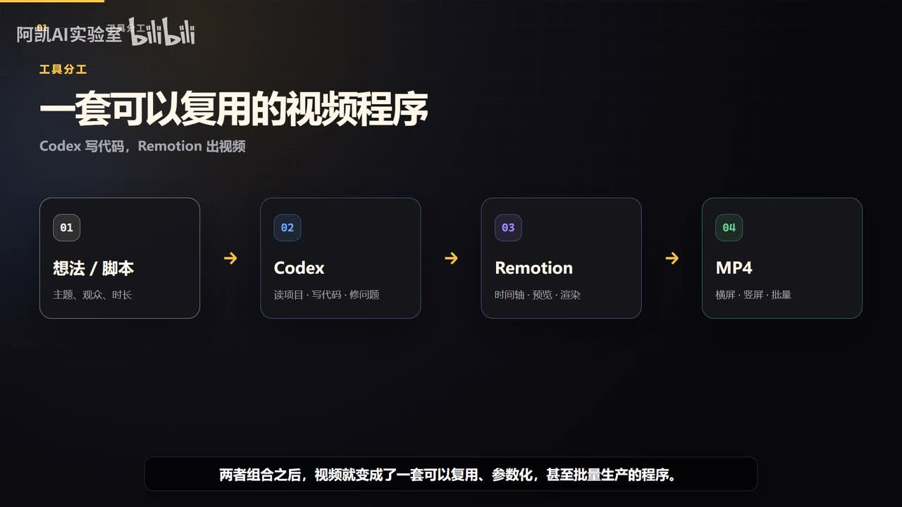
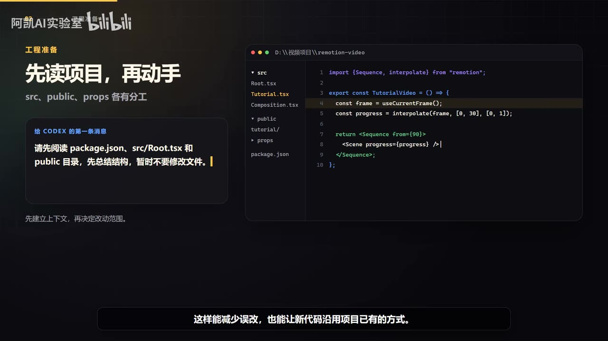

# 不会剪辑也能做视频？Codex + Remotion 零基础实战教程｜AI生成动画视频

> 来源：[Bilibili 视频](https://www.bilibili.com/video/BV1y7Ev6pEyg)  
> UP 主：阿凯AI实验室｜时长：约 391 秒（6 分 31 秒）｜分辨率：1920×1080  
> 标签：AI 教程、视频制作、AI 编程、AI 视频、Codex、Remotion

## 小结

这是一套用 **Codex + Remotion** 制作程序化动画视频的入门工作流：创作者负责把想法写成可执行的结构化需求；Codex 负责阅读已有工程、编写或修改 React 代码、运行检查与渲染；Remotion 则把组件、素材、音频和动画按时间轴渲染为最终 MP4。

视频的核心不是“用一句模糊指令直接生成成片”，而是将视频生产拆为可验证的工程过程：**先读项目，再明确需求；先小步修改，再预览和单帧检查；最后进行区间与全片渲染**。这使视频不仅可制作一次，也能通过参数化改造成可复用模板。

理解 Remotion 的最低概念门槛包括三项：`Composition` 定义视频规格，`useCurrentFrame` 提供当前帧以计算动画，`Sequence` 负责安排场景的起点与持续帧数。视频明确给出换算示例：在 **30 fps** 下，第 **90 帧** 对应第 **3 秒**。

实践中最关键的经验是避免把 AI 当作“直接重写项目”的黑盒。应先要求 Codex 阅读 `package.json`、`src/Root.tsx` 和 `public` 目录，明确既有结构与改动范围；发现问题时，也要指明具体 `Composition`、具体帧、具体元素，而不是笼统地说“不好看”。

本视频没有报道外部新闻或发布新的产品政策，内容属于工具组合与工作方法教程。其涉及的 Codex、Remotion API、命令行参数、依赖版本及 Studio 界面可能在视频发布后变化；视频未展示可直接复制的完整项目代码、实际命令、安装流程或性能基准，因此这些内容不能从本片进一步推导。

## 思维导图

## 目录

- [定位：把视频制作变成可复用程序](#定位把视频制作变成可复用程序)
- [工程准备与需求结构化](#工程准备与需求结构化)
- [Remotion 的三个核心概念](#remotion-的三个核心概念)
- [确定性动画与场景编排](#确定性动画与场景编排)
- [素材、横竖屏与模板参数化](#素材横竖屏与模板参数化)
- [检查、调试与最终渲染](#检查调试与最终渲染)
- [高频问题、适用范围与限制](#高频问题适用范围与限制)
- [字幕比对](#字幕比对)
- [评论分析](#评论分析)
- [处理记录](#处理记录)

## [定位：把视频制作变成可复用程序](https://www.bilibili.com/video/BV1y7Ev6pEyg?t=0)

视频开头提出的制作方式并非在传统剪辑软件中逐帧手工编辑，而是让需求、React 代码与渲染器协同工作。叙述者给出的分工如下：

| 环节 | 视频中的职责 |
| --- | --- |
| 创作者 | 说明“想要什么”，即提供视频目标与需求。 |
| Codex | 阅读项目、编写 React 代码、修改动画，并可执行检查和渲染命令。 |
| Remotion | 将代码实际渲染为视频。 |
| 最终产物 | 可直接播放或上传的 MP4；可进一步输出横屏、竖屏版本。 |

> 图：画面以“用一句需求生成视频”为标题，展示 Codex、Remotion、代码编辑器与手机竖屏成片的关系。其价值在于直观说明本片的目标是“需求—代码—渲染”的工作流，而不是讲解传统时间线剪辑。

视频将这套组合概括为“可复用、参数化、甚至可批量生产的程序”。这个判断的前提是：视频内容、样式、时长、开关等信息被拆成可传入的数据，而动画和场景结构保留在可复用组件中；仅把一次性文案写死在单个组件里，仍然可以产出视频，但不具备完整的模板化价值。

> 图：该关键帧将流程明确拆为“想法/脚本 → Codex → Remotion → MP4”，并标注 MP4 可面向横屏、竖屏与批量场景。它补充了口述中“视频是一套程序”的具体流程位置。

## [工程准备与需求结构化](https://www.bilibili.com/video/BV1y7Ev6pEyg?t=50)

### 先理解工程，避免一开始重写

视频展示的 Remotion 工程约定为：

| 位置 | 视频说明的用途 |
| --- | --- |
| `src` | 放置视频组件与 `Composition`。 |
| `public` | 放置图片、音频等素材。 |
| `props` | 放置参数化渲染所需的数据。 |
| `package.json` | 应由 Codex 先阅读，用于理解项目配置与依赖。 |
| `src/Root.tsx` | 应由 Codex 先阅读，用于理解视频根入口与 Composition 注册方式。 |

建议给 Codex 的第一步不是“直接改”，而是要求其阅读 `package.json`、`src/Root.tsx` 以及 `public` 目录，先总结现有结构，暂不修改文件。视频给出的收益是：减少误改，并让新代码沿用项目原本的组织方式。

> 图：画面列出 `src`、`public`、`props` 与 `package.json`，并给出“先阅读 package.json、src/Root.tsx 和 public 目录，先总结结构，暂时不要修改文件”的提示。这是将抽象建议转化为可执行首轮指令的关键帧。

### 用七项信息把模糊创意变成可执行需求

视频认为 AI 制作视频最容易出问题的环节不是代码本身，而是需求过于模糊。例如“帮我做个高级视频”没有足够的执行信息。

画面与讲述共同指向以下七项需求内容：

1. **主题与目标观众**：视频讲什么、给谁看。
2. **时长与帧率**：需要多长，以及帧率要求。
3. **横屏/竖屏比例**：目标画布方向与比例。
4. **章节结构**：分成多少部分、各部分承担什么内容。
5. **视觉风格**：整体视觉与排版方向。
6. **素材与声音**：已有图片、音频、旁白、字幕或需要处理的素材。
7. **验收标准**：最终如何判断完成，例如需要何种输出、是否需多版本。

视频的结论是：需求越具体，Codex 的第一次交付越接近成片。这里的“接近”是工作经验判断，不等同于保证首次生成就无需人工检查。

> 图：左侧展示“帮我做个高级视频”的模糊需求，右侧列出七项可执行规格。该图比 ASR 更精确地确认了第二项为“时长与帧率”、第六项为“素材与声音”。

## [Remotion 的三个核心概念](https://www.bilibili.com/video/BV1y7Ev6pEyg?t=112)

视频用三个概念建立阅读 Remotion 项目的基础。

### 1. `Composition`：一条视频的规格

`Composition` 相当于一条视频的规格声明，决定：

- 名称；
- 总帧数；
- 帧率；
- 画面尺寸。

因此，它既约束视频时长，也决定画布的输出规格。视频没有给出具体的宽高、总帧数或 Composition ID，不能据此补写某个固定配置。

### 2. `useCurrentFrame`：以当前帧驱动动画

`useCurrentFrame` 会告诉组件当前播放到第几帧。视频说明可依据这个帧编号计算：

- 透明度；
- 位置；
- 缩放。

其关键思想是：视频渲染中的每一帧都应得到确定结果。与依赖浏览器真实时间推进的网页动画不同，Remotion 应用当前帧计算视觉状态，从而使预览与最终渲染的结果可复现。

### 3. `Sequence`：安排场景时间

`Sequence` 用于安排一个场景：

- 从哪一帧开始；
- 持续多少帧。

视频给出明确换算：**30 帧/秒时，第 90 帧就是第 3 秒**。该例可推广为：

\[
\text{秒数} = \frac{\text{帧数}}{\text{fps}}
\]

但实际项目中应以 Composition 设置的真实 fps 为准，不能默认所有项目都是 30 fps。

## [确定性动画与场景编排](https://www.bilibili.com/video/BV1y7Ev6pEyg?t=150)

### 用帧计算动画，不依赖真实时间

视频将动画思路概括为：把第 0 至第 30 帧映射为 0 至 1 的进度值，再将同一个进度用于透明度与位移。其目的不是提供一段固定代码，而是说明动画应由可重复计算的帧进度驱动。

关键约束包括：

- **设置 Clamp（钳制）**：避免帧数超过动画区间后数值继续增长。
- **采用缓出的贝塞尔曲线**：入场动画通常比线性移动更自然。
- **每帧确定性**：不要让渲染效果依赖当前真实时间，否则预览与导出可能不一致。

视频所述“0—30 帧映射到 0—1”是示例区间，并非所有动画必须使用 30 帧；动画长度需要根据 fps、镜头节奏与内容量设定。

### 场景化拆分，而非单一巨大组件

视频建议不要把整条视频写成一个超大的组件，而是拆成多个场景，例如：

1. 开场；
2. 解释；
3. 演示；
4. 结果；
5. 结尾。

拆分后，再为每一个场景分配时间。这样做有两层意义：

- 时间安排可由 `Sequence` 明确表达；
- 修改局部场景时，不必在整条视频中寻找耦合的逻辑。

这也是后文“改一个地方全片都乱”时，建议拆分场景、动画函数与视觉常量的结构基础。

## [素材、横竖屏与模板参数化](https://www.bilibili.com/video/BV1y7Ev6pEyg?t=196)

### 素材统一进入 `public`，路径保持一致

视频建议将图片和音频统一放入 `public` 目录：

- 图像使用 `Img`；
- 声音使用 `Audio`；
- 路径通过 `staticFile` 生成。

其直接目的，是让本地预览和最终渲染共享同一套素材路径，减少“预览能找到素材、渲染时找不到”的环境差异。视频未提供具体素材文件名与导入代码，因此不能据此推断其完整目录结构。

### 一个视频组件，适配横屏与竖屏

同一视频组件可以注册为横屏、竖屏两个 `Composition`。但视频强调，关键不是把全部内容统一缩小，而是：

1. 读取画布宽高；
2. 根据长宽比例切换布局；
3. 分别处理横竖屏的文字、图片和字幕空间。

视频列出的适配方向如下：

| 横屏倾向 | 竖屏倾向 | 两种版本都需调整的内容 |
| --- | --- | --- |
| 左右分栏 | 上下堆叠 | 字号、边距、图片裁切、字幕安全区 |

这样，在内容不变的前提下，可以面向横屏平台与短视频平台分别输出版本。视频没有提供各平台的具体安全区像素值，也没有定义固定的横竖屏分辨率。

### 参数化模板：从单条视频走向批量输出

如果仅制作一条视频，写死文案也可以完成任务；但视频认为 Remotion 更有价值的使用方式是模板化。视频提到可借助 **Zod** 定义：

- 标题；
- 字幕；
- 颜色；
- 开关；
- 时长。

随后，Studio 可以自动生成参数面板；命令行渲染时也可以传入 JSON。由此，批量制作产品介绍、数据周报或口播包装时，主要替换数据，而不是反复重写动画。

需要注意：视频仅说明了“可传入 JSON”，没有展示实际命令、JSON 字段结构、Zod schema 或默认值。因此，实践时应以当前 Remotion 与项目依赖的官方文档、实际版本为准。

## [检查、调试与最终渲染](https://www.bilibili.com/video/BV1y7Ev6pEyg?t=277)

### Codex 写完代码后仍需质量检查

视频明确表示：Codex 完成代码不代表视频制作结束。建议的检查顺序为：

1. 运行 **Lint**；
2. 在 **Remotion Studio** 中检查：
   - 第一帧；
   - 场景切换点；
   - 文字最多的画面；
   - 最后一帧；
3. 若发现问题，说明准确位置与现象；
4. 使用单帧渲染快速反复调试。

反馈给 Codex 时，视频反对只说“不好看”，而应描述：

- 哪个 `Composition`；
- 哪一帧；
- 哪个元素；
- 出现了什么问题。

这种反馈方式将审美问题转换成可定位、可修改、可验证的工程问题。

### 从单帧到短区间，再到完整成片

预览确认后，视频推荐按以下顺序渲染：

1. **单帧渲染**：确认关键视觉状态；
2. **短区间渲染**：检查局部动画、转场和音画关系；
3. **完整渲染**：输出最终成片。

渲染速度受以下因素影响：

- 分辨率；
- 视频时长；
- 素材；
- 电脑性能。

完成后，MP4 会出现在 `out` 目录，可直接播放或上传。视频未给出硬件规格、单帧耗时、全片耗时或编码参数，因此不能将其表述为性能承诺。

## [高频问题、适用范围与限制](https://www.bilibili.com/video/BV1y7Ev6pEyg?t=332)

### 三类高频问题

| 问题 | 视频建议 | 背后原因 |
| --- | --- | --- |
| 中文乱码 | 脚本、JSON、字幕文件统一使用 UTF-8 编码。 | 多类文本文件编码不一致可能导致字符显示异常。 |
| 预览正常、渲染异常 | 不使用依赖真实时间的 CSS 动画；所有效果由帧计算。 | 确保每一帧有确定输出，降低预览与导出的差异。 |
| 改一处导致全片混乱 | 分开场景、动画函数与视觉常量；让 Codex 每次只改明确范围。 | 降低组件耦合与无关改动的风险。 |

视频最后给出的正确节奏是：**先读，再计划，再小步修改，最后验证**。

### 适用范围

这套方法更适合以下内容形态：

- 产品介绍；
- 数据周报；
- 口播包装；
- 知识类动画视频；
- 需要横竖屏复用的内容；
- 有稳定版式、文案或数据替换需求的批量视频。

它更偏向“程序化、组件化、可复用”的制作路线。对于高度依赖手工镜头语言、复杂非线性剪辑、实时拍摄调色、逐镜头人工特效合成的项目，视频并未证明该流程可以完全替代专业剪辑与后期工具。

### 时效性与未展示内容

- 本片时长约 6 分 31 秒，重点讲工作流与原则，不是 Remotion 的完整开发课程。
- 站内描述称视频本身由 Codex + Remotion 制作；这属于发布者的自述，素材中未附工程仓库或可复现项目以独立验证。
- Codex、Remotion、Zod、Studio 的版本、接口和安装步骤可能会发生变化。
- 视频未展示完整安装命令、代码仓库、提示词全文、渲染 CLI、具体帧率配置、音频混音参数或版权处理流程。
- 素材版权、音乐授权、旁白来源、平台审核规范等发布环节没有展开，实际发布时仍需自行核验。

## 字幕比对

| 字幕来源 | 完整性 | 专有名词 | 时间轴 | 主要问题 |
| --- | --- | --- | --- | --- |
| Bilibili 站内字幕 | 未提供可用站内字幕，无法比对。 | 无法判断。 | 无法判断。 | 素材明确标注“未提供可用站内字幕”。 |
| 本次 ASR 字幕 | 较完整：55 段，覆盖约 319.61 秒语音；首段 0 秒、末段 385.49 秒。 | 存在多处语音识别误写。 | 有真实 SRT 起止时间，可用于章节时间轴。 | 个别技术词、目录名、编码名和“帧”等词识别不准确。 |

本次处理检查了 ASR 结果。诊断显示音频语言为中文，置信度约 **0.9921875**，ASR 带时间戳；素材中没有 `noAudioStream=true` 标记，因此本视频存在可供识别的音轨，并非无音轨源视频。

由于没有可用站内字幕，正文以本次 ASR 的真实时间段作为时间轴依据，并结合关键帧画面、上下文对以下关键术语做了校正：

| ASR 原文或近似识别 | 正文采用 | 校正依据 |
| --- | --- | --- |
| “一帧一帘”“每一帘” | 一帧一帧、每一帧 | Remotion 视频渲染语境与上下文。 |
| “代砍” | 代码 | 前后均在讨论 React 代码与渲染。 |
| “Public Mood” | `public` 目录 | 关键帧展示目录名为 `public`，且语义为素材目录。 |
| “Zet” | Zod | 参数 schema、Studio 参数面板与 JSON 输入的上下文。 |
| “Lin” | Lint | 视频明确讨论代码检查步骤。 |
| “UDF8” | UTF-8 | 常见文本编码名称。 |
| “横平”“竖平” | 横屏、竖屏 | 视频主题为横竖屏视频版本适配。 |
| “编剧” | 边距 | 横竖屏布局调整语境；此处为基于上下文的校正。 |
| “数损” | 数据 | 批量替换内容的上下文。 |
| “缓出的贝塞尔曲线” | 缓出的贝塞尔曲线 | 语义通顺，保留原意。 |

ASR 适合提供时间定位，但对于技术专有名词仍需结合画面与上下文复核；正文未将无法从素材确认的内容扩展为事实。

## 评论分析

仅处理可获取的热评前三条。当前可获取评论数为 3 条，互动量整体较低，不能视为广泛用户共识。

1. **阿凯AI实验室（2 赞）**  
   评论提供了两个链接：Remotion 官网 `https://www.remotion.dev/`，以及 Remotion GitHub 地址 `https://github.com/remotion-dev/remotion`，并称后者为“AI Skills 模型安装地址”。  
   - **补充价值**：官网与 GitHub 仓库可作为进一步查找 Remotion 文档、源码和安装信息的入口。  
   - **可信度边界**：链接由视频发布者本人提供，但本次素材未对链接内容、可用性或“AI Skills 模型安装地址”这一说法进行访问验证；不应据此直接推断具体安装步骤。

2. **一键AI笔记侠（0 赞）**  
   评论表示已将视频总结放入评论区，并私信发送给另一位用户。  
   - **补充价值**：反映有人尝试为视频做笔记整理。  
   - **可信度边界**：评论中未包含实际总结内容，也未提供可核验的技术信息，因此不构成对视频内容的实质补充。

3. **黄豆花生s（0 赞）**  
   评论请求另一位用户“总结视频内容，输出笔记”。  
   - **补充价值**：说明观众存在笔记化、结构化学习的需求。  
   - **可信度边界**：这是请求而不是观点、经验或技术结论，不能作为对 Codex 或 Remotion 效果的评价。

## 处理记录

- Worker ID：`worker-mrj0www4-e8d79408`
- 模型：`gpt-5.6-terra`
- 已使用的素材处理结果：视频元数据、关键帧清单、音频 ASR 结果、ASR SRT 时间轴、热评前三条。
- ASR 工具信息：`medium` 模型，中文识别，CUDA，`float16`；ASR 结果包含时间戳。
- 字幕选择：站内字幕未提供可用版本；已检查本次 ASR，并以其 SRT 的真实起止时间作为章节链接依据。对技术词误识别处，以关键帧与上下文校正，但不改写时间轴。
- 关键帧选择依据：
  - `frames/frame-001.jpg`：展示“需求—代码—渲染—MP4”的开场目标；
  - `frames/frame-002.jpg`：展示 Codex 与 Remotion 的分工流程；
  - `frames/frame-003.jpg`：展示工程目录及“先读项目”的首轮提示；
  - `frames/frame-004.jpg`：展示七项结构化需求，能核对 ASR 中的模糊词。
- 未选用其余关键帧：提供的素材仅列出路径、未附相应画面内容；为避免对未展示画面编造解释，正文仅引用已提供可见内容的关键帧。
- 缓存清理：素材清单未提供缓存清理命令或执行结果；本记录不声称已执行清理。
- 未解决问题：未提供完整源码、实际提示词全文、安装/渲染命令、依赖版本、详细音频与素材授权信息；这些部分无法由现有素材确认。
