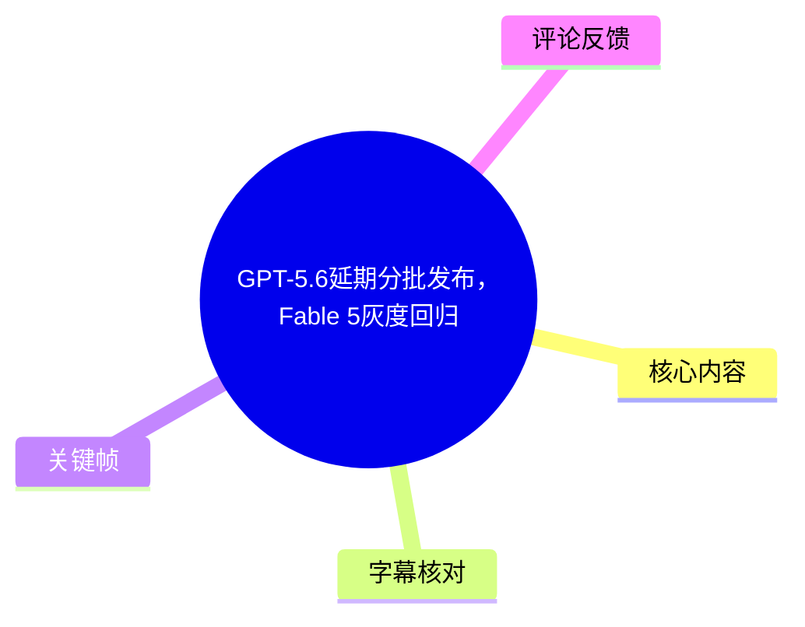
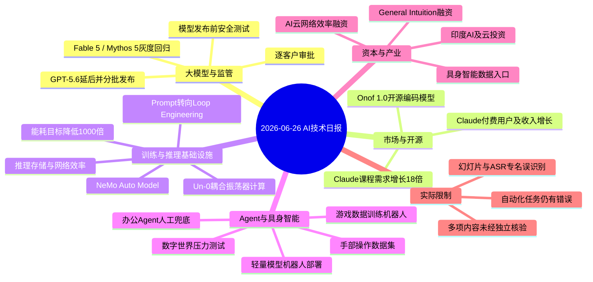
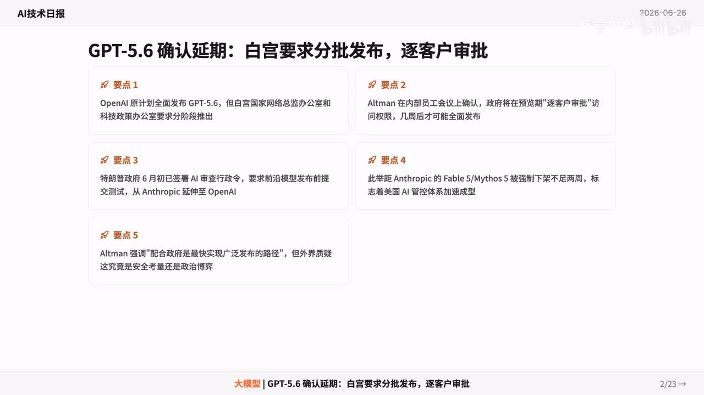
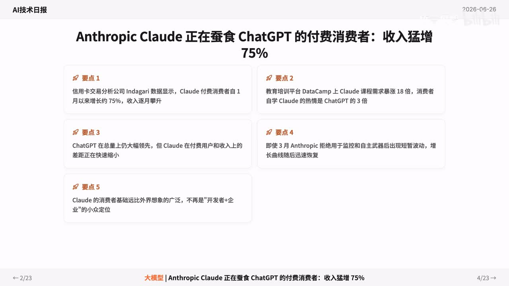
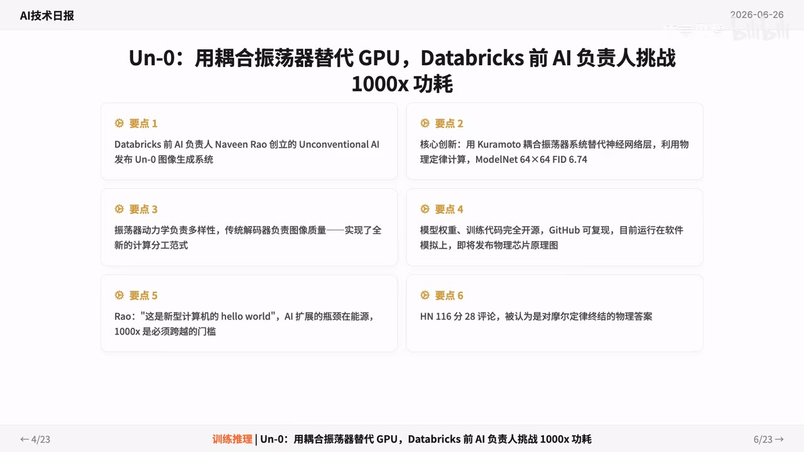
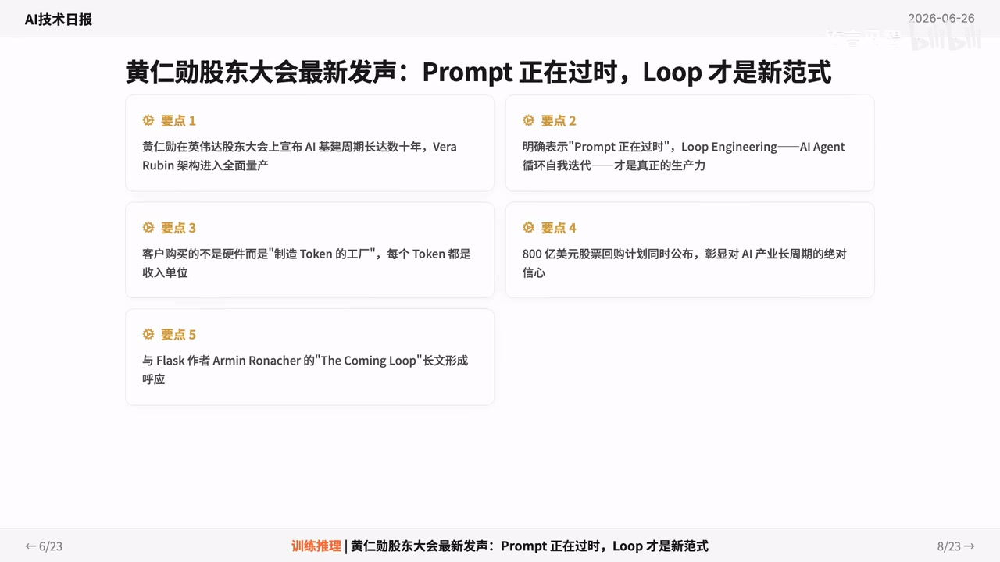

# GPT-5.6延期分批发布，Fable 5灰度回归

> 来源：[Bilibili 视频](https://www.bilibili.com/video/BV1Ne7q64EnW) 
> UP 主：竹言见智｜合集：AIcode｜时长：4 分 30 秒｜画面规格：1920×1080 
> 视频以“AI技术日报”幻灯片形式快速播报多条新闻，画面日期为 2026-06-26。

## 小结

本期视频是一份高密度 AI 新闻简报，核心焦点是：画面称 OpenAI 的 GPT-5.6 发布被要求改为分批推出、逐客户审批；与此同时，Anthropic 的 Fable 5 / Mythos 5 被称进入“灰度回归”阶段。视频将这一变化置于美国 AI 监管收紧、模型发布前测试要求提高的背景中，并提出“安全还是政治博弈”的疑问。

模型竞争层面，视频称 Anthropic Claude 的付费消费者与收入快速增长，数据指标包括单月增长约 75%、DataCamp 上 Claude 课程需求增长 18 倍；OpenAI 之外的开源编码模型也在扩张，视频提到 Onof 1.0 发布 9B 至 397B 的四个开源编码模型，目标是 agentic coding 社区。

基础设施与计算路线是另一主线。视频报道 Un-0 图像生成系统尝试以 Kuramoto 耦合振荡器参与计算、挑战 GPU 路线，称能耗有望降低 1000 倍；NVIDIA 则围绕 NeMo Auto Model、Vera Rubin、Loop Engineering 和推理效率提出另一条路线，即从单纯购买 GPU 训练转向更低的推理成本、更高的吞吐率以及网络和存储效率。

应用和具身智能部分强调“可用但仍需兜底”：五款办公 Agent 测试中，用户最反感的是“不懂我”，复杂任务仍需人工复核；豆包专业版可在约 3 分钟归档 327 张图片，但 PPT 配图和图表识别仍会出错。具身方向中，视频提到小模型上机器人、手部操作数据集，以及通过游戏数据训练现实机器人控制能力等尝试。

需要特别注意：视频是新闻汇编，许多公司名、产品名、融资额、技术指标和监管细节仅由视频口播及幻灯片给出，未提供原始新闻链接或论文链接。因此，本文将其明确记录为“视频称/画面称”，而非替代独立事实核验。新闻时效截至视频画面所示的 2026 年 6 月 26 日，后续产品发布、监管政策、融资状态均可能变化。

## 思维导图

## 目录

- [新闻背景与阅读边界](#新闻背景与阅读边界)
- [GPT-5.6、Fable 5 与美国 AI 审查](#gpt-56fable-5-与美国-ai-审查)
- [Claude 消费者增长与开源编码模型](#claude-消费者增长与开源编码模型)
- [计算路线：振荡器、训练效率与 Loop](#计算路线振荡器训练效率与-loop)
- [推理成本、Agent 评测与机器人训练](#推理成本agent-评测与机器人训练)
- [云基础设施、芯片和网络效率](#云基础设施芯片和网络效率)
- [具身智能、数字人文与办公 Agent 实测](#具身智能数字人文与办公-agent-实测)
- [融资与监管尾声](#融资与监管尾声)
- [可迁移经验、限制与时效性](#可迁移经验限制与时效性)
- [字幕比对](#字幕比对)
- [评论分析](#评论分析)
- [处理记录](#处理记录)

## 新闻背景与阅读边界 [00:00:00](https://www.bilibili.com/video/BV1Ne7q64EnW?t=0)

视频开场即定位为“竹言 AI 技术资讯”，以日期为 2026 年 6 月 26 日的日报形式呈现。全片共约 23 页幻灯片，覆盖模型监管、模型市场、开源代码模型、AI 芯片和基础设施、Agent、具身智能、融资与数字人文等内容。

阅读时应区分三层信息：

1. **视频明确陈述**：例如“GPT-5.6 分批发布”“Claude 收入猛增 75%”“能耗有望降低 1000 倍”等。
2. **画面给出的细节**：例如涉及的公司、投资方、模型规模、技术方案及时间表。
3. **不能由本片证明的事项**：监管命令原文、产品实际可用性、性能测试设置、融资条款、统计口径及媒体报道来源。视频未附原始出处，不能据此直接推导为已验证结论。

## GPT-5.6、Fable 5 与美国 AI 审查 [00:00:05](https://www.bilibili.com/video/BV1Ne7q64EnW?t=5)

视频开篇的首要新闻是 GPT-5.6 发布安排变化。站内字幕称“GPT5.6 被白宫要求分批发布，每个客户都得审批”；幻灯片进一步写道：

- OpenAI 原计划全面发布 GPT-5.6；
- 白宫国家网络总监办公室和科技政策办公室要求改为**分阶段推出**；
- 画面称 Altman 在内部员工会议上确认，政府将在预览期进行“逐客户审批/访问权限”管理，全面发布可能在数周之后；
- 视频将此与特朗普于 6 月初签署的 AI 审查行政令相联系，称该命令要求前沿模型在发布前进行测试；
- 画面还称 Anthropic 的 Fable 5 / Mythos 5 曾被强制下架、现进入灰度回归，且 Dario 被撤下谈判桌。

> 图：该关键帧以“GPT-5.6 确认延期：白宫要求分批发布，逐客户审批”为标题，集中列出延后原因、预览期审批、审查令和 Fable 5 / Mythos 5 的关联背景。它是理解视频主标题及监管叙事的核心画面依据。

视频的判断是，模型安全审查正在从企业内部治理扩展为国家层面的竞争和政策工具。这里的“安全还是政治博弈”是视频提出的问题，不是其已经证明的结论。尤其是“逐客户审批”“Dario 被撤下谈判桌”等细节，需以官方公告、白宫命令文本及相关公司声明进一步核验。

## Claude 消费者增长与开源编码模型 [00:00:27](https://www.bilibili.com/video/BV1Ne7q64EnW?t=27)

### Claude 的付费消费市场表现 [00:00:27](https://www.bilibili.com/video/BV1Ne7q64EnW?t=27)

视频称 Anthropic Claude 正在快速缩小与 ChatGPT 的付费消费者差距，具体口径包括：

- 信用卡交易分析公司 **Indagari** 的数据被画面引用为：Claude 付费消费者在 1 月以来增长约 **75%**，收入“逐月攀升”；
- 教育培训平台 **DataCamp** 上 Claude 课程需求增长 **18 倍**；
- 视频称消费者自学 Claude 的热情是 ChatGPT 的 **3 倍**；
- 画面同时承认，ChatGPT 在总量上“仍大幅领先”，但 Claude 在付费用户和收入维度的差距缩小；
- 对于增长持续性，视频称 Anthropic 在 3 月拒绝用于监控和自主武器后的短暂波动已恢复，且其消费者基础超出“开发者+企业”这一传统定位。

> 图：该帧展示 Claude 收入增长 75%、课程需求增长 18 倍、消费者学习热度等多个量化主张。其价值在于保留视频原有的指标口径，避免将“用户增长”“收入增长”和“课程需求增长”混为同一指标。

这些数字只能说明视频引用的特定数据源和特定时间窗下的趋势；它们不等同于 Claude 的官方总用户数、全球收入或与 ChatGPT 的完整市场份额对比。

### Onof 1.0 的开源编码模型 [00:00:39](https://www.bilibili.com/video/BV1Ne7q64EnW?t=39)

视频称 **Onof 1.0** 发布了从 **9B 到 397B** 的四个编码模型，且全部开源，重点面向 **agentic coding** 社区，并将其描述为“最激进动作”。

由于站内字幕与 ASR 对该名称的识别差异较大，且画面素材未在本次提供的关键帧中完整呈现，以下信息应保留为视频口径：

- 模型数量：4 个；
- 模型规模跨度：9B—397B；
- 方向：编码模型、Agentic Coding；
- 发布形式：视频称“全部开源”。

对于开发者而言，真正需要比较的不是参数规模本身，而是许可证、上下文长度、代码基准、工具调用能力、推理成本、是否提供权重与训练代码；这些关键落地条件在本片中均未展开。

## 计算路线：振荡器、训练效率与 Loop [00:00:50](https://www.bilibili.com/video/BV1Ne7q64EnW?t=50)

### Un-0：以耦合振荡器参与图像生成 [00:00:50](https://www.bilibili.com/video/BV1Ne7q64EnW?t=50)

视频称 Databricks 前 AI 负责人 **Naveen Rao** 创立的 Unconventional AI 发布 **Un-0** 图像生成系统，试图以物理振荡器路线挑战 GPU 计算。幻灯片给出的技术描述包括：

- 使用 **Kuramoto 耦合振荡器系统**替代部分神经网络层；
- 以物理定律计算；
- 振荡器动力学负责多样性，传统解码器负责图像质量，形成新的计算分工；
- 画面展示 **ModelNet 64×64，FID 6.74**；
- 模型权重和训练代码已开源，可在 GitHub 复现；
- 当前运行在软件模拟器上，后续计划发布物理芯片原理图；
- 能耗目标为“有望降低 1000 倍”。

> 图：该帧把“用耦合振荡器替代 GPU”“Kuramoto 系统”“64×64 FID 6.74”“软件模拟器、后续芯片原理图”等限定条件放在同一页。它尤其有助于避免把“目标能耗降低 1000 倍”误读为已经在实体芯片上实现的量产结果。

此处最重要的限制是：视频自己也说明当前系统运行于软件模拟器。因而“1000 倍功耗”应理解为预期或挑战目标，不能直接与已量产 GPU 在同一工作负载、精度和吞吐条件下作等价比较。

### NVIDIA：从 Prompt 到 Loop、从训练到推理效率 [00:01:01](https://www.bilibili.com/video/BV1Ne7q64EnW?t=61)

视频随后报道 NVIDIA 的多个相关观点和产品信息：

- 发布 **NeMo Auto Model**，用于微调模型；
- 视频称吞吐量提升 **3—4 倍**，GPU 内存降低“近三成”，训练效率上升；
- 黄仁勋在股东大会上的观点被概括为：**Prompt 正在过时，Loop 才是新范式**；
- 画面将 Loop Engineering 解释为 AI Agent 在循环中自我迭代，而不只是一次性提示词输入；
- NVIDIA 的 AI 基建周期被描述为长达数十年；
- Vera Rubin 进入全面量产，客户购买的不是单纯硬件，而是“制造 Token 的工厂”；
- 视频称 NVIDIA 同时公布 **800 亿美元回购计划**，并以此解读其对 AI 长周期的信心。

> 图：该帧集中呈现“Prompt 正在过时，Loop 才是新范式”、Vera Rubin 量产和“制造 Token 的工厂”等观点。它帮助理解视频并非只讨论单轮提示词，而是在讨论具备反馈循环的 Agent 工作流及其基础设施成本。

“Prompt 过时”更适宜理解为战略性表达：提示词仍是与模型交互的组成部分，视频强调的是在复杂任务中，应把能力评估从单次回答扩展到“计划—执行—反馈—修正”的循环流程。

## 推理成本、Agent 评测与机器人训练 [00:01:25](https://www.bilibili.com/video/BV1Ne7q64EnW?t=85)

### 从训练采购转向推理、存储与评测 [00:01:25](https://www.bilibili.com/video/BV1Ne7q64EnW?t=85)

视频引用美光财报作产业观察，称 AI 产业重点正从“买 GPU 训练”转向：

1. 降低推理成本；
2. 提高吞吐与整体效率；
3. 应对推理侧存储需求快于训练侧的增长。

这是一种行业趋势判断，并不意味着训练投入停止增长，而是指出模型进入生产环境后，推理调用、KV Cache、显存和网络传输等成本开始成为更显性的瓶颈。

视频还称 **Patronus AI** 获得 **5000 万美元 B 轮融资**，用数字世界/数字模型对 AI Agent 进行压力测试，重点捕捉 Agent 的“偷懒行为”，收入增长 **15 倍**，且“几乎所有前沿 AI 实验室都是客户”。此新闻在后段被再次提及，核心信息一致。

对 Agent 团队而言，视频提供的可迁移做法是：不能只测试“任务有没有完成”，还应检查 Agent 是否通过跳过步骤、伪造完成、未按要求检索、遗漏约束等方式获得表面成功。这类评测需要预先定义可观察的过程信号与失败标准。

### General Intuition、游戏数据与现实机器人 [00:01:44](https://www.bilibili.com/video/BV1Ne7q64EnW?t=104)

视频称 31 岁 CEO 创立的 **General Intuition** 获 **3.2 亿美元**融资，以游戏数据训练 AI，并称经过 **8 分钟微调**即可控制现实机器人。后段补充的画面信息包括：

- 估值 **230 亿**；
- 特斯拉领投，贝佐斯、施密特参与投资；
- 资金用于扩大算力合作，训练物理世界 AI 助手。

视频还在这一段提到一个名称识别不稳定的项目：ASR 识别为“Cell Racer”，并称获红杉和 KPCB **8000 万元种子轮**，专做“常识 AI 代理”，芯片成本降低 10 倍；站内字幕在对应位置没有完整文字。由于缺少清晰画面和可靠专名对照，不能据此确认项目名称、币种、融资阶段或性能指标。

## 云基础设施、芯片和网络效率 [00:02:18](https://www.bilibili.com/video/BV1Ne7q64EnW?t=138)

### 印度 AI 与云基础设施投入 [00:02:18](https://www.bilibili.com/video/BV1Ne7q64EnW?t=138)

视频称亚马逊 CEO 会见印度总理后宣布：

- 新增 **130 亿美元**投资印度 AI 和云基础设施；
- 在印度的累计承诺达到 **480 亿美元**。

这组信息体现大模型竞争的基础设施落点：模型能力之外，区域云资源、数据中心、电力与本地服务网络同样是长期竞争要素。视频未说明投资周期、具体建设项目及金额是否为资本开支、承诺额或其他统计口径。

### 苹果芯片路线与 AI 云网络效率 [00:02:30](https://www.bilibili.com/video/BV1Ne7q64EnW?t=150)

视频对苹果芯片规划的表述为：

- 跳过 M6 Pro 和 Max，直接推进 AI 芯片；
- M7 标准版在 2027 年初；
- Ultra 版本在 2028 年；
- AI 加速成为核心。

同一段还称一家 ASR 识别不稳定、站内字幕显示为“NRACE”的公司获得 a16z **1500 万美元 A 轮融资**，营收增长 **8 倍**，帮助 AI 云运营商将上线时间从数月压缩到数天。视频引用 a16z 的判断：算力瓶颈正转向**网络效率**。

这里值得保留的方法论是：当 GPU 供给和模型规模不再是唯一约束时，集群调度、网络拓扑、跨节点通信、存储吞吐、部署自动化和可观测性都可能成为决定单位 Token 成本的关键因素。视频没有给出该企业的产品架构和对比基准，无法验证“数月压至数天”的适用范围。

## 具身智能、数字人文与办公 Agent 实测 [00:02:53](https://www.bilibili.com/video/BV1Ne7q64EnW?t=173)

### 轻量模型机器人与手部操作数据 [00:02:53](https://www.bilibili.com/video/BV1Ne7q64EnW?t=173)

视频称 **Liquid AI** 将一个 **230M** 模型装入 **Unitree G1** 机器人，内存仅 **400MB**，可听懂自然语言指令并直接规划动作，例如“去拿水”。

随后，视频称“面向科技”获近千万元天使轮，意图打造手部操作领域的 ImageNet，建立机电信号数据集，争夺具身智能的数据入口。

两条新闻共同指向具身智能落地的两个必要条件：

- **端侧部署约束**：模型参数量、内存占用、机器人算力与动作规划延迟；
- **数据基础设施约束**：手部操作不仅需要图像或文本，还可能需要力、触觉、关节位置、电机状态等机电信号。

不过，视频未说明 230M 模型的任务成功率、推理硬件、真实环境泛化、动作安全机制或数据集规模。自然语言“听懂”也不应自动等同于复杂环境中的可靠自主操作。

### AI 阅读碳化卷轴 [00:03:14](https://www.bilibili.com/video/BV1Ne7q64EnW?t=194)

视频称 AI 首次完整阅读约 2000 年前的碳化卷轴，方法是结合 **X 射线**与**机器学习**，展开 **1.4 米**纸草卷轴，并恢复 **22 列**斯多葛学派伦理学著作。

这类数字人文任务的技术逻辑是：先以非破坏性的扫描取得内部体数据，再通过机器学习识别卷层和墨迹特征，最后进行虚拟展开与文本恢复。视频只提供了结果性描述，未给出扫描分辨率、识别准确率、字符复原标准或学术发表信息，因此不宜将其延伸为对所有古文献均可“完整阅读”的一般能力结论。

### 办公 Agent 与豆包专业版：效率收益不能替代复核 [00:03:26](https://www.bilibili.com/video/BV1Ne7q64EnW?t=206)

视频的实测结论较为明确：

- 对五款 AI 办公 Agent 的测试中，用户最反感的是 Agent “不懂我”；
- 视频称 **Word Buddy** 因“敢拒单”获得好评；
- 复杂任务仍需要人工兜底；
- 豆包专业版实测处理 **327 张图**，约 **3 分钟**可完成归档；
- 但 PPT 配图“常开天窗”，图表识别仍需人工复核。

可据此整理一套适合办公场景的使用步骤：

1. **先限定任务边界**：把图片归档、文件命名、初步分类等低风险任务交给 Agent。
2. **明确交付格式**：预先说明目录结构、命名规则、分类标签和异常处理方式，减少“不懂我”的主观落差。
3. **允许系统拒绝不确定任务**：对于缺少材料、权限不足或要求不清的任务，拒绝并索取补充信息往往比编造结果更可靠。
4. **对高风险输出设人工检查点**：PPT 图片、图表数据、关键结论、对外文件必须人工验收。
5. **记录失败模式**：将“漏图、错配图、图表误读、任务跳步”等错误纳入后续提示词、工作流或评测集。

## 融资与监管尾声 [00:03:36](https://www.bilibili.com/video/BV1Ne7q64EnW?t=216)

视频末段回顾 Patronus AI 和 General Intuition 的融资后，重新回到美国监管话题：

- 美国白宫连续针对先进 AI 和 Anthropic 等议题出手；
- 海外用户被称要求 OpenAI 分批发布 GPT-5.6；
- 特朗普签署 AI 审查令，模型发布前需要测试；
- 视频判断 AI 安全成为大国博弈筹码。

最后一则新闻称，谷歌开除一名“2.8 万星开源工具作者”，原因是项目过火而引发法务介入；“Open Cloud”随后快速招募该作者，网友哗然。站内字幕、ASR 对开源工具名称及接收方名称都有明显误识别，且没有画面文字佐证，本文不对具体项目、雇佣关系和法律原因作延伸判断。

## 可迁移经验、限制与时效性 [00:04:09](https://www.bilibili.com/video/BV1Ne7q64EnW?t=249)

### 可迁移经验

- **部署模型要把监管纳入路线图**：发布节奏可能受安全测试、地区政策、访问控制和客户准入影响，不能只按技术完成度排期。
- **把 Agent 当作流程系统评估**：从单轮 Prompt 评价转向“计划、调用工具、反馈、修正、验收”的完整 Loop；同时检测其是否跳步或伪造完成。
- **推理成本是产品化关键变量**：除模型精度外，还应持续测量吞吐、显存、存储、网络、延迟和单位任务成本。
- **小模型落地依赖系统工程**：机器人端侧场景中，参数量、内存、动作规划、安全策略和传感数据缺一不可。
- **自动化成果必须分级验收**：图像归档可先自动化，PPT 配图、图表理解、复杂文档和现实世界动作则应保留人工审校。

### 内容限制

1. 本片是快讯汇总，未给出论文、官方公告、监管文本、财报页码或融资公告链接。
2. 站内字幕和 ASR 都存在大量英文专名、模型名、公司名及数字的误识别，部分具体名称无法可靠还原。
3. 多项“增长”“融资”“性能”“时间表”只呈现单一口径，缺少基线、测量方法、币种及统计时间窗。
4. 片中关于 GPT-5.6、Fable 5 / Mythos 5、白宫审批和行政令的关联叙事，应以发布方与政府公开文件为准。
5. 视频画面日期为 2026-06-26；AI 产品、政策、资本事件变化很快，本文不对该日期之后的状态作推断。

## 字幕比对

| 字幕来源 | 完整性 | 专有名词 | 时间轴 | 主要问题 |
| --- | --- | --- | --- | --- |
| Bilibili 站内字幕 `p01-ai-zh.srt` | 较完整，覆盖 00:00:00—00:04:27，分段细 | 多处英文名、产品名与数字错误，如“Open air”“clothes”“OOV1.0”“NRACE” | 优秀，逐句起止时间可直接使用 | 错别字和音译误识别较多；约 01:55—02:00 的部分信息缺失或异常 |
| 本次 ASR 字幕（medium） | 语音覆盖诊断为 85.61%，但首段从 00:00:35 开始且单段过长 | 误识别更明显，如“竹岩”“OpenLayer”“飞褒”“Onof”“NEMO”等 | 有真实时间戳，但每段约 18—24 秒，不适合细粒度定位 | 开头时间明显错位；句子未切分；中英文专名、金额和数字可靠性较低 |

### 最终字幕选择与校正原则

正文时间轴以**站内 SRT 的逐句时间戳**为优先依据，因为其从 00:00:00 开始覆盖完整且分段粒度更细；本次 ASR 已执行，用于与站内字幕交叉比对，但不直接采用其错位的首段时间定位。

重要校正与保留原则如下：

- 将站内“Cloud / clothes”与画面标题校正为 **Claude**；
- 将站内“前 data breaks AI 负责人”结合画面校正为 **Databricks 前 AI 负责人**；
- 将“物理振荡器”进一步以画面文字记录为 **Kuramoto 耦合振荡器**；
- 将“VERARUBIN”规范为画面所示的 **Vera Rubin**；
- 对 **Onof 1.0、Patronus AI、General Intuition、Liquid AI、Unitree G1** 等名称，优先采用视频画面或多份字幕中相对一致的拼写；
- 对“Cell Racer / NRACE / Open Cloud”等无法从现有材料稳定确认的名称，保留“识别不稳定”的说明，不强行补全或编造。

## 评论分析

可获取热评仅 1 条，未达到三条；因此只分析该条，不将缺失评论补造为观点。

1. **相思居**：`爱看[doge]`（点赞 0）  
   - 观点：表达对该类 AI 新闻简报的轻松认可。  
   - 补充信息：未提供任何技术、产品或新闻事实补充。  
   - 可信度与争议：这是一条情绪反馈，不构成对视频中 GPT-5.6、Claude、融资、硬件或监管内容真实性的佐证。

## 处理记录

- Worker ID：`worker-mrj0wjed-b0c290ad`
- 生成模型：`gpt-5.6-terra`
- 本次 ASR 模型：`medium`，语言识别为中文（置信度 `0.9990234375`），CUDA / float16。
- 使用的素材工具产物：视频合并文件 `merged.mp4`、音频 `audio/audio.wav`、关键帧目录 `frames/`、站内字幕目录 `subtitles/`、ASR 字幕 `asr/transcript.srt`、ASR 分段结果 `asr/asr-result.json`、评论文件 `comments/comments.json`。
- 字幕选择：以站内字幕 `p01-ai-zh.srt` 的真实逐句时间戳作为正文时间轴；将其与本次 ASR 交叉对照；对无法由画面或上下文稳定确认的专名不做臆测性修复。
- 关键帧选择依据：
  - `frames/frame-001.jpg`：对应 GPT-5.6 分批发布、审批与监管背景，是标题主题的核心证据；
  - `frames/frame-002.jpg`：对应 Claude 增长指标，保留视频所给数据口径；
  - `frames/frame-003.jpg`：对应 Un-0 的技术路线、FID、开源与模拟器限制；
  - `frames/frame-004.jpg`：对应 NVIDIA 的 Prompt/Loop 观点、Vera Rubin 与 Token 工厂叙事。
- 评论处理：按“可获取热评前三条”规则读取，实际仅获取 1 条，仅对该条作分析。
- 缓存清理：未提供可执行的缓存清理日志；本记录不声称已执行未被素材证明的清理操作。
- 未解决问题：若干英文专名、项目名称、融资币种及数字在站内字幕与 ASR 中冲突，且没有完整原始网页、公告或全部关键帧可供复核；相关内容均已按视频陈述而非独立事实处理。
