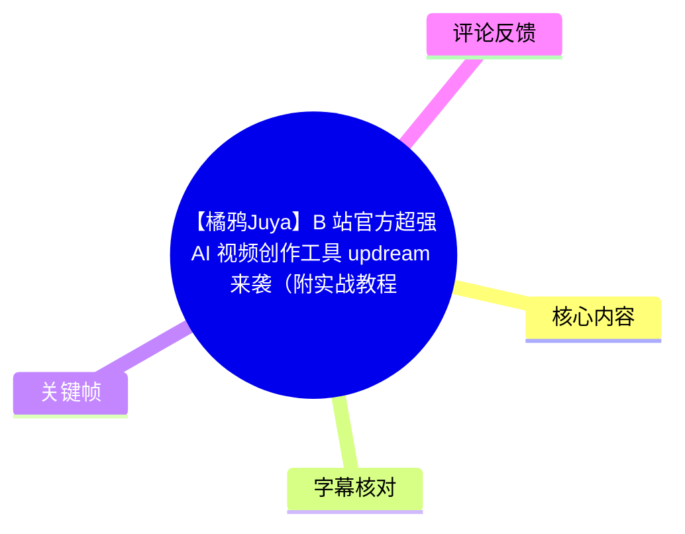
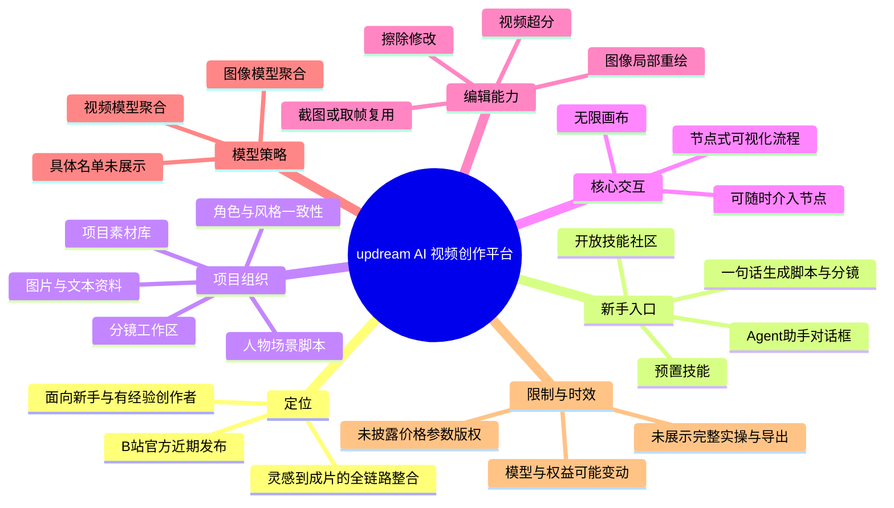
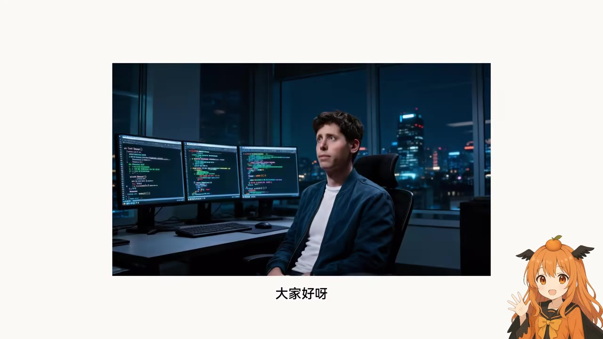
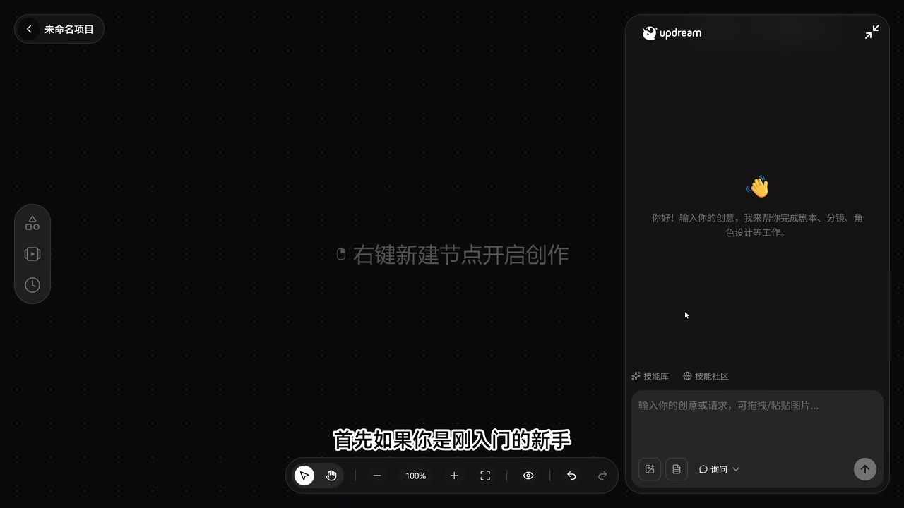
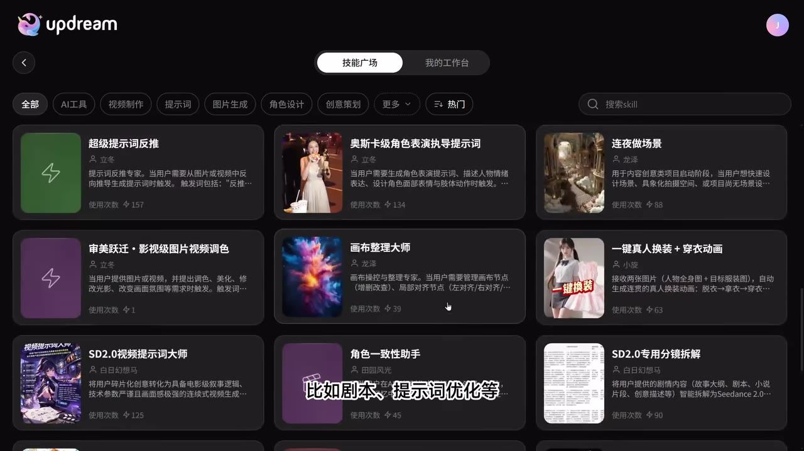

# 【橘鸦Juya】B 站官方超强 AI 视频创作工具 updream 来袭（附实战教程）！

> 来源：[Bilibili 视频](https://www.bilibili.com/video/BV17hRFBeEFb)  
> UP 主：橘鸦Juya ｜视频时长：3 分 05 秒｜标签：人工智能、AI、模型、教程、updream、LLM  
> 视频描述提供的工具地址：[updream.cn](https://www.updream.cn/)；描述中另附会员购买邀请码及额外积分信息，属于推广信息，应以平台当期页面为准。

## 小结

视频介绍了 B 站官方近期发布的 AI 视频创作平台 **updream**。作者以视频开头的 AI 片段为案例，主张该平台可将从一句灵感、脚本、分镜、图片与视频生成，到成片制作的环节整合在同一工作流中。

对于刚入门的用户，视频给出的起点是右侧 **Agent 助手**：用户输入一句创意或需求后，可调用预置技能或技能社区的工作流，逐步获得脚本与分镜。画面显示该平台还提供“技能广场”，其中可见提示词反推、角色一致性、视频调色、分镜拆解等技能卡片。

视频重点强调的能力有三类：一是项目素材库将图片、文本作为人物、场景、脚本等项目资料，以维持后续生成的角色与风格一致性；二是独立分镜工作区保存 Agent 输出的分镜相关结果；三是作为主要交互方式的无限画布，用户可在节点式流程中查看生成逻辑、插入修改并细化控制。

在具体编辑层面，作者提到图像节点支持局部重绘、擦除等修改；视频节点可进行超分，也可以从视频中截图或提取某一帧，作为后续生成节点的输入。该流程的实际优势在于减少“提示词一次重跑”的成本，并让中间结果可以复用。

需要注意，视频并未展示完整的从创建项目到导出成片的逐步实操录屏，也未给出模型清单、积分消耗、会员价格、输出分辨率、生成时长、版权条款或不同模型的实测对比。作者关于“接入全部顶级模型”“解决角色一致性”等表述是视频中的产品评价或宣传性判断，不应直接视为已独立验证的技术结论。

工具、模型与会员权益均具有强时效性。视频元数据表明其发布于 2026 年 5 月；截至素材抓取时间 2026-08-04，页面展示的模型范围、技能社区内容、折扣、积分与邀请码权益都可能已经变化，使用前应以 [updream 官网](https://www.updream.cn/) 和实际产品界面为准。

## 思维导图

## 目录

- [背景：从开头 AI 片段到平台定位](#背景从开头-ai-片段到平台定位)
- [新手工作流：Agent、预置技能与技能社区](#新手工作流agent预置技能与技能社区)
- [项目资料与分镜：一致性控制的组织方式](#项目资料与分镜一致性控制的组织方式)
- [无限画布：以节点管理生成流程](#无限画布以节点管理生成流程)
- [图像与视频节点：局部修改、超分与取帧复用](#图像与视频节点局部修改超分与取帧复用)
- [模型聚合与产品结论](#模型聚合与产品结论)
- [可按视频表述复用的操作步骤](#可按视频表述复用的操作步骤)
- [参数、限制与时效性](#参数限制与时效性)
- [关键帧索引](#关键帧索引)
- [字幕比对](#字幕比对)
- [评论分析](#评论分析)
- [处理记录](#处理记录)

## 背景：从开头 AI 片段到平台定位

### 开头片段与产品主张 [00:14](https://www.bilibili.com/video/BV17hRFBeEFb?t=14)

视频在 00:14 说明，开头播放的“大片”片段由 updream 制作。作者将 updream 定位为“B 站官方刚发布不久”的 AI 视频创作工具，并以自己已经深度使用一段时间的体验，概括其面向两类人群的价值：

1. **新手用户**：从灵感到成片完成连贯流程。
2. **有经验的创作者**：降低 AI 创作中结果不可控、像“开盲盒”一样的反复试错。

这里的“丝滑全流程”“解决盲盒式不确定性”是作者的主观评价。视频没有给出与其他工具的对照实验、任务成功率、生成稳定性指标或制作耗时数据，因此不能据此量化其效果。

> 图：该关键帧展示视频开头的成片示例：人物处于多屏代码工作环境中。它对应作者“开头大片由 updream 制作”的说法，说明本视频以成片效果作为产品引入；但单一镜头不足以证明整段视频或全部视觉元素均由该平台独立生成。

### 产品首页呈现的覆盖范围 [00:24](https://www.bilibili.com/video/BV17hRFBeEFb?t=24)

画面展示 updream 首页及输入区域，并以“剧本、图片、视频、一站式生成”概括该平台面向的生成内容。该表述与作者后文的工作流叙述一致：平台试图把创意输入、剧本/分镜规划、视觉素材生成、编辑与视频生成整合在同一界面或同一项目内。

> 图：该关键帧直接显示 updream 的首页视觉和“一站式生成”文案，适合用于理解视频中“全链路 AI 创作平台”的产品定位。右上角可见积分、会员优惠等界面元素，但视频未解释其计费规则，不宜由此推导具体价格或权益。

## 新手工作流：Agent、预置技能与技能社区

### 从右侧 Agent 助手启动创作 [00:24](https://www.bilibili.com/video/BV17hRFBeEFb?t=24)

作者建议新手从画面右侧的对话框，即 **Agent 助手** 入手。其使用逻辑是：

- 用户即使没有完整方案，也可以先提交一句话想法；
- Agent 根据用户输入调用相应技能；
- 系统以步骤化方式协助生成脚本与分镜；
- 作者称视频开头片段的基础构架即通过这一方式产出。

画面中的 Agent 欢迎语写有“输入你的创意，我来帮你完成剧本、分镜、角色设计等工作”，与语音内容相互印证。画布中心显示“右键新建节点开启创作”，说明对话式入口与画布式节点编辑是并存的，而非只能二选一。

> 图：该关键帧是理解新手入口的关键画面：左侧为空白画布，中间提示可右键新建节点，右侧为 Agent 对话窗，并有“技能库”“技能社区”入口。它能说明视频所说的“从右侧对话框入手”对应真实界面位置。

### 技能库与技能社区 [00:48](https://www.bilibili.com/video/BV17hRFBeEFb?t=48)

作者介绍，updream 已预置技能，并提供开放的技能社区，用户可直接激活其他创作者制作的工作流。视频点名的应用方向包括：

- 剧本；
- 提示词优化；
- 角色一致性；
- 视觉调色与整理画布等其他可见技能类别。

画面中的“技能广场”展示了多张技能卡片，例如“超级提示词反推”“奥斯卡级角色表演指导提示词”“连夜做场景”“审美跃迁·影视级图片视频调色”“画布整理大师”“一键真人换装 + 穿衣动画”“角色一致性助手”“SD2.0 专用分镜拆解”等。卡片上亦可见使用次数，但这只反映截图时页面显示的数字，不能据此判断技能质量或持续可用性。

> 图：该关键帧提供了“开放技能社区”的直接画面依据，能帮助区分“平台内置能力”和“社区工作流”两层概念。画面可见搜索框、分类标签与技能卡片，是本视频中最具体的功能目录展示。

## 项目资料与分镜：一致性控制的组织方式

### 左侧项目素材库 [01:12](https://www.bilibili.com/video/BV17hRFBeEFb?t=72)

作者认为 updream 的巧妙之处在于左侧的 **项目素材库模块**。按视频表述，用户可以将图片或文本添加为项目资料，资料可涉及：

- 人物；
- 场景；
- 脚本。

随后 Agent 将基于这些资料学习特征并自动读取、调用，以尽量在后续制作过程中维持风格和形象统一。这里应区分两层含义：

- **视频确认的功能描述**：可向项目添加图片或文本，并作为人物、场景、脚本资料使用；
- **作者的效果判断**：这些资料可解决角色一致性痛点、保持高度统一。

视频没有演示同一角色跨多个镜头的一致性结果，也没有解释“学习特征”的技术机制、持久化范围、是否需要手动标注、不同模型能否共享资料，因此一致性程度仍需用户用实际任务验证。

### 分镜工作区 [01:36](https://www.bilibili.com/video/BV17hRFBeEFb?t=96)

视频接着提到专门的 **分镜工作区**：Agent 生成的分镜相关产物会保存于此。其实际作用可理解为将规划阶段的结果独立归档，避免脚本、参考图、分镜描述与后续生成节点相互混杂。

不过视频未具体展示分镜工作区的字段、镜头编号结构、批量编辑能力、导出格式或与剪辑软件的衔接方式。因此可以确认它是产物存放/组织区域，但不能确认其是否已经具备完整的专业制片管理能力。

## 无限画布：以节点管理生成流程

### 所见即所得的主要交互形态 [01:36](https://www.bilibili.com/video/BV17hRFBeEFb?t=96)

作者将 **无限画布** 评价为 updream 的“王牌功能”和主要交互形态。其描述的核心不只是大面积工作区，而是将生成流程以类似思维导图的节点关系铺开：

- 各环节的生成逻辑与步骤可见；
- 用户可以查看不同节点间的流程关系；
- 用户可在任意节点介入；
- 各类型节点提供不同的细化控制选项。

从工作方法看，这种节点式工作区适合将“创意 → 脚本 → 分镜 → 图像/视频生成 → 修订/复用”的过程显式化。与仅通过连续聊天记录完成创作相比，它更便于保留中间结果、分支尝试与回退修改。

但视频没有展示节点连接规则、条件判断、并行执行、失败重试、版本管理、协作权限和项目导出等细节；“所有生成逻辑都清晰平铺”应理解为作者对界面体验的概括，而非对所有复杂项目的性能保证。

## 图像与视频节点：局部修改、超分与取帧复用

### 图像节点的局部重绘与擦除 [02:00](https://www.bilibili.com/video/BV17hRFBeEFb?t=120)

针对生成图片的细节不满意这一常见问题，作者提出无需直接重新运行整段提示词，可使用平台内置的：

- **局部重绘**；
- **擦除**。

视频传达的经验是：优先将修改范围限定到有问题的区域，而不是无差别重跑整张图。这样的局部修订方式理论上可减少整体构图、角色或风格随重跑而漂移的风险，但视频没有展示遮罩绘制精度、修改前后对比、可控制参数以及局部编辑是否消耗不同额度。

### 视频节点的超分与截图/取帧 [02:00](https://www.bilibili.com/video/BV17hRFBeEFb?t=120)

对于视频节点，作者提到三项能力：

1. **视频超分**：提升视频画面的清晰度；
2. **点击截图**：从视频中获取静态画面；
3. **取某一帧到画布**：将视频单帧放回画布，作为后续创作输入。

这形成了一个可复用的迭代回路：先获得视频结果，再从中挑选理想帧，作为下一轮图像或视频生成的参考素材。它尤其适合将已经出现的满意角色姿态、镜头构图或画面风格沉淀为项目资产。

视频未给出超分倍率、最大输入时长、输出分辨率、帧率、是否会改变画面内容、截图格式或取帧后的节点兼容性。实际项目中应先以短片段测试超分和取帧对画质、成本及一致性的影响。

## 模型聚合与产品结论

### 作者关于模型覆盖的说法 [02:24](https://www.bilibili.com/video/BV17hRFBeEFb?t=144)

作者表示 updream 的模型策略是“大而全”，称市面上最新、顶级的视频大模型均已接入，图片侧主流模型也“配齐”，用户可以直接选择所需模型。

这段内容可确认作者在强调平台的 **多模型聚合定位**，但不能据此确认以下事项：

- 已接入的具体模型名称、版本与发布日期；
- 模型服务区域、可用账号范围与排队情况；
- 单个模型支持的文生视频、图生视频、首尾帧、音频等能力；
- 每个模型的积分价格、并发数量与输出限制；
- 不同模型的商用授权和数据处理条款。

因此，较稳妥的理解是：updream 试图让用户在统一界面内选择不同图像与视频模型；“全部”“最顶级”等绝对化表述仍需通过平台官网、模型选择器与实时公告逐项核验。

### 视频的最终判断 [02:48](https://www.bilibili.com/video/BV17hRFBeEFb?t=168)

作者最终将 updream 总结为：用一个界面打通从灵感到成片的全链路闭环，且产品设计针对 AI 视频创作的痛点进行了优化。结合视频全程，作者所指的“痛点”主要是：

- 新手缺少从想法到脚本、分镜的起步路径；
- 多环节、多工具之间切换的割裂；
- 角色和风格的一致性；
- 生成结果局部不满意时的重跑成本；
- 视频结果难以转化为下一轮创作参考；
- 不同模型之间的选择与迁移成本。

该结论可作为试用时的检查框架：测试平台时，应围绕上述每个环节验证自己的实际工作流，而非仅依据首页或宣传视频判断。

### 入口与会员推广信息 [02:57](https://www.bilibili.com/video/BV17hRFBeEFb?t=177)

视频结尾引导用户点击评论区置顶内容，并称使用作者专属邀请码购买会员可获得额外积分。视频描述中明确给出：

- 官网：<https://www.updream.cn/>
- 邀请码：`HpNSu6XdGt`

邀请码、积分和会员优惠均为会变化的商业权益。素材中没有包含置顶评论详情、具体折扣、会员档位、积分数额、有效期、退款规则或邀请码适用条件；使用前应在官方结算页核对，且不应将推广权益与产品能力评估混为一谈。

## 可按视频表述复用的操作步骤

### 最小创作流程 [00:24](https://www.bilibili.com/video/BV17hRFBeEFb?t=24)

以下流程仅整理视频明确讲到的操作逻辑；其中未出现的按钮、参数与导出步骤不作补充推测。

1. **进入 updream 并创建或打开项目**  
   首页与项目画面均显示平台可从创意输入开始；项目画布中提示可右键新建节点。

2. **从右侧 Agent 对话框输入一句话创意**  
   对话框是作者推荐给新手的起点。输入可以是尚未成型的想法或创作需求。

3. **调用预置技能或技能社区工作流**  
   若需要特定能力，可在技能库/技能社区中寻找工作流。视频明确举例包括剧本、提示词优化等。

4. **让 Agent 逐步生成脚本与分镜**  
   视频中的建议是通过 Agent 的引导将初始想法扩展为脚本和分镜。应保存或整理这些中间产物，供后续节点调用。

5. **在项目素材库加入人物、场景、脚本资料**  
   将图片或文本纳入项目，以便后续创作围绕统一的角色、场景和设定展开。

6. **在分镜工作区管理分镜相关结果**  
   将 Agent 产出的分镜内容置于专用区域进行查看和后续调用。视频未说明是否支持导出，需自行确认。

7. **在无限画布上继续节点化创作**  
   将生成逻辑与产物布置在画布中，按需要在中间节点进行修改、分支或复用。

8. **针对图像结果做局部修订**  
   对不满意的图像细节，优先尝试局部重绘或擦除，而非直接重跑整个提示词流程。

9. **针对视频结果做超分或取帧复用**  
   对视频节点可进行超分；也可截图或提取特定帧放到画布，作为下一轮生成输入。

10. **按实际可用模型选择图像或视频模型**  
    作者称平台聚合多种主流模型，但应以账号可见模型、积分消耗和当期规则为准。

## 参数、限制与时效性

### 视频中明确出现的参数与环境信息

| 项目 | 素材可确认的信息 | 说明 |
| --- | --- | --- |
| 视频时长 | 185 秒；ASR 音频时长 184.32 秒 | 片头约 14 秒后开始主要语音。 |
| 成片规格 | 3840 × 2160 | 这是 Bilibili 上传视频的画面尺寸，不是 updream 的输出上限。 |
| 官方地址 | `https://www.updream.cn/` | 来自视频描述。 |
| 邀请码 | `HpNSu6XdGt` | 来自视频描述；权益与有效性未在素材中验证。 |
| 可见产品能力 | Agent、技能库/社区、素材库、分镜区、无限画布、局部重绘、擦除、视频超分、截图/取帧 | 均来自作者口述或关键帧画面。 |
| 模型能力 | 作者称视频和图片主流模型均可选择 | 未列出具体模型、版本或调用参数。 |

### 未提供或未验证的信息

以下信息在视频与给定素材中均未出现，不应编造：

- 免费额度、会员档位、积分价格、续费价格与邀请码的额外积分数额；
- 图像/视频生成的默认分辨率、最长时长、帧率、最大并发与平均生成时间；
- 可接入模型的完整名单、具体版本、服务稳定性和地区可用性；
- 导出格式、是否带水印、超分倍率及视频节点的输入输出限制；
- 商用许可、版权归属、训练数据来源、隐私与上传素材保留期限；
- Agent 的上下文范围、素材库的容量限制及角色一致性的量化表现；
- 开头示例的每一个镜头是否完全由 updream 生成，以及所用提示词/模型/节点配置。

### 时效性判断

视频元数据显示发布时间为 2026 年 5 月，素材抓取时间为 2026-08-04。AI 模型聚合平台的模型接入、价格、积分活动、会员折扣和界面布局变化较快，因此本视频更适合作为产品思路与工作流入口参考，而不是固定功能清单或价格说明。实际使用前至少应复核：

1. 官网当前模型列表与各模型限制；
2. 生成与编辑能力是否对当前账号开放；
3. 积分消耗、会员权益及邀请码适用条件；
4. 商用、数据处理和素材上传规则；
5. 输出水印、分辨率、时长与导出限制。

## 关键帧索引

| 关键帧 | 对应内容 | 正文使用价值 |
| --- | --- | --- |
| [frame-001.jpg](frames/frame-001.jpg) | 开场 AI 影片镜头：人物与多屏代码环境 | 对应作者称开头片段由 updream 制作，展示视频以效果样片切入。 |
| [frame-002.jpg](frames/frame-002.jpg) | updream 首页，“剧本、图片、视频，一站式生成” | 直观说明产品试图覆盖的内容类型与全链路定位。 |
| [frame-003.jpg](frames/frame-003.jpg) | 无限画布、右侧 Agent 对话窗、技能入口 | 对应新手从 Agent 开始，并在画布中创建节点的操作逻辑。 |
| [frame-004.jpg](frames/frame-004.jpg) | 技能广场及工作流卡片 | 为“预置技能与开放技能社区”提供直接界面依据。 |

> 给定素材列出 `frames/frame-001.jpg` 至 `frames/frame-012.jpg` 共 12 张关键帧；本整理仅选用其中与正文功能说明存在明确画面对应的前 4 张，避免对未展示画面的内容作推断。

## 字幕比对

| 字幕来源 | 完整性 | 专有名词 | 时间轴 | 主要问题 |
| --- | --- | --- | --- | --- |
| Bilibili 站内字幕 | 未提供可用字幕，无法核验 | 无法核验 | 无法核验 | 素材明确标注“未提供可用站内字幕”。 |
| 本次 ASR 字幕 | 较完整：9 段，语音覆盖约 169.54 秒，占音频时长约 91.98% | `Updream`、`Agent`、`AI` 等基本可辨 | 完整提供 SRT 起止时间，可直接用于章节定位 | 存在少量明显识别/断句错误，例如“基本股价”“项幕”“长久技艺”“分进”“功능”“无线画布”“模形”等。 |

### 最终字幕选择与校正

本次没有可用的 Bilibili 站内字幕，因此正文以 **本次 ASR 的带时间戳 SRT** 为唯一时间轴依据。ASR 诊断显示：

- 识别模型：`large-v3-turbo`；
- 语言：中文，置信度约 `0.9985`；
- 音频时长：`184.32` 秒；
- 首段语音：`00:00:14.030`；
- 最后一段语音：`00:03:03.930`；
- 未标记 `noAudioStream=true`，因此可以确认源素材存在音轨，本次 ASR 并非因无音轨而无法使用；
- 未报告大段语音缺口。

结合语义与关键帧，对正文中涉及的明显错词作了保守校正：

| ASR 原文 | 正文采用 | 校正依据 |
| --- | --- | --- |
| “基本股价” | “基础框架” | 语义上对应“开头片段的基础框架”；“股价”不符合创作流程语境。 |
| “项幕的人物、场景和脚本” | “项目的人物、场景和脚本资料” | 前文明确是“项目素材库”；按语义补足为资料，不延伸技术细节。 |
| “形成长久技艺” | “形成长期记忆”或“长期可调用的项目资料” | 原 ASR 此处不稳定；正文避免断言具体技术实现，仅保留“学习特征、读取调用”的视频原意。 |
| “分进相关产物” | “分镜相关产物” | 上下文持续讨论脚本和分镜。 |
| “功능” | “功能” | 常见语音识别同音误差。 |
| “无线画布” | “无限画布” | 画面为可缩放的大型画布，且产品交互语境中通常称“无限画布”。 |
| “模形” | “模型” | 上下文明确讨论底层模型。 |

> 校正仅用于提升可读性，不新增视频未出现的参数、功能机制或产品承诺。全部章节时间点均取自本次 ASR SRT 的真实起始时间换算秒数。

## 评论分析

仅分析本次可获取的热评前三条，不将评论内容视为已验证事实。

1. **鯖鯖sabasaba｜359 赞**  
   评论称“这玩意是 b 站内容部门的产品经理 vibe coding 出来的”。这是以“小道消息”明确标记的传闻与调侃，未提供来源、开发记录或官方说明，可信度无法验证。它反映部分观众对产品开发方式及“vibe coding”现象的兴趣，但不能据此确认团队归属或开发过程。

2. **爱吃狮子头の小狮叽｜318 赞**  
   评论仅包含“星星眼”表情，没有具体评价、使用经验或补充信息。可理解为积极关注或认可，但不构成对产品功能、效果或价格的有效证据。

3. **流光是只狼｜109 赞**  
   评论称“神秘国产模型即将发布”，并带有调侃表情。该评论未说明模型名称、发布日期、信息源或与 updream 的确切关系，属于未经验证的猜测，不能作为平台模型接入计划的依据。

## 处理记录

- Worker ID：`worker-mrj0www4-e8d79408`
- 模型：`gpt-5.6-terra`
- ASR 模型：`large-v3-turbo`，设备 `cuda`，计算类型 `int8_float16`
- 使用的素材工具链输出：视频合并文件 `merged.mp4`、音频 `audio/audio.wav`、关键帧目录 `frames/`、ASR SRT `asr/transcript.srt`、ASR 分段结果 `asr/asr-result.json`、评论数据 `comments/comments.json`
- 字幕选择：站内字幕未提供可用版本；已检查本次 ASR 结果，确认其含真实时间戳、音频流可用且覆盖率约 91.98%，因此以 ASR SRT 为正文时间轴来源，并对明显错词进行语义保守校正。
- 关键帧选择依据：选用 `frame-001` 至 `frame-004`，因为其分别直接对应开场成片示例、产品首页定位、Agent 与无限画布界面、技能广场；其余列出的关键帧未在所给画面内容中展示，故未据此延伸描述。
- 评论范围：严格限定为可获取热评前三条。
- 缓存清理：素材清单未提供缓存清理执行日志或清理结果；为避免编造，记录为**未确认/未提供**。
- 未解决问题：未获得站内字幕；未获得产品的模型清单、价格与积分规则、参数限制、版权条款、完整端到端实操配置及置顶评论内容，因此相关内容均保留为待官网或产品界面核验。
