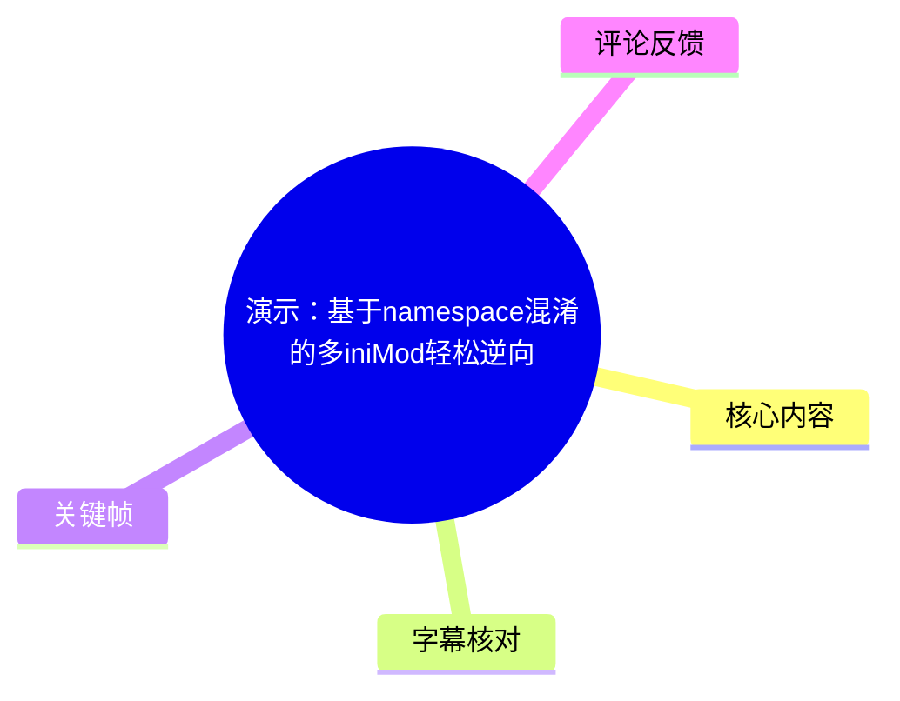
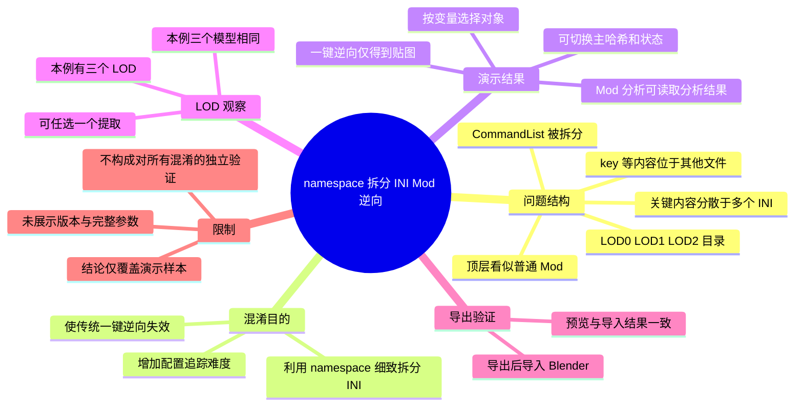
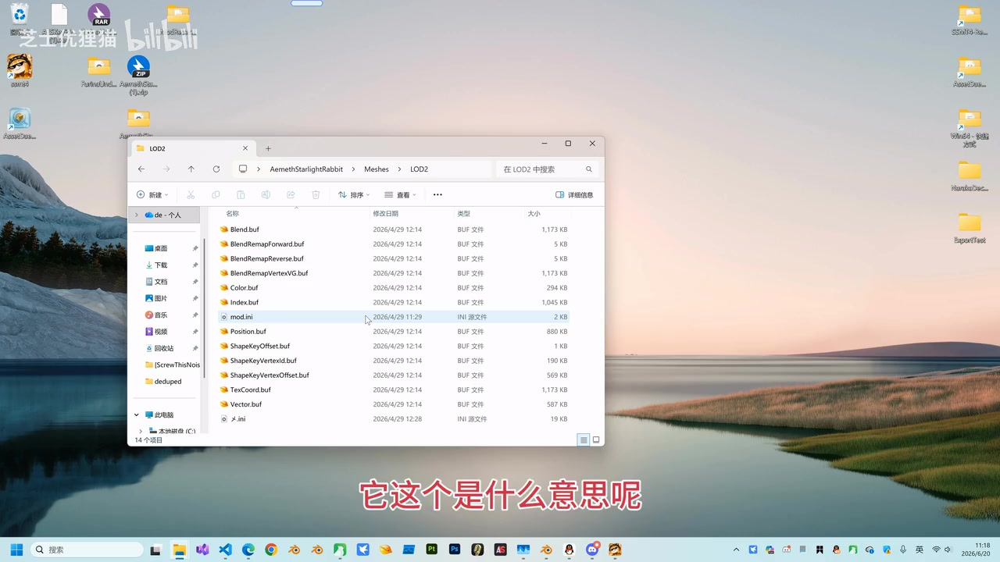
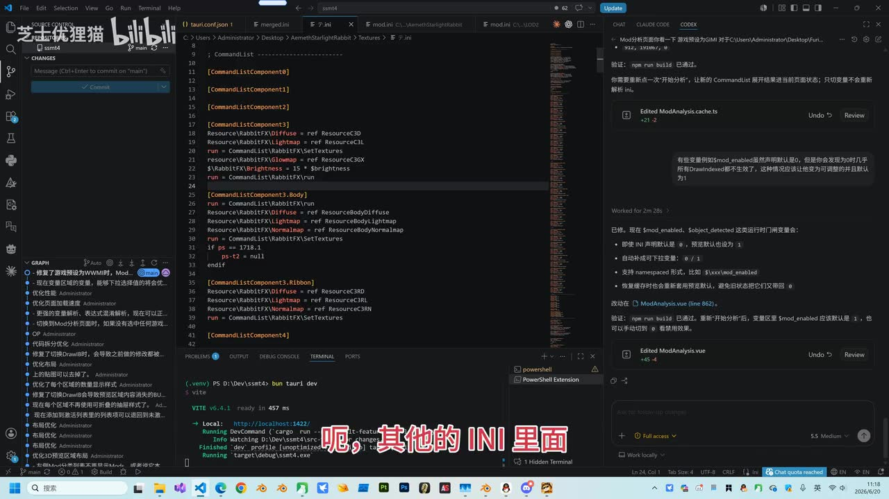

# 演示：基于namespace混淆的多iniMod轻松逆向

> 来源：[Bilibili 视频](https://www.bilibili.com/video/BV1sSjE6zEtC) 
> UP 主：芝士优狸猫｜视频时长：02:13｜合集：AIcode 
> 视频简介：UP 主称，面向 Mod 分析时，基于 `namespace` 的 Mod 混淆“全部通杀”，混淆已无用。

## 小结

视频演示了一类将多个 INI 文件拆分、并借助 `namespace` 组织的 Mod。该 Mod 从顶层目录看似是普通结构，但关键的 `CommandList`、`key` 等内容被分散放入其他 INI 文件及不同 LOD 目录中，使人工阅读目录与传统“一键逆向”都更困难。

UP 主将这种拆分解释为一种阻止一键逆向的混淆方式：若工具只按常规入口或单个 INI 进行处理，就无法完整追踪被拆散的配置关系。视频现场测试显示，原有“一键逆向”结果仅有贴图，未得到完整模型数据。

演示的解决方案是视频中的“Mod 分析”功能。操作层面只展示了：填写 Mod 目录、点击“开始分析”、按变量选择对应对象，并可切换主哈希与状态查看结果。UP 主表示，这一分析流程可以处理本例的 `namespace` 拆分 INI 结构。

文件夹中有 `LOD0`、`LOD1`、`LOD2` 三个层级。UP 主在本例中观察到三个 LOD 对应的模型相同，因此认为只需任选其中一个提取；这是对**该演示样本**的判断，不应直接外推至所有 Mod。

最后，视频将导出结果导入 Blender，并以“预览显示什么样、导入后就是什么样”说明预览与导出效果在本例中一致。视频未给出软件版本、完整配置格式、导出文件格式、分析算法、失败条件或可复现的下载链接，因此其“全部通杀”等表述应视为作者在演示语境下的产品主张，尚未由视频独立验证。

## 思维导图

## 目录

- [背景：拆分 INI 的 Mod 结构与目标](#背景拆分-ini-的-mod-结构与目标)
- [传统一键逆向为何失效](#传统一键逆向为何失效)
- [使用 Mod 分析处理拆分配置](#使用-mod-分析处理拆分配置)
- [变量、主哈希与 LOD 的选择](#变量主哈希与-lod-的选择)
- [导出并在 Blender 中验证](#导出并在-blender-中验证)
- [完整操作流程与适用边界](#完整操作流程与适用边界)
- [结论、限制与时效性](#结论限制与时效性)
- [字幕比对](#字幕比对)
- [评论分析](#评论分析)
- [处理记录](#处理记录)

## 背景：拆分 INI 的 Mod 结构与目标 [00:00:01](https://www.bilibili.com/video/BV1sSjE6zEtC?t=1)

视频对象是一种“特殊格式的、混淆过的 Mod”。UP 主先说明：它表面上看起来是普通的 Mod，但打开后会发现常见的关键内容并不完整地放在主 INI 或顶层位置，而是拆到了“其他的 INI”中。

从视频画面与站内字幕可确认的结构现象包括：

- 顶层目录中存在 `Meshes`、`Textures` 与 `mod.ini`；
- 进入 `Meshes` 后可见 `LOD0`、`LOD1`、`LOD2` 三个目录；
- `Meshes` 目录还显示有额外 INI 文件；
- 进入一个 LOD 目录后，能看到多个 `.buf` 文件和 `mod.ini`，且视频画面中还能看到另一个 INI 文件；
- UP 主点名提到 `CommandList` 被放在其他位置，随后又提到 `key` 也被放入拆分后的内容中。

> 图：关键帧展示了演示样本顶层目录仅显露 `Meshes`、`Textures` 和 `mod.ini`。它说明“看起来普通”的表象：仅从入口文件与顶层文件夹，不能直接判断配置是否已被分散。

> 图：关键帧显示 `Meshes` 下的 `LOD0`、`LOD1`、`LOD2` 目录及额外 INI 文件，是理解“多 INI + 多 LOD”布局的直接画面依据。

> 图：关键帧展示 LOD2 内的多个 `.buf` 资源文件与 INI 文件，说明资源和控制配置并非都集中在单一顶层文件；这为后文“需要跨文件分析”的问题提供了画面证据。

### 技术含义

UP 主将其称为“基于 `namespace` 的拆分 INI 混淆技术”。视频没有展示 `namespace` 的具体语法、调用关系图或完整 INI 文本，因此能够严格确认的是：**作者认为 `namespace` 被用于细致拆分 INI 内容，并以此干扰一键逆向流程。**

这里的困难不只是文件数量增加，而是配置逻辑可能跨越多个文件与目录：

1. 主文件不再包含全部逻辑；
2. `CommandList`、`key` 等定义被分散；
3. LOD 路径中又存在独立资源与 INI；
4. 分析工具若未追踪这些引用/命名空间关系，可能只能识别到孤立贴图或部分资源。

## 传统一键逆向为何失效 [00:00:35](https://www.bilibili.com/video/BV1sSjE6zEtC?t=35)

UP 主明确解释这种布局的意图是“防止你去一键逆向”。其说法是，通过 `namespace` 技术对 INI 作特别细致的拆分，会导致常规的一键逆向功能无法正常完成逆向。

视频在 [00:00:53](https://www.bilibili.com/video/BV1sSjE6zEtC?t=53) 左右进行了现场测试。按 UP 主口述，测试结果是：

- 执行一键逆向；
- 输出“只有贴图”；
- 没有得到所需的完整模型结果；
- 因而作者将该一键逆向流程评价为“废掉了”。

这一结果应准确理解为：**视频中所测试的一键逆向方式，无法完整处理这个特定的拆分 INI 样本。** 视频没有交代该“一键逆向”功能属于哪个软件、其版本、扫描策略或报错日志，也未比较其他逆向工具，不能据此推导所有传统工具均不能处理同类 Mod。

## 使用 Mod 分析处理拆分配置 [00:00:56](https://www.bilibili.com/video/BV1sSjE6zEtC?t=56)

视频给出的替代路径是“Mod 分析”功能。UP 主的核心主张是，该功能可以较轻松地处理本例的拆分结构；其原话还使用了“再复杂的混淆……都是小菜一碟”“直接全部通杀”等较强表述。

画面与字幕能够确认的实际操作如下：

1. 填写目标 Mod 的目录；
2. 点击“开始分析”；
3. 等待分析结果出现；
4. 根据变量选择对应对象；
5. 通过切换主哈希查看不同条目；
6. 可继续切换查看对象状态；
7. 选择目标结果后导出，并导入 Blender 检查。

> 图：关键帧中能看到 INI 中的 `CommandList` 内容及与 Mod 分析相关的操作环境。虽然画面并未完整展示终端用户界面流程，但它能辅助理解作者讨论的是跨配置内容的解析，而非仅对单个资源文件做静态查看。

### 视频展示到的关键参数与对象

| 项目 | 视频中的信息 | 可确认范围 |
| --- | --- | --- |
| 输入 | Mod 所在目录 | UP 主说“把这个目录填好了” |
| 启动动作 | 点击“开始分析” | 视频明确口述 |
| 选择条件 | 变量 | 需按“对应的变量”进行选择，但未展示变量命名规则 |
| 可切换项 | 主哈希 | 可用来检查三个 LOD 的模型 |
| 其他查看项 | 状态 | 视频称“这里也可以切换去看它的状态” |
| 输出验证 | 导出后在 Blender 一键导入 | 未说明导出格式或 Blender 版本 |

### 经验要点

- **不要以顶层 `mod.ini` 是否完整作为唯一判断依据。** 本例的关键配置被拆至其他 INI。
- **先让分析工具完成目录级分析，再按变量定位对象。** 这是视频实际演示的选择顺序。
- **将“预览—导出—Blender 导入”串成验证闭环。** 视频至少完成了可视结果的一次导入核验。
- **不要因一个 LOD 成功就默认其他 LOD 必然相同。** 视频中“相同”是样本观察结果，而不是通用规则。

## 变量、主哈希与 LOD 的选择 [00:01:13](https://www.bilibili.com/video/BV1sSjE6zEtC?t=73)

分析结果出现后，UP 主说仍沿用“之前的用法”：选择对应变量。由于视频没有给出“之前用法”的上下文，也没有展示变量清单、筛选表达式或变量值，本视频可复用的最小信息是：**变量是分析界面中定位目标对象的一个操作入口。**

随后视频讨论本例的三个 LOD：

- 文件夹中存在 `LOD0`、`LOD1`、`LOD2`；
- 切换主哈希时，UP 主观察到这三个对象的模型相同；
- 因此，在该样本中“随便提取其中一个”即可；
- 界面还可切换查看状态。

### 关于 LOD 的限制

视频没有说明三个 LOD 的网格顶点数、贴图差异、缓冲区大小、渲染距离或是否确实共用同一份二进制资源。因此：

- “三个模型一样”仅适用于作者屏幕上展示的 Mod；
- 在其他项目中，`LOD0`、`LOD1`、`LOD2` 仍可能对应不同精度、不同资源组合或不同显示条件；
- 若要确认可否任选一个，应分别在分析预览或导出后检查，而不宜只依据目录名作判断。

## 导出并在 Blender 中验证 [00:01:55](https://www.bilibili.com/video/BV1sSjE6zEtC?t=115)

视频末段展示导出效果，并将结果在 Blender 中“一键导入”。UP 主给出的核验标准是：

> 预览里显示成什么样，导入进来就是什么样。

这说明，至少就视频演示的对象而言，Mod 分析界面的预览和 Blender 导入后的可见模型结果相一致。它属于一次可视化结果核验，而非对骨骼、材质节点、动画、权重、碰撞体、资源完整性等全部数据维度的测试。

### 视频中未披露的导出信息

以下信息未在提供的字幕、ASR 与关键帧材料中出现，不能补写为既定步骤：

- Mod 分析工具的具体软件名称、版本及获取方式；
- Blender 的具体版本；
- 导出文件格式；
- Blender 使用的导入插件、导入选项或缩放参数；
- 是否导出骨骼、权重、材质节点、动画；
- 对加密、损坏文件、循环引用、不同 `namespace` 写法的处理能力；
- 分析或导出失败后的排错方法。

## 完整操作流程与适用边界 [00:00:08](https://www.bilibili.com/video/BV1sSjE6zEtC?t=8)

以下流程按视频实际叙述顺序整理，保留已知条件，并明确未展示的部分。

### 步骤 1：检查目录是否存在拆分迹象

打开 Mod 根目录，查看是否只有表面常规的 `Meshes`、`Textures` 与 `mod.ini`，再进入资源目录检查是否存在：

- 多个 LOD 子目录；
- 额外 INI 文件；
- 分散的 `.buf` 文件；
- 逻辑定义与资源文件不在同一位置的情况。

视频样本中，这些迹象出现在 `Meshes` 及其 LOD 子目录。

### 步骤 2：不要只依赖传统一键逆向

如果一键逆向仅得到贴图、没有预期的模型内容，视频将其视作拆分结构未被完整追踪的表现。此时不要把“有贴图”误判为完整提取成功。

### 步骤 3：在 Mod 分析中指定目标目录并开始分析

按视频操作，填入 Mod 目录后点击“开始分析”。视频未展示目录输入格式、是否需要指定入口 INI、是否支持批量目录，因此这些参数需要以实际工具界面为准。

### 步骤 4：按变量选择目标对象

分析结果出现后，选择与目标对象对应的变量。视频未给出变量与模型之间的映射规则；若项目中存在多个对象，应以分析预览和对象状态辅助确认，而不是仅依据名称推断。

### 步骤 5：检查主哈希、状态和 LOD

切换主哈希，比较各条目的预览结果；必要时切换状态查看。对于本例，UP 主认为 `LOD0`、`LOD1`、`LOD2` 的模型相同，可任选一个提取。

### 步骤 6：导出并用 Blender 复核

导出选定对象后导入 Blender，比较导入结果与工具预览。视频以两者可见效果一致作为成功标志。

## 结论、限制与时效性 [00:01:37](https://www.bilibili.com/video/BV1sSjE6zEtC?t=97)

视频的实质结论是：对于作者展示的、基于 `namespace` 将多个 INI 细致拆分的 Mod，“Mod 分析”能够恢复可选择、可预览、可导出的对象；相较之下，现场测试的“一键逆向”仅得到贴图，未能完成完整提取。

### 可迁移经验

1. 处理 Mod 时要以**目录级关系**而非单个 INI 文件为观察单位。
2. 遇到多 INI、多 LOD、资源与控制逻辑分散的结构时，应优先验证工具是否能跨文件解析。
3. 预览结果不应是终点；还应通过实际导出和 Blender 导入进行复核。
4. LOD 是否可互相替代需要基于实际预览或导出比较，不宜默认。

### 关键限制

- 作者“全部通杀”“混淆已无用”的结论是宣传性较强的主张，视频只展示了一个样本，缺少多样本、不同版本和失败案例验证。
- 视频未提供完整技术细节，无法据此独立复现 `namespace` 解析过程。
- 视频没有讨论相关 Mod 的授权、游戏规则、原作者权益或使用边界；实际处理他人资源时应遵守适用的软件许可、社区规则与版权要求。
- 评论中有人询问 SSMT4 无法打开，但视频未提供故障处理，因此不能从本视频推导解决方案。

### 时效性

元数据记录的视频发布时间为 **2026-06-20**。Mod 格式、分析工具、Blender 兼容性与软件界面都可能随版本变化；本文只记录该日期附近视频素材中展示的行为，不能保证当前版本仍具有相同界面、功能或结果。

## 字幕比对

本次素材同时提供了站内时间轴字幕与 ASR 结果，已检查两者。ASR 诊断显示音频时长约 132.57 秒、语音覆盖率 98.53%、共 6 段，且**未标记 `noAudioStream=true`**；因此可确认源视频存在音轨，ASR 并非基于无音轨画面的替代推断。

| 字幕来源 | 完整性 | 专有名词 | 时间轴 | 主要问题 |
| --- | --- | --- | --- | --- |
| Bilibili 站内字幕 | 覆盖从 00:00:00.300 至 00:02:11.780 的连续口述，分段细 | `namespace`、`INI`、`CommandList`、`key`、`LOD`、`Blender` 等词较稳定 | 逐句时间范围明确，适合正文时间轴链接 | 个别口语词有转写不规范，如“明朝 mod”应结合上下文理解为“鸣潮 Mod”或视频所称对象，但素材未给出英文游戏名证据，不作扩展 |
| 本次 ASR 字幕 | 覆盖 00:00:00.050 至 00:02:11.190，语音覆盖率 98.53% | 多处专有词误识别，如 `mode`、`NL`、`message`、`HC`、`帖子` | 有时间戳，但每段约 9—25 秒，粒度较粗 | 将“Mod”误作“mode”，“INI”误作“NL”，`matches`、主哈希等词不稳定，部分句尾截断或词义错误 |

### 最终字幕选择与校正

正文时间轴以**站内 SRT 的逐句起止时间**为优先依据；ASR 用于检查音轨存在性、覆盖率及与站内字幕的一致性。两份字幕在叙事顺序上基本一致：均包含拆分 INI、传统一键逆向失败、Mod 分析、变量与三个 LOD、Blender 导出验证等内容。

结合站内字幕、ASR 上下文与关键帧，正文采用以下较可靠的技术写法：

- `namespace`：站内字幕明确写为 `NAMESPACE`；ASR 也识别到 `namespace/NameSpace`。
- `INI`：站内字幕稳定；ASR 多次误识别为 `NL`。
- `CommandList`：站内字幕稳定；ASR 识别为 `command list`，语义一致。
- `key`：站内字幕稳定；ASR 同样可识别。
- `LOD0`、`LOD1`、`LOD2`：站内字幕与关键帧目录画面相互印证。
- “主哈希”：站内字幕使用该词；ASR 误作“主 HC”，故正文以站内字幕为准。
- “贴图”：站内字幕写作“贴图”；ASR 误作“帖子”，正文据站内字幕校正。

## 评论分析

以下仅处理可获取的热评前三条。评论反映的是观众观点或提问，不作为已验证事实。

1. **请叫我飘渺**（2 赞）  
   评论以玩笑方式称自己是建模师，认为 Mod 可以作为“参考”，并表达愿意自行制作模型。该评论没有补充逆向流程、软件配置或验证材料，但体现了部分观众将提取结果视为建模参考的使用场景。需注意，参考或重建仍可能涉及原始资源、授权与平台规则问题，视频及评论均未对此展开。

2. **迷途_者**（0 赞）  
   评论询问“逆向分析该如何入门”。这说明视频对初学者具有兴趣激发作用，但评论本身没有得到可见回复，也没有提供学习路径。视频内容确实更偏功能演示，未讲解 INI 语法、`namespace` 机制、资源格式或排错基础，因此不能仅凭本视频完成入门。

3. **Ali3yrrrrr**（0 赞）  
   评论称“SSMT4 突然打不开了怎么办”。这是一条软件故障求助，未附带系统版本、报错信息、软件版本或日志；视频也未展示 SSMT4 的启动诊断流程。因此该问题无法由现有素材判断原因，更不能据此断言视频中的工具与该故障存在直接关系。

## 处理记录

- Worker ID：`worker-mrj0www4-e8d79408`
- 模型：`gpt-5.6-terra`
- ASR 模型与运行参数：`medium`／CUDA／`float16`；识别语言为中文，语言置信度 `0.9990234375`。
- 使用的素材工具结果：已使用提供的元数据、站内 SRT、ASR 时间轴字幕与诊断、关键帧清单、热评前三条进行整理；未对素材之外的信息作补充检索。
- 字幕选择：以站内字幕 `p01-ai-zh.srt` 为正文逐句时间轴主依据；同时核查本次 ASR。ASR 有音轨且覆盖率为 `98.53%`，但专有名词误识别较多，故不作为术语定稿依据。
- 关键帧选择依据：选用 `frame-001.jpg` 展示顶层目录的普通表象，`frame-003.jpg` 展示 `Meshes` 下的三个 LOD 与额外 INI，`frame-004.jpg` 展示 LOD 内 `.buf` 与 INI 的混合结构，`frame-002.jpg` 辅助说明 `CommandList`/分析环境。均与相邻字幕叙述相对应。
- 热评范围：仅分析素材中可获取的 3 条热评，未扩展至其他评论或回复。
- 缓存清理：提供的素材未包含缓存清理执行记录；本文不虚构已清理结果。
- 未解决问题：未提供 Mod 分析工具的具体名称与版本、完整 INI 配置、导出格式、Blender 版本、实际导出文件和失败日志，无法验证“全部通杀”主张的普适性。
