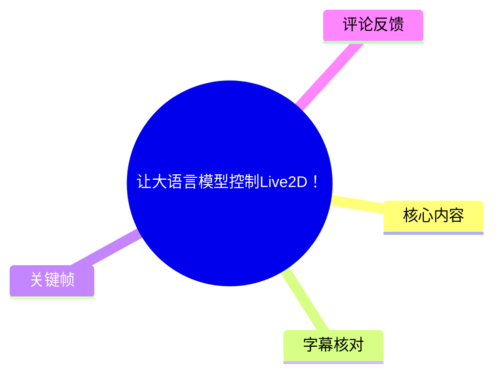
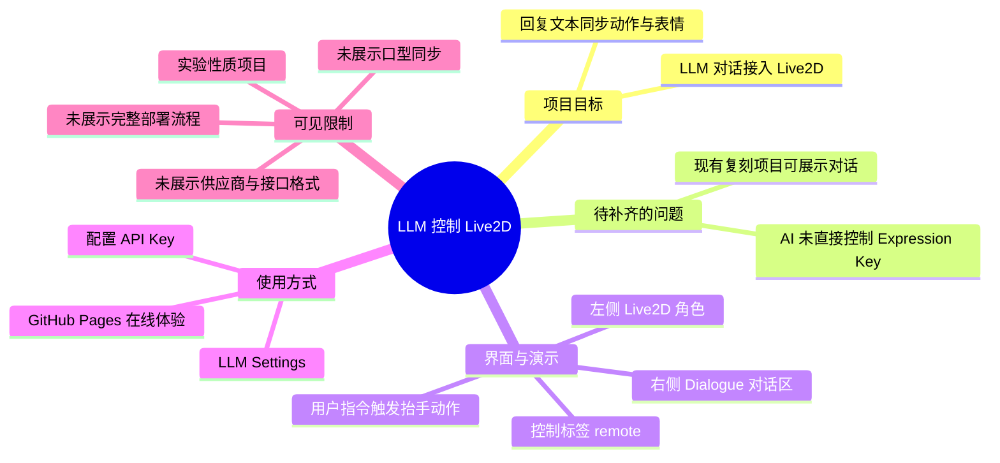
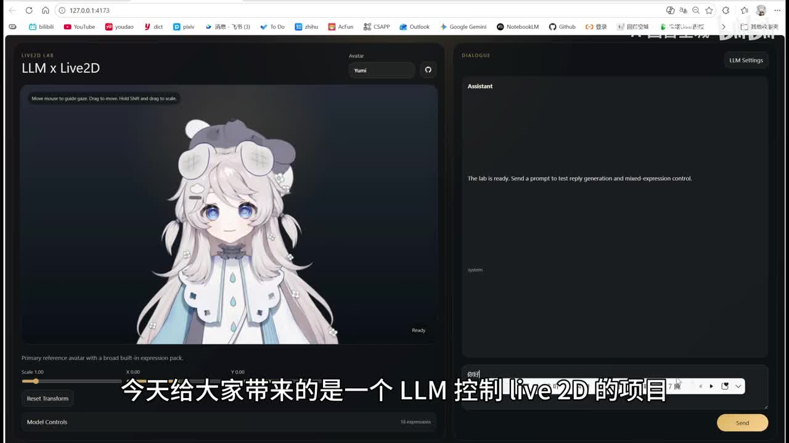
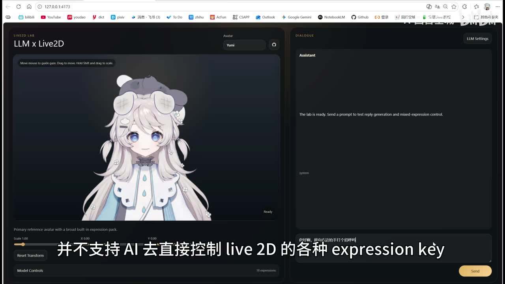
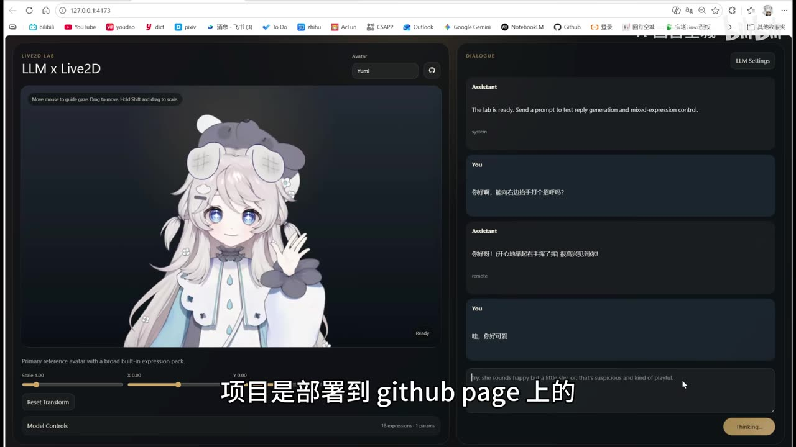
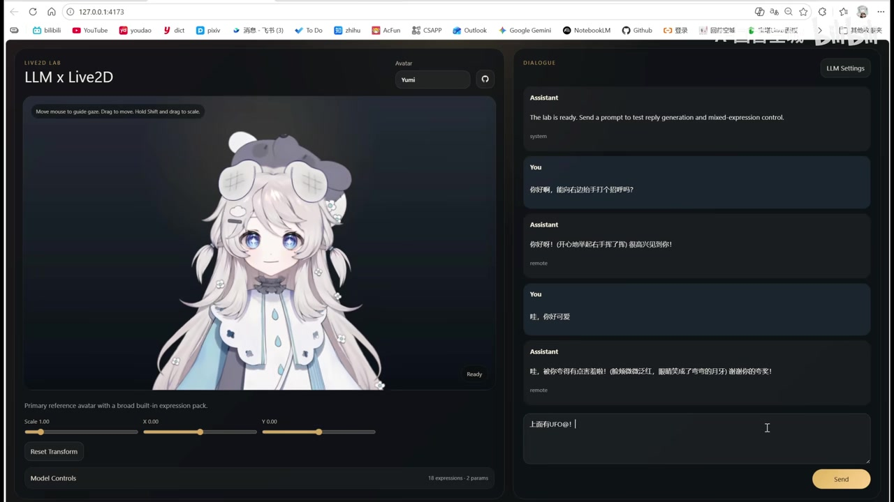

# 让大语言模型控制Live2D！

> 来源：[Bilibili 视频](https://www.bilibili.com/video/BV1FuSoB7EMw)  
> UP 主：A-回首空城｜发布时间：2026-04-06｜视频时长：02:06  
> 项目仓库：[entropy622/LLM_Live2D](https://github.com/entropy622/LLM_Live2D)｜在线体验：[LLM_Live2D GitHub Pages](https://entropy622.github.io/LLM_Live2D/)

## 小结

视频展示了一个实验性质的前端项目：将 Live2D 模型嵌入大语言模型（LLM）对话界面，使模型在生成文字回复的同时，能够触发表情、动作等 Live2D 控制效果。项目名在界面中显示为 **LLM x Live2D**。

作者提出的核心问题是：已有社区复刻项目能够完成 AI 对话与 Live2D 展示，但按视频口述，其并不支持 AI 直接控制 Live2D 的各种 `Expression Key`（表情键）。本项目尝试补足这一层“语言回复—动作/表情控制”的连接。

可见演示中，页面左侧是 Live2D 角色及模型控制区，右侧是对话区。用户输入“向右边抬手打个招呼”后，角色出现抬手动作；界面还显示了动作控制标签 `remote`。这表明项目至少能够把自然语言对话结果与预设的 Live2D 动作/表情选择关联起来。

使用门槛方面，作者明确说明只需在 **LLM Settings** 中配置 API Key；项目已部署至 GitHub Pages。视频没有展示具体模型供应商、接口地址、请求格式、提示词模板、密钥存储方式或部署步骤，因此这些实现细节不能从本视频中确认。

该内容适合希望制作 AI 虚拟角色、LLM 对话 UI、Live2D 网页交互，或研究“LLM 输出结构化控制指令”的前端开发者参考。需要注意的是，这是一项作者明确称为“实验性质”的项目；视频中的成功演示不等于对不同 Live2D 模型、不同 API 服务或生产环境稳定性的普遍保证。

## 思维导图

## 目录

- [项目背景与问题](#项目背景与问题-0000)
- [项目能力与界面结构](#项目能力与界面结构-0000)
- [演示：从自然语言到角色动作](#演示从自然语言到角色动作-0028)
- [使用步骤、参数与可见控制项](#使用步骤参数与可见控制项-0000)
- [限制、适用范围与时效性](#限制适用范围与时效性-0000)
- [字幕比对](#字幕比对)
- [评论分析](#评论分析)
- [处理记录](#处理记录)

## 项目背景与问题 [00:00](https://www.bilibili.com/video/BV1FuSoB7EMw?t=0)

视频开场介绍这是一个“LLM 控制 Live2D”的项目。根据作者口述与视频简介，目标不是单纯在网页中渲染一个 Live2D 模型，而是把它纳入 LLM 的对话流程：LLM 给出回复时，同步控制角色的表情和动作。

作者提到项目受到名为 “NurlSama”（ASR 对该专名识别不稳定）的项目或相关社区复刻方案启发。由于本次 ASR 在该句中存在明显错词，能可靠确认的只有作者表达了以下问题：

1. 已有方案/复刻方案与本项目存在启发关系；
2. 作者认为其中缺少让 AI **直接控制 Live2D 各类 `Expression Key`** 的能力；
3. 本项目的定位是补齐这一能力。

`Expression Key` 在视频语境中是 Live2D 的表情控制键或表情预设标识。视频没有说明这些键来自 Cubism 模型文件、前端配置表还是运行时参数映射，因此不能据此推断其底层控制协议。

> 图：关键帧展示了“LLM x Live2D”实验界面的整体分栏：左侧为角色画布，右侧为 Dialogue 对话区域，右上角可进入 `LLM Settings`。它直接说明该项目将模型渲染、对话与设置入口整合在同一页面。

## 项目能力与界面结构 [00:00](https://www.bilibili.com/video/BV1FuSoB7EMw?t=0)

从界面可见信息看，应用由以下部分构成：

| 区域 | 画面中可见内容 | 可确认作用 |
| --- | --- | --- |
| 顶部标题 | `LIVE2D LAB`、`LLM x Live2D` | 表明这是围绕 Live2D 与 LLM 结合的实验页面。 |
| 左侧主画布 | Live2D 角色 | 显示角色及其动作、表情状态。 |
| Avatar 选择区 | 当前可见角色名为 `Yumi` | 表明页面至少设计了角色选择入口；无法从视频确认可选角色数量。 |
| 左下控制区 | `Scale 1.00`、`X 0.00`、`Y 0.00`、`Reset Transform` | 提供角色缩放、位置与重置变换控制。 |
| Model Controls | 画面中显示 `18 expressions`，后续还显示参数计数 | 显示模型可用表情数以及运行中被使用/关联的参数计数。 |
| 右侧 Dialogue | Assistant、You 对话消息与输入框 | 承载用户输入和 LLM 回复。 |
| 右上设置 | `LLM Settings` | 作者说明此处用于配置 API Key。 |

页面的系统提示语为：“The lab is ready. Send a prompt to test reply generation and mixed-expression control.” 可译为“实验室已准备好，发送提示词以测试回复生成和混合表情控制”。这说明作者把演示重点放在**回复生成**与**混合表情控制**的联动上。

> 图：该关键帧同时保留了 `Model Controls` 区域和字幕中强调的 “Expression Key” 问题，是理解项目目标——让 AI 直接关联 Live2D 表情控制——的重要视觉证据。

## 演示：从自然语言到角色动作 [00:28](https://www.bilibili.com/video/BV1FuSoB7EMw?t=28)

作者在开场口述末尾说“接下来请看演示”，该句的 ASR 时间段终点为 00:28.200。因此后续画面可作为演示阶段理解；关键帧素材本身未提供逐帧时间戳，不能再精确标定每张图的秒数。

演示中可清楚辨认出一组“用户请求—助手回复—角色状态”的闭环：

1. 用户输入：**“你好啊，能向右边抬手打个招呼吗？”**
2. 助手文本回复表达了问候及举手挥手的语义。
3. Live2D 角色在左侧画面中抬起手。
4. 该助手消息下方可见控制标签：`remote`。

这说明系统并非仅将用户文本回显为自然语言；至少在该示例里，它还把“抬手打招呼”关联到了一个可驱动角色动作的控制结果。`remote` 是画面可见的标签，但视频未解释其具体含义：它可能是动作名、控制通道、预设键名或内部指令标记，不能仅凭画面断言其数据结构。

> 图：用户提出“向右边抬手打个招呼”的请求后，角色出现抬手姿态，右侧 Assistant 消息下方显示 `remote`。该帧是“对话语义与角色动作联动”的直接演示证据。

后续对话中，用户继续输入“哇，你好可爱”，助手给出带情绪色彩的回复。此时左侧控制区显示已关联的参数数有所变化，表明同一轮或连续对话过程中，系统可以积累或切换不止一个控制结果。不过，视频没有给出每个参数的名称、数值、持续时间或叠加规则。

> 图：该帧显示连续的 You/Assistant 消息、角色状态与 `Model Controls` 中的参数计数。它有助于观察该项目并非只进行单次动作触发，而是以对话流形式持续运行；但各参数的实际定义未在视频中公开。

## 使用步骤、参数与可见控制项 [00:00](https://www.bilibili.com/video/BV1FuSoB7EMw?t=0)

### 视频明确给出的最小使用流程

作者给出的操作说明非常简洁，可整理为：

1. 打开项目页面；作者称项目已经部署到 GitHub Pages。
2. 点击页面右上角的 **LLM Settings**。
3. 配置一个 **API Key**。
4. 在右侧输入框发送提示词。
5. 观察 LLM 文本回复，以及 Live2D 角色的表情、动作变化。

视频简介提供了两个入口：

- 源码仓库：<https://github.com/entropy622/LLM_Live2D>
- 在线体验：<https://entropy622.github.io/LLM_Live2D/>

### 画面可见参数

| 参数/状态 | 画面可见值或名称 | 说明 |
| --- | --- | --- |
| Scale | `1.00` | 角色显示缩放值。视频未说明允许范围、步长或持久化方式。 |
| X | `0.00` | 角色横向位置值。 |
| Y | `0.00` | 角色纵向位置值。 |
| Reset Transform | 按钮 | 可将当前显示变换重置；具体重置目标从初始画面看应是默认变换，但未展示点击结果。 |
| Expressions | `18 expressions` | 当前演示模型可见有 18 个表情项；这是该示例模型的界面计数，不应推广为项目对所有模型的固定要求。 |
| Params | 关键帧中依次可见 `1 params`、`2 params` | 表示当前控制状态关联的参数数量发生变化，但视频未解释参数名称、映射关系或单位。 |
| Avatar | `Yumi` | 当前演示使用的角色名称。 |
| LLM Settings | 设置入口 | 作者明确说在这里配置 API Key；未展示具体字段。 |

### 实践时应补充验证的事项

以下事项与视频目标直接相关，但**视频没有给出答案**，实际使用仓库或体验页时需自行核验：

- API Key 发往哪个 LLM 服务商、是否支持自定义 Base URL、模型名和代理；
- API Key 是否仅保存在浏览器内存或本地存储，是否会被上传至第三方；
- LLM 如何输出动作/表情控制：文本标签、JSON、工具调用、正则解析或其他协议；
- `remote` 与具体 Live2D motion / expression / parameter 的映射表；
- 自定义 Live2D 模型需要哪些 motion、expression 或 parameter 命名约定；
- 网络失败、LLM 返回格式异常、控制键不存在时的降级逻辑；
- 表情和动作是否可以同时播放、冲突时的优先级以及复位策略。

## 限制、适用范围与时效性 [00:00](https://www.bilibili.com/video/BV1FuSoB7EMw?t=0)

### 视频证据支持的结论

- 项目是一个前端实验项目，目标是让 LLM 对话与 Live2D 表情、动作联动。
- 作者已经提供 GitHub 仓库及 GitHub Pages 体验入口。
- 用户可以通过 `LLM Settings` 配置 API Key。
- 演示中至少实现了“自然语言提出抬手请求—角色抬手”的效果。
- 演示模型显示有 18 个表情项，并有参数计数变化。

### 不能从视频确认的内容

- 不支持或未展示口型同步。热评中也提出“跟着文字做口型”的需求，但这只是评论者建议，不代表项目已有或缺失该功能的正式技术结论。
- 不支持或未展示语音输入、TTS、音频驱动表情、声音驱动口型。
- 未展示本地部署命令、构建工具、依赖版本、浏览器兼容性和移动端适配。
- 未展示 API Key 的安全策略、调用费用、速率限制和错误处理。
- 未展示与任意 Live2D 模型兼容；画面仅证明演示角色 `Yumi` 的运行效果。
- 未给出动作、表情或参数控制的精确协议，因此无法直接复刻实现细节。

### 时效性

视频页面元数据记录的发布时间为 **2026-04-06**；本次素材抓取时间为 **2026-07-15**。项目仓库、GitHub Pages 页面、依赖版本、LLM 服务商支持范围和 API 配置界面都可能在此后变化。视频统计数据在抓取时为约 9,257 播放、691 收藏、285 点赞；这只是抓取时的快照，不代表当前实时数据。

## 字幕比对

| 字幕来源 | 完整性 | 专有名词 | 时间轴 | 主要问题 |
| --- | --- | --- | --- | --- |
| Bilibili 站内字幕 | 无可用字幕 | 无法核验 | 无法核验 | 素材记录显示站内字幕获取工具因 `Invalid URL` 未取得结果。 |
| 本次 ASR 字幕 | 仅覆盖 00:00–00:28.200，覆盖率约 22.5% | 存在误识别 | 有效，SRT 给出 00:00:00,000–00:00:28,200 | 将 `LLM` 识别为 `LIM`；项目名、启发来源等专名存在错词；后续主要为无旁白演示，未产生语音字幕。 |

本次 ASR 使用 `medium` 模型、中文识别，语言置信度为 `0.9878`，音频时长约 `125.33` 秒。诊断结果未标记 `noAudioStream=true`，因此不能说源视频没有音轨；实际情况是音轨中可识别的口述内容主要集中在前 28.2 秒，之后视频以界面演示为主。

最终采用策略如下：

- **时间轴**：使用本次 ASR 的真实 SRT 段落，即 00:00–00:28.200；演示章节链接使用该段落终点 00:28。
- **正文术语校正**：根据视频标题、视频简介和界面文字，将 ASR 中的 `LIM` 校正为 `LLM`；将 `live2d` 统一写为 `Live2D`。
- **专名保留不确定性**：ASR 对 “NurlSama” 相关表述不稳定，正文不据此扩展具体项目、作者或技术归属。
- **演示内容补充**：通过关键帧可见的界面文字、聊天消息、角色抬手姿态、`remote` 标签和控制计数来描述无旁白阶段；不为关键帧补造精确时间戳。

## 评论分析

以下仅分析本次可获取的热评前三条，不将评论内容视为已验证事实。

| 热评 | 观点与补充 | 可信度与待验证点 |
| --- | --- | --- |
| 凄临雨（12 赞）：“live2d5 web api 好难搞啊，用了play2d5/easylive2d，个个有bug。主播你怎么解决？” | 评论者从 Live2D 5 Web API 实践出发，指出 `play2d5/easylive2d` 可能存在兼容性或缺陷问题，并询问作者的解决方案。该评论补充了项目落地时可能面对的 SDK/封装稳定性挑战。 | 这是个人开发体验，未提供复现条件、版本号、错误日志或作者答复；不能据此认定相关库普遍存在 Bug。 |
| 浮华星弦（8 赞）：“咱也做了个类似的……只不过是控制全部参数，up看看呢” | 评论者声称做过类似项目，并表示其方案可控制“全部参数”。这提示 Live2D 控制方案存在不同粒度：按表情/动作预设控制，或直接按底层参数控制。 | 未提供项目链接、实现方式或演示证据，属于未验证的自述；“全部参数”的范围也不明确。 |
| 活人微死死人微活丶（7 赞）：“要是能跟着文字做口型就好了” | 评论提出文字驱动口型同步需求。它与视频展示的“文字回复 + 表情/动作”能力相邻，但属于不同技术环节。 | 这是一项功能建议，不能反推当前项目一定没有口型功能；视频本身确实未展示该能力。 |

## 处理记录

- Worker ID：`worker-mrj0wbly-5dc4e50c`
- 模型：`gpt-5.6-terra`
- 素材工具与结果：已提供视频元数据、音频、关键帧、ASR SRT/JSON 和热评数据；站内字幕抓取记录返回 `Invalid URL`，未获得可用站内字幕。
- ASR 检查：已检查 `asr-result.json` 与 SRT。识别模型为 `medium`，语言为中文，带真实时间戳；未标记 `noAudioStream=true`。
- 字幕选择：未采用站内字幕；以本次 ASR 的 00:00–00:28.200 段落作为唯一可验证语音时间轴，并使用视频标题、简介、界面文字与关键帧修正明显术语错误。
- 关键帧选择依据：选择 `frame-001` 至 `frame-004`，分别用于说明整体界面、`Expression Key` 问题、自然语言触发抬手动作及连续对话下的控制状态变化。关键帧未提供独立精确时间戳，未将其强行标注为具体秒数。
- 评论范围：仅处理可获取的热评前三条，未扩展到其他评论。
- 缓存清理：提供的素材中没有缓存清理执行日志；无法确认是否已清理，故不宣称完成清理。
- 未解决问题：LLM API 的服务商、模型、请求协议、安全存储方式；Live2D 表情/动作/参数映射机制；自定义模型接入条件；口型同步与异常处理机制，均需以仓库代码或在线页面的后续实测为准。
