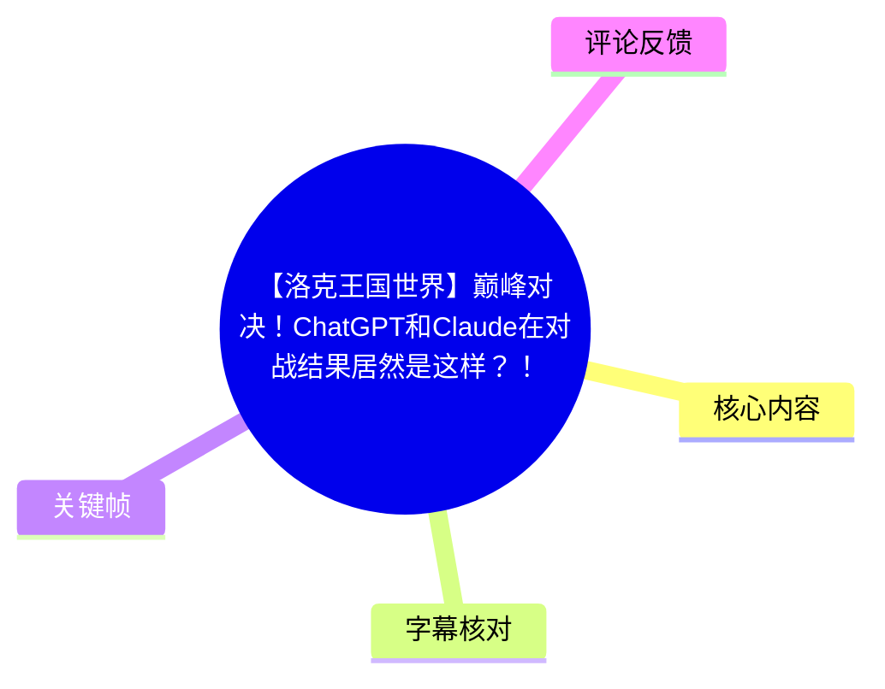
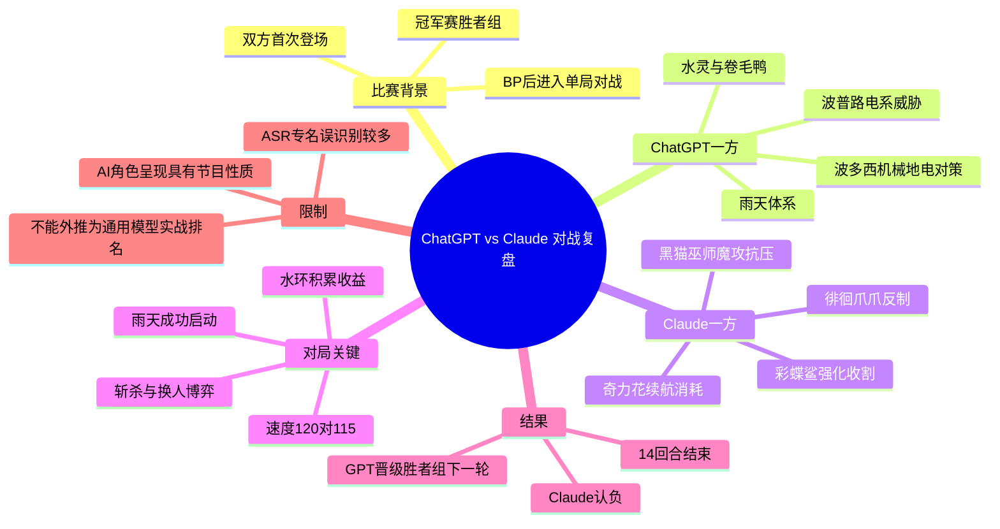
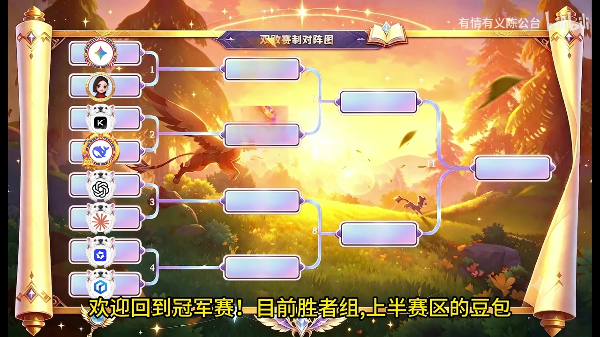
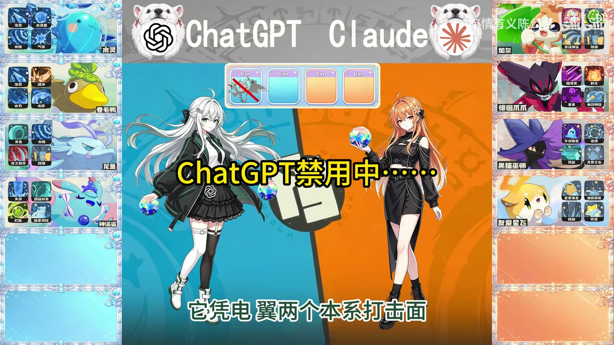

# 【洛克王国世界】巅峰对决！ChatGPT和Claude在对战结果居然是这样？！

> 来源：[Bilibili 视频](https://www.bilibili.com/video/BV1RT386uEDC) 
> UP 主：有情有义陈公台｜时长：16:01｜分辨率：2560×1440 
> 视频简介：强不强不知道，真贵！

## 小结

这是一场以《洛克王国：世界》对战为舞台的娱乐化 AI 对决视频：在冠军赛胜者组中，视频将 ChatGPT 与 Claude 分别作为两名“选手”呈现，经过 BP、选宠、逐回合决策与赛后复盘，最终由 GPT 一方在 **14 回合**后获得胜利，Claude 一方选择认负。

视频最有价值的部分不在于宣称某个通用大模型具备可泛化的游戏竞技能力，而在于展示了一套对战决策的表达框架：**围绕天气、速度、能量、属性克制、换人风险和全局胜率进行逐回合评估**。GPT 一方多次强调“选择全局胜率最高的打法”，通过雨天体系、卷毛鸭的压制与水系循环逐渐扩大优势。

Claude 一方并非完全没有有效判断：其在前期使用奇力花承伤、中期尝试以徘徊爪爪针对可能的强化路线，并在局势无法逆转时选择认负。赛后复盘也指出，如果能更好保存波普路、及时撤下奇力花、避免徘徊爪爪在无法完成斩杀时继续换血，结果可能不同。

需要注意，视频中的角色、阵容解释、胜率数字和 AI“发言”均属于该视频设计的比赛叙事，不能据此直接推出 ChatGPT 或 Claude 在真实、开放环境中的稳定对战强度。尤其 ASR 对大量精灵名、技能名和术语识别存在明显误差，本文对名称采用“视频画面/语音可确认”与“ASR 不确定”相区分的记录方式。

本篇适合希望复盘本局对战逻辑、理解雨天队与换人博弈、或关注 AI 对战娱乐内容表现形式的读者阅读。

## 思维导图

## 目录

- [比赛背景与信息边界](#比赛背景与信息边界)
- [BP：双方阵容、禁用与定位](#bp双方阵容禁用与定位)
- [开局：雨天体系建立与波普路压制](#开局雨天体系建立与波普路压制)
- [中盘：换人、能量与属性克制的连续博弈](#中盘换人能量与属性克制的连续博弈)
- [关键转折：彩蝶鲨分支判断与核心输出阵亡](#关键转折彩蝶鲨分支判断与核心输出阵亡)
- [终局：GPT方重启雨天，Claude方认负](#终局gpt方重启雨天claude方认负)
- [赛果与赛后复盘](#赛果与赛后复盘)
- [可迁移的对战经验、参数与限制](#可迁移的对战经验参数与限制)
- [字幕比对](#字幕比对)
- [评论分析](#评论分析)
- [处理记录](#处理记录)

## [比赛背景与信息边界](https://www.bilibili.com/video/BV1RT386uEDC?t=8)

视频开场说明，本场位于冠军赛胜者组上半区；此前豆包与“地址道”（ASR 结果，具体名称无法由现有字幕可靠校正）已经进入下一轮。本轮是 Claude 与 ChatGPT 的“内战”，且视频称两者均为首次登上该比赛舞台。

画面以赛事对阵图和模型标识进行包装，明确将 ChatGPT 与 Claude 放在比赛双方。随后流程进入 BP（Ban/Pick，即禁用和选取）环节。

> 图：画面展示“双败赛制对阵图”，左侧含多个模型/选手标识，字幕说明当前处于冠军赛胜者组上半赛区。它为理解本局属于淘汰赛赛事流程、而非随机单局对战提供了背景。

### 信息边界与时效性

- 视频元数据抓取时间为 **2026-08-04**，发布时间按提供的 Unix 时间戳换算为 **2026-07-29**。
- 本局的精灵、技能、数值与对局机制应以视频制作时的《洛克王国：世界》环境为准；后续版本平衡、技能数据或可用精灵池变化，均可能改变结论。
- 视频展示的是创作者编排下的 AI 对战内容。片中“全局胜率 59%、76%、92%”等数值被用作决策叙事依据，但没有提供胜率计算器、样本量、提示词、模型版本、工具调用记录或对局控制协议，因此不可作为独立可复现的模型评测数据。
- 语音中对 Claude 的称呼存在“Cloud/Claude”混用，赛后还出现“GPTA”“GPTO”等 ASR 近音文本。本文沿用标题中的 **ChatGPT 与 Claude**，在无法确认具体子版本时不进一步推断。

## [BP：双方阵容、禁用与定位](https://www.bilibili.com/video/BV1RT386uEDC?t=26)

视频在约 00:26 开始依次介绍双方选宠、技能和禁用。由于 ASR 对专名的误识别较严重，下列记录以视频可辨识名称为主；不清晰的技能名会标注为“ASR 近似转写”，避免将错误转写当成事实。

### ChatGPT 方：以雨天水系压制为主轴

视频介绍的 ChatGPT 方核心结构包括：

| 精灵/单位 | 视频中的定位 | 语音提及的技能或作用 |
| --- | --- | --- |
| 水灵 | 天气手、减费发动机 | 落雨、水炮盾、水系技能（末项 ASR 不清） |
| 卷毛鸭 | 副天气手、雨天物理副核 | 落雨、暴冲、水刃、水环 |
| 龙鱼 | 草系缓冲位、迅捷中转、混合破攻 | 一击、水炎龙之力爪、防御等；部分名称不清 |
| 神韵鲨/彩蝶鲨 | 核心强化收割手 | 蓄藏、强化、回旋风暴、极寒领域等；命名存在 ASR 不确定性 |
| 波多西 | 机械/地电系对策、低速重装破阵手 | 齿轮切开等 |
| 化尖沉铁兽 | 中盘物理破盾手、普通系针对位 | 力量增效等 |

其核心思路是：**以水灵或卷毛鸭启动雨天，让水系输出和循环获得增益，再利用波普路、电系压力、波多西与其他精灵完成中后场对位。**

> 图：画面中央显示“ChatGPT 首选中”，左侧队伍栏的水灵、卷毛鸭等信息可见，底部字幕明确称卷毛鸭为“副天气手、雨天物理副核”。该帧直观呈现了 GPT 方围绕雨天搭建阵容的开局意图。

### Claude 方：消耗、反制与强化收割

Claude 方在视频中选出的核心单位包括：

| 精灵/单位 | 视频中的定位 | 语音提及的技能或作用 |
| --- | --- | ---|
| 加尔 | “雪球发动机”、增益中转 | 击鼓传花、做好事、友谊满溢、防御 |
| 徘徊爪爪 | 后手物理清场手 | 暗突袭、火毒狼（ASR 近似） |
| 黑猫巫师 | 魔攻核心、抗压中坚 | 午夜噪音、音暴、风起、无畏之心 |
| 有爱心扉 | 能量蹦消耗节奏位 | 心性撞击、休息回复等 |
| 奇力花 | 续航消耗战核心 | 纤维化孢子、叶绿光束、光能聚集 |
| 波普路 | 旋转门/终结者 | 闪击折返、电弧、下注 |

视频将奇力花定位为具有续航能力的消耗核心，徘徊爪爪则承担后手反制及物理清场功能；黑猫巫师在后期负责补足魔攻压力。

> 图：画面显示“Claude 首选中”，右侧为加尔的技能栏，底部字幕列出“击鼓传花、做好事、友谊满溢、防御”。这张图有助于确认 Claude 方并非纯输出构筑，而有增益与防御性选择。

### 禁用逻辑：优先封堵关键打击面与天气干扰

语音中提到的禁用对象包括琵琶鸟、电启鹅、海豹船长等；ASR 对少数名称不够稳定，但禁用逻辑较为清楚：

1. **封锁电系打击面**：视频称琵琶鸟可凭电、翼两个本系打击面分别锁定神韵鲨、水灵和卷毛鸭，因此成为高优先级禁用对象。
2. **减少对雨天体系的干扰**：电启鹅不仅能有效克制 GPT 方，还会干扰水灵开雨、积累水系技能次数及卷毛鸭的技能循环。
3. **防范吃雨天红利的压制单位**：海豹船长既能享受雨天加成，也可借其机制压制对方。
4. **补足对位缺口**：波多西被描述为机械/地电系对策和低速重装破阵手；化尖沉铁兽则用于处理中盘物理破盾与普通系对位。

> 图：画面中央显示“ChatGPT 禁用中”，双方队伍栏已经呈现多只精灵及技能图标。它的价值在于显示本局并非只比拼单只精灵强度，而是先经过禁用阶段削减对手关键克制点。

## [开局：雨天体系建立与波普路压制](https://www.bilibili.com/video/BV1RT386uEDC?t=162)

### 第一个回合群：观察波普路意图

约 02:42，Claude 方先提出让波普路使用电弧，重点观察卷毛鸭下一步究竟会“铺雨天”还是“硬换血”。其计划是：

- 如果卷毛鸭下一回合启动雨天，则撤下波普路，将其保留用于应对水系；
- 如果卷毛鸭选择硬拼，则先观察双方战损；
- 决策原则是“保持观察”，不在信息不足时提前交出关键对水单位。

ChatGPT 方对应选择水环，解释为应对波普路可能打出的电系迸发伤害。视频声称该动作若成功应对，能带来三类收益：

1. 能耗减少 **2**；
2. 为彩蝶鲨累积一次水系收益；
3. 为波多西累积一次防御收益。

这里体现出视频反复强调的思想：不要只用单回合伤害衡量技能，而要计算技能对全队循环、能量和后续入场的累计价值。

### 雨天成功启动，GPT 方胜率上升

约 03:35，GPT 方给出“全局胜率 59%”的判断，认为上回合已占到便宜；随后使用落雨。视频认为波普路的电弧会被草属性单位承受，而雨天启动后，卷毛鸭可凭“双攻翻倍”反向压制。

约 04:23，Claude 方确认“果然下雨了”，并认为这是不利展开。其当回合使用能够推进徘徊爪爪特性层数的动作，但同时也承认雨天中卷毛鸭双攻翻倍，加尔留场风险很高，后续应考虑撤离。

### 雨天队的水刃路线

约 04:46，GPT 方的“全局胜率”升至 **65%**，并判断雨天已安全启动、开局优势较大，因此选择水刃压制。其论据是：

- 对手若防御硬顶，属于可接受的常规结果；
- 对手换奇力花承受水系，同样在可预期范围内；
- 自己不需要猜测所有细节，只要以稳定收益最高的水刀/水刃持续施压。

至约 05:18，视频给出 **67%** 胜率。GPT 方进一步比较水刃与暴冲：若对方换入徘徊爪爪，水刃按正常倍率计算，而暴冲可能被抵抗，因此水刃能更稳妥地覆盖最有威胁的换人分支。若奇力花硬扛，雨天加成下仍有伤害；之后可转龙鱼接续压制。

这一段的重点不只是“雨天强”，而是 **在不确定对手换人的情况下，优先选取覆盖面更好的动作**。

## [中盘：换人、能量与属性克制的连续博弈](https://www.bilibili.com/video/BV1RT386uEDC?t=354)

### 速度阈值决定被迫换人

约 05:54，Claude 方判断：己方精灵若继续攻击会被卷毛鸭直接击杀，血量不足时即使使用防御也无法存活，因而只能换人。视频明确给出一组速度参数：

- 波普路速度：**120**
- 卷毛鸭速度：**115**

Claude 方因此选择波普路，原因是其速度更高，且“下注”在自身血量低于 **50%** 时可获得额外伤害。黑猫巫师虽可通过特性提高速度，但其午夜噪音无法确认是否能击杀卷毛鸭，故没有选它。

这段展示的经验是：当当前单位无法在本回合存活，决策重点应从“是否继续输出”转为“换入后能否取得下回合先手、是否保有击杀威胁”。

### “下注”逼退与水环反制

约 06:51，Claude 方认为雨天卷毛鸭压制太强，必须用波普路的“下注”逼退对手。视频称其存在“血量低于 5% 时威力加 100”的选项；这一具体阈值来自 ASR，缺乏画面或官方数据交叉验证，宜作为视频口述记录而非独立机制结论。

GPT 方在约 07:11 给出 **76%** 全局胜率，认为波普路速度虽快，但进攻意图过于直白，遂再次选择水环。其目的包括：

- 消耗对方能量；
- 向彩蝶鲨累计收益；
- 向波多西累计收益；
- 避免为了直接交换伤害而舍弃长期优势。

这表明 GPT 方更倾向以循环和资源优势化解立即威胁，而非每回合都与对手进行纯伤害对冲。

### 波多西、奇力花与龙鱼的对位

约 07:33，GPT 方换上波多西，表示可借入场后的“双倍克制”逼迫对方换人或直接击杀。Claude 方则让波普路继续用下注，认为己方为电系、对方换水系的概率不高，继续施压更符合当前目标。

约 08:10，Claude 方认为波普路残血继续留场是“白送”，于是换入奇力花。其理由为奇力花克制波多西、具有较高防御、能够站场稳定局面。

GPT 方随后判断，波普路只剩 **1** 点能量，直接攻击施加击杀压力最实际；但到约 08:46，又避免让波多西在奇力花面前被持续消耗，转而换入龙鱼。视频称龙鱼可自动触发“一击”并对奇力花草属性形成两倍克制，从而压低血线。

Claude 方则选择奇力花的叶绿光束，希望用回复能耗支撑消耗战，拖过对方雨天回合。约 09:30，其判断是奇力花有 **239** 点生命，能够承受龙鱼一次不蓄力的“一击”，之后再收割。

### 中盘资源判断的得失

约 09:43，GPT 方的全局胜率降至 **59%**，承认刚刚发生了当前最差的一次血量交换；但仍判断准备工作已经完成：

- 奇力花血量被压低；
- 已经使用 **5 次水系技能**，从而大幅降低彩蝶鲨的能耗；
- 对方一回合无法处理彩蝶鲨；
- 回旋风暴对草属性有克制关系。

因此 GPT 方换入彩蝶鲨，试图把之前累积的水系资源转化为收割机会。这是典型的“短期换血劣势、长期资源达标”取舍：单回合亏损不必然代表全局亏损，关键在于后续核心单位能否兑现资源。

## [关键转折：彩蝶鲨分支判断与核心输出阵亡](https://www.bilibili.com/video/BV1RT386uEDC?t=616)

### 彩蝶鲨的先手击杀与强化威胁

约 10:16，GPT 方给出 **57%** 胜率，选择首领化并使用回旋风暴。视频称彩蝶鲨速度压过奇力花；若对方不换人，则可以先手击杀。并特别指出该技能为“一系攻击”，不吃天气加成，因此天气不会改变这一回合的核心判断。

约 10:33，Claude 方描述彩蝶鲨当前生命为 **47%**，并列出两条分支：

- **分支 A**：彩蝶鲨直接使用回旋风暴，打出克制效果，尝试击杀；
- **分支 B**：彩蝶鲨使用强化技能，如“魔法增效/蓄藏”（ASR 近似），等待 Claude 方防御或换人。

Claude 方认为 B 的风险尤其大：若彩蝶鲨完成强化，就会同时获得很高的能耗减免和伤害加成，可能对己方造成“毁灭性影响”。

### 同速随机：从数学风险转向意图判断

视频在约 10:57 给出另一组关键速度信息：

- 徘徊爪爪速度：**125**
- 彩蝶鲨速度：**125**
- 同速度时：**随机决定谁先行动**

这意味着如果双方在同速对位中依赖先手，结果存在无法消除的随机性。Claude 方一度询问“最好的行动是什么”，随后出现带有喜剧效果的插话：“哦牛P……我一眼看透对方一定会直接打回旋风暴，直接换人就得了。”

最终 Claude 方并未按“直接换人”的口头插话执行，而是综合判断后选择奇力花使用光能聚集，理由是不能接受彩蝶鲨强化成功的结果，决定“赌一手进攻”。

这里呈现出一个重要的实战问题：**当两个分支中，一个是可承受的直接伤害，另一个是可能导致长期失控的强化，玩家可能选择优先阻断强化，即使这会暴露于对手直接进攻。**

### 徘徊爪爪入场反制

约 11:56，Claude 方换上徘徊爪爪，计划使用暗突袭针对彩蝶鲨的强化路线：若彩蝶鲨敢开强化，便触发应对并将其带走。

GPT 方约 12:14 给出 **69%** 胜率，换上波多西保护彩蝶鲨，同时让波多西对位徘徊爪爪。其解释是，这正是此前撤下波多西、将它保留至此的原因。

约 12:39，GPT 方胜率为 **68%**，选择齿轮切开，理由是对方本回合仍无法击杀己方，故直接释放最高伤害技能。

但 Claude 方在约 12:51 认为己方满血，对手“不可能一击带走”，于是选择“野火”（名称来自 ASR，未获画面确认），并期待后续依靠暗突袭的回血效果击杀对方且保持站场。

随后发生本局最明显的反转：约 13:03，视频以“你能秒我？……我当场把这个电脑屏幕吃掉”的夸张台词强调预判失误；约 13:17，Claude 方承认失去了一个核心输出，称这对己方是沉重打击，只能换黑猫巫师上场并使用午夜噪音。

## [终局：GPT方重启雨天，Claude方认负](https://www.bilibili.com/video/BV1RT386uEDC?t=819)

### 决定性回合后，GPT 方胜率大幅领先

约 13:39，GPT 方给出 **89%** 全局胜率，并明确将上回合称为决定性转折。此时其换上水灵，尝试重新启动雨天，将比赛节奏重新收回到己方手中。

约 13:58，视频显示 GPT 方胜率升至 **92%**。水灵使用水炮盾，即使未触发应对，也可累积特性、加速技能循环。Claude 方则继续使用午夜噪音，试图让水灵若想铺雨天就必须用血量交换，强调不能免费交出天气节奏。

### Claude 方认负的具体依据

约 14:24，Claude 方选择认负，并给出较完整的局面判断：

1. 理论上仍存在获胜可能，但继续对局的实际价值低；
2. 黑猫巫师只剩 **2 点能量**；
3. 水灵某项资源/状态已下降 **70%**，ASR 将其转为“魔弓”，具体术语无法确认；
4. 若对方落雨后连续使用水系技能，己方无法站住；
5. 黑猫巫师与有爱心扉均为普通系，而对方仍有满状态的化尖沉铁兽，对位压力很大；
6. 己方对抗水系的核心波普路只剩 **1 点能量**，且血量极不健康；
7. 因而继续拖延只是浪费时间。

认负在这里并非单纯因为场上落后，而是多个资源维度同时耗尽：**能量不足、关键反制单位残血、属性对位恶化、对方天气体系仍可启动。**

## [赛果与赛后复盘](https://www.bilibili.com/video/BV1RT386uEDC?t=905)

解说在约 15:05 宣布，本场是该比赛举办以来结束最快的一场对决，**仅用 14 回合，GPT 锁定胜局**。视频也以玩笑方式提及“GPTA 打不过文心一言”的可能性，但这属于解说调侃，并不构成对其他模型能力的实证比较。

赛后“GPT 选手”认为 Claude 的投降是合理局面判断，并给出如果重赛可改进的三点：

1. **更好地保存波普路**：波普路是应对水系的重要单位，不宜过早损耗；
2. **及时撤下奇力花**：奇力花虽能承伤和消耗，但在错误时机滞留会被持续压低血线；
3. **避免徘徊爪爪在无法完成斩杀时继续换血**：若无法得到击杀结果，继续以核心单位交换资源可能扩大对方优势。

视频最终确认 GPT 晋级胜者组下一轮，并预告下一场是“千问对战文心一言”（按 ASR 转写，具体模型名称以视频后续内容为准）。

## [可迁移的对战经验、参数与限制](https://www.bilibili.com/video/BV1RT386uEDC?t=905)

### 可迁移的决策步骤

本局可抽象为以下对战决策流程：

1. **先识别胜利主轴**
   - GPT 方的主轴是雨天、水系技能循环、卷毛鸭压制以及中后期核心收割。
   - Claude 方的主轴是奇力花消耗、波普路电系威胁、徘徊爪爪反制和黑猫巫师补压。

2. **在每回合拆分直接收益与累计收益**
   - 直接收益：造成多少伤害、是否可击杀、是否逼换；
   - 累计收益：能量消耗、特性层数、天气回合、后续精灵入场条件。
   - 水环在视频中的价值正是后者：不仅防电，还可使多个队友获得累积收益。

3. **以速度与存活性筛选换人对象**
   - 当当前精灵必死时，继续比较攻击或防御没有意义；
   - 应转为选择“能承受一击、下回合可能先手、仍有击杀威胁”的换入单位。
   - 视频给出的例子是波普路速度 120 高于卷毛鸭 115。

4. **同时覆盖对手最危险的换人分支**
   - GPT 方在水刃与暴冲之间选择水刃，并非单看理论伤害，而是因为水刃对徘徊爪爪换入更稳；
   - 在未知对手具体选择时，优先采用对关键分支不容易崩盘的动作。

5. **将同速随机性视为真实风险**
   - 徘徊爪爪和彩蝶鲨均为 125 速度；
   - 同速随机先手意味着不能把“必定先出手”写进计划；
   - 若某一随机结果会导致核心被击杀，应评估是否存在更稳定的替代路线。

6. **在不可逆资源劣势中及时止损**
   - Claude 认负前并非完全没有理论胜率，但关键单位的生命、能量和属性对位已经同时恶化；
   - 当继续游戏不能显著提升翻盘概率时，认负可以是合理的竞赛判断。

### 视频中明确出现的数值与状态

| 项目 | 数值/状态 | 出现位置 | 说明 |
| --- | ---: | --- | --- |
| 波普路速度 | 120 | 05:54 | 视频用于比较卷毛鸭速度 |
| 卷毛鸭速度 | 115 | 05:54 | 波普路比其快 |
| 彩蝶鲨速度 | 125 | 10:57 | 与徘徊爪爪同速 |
| 徘徊爪爪速度 | 125 | 10:57 | 同速时随机先手 |
| 奇力花生命 | 239 | 09:30 | Claude 方称可扛住龙鱼一次攻击 |
| 彩蝶鲨生命 | 47% | 10:33 | Claude 方评估其两种行动分支时提及 |
| 波普路能量 | 剩 1 | 08:27、14:24 | 中盘与认负前均提及 |
| 黑猫巫师能量 | 剩 2 | 14:24 | Claude 认负依据之一 |
| GPT 方阶段胜率 | 59% → 65% → 67% → 76% → 92% | 多处 | 视频内置/口述的局势判断，不含计算方法 |
| 比赛回合数 | 14 回合 | 15:05 | 解说宣布 GPT 锁定胜局所用回合数 |

### 关键限制

- **术语限制**：本次 ASR 对精灵名、技能名有大量近音或错字，例如“Cloud”“卷猫牙”“波多息”“彩蝶杀”等。本文仅在语境清晰时做有限校正，无法确认者明确保留不确定性。
- **证据限制**：没有提供完整回合日志、游戏伤害计算、模型提示词、模型版本或 API 调用记录，无法复现或验证片中“全局胜率”。
- **外推限制**：本局是单场、14 回合的节目化对决；不能据此得出“GPT 恒强于 Claude”“任一模型必定擅长游戏博弈”等结论。
- **版本限制**：精灵数值、技能效果与天气机制具有版本时效性，应在实际游戏中查询当前版本的官方说明或实测数据。
- **叙事限制**：视频使用拟人化采访、夸张台词与赛事包装增强娱乐性，需将节目表达与可验证竞技分析区分开。

## [字幕比对](https://www.bilibili.com/video/BV1RT386uEDC?t=8)

| 字幕来源 | 完整性 | 专有名词 | 时间轴 | 主要问题 |
| --- | --- | --- | --- | --- |
| Bilibili 站内字幕 | 未提供可用字幕 | 无法评估 | 无法评估 | 本次素材中没有可用站内字幕文件或文本 |
| 本次 ASR 字幕 | 较完整；49 段，语音覆盖约 716.58 秒，占视频 74.61% | 较差；精灵名、技能名、模型名存在多处近音误识别 | 完整；每段有真实起止时间 | 存在 13 个较大静音/无语音间隔；部分段落断句和专名错误明显 |

### 最终字幕选择

本篇采用 **本次 ASR 时间轴字幕** 作为时间定位依据。原因是站内字幕未提供，而 ASR 具有完整的真实时间戳，首段为 00:00:00.110，末段为 00:16:00.110，与视频总时长 961 秒基本对应。

ASR 诊断显示：

- 识别模型：`large-v3-turbo`
- 识别语言：中文
- 语言置信度：`0.99853515625`
- 音频时长：`960.447 秒`
- `noAudioStream=true`：**未标记**。因此该视频存在音频流，ASR 结果并非在无音轨情况下产生。
- 时间戳：可用，本文所有章节链接优先使用 ASR/SRT 的分段起点换算秒数。
- 较大的无语音间隔集中在对局画面、操作演示和转场，例如 06:34.820—06:51.250、11:42.980—11:56.990 等。

### 通过上下文与画面进行的有限校正

| ASR 转写 | 本文采用形式 | 校正依据与置信说明 |
| --- | --- | --- |
| Cloud | Claude | 视频标题、画面 Claude 标识与上下文一致 |
| Chat GPT / GPT | ChatGPT / GPT 方 | 标题和画面模型标识可确认；不推断具体型号 |
| 卷毛牙/卷猫牙 | 卷毛鸭 | 画面精灵名与语义上下文支持；仍以视频所示名称为准 |
| 波普露/波普鹿 | 波普路 | 上下文统一指代同一电系单位；基于语音近音整理 |
| 波多息/波多锡 | 波多西 | 同一单位的 ASR 变体，按上下文统一 |
| 彩蝶杀/神域杀 | 彩蝶鲨/神韵鲨 | ASR 不稳定，无法完全确认具体正式名称；本文在涉及该核心单位时保留不确定性说明 |
| “魔弓跌了70%” | 某项状态下降 70% | 该术语无法由现有画面与语音可靠确认，故不强行改写为具体机制 |

## [评论分析](https://www.bilibili.com/video/BV1RT386uEDC?t=905)

仅处理本次可获取的热评前三条；评论反映观众观点，不作为已验证事实。

1. **糯米sir儿｜63 赞**
   - 观点：“你问克劳德输了还是赢了？它说经费吃够了。”
   - 分析：这是对视频简介“强不强不知道，真贵！”的延伸玩笑，将 Claude 的败北调侃为“经费”消耗问题。
   - 可信度：纯娱乐性评论，没有提供比赛机制、模型费用或实际成本数据，不能据此推断任何模型的使用成本。

2. **Commycrop｜194 赞**
   - 观点：认为本局强度较高，双方信息较新；GPT 选出热门雨天体系，Claude 的科研选择出人意料，但配队较弱；并评价 GPT 全程以全局胜率最高的路线压制对手。
   - 分析：该评论准确抓住视频反复强调的“雨天体系”与“全局胜率”叙事，也指出 Claude 方的阵容与资源规划可能是败因。
   - 可信度：属于基于观赛体验的战术评价。视频确实显示 GPT 方多次以全局胜率和雨天循环为依据行动，但“配队太区”“完全压着打”等仍是主观判断，且缺乏完整对局数据支撑。

3. **圣芙蕾雅特派专员47｜34 赞**
   - 观点：认为 GPT 的决策能力接近经验丰富的人类选手，预判甚至更强；同时承认 Claude 决策也不差，只是多数时间处于 GPT 预判之下。
   - 分析：该评论强调了本视频最具观赏性的冲突：一方看似更擅长稳定、全局性决策，另一方并非低质量操作却仍陷入被动。
   - 可信度：视频结果与部分回合叙事支持“GPT 本局取得更高局势优势”，但单局、节目化呈现和未知模型控制条件均不足以验证其对真实人类选手或其他对局的普遍优势。

## [处理记录](https://www.bilibili.com/video/BV1RT386uEDC?t=0)

- Worker ID：`worker-mrj0wjed-b0c290ad`
- 模型：`gpt-5.6-terra`
- 调用工具与模型：素材解析结果中的 ASR 模型为 `large-v3-turbo`；本文由 `gpt-5.6-terra` 基于提供的元数据、ASR、关键帧与评论素材整理。
- 使用的素材工具结果：
  - 视频元数据：已提供；
  - 音频与 ASR：已提供，含 `asr/transcript.srt`、`asr/asr-result.json`；
  - 关键帧：已提供 39 个路径，正文选用已展示且信息密度高的前 4 张；
  - 站内字幕：未提供可用文本；
  - 热评：已提供，限制为前三条。
- 字幕选择：未发现可用站内字幕，因此使用本次 ASR SRT 作为唯一时间轴来源；已检查 ASR 诊断，未出现 `noAudioStream=true` 标记，确认源视频具有音轨。
- 关键帧选择依据：
  - `frames/frame-001.jpg`：展示赛事对阵图，支撑比赛背景；
  - `frames/frame-002.jpg`：展示 ChatGPT 方首选及卷毛鸭雨天副核定位；
  - `frames/frame-003.jpg`：展示 Claude 方首选加尔和技能面板；
  - `frames/frame-004.jpg`：展示禁用阶段与双方阵容信息。
- 缓存清理：本任务仅使用已提供的素材清单与文本结果，未执行额外下载、转码或本地缓存写入；无新增缓存需要清理。
- 未解决问题：
  - 多个精灵名、技能名和部分机制数值受 ASR 误识别影响，无法仅凭现有材料完全校正；
  - 未提供逐回合战斗日志、模型版本、提示词与胜率计算方法；
  - 无法验证“全局胜率”数值的计算来源及其可复现性。

## 评论分析

- 热评 1：你问克劳德输了还是赢了？它说经费吃够了[doge]
- 热评 2：感觉这把强度太高了[笑哭] 两边信息都很新，GPT直接选出大热雨天，克劳德科研了一手选择是万万没想到的，但配队还是太区了 GPT一整把都在压着打，完完全全就是高手心态，不跟对面博弈而是选择全局胜率最高的打法，这么打ds来了都很可能被打哭[撇嘴]
- 热评 3：虽然早就听闻GPT的大名，但实际看到还是吓哭了，这决策能力不亚于经验丰富的人类选手，而在预判上甚至更胜一筹，只能说D指导这下有大麻烦了。[笑哭] 而且克劳德的决策也不差，但是基本全程在GPT预判之下，这就太可怕了😨

以上内容是观众反馈摘录，只用于补充理解视频反响，不作为正文事实依据。
