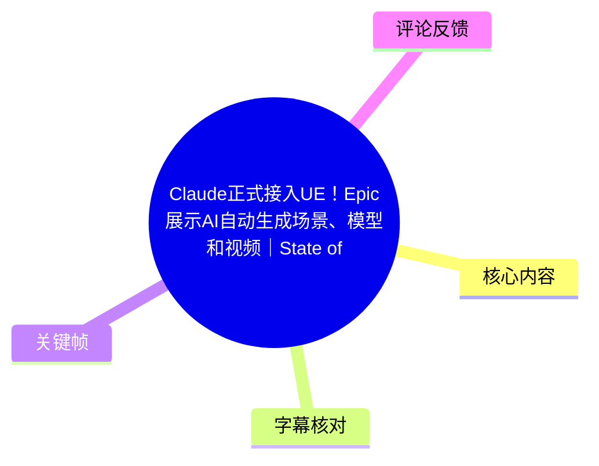
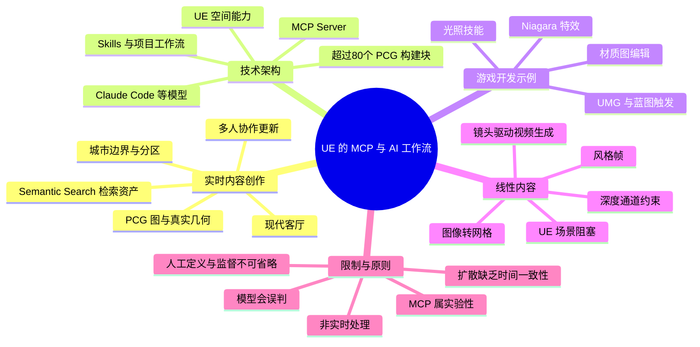
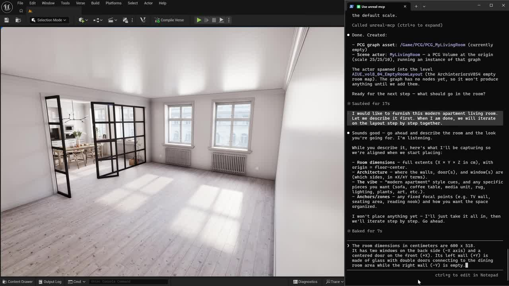
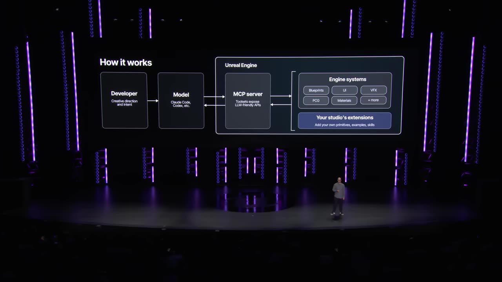
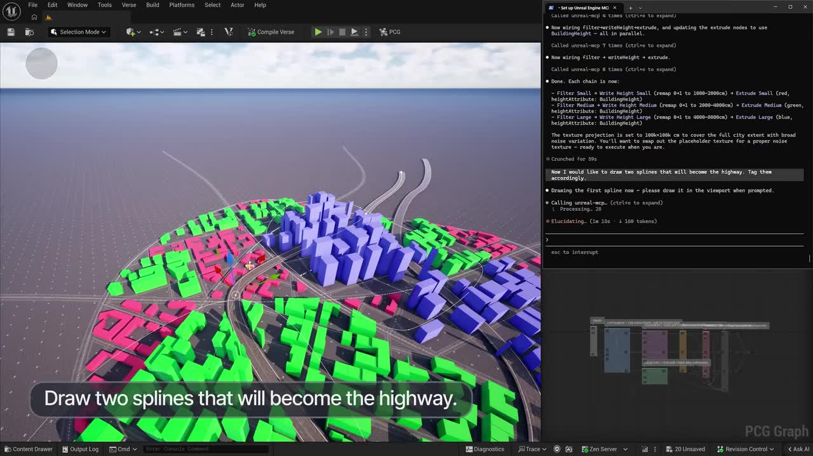
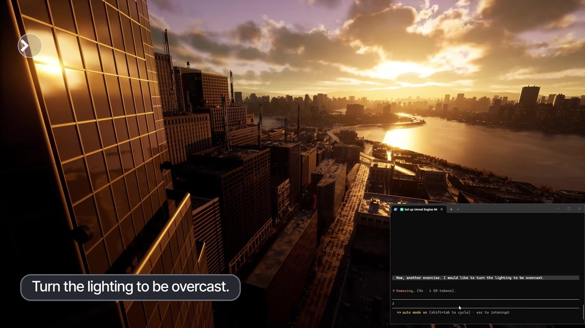

# Claude正式接入UE！Epic展示AI自动生成场景、模型和视频｜State of Unreal 2026

> 来源：[Bilibili 视频](https://www.bilibili.com/video/BV1E1Lf6rESs) 
> UP 主：CGTrove｜时长：14 分 56 秒｜分辨率：1920 × 1080 
> 视频说明：对 *State of Unreal 2026* 中 AI 部分的重点整理；原视频描述指向 YouTube 来源。

## 小结

这段演示展示了 Epic 在 Unreal Engine（UE）中围绕 **MCP Server（Model Context Protocol Server）** 构建的一套 AI 工作流：开发者可让 Claude Code 等模型通过 MCP 读取场景、理解资产并直接在引擎内执行操作。其重点不只是“文字生成一张图”，而是让 AI 参与创建和编辑可继续修改的 UE 场景、PCG（Procedural Content Generation，程序化内容生成）图、材质、Niagara 特效、UMG 界面与蓝图逻辑。

实时内容部分的核心案例是从现代客厅扩展到整座城市：用户先定义区域边界、分区与道路方向，模型利用 **Semantic Search** 从已有资产库检索适配资源并进行布置。演示强调最终产物是实际几何体和可打开、可编辑的 PCG 图，而非固定的生成图像；多人也可在各自会话中向同一城市增添内容，路网与街区会随之调整。

技术架构上，UE 的空间系统、PCG 基元、项目工作流示例和“技能（skills）”补足了大语言模型不擅长空间理解的短板。视频称 UE 5.8 随附 MCP Server、PCG Primitive Plugin 及其已开发的 skills，并提供超过 80 个基础 PCG 构建块；但 MCP Server 明确仍属 **experimental（实验性）**，开放并不等于无需人工监督。

线性内容与影视制作部分则展示了 UE 如何向图像、视频模型输出深度等条件数据：先在 UE 中完成场景阻塞、资产布置和镜头运动，再以深度通道与文字描述生成风格帧，继而把该风格帧作为首帧参考、把整段镜头的深度序列作为约束，交由视频模型生成视频。演示涉及 Nano Banana、Seed Dance 2.0、Flux、本地客户端、GPT Image、Grok Imagine、Luma 等模型或服务名称，但并非表示它们均已集成、均实时运行或均已正式发布。

视频最重要的经验是：**把 AI 放在可验证、可编辑、可回退的引擎工作流中。** 先由人设定边界、镜头、构图、已有资产和精确目标，再让模型执行宽范围迭代；随后检查其生成的图、手动调参并修正提示。演示本身也承认模型会误判，例如“阴天”要求被错误地作用于云材质；视频生成与 3D 网格生成都需要数分钟，本地扩散预览也缺乏时间一致性。

时效上，视频中“UE 5.8 当天发布 MCP Server、PCG 基元插件和 skills”以及“图像、视频创建工具将于明年初推出”均是演讲当时的说法。“明年初”相对于演讲发生时间，而非相对于本文整理日期；素材未提供官方后续版本、可用地区、授权条款、定价、模型 API 资格或最终发布日期，因此不能据此断言当前所有功能均已可用。

## 思维导图

## 目录

- [背景、新闻与适用范围](#背景新闻与适用范围)
- [MCP 如何连接模型与 Unreal Engine](#mcp-如何连接模型与-unreal-engine)
- [从客厅到城市：AI 参与 PCG 场景搭建](#从客厅到城市ai-参与-pcg-场景搭建)
- [光照、可编辑性与危险区域玩法原型](#光照可编辑性与危险区域玩法原型)
- [UE 5.8 的发布信息与团队工作流](#ue-58-的发布信息与团队工作流)
- [面向影视的图像与视频生成工作流](#面向影视的图像与视频生成工作流)
- [快速扩散概念设计与已知局限](#快速扩散概念设计与已知局限)
- [可复用步骤、参数与实践建议](#可复用步骤参数与实践建议)
- [结论、限制与时效性](#结论限制与时效性)
- [字幕比对](#字幕比对)
- [评论分析](#评论分析)
- [处理记录](#处理记录)

## 背景、新闻与适用范围 [00:00:00](https://www.bilibili.com/video/BV1E1Lf6rESs?t=0)

视频是 Epic 在 *State of Unreal 2026* 演讲中的 AI 内容节选。其覆盖两个方向：

1. **实时内容与游戏开发**：由模型经 MCP 操作 UE，辅助布置场景、生成或调整 PCG、材质、特效、UI 与蓝图。
2. **线性内容创作**：以 UE 场景、相机、深度和渲染数据作为约束，连接图像与视频模型，为影视概念设计、镜头预演和风格化视频生成提供控制基础。

视频开场把 UE 置于左侧、终端置于右侧，终端显示模型与 UE 的消息往返。ASR 在开场识别为“Cloud Code”，但后文演讲者多次明确说的是 **Claude Code**，并且视频标题也写明 Claude；因此本整理将其统一表述为 Claude Code，并保留 ASR 原词存在识别偏差的说明。

> 图：画面同时展示 UE 编辑器和右侧终端对话，终端中包含 PCG 图资产、场景 Actor 和房间尺寸等上下文。这是理解“模型不是脱离引擎单独生成，而是经 MCP 获取场景信息后操作 UE”的关键画面。

适用读者主要包括：

- 正在使用 UE 进行游戏场景、关卡、特效或工具开发的技术美术、关卡设计师、开发者；
- 需要通过预演、构图、镜头和深度约束控制图像/视频生成的影视与虚拟制作人员；
- 想评估“AI 是否能自动做游戏”的团队，而非仅希望了解单一文生图模型的使用者。

## MCP 如何连接模型与 Unreal Engine [00:02:36](https://www.bilibili.com/video/BV1E1Lf6rESs?t=156)

演讲给出的逻辑是：大语言模型擅长语言与推理，却不天然具备空间推理能力；UE 则具备场景、资产、几何、渲染与空间关系。MCP Server 位于两者之间，作为模型与引擎的桥梁，使模型能够：

- 读取当前 UE 场景；
- 理解可用资产；
- 直接在引擎内实施修改；
- 调用为 UE 工作流编码的工具、示例和 skills；
- 在不绑定某一个特定模型或工作流的前提下扩展使用。

视频在 [00:02:48](https://www.bilibili.com/video/BV1E1Lf6rESs?t=168) 明确说明其接口是开放的，因此并不锁定于单一模型。Claude Code 是现场演示使用的模型/客户端，但线性内容部分还提到可连接其他 LLM、图像模型与视频模型。

> 图：舞台上的架构图清楚标示了“Developer → Model → MCP Server → Unreal Engine”的关系。UE 一侧包含 Blueprints、UI、VFX、PCG、Materials 等引擎系统，并允许工作室增加自己的 primitives、examples 与 skills；这比“AI 直接替代 UE”更准确地解释了演示架构。

### 基础组件与技能层 [00:03:03](https://www.bilibili.com/video/BV1E1Lf6rESs?t=183)

视频称将提供：

- **超过 80 个基础 PCG 构建块**；
- 一个示例库；
- 将具体 UE 工作流编码进去的 **skills**；
- MCP Server；
- PCG Primitive Plugin。

这里的“技能”可理解为面向某项任务的可复用流程封装。例如光照技能可以让模型将自然语言的目标映射到多个相关设置，而不是只单独改一个参数。视频未展示这些 skills 的完整 API、文件格式、安装命令、权限模型或完整清单，因此不能将其视为可直接照抄的标准接口文档。

## 从客厅到城市：AI 参与 PCG 场景搭建 [00:00:18](https://www.bilibili.com/video/BV1E1Lf6rESs?t=18)

### 现代客厅：先给上下文，再逐步填充 [00:00:18](https://www.bilibili.com/video/BV1E1Lf6rESs?t=18)

演示先用一个“现代客厅”作为小规模示例。流程不是直接输入一句模糊描述后等待最终画面，而是先向模型说明：

- 要建造什么；
- 需要放置在关卡的什么位置；
- 房间的布局、风格和视觉锚点；
- 希望以何种顺序迭代。

为便于现场观众理解，画面只显示每条提示的摘要；完整提示仍可在终端中查看。视频还特别说明后续演示为了展示效果而加速，但画面中发生的是引擎内的真实操作。

初始要求包括沙发、地毯和咖啡桌，之后增加椅子、灯与边桌。UE 5.8 中的 **Semantic Search** 会从用户自己的资产库中找到与描述相符的资产。随后，用户还可手动添加一把椅子，定义为“阅读角”，模型据此调整该区域的陈设。

这表达了一个明确分工：

- 模型适合进行大范围、快速的迭代；
- 人更擅长确定真正想要的内容与取舍；
- 每一步创意决策仍由创作者作出。

### 城市：边界、分区、道路与资产布置 [00:01:27](https://www.bilibili.com/video/BV1E1Lf6rESs?t=87)

将同一原则扩展到城市时，演示的顺序为：

1. 绘制城市边界；
2. 确定各个区域的位置及其特征；
3. 按创作者指定的方向穿过高速公路；
4. 由此延伸并填充道路网络；
5. 让建筑逐步出现；
6. 通过 Semantic Search 从现有资产库寻找匹配资产并布置；
7. 要求在外围填充森林等环境元素。

> 图：UE 视口中可见不同颜色区块、道路样条和体块化建筑，右侧终端显示模型执行过程。它直观说明城市生成不是一张最终渲染图，而是由可见的区域划分、道路与可继续处理的场景结构组成。

视频在 [00:02:04](https://www.bilibili.com/video/BV1E1Lf6rESs?t=124) 强调输出结果是：

- 真实几何体（real geometry）；
- 真实的 PCG 图；
- 可打开、编辑和修改的内容。

因此，这种方案的价值不在于完全取消建模、布局与审美决策，而在于让自然语言操作、已有资产库、PCG 图和手工编辑可以连续衔接。

### 多人会话协作 [00:02:14](https://www.bilibili.com/video/BV1E1Lf6rESs?t=134)

视频还提出团队协作场景：其他开发者可以在各自会话中制作资产并直接放入城市，路网和街区会调整，城市能够吸收新内容。这里描述的是演示中的能力方向；素材未提供版本控制冲突策略、多人锁定机制、资产命名规范、合并规则或失败恢复方案。实际项目仍需结合 UE 的协作、版本管理和资产治理流程评估。

## 光照、可编辑性与危险区域玩法原型 [00:03:26](https://www.bilibili.com/video/BV1E1Lf6rESs?t=206)

### 用“光照技能”协调多参数 [00:03:26](https://www.bilibili.com/video/BV1E1Lf6rESs?t=206)

城市搭建完成后，演示转向光照。演讲者指出，在 UE 中调光往往需要同时处理数十项相互影响的参数，例如：

- 光照平衡；
- 云材质；
- Sky Atmosphere（天空大气）；
- 后期处理（Post Process）。

当用户要求“紫色黄昏”时，模型会协调这些设置，得到对应氛围。其可迁移经验是：对高度耦合的参数集合，AI 的价值可以是编排多个现有系统，而非凭空发明一个最终效果。

> 图：画面将城市渲染结果与终端提示并置，展示用自然语言调节光照的方式。它也对应随后演讲者对于“阴天”请求被错误解释的案例，提醒观众必须查看实际结果和底层变化。

### 模型会犯错，需可见、可改、可继续提示 [00:03:59](https://www.bilibili.com/video/BV1E1Lf6rESs?t=239)

演示中要求“阴天”时，模型错误地理解了天空，并以错误方式调整云材质。这不是被回避的失败，而被当作工作流的一部分：用户可以看见发生了什么，在下一条提示中修正，然后回到目标状态。

随后给出两类更具体的光照控制：

- 输入“波哥大上午 9:30”，模型依据其现实世界知识推算太阳位置、方向、温度和大气效果；
- 提供一张温哥华图片，让模型通过截图评估与迭代，尝试复制该图的视觉风格。

视频没有给出地理位置计算来源、时区处理、天气数据来源、物理准确性或参考图版权处理方式。因此这些应视作演示能力描述，而不应直接等同于经过认证的气象或地理模拟结果。

### 编辑权保留在 UE 中 [00:04:44](https://www.bilibili.com/video/BV1E1Lf6rESs?t=284)

无论是道路还是建筑，用户仍可直接在 UE 内编辑：

- 拖动道路，城市会围绕变化进行调整；
- 让建筑更高或在画面中更突出；
- 进入单个资产，继续把它修改到符合要求的程度。

演示的结论是“不是生成后无法改变的图像”，而是由用户控制全部组成部分的真实 UE 场景。这也是它与纯图像生成工作流的关键差别。

### 危险区域：材质、Niagara、UMG、蓝图的联动 [00:05:11](https://www.bilibili.com/video/BV1E1Lf6rESs?t=311)

视频以一个路口的危险区域为例：目标是在玩家靠近时出现闪烁警示灯、蒸汽和危险感。演讲者称纯手工跨多工种反复沟通通常需要数天，而演示采用如下分解：

1. **材质**：读取已存在的警示灯材质图，构建新增逻辑，并将其插入正确位置。
2. **人工校准**：进入 Material Instance Editor，手动微调最终数值。
3. **特效**：扩展 Niagara 模板，新增一个可同时驱动多个发射器的单一参数，以集中控制整个效果。
4. **界面**：通过提示和 UMG 构建状态显示、危险仪表和警示状态。
5. **玩法逻辑**：用 Blueprint 将近距离触发器连接至材质、Niagara 系统和 HUD。
6. **运行验证**：角色靠近时灯亮、蒸汽上升；进入区域后警示灯闪烁、蒸汽增强、现场爆发。

这说明模型被用于跨材质、VFX、UI 和蓝图的流程编排，但最终仍由 UE 的原生组件承担运行时逻辑。视频没有提供蓝图节点、材质节点、Niagara 参数名、性能指标或可复现工程文件，因而无法从素材中还原具体实现。

## UE 5.8 的发布信息与团队工作流 [00:06:29](https://www.bilibili.com/video/BV1E1Lf6rESs?t=389)

演讲者的判断是：上述内容若全靠手工，可能需要数月；配合 MCP Server 与 UE，美术人员可在数天内完成演示所示内容。这个“数月到数天”是现场演讲的定性说法，未给出项目规模、人员数量、资产准备程度、提示轮次或成本统计，不能作为通用生产效率承诺。

视频给出的团队层面建议是：

- 将自己的 primitives 纳入系统；
- 将自己的示例纳入系统；
- 将围绕团队管线形成的 skills 纳入系统；
- 随着项目投入积累，让这套系统对全体成员越来越有用。

在 [00:06:59](https://www.bilibili.com/video/BV1E1Lf6rESs?t=419)，演讲者称以下内容作为 UE 5.8 的一部分“当天发布”：

| 组件 | 视频中的状态 |
| --- | --- |
| MCP Server | 当天随 5.8 提供；开放、可扩展；同时明确为实验性 |
| PCG Primitive Plugin | 当天随 5.8 提供 |
| Epic 已开发的 skills | 当天随 5.8 提供 |
| 图像与视频创建工具 | 计划于演讲所称“明年初”提供，而非现场声称已发布 |

视频鼓励用户下载后“将模型指向它”进行尝试，但没有展示安装前提、下载地址、许可证、模型服务费用、身份认证或安全隔离设置。生产团队在接入前应额外确认模型的文件访问权限、项目资产保护、Token 成本、外部 API 数据传输和执行操作的审计能力。

## 面向影视的图像与视频生成工作流 [00:07:39](https://www.bilibili.com/video/BV1E1Lf6rESs?t=459)

### 从文本提示走向可控的视觉预演 [00:08:09](https://www.bilibili.com/video/BV1E1Lf6rESs?t=489)

演讲者 Pat Tubak 具有影视背景，并将此前的 MCP 插件扩展到线性内容场景。他列举 MCP 可连接 LLM，也可连接 Nano Banana、GPT Image、Grok Imagine、Luma、Seed Dance 等图像和视频模型。

他指出，常见图像生成方式是先写一段文本提示。现场例子为虚构的“Epic Motors”——一座 1950 年代加油站。但专业生产往往还需要：

- 命中既定故事点；
- 保持严格的连续性；
- 满足创意总监的精确要求；
- 通过草图和预演图进行视觉沟通。

UE 在这里承担的是构图、镜头、空间布局、资产位置与条件数据的可控来源。

### 1950 年代加油站：UE 阻塞与镜头预设 [00:08:35](https://www.bilibili.com/video/BV1E1Lf6rESs?t=515)

演示中的场景准备步骤如下：

1. 在 Fab 中选择 Quixel 的 **Derelict Corridor** 场景；
2. 快速改造成所需的加油站布局；
3. 在 **Detail Lighting Mode** 下工作，因为这一阶段主要用于阻塞；
4. 放入已有的货架、丙烷罐、柜子等资产；
5. 为缺失资产制作代理形体：长柜台、更多货架、收银机和冰柜；
6. 调整镜头构图；
7. 制作一个向下摇臂（boom down）和推进（push-in）动画，作为之后镜头的基础。

这一部分揭示了视频生成前的关键前提：先确定空间与运动，再让生成模型在受控条件下做视觉风格化，而不是要求模型从文本中猜测全部镜头语言。

### 深度通道 + 提示词生成风格帧 [00:09:11](https://www.bilibili.com/video/BV1E1Lf6rESs?t=551)

在正式生成视频之前，演示先制作一个单帧的 **style frame（风格帧）**，作为场景视觉参考。方法是把：

- UE 输出的深度通道（depth pass）；
- 先前写好的文字描述；

共同提供给模型。演讲者的解释是，深度数据让模型理解布局与构图。

随后，他要求经 MCP 连接的 Claude Code 调用 UE 的 **Movie Render Graph**，创建一张 **4K 图像**及相关输出。“要求得到一个 Unreal render”被作为信号，使 Claude Code 理解需要把深度通道交给图像模型，同时采用提示词描述的创意视觉风格。

在模型生成期间，演讲者检查了它为任务创建的图（graph）。这是视频中反复出现的控制原则：不要只看 AI 最终结果，也要检查它建立的流程。

图像模型接收来自 UE 场景的视觉数据和条件信息；现场例子使用的是 Google 的 **Nano by Nano Pro**。结果被评价为既匹配所要求的视觉细节，也严格匹配 UE 视口构图，而不是随机摆放元素。

### 从 2D 生成元素回收为可编辑 3D 网格 [00:10:27](https://www.bilibili.com/video/BV1E1Lf6rESs?t=627)

接下来需要给地面增加一个轮胎，但该轮胎原先只存在于图像生成结果中，没有对应的 3D 资产。流程为：

1. 在编辑器中用新的图像分割工具为轮胎建立 mask；
2. 同时选中 mask 与图像；
3. 调用预定义工作流，请 Claude Code 将轮胎提取、修复并使用 **Tripo 3.1** 网格化；
4. 检查生成的 graph，并监督过程；
5. 等待数分钟，得到带纹理的轮胎网格；
6. 将网格保存至 Content Browser；
7. 把轮胎放入 3D 空间中的指定位置；
8. 再要求 Claude Code 将轮胎添加回图像。

结果中，新轮胎被放置在指定位置，且看起来像原本生成轮胎的一个变化版本，而不是完全重复的拷贝。这个案例的关键不是网格生成必然准确，而是把图像中的偶发元素重新纳入 UE 的可编辑 3D 场景。

### 用高质量源资产约束图像模型 [00:11:19](https://www.bilibili.com/video/BV1E1Lf6rESs?t=679)

演示接着从 Fab 浏览 Megascans 的废车场汽车零件，选择一块具有 1950 年代造型特征的翼子板。选择该资产的理由是：已有模型把时代特征显式建好，从而降低图像模型自行想象的空间。

之后要求 Claude Code 把翼子板加入图像，并表现为刚重新喷漆的样子；经过 Nano Banana 的又一次图像处理后完成。这里的经验是：**越高质量、越明确的源资产，给模型留下的解释空间越少。** 视频后段也以 Kitbash 3D 高级环境包及 City Sample 内部资产的风格化案例再次强调了这一点。

### 利用镜头深度序列生成视频 [00:11:49](https://www.bilibili.com/video/BV1E1Lf6rESs?t=709)

完成风格帧后，演示返回 UE 的新工具生成视频。具体设置为：

1. 使用前面制作的镜头运动；
2. 在右侧运行 **Sequence Render Node**，输出整个镜头范围内的深度数据；
3. 对视频采用与静帧相同的深度重风格化思路；
4. 将生成的风格帧作为视频模型的首帧参考；
5. 在场景中加入一只猫，以增加生命感；
6. 将视频生成节点设为 **Seed Dance 2.0**；
7. 设置分辨率；
8. 添加音频；
9. 发起任务并等待数分钟；
10. 得到生成视频。

视频中没有公布实际分辨率数值、帧率、视频长度、音频来源、Seed Dance 2.0 的具体服务版本或成本。因此“设定分辨率、添加音频”是操作步骤，但不是可复用的完整参数表。

演讲者评价结果时说，该流程清楚表明自己可以控制镜头，但“没有人能控制一只猫”。这句话说明镜头与总体构图受控不等于每个生成主体的动作都受控；生物运动和细节行为仍可能具有不确定性。

## 快速扩散概念设计与已知局限 [00:12:44](https://www.bilibili.com/video/BV1E1Lf6rESs?t=764)

### UE 视口与本地 Flux 并排预览 [00:12:44](https://www.bilibili.com/video/BV1E1Lf6rESs?t=764)

另一个并行开发的工作流面向快速概念设计：左边是 UE 视口，右边是流式传输到本地 Flux 客户端图像模型后的结果。现场依次尝试：

- 日落光照；
- 公寓刚经历火灾后的状态；
- 位于浑浊池塘底部的水下状态；
- 木炭素描；
- 水彩画风。

其真正价值不只是“快速换风格”，而是艺术家能返回 UE 视口直接操作资产，并通过扩散模型这一新的视觉镜头观察它们重新定位后的结果。

### 现场明确承认的性能与一致性限制 [00:13:03](https://www.bilibili.com/video/BV1E1Lf6rESs?t=783)

视频非常明确地说明该本地模型的局限：

- **不具备时间一致性（temporally coherent）**；
- 每一帧都像重新盖上一张新图；
- 每秒只运行数帧；
- 因此右侧结果看起来更慢。

演讲者将“实时且时间一致的扩散”描述为随着模型能力与硬件改进后可以预期的未来方向，而不是当前已实现状态。对实际生产而言，概念预览和最终镜头交付应分开评估：前者可容忍闪烁和低帧率，后者则需要更严格的时序稳定性、角色一致性、可重现性与后期可控性。

### 最终定位：创作迭代的放大器 [00:14:14](https://www.bilibili.com/video/BV1E1Lf6rESs?t=854)

视频将这批新 UE 工具定位为创作者的 **force multiplier（能力放大器）**：它与 UE 既有的实时动画、建模、纹理和虚拟制作工具并行，为艺术家增加创作迭代机会，而非宣称这些工具完全取代既有岗位与流程。

在 [00:14:30](https://www.bilibili.com/video/BV1E1Lf6rESs?t=870)，演讲再次重申：

- 支撑这些能力的 MCP Server 是实验性的；
- 图像与视频创作功能预计在演讲所称的“明年初”提供；
- 真正有用的模型不应只降低技术复杂度，也必须提供完整的创作控制权。

## 可复用步骤、参数与实践建议 [00:00:18](https://www.bilibili.com/video/BV1E1Lf6rESs?t=18)

以下为依据视频实际流程归纳的实践清单，不包含视频没有公开的命令、节点连接、模型密钥或参数数值。

### A. 用 AI 搭建可编辑 UE 场景

1. **从限定上下文开始**：说明目标内容、关卡位置、边界、布局、视觉锚点及所用资产范围。
2. **拆分为小步迭代**：先放基础家具/体块，再添加阅读角等局部意图；城市先定义边界，再划分分区，最后处理道路、建筑与环境。
3. **优先复用已有资产库**：通过 Semantic Search 查找与描述匹配的资产，避免让模型完全自行猜测外观与空间。
4. **保持 PCG 图和几何可编辑**：对模型创建的图和场景结构进行检查，不把最终画面当成不可修改的终点。
5. **人工完成关键审美决策**：模型负责宽范围探索，人负责目标、取舍、具体修改和最终验收。
6. **为团队积累 skills 和示例**：将已验证的项目流程、基础组件和案例逐步编码为团队可调用资源。

### B. 用 AI 辅助复杂的引擎系统联动

1. 先让模型读取已有材质图或模板，而非无上下文重建。
2. 对新增材质逻辑要求插入到现有图的指定位置。
3. 在 Material Instance Editor 中手动调整最终参数。
4. 从 Niagara 模板扩展，使用一个参数统筹多个发射器。
5. 通过 UMG 构建状态显示和警示状态。
6. 用 Blueprint 把触发器、材质、Niagara 和 HUD 连接起来。
7. 在实际运行状态中验证接近、进入和退出等触发行为。

### C. 以 UE 约束图像与视频模型

1. 在 UE 中先完成场景阻塞和镜头动画。
2. 对缺失资产先使用代理形体保证构图与空间关系。
3. 用 Movie Render Graph 输出至少包含深度通道的渲染条件；视频中静帧输出为 **4K 图像**。
4. 将深度通道与文字描述共同交给图像模型，先生成风格帧。
5. 检查 AI 创建或使用的图（graph），确认其处理链符合预期。
6. 若图像内有需要保留的物件，利用图像分割 mask 提取并回收为网格，再置回 UE 场景。
7. 用更明确、更高质量的 3D 资产缩小图像模型自由发挥的范围。
8. 对视频，输出整个镜头范围内的深度序列，将风格帧作为首帧参考。
9. 设置所选视频模型、分辨率和音频后提交任务。
10. 为图像、网格和视频生成预留数分钟级别的处理时间，并检查主体行为与时间一致性。

### 视频中出现的明确参数、名称与状态

| 项目 | 视频给出的信息 | 未给出的信息 |
| --- | --- | --- |
| UE 版本 | 5.8 | 具体小版本、安装条件 |
| PCG 基础构建块 | 超过 80 个 | 全部清单及接口 |
| 静帧输出 | 4K 图像 | 精确像素规格、格式、色彩空间 |
| 图像模型案例 | Google 的 Nano by Nano Pro；还列举 Nano Banana、GPT Image、Grok Imagine、Luma | 各模型的接入方式与版本 |
| 网格生成案例 | Tripo 3.1 | 网格面数、贴图规格、成功率 |
| 视频模型案例 | Seed Dance 2.0 | 分辨率、时长、帧率、种子、费用 |
| 本地扩散预览 | 本地 Flux client；每秒仅数帧 | 硬件配置与推理参数 |
| 处理时长 | 网格和视频均称数分钟 | 具体耗时、队列时间与并发限制 |
| MCP 状态 | 实验性、开放、可扩展 | 权限、沙箱、审计与安全策略 |

## 结论、限制与时效性 [00:14:30](https://www.bilibili.com/video/BV1E1Lf6rESs?t=870)

### 可以从视频中确认的结论

- MCP Server 使模型能够以 UE 场景、资产与工具为上下文执行操作，而不是仅生成脱离项目的文本或图像。
- 演示覆盖了场景布置、PCG、光照、材质、Niagara、UMG、蓝图、图像重风格化、2D 转 3D 网格和视频生成。
- 演示强调结果应继续保留为可编辑的 UE 几何、PCG 图、资产与镜头结构。
- 高质量源资产、深度通道、UE 构图与预设镜头，可以减少图像/视频模型的自由猜测，增加可控性。
- 工作流依赖人设定边界、检查图、微调参数和修正错误，AI 并非无人监督的自动游戏开发器。

### 不能从视频直接推出的结论

- 不能据此证明 AI 可稳定独立完成完整商业游戏；
- 不能证明“数月变数天”适用于所有团队、项目或资产规模；
- 不能证明所有被列举的图像与视频模型已正式集成或可在所有地区使用；
- 不能确认 UE 5.8 之后这些功能的最终发布状态、价格、许可、安全性或兼容性；
- 不能确认视频演示中各项生成结果的可复现性、Token 消耗、资产版权状态或运行时性能；
- 不能因视频标题写“Claude 正式接入”而忽略演讲本身对 MCP Server“实验性”的限定。

### 时效性提示

视频中关于“今天发布”和“明年初发布”的说法以演讲发生时点为准。当前素材仅给出了 Bilibili 元数据与视频转录，没有提供 Epic 官方后续公告或版本更新记录。若计划落地，应以当前 UE 官方文档、插件仓库、模型服务条款和项目安全规范为准。

## 字幕比对

| 字幕来源 | 完整性 | 专有名词 | 时间轴 | 主要问题 |
| --- | --- | --- | --- | --- |
| Bilibili 站内字幕 | 未提供可用字幕 | 无法核验 | 无法使用 | 素材记录显示字幕工具请求失败：`Invalid URL`，未获得可比较的站内 SRT/字幕内容 |
| 本次 ASR 字幕 | 较完整：102 段，语音覆盖约 798.81 秒，占视频约 89.21% | 整体可用，但存在少量名称歧义 | 完整，带毫秒级起止时间 | 开场将 Claude Code 识别为“Cloud Code”；部分模型/产品名可能因英语 ASR 而存在拼写或断句风险 |

### 最终字幕选择

本整理采用 **本次 ASR 的时间轴** 作为章节链接依据。原因是站内字幕未提供可用内容，而本次 ASR：

- 识别语言为英语，置信度 `0.9990234375`；
- 具有完整时间戳；
- 覆盖从 `00:00:00.590` 至 `00:14:51.730`；
- 仅有一处较大语音空档：`00:07:27.210—00:07:37.120`，约 9.91 秒，对应发言人交接。

未发现 `noAudioStream=true` 标记；相反，素材提供了 `audio/audio.wav`，且 ASR 有高覆盖度。因此本视频属于有音轨、以本次 ASR 为主的情形，并非工具失败或无音轨视频。

### 依据上下文校正或保留的术语

- **Claude Code**：开场 ASR 为“Cloud Code”，但后文多次明确说“Claude Code”，且标题亦写“Claude”，故正文统一采用 Claude Code。
- **MCP Server**：由多处语音和关键帧架构图共同确认。
- **Semantic Search**、**PCG**、**Niagara**、**UMG**、**Movie Render Graph**、**Detail Lighting Mode**：均由 ASR 连续语境支持。
- **Nano by Nano Pro**：按照 ASR 原文记录；素材未给出官方拼写或链接，故不额外扩展其产品归属。
- **Tripo 3.1**、**Seed Dance 2.0**、**Flux client**：按 ASR 所述保留，不对产品版本、能力和接入状态做素材以外的推断。

## 评论分析

以下仅分析可获取的热评前三条。评论反映用户经验或担忧，不等同于已验证事实。

### 1. 茶渊（89 赞）

> “一看账单 ai 偷偷买了商城一堆付费资产”

这是一条调侃式担忧，指向 AI 自动检索或调用资产时可能引发的付费资产采购、预算失控与授权问题。视频确实展示了 Semantic Search 从“你的资产库”中检索资源，也展示了从 Fab 浏览资产，但没有说 AI 会自动购买商城资产。

**可取的补充**：团队若接入外部模型或资产商城，应限制购买权限、记录资产来源、控制预算，并将“可检索资产范围”限定为已授权库。  
**可信度边界**：评论没有提供实际发生的购买案例，不能据此认定演示工具具备自动下单能力。

### 2. _Refuse_（23 赞）

该评论自述拥有美术背景、从 2014 年开始使用 UE4，并试用过“UE5.8 + Claude”。其核心观点包括：

- UE 本身不自带完整 AI，需要借助 Claude 等外部大模型；
- 模型初次调用 UE 操作时可能无法理解如何调用软件，从而反复试探并消耗大量 Token；
- 即使比纯人工快，熟练 UE 用户可能会因等待和不确定性而感到难受；
- AI 更适合作为不熟悉某项功能或系统时的辅助，而不应被当作独立开发游戏的希望；
- 提示词必须包含明确关卡名、对象类型、Actor/静态网格体属性和坐标等，否则模型可能在错误关卡中操作；
- 不确定性会使“快”不一定等于“得到正确结果”。

**与视频的对应关系**：这与视频的部分表述一致。演示本身强调用户每一步都在做创意决策、应检查模型创建的 graph、模型会误判阴天效果，并要求在 Material Instance Editor 手动调值。  
**评论提供的额外信息**：Token 消耗、模型不理解目标关卡、提示词精确性和熟练用户体验等细节，视频未量化展示。  
**可信度边界**：这是个人使用报告，未提供项目、提示文本、日志、版本号或成本数据，不能将其泛化为所有 UE 5.8/MCP/Claude 配置的必然表现。

### 3. 韩婴凡（17 赞）

> “这种还是很蠢的，ai自己去商城买模型……真正的ai会自己在场景里建模，你要什么就建什么”

该评论质疑“检索商城/资产库”是否只是换一种自动摆放，认为更理想的 AI 应在场景中直接建模。视频实际上展示了两条不同路径：

- 实时场景部分主要依赖 Semantic Search 从已有库寻找适合资产，并通过 PCG 布置；
- 线性内容部分展示了从图像中分割轮胎、再经 Tripo 3.1 生成纹理网格的流程。

因此，视频并非只展示资产检索，也有图像到网格的案例；但它没有展示“用户任意描述一个资产，AI 在 UE 内即时可靠完成高质量可生产建模”的能力。

**可信度边界**：关于“AI 自己去商城买模型”的说法同样不是视频事实。视频只说明使用既有资产库与 Fab 资产，不包含自动购买行为。

## 处理记录

- Worker ID：`worker-mrj0wbly-5dc4e50c`
- 模型：`gpt-5.6-terra`
- 素材处理工具与结果：使用任务提供的音频提取结果、关键帧目录、ASR 结果 JSON、ASR SRT、视频元数据和热评 JSON；ASR 模型为 `medium`，运行于 `cuda`，计算类型为 `float16`。
- 字幕检查：已检查站内字幕与本次 ASR。站内字幕未提供可用内容，且素材警告记录为 `subtitles: Tool process exited with code 1 ... Invalid URL`；本次 ASR 存在音轨、完整时间轴和较高覆盖率，故选作正文时间轴依据。
- 字幕选择：采用本次 ASR SRT 的真实分段起止时间换算秒数生成 Bilibili 时间轴链接；结合视频标题、后续 ASR 语境和关键帧，对开场“Cloud Code”校正为“Claude Code”。
- 关键帧选择依据：
  - `frames/frame-001.jpg`：UE 编辑器与终端并列，说明 MCP/模型操作场景的上下文读取；
  - `frames/frame-002.jpg`：城市 PCG 区块与道路样条，说明从边界、分区到路网的生成流程；
  - `frames/frame-003.jpg`：开发者、模型、MCP Server 与 UE 系统的架构关系；
  - `frames/frame-004.jpg`：城市光照请求与终端，说明自然语言光照调节及其需要验证的性质。
- 评论处理：仅使用可获取热评前三条，未扩展至其他评论。
- 缓存清理：素材未提供缓存清理日志，无法确认是否已执行缓存清理；本整理未新增可报告的本地缓存清理操作。
- 未解决问题：
  - 未提供 Epic 官方技术文档、插件下载页、完整技能清单、安装说明和后续更新状态；
  - 未提供图像/视频模型的完整参数、成本、授权与地区可用性；
  - 未提供实际项目中的 Token 消耗、性能、多人协作冲突处理和安全权限策略；
  - 视频中的“当天”“明年初”均需结合演讲原始日期及官方后续公告重新核验。
