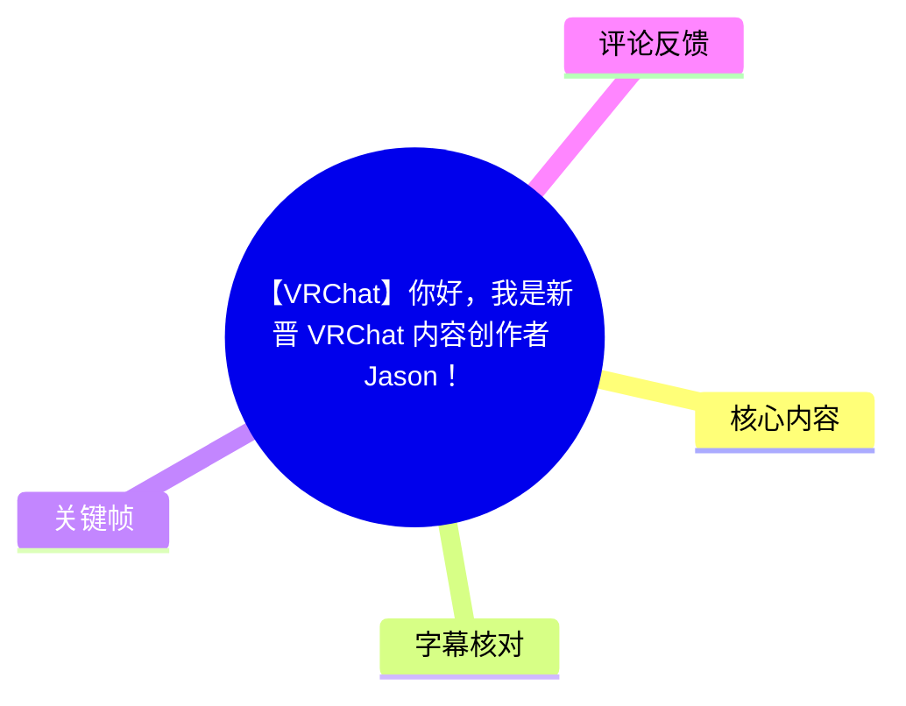
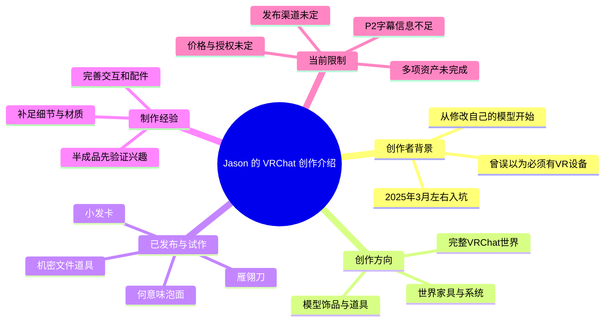

# 【VRChat】你好，我是新晋 VRChat 内容创作者 Jason！

> 来源：[Bilibili 视频](https://www.bilibili.com/video/BV1KA736QEKf) 
> UP 主：Jason_森石｜时长：17 分 58 秒｜分 P：2（P1 06:32、P2 11:26）｜画面规格：1920×1080 
> 数据抓取时间：2026-07-13；当时数据为播放 1,591、点赞 128、收藏 61、投币 41、评论 33。

## 小结

这是一支 VRChat（VRC）内容创作者的自我介绍与创作方向说明视频。Jason 表示自己于 **2025 年 3 月左右**进入 VRChat，最初只修改自己的模型，随后开始尝试制作世界，并在自我评估作品“还行”后，决定将制作的内容整理、完善后向社区分享。

视频最明确的创作规划是：持续制作供 VRChat 使用的资产，范围包括**模型饰品与道具、世界家具、系统类资产，以及完整世界**。UP 主已发布的首个产品是“小发卡”；片中展示的泡面、雁翎刀与“机密文件”均仍属于不同完成度的试作或半成品，而非已正式交付的产品。

对创作者而言，视频提供的核心经验是：可以从“为自己改模型”这一低门槛实践起步，再逐步扩展至世界制作与可分享资产；在发布前，应先补足模型细节、材质、交互和配套部件。Jason 对雁翎刀的自检尤其具体：已有抽拔交互、血槽、刻字及前段双面刃等特征，但雕刻纹路、刀鞘、刀吞处狮子造型和材质均待完善。

视频不是 VRChat 官方新闻、教程或产品说明书，未给出 Unity、SDK、建模软件、材质参数、性能指标、商店链接、许可证或明确发布日期。因此，所有“会发布”“免费提供”“增加口味”等内容均应理解为 UP 主在视频中的意向，不能视作已经实现的承诺。

时效上，视频中的粉丝量、资产进度、发布渠道和免费计划均可能已经变化；抓取时的互动数据也只是 2026-07-13 的快照。尤其是简介提到 P2 为“未完成的半成品世界”，但当前可用字幕没有覆盖其完整讲解，本文不会据此补写世界内容。

## 思维导图

## 目录

- [视频背景、分 P 与时效性](#视频背景分-p-与时效性)
- [创作者定位与资产计划](#创作者定位与资产计划)
- [从玩家到内容创作者的路径](#从玩家到内容创作者的路径)
- [半成品资产与完善方向](#半成品资产与完善方向)
- [资产制作与发布的可执行流程](#资产制作与发布的可执行流程)
- [P2 半成品世界：可确认信息与信息边界](#p2-半成品世界可确认信息与信息边界)
- [关键限制、风险与时效性](#关键限制风险与时效性)
- [字幕比对](#字幕比对)
- [评论分析](#评论分析)
- [处理记录](#处理记录)

## [视频背景、分 P 与时效性](https://www.bilibili.com/video/BV1KA736QEKf?t=0)

视频由两个分 P 组成：

| 分 P | 标题 | 时长 | 可确认内容 |
| --- | --- | ---: | --- |
| P1 | Jason 的自我介绍 | 06:32 | 创作者背景、创作计划、小发卡与多个半成品资产展示。 |
| P2 | 半成品世界介绍 | 11:26 | 视频简介明确称其为“目前未完成的半成品世界”；当前提供的字幕仅在 P2 开头出现零散片段，未提供足以完整复原世界功能与设计的信息。 |

UP 主在简介中称，未来将持续产出 VRChat 用资产，涵盖 Avatar 饰品、世界资产等；这与 P1 口述的创作范围一致。视频标签为 `VR`、`宣传`、`新人Up主`、`VRChat`、`VRC` 等，内容性质更接近创作者宣传与作品征询，而不是某一资产的完整教程。

> 图：该帧直接对应开场提出的三个问题——“我是谁、我在做什么、接下来的计划是什么”。它说明视频以虚拟形象出镜，并以创作者介绍而非屏幕录制教程为主要呈现方式。

### 时间与数据的适用边界

- 视频元数据显示发布时间为 **2026-06-23**；本文以该时间为视频陈述的参考时点。
- UP 主在口述中说自己“去年 2025 年 3 月份左右”入坑 VRChat。这是其个人经历陈述，并非 VRChat 产品版本信息。
- 抓取时显示的播放、点赞、收藏、投币与评论数量会随平台实时变化，不能作为长期固定数据。
- 视频没有给出资产的最终名称、下载地址、售价、免费协议、可商用范围、Quest/PC 兼容性或上架日期。

## [创作者定位与资产计划](https://www.bilibili.com/video/BV1KA736QEKf?t=20)

Jason 将本期目标明确概括为介绍自己、说明正在做的事，以及后续计划。他提到，部分观众可能通过“小发卡”的宣传视频认识自己；同时也坦言当时账号粉丝量较少。

### 计划覆盖的资产类型

| 类别 | 视频中的表述 | 可确认程度 |
| --- | --- | --- |
| Avatar / 模型资产 | 模型用的饰品、道具 | 明确计划 |
| 世界资产 | 家具、系统及其他世界用物品 | 明确计划 |
| VRChat 世界 | 包括世界本身 | 明确计划；已有一个未完成世界 |
| 已发布产品 | 小发卡 | UP 主称其为前几天发布的第一款产品 |
| 未来分享内容 | 对已有半成品进行精致化后发布 | 条件性计划，取决于兴趣与后续完善 |

> 图：该帧将视频中的资产范围落到“模型用饰品、道具”这一具体类别，是理解其创作定位的关键画面。画面中的字幕可辅助校正 ASR 将“饰品、道具”识别为“视频道具”的错误。

这里的“系统”仅是创作者列举的世界资产方向，视频并未解释系统具体指传送、交互、同步、管理还是其他功能，也未演示其技术实现。因此不能从该表述推断已有成熟的世界系统产品。

## [从玩家到内容创作者的路径](https://www.bilibili.com/video/BV1KA736QEKf?t=80)

Jason 回顾的路径可整理为四个阶段：

1. **长期知晓但未尝试阶段**  
   他表示很早就知道 VRChat，也看过许多切片；但因名称中含有“VR”，一度误认为必须拥有 VR 设备才能游玩。

2. **通过 Steam 重新认识产品形态**  
   在 Steam 看到 VRChat 并阅读介绍后，他发现可以不使用 VR 设备、以普通桌面模式进入游戏。视频使用“当人棍”的社区口语指代这一体验。

3. **从个人模型修改开始实践**  
   入坑初期，他主要是“修修改改自己的模型”。这属于以个人需求驱动的练习方式：先在自身 Avatar 上尝试，再积累资产制作经验。

4. **尝试世界制作，再转向公开创作**  
   后来他开始制作自己的世界，即片中所说尚未完成的世界。随后，他认为自己的作品具备一定可分享性，并考虑以分享作品、获得零花钱为目标，开始 VRChat 内容创作；首个产品即为小发卡。

> 图：该帧为创作者个人时间线提供了最直接的画面证据。其价值在于将“2025 年 3 月左右”限定为 UP 主自述的入坑时间，而不是视频发布时间或资产创建时间。

### 可迁移的创作经验

视频没有提供软件操作教学，但能提炼出一种适用于个人创作者的推进方式：

- 以已有 Avatar 的小修改作为切入点，降低首次制作的范围；
- 在小型资产之外，尝试世界制作以接触更复杂的内容形态；
- 不急于把粗糙试作直接作为正式作品发布，而是先收集潜在用户是否感兴趣；
- 对有需求反馈的资产，再投入时间完善细节、材质、配件与交互；
- 发布前应明确作品状态，避免将半成品表述为可立即使用的成品。

## [半成品资产与完善方向](https://www.bilibili.com/video/BV1KA736QEKf?t=180)

Jason 在这一段展示了多个尚未完成或仅有初步概念的资产。它们的共同特征是：已经有明确的主题或基本功能，但其完成度、发布方式和最终质量仍待后续处理。

### 泡面道具：从趣味试作到可能的免费分享

视频中以“何意味泡面”作为示例。UP 主将其定位为先前因好玩制作、完成度较粗糙的半成品；如果观众有需求，他考虑：

1. 提升整体精致度；
2. 增加多种口味；
3. 寻找一个发布渠道；
4. 以免费形式供大家下载。

需要注意的是，UP 主同时明确说“到时候找个地方发布”，表明**发布平台尚未确定**。此外，“免费”“免费下载”是当时的创作意向，未包含授权协议、二次分发规则、编辑权限或使用限制。

### 雁翎刀：已有交互原型，细节与配件未完成

雁翎刀是片中技术信息最具体的半成品之一。Jason 表示其灵感来自此前在 B 站看到的视频，并尝试进行复刻。当前可确认的制作状态如下：

| 项目 | 当前状态 | 说明 |
| --- | --- | --- |
| 收刀 / 拔刀 | 已实现 | 视频口述其可“收回去”“拔出来”，说明已具备基础交互或展示动作。 |
| 血槽 | 已制作 | UP 主明确提到刀身做了血槽。 |
| 刻字 | 已制作 | 片中称刀上已刻字。 |
| 前段双面刃 | 已制作或已按该特征呈现 | UP 主指出雁翎刀前半部分开双面刃。 |
| 精细雕刻与纹路 | 未完成 | UP 主称尚未进行精细雕刻、纹路处理。 |
| 刀鞘 | 未完成 | 明确称刀鞘未做。 |
| 刀吞处狮子造型 | 未完成 | 原型构思为狮子张口咬住刀条，但目前没有制作。 |
| 材质 | 待调整 | UP 主对当前材质效果表示仍需调节。 |

UP 主称，刀吞部分的灵感来源于名为“狮子互保”的出土文物；这一名称、文物属性及具体形制均为视频口述，本文未获得外部文物资料核验，不能进一步延伸其历史来源或年代。

> 图：该帧虽然位于创作经历的叙述段，却能直观说明作者从个人模型修改开始的实践基础。它对于理解后续泡面、武器与文件等道具为何仍处于迭代阶段具有衔接价值。

### “机密文件”：社交表演用途的概念道具

片中另有一份“机密文件”道具，灵感来自摄影博主。视频以在 Japan Shrine 遇到陌生人后的情景化表演来展示其用途：从腰间取出文件，并配合一套台词形成互动效果。

这部分应理解为娱乐化的社交演示，不能保证其能带来片中夸张描述的社交结果。UP 主也说明该作品目前“只是一张纸”；如有需要，才会将其制作得更精致。视频未给出纸张以外的模型结构、动画、触发方式、同步逻辑或实际交互配置。

## [资产制作与发布的可执行流程](https://www.bilibili.com/video/BV1KA736QEKf?t=205)

以下流程是根据视频中已经发生的制作实践和 UP 主明确提出的后续计划整理的，不是视频提供的 Unity/VRChat SDK 操作教程。

### 1. 确定资产的使用场景

先区分目标是：

- Avatar 上佩戴的饰品；
- Avatar 可持有或触发的道具；
- 世界内的家具、装饰或系统；
- 独立 VRChat 世界。

不同类型对应的功能要求不同。以片中雁翎刀为例，其重点不只是外观，也包括收刀、拔刀等使用过程；以机密文件为例，其重点则是视觉呈现与社交表演情境。

### 2. 先完成可展示的原型

视频中的泡面、雁翎刀、文件均体现了“先做出概念原型”的阶段：

- 泡面：已有趣味主题，但想增加口味与精致度；
- 雁翎刀：已有基础抽拔与部分刀身特征；
- 文件：已有纸张及使用情境，但尚未扩展为更完整的资产；
- 世界：已开坑但未完成。

原型阶段的价值是验证创意能否在 VRC 环境中表达，而非提前宣称其为完整商品。

### 3. 根据反馈决定是否继续投入

Jason 多次以“如果大家想要”“如果大家感兴趣”“觉得有做的价值”为继续完善的条件。可执行的反馈判断维度包括：

- 是否有人明确表示希望下载或使用；
- 用户更在意外观、互动、口味/变体还是历史细节；
- 资产是否值得补齐配套内容，例如刀鞘；
- 制作者是否有能力完成预期细节，例如狮子头雕刻。

该做法的优点是将高成本精修放在需求验证之后；其限制是评论中的兴趣表达并不能等同于真实下载量、付费意愿或长期维护需求。

### 4. 补齐决定完成度的细节

片中明确揭示的完善项包括：

| 资产 | 需要补齐的内容 |
| --- | --- |
| 泡面 | 更精致的制作、更多口味。 |
| 雁翎刀 | 纹路和雕刻、刀鞘、刀吞狮子头、材质调整。 |
| 机密文件 | 从“一张纸”发展为更精致的成品形态。 |
| 世界 | 完成尚未完成的世界内容；具体待办未披露。 |

### 5. 再确定发布渠道与规则

视频没有确定发布地点。若后续实际发布，仍需由创作者单独说明：

- 下载或售卖平台；
- 免费、付费或赞助模式；
- 使用范围与授权；
- 是否允许修改、再分发、商用；
- 适用的平台与性能限制；
- 更新、修复与售后边界。

这些信息均未在本视频中给出，不能根据“免费发布”的口述替代。

## [P2 半成品世界：可确认信息与信息边界](https://www.bilibili.com/video/BV1KA736QEKf?t=392)

P2 标题为“半成品世界介绍”，时长 11 分 26 秒。视频简介进一步说明：P2 是“目前未完成的半成品世界”，并称该世界“拖了很久”。

当前可确认的信息仅包括：

- Jason 曾在早期尝试制作自己的世界；
- 该世界在 P1 录制时仍未完成；
- P2 专门用于介绍这个半成品世界；
- UP 主希望它能尽快完成。

但提供的站内字幕在 P1 结尾后仅出现“好的各位大家早上好……这里是 Jason”等零散开头文本，ASR 也没有提供 P2 的有效完整转写。因此以下内容均**不可确认**：

- 世界名称；
- 世界主题、布局、房间数量或场景风格；
- 可交互物、系统、同步机制；
- 使用的建模或开发工具；
- 性能优化、平台兼容性；
- 完工时间和访问链接。

为避免把视频简介中的“半成品世界”扩写成具体世界设计，本文不对 P2 的未转写部分作推断。

## [关键限制、风险与时效性](https://www.bilibili.com/video/BV1KA736QEKf?t=360)

### 视频内容的限制

1. **多项作品尚未完成**  
   泡面、雁翎刀、机密文件与世界均存在不同程度的待完善内容。只有“小发卡”被 UP 主称为已经发布的第一款产品。

2. **没有可复现的技术参数**  
   视频没有披露多边形数量、贴图尺寸、材质设置、Shader、Unity 版本、VRChat SDK 版本、PhysBone/Constraint 配置、交互逻辑或性能等级，不能直接据此复刻资产。

3. **发布承诺尚不具备可验证性**  
   泡面的免费发布、发布平台和其他资产的精修均依赖后续决定。视频中没有可核验的链接或发布日期。

4. **历史原型表述未做外部核验**  
   对雁翎刀及“狮子互保”的描述来自 UP 主口述。本文保留其原话含义，但不将其扩展为经过史料确认的结论。

5. **P2 信息缺口明显**  
   虽然 P2 占总时长的大部分，但可用文字素材没有覆盖其完整内容；世界介绍只能记录元数据和简介中已经给出的范围。

### 对观看者的实际建议

- 若希望获取资产，应优先关注 UP 主后续公告，而不要将视频内的意向当成已开放下载。
- 若准备学习制作，可参考其“个人模型修改 → 小型道具 → 世界制作 → 公开分享”的渐进路线，但仍需自行补充 VRChat 创作工具链知识。
- 若关注雁翎刀等资产，应以最终发布页面的功能、授权、兼容性和完成状态为准。
- 社交类道具只能提供表演或互动素材，不应将其视为保证社交效果的方法。

## [字幕比对](https://www.bilibili.com/video/BV1KA736QEKf?t=0)

本次任务中，**站内字幕与本次 ASR 均已执行并可获取**。素材处理日志同时提示站内字幕工具曾报出 `Missing JSON resource URL`，但任务输入仍提供了一份站内字幕文本；以下比较以该文本和本次 ASR 文本为依据。

| 字幕来源 | 完整性 | 专有名词与关键表达 | 时间轴 | 主要问题 |
| --- | --- | --- | --- | --- |
| Bilibili 站内字幕 | 覆盖 P1 主体；P2 只有零散开头，未覆盖完整世界介绍 | 相对较好，能识别 Jason、VRChat、小发卡、雁翎刀、Japan Shrine 等；仍有“何意味”“狮子互保”等需结合语境保留原貌的词 | 未提供逐句时间戳 | 存在口语重复、断句碎片；P2 内容缺失；“VR chat / VR chart”等写法不统一。 |
| 本次 ASR 字幕 | 同样主要覆盖 P1，P2 无有效完整内容 | 较多误识别，如“视频道具”应为“饰品、道具”、“燕麟刀/夜令刀”应为“雁翎刀”、“雪草”应为“血槽”、“印花大叔”应为“樱花大叔” | 未提供逐句时间戳 | 简繁混用、漏词、同音替换明显；部分句子残缺，例如开场署名与“机密文件”段落。 |

### 最终字幕采用策略

正文以**站内字幕为主、本次 ASR 为辅助复核**，并按上下文和关键帧进行有限校正：

| 校正项 | 采用写法 | 依据 |
| --- | --- | --- |
| 平台名称 | VRChat / VRC | 视频标题、标签、简介与两份字幕均指向 VRChat；“VR chart”属于语音识别或转写写法。 |
| 资产类别 | 模型用的饰品、道具 | 站内字幕与 `frame-002.jpg` 画面字幕一致；ASR 误为“视频道具”。 |
| 武器名称 | 雁翎刀 | 站内字幕表达为“雁翎刀”，ASR 出现“燕麟刀”“夜令刀”等同音误识别。 |
| 刀身结构 | 血槽 | 站内字幕为“血槽”，ASR 误识别为“雪草”。 |
| 社交情境称谓 | 樱花大叔 | 站内字幕为“樱花大叔”，ASR 出现“印花大叔”。 |
| 入坑时间 | 2025 年 3 月左右 | 站内字幕、ASR 与 `frame-003.jpg` 画面字幕一致。 |

由于两份字幕均没有可靠逐句时间戳，文中时间轴按视频分 P 时长与内容顺序作章节级定位，不应当作逐字定位记录。

## [评论分析](https://www.bilibili.com/video/BV1KA736QEKf?t=350)

以下仅处理可获取的热评前三条。评论反映的是观众态度，不构成对资产质量、下载可用性或创作者后续计划的验证。

| 排名 | 评论与点赞 | 观点概括 | 可提供的补充信息与可信度 |
| --- | --- | --- | --- |
| 1 | 幻霜QAQ，8 赞：“我知道你了，所以现在你是我老大了，老大我会一直视奸你发视频的。” | 以玩笑方式表达已关注并期待持续更新。 | 反映早期观众对创作者人设和后续内容的积极接受；没有提供资产功能或质量的具体信息。 |
| 2 | 倾城童年的回忆，3 赞：“难道我发现宝藏up了嘛[doge]” | 认为该创作者具备值得持续关注的潜力。 | 是主观正面评价，不能据此证明其资产已经成熟或具有普遍市场需求。 |
| 3 | Panrium，2 赞：“已严肃关注[tv_害羞]” | 明确表达关注行为。 | 说明视频的自我介绍和创作方向对部分观众有转化效果；未补充技术细节，也没有争议信息。 |

三条热评均为正向、轻松的关注表达，没有讨论下载渠道、模型性能、资产定价、授权、世界访问方式或技术问题。就当前可获取评论而言，未见针对视频内容的实质性争议，但也缺乏能验证资产实际使用体验的反馈。

## [处理记录](https://www.bilibili.com/video/BV1KA736QEKf?t=0)

- **Worker ID**：`worker-mrj0wjed-b0c290ad`
- **模型**：`gpt-5.6-terra`
- **素材与工具输出**：已使用任务提供的 Bilibili 元数据、分 P 信息、视频素材清单、站内字幕、ASR 字幕、热评 JSON、关键帧目录及已提供的关键帧画面；素材输出包含 `merged.mp4`、`audio/audio.wav`、`frames/`、`comments/comments.json`、`asr/`。
- **字幕选择**：本次 ASR 已执行；正文以站内字幕为主，采用 ASR 对照发现误识别，并以画面字幕和上下文校正“饰品、道具”“雁翎刀”“血槽”等词。两份字幕均不足以完整覆盖 P2，故未对 P2 未转写内容作补全。
- **关键帧依据**：选用 `frame-001.jpg` 说明视频主旨与虚拟形象出镜形式；`frame-002.jpg` 佐证资产类别；`frame-003.jpg` 佐证入坑时间；`frame-004.jpg` 连接其从修改个人模型开始的创作路径。未将未展示画面内容的其他帧强行引入正文。
- **热评范围**：仅分析接口可获取的前三条热评，未扩展至普通评论或未提供的回复。
- **缓存清理**：未提供可执行的缓存清理回执；本整理未新增下载、转码或持久化缓存，沿用任务已产出的素材路径。
- **已知问题**：素材清单警告显示站内字幕工具请求曾因缺少 JSON 资源 URL 失败；尽管输入中提供站内字幕文本，其逐句时间戳与 P2 完整内容仍不可得。

## 评论分析

本次流程未获取到可用热评，因此不推断观众态度或额外结论。
