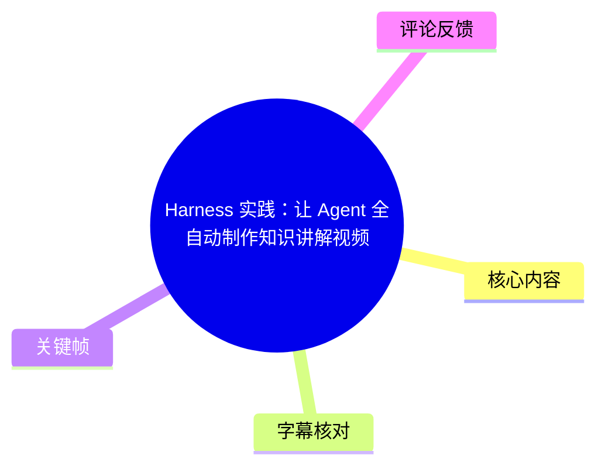
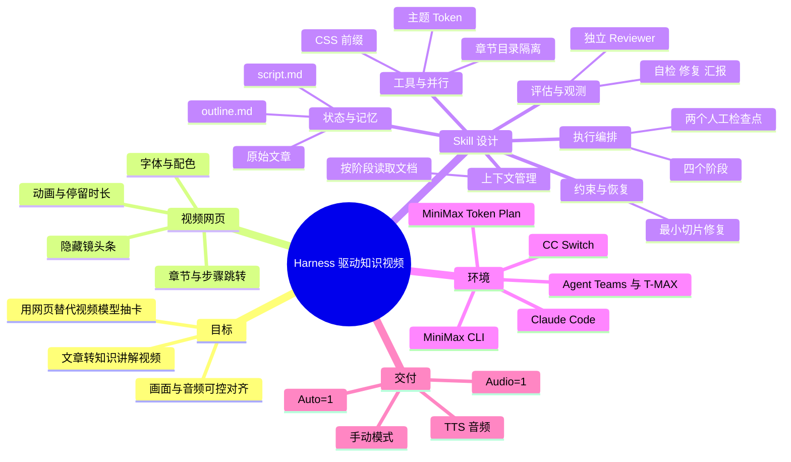
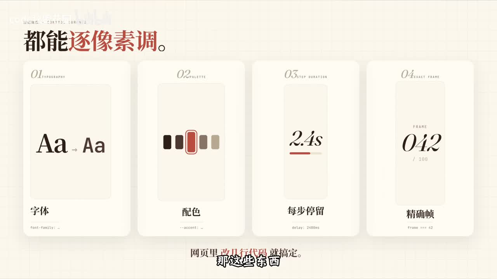
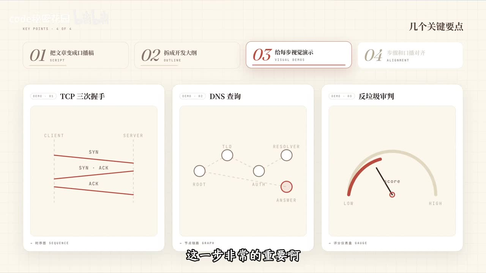
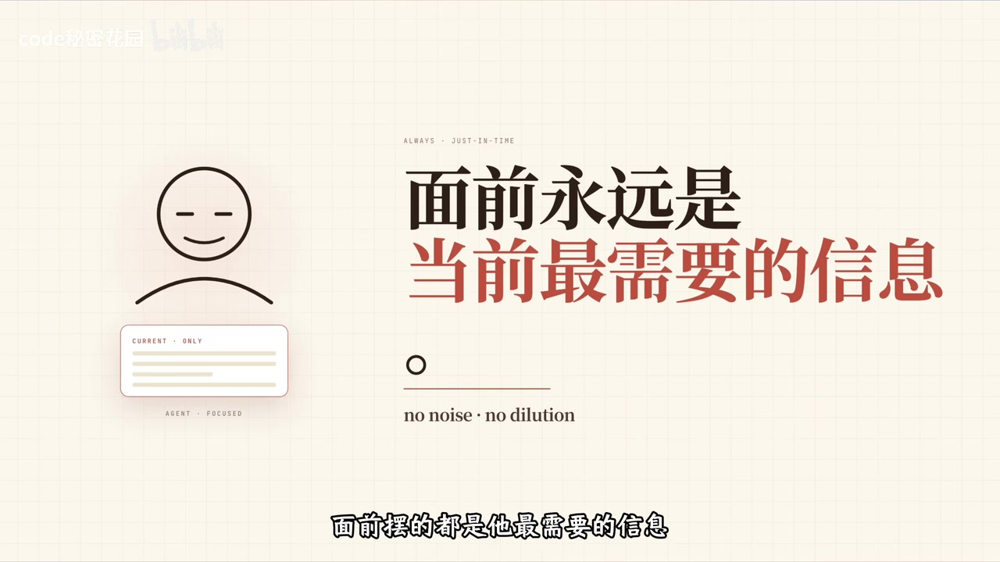

# Harness 实践：让 Agent 全自动制作知识讲解视频

> 来源：[Bilibili 视频](https://www.bilibili.com/video/BV1ypdgBCE9B)<br>
> UP 主：code秘密花园｜合集：AIcode｜视频时长：23:21｜素材抓取时间：2026-07-15  
> 视频描述中提供的资源：[`garden-skills`](https://github.com/ConardLi/garden-skills/)｜[Claude Code](https://code.claude.com/docs/zh-CN/overview)｜[MiniMax CLI](https://github.com/MiniMax-AI/cli)｜[CC Switch v3.14.1](https://github.com/farion1231/cc-switch/releases/tag/v3.14.1)

## 小结

这是一份将“技术文章 → 知识讲解网页 → 配音与录屏视频”流程产品化的 Harness 实践。作者的核心选择不是让视频生成模型直接“抽卡”生成视频，而是让 Agent 编写可交互的网页；字体、配色、动画、单步时长、精确帧等细节都可以由代码控制，因此更稳定、成本更低，也更适合技术概念的动态演示。

视频介绍的 `web-video-presentation` Skill，本质是一份供 Agent 执行的操作手册或协作协议。它把复杂任务拆为四个阶段：内容编写、网页开发、音频合成、录屏与后期；并在内容规划后、第一章开发后等位置引入人工验收，使人保留关键判断权。

作者以 Harness 的六个组成部分解释 Skill：上下文管理、工具系统、执行编排、状态与记忆、评估与观测、约束与恢复。特别关键的是：使用 `script.md`、`outline.md` 与原文作为文件化工作记忆；章节目录和 CSS 前缀物理隔离以支持并行开发；反馈遵循“最小切片修复”，而不是一遇问题便重做整章。

实操链路依赖 Claude Code（或其他支持 Skill 的 Agent）、MiniMax Token Plan、CC Switch、MiniMax CLI；大项目可选配 Agent Teams 与 T-MAX。视频演示中，Skill 先产出口播稿和开发大纲，经评审后要求用户确认主题、素材和开发模式；第一章必须验收，后续才可顺序或并行开发。

应注意，本视频中的具体产品版本、套餐、每日语音额度、Agent Teams 的实验性状态、命令参数和第三方工具兼容性均具有时效性。作者称 MiniMax Token Plan 含每日 9000 字语音合成额度、推荐 MiniMax M2.7，均应以当前官方文档与账户页面为准；视频没有给出全部安装命令、环境变量名或并行数的明确数值，不能据此补写。

适合已经会使用命令行 Agent、希望把“偶尔能跑通”的内容生产流程变为“可检查、可恢复、可复用”工程流程的开发者。它不是零配置的一键视频生成方案：仍需人工审稿、验收视觉质量、处理素材与安全权限，并需要足够强的模型支撑多 Agent 调度。

## 思维导图





## 目录

- [背景：为什么以网页作为视频载体](#背景为什么以网页作为视频载体)
- [视频网页的设计原则](#视频网页的设计原则)
- [Harness：用 Skill 驾驭 Agent](#harness用-skill-驾驭-agent)
- [四阶段编排与人工检查点](#四阶段编排与人工检查点)
- [六项 Harness 设计拆解](#六项-harness-设计拆解)
- [环境与工具配置](#环境与工具配置)
- [实战：从文章到网页项目](#实战从文章到网页项目)
- [音频合成、播放模式与录制](#音频合成播放模式与录制)
- [经验、限制与时效性](#经验限制与时效性)
- [关键帧索引](#关键帧索引)
- [字幕比对](#字幕比对)
- [评论分析](#评论分析)
- [处理记录](#处理记录)

## 背景：为什么以网页作为视频载体

### [问题与方案定位 00:27](https://www.bilibili.com/video/BV1ypdgBCE9B?t=27)

作者回应评论区两个问题：其一，Harness 有什么具体工程实践；其二，视频中的技术讲解效果如何制作。本期目标是展示从一篇文章输入，到输出知识讲解视频的完整过程。

作者明确说明，视频效果：

- **不是**视频生成模型直接生成；
- **不是** NotebookLM；
- 本质上是由自己进行 Web Coding 制作的网页，且本期演示网页由 AI 生成；
- 再通过音频与录屏形成视频成品。

### [可控性优先于“抽卡” 00:32](https://www.bilibili.com/video/BV1ypdgBCE9B?t=32)

作者给出的核心理由是“**可控**”。在网页中，以下内容都可以改几行代码后精确修改：

- 字体；
- 配色；
- 每一步停留多少秒；
- 某一帧是否出现；
- 是否展示一个精确数值。

相对于视频生成模型的随机性，作者认为网页方案更稳定、成本也更低。其对其他方案的经验判断是：

| 方案 | 作者在视频中的判断 |
| --- | --- |
| 视频生成模型 | 有“抽卡”不确定性，不如网页可精确控制。 |
| NotebookLM | 作者曾试用，认为它无法完成动画演示，输出以静态图为主。 |
| Remotion 一类框架 | 作者认为可能反而限制模型发挥，有时不如直接让模型写网页自由。 |
| Agent 直接写网页 | 是本方案采用的核心生产方式，但需要 Harness 约束。 |



> 图：关键帧以“字体、配色、每步停留、精确帧”四项卡片直观呈现网页方案的可控粒度。这是理解作者为何不用纯视频生成模型的关键画面依据。

## 视频网页的设计原则

### [演示产物：13 章、100 多步 01:20](https://www.bilibili.com/video/BV1ypdgBCE9B?t=80)

作者展示了一个为本教程制作的演示：输入是一篇 Anthropic 最近发布的文章，输出是一个网页。按作者描述，网页将原文拆为：

- **13 个章节**；
- **100 多个细粒度讲解步骤**；
- 每步都有完整的视觉演示；
- 底部存在隐藏镜头条，鼠标移至底部才出现；
- 可以跳转到任意章节、任意步骤；
- 画面没有页眉、页码及明显品牌标识，以减少“网页感”，使其更像干净的视频画面。

### [四项内容与视觉设计要点 02:03](https://www.bilibili.com/video/BV1ypdgBCE9B?t=123)

作者归纳了制作效果自然的四项前置工作：

1. **文章改写为口播稿**  
   原技术文章常是书面表达，例如“该工具旨在提供高效的解决方案”，不适合直接念。应改为短句、口语化、第二人称叙述，让语气接近对话。

2. **口播稿拆为开发计划或大纲**  
   每段话都要对应具体画面步骤；若干步骤组成一个章节，每章聚焦一个主题。作者强调，面对复杂的后续开发，预先大纲是保持稳定性的关键。

3. **每一步必须做视觉演示**  
   不是简单把口播文字叠在画面上，而要尽量用动态效果表达抽象概念。

4. **关键演示步与口播节奏同步**  
   画面跟随口播稿的节奏推进，视频才会自然。



> 图：画面以 TCP 三次握手、DNS 查询、反垃圾评判三个案例说明“视觉演示”不是纯字幕，而是把概念转换为相应的动态图形。这与第二、三项设计原则直接对应。

## Harness：用 Skill 驾驭 Agent

### [从模型能力到稳定交付 02:51](https://www.bilibili.com/video/BV1ypdgBCE9B?t=171)

作者认为，上述工作 Agent 都“能做”，真正的问题是如何让它在不同用户、不同文章、不同主题下稳定完成。若只对 Agent 说“帮我做个视频网页”，可能出现：

- 口播稿与画面对不上；
- 章节数与音频数不一致；
- 后续章节的风格与前面突然不协调。

因此，模型有能力并不等于流程稳定。Harness 要承担的是对过程的驾驭，包括定义：

- 画面边界；
- 时间检查点；
- 按字检查；
- 修复机制。

### [Skill 的角色与六部分框架 03:41](https://www.bilibili.com/video/BV1ypdgBCE9B?t=221)

视频中的 Skill 名为 **`web-video-presentation`**，与其他 Skill 一起托管于 `garden-skills` 仓库。作者将 Skill 定义为给 Agent 读的操作手册，规定：

- 什么时候做什么；
- 做到什么标准；
- 哪些红线不能碰。

作者此前归纳的成熟 Harness 有六部分：

1. 上下文管理；
2. 工具系统；
3. 执行编排；
4. 状态与记忆；
5. 评估与观测；
6. 约束与恢复。

> 注：ASR 中将多处 “Skill”“Harness”“Claude Code”等专有名词误识别为 `sql`、`cloud code`、`Harnes` 等；本笔记依据视频语义、标题、描述中的官方链接及关键帧语境统一校正。

## 四阶段编排与人工检查点

### [完整流程：四阶段、两个检查点 04:19](https://www.bilibili.com/video/BV1ypdgBCE9B?t=259)

Skill 将从文章到视频拆成四阶段，中间设置两个重要的人工作业点：

| 阶段 | Agent 产出/动作 | 人工控制点 |
| --- | --- | --- |
| 阶段一：内容编写 | 同时生成口播稿与开发计划。前者决定信息表述和总节奏，后者决定每章步骤数与各步屏幕内容。 | 第一个检查点：确认稿件、大纲、主题、素材准备与后续开发方式。 |
| 阶段二：网页开发 | 先完成第一章；后续可顺序开发或多 Agent 并行。每章按清单自检。 | 第一章完成后必须验收，作为后续章节的视觉与节奏基准。 |
| 阶段三：音频合成 | 从口播稿和网页步骤提取音频/台词清单，调用 TTS 合成。 | 用户确认是否要自动合成；也可跳过并使用自己的声音。 |
| 阶段四：录屏与后期 | 浏览器打开网页、启用音频自动播放后录屏。 | 选择适合的播放与录制方式。 |


> 图：流程图明确展示“内容编写 → Checkpoint Plan → 网页开发 → Checkpoint Audio → 音频合成 → 录屏+后期”。它是理解人工判断嵌入自动化流程位置的核心关键帧。

### [为什么首章必须先验收 04:43](https://www.bilibili.com/video/BV1ypdgBCE9B?t=283)

开发并非直接一次性完成全部章节。首章完成后，必须由人确认视觉气质、节奏是否正确。作者的逻辑是：首章一旦被确认，它便成为后续章节的参考基准；若首章方向错了，越早修正成本越低。

后续章节可以：

- 按顺序逐章开发；
- 开启多个子 Agent 并行开发；
- 但每章都应先按检查清单自检，通过后再交付。

## 六项 Harness 设计拆解

### [1. 执行编排 04:19](https://www.bilibili.com/video/BV1ypdgBCE9B?t=259)

执行编排回答“模型下一步该做什么”。四阶段流程加检查点，将大任务分解为有明确输入、输出、停顿条件的任务单元。其价值不只是排顺序，也在于阻止 Agent 在关键决策未确认前继续扩张工作量。

### [2. 上下文管理：按需加载 05:48](https://www.bilibili.com/video/BV1ypdgBCE9B?t=348)

项目跨越四阶段、文档多且流程复杂。作者指出，如果启动时把所有文档一次性塞给模型，注意力会被稀释。因此把资料拆分为多份，只在指定阶段读取：

- 口播稿规范只在第一阶段读；
- 章节开发指南只在开发阶段读；
- 目标是让模型每一刻只面对最需要的信息，减少无关上下文干扰。



> 图：画面用“面前永远是当前最需要的信息”“no noise · no dilution”概括按需上下文的原则，帮助区分“保存所有资料”和“每轮加载所有资料”这两个不同概念。

### [3. 状态与记忆：文件化工作记忆 06:22](https://www.bilibili.com/video/BV1ypdgBCE9B?t=382)

Skill 中最重要的记忆文件是 `outline.md`。一个项目可能有十几个章节、上百步骤，写到后面时，前面定过的结构和用户在检查点修改的方向可能已不在当前上下文中。开发计划的作用是固化这些关键决定，成为开发阶段持续可读取的记忆。

进入开发阶段后，Agent 被要求同时参考三类文档：

| 文件/资料 | 职责 |
| --- | --- |
| `outline.md` | 固定章节结构、步骤规划及关键决策。 |
| `script.md` | 管控整体口播节奏、讲述顺序，画面必须跟随它。 |
| 原始文章 | 补充口播稿被压缩后可能缺少的数据、案例与信息密度。 |

三者分别处理结构、节奏、信息密度，从而降低“结构对但画面空”或“信息多但节奏乱”的风险。

### [4. 工具系统与并行隔离 07:22](https://www.bilibili.com/video/BV1ypdgBCE9B?t=442)

作者称这个 Skill 没有依赖特别的工具，重点是让 Agent 用好自带文件读写能力。但为了多章节并行开发，设计了三层隔离：

1. **章节独立文件夹**：物理隔离；
2. **章节独立 CSS 前缀**：避免类名冲突；
3. **全局主题 Token**：字体、颜色、间距等使用全局变量，以兜底统一视觉风格。

这意味着不同 Agent 可以各自开发章节，减少相互影响，同时保持全片视觉一致。

### [5. 约束与恢复：最小切片修复 08:10](https://www.bilibili.com/video/BV1ypdgBCE9B?t=490)

视频把“出错”扩展为不仅是代码报错，也包括用户主观反馈，如：

- 某章节节奏太快；
- 动画“AI 味”太重；
- 信息或视觉不符合预期。

Agent 的自然倾向可能是重新生成整章，但这会把已正确的部分也改掉，甚至使结果更差。Skill 的关键原则是**反馈修复的最小切片**：

1. 定位问题位于节奏、视觉、内容还是代码层；
2. 只修改造成问题的最小范围；
3. 不因局部问题重做整个章节。

这是一项可迁移的工程经验：恢复策略应保留已验证正确的产物。

### [6. 评估与观测：自检、修复、再汇报 08:48](https://www.bilibili.com/video/BV1ypdgBCE9B?t=528)

作者认为这是最花心思的部分，因其对应“自评失真”：让写代码的 Agent 自己评估结果，容易给出“还不错”的结论。为此，Skill 要求关键流程结束后，必须依次执行：

```text
自检 → 修复 → 汇报
```

每个阶段都有完整检查规则。作者给出的评审优先级为：

1. **最优**：用 Agent Teams 建立独立 Reviewer Agent，向其提供产物和对应清单，从零逐项检查；
2. **次选**：若不支持 Agent Teams，则使用 Sub-agent；
3. **兜底**：当前 Agent 自检，但仍必须逐项核对，不能只“目测一遍”。

### [Skill 级协议也是 Harness 09:36](https://www.bilibili.com/video/BV1ypdgBCE9B?t=576)

作者将该 Skill 与 OpenAI、Anthropic 的相关工程实践类比：本质都是搭建 Harness，只是前者属于工业级运行系统，这里则是 Skill 级协作协议。

重要结论是：做 Harness 不一定要从零开发一个 Agent 系统；只要用 Skill 将 Agent 在某个垂直工作上的行为约束为稳定流程，也是在做 Harness。

## 环境与工具配置

### [四项工具与适配关系 10:02](https://www.bilibili.com/video/BV1ypdgBCE9B?t=602)

视频方案主要用到四项工具：

| 工具 | 角色 | 视频中给出的验证或用途 |
| --- | --- | --- |
| Claude Code | 核心执行 Agent。 | 安装后在终端输出版本号以验证。作者称 Cursor、Codex 或其他支持 Skill 的 Agent 亦可。 |
| MiniMax Token Plan | 作者选择的模型服务方案。 | 订阅后生成 API Key，供后续配置使用。 |
| CC Switch | 桌面配置工具。 | 将 Claude Code 等 Agent 切换到指定第三方模型。 |
| MiniMax CLI | 音频合成调用工具。 | 安装后执行 `mmx`，可正常输出信息即代表安装成功。 |

### [CC Switch 配置 MiniMax M2.7 10:50](https://www.bilibili.com/video/BV1ypdgBCE9B?t=650)

作者演示的操作顺序如下：

1. 在 GitHub Releases 下载适合操作系统的 CC Switch 安装包；
2. 打开 CC Switch，在 Agents 中选择 Claude；
3. 点击新增，选择内置 MiniMax 提供商；
4. 粘贴在 MiniMax Token Plan 获取的 API Key；
5. 其余项目按演示不改；
6. 主模型设为 **MiniMax M2.7**；
7. 添加并启用；
8. 回到终端启动 Claude Code，检查模型是否显示为 MiniMax M2.7；
9. 用一次正常对话输出确认配置是否可用。

> 时效性提示：MiniMax 模型名、套餐名称、CC Switch 的界面选项、可支持 Agent 范围均可能更新。视频仅记录作者演示时的做法，不能替代当前官方文档。

### [MiniMax CLI 与语音额度 11:48](https://www.bilibili.com/video/BV1ypdgBCE9B?t=708)

作者表示，MiniMax Token Plan 还包含图片、语音、视频等多模态套餐；本教程最相关的是口播稿转音频。视频称该套餐当时有**每日 9000 字语音合成额度**，作者估计制作两篇文章足够。

安装方式的演示特点是：已安装 Claude Code 后，可将安装请求发给 Claude Code，但用户应将示例中的密钥替换为自己的真实 Token Plan 密钥。之后执行：

```bash
mmx
```

若可输出正常信息，即表示 CLI 安装成功。

**安全边界：**

- API Key 属于敏感凭据，不应写入公开视频、截图、仓库或聊天记录；
- 视频未提供完整的安装提示词、具体配置文件结构和权限范围，实际操作应对照 MiniMax CLI 官方仓库；
- “9000 字/日”是作者视频中的当期描述，可能受套餐、地区和政策影响。

### [安装 web-video-presentation Skill 12:35](https://www.bilibili.com/video/BV1ypdgBCE9B?t=755)

视频演示的是最简单的安装方法：

1. 访问 `garden-skills` GitHub 地址；
2. 找到 `web-video-presentation skill`；
3. 下载安装包并解压；
4. 复制得到的 Skill 文件夹；
5. 在项目根目录创建 `.claude/skills` 目录；
6. 将 Skill 粘贴进去；
7. 在该项目目录启动 Claude Code；
8. 输入 `/webvideo`，若能出现 Skill 提示，则配置成功。

```text
项目根目录/
└── .claude/
    └── skills/
        └── web-video-presentation/
```

> 上图目录结构为视频口述整理；视频未展示完整仓库树，因此不对 Skill 内部文件名和层级作额外断言。

### [Sub-agent、Agent Teams 与 T-MAX 13:15](https://www.bilibili.com/video/BV1ypdgBCE9B?t=795)

对于小 Demo，作者认为一个 Claude Code 会话可能足够；对于十几章、上百步骤的项目，单 Agent 从头完成会很慢。Skill 的章节物理隔离使其天然支持并行。

视频区分两类多 Agent 能力：

| 能力 | 工作方式 | 合适任务 | 代价/限制 |
| --- | --- | --- | --- |
| Sub-agent | 主 Agent 分派任务；子 Agent 在独立上下文中完成后返回结果；子 Agent 彼此不可见、不能讨论。 | 并行开发多个章节、一次性检查某段代码等结果导向任务。 | 更省 Token，较易调度，但不适合反复协作。 |
| Agent Teams | 类似项目组：组长与组员各自独立会话，可互发消息、共享任务表。 | 质检、开发—反馈—复查等需要来回协作的任务。 | Token 消耗更高；视频称其当时仍为实验性功能。 |

作者的比喻是：Sub-agent 像让三人去三座城市各办一件事后回来汇报；Agent Teams 像把三人拉进同一会议室边讨论边改方案。

T-MAX 是作者推荐用于可视化多终端会话的开源终端管理器。搭配后，每个 Team 成员位于不同终端面板，可同时观察审核者和开发者的进度。视频称若要让 Claude Code 的 Agent Teams 适配 T-MAX，还需要在全局配置中加入 T-MAX 参数；但未展示具体参数，不能凭空补充。

## 实战：从文章到网页项目

### [启动项目与 YOLO 模式风险 15:48](https://www.bilibili.com/video/BV1ypdgBCE9B?t=948)

演示文章是《一封邮件发出后的 600 毫秒》。操作顺序：

1. 进入项目目录；
2. 输入 `t-max` 进入 T-MAX 模式；
3. 看到下方小绿条，作为进入 T-MAX 的界面标志；
4. 启动 Claude Code；
5. 将原始文章交给 Claude Code，并要求使用 Skill 完成第一步。

视频中启动时增加了 `dangerously...permissions` 参数，作者将其解释为 Claude Code 的 “YOLO 模式”：后续任务可跳过工具调用的人工确认。

> **安全警告：** 作者明确提醒该设置仅为演示方便，日常使用需谨慎。任何跳过人工确认、扩大文件/命令执行权限的模式，都可能导致误删文件、误执行命令、泄露凭据或修改非预期资源。视频 ASR 对参数拼写识别不可靠，且未提供完整命令；本笔记不补写具体参数。

### [第一阶段：脚本、大纲与双评审 16:36](https://www.bilibili.com/video/BV1ypdgBCE9B?t=996)

Agent 使用原文编写口播稿和开发计划后，会创建两个审核 Agent 分别质检；在 T-MAX 下，审核会自动分屏展示。

质检通过后，主 Agent 根据评审结论修改、再次校对并输出最终版本。本地新增的主要文件为：

| 文件 | 内容与职责 |
| --- | --- |
| `script.md` | 将原文章改写为适合视频表达的口播脚本：句子较短、节奏更快、更像对话。 |
| `outline.md` | 将脚本和原文章拆为细粒度章节、步骤，并标记每步屏幕应呈现的信息；控制开发节奏、章节边界、信息密度和每部分要讲清的内容。 |

### [第一个人工检查点：确认四类决策 17:13](https://www.bilibili.com/video/BV1ypdgBCE9B?t=1033)

阶段一结束后，Skill 会询问用户如下问题：

1. **脚本和开发计划是否需要改**  
   若脚本“AI 味”过重，可改为自己的讲话风格；若改了脚本，可让 AI 同时调整大纲。

2. **使用何种主题**  
   Skill 内置不同风格主题，会基于内容推荐；用户也可提出自定义风格。

3. **素材如何准备**  
   对网页需要的图片等素材，用户可选择自行提供或让 AI 绘制。视频案例中，素材可由 AI 生成。

4. **选择后续开发模式**  
   视频列出三种方式：
   - 默认：每章完成后都停下供人工验收；
   - 首章验收后，剩余章节按顺序完成；
   - 首章验收后，剩余章节由多个 Agent 并行开发。

### [第二阶段：首章验收再扩展 18:50](https://www.bilibili.com/video/BV1ypdgBCE9B?t=1130)

Skill 不会立即并行完成全片，而是先完成第一章。用户此时应通过浏览器打开给出的地址，从头点到尾，重点检查：

- 整体画面是否舒服；
- 节奏是否顺畅；
- 信息是否过密；
- 是否存在明显“AI 味”；
- 页面密度、字号、动效节奏与信息呈现是否合理。

若首章不理想，应把问题反馈给 Agent 调整；确认后才允许开发后续章节。

### [并行开发与最终网页检查 19:37](https://www.bilibili.com/video/BV1ypdgBCE9B?t=1177)

首章通过后，可使用 Agent Teams 并行开发剩余章节。视频画面中有三个 Agent，各自负责不同章节；每个 Agent 获取：

- 自己负责的章节大纲；
- Skill 规范；
- 首章代码作为参考。

不同 Agent 彼此不干扰，每章完成后都进入质检。作者强调应选择能力足够强的模型，否则多 Agent 调度容易出错。

全部章节完成后，仍需检查页面是否存在：

- 空白页；
- 动画卡顿；
- 步骤错位；
- 内容错位；
- 局部效果不满意。

作者指出，在 50 多个步骤的项目中，某一步出问题是正常的；需要针对问题继续修改，而非期待首次生成绝对无误。

## 音频合成、播放模式与录制

### [批量 TTS、限流与断点恢复 20:36](https://www.bilibili.com/video/BV1ypdgBCE9B?t=1236)

网页完成且整体满意后，进入音频合成阶段。Agent 用先前配置的 MiniMax CLI，将口播脚本批量合成为音频文件。

工作流包括：

1. 从全部章节抽取详细口播文本清单；
2. 用户先快速检查是否有错字或漏句；
3. 逐条合成音频；
4. 若遇到速率限制等报错，记录失败文件；
5. 重试时跳过已生成文件，因此中断后不必从头重做；
6. 合成结果按章节组织，每一步有对应音频文件，文件名与步骤编号一一对应。

这里体现了视频前面提出的恢复原则：将可完成的工作持久化，重试时识别已完成项，减少重复调用与成本。

### [三种网页播放/录制模式 21:00](https://www.bilibili.com/video/BV1ypdgBCE9B?t=1260)

作者说明网页支持三种模式：

| 模式 | 触发方式 | 行为与适用情形 |
| --- | --- | --- |
| 手动模式 | 默认 | 不播放音频；可以自由切换任意步骤，并自行录制真人声音。 |
| 音频播放模式 | URL 添加 `Audio=1` | 用户仍手动推进步骤，但每一步会自动播放对应音频，可由用户控制推进节奏。 |
| 自动模式 | URL 添加 `Auto=1` | 按空格后，页面按音频节奏自动播放，适合直接录屏。 |

最终，用户可按自身需求选择播放和录制方式。自动模式使音频与画面天然对齐，但并不意味着无需验收：文本、音频质量、视觉节奏与浏览器录屏效果都仍需检查。

## 经验、限制与时效性

### [核心经验：把能力组织成工程系统 22:26](https://www.bilibili.com/video/BV1ypdgBCE9B?t=1346)

作者的最终结论是：表面上讲的是文章变视频，实质是一次 Harness 实践。模型能写代码，服务能提供推理、图像/视频/语音等能力；真正要解决的是让 Agent **稳定完成复杂任务**。

Skill 的价值在于，将任务转化为具备以下特征的工程系统：

- 有流程；
- 有状态；
- 有检查点；
- 有自检；
- 有恢复机制。

可迁移到其他真实工作流的原则包括：

1. 不把“模型能做”误认为“系统能稳定交付”；
2. 把跨回合关键决定写入可读取的外部文件；
3. 让上下文按阶段加载，而非全量堆叠；
4. 在扩展生产前先确定一个高质量样板；
5. 并行之前先设计边界、隔离和统一 Token；
6. 评审最好由独立角色执行；
7. 修复以最小切片为单位，保护已验证的部分；
8. 把人工判断置于主题、首章质量、最终交付等高杠杆节点。

### [限制、风险与待验证事项 22:51](https://www.bilibili.com/video/BV1ypdgBCE9B?t=1371)

**视频明确或可直接推得的限制：**

- 该方案仍依赖人工确认，尤其是脚本风格、主题、首章视觉基准与最终质量；
- 多 Agent 并行不一定更简单，模型能力不足时可能更易调度出错；
- Agent Teams 会增加 Token 消耗，且视频称其为实验性能力；
- 大量步骤的项目出现局部问题是正常现象，必须预留检查和修复；
- 视频中使用跳过权限确认的模式仅为演示便利，存在安全风险；
- 语音合成可能遇到速率限制，需依赖失败记录、跳过已完成项等恢复机制；
- 用户评价中的 Token 消耗、排版保守等问题表明，Skill 的默认实现仍有优化空间，不能把宣传效果视作所有输入下的保证。

**时效性说明：**

- 视频描述中的 GitHub 仓库、Claude Code、MiniMax CLI、CC Switch 均可能更新、迁移或改变兼容性；
- MiniMax M2.7、Token Plan 套餐、每日 9000 字额度均为作者演示时陈述，非永久承诺；
- B 站元数据中的发布时间戳与素材抓取时间存在未来时间语境，本文不据此推导具体政策或当前可用性；
- 文中保留的是视频当时的流程知识，执行前应复核当前工具文档、费用、权限与模型可用范围。

## 关键帧索引

| 关键帧 | 正文位置 | 画面价值 |
| --- | --- | --- |
|  | [可控性优先于“抽卡”](#可控性优先于抽卡) | 直接呈现字体、配色、停留时长、精确帧四项可代码化控制的参数。 |
|  | [四项内容与视觉设计要点](#四项内容与视觉设计要点) | 用 TCP、DNS、反垃圾判别案例证明“视觉演示”不是简单贴文字。 |
|  | [完整流程：四阶段、两个检查点](#完整流程四阶段两个检查点) | 展示端到端阶段和两处人工检查点，是工作流的总览证据。 |
|  | [上下文管理：按需加载](#2-上下文管理按需加载) | 以“当前最需要的信息”解释上下文隔离和按阶段读取的设计目的。 |

## 字幕比对

| 字幕来源 | 完整性 | 专有名词 | 时间轴 | 主要问题 |
| --- | --- | --- | --- | --- |
| Bilibili 站内字幕 `p01-ai-zh.srt` | 极低：仅覆盖前约 2 分 40 秒中的零散片段 | 无有效技术名词，内容基本全为“♪ 音乐 ♪” | 有真实起止时间，但不承载正文语义 | 不能用于本视频知识提取或章节定位。 |
| 本次 ASR（medium / zh） | 高：68 段、语音覆盖约 1327 秒，占视频 94.72%，首段 00:27.860，末段 23:20.880 | 存在明显误识别，如 Skill→`sql`、Claude→`cloud`、Harness→`Harnes` 等 | 有可直接使用的真实分段起止时间 | 长段落缺少断句；中英文产品名、命令、参数和部分数字误识别。 |

### 字幕采用策略

- 已检查站内字幕与本次 ASR。
- `asr-result.json` 未标记 `noAudioStream=true`；相反，诊断显示识别语言为中文、置信度 `0.9990234375`，且语音覆盖率为 `0.9472`，因此源视频存在可识别音轨。
- 正文时间轴以**本次 ASR 的真实 SRT 起止时间**为主，所有章节链接均使用段落起点换算的秒数。
- 站内字幕仅能证明早期存在音乐标记，无法补充语义内容。
- 对 ASR 的关键校正依据包括：视频标题、视频简介的资源链接、上下文语义与给定关键帧。已校正或规范化的主要词汇包括：
  - `sql / scale / SKU` → **Skill**；
  - `cloud code` → **Claude Code**；
  - `Harnes / harnish` → **Harness**；
  - `minimx / minimux` → **MiniMax**；
  - `t-max / team max` → **T-MAX**；
  - `reviver agent` → **Reviewer Agent**；
  - `Audio=1`、`Auto=1` 保留为视频中明确说出的 URL 参数形式。
- 对未可靠辨认的“YOLO 模式”完整权限参数、环境变量具体名称、安装命令文本，本文不作补写。

## 评论分析

以下仅分析可获取的热评前三条；评论是用户体验或观点，不等于已验证事实。

1. **TinyMaD（624 赞）**  
   评论认为作者在公开分享“压箱底”的实用内容，称视频是“刚需”。这反映出受众对可复用、工程化 AI 工作流的需求强烈，但没有提供可复核的技术细节。

2. **此人严重失眠（106 赞）**  
   评论者下载 Skill 后尝试小型自动化工作流，认可 HTML 在图表演示、PPT 动画表达上的视觉优势；同时报告三类实际问题：
   - Token 消耗很大，第一阶段前已有大量 Bash 和 Read 操作；
   - 页面排版偏保守，字体小、视觉层次不足；
   - 其让 Claude 分析后，得到 CSS 重复全量写入、多轮修复循环、长 `Routing.css` 被重复分段读取等可能原因。  
   
   这与视频中的“首章验收”“最小切片修复”“按需上下文”思路形成有价值的现实补充：Harness 并不自动消除成本问题，默认目录、样式复用和评审迭代仍需要工程优化。但这是单一用户的项目体验，未提供完整项目、计费记录或可复现实验，不能直接外推为通用性能结论。

3. **Ai好记总结助手（90 赞）**  
   评论将视频压缩概括为“网页 + AI 生成视频，用 Skill 管住 Agent”，并强调字体、动画、节奏可控，较“抽卡”稳定；“代码即导演”是对作者方案的形象总结。该评论准确抓住视频主旨，但未讨论人工验收、并行调度成本、权限风险及工具时效性等限制。

## 处理记录

- Worker ID：`worker-mrj0wbly-5dc4e50c`
- 模型：`gpt-5.6-terra`
- 素材工具与结果：
  - 视频元数据：已使用任务提供的 Bilibili 元数据；
  - 音频 ASR：已检查 `asr/asr-result.json`、`asr/transcript.srt` 与覆盖诊断；模型为 `medium`，语言为 `zh`，CUDA `float16`；
  - 站内字幕：已检查 `subtitles/p01-ai-zh.srt`；
  - 关键帧：已依据给定 `frames/` 关键帧画面及其与 ASR 相邻语义的匹配关系选用 4 张；
  - 评论：仅处理 `comments/comments.json` 中可获取热评前三条。
- 字幕选择：以本次 ASR 时间轴为主；站内字幕仅为音乐标记，无法承担正文转录。对 ASR 专有名词使用标题、描述链接、上下文与画面进行有限校正；无法确认的命令和参数不补写。
- 关键帧选择依据：
  - `frame-001.jpg` 对应网页参数可控性；
  - `frame-002.jpg` 对应动态视觉演示；
  - `frame-003.jpg` 对应四阶段与人工检查点；
  - `frame-004.jpg` 对应按需上下文管理。
- 缓存清理：本任务提供的素材清单未包含可执行的缓存清理日志；未声称已执行未提供证据的清理操作。
- 未解决问题：
  - 未提供 Skill 仓库在抓取时的具体文件内容，无法核验完整目录、提示词、检查清单与命令；
  - ASR 对英文命令、模型名、权限参数有误识别，完整字符串未在可靠素材中出现；
  - 视频中关于套餐、额度、模型和实验性功能的陈述均需以当前官方资料复核。
