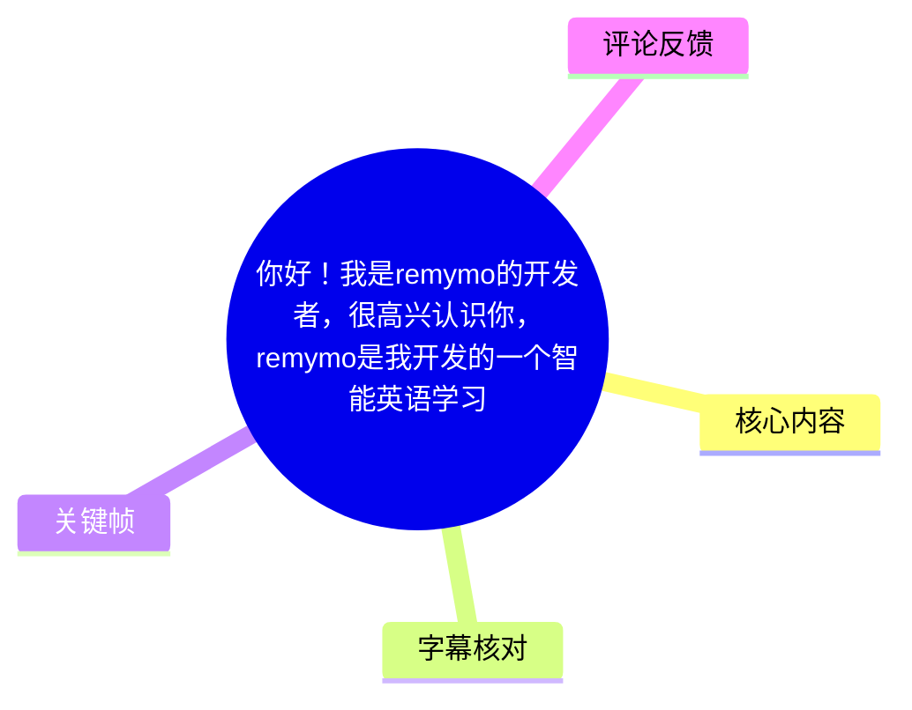
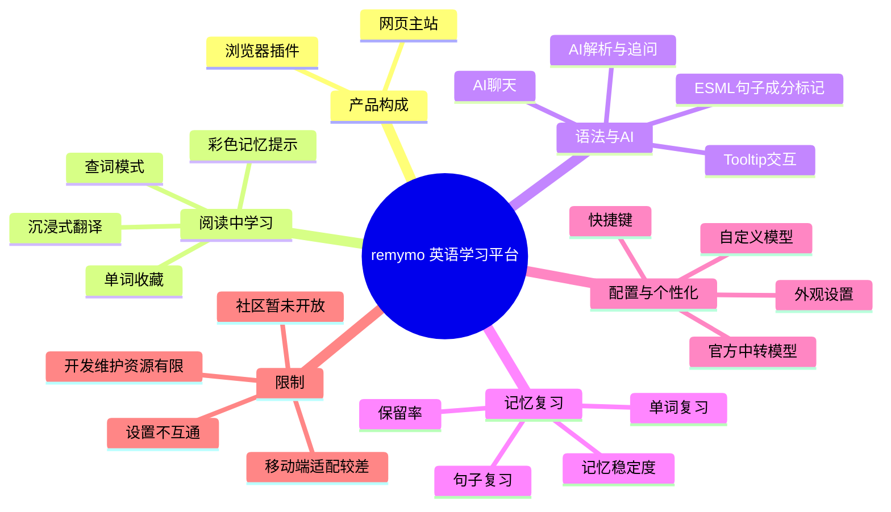
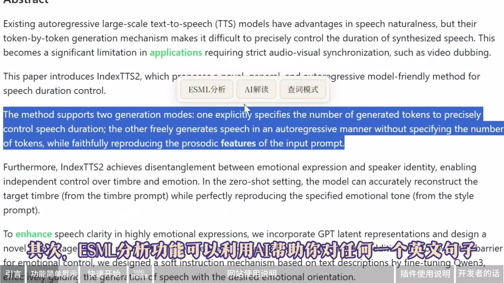

# remymo 智能英语学习平台与浏览器插件使用说明

> 来源：[Bilibili 视频](https://www.bilibili.com/video/BV1KbLm6XEX1) 
> UP 主：remymo｜时长：08:07｜分辨率：3840 × 2160 
> 视频简介提供：网站 `remymo.com`、Edge 扩展商店链接、压缩包下载渠道，以及 QQ、Bilibili、小红书反馈方式。

## 小结

remymo 是开发者制作的智能英语学习平台，由**网页主站**和**配套浏览器插件**组成。其核心思路不是单独背词，而是在阅读英文网页时完成查词、收藏、句子分析与复习：插件负责把学习操作嵌入浏览过程，网页端负责汇总、记忆管理和 AI 对话。

视频优先展示四项实用能力：在英文网页中进入查词模式并收藏单词；使用 ESML 对英语句子做成分标记；调用大模型 API 进行中英对照的沉浸式翻译；以及对整页或选中句子进行 AI 解析和追问。被收藏的单词会跨网页显示颜色，并依据记忆曲线变化，低于阈值后进入复习流程。

学习闭环由“收藏—记忆板块—复习”构成。单词复习中，系统以记忆保留率和柱状图呈现状态；完成复习后，保留率重置为 100%，记忆稳定度更新。句子复习则综合句中已收藏单词数量和保留度，按复习价值排序，适合处理生词密集的句子。

首次使用 AI 功能需要配置模型。开发者明确建议优先使用自定义模型：填写一个与视频所称接口兼容的 `BaseURL`、`API Key` 和模型 ID。官方中转模型按量收费，且开发者称其可能高于原价；自定义模型的敏感配置保存在浏览器本地，但更换设备或浏览器后必须重新配置。

视频也说明了当前限制：移动端适配较差；社区功能处于实验状态、暂未开放；网站端与插件端的部分设置不互通；半透明毛玻璃样式可能影响阅读；开发者为高中生，维护时间和能力受限，无法承诺逐一及时修复反馈。该项目及模型、插件商店、网站可用性均可能随时间变化，使用前应以实际页面为准。

## 思维导图

## 目录

- [产品定位与功能预览](#产品定位与功能预览-0030)
- [快速开始：网站、账号与插件安装](#快速开始网站账号与插件安装-0121)
- [ESML 标记语言与 AI 学习交互](#esml-标记语言与-ai-学习交互-0209)
- [记忆板块：单词与句子复习机制](#记忆板块单词与句子复习机制-0322)
- [模型配置、数据位置与界面个性化](#模型配置数据位置与界面个性化-0458)
- [插件功能与网页端的互通边界](#插件功能与网页端的互通边界-0611)
- [限制、反馈与时效性](#限制反馈与时效性-0723)
- [字幕比对](#字幕比对-0030)
- [评论分析](#评论分析-0000)
- [处理记录](#处理记录-0000)

## 产品定位与功能预览 [00:30](https://www.bilibili.com/video/BV1KbLm6XEX1?t=30)

视频在约 00:30 开始有语音内容。开发者将 remymo 定位为一个把英语学习和单词记忆插入日常英文阅读过程的平台，并说明产品包含主站与配套插件。

主要功能演示如下：

1. **查词模式**
   - 在含英文内容的网站中进入查词模式。
   - 选中单词后可查询释义，并可将其收藏。
   - 收藏后的单词会在网页中显示为彩色；之后在其他网页再次遇到时，也可点击直接查询。
   - 视频称颜色会随时间、依据记忆曲线改变；低于某个数值时会触发复习需求。

2. **ESML 分析**
   - 利用 AI 对英文句子进行句子成分分析。
   - 目标是使语法结构更直观，并允许用户围绕结果继续交互。

3. **沉浸式翻译**
   - 可一键调用大模型 API。
   - 将整个网页以中英对照形式翻译。

4. **功能定位**
   - 开发者认为插件的实用价值更大。
   - 网页端主要承担从插件收集单词、集中复习和扩展学习交互的作用。

> 图：画面展示 remymo 标识、平台定位文案及视频章节导航。“在日常阅读中插入英语学习和单词记忆”概括了产品的设计目标，也说明后续插件与主站为何需要配合使用。

> 图：画面在英文论文页面上展示“ESML分析、AI解读、查词模式”等浮动操作入口，并对英文段落做选中处理。它直接说明该工具的使用场景是浏览真实英文网页，而不是仅在独立背词页面学习。

## 快速开始：网站、账号与插件安装 [01:21](https://www.bilibili.com/video/BV1KbLm6XEX1?t=81)

### 网站端使用

1. 访问开发者在视频中给出的站点：`remymo.com`。
2. 使用**邮箱验证码**注册。
3. 注册后直接登录。
4. 开发者不建议在手机端访问：视频明确表示当前移动端适配“暂时很差”。

### 插件获取方式

视频说明插件可通过两类渠道取得：

- **Edge 扩展商店**：视频简介给出扩展商店链接。
- **压缩包安装**：视频简介还提供 123 云盘与夸克网盘链接。

通过压缩包安装时，视频给出的顺序为：

1. 下载并解压插件压缩包。
2. 在浏览器中进入“管理扩展”。
3. 打开“开发者模式”。
4. 点击“加载已解压的扩展”。
5. 选择解压后的插件文件夹。

视频称插件**理论上兼容所有 Chromium 内核浏览器**。这是开发者的兼容性表述，不等同于对每个浏览器版本、系统版本和扩展策略的实际兼容承诺；安装失败时应检查浏览器内核、开发者模式权限及扩展包完整性。

> 图：画面明确写出 `remymo.com` 与“chrome插件”，且字幕说明网页端更偏向汇总和复习插件收藏内容。这有助于区分主站与插件的职责，而非将两者视为互相替代的产品。

## ESML 标记语言与 AI 学习交互 [02:09](https://www.bilibili.com/video/BV1KbLm6XEX1?t=129)

### ESML 的用途与标记结构

视频称 ESML 是为改善初学者英语语法分析效率而设计的标记语言。其思路是把句子成分、从句、语法注释与翻译直接嵌入英文文本，再渲染为可交互内容。

根据视频语音与画面可确认的规则包括：

- 用带中文标签的**花括号**标记句子成分；
- 视频称覆盖七种句子元素；
- 用**方括号**标记重句/从句相关结构；
- 用**圆括号**提供语法注释；
- 用**中文方括号**提供翻译；
- 页面会将这些内容渲染为可点击、可查询的文本。

视频画面示例显示了类似 `§ {主: Artificial intelligence} {谓: has transformed} {宾: the way that we work}` 的结构。该示例能证明“主、谓、宾”等标签式标注的呈现方式；但视频提供的 ASR 对“七种元素”的完整名称识别不清，因此不在本文补写未清晰出现的全部类别。

> 图：画面以 “Artificial intelligence has transformed the way that we work” 展示主语、谓语、宾语等彩色标记。它是理解 ESML “把语法结构可视化”的关键帧，也能避免仅凭文字误解其展示形式。

### 网页端 AI 聊天与 Tooltip

网页端除记忆板块外还有 AI 聊天功能；社区功能在视频录制时仍处于实验状态，尚未开放。

视频称可通过 **EdChat AI** 呼出预设提示词的 AI。其回答会采用 ESML 语法标记并渲染，目的是让用户在聊天中继续学习英语。用户可点击回答中的任一单词，通过 Tooltip 形式查看释义或相关信息，并进行：

- 收藏；
- 发音；
- 对句子发音；
- 收藏句子。

开发者强烈建议在仪表盘的个性化设置中开启下列自动化选项：

- 查词后自动收藏；
- 自动发音；
- 收藏单词后自动收藏该词所在句子。

这些是开发者的使用建议，适合希望建立自动沉淀复习材料的用户；若只想临时查询、避免记忆库快速膨胀，则应按个人需求决定是否开启。

## 记忆板块：单词与句子复习机制 [03:22](https://www.bilibili.com/video/BV1KbLm6XEX1?t=202)

收藏的单词和句子是记忆板块的输入。视频称用户可按**单词、句子和绘画**分别复习；其中“绘画”在 ASR 中出现，但素材未提供足以解释该模式操作的清晰画面或细节，因此不能进一步推断其具体机制。

### 单词复习

单词复习流程可整理为：

1. 选择单词复习。
2. 系统根据记忆曲线算法计算单词的**记忆保留率**。
3. 以柱状图显示不同单词的保留状态。
4. 点击单词后，系统先提供例句。
5. 用户可在例句中点击单词，通过 Tooltip 复习；也可进入单词详情获取更具体的信息。
6. 完成一次复习后：
   - 该词保留率重置为 **100%**；
   - 记忆稳定度更新；
   - 系统进入下一轮遗忘与复习计算。

视频强调例句来自用户已收藏的句子。因此，收藏单词时同步收藏所在句子能带来两个收益：

- 为单词保留真实阅读语境；
- 在一个句子内复习多个已收藏单词，提高复习密度。

### 句子复习

当一句英文中包含较多待学单词时，逐词点击的效率可能较低。此时可选择句子复习：

1. 系统评估句中已收藏单词的数量；
2. 同时结合这些词的保留度；
3. 从高到低给出复习价值；
4. 用户点击句子后，在句内以 Tooltip 继续针对单词复习。

视频还提到插件与网页端均有 Tooltip 类功能，具体实现可能不同，但功能相近。

### 词汇辅助功能

视频说明以下能力主要由大模型支持：

- **同根词功能**：向大模型询问并获得同根词信息；点击同根词还可再次呼出 Tooltip。
- **单词精析**：帮助理解单词在当前语境中的特殊含义，用于处理“熟词生义”等情况；支持继续追问。
- **还原功能**：将过去式、过去分词、第三人称单数等变形还原，再查询原词，以减少因词形变化造成的理解偏差。

这里的“准确同根词”“解决误解”等为视频中的功能目标或开发者表述。大模型输出仍可能出错，尤其涉及词源、词形规则与具体语境时，建议以权威词典或语料作为补充验证。

## 模型配置、数据位置与界面个性化 [04:58](https://www.bilibili.com/video/BV1KbLm6XEX1?t=298)

### 首次配置模型

首次使用时，需要在仪表盘中配置模型。视频提供两条路径：

| 路径 | 配置方式 | 成本与特点 | 视频提示 |
| --- | --- | --- | --- |
| 官方中转模型 | 通过开发者服务器中转，选择多个平台的大模型 | 按量付费 | 开发者称可能数倍贵于原价，不建议熟悉配置的用户优先选择 |
| 自定义模型 | 填写 `BaseURL`、`API Key`、模型 ID | 更可控，视频称无需向开发者付费 | 需自行拥有可用服务与接口配置能力 |

视频 ASR 将兼容接口识别为“OpenRID”，该专有名词未能从给定关键帧中复核，且存在明显识别风险。本文保留 ASR 原始信息的“不确定性”，不将其擅自改写为其他接口标准。实际填写字段与支持范围应以 remymo 当前设置页面为准。

开发者推荐使用 ASR 识别为 “Lipsic WaveFlash” 的模型，并称其在多个功能测试中“极快又好”。该模型名称同样未获得画面文字复核，可能存在 ASR 音译或拼写误差，因此不应据此直接搜索或认定具体模型；应以产品界面内列出的正式名称为准。

### 数据保存与迁移限制

视频明确说明：

- 自定义模型的敏感数据保存在**浏览器本地**；
- 不会上传到服务器；
- 若更换设备或浏览器，必须重新配置；
- 未重新配置将无法使用相关模型能力。

这是一项重要的隐私与可用性取舍：本地保存降低了上传给平台服务器的风险，但也意味着用户要自行管理 API Key、迁移记录与新环境配置。公开视频没有说明密钥是否加密存储、是否支持导入导出或同步，因此这些问题仍属未验证项。

### 外观自定义

开发者称项目由“Web Coding”方式产出，因而尽量开放更多外观调整空间。网站端多数元素的颜色可自定义，用户还可以：

- 修改壁纸；
- 更改全局透明度；
- 更改字体和颜色。

## 插件功能与网页端的互通边界 [06:11](https://www.bilibili.com/video/BV1KbLm6XEX1?t=371)

插件使用前需要先登录 remymo 网页端。视频列出的插件主要功能为：

- 沉浸式翻译；
- ESML 分析；
- 查词模式；
- AI 解析。

这些功能可通过自定义快捷键快速触发。AI 解析既可以分析整个网页，也可以只分析用户选中的句子，并允许用户继续追问。

### 已说明的互通关系

插件中收藏的所有单词，可以回到网站的记忆板块复习。也就是说，插件负责采集阅读过程中的学习对象，网页端负责将其纳入复习体系。

### 设置边界与风险

插件也有独立设置板块，可变更模型、添加自定义模型，以及配置自动收藏单词、自动收藏句子等选项。视频强烈推荐自定义模型。

插件外观可通过修改样式实现半透明毛玻璃效果，但开发者提醒：这**可能导致文字看不清**。因此外观调整应以可读性为优先，不宜为了视觉效果过度提高透明度。

此外，视频明确指出：**插件端与网页端的全部设置不互通**。用户如果在两端都使用 AI 或自动收藏功能，应分别核对模型配置、自动化选项和外观设置，不能假定一端修改后会同步到另一端。

## 限制、反馈与时效性 [07:23](https://www.bilibili.com/video/BV1KbLm6XEX1?t=443)

视频结尾说明 remymo 是开发者的第一个公开项目，起初仅为满足其个人学习需求而制作，公开发布是一种尝试。开发者自述为高中生，受学业、能力和时间限制，若没有 AI 编码能力的发展，可能无法完成这一项目。

因此，使用者应特别注意以下限制：

- **移动端适配较差**，开发者不建议手机端访问；
- **社区功能仍在实验中，暂未开放**；
- 官方中转模型按量收费，成本可能较高；
- 自定义模型需自行配置，且换浏览器或设备后要重新填写；
- 网站端与插件端设置不完全互通；
- 自定义视觉样式可能降低文本可读性；
- 开发者欢迎反馈 Bug，但无法保证逐条及时回应、修复或改正。

视频简介给出的反馈渠道包括 QQ：`3193208908`、Bilibili：`3706981256792914`、小红书：`27780251759`。反馈时宜提供浏览器版本、页面链接、复现步骤、报错截图与模型配置类型；但不应公开 API Key 等敏感信息。

本视频反映的是抓取时可获取的产品说明。网站、扩展下载链接、支持的模型、价格、接口要求、隐私处理和功能开放状态均具备时效性，需以实际服务页面、扩展商店说明与开发者最新公告为准。

## 字幕比对 [00:30](https://www.bilibili.com/video/BV1KbLm6XEX1?t=30)

| 字幕来源 | 完整性 | 专有名词 | 时间轴 | 主要问题 |
| --- | --- | --- | --- | --- |
| Bilibili 站内字幕 `p01-ai-zh.srt` | 与本视频不匹配 | 内容为诺贝尔物理学奖、引力波等，与 remymo 无关 | 00:00–04:22，未覆盖完整视频 | 属于明显错配字幕，不能用于正文事实或时间定位 |
| 本次 ASR 字幕 | 覆盖约 452.36 秒语音，覆盖率 93.01% | 多处产品名、功能名、模型名及接口名识别不稳 | 有真实分段时间；首段 00:30.220，末段 08:02.820 | 语句长且断句差，存在“RedMemo/rememo/RIMEMO”“OpenRID”“Lipsic WaveFlash”等疑似误识别 |

### 采用策略

- 本次 ASR 诊断显示语言为中文，置信度 `0.990234375`，存在正常音轨；**未标记 `noAudioStream=true`**。
- 站内字幕内容从开头即讲述诺贝尔奖，与视频标题、开发者、关键帧中的 remymo 标识及实际 ASR 内容完全冲突，判定为错配素材。
- 正文以**本次 ASR 的带时间戳分段**作为时间轴依据，并利用关键帧校正产品名为 **remymo**、确认 ESML 的可视化标记形态，以及确认网站/插件的产品结构。
- 对无法被关键帧或上下文可靠校正的专有名词，保留不确定性，不扩写为未出现的信息。例如 ASR 中的“OpenRID”“Lipsic WaveFlash”不作为已验证的正式名称。
- 视频前约 30 秒没有 ASR 语音分段；本文不对这一段补写旁白内容，仅依据关键帧将其视为引言与章节导航画面。

## 评论分析 [00:00](https://www.bilibili.com/video/BV1KbLm6XEX1?t=0)

当前可获取热评仅有 2 条，未提供第 3 条，因此只分析可获取内容；评论是用户反馈，不构成已验证事实。

1. **用户“ibbenshinde米露的”｜4 赞**
   - 观点：认为工具“很好用”。
   - 补充问题：在链接较多的页面中，部分翻译会不显示；评论称示例页面为保罗·格雷厄姆的个人博客。
   - 解读：这是一个关于沉浸式翻译在多链接网页中可能存在显示遗漏的具体 Bug 报告，与视频中的整页翻译功能直接相关。
   - 可信度边界：评论未提供完整复现环境、浏览器版本、插件版本、模型配置或完整截图，因此只能视为待开发者复现的问题线索。

2. **用户“弗与弗非”｜4 赞**
   - 观点：询问 ESML 的理论或模式如何总结，称未找到相关研究。
   - 解读：该评论指出视频更侧重功能演示与用法，未充分交代 ESML 的语言学、教学法或研究依据。对于希望评估标注体系严谨性的人，这是值得追问的问题。
   - 可信度边界：评论并未证明 ESML 缺乏理论基础，只是表达其未找到相关研究。视频素材也没有提供论文、标准或系统化理论来源，故本文不能据此判断 ESML 的学术有效性。

## 处理记录 [00:00](https://www.bilibili.com/video/BV1KbLm6XEX1?t=0)

- Worker ID：`worker-mrj0wjed-b0c290ad`
- 模型：`gpt-5.6-terra`
- 使用素材与工具结果：
  - 视频元数据与简介；
  - 关键帧：`frames/frame-001.jpg` 至 `frames/frame-012.jpg`；
  - 站内字幕：`p01-ai-zh.srt`；
  - 本次 ASR：`medium` 模型、CUDA、`float16`，带时间戳；
  - 热评数据：请求上限为 3，实际返回 2 条。
- 字幕选择：未采用站内字幕正文内容，原因是其为诺贝尔奖主题，与视频画面、标题和 ASR 的 remymo 教程内容明显错配；采用本次 ASR 的真实时间段作为章节时间轴，并用关键帧校正可确认信息。
- 关键帧选择依据：
  - `frame-001.jpg`：展示 remymo 品牌、产品定位与章节结构；
  - `frame-002.jpg`：展示英文网页内的 ESML/AI 解读/查词模式入口；
  - `frame-003.jpg`：展示 `remymo.com`、Chrome 插件与“快速开始”信息；
  - `frame-004.jpg`：展示 ESML 对主谓宾等成分的彩色标注形式。
- 缓存清理：提供的素材清单未包含缓存清理执行日志；本文不虚构已执行的清理结果。
- 未解决问题：
  - ASR 对若干专有名词识别不稳定，尤其是模型名与接口名；
  - 未提供可逐帧核验的完整画面描述，无法验证未选用关键帧中的全部界面细节；
  - 视频未说明 ESML 的完整七类元素清单、算法细节、记忆曲线具体公式、隐私加密方式与模型接口正式规范。

## 评论分析

- 热评 1：很好用，但有个小bug望up改进一下~ 但在链接多的时候有翻译会不显示 下面是保罗`格雷厄姆的个人博客[脱单doge] 右图是没翻译前，
- 热评 2：ESML这个理论/模式是怎么总结出来的呢？好像没有找到相关研究。

以上内容是观众反馈摘录，只用于补充理解视频反响，不作为正文事实依据。
