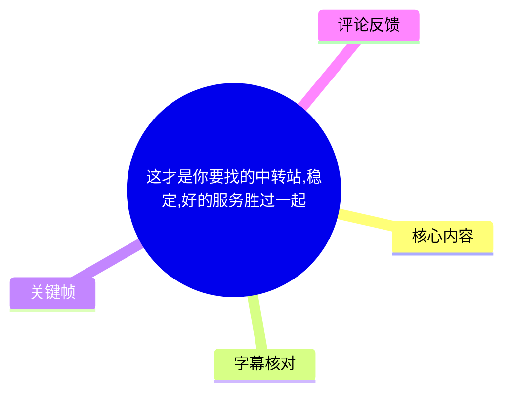
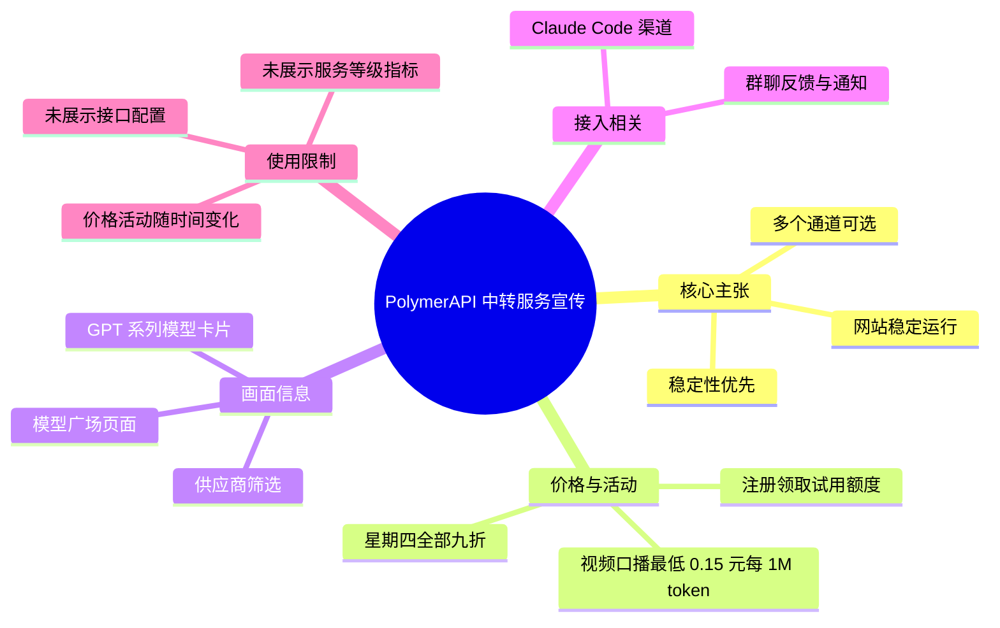
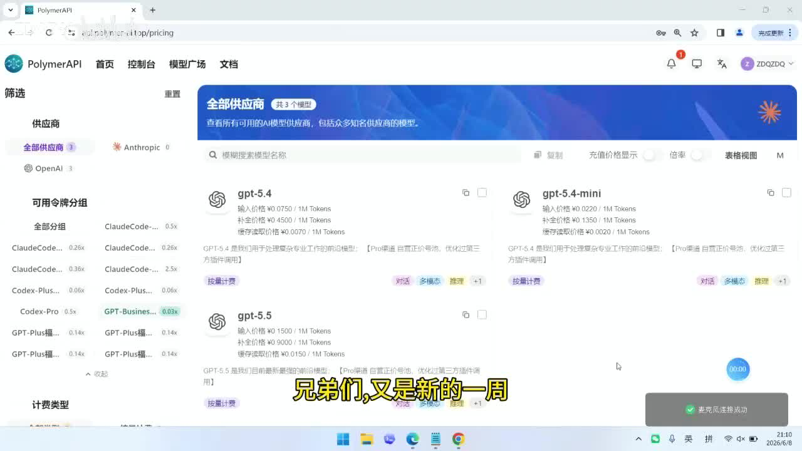
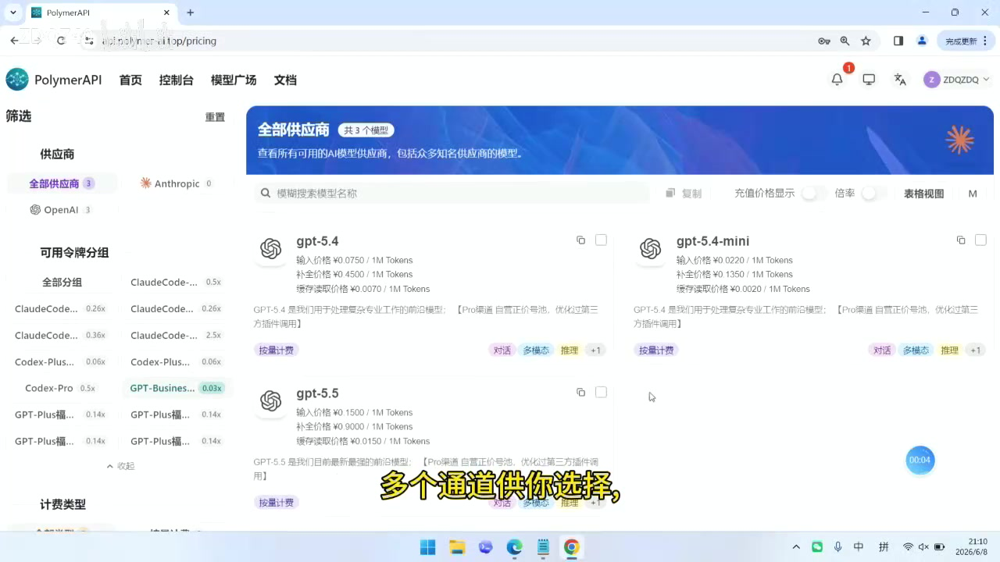

# 这才是你要找的中转站,稳定,好的服务胜过一起

> 来源：[Bilibili 视频](https://www.bilibili.com/video/BV18KEG6aE75) 
> UP 主：ZDQ740｜视频时长：18 秒｜分辨率：1280×720｜合集：AIcode

## 小结

这是一条针对 PolymerAPI 中转服务的短推广视频。UP 主在约 18 秒内集中传达：该网站“依旧稳定运行”、提供多个通道，并将“稳定性”置于价格之前。

视频明确口播的价格信息为**最低至 0.15 元 / 1M token**；同时称有 **Claude Code 渠道**、注册可领取试用额度，并宣传“疯狂星期四全部九折”。这些均属于服务方的营销陈述，视频没有展示计费规则、活动门槛、额度数值、可用模型清单或稳定性统计数据。

画面显示的是 PolymerAPI 的“模型广场”页面：页面左侧有供应商与可用令牌分组筛选，主区域可见 GPT-5.4、GPT-5.4-mini、GPT-5.5 等模型卡片。因此，视频至少以网页界面佐证其存在模型/分组选择界面；但画面不能独立证明实际接口可用性、速度、并发能力或长期稳定性。

适合正在比较 AI 模型 API 中转渠道、关注 Claude Code / Codex 相关接入与 token 价格的用户快速了解该推广信息。若准备付费或接入生产环境，应在注册后自行核对模型可用性、官方兼容性、价格单位、充值规则、隐私条款、限流及退款政策。

需特别注意时效性：视频画面日期为 2026-06-08，素材抓取时间为 2026-07-15；价格、折扣、试用额度、群聊入口及模型供应均可能已变化。视频字幕中的“0.15 元 / 1M token”与视频简介、热评中“低至 0.1 元 / 1M token”的说法并不一致，应以当前服务页的实际价格为准。

## 思维导图

## 目录

- [视频定位与画面背景](#视频定位与画面背景)
- [稳定性、多通道与界面呈现](#稳定性多通道与界面呈现)
- [价格、渠道、试用与折扣](#价格渠道试用与折扣)
- [可执行的核验与接入步骤](#可执行的核验与接入步骤)
- [结论与限制](#结论与限制)
- [字幕比对](#字幕比对)
- [评论分析](#评论分析)
- [处理记录](#处理记录)

## [视频定位与画面背景](https://www.bilibili.com/video/BV18KEG6aE75?t=0)

视频从 [00:00](https://www.bilibili.com/video/BV18KEG6aE75?t=0) 开始，以 PolymerAPI 的网页后台作为全程主要画面，UP 主口播面向“兄弟们”介绍新一周服务状态。页面地址栏可见 `api.polymer-ai.top/pricing`，与视频简介和热评给出的注册地址域名 `https://api.polymer-ai.top/` 一致。

页面导航包含“首页、控制台、模型广场、文档”；当前画面位于模型/定价相关页面。左侧“供应商”筛选区显示“全部供应商 3”、Anthropic、OpenAI；下方还有“可用令牌分组”和“计费类型”等筛选区域。此类界面说明该服务提供了模型及分组的展示、筛选入口，但视频未演示创建 API Key、配置 Base URL、发送请求或调用结果。

> 图：关键帧展示了 PolymerAPI 的模型广场页面、供应商筛选和模型卡片。它为“多个通道供选择”提供了可见的界面背景，但不能单独证明各通道实时可用。

## [稳定性、多通道与界面呈现](https://www.bilibili.com/video/BV18KEG6aE75?t=1)

### [网站稳定运行的主张](https://www.bilibili.com/video/BV18KEG6aE75?t=1)

站内字幕在 [00:01.880–00:04.130](https://www.bilibili.com/video/BV18KEG6aE75?t=1) 的原话为：“我们的网站依旧稳定运行”。这是一项由 UP 主作出的服务状态声明。

随后在 [00:04.130–00:05.810](https://www.bilibili.com/video/BV18KEG6aE75?t=4) 表示“多个通道供你选择”，并在 [00:05.810–00:07.230](https://www.bilibili.com/video/BV18KEG6aE75?t=5) 强调“稳定性大于一切”。这里的“通道”在视频中没有定义为上游供应商、模型路由、账户分组或具体 API 端点，不能进一步推定其具体技术实现。

画面可见模型卡片，如 GPT-5.4、GPT-5.4-mini、GPT-5.5；同时左侧展示 Anthropic 与 OpenAI 筛选项。该画面与“多通道/多模型选择”的宣传方向一致，但没有显示任何延迟、成功率、故障记录、SLA、并发限制或状态页数据。因此，“稳定”应理解为视频发布时的运营方表述，而非经独立测量的可靠性结论。

> 图：该帧保留了供应商筛选、令牌分组以及多个 GPT 模型卡片，适合用来理解视频所称“多个通道”的网页呈现形式；页面未显示实时健康检查或性能指标。

### [视频中能确认与不能确认的技术信息](https://www.bilibili.com/video/BV18KEG6aE75?t=4)

**素材能够确认的内容：**

1. 页面为 PolymerAPI 的模型广场/定价相关界面。
2. 界面存在供应商、令牌分组及模型筛选结构。
3. 视频口播称服务提供多个通道。
4. 视频标签涉及 Claude code、OpenAI Codex、VS Code、token、中转站等主题。
5. 视频口播及简介均涉及 Claude Code，说明其是宣传对象之一。

**素材没有展示或无法确认的内容：**

- API Base URL、鉴权方式、API Key 创建流程；
- Claude Code、Codex、VS Code 的具体配置命令；
- 支持的接口协议是否兼容 OpenAI API；
- 每个模型的上下文窗口、速率限制、并发限制及可用区域；
- 上游模型是否为官方直连、转发、聚合或其他接入方式；
- 服务可用性、故障恢复能力、数据保留及隐私处理方式；
- “多个通道”之间的切换规则与计价差异。

## [价格、渠道、试用与折扣](https://www.bilibili.com/video/BV18KEG6aE75?t=7)

### [视频口播价格与 Claude Code 渠道](https://www.bilibili.com/video/BV18KEG6aE75?t=7)

在 [00:07.230–00:10.050](https://www.bilibili.com/video/BV18KEG6aE75?t=7)，站内字幕给出的价格宣传是：

> 价格最低至 0.15 元每 M token。

其中 `M token` 通常表示一百万 token；视频没有说明这一最低价对应哪一个模型、输入还是输出 token、是否要求特定充值等级、是否为补全价格，或是否含活动条件。因此不应将其泛化为所有模型或所有请求的统一价格。

在 [00:10.050–00:11.530](https://www.bilibili.com/video/BV18KEG6aE75?t=10)，字幕称“还有 clode code 渠道”。结合视频标签“Claude code”、简介“开放 Codex 福利分组”及热评“上新了 claude-opus-4-8”，此处更合适的规范写法是 **Claude Code 渠道**；不过视频本身没有展示其实际接入界面或配置方法。

### [注册试用、社群与星期四折扣](https://www.bilibili.com/video/BV18KEG6aE75?t=11)

- [00:11.530–00:13.630](https://www.bilibili.com/video/BV18KEG6aE75?t=11)：UP 主称“注册可领试用额度”。未给出试用额度数量、领取步骤、有效期、是否要求绑定信息或是否限制模型。
- [00:13.630–00:15.530](https://www.bilibili.com/video/BV18KEG6aE75?t=13)：UP 主邀请用户进群，并使用“迎接疯狂”进行活动宣传。简介给出“1群反馈群已满，添加2群QQ号：1107621381”，但未展示群规或服务支持范围。
- [00:15.530–00:17.380](https://www.bilibili.com/video/BV18KEG6aE75?t=15)：UP 主称“星期四全部九折”。按字面理解是星期四价格按九折计算，但未说明适用的时区、开始/结束时间、适用商品、是否可叠加、是否有封顶或排除项。

### [简介与评论补充信息的差异](https://www.bilibili.com/video/BV18KEG6aE75?t=7)

视频简介及 UP 主置顶式热评均写有以下补充内容：

- 注册地址：`https://api.polymer-ai.top/`
- 2 群 QQ 号：`1107621381`
- “开放 Codex 福利分组，低至 0.1 元 / 1M token”
- “上新了 claude-opus-4-8”

这些信息与视频口播存在两点需要区分：

| 信息来源 | 价格表述 | 涉及对象 | 可靠使用方式 |
| --- | --- | --- | --- |
| 视频口播/站内字幕 | 最低 0.15 元 / 1M token | 未说明对应模型或分组 | 作为视频内原始宣传记录 |
| 简介与热评 | Codex 福利分组低至 0.1 元 / 1M token | 明确限定为 Codex 福利分组 | 作为评论补充，需到当前页面核验 |
| 视频画面 | 可见多张模型卡片及部分单价 | 具体数字较小且未配合口播解释 | 不据此推导完整计费规则 |

“0.1 元”与“0.15 元”并非必然矛盾：前者可能是特定 Codex 福利分组的价格，后者可能是视频口播时覆盖范围更广或不同对象的最低价。但视频没有明确解释二者关系，不能作确定判断。

## [可执行的核验与接入步骤](https://www.bilibili.com/video/BV18KEG6aE75?t=11)

视频没有提供完整教学流程，以下是依据其实际提到的“注册地址、试用额度、群反馈”整理的**核验顺序**，而不是视频已演示的操作教程：

1. **访问注册入口**  
   使用视频简介和热评中提供的地址：`https://api.polymer-ai.top/`。访问前应核对域名、HTTPS 证书和页面归属，避免将简介中的链接自动等同于长期有效或官方唯一入口。

2. **完成注册并核实试用规则**  
   视频在 [00:11](https://www.bilibili.com/video/BV18KEG6aE75?t=11) 后称注册可领试用额度。注册后应检查：
   - 实际到账额度；
   - 有效期；
   - 可使用的模型与分组；
   - 是否存在调用频率、并发或地区限制；
   - 试用结束后的扣费切换规则。

3. **在模型广场核对目标模型与分组**  
   画面显示可通过供应商和令牌分组筛选模型。对于 Claude Code、Codex 或其他目标，应逐项确认：
   - 模型名称是否与所需客户端兼容；
   - 输入、输出、缓存等不同计费项；
   - 标价单位是否均为每 1M token；
   - 是否需要选择特定福利分组；
   - 当前状态是否显示可用。

4. **确认活动价格而非仅依据视频数字**  
   视频口播为最低 0.15 元 / 1M token，简介/热评则提到 Codex 福利分组最低 0.1 元 / 1M token，且有“星期四全部九折”宣传。下单或充值前应以当前结算页为准，并记录模型、分组、输入/输出价格和活动条件。

5. **先进行低风险测试**  
   视频未提供稳定性量化证据。若计划用于实际工作流，建议先以少量余额测试：
   - 正常请求的响应成功率；
   - 高峰时段延迟；
   - 失败响应是否有明确错误信息；
   - 余额扣费是否与价目表一致；
   - 目标客户端（如 Claude Code）是否能够正常认证与调用。  
   
   这属于合理的使用建议，并非视频中演示过的测试步骤。

6. **通过社群获取变动通知或反馈问题**  
   视频引导进群，简介称反馈群 1 群已满并给出 2 群 QQ 号。社群信息可作为获取运营通知的渠道，但不应替代对官方页面、账单与服务条款的核验。

## [结论与限制](https://www.bilibili.com/video/BV18KEG6aE75?t=15)

这条视频的核心经验是：对 AI API 中转服务的选择，UP 主主张应优先看稳定性和通道选择，而不只看最低单价。对于使用多种模型、希望有模型分组选择或关注 Claude Code/Codex 相关服务的用户，这一比较维度具有参考意义。

但视频是短时长推广内容，展示深度有限。其“稳定运行”“多个通道”“最低价格”“注册试用”“星期四九折”等信息均以运营方声明为主，缺乏可复核的服务等级协议、接口实测、故障历史、完整价目表与条款说明。不能据此确认服务适合生产环境，也不能据此判断数据安全、合规性或第三方模型授权情况。

价格信息尤其需要谨慎：视频字幕为 **0.15 元 / 1M token**，简介与热评为 Codex 福利分组 **0.1 元 / 1M token**；两种说法对应范围未被解释。建议将视频作为发现服务入口的材料，而将当前网页价目表、账户内账单规则、服务协议和实际测试结果作为决策依据。

时效方面，视频发布画面显示日期为 2026-06-08，素材于 2026-07-15 抓取。AI 模型供应、服务分组、促销及群联系方式均可能在之后调整；“claude-opus-4-8”也仅是评论中的上新声明，未在视频画面中完成调用验证。

## 字幕比对

| 字幕来源 | 完整性 | 专有名词 | 时间轴 | 主要问题 |
| --- | --- | --- | --- | --- |
| Bilibili 站内字幕 | 高，10 段覆盖 00:00.040–00:17.380 | “clode code”拼写不规范 | 高，逐句分段，可直接定位 | 未解释价格所对应模型/分组；“clode”应结合上下文校正 |
| 本次 ASR 字幕 | 高，诊断显示语音覆盖率 99.24%，覆盖 00:00–00:17.260 | 识别为“稳电性”“CloudCode”“注册额领” | 较低，仅 1 个长分段 | 中文断句缺失；“稳定性”“Claude Code”“可领”存在识别误差 |

本次 ASR 已被检查：使用 `medium` 模型、中文识别概率 `0.9609375`，音频时长 `17.39175` 秒，识别到的语音时长为 `17.26` 秒；诊断中**没有** `noAudioStream=true` 标记，说明源视频存在音轨，不能将字幕问题归因于无音频。

最终以**站内字幕作为时间轴主依据**，原因是其按句分段，时间范围精确且与口播内容对应；以本次 ASR 作为完整性复核。重要术语校正如下：

- ASR“稳电性”校正为“稳定性”，与站内字幕一致。
- 站内字幕“clode code”、ASR“CloudCode”统一整理为“Claude Code”；依据为视频标签中的“Claude code”及简介中的 Codex/Claude 相关上下文。此为术语规范化，不表示视频展示了 Claude Code 的实操。
- ASR“注册额领试用额度”校正为“注册可领试用额度”，与站内字幕一致。
- `M token` 保留其原始计量表达，不擅自补充具体模型或输入输出计费范围。

## 评论分析

可获取热评共 1 条，未达到 3 条；以下仅分析已获取内容，不补造其他评论。

### 热评 1：UP 主补充注册、群聊、Codex 与模型信息

- **评论者**：ZDQ740（UP 主）
- **点赞数**：0
- **主要内容**：重复给出注册地址 `https://api.polymer-ai.top/`，称 1 群反馈群已满、可添加 2 群 QQ 号 `1107621381`；补充“Codex 福利分组低至 0.1 元 / 1M token”，并称“上新了 claude-opus-4-8”。

**分析：**

1. 这条评论对视频的“注册、社群、价格、模型”信息起到了补充作用，尤其补足了口播没有念出的注册地址和 Codex 福利分组信息。
2. 评论作者即 UP 主，因此可视为运营方补充声明，而不是独立用户的使用反馈或第三方评价。
3. 评论中的 0.1 元 / 1M token 与视频字幕中的 0.15 元 / 1M token 存在表述差异。评论限定为“Codex 福利分组”，可能对应不同对象，但这一点没有被明确证实。
4. “claude-opus-4-8”是否为当前可用模型、具体模型标识如何、价格与能力如何，均需在实际平台中核验；评论本身不足以构成可用性证明。

## 处理记录

- **Worker ID**：`worker-mrj0wjed-b0c290ad`
- **整理模型**：`gpt-5.6-terra`
- **ASR 模型**：`medium`，设备 `cuda`，计算类型 `float16`，识别语言为中文。
- **使用的素材与工具结果**：
  - 视频元数据与统计信息；
  - 站内字幕 `p01-ai-zh.srt`；
  - 本次 ASR 结果 `asr/asr-result.json` 与 ASR SRT；
  - 已提供关键帧列表与可见关键帧画面；
  - 已获取的热评数据 `comments/comments.json`。
- **字幕选择**：采用站内字幕作为正文时间轴依据；本次 ASR 用于音频存在性、语音覆盖率和文本交叉校验。未发现 `noAudioStream=true`，因此按有音轨视频处理。
- **关键帧选择依据**：
  - `frames/frame-001.jpg`：展示 PolymerAPI 模型广场、供应商筛选与模型列表，适合作为服务界面和多通道主张的视觉依据。
  - `frames/frame-004.jpg`：保留模型卡片、令牌分组和页面筛选结构，适合说明视频仅展示了选择界面而未展示接口调用或稳定性指标。
- **缓存清理**：提供的素材记录未包含缓存清理执行结果；本整理不对未提供的清理操作作出已完成声明。
- **未解决问题**：
  - 未提供模型的完整可用清单、API 文档、调用日志、性能监控或服务条款；
  - 无法从短视频确认“稳定性”指标；
  - 0.15 元与 0.1 元 / 1M token 的适用范围未被视频明确说明；
  - 未展示 Claude Code、Codex 或 VS Code 的实际配置与调用成功画面；
  - 可获取热评仅 1 条，无法形成用户口碑的多样性判断。
