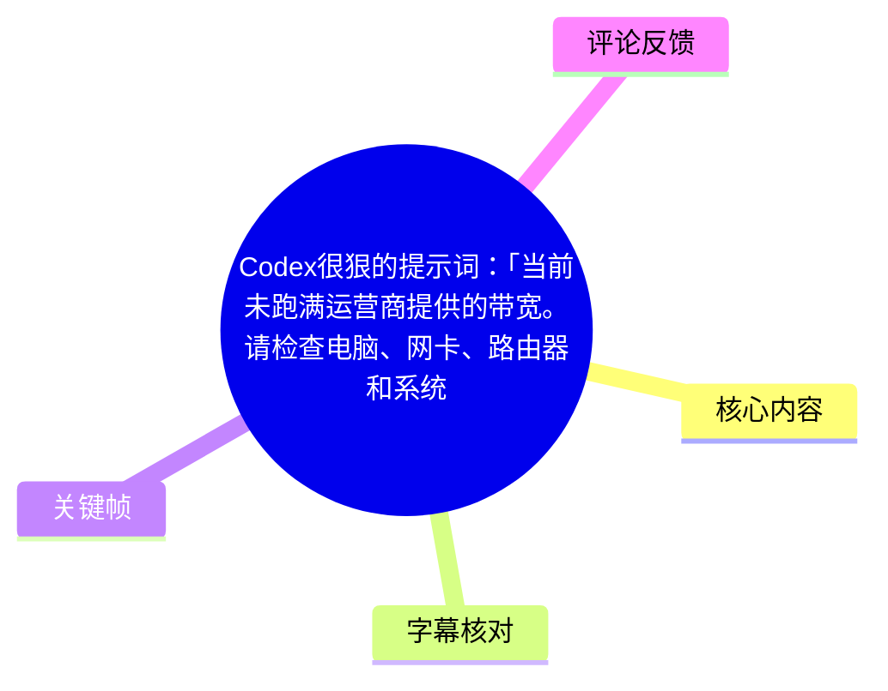
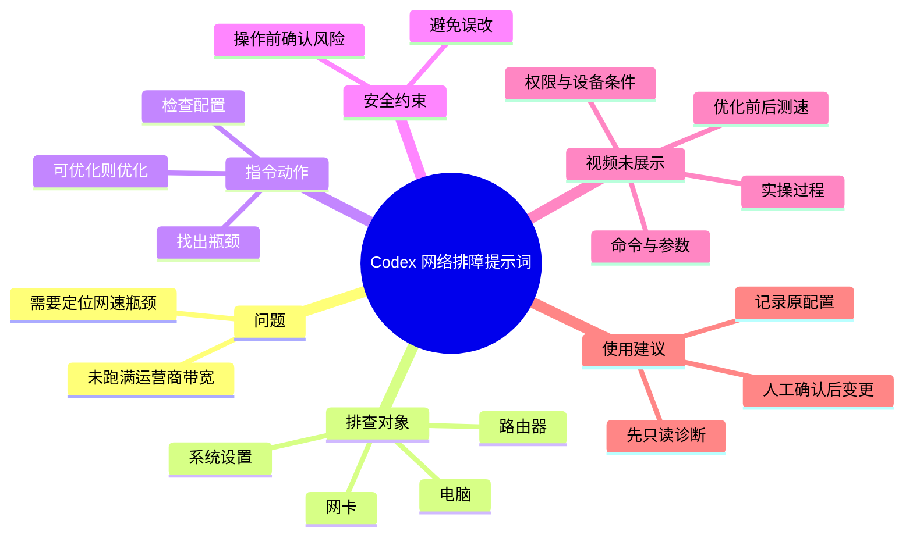

# Codex很狠的提示词：让 AI 排查电脑网络瓶颈

> 来源：[Bilibili 视频](https://www.bilibili.com/video/BV1FANP6xEA3)  
> UP 主：AI元博士｜视频时长：12 秒｜标签：网络、网速、openai codex  
> 视频为竖屏静态文字卡片；未提供可用站内字幕，本次 ASR 也未识别出有效语音片段。

## 小结

视频分享了一条面向 Codex 的网络排障提示词，目标是处理“当前未跑满运营商提供的带宽”这一问题。提示词要求 AI 检查电脑、网卡、路由器和系统设置，定位造成网速未达预期的瓶颈。

该提示词的关键设计不只是“优化网速”，还包含两项约束：一是让 AI 在多个层级中排查配置；二是在实际修改前先确认风险，避免误改。视频文字进一步宣称，Codex 可以自行检查配置、定位问题并调整设置，网络速度“可能直接起飞”。

但视频没有展示 Codex 的真实执行过程、系统权限、诊断命令、路由器型号、运营商套餐带宽、测速数据、优化前后对比或成功案例。因此，“可能直接起飞”属于视频的推广性表述，不能视为已被本视频验证的效果。

适合将其作为**网络诊断任务的提示词框架**参考，尤其适合希望让具备本机/网络设备访问能力的 AI 协助梳理排障范围的人。实际使用时，必须把“先检查、后报告、确认后再改”落实为明确的权限边界；涉及路由器、网卡驱动、DNS、代理、防火墙或系统网络栈时，不应仅凭 AI 建议直接变更。

视频时效性方面：其内容依赖 Codex 当时的产品能力、可访问的本地环境与权限机制。模型是否能执行系统命令、读取路由器配置、修改网络参数，均可能随客户端、操作系统、账号权限和产品策略变化；本视频没有提供版本信息，无法确认当前仍可复现。

## 思维导图





## 目录

- [视频内容与提示词原文](#视频内容与提示词原文)
- [排查范围：电脑、网卡、路由器与系统](#排查范围电脑网卡路由器与系统)
- [风险控制与可执行性边界](#风险控制与可执行性边界)
- [可迁移的实践流程](#可迁移的实践流程)
- [关键帧](#关键帧)
- [结论、限制与时效性](#结论限制与时效性)
- [字幕比对](#字幕比对)
- [评论分析](#评论分析)
- [处理记录](#处理记录)

## [视频内容与提示词原文](https://www.bilibili.com/video/BV1FANP6xEA3?t=0)

由于站内未提供 SRT，且本次 ASR 没有产生带时间戳的语音分段，无法依据字幕建立更细粒度的真实时间轴。本节链接至视频起点，覆盖整段 12 秒静态文字内容。

画面中的核心说明是：Codex 存在一种“直接让它接管电脑排查网络”的提示词玩法。视频给出的提示词为：

> 当前未跑满运营商提供的带宽。请检查电脑、网卡、路由器和系统设置，找出网速瓶颈，能优化的直接优化，操作前先确认风险，避免误改。

画面随后给出的预期是：AI 会“自己查配置、定位问题、调整设置”，网络速度“可能直接起飞”。

从任务结构看，这段提示词包含以下信息：

| 要素 | 视频中的表达 | 可确认含义 |
| --- | --- | --- |
| 初始问题 | 当前未跑满运营商提供的带宽 | 用户认为当前实测吞吐低于套餐或线路可提供的带宽。 |
| 排查范围 | 电脑、网卡、路由器和系统设置 | 将问题分布在终端、网络接口、局域网设备和操作系统层面排查。 |
| 目标 | 找出网速瓶颈 | 重点不是任意改设置，而是先识别限制吞吐的环节。 |
| 修改意图 | 能优化的直接优化 | 对确认可安全调整的项目进行配置变更。 |
| 风险约束 | 操作前先确认风险，避免误改 | 修改前应告知影响、征得确认，并避免破坏现有网络环境。 |

视频没有定义“未跑满”的判断标准。例如，没有说明应以有线测速、无线测速、单设备测速、多设备并发测速、下载器吞吐还是运营商入户速率为准；也没有给出套餐单位、理论损耗范围或测速服务器选择规则。

## [排查范围：电脑、网卡、路由器与系统](https://www.bilibili.com/video/BV1FANP6xEA3?t=0)

视频明确点名四类排查对象，但没有提供各对象的检查清单、具体工具或参数。以下内容是对视频列举范围的结构化整理，不代表视频已经展示或验证了这些检查项。

### 1. 电脑

“电脑”是终端环境层面的统称。视频意图是让 AI 将本机作为可能的瓶颈来源之一，而不是默认所有问题都来自运营商。

视频未说明要检查的具体内容，也未展示以下信息：

- CPU、内存、磁盘或后台应用是否影响测速；
- 是否存在下载、同步、代理、VPN 或安全软件占用带宽；
- 是否使用有线或无线连接；
- 是否有多块网卡、虚拟网卡或网络共享配置；
- 操作系统及其版本。

因此，不能从视频推导出某一特定电脑设置一定应被关闭或修改。

### 2. 网卡

视频将“网卡”单独列为排查对象，表明网络接口的链路能力和配置可能影响实际网速。

但视频没有给出网卡型号、协商速率、驱动版本、双工模式、MTU、节能选项、Wi‑Fi 频段或信号强度等参数，也没有提供任何调整命令。尤其是手动固定速率/双工、修改高级驱动属性或更新驱动，都可能导致断网、链路协商失败或兼容性问题，不能因“能优化的直接优化”而跳过确认。

### 3. 路由器

视频要求检查“路由器”，将局域网出口设备纳入排障范围。路由器确实可能成为带宽利用不足的中间环节，例如其端口速率、无线能力、性能负载或功能配置可能影响实际吞吐；不过，这些具体原因并未在视频中逐项呈现。

视频没有展示：

- 路由器品牌、型号、固件版本；
- WAN/LAN 端口协商状态；
- 是否使用无线中继、Mesh、PPPoE、VLAN、QoS 或流量控制；
- 管理后台界面、配置备份或恢复方法；
- 修改后的连通性测试。

因此，不能把视频理解为已证明“修改路由器设置即可提速”。

### 4. 系统设置

视频把“系统设置”列为独立检查面，意味着操作系统网络配置也应被纳入诊断。然而，系统设置涵盖范围很广，可能涉及 DNS、代理、防火墙、网络优先级、虚拟适配器和网络协议栈等；视频没有指定操作系统，亦未给出可安全通用的修改方法。

实际执行时，应特别区分：

- **只读检查**：查看当前状态、收集测速结果、导出配置；
- **可逆变更**：能够记录原值并快速恢复的调整；
- **高风险变更**：可能导致断网、影响内网访问、破坏企业 VPN/代理、削弱安全策略或重置网络环境的操作。

## [风险控制与可执行性边界](https://www.bilibili.com/video/BV1FANP6xEA3?t=0)

视频中最值得保留的约束是“操作前先确认风险，避免误改”。这说明原提示词并非无条件授权 AI 修改任意网络配置。

不过，原文同时包含“能优化的直接优化”，与“操作前先确认风险”之间存在执行边界上的歧义：AI 应在每一项变更前等待确认，还是仅在其判断为高风险时确认？视频没有解释。为了避免误操作，应将其明确为：**默认只读诊断；任何写入性、重启性、重置性或可能影响连接的操作均先说明并等待确认。**

建议将风险确认至少覆盖以下内容：

| 变更类别 | 潜在影响 | 建议确认方式 |
| --- | --- | --- |
| 修改本机网络配置 | 可能立即断网、改变 DNS/代理、影响 VPN 或公司内网访问 | 说明原值、拟改值、恢复方式后确认。 |
| 更新或重装网卡驱动 | 可能导致设备异常、连接中断或需要重启 | 确认设备型号、驱动来源、回滚路径。 |
| 调整路由器配置 | 可能影响同一局域网内所有设备 | 先备份配置，确认管理员权限和现场恢复条件。 |
| 重启路由器或光猫 | 会造成全网短时中断 | 确认当前是否有会议、下载、监控或远程访问任务。 |
| 重置网络设置 | 可能清除 Wi‑Fi、VPN、代理及自定义网络规则 | 仅在明确备份并获确认后执行。 |
| 改变安全策略 | 可能降低防火墙或访问控制保护 | 不应为追求测速而直接关闭安全防护。 |

视频没有展示 Codex 的权限申请、命令执行日志、变更审批界面或回滚过程。因此，“接管电脑”应被视为视频对使用方式的概括，而非已经证明的安全自动化能力。

## [可迁移的实践流程](https://www.bilibili.com/video/BV1FANP6xEA3?t=0)

本视频仅给出提示词，并未展示实际操作步骤。若要将其用于真实网络排障，可保留原提示词的排查顺序与风险意识，并把“确认风险”具体化为可审计流程。

### 可直接引用的提示词

```text
当前未跑满运营商提供的带宽。请检查电脑、网卡、路由器和系统设置，
找出网速瓶颈，能优化的直接优化，操作前先确认风险，避免误改。
```

### 建议补足的执行边界

为避免原提示词中“直接优化”被过度解释，可在实际任务中补充如下限制：

```text
先进行只读检查并输出诊断报告：列出已检查项、发现的疑点、证据、
可能影响和建议操作。任何会修改配置、安装/卸载驱动、重启设备、
重置网络或影响其他设备联网的操作，都必须在执行前说明原值、
拟改值、风险、回滚方案，并等待我的明确确认。
不要关闭安全防护，不要删除文件，不要修改无法恢复的设置。
```

### 推荐执行顺序

1. **确认问题基线**：记录运营商套餐带宽、接入方式、测试设备、连接方式和当前测速结果。视频没有提供这些数据，因此不能仅凭“感觉慢”判断未跑满。
2. **先做只读检查**：按视频列举的电脑、网卡、路由器、系统设置四个层面收集现状，而不直接改动。
3. **建立瓶颈假设**：区分问题是发生在单台电脑、单个网络接口、无线局域网、路由器转发还是外部线路。该分类是为了避免跨层级盲改，不是视频展示的既定诊断结果。
4. **逐项提出变更建议**：每项建议应包含目的、预期收益、风险、受影响范围、原配置和回滚方法。
5. **人工确认后再执行**：对可能中断网络或影响其他设备的变更，必须由拥有网络管理权限的人批准。
6. **复测与回退**：每次变更后使用与基线一致的测试条件复测；若无改善或出现副作用，应恢复原配置。
7. **保留记录**：保存配置快照、命令输出、测速条件与修改时间，便于追踪有效变更。

## [关键帧](https://www.bilibili.com/video/BV1FANP6xEA3?t=0)


> 图：该关键帧展示视频主体——一张黑底文字卡片。卡片明确写出 Codex 网络排障提示词、检查对象“电脑、网卡、路由器和系统设置”，以及“操作前先确认风险，避免误改”的约束。由于所给关键帧呈现的是同一静态画面，选用 `frame-001.jpg` 已足以作为原文核对依据，未重复插入内容相同的帧。

画面中被黄色高亮的关键词包括“电脑”“网卡”“路由器”“系统设置”“网络速度”，有助于确认视频的关注点是多层级网络排障，而非只针对单一测速工具或单一系统选项。

## [结论、限制与时效性](https://www.bilibili.com/video/BV1FANP6xEA3?t=0)

这是一条极短的提示词分享视频，核心价值在于提供了一个任务描述模板：当实际网速未达到预期时，让 AI 从电脑、网卡、路由器和系统设置四个层面协助排查，并把风险确认写入指令。

可迁移的经验有两点：

1. 网络提速不应只盯着运营商或单一设备，应将终端、网络接口、局域网设备和操作系统配置放在同一排障框架内。
2. 对具备系统操作能力的 AI，提示词必须明确权限与风险边界；“先确认风险、避免误改”是原视频最重要的安全限制。

同时，本视频存在明确限制：

- 未展示任何 Codex 实操、命令、配置页面或执行日志；
- 未提供电脑系统、网卡、路由器、运营商套餐和网络拓扑；
- 未提供优化前后测速数据，无法验证提速效果；
- 未说明 Codex 是否拥有访问本机或路由器的权限；
- 未解释“直接优化”与“先确认风险”在具体执行时如何划分；
- 视频无可用站内字幕，本次 ASR 亦为空，正文只能依据静态画面文字、标题与视频描述整理。

因此，视频中的“网络速度可能直接起飞”只能作为可能性描述，不构成对任何设备、套餐或网络环境的性能承诺。涉及路由器后台、系统网络重置、驱动更新或安全策略的操作，都应由使用者核验配置、保存回滚信息并明确授权后进行。

## [字幕比对](https://www.bilibili.com/video/BV1FANP6xEA3?t=0)

| 字幕来源 | 完整性 | 专有名词 | 时间轴 | 主要问题 |
| --- | --- | --- | --- | --- |
| Bilibili 站内字幕 | 未提供可用字幕 | 无法核验 | 无可用 SRT 分段 | 无法用于转录或建立细粒度时间轴。 |
| 本次 ASR 字幕 | 空 | 未识别出 `Codex` 等词 | ASR 设置支持时间戳，但 `segments` 为空 | `large-v3-turbo` 自动语言识别结果为英文、置信度约 0.6006；语音段数为 0、语音覆盖率为 0，诊断提示未识别到语音。 |

本次 ASR 已被检查：音频时长为约 11.98 秒，但未产出任何识别分段。诊断材料**没有**标记 `noAudioStream=true`，因此不能断言源视频没有音轨；能够确认的是，当前 ASR 未检测到可识别语音。结合给出的关键帧，视频内容以静态文字卡片呈现。

最终未采用字幕文本，而是依据以下来源整理：

- 视频标题；
- 视频简介中完整列出的提示词；
- 关键帧中可见的同一段提示词与补充说明；
- 视频元数据中的时长、标签及互动数据。

通过画面与元数据核对的关键术语包括：`Codex`、运营商提供的带宽、电脑、网卡、路由器、系统设置、网速瓶颈、确认风险、避免误改。由于没有真实字幕时间段，正文仅使用 `t=0` 指向整段视频，未虚构细分时间点。

## [评论分析](https://www.bilibili.com/video/BV1FANP6xEA3?t=0)

以下仅处理可获取热评前三条；评论是用户观点或玩笑表达，不是对视频效果的验证。

1. **王师傅精益求精**（109 赞）：“改到一半开始重连就老实了”  
   - 观点：调侃 AI 或自动化工具在改动网络配置途中出现“重连”后会停止或变得谨慎。  
   - 补充价值：侧面提示网络配置变更确有可能导致连接中断，与视频“先确认风险、避免误改”的约束相呼应。  
   - 可信度边界：未说明实际使用的工具、设备或操作，不能据此判断 Codex 的真实行为。

2. **zhou2008**（3 赞）：“Reconnecting... (1/5)”  
   - 观点：以常见软件重连提示模拟网络被改断后的状态。  
   - 补充价值：强化了远程或在线会话在修改网络时可能丢失连接的风险。  
   - 可信度边界：属于简短玩笑式评论，不含可验证的技术细节。

3. **サムエル**（9 赞）：“给你C盘删了就老实了[笑哭]”  
   - 观点：夸张表达对“让 AI 接管电脑”的担忧，即担心权限过大带来误操作。  
   - 补充价值：提醒实际使用时必须限制 AI 权限，避免将无关的文件删除、系统改动等高风险能力混入网络优化任务。  
   - 可信度边界：显然是戏谑表达，不表示视频中的 Codex 会执行删除文件操作。

## [处理记录](https://www.bilibili.com/video/BV1FANP6xEA3?t=0)

- Worker ID：`worker-mrj0wbly-5dc4e50c`
- 整理模型：`gpt-5.6-terra`
- ASR 模型：`large-v3-turbo`
- 调用工具与素材：使用任务提供的视频元数据、关键帧清单、ASR 诊断与结果、热评数据；具体底层下载、抽帧与评论抓取工具名称未在素材中提供，无法补充。
- 字幕选择：站内字幕未提供可用文件；本次 ASR 已检查但输出为空。最终以标题、简介及关键帧可见文字为事实依据，不将空 ASR 当作有效字幕。
- ASR 状态：音频文件存在且时长约 11.98 秒；未提供 `noAudioStream=true` 标记。ASR 结果为 0 个语音分段，不能据此推定没有音轨。
- 关键帧选择依据：`frames/frame-001.jpg` 清晰展示视频完整核心文字；所给画面为重复的静态文字卡片，未重复使用内容相同的其他帧。
- 时间轴依据：缺少站内 SRT 与 ASR 实际分段，无法生成不臆测的细粒度时间戳；各正文时间轴链接统一定位 `t=0`，对应全片静态内容。
- 缓存清理：素材未提供缓存清理执行记录，无法确认是否已清理；不作已清理的声明。
- 未解决问题：无法从现有素材验证 Codex 的本机控制权限、实际诊断能力、修改范围、优化成功率及任何前后测速提升。

## 评论分析

- 热评 1：改到一半开始重连就老实了
- 热评 2：Reconnecting... (1/5)
- 热评 3：给你C盘删了就老实了[笑哭]

以上内容是观众反馈摘录，只用于补充理解视频反响，不作为正文事实依据。
