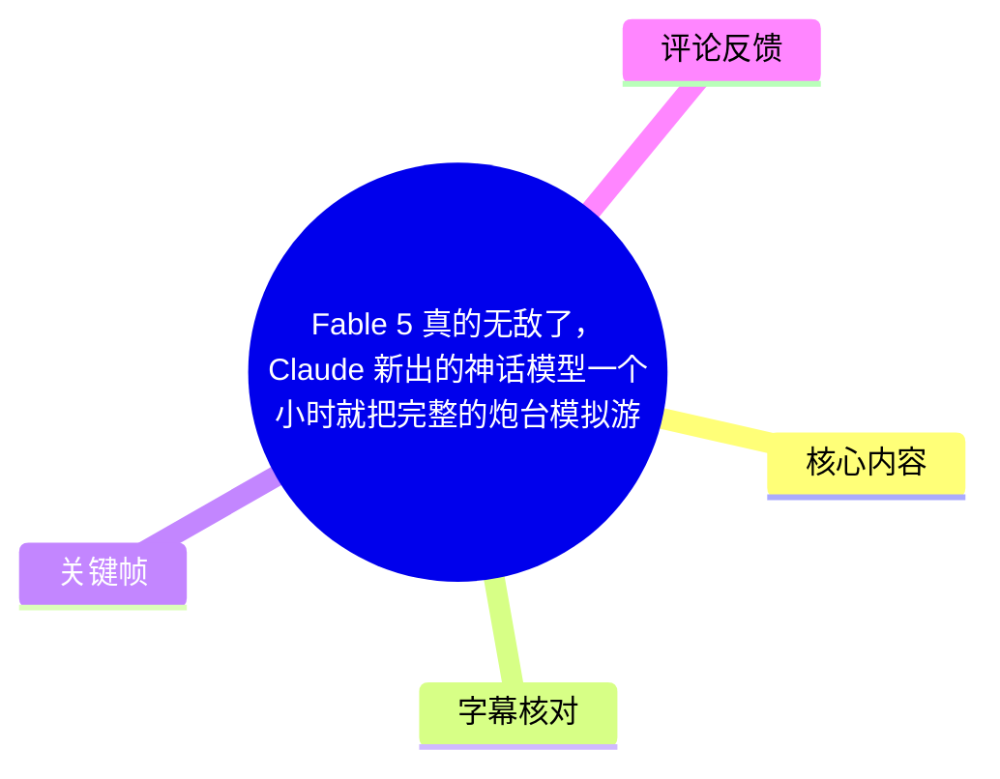
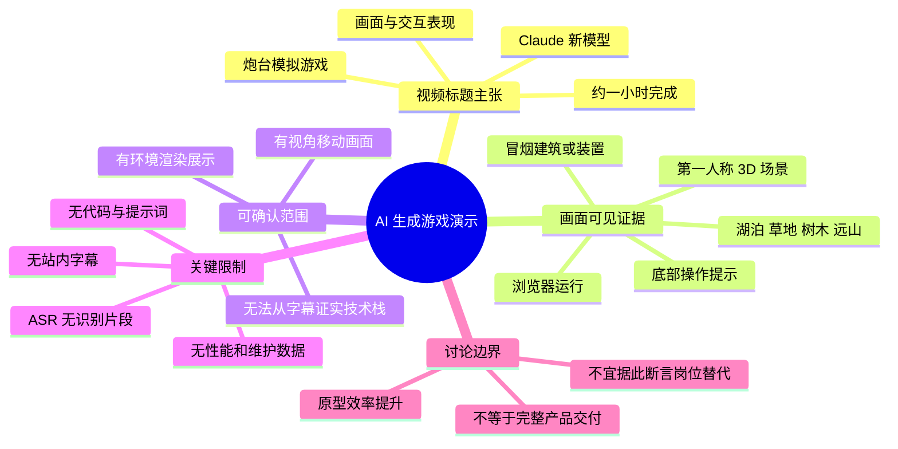
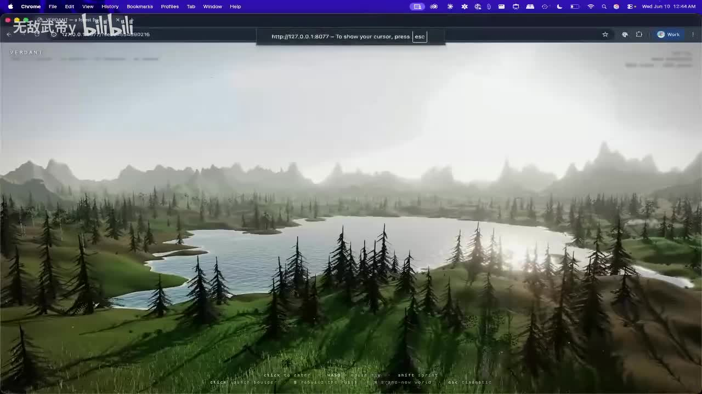
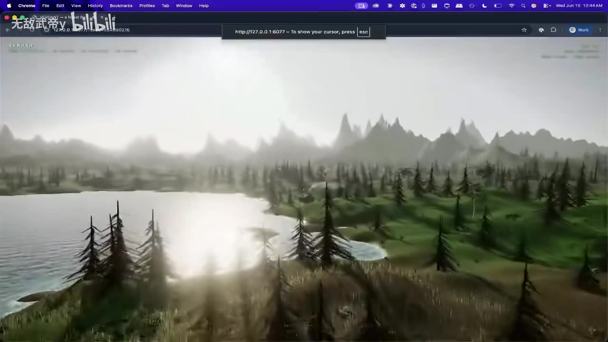
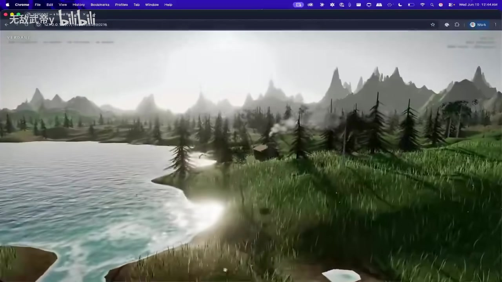
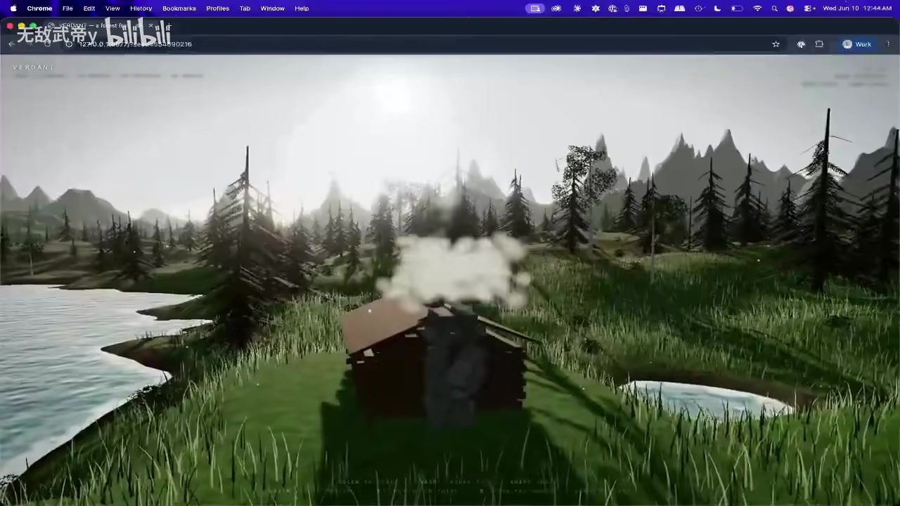

# Fable 5 真的无敌了，Claude 新出的神话模型一个小时就把完整的炮台模拟游戏给做出来了。样式很好看，交互也很流畅，难道游戏开发人员真的要失业了吗？

## 小结

本视频时长 34 秒，标题将演示对象称为由 Claude 新出“神话模型”在约一小时内完成的“完整炮台模拟游戏”，并强调其画面样式与交互流畅度，进一步抛出“游戏开发人员是否会失业”的讨论性问题。

不过，现有可用的画面证据主要展示了一个在浏览器中运行的第一人称 3D 场景：湖泊、草地、针叶树、远山、阳光反射，以及一处会冒烟的小型建筑/装置。画面底部可辨认出操作提示，但分辨率不足以可靠抄录全部按键内容。素材中**没有可用的站内字幕**，本次 ASR 也没有识别出任何语音片段，因此无法从音频证实模型具体名称、开发流程、耗时计量方式、游戏机制、代码规模、引擎或部署技术。

从画面看，演示至少体现出环境渲染、自由视角移动和场景对象效果；但“完整炮台模拟游戏”“一小时完成”“交互流畅”等属于视频标题的主张，不能仅根据现有关键帧扩展为已验证的技术结论。尤其不能据此推断其已具备正式游戏所需的关卡内容、数值系统、性能测试、可维护性、资产版权处理或跨平台发布能力。

这份整理适合关注 AI 辅助游戏原型、网页 3D 演示和 AI 对开发岗位影响的人阅读。核心可迁移经验是：应把“短时间完成可演示原型”与“可长期维护、可正式发行的游戏产品”分开评价，并要求以可复现的提示词、代码、运行环境与测试数据验证结论。

视频元数据记录的发布时间戳为 `1781162740`，按 UTC 换算约为 **2026-06-11 07:25:40**；抓取时间为 2026-07-15。模型、产品能力及网页运行效果都具有强时效性，应以观看页面和原始项目的最新信息为准。

## 思维导图

## 目录

- [视频背景与证据边界](#视频背景与证据边界)
- [画面演示：浏览器中的 3D 环境](#画面演示浏览器中的-3d-环境)
- [可见交互与效果](#可见交互与效果)
- [标题主张、技术信息与缺失项](#标题主张技术信息与缺失项)
- [实践启示：如何验证 AI 游戏原型](#实践启示如何验证-ai-游戏原型)
- [结论、限制与时效性](#结论限制与时效性)
- [字幕比对](#字幕比对)
- [评论分析](#评论分析)
- [处理记录](#处理记录)

---

## 视频背景与证据边界 [00:00](https://www.bilibili.com/video/BV1kHEv6SEYh?t=0)

视频标题提出的新闻/展示点包括：

1. 演示对象被称作 **Fable 5**；
2. 标题称其由 Claude 新出的“神话模型”完成；
3. 标题称开发耗时约一个小时；
4. 标题将其描述为“完整的炮台模拟游戏”；
5. 标题评价其“样式很好看，交互也很流畅”；
6. 标题以游戏开发职业是否会被替代作为讨论引子。

但这些信息均来自标题，而非可用字幕或可转录的旁白。现有证据可以确认视频播放的是浏览器内的 3D 画面，地址栏可见本地地址形式 `127.0.0.1:...`，但端口号及路径无法稳定辨认，不能据此确定使用的框架、引擎、语言或构建工具。

视频画面左上角可见 “VERDANT” 字样，可能是项目标题、场景名称或页面标识；由于没有字幕、源项目链接及清晰 UI 文本，不能将其确定为产品名、模型名或技术组件。

> **证据使用原则**：以下“画面可见”内容基于关键帧；“标题称”内容只表述标题主张；未出现的代码、参数、模型版本、提示词与测试数据一律不补写、不推测。

---

## 画面演示：浏览器中的 3D 环境 [00:00](https://www.bilibili.com/video/BV1kHEv6SEYh?t=0)

关键帧显示演示运行在 Chrome 浏览器中，场景采用第一人称或自由镜头视角。画面主体包含：

- 前景与中景的草地；
- 面积较大的湖泊及岸线；
- 大量针叶树；
- 远处锯齿状山体；
- 强烈日照、雾化远景与水面高光；
- 浏览器网页内嵌运行的实时画面，而非单独桌面游戏客户端。

> 图：该帧提供了视频中最完整的环境总览，可用于确认演示包含湖泊、草地、树林和远山等场景元素，也能看出它运行在浏览器窗口中。它只能证明画面效果的存在，不能证明场景资产来源、渲染引擎或生成方式。

画面中水面具有反射/高光表现，远山和树林有明显距离雾化，草地呈现密集植被效果。这些视觉特征说明演示目标并不只是纯文本或静态网页，而是包含持续渲染的三维场景展示；但仅凭截图不能判定这些特效是实时全局光照、屏幕空间效果、预烘焙光照，还是录屏后处理。

> 图：该帧与全景构图不同，湖岸、树林和远山在视野中的相对位置发生变化，支持视频展示了视角变化/移动过程，而非仅展示一张静态效果图。

---

## 可见交互与效果 [00:00](https://www.bilibili.com/video/BV1kHEv6SEYh?t=0)

视频底部存在一行较小的操作说明文字，其中可见类似 `WASD`、`mouse`、`shift sprint`、`esc` 等英文片段，但图像分辨率与压缩质量不足，无法可靠还原完整内容和准确按键映射。基于可辨认部分，最多可以谨慎记录：

- 演示界面提供了键盘/鼠标控制提示；
- `WASD` 很可能与移动相关；
- `mouse` 很可能与视角控制相关；
- `Shift` 旁存在 `sprint` 字样，暗示可能存在冲刺操作；
- `Esc` 旁存在与鼠标/控制状态相关的提示，但具体含义不清晰。

这类操作提示与关键帧之间的视角变化共同构成“可控制 3D 场景”的有限证据。它**不能**证明炮台射击、瞄准、敌人 AI、碰撞伤害、关卡胜负、资源管理或存档等“炮台模拟游戏”功能，因为这些机制没有在可用画面或字幕中被明确展示。

> 图：该帧更突出草地、水岸和远景的层次关系，说明视频重点之一是环境视觉效果；它有助于观察地形、植被和水面表现，但没有显示炮台 UI、敌人或任务目标。

在后段画面中，湖岸附近出现一栋小型建筑或装置，其上方可见白色烟雾/蒸汽效果。该对象可能与标题中的炮台主题相关，也可能只是环境建筑或特效对象；由于画面中没有清晰标注，不能将它直接定性为“炮台”。

> 图：该帧是现有素材中最接近“可交互/可动态对象”的画面证据。烟雾效果说明场景至少展示了粒子或视觉特效，但建筑的功能、是否可操作、是否属于炮台均无法确认。

### 已展示与未展示的功能边界

| 项目 | 现有证据 | 结论 |
| --- | --- | --- |
| 浏览器中运行的 3D 画面 | Chrome 窗口与本地地址栏可见 | 可确认 |
| 湖泊、树林、草地、远山环境 | 多张关键帧持续可见 | 可确认 |
| 视角变化/移动 | 多帧构图和观察位置不同，底部有控制提示 | 有限确认 |
| 水面高光、远景雾化、烟雾效果 | 关键帧可见 | 可确认视觉现象 |
| 炮台实体 | 仅见未标注建筑/装置 | 无法确认 |
| 炮台控制、射击或弹道 | 未见明确 UI 或动作 | 未展示 |
| 敌人、波次、战斗循环 | 未见 | 未展示 |
| 完整关卡与胜负条件 | 未见 | 未展示 |
| 流畅度、帧率、性能参数 | 未提供帧率、设备和测试数据 | 无法量化 |
| 代码生成过程 | 未见提示词、代码或终端 | 无法确认 |
| “一小时完成”计时过程 | 未提供过程记录 | 无法独立验证 |

---

## 标题主张、技术信息与缺失项 [00:00](https://www.bilibili.com/video/BV1kHEv6SEYh?t=0)

### 标题所述的技术叙事

视频标题把成果归因于 Claude 的新模型，并以“一小时完成完整游戏”的速度作为卖点。对于 AI 辅助编程而言，这通常意味着模型可能参与需求拆解、代码生成、调试、资产/页面搭建或交互迭代；但视频素材并未给出任何可验证的实际工作流，因此不能将上述常见流程写成该项目已采用的步骤。

尤其需要注意，标题中“Fable 5”“Claude 新出的神话模型”之间的确切对应关系不清楚：

- 无可用字幕说明模型的正式名称；
- 无网页、产品页、版本号或 API 名称截图；
- 无法确定“Fable 5”是项目名称、模型名称、标题中的口语化表述，还是其他含义；
- 无法确认该演示是否完全由 AI 从零生成，还是在既有模板、资产、框架或人工修改基础上完成。

### 视频未提供的重要参数

若要把这个演示作为可复现技术案例，至少还需要以下资料；本视频现有素材均未提供：

| 类别 | 缺失信息 | 为什么重要 |
| --- | --- | --- |
| 模型 | Claude 的正式型号、版本、调用方式、上下文长度 | 决定能力边界与复现条件 |
| 成本 | Token 用量、订阅/API 花费、调用次数 | “一小时”不等于低成本 |
| 提示词 | 初始需求、迭代提示、错误修复对话 | 判断 AI 贡献与人工引导工作量 |
| 技术栈 | 引擎、WebGL/WebGPU 框架、语言、构建工具 | 决定工程复杂度与可维护性 |
| 资产 | 模型、贴图、音效、地形数据来源与许可证 | 关系到合规和商业发布 |
| 游戏机制 | 炮台类型、目标、攻击、敌人、数值、胜负条件 | 决定是否构成可玩的模拟游戏 |
| 测试 | FPS、分辨率、硬件、浏览器、内存、加载时间 | “流畅”需可量化验证 |
| 工程质量 | 模块划分、测试、日志、异常处理、版本控制 | 关系到后续维护能力 |
| 交付 | 部署地址、仓库、可运行版本 | 支持第三方复核 |

---

## 实践启示：如何验证 AI 游戏原型 [00:00](https://www.bilibili.com/video/BV1kHEv6SEYh?t=0)

本视频没有展示可照搬的开发命令、代码、配置文件或操作步骤，不能把推测出的工具链当作视频内容。基于标题的“AI 一小时做游戏”命题，较稳妥的验证流程应是以下通用检查清单，而非对视频制作过程的复原：

1. **先定义“完成”的验收标准**  
   明确是环境漫游 Demo、可交互原型，还是包含完整核心循环的可发布游戏。对于炮台模拟，至少应分别检查炮台放置/操控、目标或敌人、攻击反馈、伤害判定、资源或波次、失败与胜利条件。

2. **保留原始生成记录**  
   保存模型名称、版本、提示词、对话轮次、人工改动、构建日志和报错修复记录。这样才能区分“模型一次生成”与“人工反复调试后完成”。

3. **记录时间与成本口径**  
   “一小时”应说明是否包括需求设计、素材筛选、环境配置、依赖安装、错误修复、测试和部署；同时记录 API/订阅成本与使用的算力资源。

4. **独立测试运行表现**  
   至少记录浏览器/设备型号、分辨率、帧率、加载时间、内存占用，以及低配置设备的降级情况。视觉上“看起来流畅”不能替代性能测试。

5. **检查可维护性与内容扩展成本**  
   检查代码是否模块化、关键参数能否配置、是否有状态管理与错误处理、是否具备版本控制和基本测试。原型可运行不等于长期开发可持续。

6. **核验资产与发布合规**  
   确认模型、贴图、音频、第三方代码和数据集的授权。即使 AI 能快速拼出画面，商业发布仍需处理版权、隐私和平台合规问题。

---

## 结论、限制与时效性 [00:00](https://www.bilibili.com/video/BV1kHEv6SEYh?t=0)

视频可确认地展示了一个具有湖泊、植被、山体、水面高光和烟雾效果的浏览器 3D 场景，并出现了键鼠操作提示与不同观察视角。它可作为“AI 辅助制作可演示三维原型”的视觉案例。

但对“完整炮台模拟游戏”“Claude 某新模型独立完成”“一个小时完成”以及“游戏开发人员是否会失业”等更强主张，现有素材缺乏字幕、代码、模型版本、生成过程、玩法演示、性能数据与工程仓库，无法独立验证。尤其是画面中的带烟建筑/装置没有标识，不能直接认定为炮台。

更合理的结论是：AI 工具可能显著压缩原型搭建和视觉呈现的时间，但视频提供的证据不足以推导出正式游戏生产流程、内容制作、维护测试与职业替代问题已被解决。AI 对岗位的影响更可能体现为工作流、技能组合与产能结构的变化，而非由一个短演示直接得出“开发人员会失业”的结论。

---

## 字幕比对 [00:00](https://www.bilibili.com/video/BV1kHEv6SEYh?t=0)

| 字幕来源 | 完整性 | 专有名词 | 时间轴 | 主要问题 |
| --- | --- | --- | --- | --- |
| Bilibili 站内字幕 | 不可用 | 无法核验 | 无 | 素材明确标注“未提供可用站内字幕” |
| 本次 ASR 字幕 | 空 | 无法识别或校正 | ASR 文件具备时间戳能力，但无实际分段 | `segments` 为空；识别语言被判为英语、置信度 0.541015625；语音覆盖率为 0；诊断提示未识别到语音片段 |

本次 ASR 已实际检查：音频时长为 **33.5786875 秒**，识别结果没有任何文本分段，`sentenceCount` 为 0、`speechSeconds` 为 0。诊断中**没有** `noAudioStream=true` 标记，因此不能断言源视频没有音轨；只能如实记录为“当前 ASR 未识别出语音”，可能是无可识别旁白、音量/音轨特征不适合识别，或音频主要为非语音内容。

最终没有可采用的字幕文本。正文依据如下：

- 视频标题与元数据：记录项目叙事和时间信息；
- 关键帧：确认浏览器 3D 场景、环境构成、操作提示存在及烟雾效果；
- 画面文本：仅保留可较明确辨认的 `VERDANT`、`WASD`、`mouse`、`shift sprint`、`esc` 等片段，并明确其余部分无法可靠转录。

由于没有带起止时间的字幕段，本整理不对画面内容进行伪精确的分段定位；正文统一使用视频起点 `00:00` 的时间轴链接，避免依据文字顺序杜撰发生时刻。

---

## 评论分析 [00:00](https://www.bilibili.com/video/BV1kHEv6SEYh?t=0)

仅处理已获取的热评前三条。评论反映的是观众经验和立场，不构成对视频技术主张的独立验证。

1. **巅峰退役打工人（615 赞）**  
   观点是 AI 制作的此类成果更接近“半成品”或 Demo；真正游戏若不依托引擎和工程体系将难以维护，而填充内容、持续调用模型的成本也可能很高。  
   这条评论补充了原型与正式产品之间的维护、内容生产及成本差异，和本整理的证据边界一致。不过评论没有给出具体项目、成本账单或技术案例，故其关于成本的表述应视为从业经验性判断，而非已验证数据。

2. **NoloveyouLALA（167 赞）**  
   观点是 AI 可能让“80% 的工作”以较少精力完成，但剩余“20%”仍会消耗大量精力，强调难点并未平均消失。  
   该观点提供了典型的效率分布讨论：AI 对常规搭建和初稿更有帮助，边缘情况、收尾、质量控制和复杂集成仍可能昂贵。其使用的比例是修辞性概括，视频未提供数据支持，不能当作精确生产率结论。

3. **最小空间（57 赞）**  
   自述从事相关开发工作，认可 AI 的能力，同时认为真正能有效使用 AI 的仍主要是具备开发能力的人。  
   该评论强调领域知识、需求判断和工具使用能力的重要性，反对把 AI 能力与“无需开发者”简单等同。其职业身份无法在素材中核验，因此只能视为个人观点；但它提示了评估 AI 工具时应关注人机协作，而非只看最终演示画面。

三条热评的共同焦点不是否认 AI 的原型能力，而是质疑从可运行 Demo 直接跳到“完整产品”或“职业替代”的推理。该争议与视频本身缺少技术细节的情况高度相关。

---

## 处理记录 [00:00](https://www.bilibili.com/video/BV1kHEv6SEYh?t=0)

- **Worker ID**：`worker-mrj0wjed-b0c290ad`
- **整理模型**：`gpt-5.6-terra`
- **素材与工具产物**：已使用任务提供的视频元数据、`audio/audio.wav` 的 ASR 诊断、ASR 输出、关键帧目录、热评 JSON 及视频标题信息；未获得可用站内字幕文本、代码仓库、提示词、运行链接或性能测试资料。
- **ASR 模型与结果**：ASR 诊断标注模型为 `medium`，CUDA、`float16`；自动识别语言为英语，置信度 `0.541015625`；实际识别分段为 0。
- **字幕选择**：站内字幕不可用；本次 ASR 已检查但为空；最终不采用任何字幕转录，改以标题、关键帧和可见画面文本进行保守整理。
- **时间轴依据**：没有站内 SRT 或 ASR 实际时间分段可供换算。为避免按文字顺序猜测时刻，所有内容章节仅链接视频真实起点 `t=0`，不虚构后续分段秒数。
- **关键帧选择依据**：`frame-001.jpg` 用于确认整体 3D 场景与浏览器运行形态；`frame-002.jpg` 用于显示不同视角下的湖岸环境；`frame-003.jpg` 用于观察植被、水岸和水面效果；`frame-004.jpg` 用于记录带烟雾的小型建筑/装置。未将未标注对象强行解释为炮台。
- **评论范围**：仅分析可获取热评前三条，按点赞数依次为 615、167、57。
- **缓存清理**：任务素材清单未提供缓存清理执行日志；本整理未声称已执行或验证缓存清理。
- **未解决问题**：Claude 的具体模型名称与版本、“Fable 5”的准确含义、一小时统计口径、项目技术栈、代码与资产来源、炮台玩法是否存在、性能指标、授权状态及可复现运行地址均无法从现有素材确认。

## 评论分析

- 热评 1：这都是半成品，正儿八经的游戏你不用引擎，你根本维护不了[笑哭]，写demo是爽，填内容，你拿这种模型去烧，房子都要烧没
- 热评 2：。。还没有 AI。做一个东西要花 100%精力，现在有了 AI，80% 的东西做出来只花了以前 20% 的精力。。。剩下的 20%，你要花 80% 的精力去搞。
- 热评 3：别搞 我真干这个的（虽然大部分也是用AI） 说实话AI是厉害，但会用AI的还是那些做开发的）

以上内容是观众反馈摘录，只用于补充理解视频反响，不作为正文事实依据。
