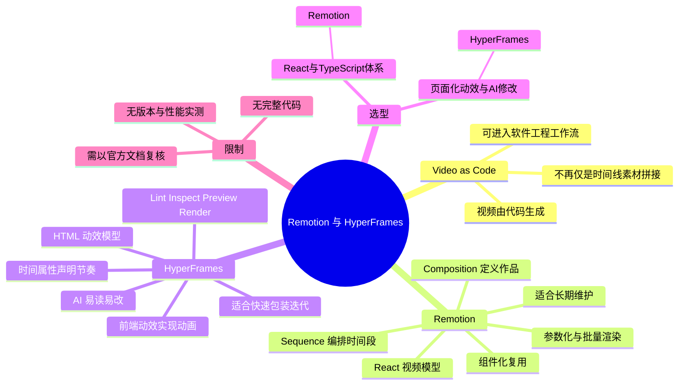
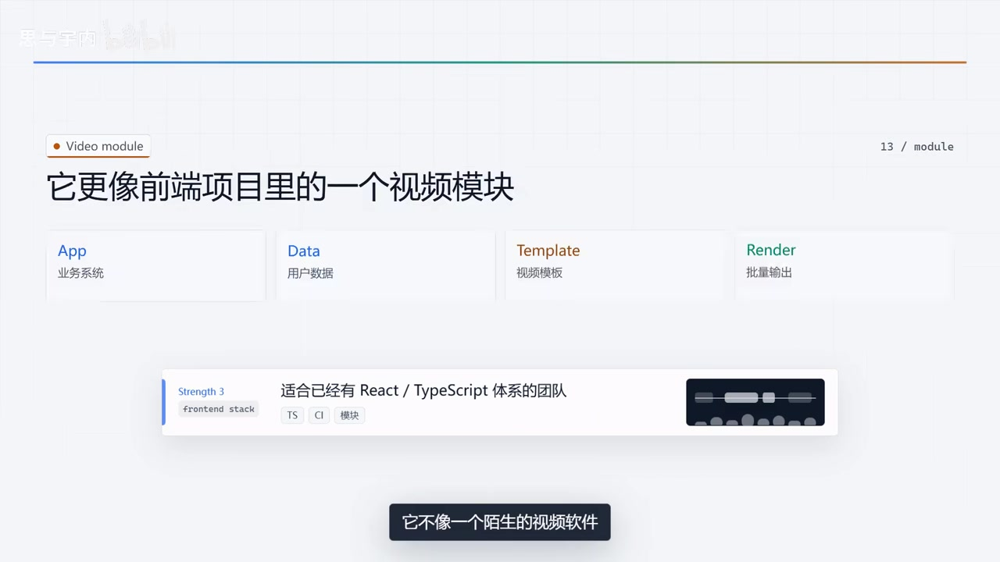

# 代码生成视频，到底该选 Remotion 还是 HyperFrames？

> 来源：[Bilibili 视频](https://www.bilibili.com/video/BV1aNj16sEkK)<br>
> UP 主：思与宇内 ｜时长：5 分 08 秒 ｜分辨率：1920 × 1080<br>
> 视频简介明确说明：**本视频使用 HyperFrames 制作**。

## 小结

视频围绕「Video as Code（用代码生成视频）」展开，比较了 Remotion 与 HyperFrames 两种不同的代码化视频生产思路。作者的核心判断不是二者谁绝对更强，而是：**Remotion 更接近 React 工程，HyperFrames 更接近 HTML 动效工程**；它们都能将代码渲染为视频，但组织方式、开发体验和适用场景不同。

Remotion 的视频结构由 React 组件构成。作者以 `Composition`、`Sequence` 和动画控制为例，说明标题、字幕、图表、人物卡片、产品展示等画面元素可以组件化；结合数据传入后，可把同一模板批量渲染为不同内容的视频。因此，它更适合已有 React / TypeScript 前端体系、需要长期维护模板、自动化生成或批量生成内容的团队。

HyperFrames 则将 HTML 视为视频的源文件：在页面元素上以时间相关属性声明出现时机、时长与轨道，并由前端动效能力完成动画，再将网页动效稿渲染为视频。作者强调其 HTML 结构直观，因此更便于 AI 阅读、修改、检查、预览与渲染，适用于短视频包装、字幕与口播动效、转场、音频响应动画，以及把网页或产品页包装为宣传视频。

选型可归纳为：若要把视频纳入工程化的 React 组件、数据和模板体系，优先考察 Remotion；若重点在快速迭代页面化动效、让 AI 直接修改视频结构与节奏，则 HyperFrames 更贴近作者描述的工作流。该结论是视频作者的经验性选型建议，并非性能、成本、生态或渲染质量的实测排名。

本视频没有给出两者的安装命令、版本号、渲染耗时、价格、浏览器兼容性、部署方案或完整代码示例。因此，实际采用前仍需按项目当时的官方文档与本地环境验证。工具能力和 API 可能随版本变化，本文仅整理截至素材抓取时间（2026-07-13）可获取的视频内容。

## 思维导图




## 目录

- [背景：从时间线剪辑到代码声明画面](#背景从时间线剪辑到代码声明画面)
- [Remotion：将视频组织成 React 工程](#remotion将视频组织成-react-工程)
  - [组件、时间段与动画](#组件时间段与动画)
  - [组件化、参数化与工程化场景](#组件化参数化与工程化场景)
- [HyperFrames：以 HTML 组织视频动效](#hyperframes以-html-组织视频动效)
  - [时间属性、动效与渲染流程](#时间属性动效与渲染流程)
  - [AI 友好与快速包装场景](#ai-友好与快速包装场景)
- [选型步骤与对照表](#选型步骤与对照表)
- [结论、限制与时效性](#结论限制与时效性)
- [字幕比对](#字幕比对)
- [评论分析](#评论分析)
- [处理记录](#处理记录)

## 背景：从时间线剪辑到代码声明画面 [00:00](https://www.bilibili.com/video/BV1aNj16sEkK?t=0)

视频开头以 Premiere、After Effects 等传统剪辑/动效软件作为对照，提出「Video as Code」的方向：视频不再仅被理解为时间线上的素材拼接，也可以像网页或应用一样由代码描述并生成。

作者所说的转变包括：

1. **传统方式**：以素材、剪辑时间线和人工编辑为中心。
2. **代码化方式**：将画面结构、元素、数据、出现时间和动画规则写入代码或结构化文件。
3. **结果**：同一视频模板可以更容易地由不同数据驱动，支持复用、批量输出和后续维护。


> 图：关键帧直接展示“从素材拼接，转向用代码声明画面”的主题，并列出“素材—网页—应用—视频”的概念链条。它是理解视频整体讨论范围的最佳背景图：作者并非只比较两个软件界面，而是在比较两种视频生产组织方式。

这里的“代码生成视频”不等于所有视频都必须由程序制作。视频表达的是另一条生产路径：当内容具有重复结构、数据来源、模板化需求或需要与软件系统连接时，视频可以成为工程产物。

## Remotion：将视频组织成 React 工程 [00:31](https://www.bilibili.com/video/BV1aNj16sEkK?t=31)

作者用一句话概括 Remotion：**“用 React 写视频。”** 对于熟悉 React 的开发者，视频可被理解为由组件构成，而不是一个传统意义上的剪辑工程。

### 组件、时间段与动画 [00:42](https://www.bilibili.com/video/BV1aNj16sEkK?t=42)

在作者的描述中，Remotion 的组织要点包括：

- **Composition**：定义一个视频作品；
- **Sequence**：将不同画面安排到不同时间段；
- **React 组件**：构成标题、图表、卡片、场景等画面；
- **动画控制**：通过 React 方式描述随时间变化的视觉状态。

作者举出的动画类例子包括：

- 标题从左侧滑入；
- 数字从 0 增长到 100；
- 图表随时间逐步展开。


> 图：画面写明“在 Remotion 里，视频不是剪辑工程，而是一组 React 组件”，并以 Title、Chart、Card、Scene 展示可拆分的画面类型；底部进一步标出 Composition 与 Sequence。它将视频口述中的抽象结构落到了清晰的组件层级上。

需要注意的是，素材并未提供可直接运行的 Remotion 代码，也没有给出动画 API 的准确调用形式。视频的重点是解释其工程建模思路，而不是演示开发环境配置。

### 组件化、参数化与工程化场景 [01:05](https://www.bilibili.com/video/BV1aNj16sEkK?t=65)

作者总结 Remotion 的三项强项：

| 强项 | 视频中的含义 | 带来的生产价值 |
| --- | --- | --- |
| 组件化 | 标题、字幕、图表、人物卡片、产品展示都可封装为组件 | 相同视觉单元可复用 |
| 参数化 | 向模板传入用户名、头像、数据、图片等内容 | 不同数据可驱动不同成片 |
| 工程化适配 | 对 React / TypeScript 团队较自然 | 视频可作为前端项目中的一个模块维护 |


> 图：画面用 `TitleBlock`、`ChartPanel`、`ProductCard` 展示标题、图表、产品等可复用单元，并明确写出“下一次只换数据，不重剪”。它对应作者对“组件化复用”的核心解释。

作者以“为 100 个用户生成 100 条不同视频”为参数化案例：只要将用户名、头像、数据、图片等输入替换，即可使用同一逻辑批量渲染。这里的“100”是作者用于说明批量生成机制的例子，不是性能上限或官方规格。



> 图：画面把 App、Data、Template、Render 串联为业务系统、用户数据、视频模板与批量输出，并指出适合已有 React / TypeScript 体系的团队。该图有助于区分“单次做一条片子”与“把视频接入业务流程”两类需求。

根据视频，Remotion 更适合以下场景：

- SaaS 产品生成用户报告类视频；
- 电商批量生成商品短视频；
- 数据驱动、可配置的视频；
- 企业内部自动化内容；
- 需要长期维护的视频模板系统。

作者最终将其归纳为：如果希望“把视频当成一个 React 应用来维护”，Remotion 是合适的方向。

## HyperFrames：以 HTML 组织视频动效 [02:04](https://www.bilibili.com/video/BV1aNj16sEkK?t=124)

与 Remotion 的 React 组件模型相对，作者将 HyperFrames 概括为：**“用 HTML 写视频。”** 其核心主张是将 HTML 作为视频的源文件，以网页结构描述画面并渲染为视频。

### 时间属性、动效与渲染流程 [02:16](https://www.bilibili.com/video/BV1aNj16sEkK?t=136)

作者说明的 HyperFrames 工作方式可整理为以下流程：

1. **直接编写 HTML 页面**：而非先建立 React 组件。
2. **在元素上声明时间信息**：ASR 中可辨识到 `DataStart`、`DataDuration`、`DataTrack`、`Index` 等属性名；作者用它们说明元素何时出现、持续多久、位于哪条轨道。
3. **使用前端动效能力制作动画**：视频提及 CSS 和前端动效工具，但 ASR 对个别工具名称识别不可靠，无法据此确认具体工具清单。
4. **统一流程处理 HTML、CSS、动画、音频、视频**：形成可预览、可检查、可渲染的视频工作流。
5. **渲染输出**：将网页动效稿输出为视频。

可将作者介绍的结构抽象为：

```text
HTML 画面结构
  + 时间属性（出现时间、持续时间、轨道）
  + CSS / 前端动效
  + 音频与视频素材
  → 预览与检查
  → 渲染为视频
```

视频明确提到 HyperFrames 可执行或支持的工作环节包括：

- **Lint**：检查；
- **Inspect**：检查画面；
- **Preview**：预览；
- **Render**：输出视频。

这些名称来自视频口述与 ASR 的可辨识部分。素材没有展示其命令行参数、配置文件格式或检查规则，不能据此推断其具体实现细节。

### AI 友好与快速包装场景 [03:02](https://www.bilibili.com/video/BV1aNj16sEkK?t=182)

作者认为 HyperFrames 的突出特点是 **对 AI 友好**。其给出的理由是 HTML 的结构直观：

- 标题可以对应一个 `div` 等页面元素；
- 字幕可以由元素和样式表达；
- 元素的起止时间能够直接写在结构附近；
- AI 较容易读取结构，也较容易按要求改动结构或样式。

视频列举了若干自然语言修改需求：

- 将第一幕延长 2 秒；
- 为第二幕添加转场；
- 将字幕调大；
- 让标题从下方弹入。

作者的观点是：这些要求放在 HTML 与前端动效结构中，AI 修改会比较顺畅。这里应理解为作者对结构化可编辑性的判断，并不代表 AI 必然能无误生成视觉效果；实际输出仍可能受布局、字体、素材、动效逻辑及渲染环境影响。

视频给出的 HyperFrames 适用场景包括：

- 快速生成短视频包装；
- AI 自动写完视频脚本后的成片包装；
- 字幕、口播动效、标题与转场；
- 音频响应类动画；
- 将网站或产品页包装成宣传视频。

作者还说明本片本身更像一个 HTML 动效工程：标题、字幕、转场和节奏均可用 HTML、时间属性和前端动效能力描述，再渲染为视频；视频简介也明确标注本片使用 HyperFrames 制作。

## 选型步骤与对照表 [04:03](https://www.bilibili.com/video/BV1aNj16sEkK?t=243)

视频的选型建议可转写为一个面向项目条件的判断流程，而非简单二选一：

1. **先判断团队的主要技术基础**  
   已有 React / TypeScript 工程体系，并希望视频与应用、数据、模板、CI 或业务模块协同维护时，Remotion 的模型更自然。

2. **再判断内容是否需要大规模参数化**  
   若同一结构需要用不同用户、商品或报告数据批量生成，Remotion 的组件与参数化路径符合作者所强调的优势。

3. **判断创作是否以网页动效与快速内容迭代为中心**  
   如果更关注字幕、标题、转场、口播包装和网页式画面结构，HyperFrames 的 HTML 工作方式更贴合。

4. **判断是否需要 AI 直接修改画面结构与时序**  
   当工作流希望让 AI 根据自然语言调整段落时长、字幕大小、标题入场或转场时，作者倾向 HyperFrames，因为结构与时间属性集中在 HTML 及其相邻描述中。

5. **最后以真实样片验证**  
   视频没有提供性能、成本、输出质量或生态完整度的对比数据。任何生产选型都应以目标分辨率、批次规模、素材类型、审校成本、部署环境和团队能力进行实际验证。

| 对比维度 | Remotion（作者描述） | HyperFrames（作者描述） |
| --- | --- | --- |
| 核心比喻 | 用 React 写视频 | 用 HTML 写视频 |
| 基本组织单元 | React 组件、Composition、Sequence | HTML 元素与时间属性 |
| 核心优势 | 组件化、参数化、工程化 | HTML 结构直观、AI 易读易改、快速包装 |
| 视频维护方式 | 像维护 React 应用 | 像维护网页动效工程 |
| 更匹配的团队 | 已有 React / TypeScript 体系的团队 | 关注 HTML 动效、内容迭代与 AI 修改的团队 |
| 典型场景 | 报告、数据视频、批量商品视频、长期模板 | 短视频包装、字幕口播、转场、产品页宣传 |
| 视频未覆盖的比较项 | 性能、价格、版本、部署、输出质量 | 性能、价格、版本、部署、输出质量 |

## 结论、限制与时效性 [04:36](https://www.bilibili.com/video/BV1aNj16sEkK?t=276)

作者在结尾将两者的关键词压缩为：

- **Remotion**：React 组件、组件化、参数化；
- **HyperFrames**：HTML、时间属性、前端动效、AI 友好。

视频更大的结论是：传统剪辑软件偏向手工在时间线上处理素材；Remotion 与 HyperFrames 所代表的方向，则让视频能够像软件一样被批量生成，也可以像网页一样由 AI 修改。未来的视频生产可能由剪辑师、开发者、设计师和 AI 协作完成。

但这份内容应在以下边界内使用：

- **不是基准测试**：没有 FPS、编码速度、并发渲染、硬件占用或成片体积数据。
- **不是功能穷尽清单**：没有展示插件生态、第三方服务、授权模式、模板市场或跨平台兼容性。
- **不是上手教程**：没有安装步骤、版本号、命令、完整项目结构或代码片段。
- **专有名词存在 ASR 误识别**：尤其 HyperFrames 所述部分的部分动效工具名称不宜据 ASR 直接引用。
- **信息具有时效性**：视频发布及素材抓取后，两个工具的版本、API、定价、部署能力和 AI 相关功能都可能变化，落地前应复核当时官方资料。

## 字幕比对 [00:00](https://www.bilibili.com/video/BV1aNj16sEkK?t=0)

本次任务已执行 ASR；但未提供可用的 Bilibili 站内字幕，无法进行逐句对照或时间轴校验。

| 字幕来源 | 完整性 | 专有名词 | 时间轴 | 主要问题 |
| --- | --- | --- | --- | --- |
| Bilibili 站内字幕 | 无可用内容 | 无法评估 | 无法评估 | 素材明确标注“未提供可用站内字幕” |
| 本次 ASR 字幕 | 覆盖了开场、Remotion、HyperFrames、选型与结尾主线 | 部分可由上下文校正，部分动效工具名失真 | 未提供逐句时间戳 | 中英混读、繁简混杂、术语误识别、末句截断 |

### 最终字幕采用策略

正文以**本次 ASR 的语义主线**为基础，并用视频标题、简介和提供的关键帧进行有限校正；没有站内字幕可供优先采用或合并。

已依据上下文和关键帧校正、规范化的重点术语包括：

| ASR 中的形式 | 正文采用形式 | 校正依据 |
| --- | --- | --- |
| `R emotion`、`RM Motion` | Remotion | 视频标题、简介及关键帧中的 “Remotion” |
| `hyper frames`、`Hyperframe` | HyperFrames | 视频标题、简介及任务元数据 |
| `Videos Code` | Video as Code | 视频上下文与该概念的常见英文写法；正文仅用于概念归纳 |
| `REACT` | React | 关键帧中的 “React 组件” 与视频语境 |
| `ATML` | HTML | ASR 发音误识别；与 HyperFrames 的 HTML 叙述一致 |
| `Composition`、`Sequence` | 保留英文 | 关键帧清晰可见，且与 ASR 语义一致 |

对于 ASR 中类似“G-Sub C-SS、Mati-C、GAS”的动效工具串，素材不足以可靠确定全部原词；正文仅保留“CSS / 前端动效工具”的视频原意，不将不确定转写当作事实。

## 评论分析 [00:00](https://www.bilibili.com/video/BV1aNj16sEkK?t=0)

仅处理本次可获取热评前三条。视频元数据显示共有 11 条回复；以下三条并不代表全部观众意见。

1. **ovo_源来如此（3 赞）：“发现宝藏up！”**  
   - 观点：对 UP 主内容表达正向认可。  
   - 补充信息：未补充 Remotion、HyperFrames 或 Video as Code 的技术信息。  
   - 可信度与边界：这是主观评价，不能作为工具能力或视频结论的证据。

2. **特拉法加尔李（0 赞）：“请问这个ai音频角色有没有名字？叫什么？想找她的音源”**  
   - 观点：关注视频中使用的 AI 音频角色/音源。  
   - 补充信息：提出了视频制作要素方面的追问，但没有给出角色名称、音源平台或授权信息。  
   - 可信度与边界：问题本身不能证明该声音具体来自何处；素材中也没有可验证的回复，因此无法确认。

3. **憨豆老湿（0 赞）：“老师你这个视频是用什么做的？”**  
   - 观点：观众关注成片所用制作工具。  
   - 补充信息：该问题可由视频简介部分回应——简介明确写明“本视频使用 HyperFrames 制作”。  
   - 可信度与边界：这是依据视频发布者简介得到的信息；但评论本身没有提供额外技术细节，也无法据此推断完整制作链路、素材来源或渲染配置。

## 处理记录 [00:00](https://www.bilibili.com/video/BV1aNj16sEkK?t=0)

- **Worker ID**：worker-mrj0www4-e8d79408
- **模型**：gpt-5.6-terra
- **调用工具与素材来源**：任务提供的 Bilibili 元数据、视频素材清单、ASR 字幕、关键帧清单、热评 JSON；未使用未提供的外部资料补写工具事实。
- **使用的应用工具**：素材采集流程已产出 `merged.mp4`、`audio/audio.wav`、`frames/`、`comments/comments.json`、`asr/` 等目录；本整理仅依据任务提供的产物信息进行结构化归纳。
- **字幕选择**：站内字幕不可用；本次 ASR 已执行并作为正文的主要转写来源。对 Remotion、HyperFrames、React、HTML、Composition、Sequence 等可由标题、简介和关键帧确认的术语进行了规范化；未确认的动效工具名称不作强行补全。
- **关键帧选择依据**：选用 `frame-001.jpg` 至 `frame-004.jpg`，因为其画面文字分别对应“代码化视频转变”“Remotion 组件模型”“组件复用”“前端项目视频模块”四个正文核心节点。其余关键帧虽在清单中，但未在给定素材中附带可核验画面内容，故未臆测引用。
- **关键帧图片价值**：所选图片均含可直接辨识的标题、结构关系或组件示例，能交叉校正 ASR 专有名词，并帮助读者理解作者对两类工具的建模方式。
- **评论处理范围**：严格限于可获取热评前三条；未将评论中的提问或主观赞誉视作已验证事实。
- **缓存清理**：未执行本地缓存删除操作；任务只提供产物路径与内容摘要，未提供可操作的运行环境或清理回执。
- **未解决问题**：未获得站内字幕、逐句 ASR 时间戳、完整视频逐帧画面、HyperFrames 时间属性的官方语法说明、动效工具完整名称、版本号、性能数据与评论区回复链。因此本文未对这些信息作推断。

## 评论分析

本次流程未获取到可用热评，因此不推断观众态度或额外结论。
