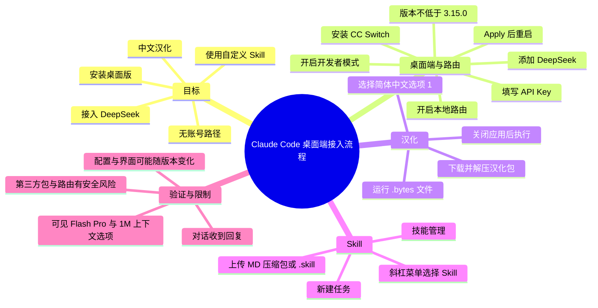
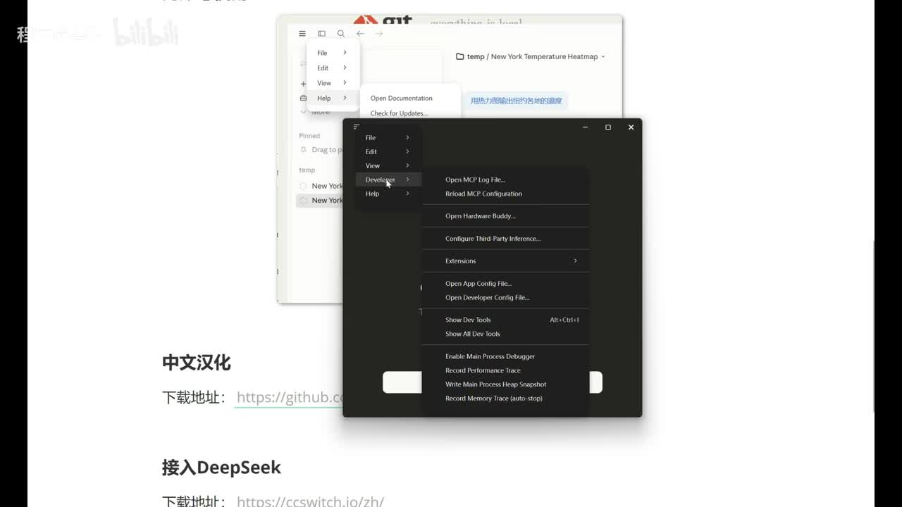

# 【6.1最新教程】ClaudeCode 桌面版保姆级教学｜汉化 + 免登 + DeepSeek + 自定义 Skill.小白新手一遍学会！

> 来源：[Bilibili 视频](https://www.bilibili.com/video/BV16YVB6GE7D)  
> UP 主：程序员黑梦  
> 元数据总时长：148 分 10 秒（11 个分 P）；本次可用 ASR 音频覆盖第 1 P「claudecode免登版」，时长约 11 分 53 秒。  
> 说明：以下正文严格依据本次可用的 ASR、视频元数据与 1 张关键帧整理；其余分 P 仅能依据其公开分 P 标题列出，未获得对应音频或画面材料，不对其内容作推断性复述。

## 小结

本视频可用素材聚焦于 Claude Code 桌面端的一条完整上手链路：安装桌面应用、开启开发者模式、安装并配置 CC Switch、将第三方模型以 DeepSeek 为例接入、执行中文汉化，以及在桌面端上传和调用自定义 Skill。作者将需求背景归因为 Claude 模型使用成本较高，因此演示通过第三方路由接入国产模型的方案。

关键方法是：先在 Claude Code 中开启开发者模式，再以 **CC Switch 3.15.0** 为例开启“本地路由”，添加 DeepSeek 模型并填写 API Key；随后回到 Claude Code 的开发者菜单中执行“配置三方”，由应用自动带入配置，点击 `Apply` 后重启验证。作者的验证标准是：可选择模型、发送“你是谁”等对话并收到响应。

视频所称“无账号使用”并不是展示绕过某一登录页面的技术细节，而是通过开启开发者模式、配置第三方推理服务来使用桌面端。素材没有提供 Claude Code、CC Switch、汉化包或 DeepSeek 的官方下载链接、版本校验值、账户政策与服务条款，因此不能据此确认其长期可用性、合规性或安全性。

汉化部分使用一个下载得到的压缩包，解压后运行其中的 `.bytes` 文件，并在交互菜单中选择“1：安装简体中文”。这是对应用文件进行第三方修改的操作：作者展示其成功效果，但没有展示文件来源、签名、哈希值、回滚前备份或安全审查流程，实际使用前应自行核验来源并准备恢复方案。

自定义 Skill 的上传入口是：新建任务 → 加号 → 技能 → 管理技能 → 添加技能 → 上传技能。素材明确提到支持的文件形式为 **Markdown 文件、压缩包或 `.skill` 文件**。作者用名为 `IvanCreative` 的创意 Skill 测试，以“周末啤酒免费”的创意为提示，要求仅输出文本，借此确认 Skill 能够被选中并影响生成过程。

适合读者：希望在 Windows 桌面环境中尝试 Claude Code 桌面端、第三方模型路由、界面汉化和 Skill 导入的初学者。前置条件包括：能安装桌面软件、拥有可用的第三方模型 API Key，并能承担 API 调用费用和第三方软件供应链风险。

## 思维导图

## 目录

- [素材范围、背景与时效性](#素材范围背景与时效性)
- [安装 Claude Code 桌面版](#安装-claude-code-桌面版)
- [开启开发者模式与安装 CC Switch](#开启开发者模式与安装-cc-switch)
- [配置 DeepSeek 第三方模型](#配置-deepseek-第三方模型)
- [配置验证与模型选择](#配置验证与模型选择)
- [中文汉化操作](#中文汉化操作)
- [上传并调用自定义 Skill](#上传并调用自定义-skill)
- [可迁移经验、风险与限制](#可迁移经验风险与限制)
- [其余分 P 的可验证目录信息](#其余分-p-的可验证目录信息)
- [字幕比对](#字幕比对)
- [评论分析](#评论分析)
- [处理记录](#处理记录)

## 素材范围、背景与时效性

### 需求与本节目标 [00:00:10](https://www.bilibili.com/video/BV16YVB6GE7D?t=10)

作者称有用户反馈希望获得 Claude Code 桌面版教程，并希望接入国产模型；其给出的原因是 Claude 模型成本“太贵”。本节明确列出五项目标：

1. 安装 Claude Code 桌面版；
2. 无账号使用；
3. 中文化；
4. 接入 DeepSeek 模型；
5. 使用自己的 Skill。

这里的产品名在 ASR 中多次被识别为“Cloud Code”“可靠扣”等，结合标题、画面文字和上下文，正文统一校正为 **Claude Code**；模型名统一校正为 **DeepSeek**。

### 时效性与材料边界 [00:00:35](https://www.bilibili.com/video/BV16YVB6GE7D?t=35)

视频标题带有“6.1最新教程”表述，元数据发布时间为 2026-06-02。此类桌面应用、路由工具、第三方配置入口、模型规格和汉化补丁均可能随着版本更新而变化，尤其是以下信息不应当作长期固定事实：

- CC Switch 对 Claude Code 桌面版的支持状态；
- “开发者 → 配置三方”菜单的位置与可用性；
- DeepSeek 可选模型名称及上下文配置；
- 汉化包适配的 Claude Code 版本；
- Skill 上传文件格式与入口；
- “无账号使用”对应的具体使用条件。

本次 ASR 仅覆盖首个分 P（0:00–11:52），诊断显示有声段覆盖率为 **95.53%**，没有大段异常空缺；但完整视频元数据包含 11 个分 P。因此，下文对操作流程的“完整”仅指第 1 P 内的完整链路。

## 安装 Claude Code 桌面版

### 从官方页面下载匹配系统的桌面版 [00:00:35](https://www.bilibili.com/video/BV16YVB6GE7D?t=35)

作者展示了 Claude Code 官方页面的获取入口：将鼠标放到“获取 Claude Code”一类入口上，可看到多种使用形式，其中排名第一的 **Desktop** 被作者解释为桌面版。点击后进入下载页，网站会按操作系统匹配下载版本；作者演示环境为 Windows。

操作顺序如下：

1. 进入作者提供或官方的 Claude Code 页面；
2. 选择 Desktop 入口；
3. 在下载页获取与当前系统匹配的安装包；
4. 运行下载好的可执行文件；
5. 等待安装完成。

作者将安装过程描述为“傻瓜式安装”，但未展示安装文件名、具体版本号、安装目录、权限请求或校验信息。因此，安装前仍应确认下载域名、安装包签名和文件哈希。

### 安装完成后的登录界面 [00:01:31](https://www.bilibili.com/video/BV16YVB6GE7D?t=91)

安装成功后，作者看到登录界面，其中包括使用 Google 账号登录等方式。视频不采用这些登录方式，而是转向“无账号使用”的第三方配置路径。

需要注意：素材没有说明这一做法是否完全不需要任何服务账户，也没有证明其是否符合 Claude Code、模型提供商或所在组织的使用规则。可确认的仅是作者后续以开发者模式和第三方推理配置进行了演示。

## 开启开发者模式与安装 CC Switch

### 开启 Claude Code 开发者模式 [00:01:55](https://www.bilibili.com/video/BV16YVB6GE7D?t=115)

作者给出的菜单路径为：

1. 点击窗口左上角“三横杠”；
2. 进入“帮助（Help）”；
3. 找到“开启开发者模式（Enable Developer Mode）”；
4. 选择开启；
5. 等待 Claude Code 重启。

作者表示，重启完成后先不处理主界面，继续安装 CC Switch。

> 图：唯一可用关键帧展示了 Claude Code 的菜单层级，开发者菜单中可见 `Configure Third-Party Inference...`（配置第三方推理）等选项。它为“开启开发者模式后会出现第三方配置入口”的 ASR 描述提供了画面佐证，也帮助区分后续不是在普通设置页、而是在开发者菜单中完成接入。

### 获取并安装 CC Switch [00:02:29](https://www.bilibili.com/video/BV16YVB6GE7D?t=149)

作者接着安装 **CC Switch**，并将其概括为用于统一管理 AI 工具工作流、帮助切换不同模型的软件。下载方式包括：

- 点击作者展示的地址，进入 GitHub 下载页面；
- 或从作者的资源包获取。

作者特别强调其演示版本为 **CC Switch 3.15.0**，并称版本不能低于该版本；理由是旧版没有 Claude Code 桌面版配置。视频没有给出 3.15.0 的完整构建号、发布页链接或版本兼容表，因此该“最低版本”仅是作者在录制时的经验条件。

安装完成后点击 `Finish`。作者观察到 CC Switch 顶部原本仅有命令行使用方式，安装后增加了桌面版选项，并以“小电脑”图标表示支持 Claude Code 桌面版。

## 配置 DeepSeek 第三方模型

### 启用本地路由并选择桌面版 [00:03:41](https://www.bilibili.com/video/BV16YVB6GE7D?t=221)

在 CC Switch 中，作者给出的配置路径为：

1. 点击左侧“设置”；
2. 进入“路由”；
3. 找到“本地路由”；
4. 点击下拉箭头将本地路由开启；
5. 返回后选择 Claude Code 的“桌面版”。

“本地路由”的具体监听地址、端口、代理协议、流量走向以及是否会影响其他应用，素材均未展示。对企业网络、受管设备或包含敏感代码的项目而言，应在使用前审查该工具的网络访问、日志与本地存储行为。

### 添加 DeepSeek 并填写 API Key [00:04:05](https://www.bilibili.com/video/BV16YVB6GE7D?t=245)

选择桌面版后，作者在右侧点击“添加”，选择希望加载的模型；示例选择 **DeepSeek**。作者表示其他部分大多可不调整，但必须填写 API Key。

其操作逻辑是：

1. 在 CC Switch 的桌面版模型配置中添加 DeepSeek；
2. 打开 DeepSeek 的 API 文档；
3. 进入 Key 管理；
4. 新建一个用于 Claude Code Desktop 的 Key；
5. 复制 Key；
6. 回到 CC Switch 的配置页粘贴该 Key。

API Key 是高敏感凭据。视频没有展示遮蔽、环境变量、密钥库、额度控制或轮换策略。建议至少做到：

- 不在录屏、截图、聊天记录、代码仓库和 Skill 文件中明文保存 Key；
- 为该用途创建独立 Key，设置合理的用量限额；
- 一旦泄露立即在提供商控制台撤销并重建；
- 明确 API 费用由模型提供商计费，所谓“接入国产模型”不等于免费使用。

### 上下文选项、添加与启用 [00:04:41](https://www.bilibili.com/video/BV16YVB6GE7D?t=281)

作者提到配置页下方有两个可勾选选项，可配置也可不配置；它们与 Claude Code 的上下文大小有关。其表达是勾选后可使用“**1M**”大小的上下文，并建议勾选。除该描述外，素材没有给出两个选项的准确标签、模型能力边界、计费变化或实际可用上下文长度。

作者的后续步骤为：

1. 勾选所需的上下文相关选项；
2. 点击“添加”；
3. **必须启用**该配置，否则配置不会生效；
4. 启用后，可关闭或最小化 CC Switch；作者称直接点击关闭表现为最小化，仍保持运行。

“关闭即最小化”属于作者录制环境中的表现，不能外推为所有系统、版本或托盘设置下的固定行为。若路由工具没有保持运行，Claude Code 的第三方模型请求可能无法正常转发。

### 在 Claude Code 中应用第三方配置 [00:05:29](https://www.bilibili.com/video/BV16YVB6GE7D?t=329)

完成 CC Switch 配置后，作者返回 Claude Code，操作为：

1. 点击左上角“三横杠”；
2. 打开“开发者”；
3. 选择“配置三方”；
4. 确认信息已被自动填入；
5. 点击 `Apply`；
6. 重启 Claude Code。

作者解释，先前没有直接进入“配置三方”，是因为在尚未配置 CC Switch 前该入口不可用或无法完成配置；配置 CC Switch 后，Claude Code 会自动填入相关信息。该自动填写是视频录制环境的现象，若实际界面为空、报错或字段不同，应以当前工具文档与错误信息为准，而不应凭空填写未在素材中出现的地址、端口或协议参数。

## 配置验证与模型选择

### 以正常对话响应作为验证 [00:06:14](https://www.bilibili.com/video/BV16YVB6GE7D?t=374)

重启后，作者称已进入 Claude Code 对话界面，并在模型选项中看到：

- Flash；
- Pro；
- 带有 1M 上下文的版本。

作者选择 Flash 进行测试，输入“你是谁”，随后收到回复，因此将其判定为配置成功。这里的“回复成功”只能证明该次对话链路可用，不能充分验证：

- 实际调用的模型身份；
- 请求是否稳定经由预期路由；
- 1M 上下文是否真的生效；
- 费用、速率限制和长期稳定性；
- 工具调用、代码读写等 Claude Code 能力是否与原生模型体验一致。

如需更可靠地验证，应该检查 CC Switch 或提供商侧日志、请求模型标识、账单记录与实际上下文测试结果；但这些验证手段并未在视频中展示。

## 中文汉化操作

### 下载、解压并选择汉化脚本选项 [00:07:02](https://www.bilibili.com/video/BV16YVB6GE7D?t=422)

作者展示了一个汉化下载地址，并说明下载内容同时包含 Mac 与 Windows 版本。其演示选择 Windows 对应的中文汉化压缩包，具体步骤为：

1. 下载汉化压缩包；
2. 解压；
3. 找到其中的 `.bytes` 文件；
4. 双击运行；
5. 在菜单中选择所需语言版本。

作者口述该工具提供五项选择：

| 选项 | 视频中说明的含义 |
| --- | --- |
| `1` | 安装简体中文 |
| `2` | 安装繁体中文 |
| `3` | 安装繁体中文（中国香港版本） |
| `4` | 恢复原样／卸载补丁 |
| `5` | 退出 |

演示选择 `1` 并回车安装简体中文。素材未提供汉化包名称、作者、开源仓库、文件校验值或支持版本范围；而 `.bytes` 可执行/脚本类文件可能修改应用资源或运行逻辑，使用者应将其视为第三方供应链输入，而非官方内置语言包。

### 执行汉化与结果确认 [00:07:50](https://www.bilibili.com/video/BV16YVB6GE7D?t=470)

作者说明汉化操作要求关闭 Claude Code。演示中工具会自动关闭应用，但作者建议用户也可先手动关闭，再等待汉化完成。

完成提示出现后，工具会自动重启 Claude Code。重新打开应用，作者观察到“新建任务”“项目计划”“任务”“自定义”等界面已变为中文，且此前对话历史仍可找到，据此认定汉化成功。

实践注意事项：

- 在运行汉化工具前关闭 Claude Code，避免文件占用或资源写入冲突；
- 修改前备份配置、项目数据和原始应用文件；
- 保留视频所称“恢复原样/卸载补丁”路径，以便升级失败或异常时回滚；
- 应用升级后汉化可能失效，或新旧资源不兼容；
- 不要将汉化成功视作第三方模型配置、账户状态或数据安全均已得到验证。

## 上传并调用自定义 Skill

### 桌面版 Skill 的安装方式 [00:08:48](https://www.bilibili.com/video/BV16YVB6GE7D?t=528)

作者指出，桌面版使用自定义 Skill 的方式与其口述的旧有 CLI 形式不同：旧形式可在 Claude 下的 `Skills` 目录放置 Skill；桌面版则需要以压缩包等文件形式安装。视频不展开介绍 Agent Skills 的结构与编写方法，而是引用作者此前课程。

从素材可确认的关键差异是：**桌面端存在 UI 上传路径，且作者实际通过压缩包导入 Skill。** 至于目录位置、Skill 清单格式、权限模型、是否支持自动加载等，均未在本视频中给出。

### 上传 Skill 的界面路径与文件格式 [00:09:36](https://www.bilibili.com/video/BV16YVB6GE7D?t=576)

作者建议先新建任务，随后进入 Skill 管理：

1. 新建一个任务；
2. 点击输入区附近的“加号”；
3. 选择“技能”；
4. 进入“管理技能”；
5. 点击“添加技能”；
6. 选择“上传技能”。

作者特别提醒：直接点击某个“添加技能”入口时，界面可能提示组织、插件等内容，未能按预期添加；其解决方式不是继续该入口，而是按“技能 → 管理技能”进入管理页后上传。

视频展示的上传格式包括：

- `.md` 文件；
- 压缩包；
- `.skill` 文件。

这说明至少在作者录制时的界面中，这三类格式被接受；不代表任意 Markdown、任意 ZIP 或任意 `.skill` 文件都能安全或成功运行。上传来自他人的 Skill 前应阅读内容，尤其检查其是否带有外部指令、敏感数据读取要求、命令执行建议或诱导越权行为。

### 使用 IvanCreative Skill 进行测试 [00:10:29](https://www.bilibili.com/video/BV16YVB6GE7D?t=629)

作者以此前写好的名为 **IvanCreative** 的创意 Skill 为例：

1. 将该 Skill 压缩为压缩包；
2. 回到上传界面，将压缩包拖拽进去；
3. 上传完成后，技能列表中出现 `IvanCreative`；
4. 回到任务界面，输入斜杠 `/`；
5. 从技能列表选择 `IvanCreative`；
6. 输入请求：生成“周末啤酒免费”的创意；
7. 回车让模型生成。

生成过程中，作者不希望其生成海报、易拉宝或其他图像类内容，而是补充要求“文本就可以”。作者称图像生成还需要额外配置，本视频不展开。因此，此案例验证的是 Skill 被选中后可用于文本创意生成，并非图像能力配置教程。

### 验证结论 [00:11:17](https://www.bilibili.com/video/BV16YVB6GE7D?t=677)

作者观察到最终内容“基本上是按照我们 Skills 来帮我们生成的”，据此确认自定义 Skill 能正常使用。第 1 P 至此完成了作者设定的五个目标：安装、无账号路径、汉化、接入 DeepSeek、使用自定义 Skill。

## 可迁移经验、风险与限制

### 经验：把链路拆成“应用、路由、模型、界面、能力”五层

视频的可迁移之处不是某一具体按钮，而是按层排障：

| 层级 | 视频中的对应组件 | 可验证动作 |
| --- | --- | --- |
| 应用层 | Claude Code 桌面版 | 完成安装并可启动 |
| 开发配置层 | 开发者模式、配置三方 | 出现并可使用第三方配置入口 |
| 路由层 | CC Switch、本地路由 | 添加模型并启用路由配置 |
| 模型层 | DeepSeek API Key、模型选项 | 发起对话并获得响应 |
| 扩展能力层 | 汉化包、自定义 Skill | 界面变中文、Skill 被选中并影响输出 |

当出现问题时，应先判断失败发生在哪一层。例如，Claude Code 能打开但无法对话，未必是汉化问题，可能是 CC Switch 未运行、路由未启用、API Key 无效或模型服务侧限制。

### 风险：第三方工具、补丁与 Skill 都是供应链输入

视频方案至少涉及三类非 Claude Code 原生界面的外部输入：

1. **CC Switch**：可能接触模型请求、API Key、项目上下文或日志；
2. **汉化包与 `.bytes` 文件**：可能修改本地应用资源或执行脚本；
3. **自定义 Skill 文件**：可能在提示层引入不透明指令，影响模型处理项目内容的方式。

因此，不应将“能跑通”直接等同于“安全”。在真实项目中，尤其是包含源代码、客户数据、密钥或内部文档的项目，应先核查数据是否会被发送至第三方 API、工具是否保存日志，以及组织是否允许这类模型和插件接入。

### 限制：视频未展示的关键事实

以下内容没有出现在可用材料中，不能补充为既定事实：

- Claude Code、CC Switch、DeepSeek 和汉化包的精确版本、下载链接、许可证；
- CC Switch 本地路由的端口、协议、请求改写规则；
- DeepSeek API 的价格、额度、速率限制与模型实际标识；
- 1M 上下文的具体含义、是否适用于所选 Flash 模型及其成本；
- “无账号使用”的平台政策或合法性结论；
- 汉化包的安全审计和兼容性；
- Skill 的内部文件结构、权限和执行边界；
- 后续 10 个分 P 的实际讲解内容与操作结果。

## 其余分 P 的可验证目录信息

本视频元数据共有 11 个分 P，总时长 8890 秒。除第 1 P 外，未提供可用 ASR、站内字幕或关键帧，因此仅记录元数据中可验证的标题与时长，不扩写具体内容：

| 分 P | 标题 | 时长 |
| --- | --- | ---: |
| P1 | claudecode免登版 | 11:54 |
| P2 | 安装Claude Code | 07:07 |
| P3 | Claude Code 配置 | 09:49 |
| P4 | Claude Code 三种模式 | 06:17 |
| P5 | 案例一：效率提升3-5倍的大型项目改造 | 27:09 |
| P6 | 案例二：会议中的高效编码 | 09:55 |
| P7 | 案例三：Playwright MCP增强Bug修复 | 26:18 |
| P8 | 案例四：快速理解和改造开源项目 | 08:59 |
| P9 | 案例五：多任务并行开发 | 11:31 |
| P10 | 11个技巧让Claude Code成功率翻倍 | 16:21 |
| P11 | 安全风险&代码审查新挑战&总结 | 12:50 |

> 注意：上述目录来自视频元数据；没有对应的分 P 音频文本时，不能仅凭标题推断其步骤、论据、参数或结论。

## 字幕比对

| 字幕来源 | 完整性 | 专有名词 | 时间轴 | 主要问题 |
| --- | --- | --- | --- | --- |
| Bilibili 站内字幕 | 未提供可用字幕 | 无法核验 | 无法使用 | 素材采集提示字幕工具因 URL 无效退出，未获得站内字幕 |
| 本次 ASR 字幕 | 覆盖第 1 P 约 681.58 秒语音，语音覆盖率 95.53% | 存在明显同音/音近误识别 | 有效 SRT 分段，范围 00:00:10,930–00:11:52,940 | 将 Claude 识别为 Cloud/可靠扣，将 DeepSeek 识别为 Deepseq/deep sick，将 Desktop 识别为 Datestop 等 |

最终采用：**本次 ASR 时间轴为正文时间定位依据，并通过标题、上下文和关键帧校正专有名词。**

重要校正如下：

| ASR 原文或近似写法 | 正文采用写法 | 校正依据 |
| --- | --- | --- |
| Cloud Code、可靠扣、clawcode | Claude Code | 视频标题、分 P 标题、关键帧中的 Claude Code 开发者菜单上下文 |
| Deepseq、deep sick | DeepSeek | 视频标题与作者反复说明“接入 DeepSeek” |
| Datestop | Desktop | 上下文为 Claude Code 的桌面版下载入口 |
| Cswitch、cc switch | CC Switch | 作者在同一流程中描述的软件名称 |
| API-K | API Key | 上下文为 DeepSeek Key 管理与粘贴密钥 |
| 一兆上下文 | 1M 上下文 | ASR 上下文与作者口述的模型选项描述 |
| 技巧 | 技能 / Skill | Skill 管理、上传和斜杠选择的界面语境 |

ASR 诊断未标记 `noAudioStream=true`；相反，音频识别语言为中文，置信度约 0.9995，且提供了可用时间戳。因此，本次不存在“源视频无音轨”情形。

## 评论分析

仅获取到 2 条热评，少于要求的前三条；以下不将评论当作已验证事实。

1. **Mrsurprem（6 赞）**：评论“Switch打开后，再打开claude怎么这样”。  
   - 观点：用户在开启 Switch 后重新打开 Claude 时遇到异常或与视频不一致的界面/行为。  
   - 补充价值：侧面提示该流程具有版本、系统环境或配置差异，尤其是 CC Switch 启动后应用表现可能不完全一致。  
   - 局限：评论未附截图、报错文本、系统版本、CC Switch 版本或后续解决方案，无法定位问题，也不能证明视频步骤无效。

2. **bili_40860465855（3 赞）**：评论“666”。  
   - 观点：表达对教程的认可或称赞。  
   - 补充价值：无具体技术信息。  
   - 局限：未提供可复现经验、问题反馈或事实依据。

3. **第 3 条热评**：未获取到。  
   - 因素材仅返回 2 条评论，不能虚构第三条评论或其观点。

## 处理记录

- Worker ID：`worker-mrj0www4-e8d79408`
- 模型：`gpt-5.6-terra`
- 可用素材与工具产物：视频元数据、`asr/transcript.srt`、`asr/asr-result.json`、热评数据、关键帧 `frames/frame-001.jpg`。
- 字幕检查与选择：
  - 已检查站内字幕：未提供可用站内字幕；采集记录显示字幕工具因 `Invalid URL` 未成功返回字幕。
  - 已检查本次 ASR：语言为中文，带有效时间戳；未标记 `noAudioStream=true`。
  - 最终采用本次 ASR 的 SRT 时间段作为所有正文时间轴依据，并对明显误识别的产品名进行上下文校正。
- 关键帧选择依据：
  - 可用关键帧仅 1 张，选用 `frames/frame-001.jpg`；
  - 画面展示 Claude Code 的 Developer 菜单及 `Configure Third-Party Inference...`，与 ASR 中“开发者 → 配置三方”的关键操作直接对应；
  - 未对该帧推断超出画面和 ASR 的配置字段、端口或协议。
- 时间轴依据：链接秒数直接由 ASR SRT 的真实分段起始时间换算，例如 00:05:29,250 对应 `t=329`。
- 缓存清理：未提供缓存清理执行记录；本整理未声称已删除原始音频、视频、ASR 或关键帧缓存。
- 未解决问题：
  - 仅第 1 P 有可用 ASR，无法复原其余 10 个分 P 的详细内容；
  - 未提供 CC Switch、汉化包与 DeepSeek 配置页面的可核验下载链接和版本详情；
  - 未获得评论区第 3 条热评；
  - 无法仅凭本素材确认该方案在当前版本中的可用性、费用、安全性与服务条款符合性。
