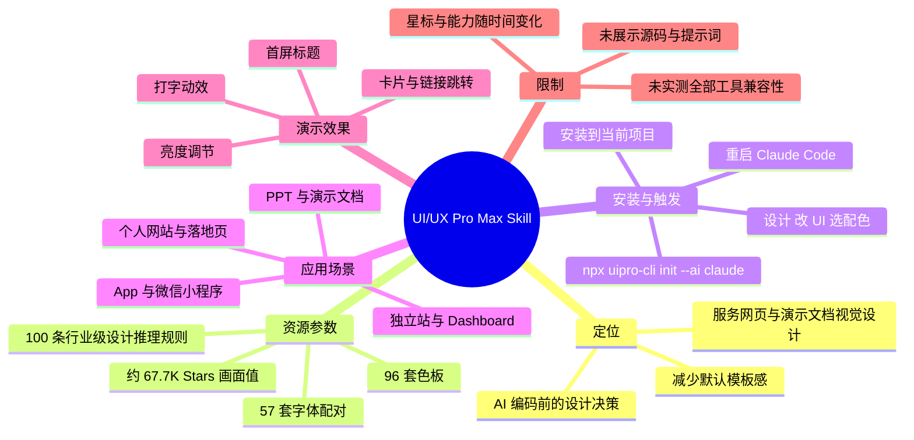
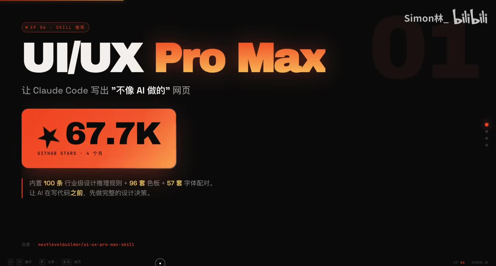
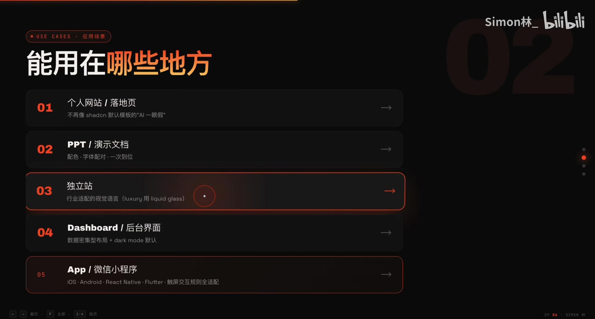

# Claude Code 装上这个 6.7 万星 skill，AI 写的 PPT 和网页终于不像模板了

> 来源：[Bilibili 视频](https://www.bilibili.com/video/BV1zgoPBHESd)  
> UP 主：Simon林_｜视频时长：03:14｜合集：AIcode  
> 数据抓取时的互动数据：播放 26,303、点赞 451、收藏 1,613、投币 155、分享 174、评论 42。

## 小结

视频介绍了 GitHub 仓库 **UI/UX Pro Max Skill**（画面中给出仓库名 `nextlevelbuilder/ui-ux-pro-max-skill`）在 Claude Code 等 AI 编码工具中的设计辅助用途。UP 主的核心观点是：先让 AI 根据行业、视觉风格、色板与字体作出设计决策，再进入代码生成，可减少网页或演示文稿常见的“默认模板感”。

视频与简介提供的核心参数包括：该 skill 内置 **100 条行业级设计推理规则、96 套色板、57 套字体配对**；展示画面写作 **67.7K GitHub Stars、4 个月**，口播和标题则称“6.7 万星”，两者可视为同一量级的近似表述，但具体星标数会随时间变化。

安装层面，简介给出命令 `npx uipro-cli init --ai claude`，称其安装到当前项目、大小约 **668KB**、可完全离线使用；安装后需要重启 Claude Code，并在提出“设计”“改 UI”“选配色”等需求时触发。视频口播明确提到 Claude Code、Codex、Gemini；简介进一步声称支持 18 家 AI 编码工具，但视频没有逐一实测这些兼容性。

演示部分并非逐行开发教程，而是成品效果展示：UP 主称其个人网站由该 skill 辅助 Claude Code 制作，呈现首屏文字、亮度变化、打字动效、视频卡片跳转、仓库卡片、联系方式等组件。简介补充称作品包含 WebGL 流体、3D 卡片倾斜和鼠标光斑追踪，且作者声称过程未手写 CSS；这一点属于作者经验陈述，视频未提供源码、提示词、性能数据或可复现实验过程。

适合希望用 AI 快速改善个人网站、落地页、PPT、独立站、Dashboard、App 或小程序视觉表达的开发者/创作者。需要注意：skill 能提供设计规则和参考组合，并不自动保证品牌一致性、可访问性、性能、跨端兼容性或最终业务转化；上线前仍应进行人工审稿、交互测试与设备测试。

## 思维导图




## 目录

- [背景、定位与关键参数](#背景定位与关键参数)
- [适用场景与设计规则](#适用场景与设计规则)
- [安装、触发与工具兼容性](#安装触发与工具兼容性)
- [个人网站成品演示](#个人网站成品演示)
- [作者其他项目展示](#作者其他项目展示)
- [可复用的实践步骤](#可复用的实践步骤)
- [限制、验证边界与时效性](#限制验证边界与时效性)
- [关键帧索引](#关键帧索引)
- [字幕比对](#字幕比对)
- [评论分析](#评论分析)
- [处理记录](#处理记录)

## [背景、定位与关键参数](https://www.bilibili.com/video/BV1zgoPBHESd?t=0)

### [从“直接写代码”改为“先做设计决策”](https://www.bilibili.com/video/BV1zgoPBHESd?t=0)

UP 主将 UI/UX Pro Max Skill 定义为一个“设计 skill”。其要解决的问题是：AI 直接生成网页时，成品容易呈现同质化、模板化的视觉风格。视频提出的工作顺序是：

1. 在 AI 写代码前先确定设计方案；
2. 让 AI 结合行业规则、色板和字体配对完成视觉方向选择；
3. 再开始生成网页、PPT 或界面代码。

这里的“设计决策”是视频的关键方法论，而非单纯提供 CSS 片段。根据视频口播，skill 内置的设计资源为：

| 项目 | 视频/画面提供的数值 | 作用（按视频表述整理） |
| --- | ---: | --- |
| 行业级设计推理规则 | 100 条 | 在动手写代码前辅助确定设计方向 |
| 色板 | 96 套 | 为界面或文档提供成套配色选择 |
| 字体配对 | 57 套 | 避免标题、正文等字体搭配失衡 |
| GitHub Stars | 画面为 67.7K；口播约 6.7 万 | 反映视频制作时的项目关注度，不等于功能质量保证 |
| 上线/增长时间 | 约 4 个月 | 视频中的时点信息，非永久固定值 |



> 图：开场画面集中呈现产品名、`67.7K` Stars、约 4 个月以及“100 条规则 + 96 套色板 + 57 套字体配对”。它是核对视频核心参数与项目定位的直接视觉依据。画面底部还显示仓库标识 `nextlevelbuilder/ui-ux-pro-max-skill`。

### [动态效果作为设计能力展示](https://www.bilibili.com/video/BV1zgoPBHESd?t=24)

UP 主称当前展示的动态效果由 Claude Code 在该 skill 的辅助下设计完成，并指出仓库名为 **UI-UX Pro Max Skill**。这里展示的是效果结论，而不是生成过程：视频没有给出具体 Prompt、项目目录、skill 文件内容、生成后的代码差异或可运行链接。

因此，更准确的理解是：该视频用成品视觉效果说明 skill 可能带来的设计表达提升，而非证明任何输入下都能稳定生成相同质量的作品。

## [适用场景与设计规则](https://www.bilibili.com/video/BV1zgoPBHESd?t=42)

### [视频列出的使用范围](https://www.bilibili.com/video/BV1zgoPBHESd?t=42)

视频口播与画面列出了以下可用方向：

| 场景 | 视频/画面信息 | 可关注的设计问题 |
| --- | --- | --- |
| 个人网站 / 落地页 | 口播提及个人网站；画面强调摆脱 shadcn 默认模板感 | 首屏层级、品牌调性、动效克制程度 |
| PPT / 演示文档 | 口播明确称可以使用 | 配色与字体配对的一致性 |
| 独立站 | 口播提到可连接 Shopify | 行业视觉语言、商品信息层级 |
| Dashboard / 后台界面 | 画面列出 | 数据密集布局与深色模式等策略 |
| App / 微信小程序 | 口播提到 App、小程序；画面列出 iOS、Android、React Native、Flutter | 触屏交互、组件尺寸、平台规范 |



> 图：该关键帧列出“个人网站/落地页、PPT/演示文档、独立站、Dashboard/后台界面、App/微信小程序”。其中画面还附带“数据密集型布局”“dark mode 默认”等提示，能补充口播中未展开的应用方向。

### [不要把场景覆盖等同于已验证适配](https://www.bilibili.com/video/BV1zgoPBHESd?t=42)

简介中进一步写到：独立站可用于 Etsy 详情页，移动端覆盖 SwiftUI / Compose，跨端覆盖 React Native / Flutter，小程序含“触屏热区 44px”等规则。这些属于素材中可获得的项目宣传信息，但视频本体没有对各端产物进行逐项演示或测试。

实践时应区分：

- **适用场景声明**：skill 声称能为这些类型任务提供设计规则或建议；
- **真实项目适配**：仍取决于所用框架、组件库、项目现有规范、目标平台和 AI 编码工具的执行质量；
- **上线质量**：需要额外检查键盘操作、文本对比度、移动端布局、图片/字体加载和动画性能。

## [安装、触发与工具兼容性](https://www.bilibili.com/video/BV1zgoPBHESd?t=67)

### [安装命令与已知参数](https://www.bilibili.com/video/BV1zgoPBHESd?t=67)

视频在这一段表示“通过这个命令”安装，并建议观众截图交给 Claude Code 执行；可复制的完整命令来自视频简介：

```bash
npx uipro-cli init --ai claude
```

简介中给出的安装信息如下：

| 参数/行为 | 素材中的表述 |
| --- | --- |
| 安装目标 | 当前项目 |
| 安装体积 | 668KB |
| 网络依赖 | 完全离线 |
| 推荐操作 | 安装完成后重启 Claude Code |
| 触发语义 | 提到“设计 / 改 UI / 选配色”时自动触发 |

视频口播还称，安装后重启 “CC”（即 Claude Code），再对它提出设置或修改 UI 的要求即可触发该 skill。由于视频未展示终端完整输出，未展示已有项目中安装前后的文件变化，也未展示卸载方法，实际执行前应查看命令执行结果与项目新增文件，避免覆盖已有配置。

### [工具支持范围：口播与简介的区别](https://www.bilibili.com/video/BV1zgoPBHESd?t=67)

视频口播明确说除 Claude Code 外，**Codex** 和 **Gemini** 也可以尝试使用。简介则扩展宣称支持 18 家 AI 编码工具，点名 Claude Code、Cursor、Codex、Gemini CLI、Windsurf、Kiro、Trae 等。

这两类信息的可信边界不同：

- 视频中实际演示的主要对象是 **Claude Code**；
- Codex、Gemini 在口播中仅被说可以尝试，未展示安装或生成结果；
- “18 家工具支持”是简介陈述，本视频没有逐一验证；
- 不同工具的 skill 发现机制、全局/项目级配置、命令格式和上下文读取方式可能不同，不能仅凭同一条 Claude 参数命令推断全部通用。

## [个人网站成品演示](https://www.bilibili.com/video/BV1zgoPBHESd?t=91)

### [首屏、亮度和打字动效](https://www.bilibili.com/video/BV1zgoPBHESd?t=91)

UP 主展示其个人网站，并称该网站通过此 skill 设计。视频中点出的可见效果包括：

- 开始时的 “Simon” 展示；
- 亮度调节；
- 页面中出现的打字效果；
- 后续可继续与 Claude Code 交互，以尝试更酷的画面。

作者的经验是，不应把 AI 的第一次输出视为终稿，而应继续通过多轮交互调整效果。这个经验可迁移到任何 AI 辅助设计任务：先确认行业、风格、配色、字体等方向，再通过具体反馈迭代布局、动效和信息层级。

但视频没有说明每次交互的要求如何书写，也没有比较迭代前后的代码，因此无法从素材中抽取可复用的精确提示词模板。

### [内容卡片与链接跳转](https://www.bilibili.com/video/BV1zgoPBHESd?t=115)

视频接着展示将 Claude Code 系列视频封面放入个人网站、并附上链接的做法；UP 主称点击后可以直接跳转。此处展示了网站不只是视觉首页，也承载作品聚合和外链导航功能。

这一部分的可复用信息是：当作品集网站包含视频、项目或社交链接时，应同时规划封面卡片、链接可点击性和跳转目标，而不是仅制作静态的炫技首屏。视频未展示链接地址、跳转是否新开页面、无障碍标签或移动端点击体验，相关实现仍需开发者自行验证。

## [作者其他项目展示](https://www.bilibili.com/video/BV1zgoPBHESd?t=122)

### [GitHub 仓库与 Agent Radar](https://www.bilibili.com/video/BV1zgoPBHESd?t=122)

UP 主称其 GitHub 目前公开了 4 个仓库，并介绍其中一个 **Agent Radar**：该项目被口播描述为“5000 个星星的”，可让 Agent 搜索 GitHub 上 Star 数超过 5000 的仓库；作者称为此制作了 MCP 接口，且可免费使用。

这部分是对作者网站内容的补充展示，与 UI/UX Pro Max Skill 的安装流程不是同一功能。以下表述应保留为作者介绍，而不应视为已独立验证的产品能力：

- Agent Radar 的 Star 阈值与搜索范围；
- MCP 接口可用性；
- 免费使用条件；
- GitHub 上公开仓库的当前数量和 Star 数。

### [其他卡片与联系方式动效](https://www.bilibili.com/video/BV1zgoPBHESd?t=146)

视频还依次展示：

- 之前视频中做过的 OpenCloud 相关 skill；
- 多 Agent 搭建；
- 同一台电脑接入多个“飞书机器”（ASR 对该专有名词存在不确定性，保留口播近似表述）；
- 一个咨询 Agent；
- 联系方式页面及抖音截图；
- 页面顶部跳动的小黄线等动效。

UP 主评价整体跳动效果没有问题，并在结尾将该 skill 推荐给网站、App、PPT 等不同领域的使用者。这里的展示侧重视觉演示，未包含性能指标、浏览器兼容性、移动端触控验证或源码说明。

## [可复用的实践步骤](https://www.bilibili.com/video/BV1zgoPBHESd?t=67)

以下流程依据视频与简介的已知信息整理；其中未出现的命令参数、配置路径和提示词不作补写。

1. **明确项目类型与目标**
   - 先界定任务属于个人网站、PPT、独立站、后台、App 或小程序；
   - 提前说明行业属性、目标用户、品牌色和希望避免的模板风格。

2. **在当前项目安装**
   - 使用简介提供的命令：
     ```bash
     npx uipro-cli init --ai claude
     ```
   - 素材称其目标为当前项目；执行后应自行检查新增的配置或 skill 文件。

3. **重启 Claude Code**
   - 视频明确提示安装完成后重启 Claude Code。
   - 这是视频所给的触发前置动作；没有证据表明无需重启也能稳定加载。

4. **用明确的设计任务触发**
   - 视频/简介给出的触发语义包括：“设计”“改 UI”“选配色”。
   - 可把任务拆成设计方向、页面结构、视觉组件和动效要求，避免只输入“做个好看的网站”这类过于宽泛的指令。

5. **先评审设计，再接受代码**
   - 核对 AI 给出的行业匹配、色板、字体组合、信息层级与页面风格；
   - 再让其实现代码。该顺序正是视频强调的“写代码之前先做设计决策”。

6. **多轮交互优化并做人工测试**
   - UP 主建议继续与 Claude Code 交互来获得更酷的画面；
   - 对最终结果额外检查文本可读性、颜色对比度、响应式布局、按钮可点性、动效性能、真实链接及品牌素材授权。

> 评论区有观众建议把 skill 设置为全局可用，并用 `/ui-max` 斜杠命令强制启用；这不是视频演示或官方材料中已验证的安装步骤，应视为评论者提供的待验证经验，而非本视频的必需流程。

## [限制、验证边界与时效性](https://www.bilibili.com/video/BV1zgoPBHESd?t=174)

### [视频没有覆盖的关键问题](https://www.bilibili.com/video/BV1zgoPBHESd?t=174)

本视频时长较短，重点是推荐与成品展示，未提供以下信息：

- skill 的具体规则文本、许可证、版本号或更新日志；
- 仓库安装后的目录结构、配置文件和卸载方式；
- Claude Code 之外工具的实际安装与运行证据；
- PPT、Shopify、iOS、Android、React Native、Flutter、小程序等场景的单独案例；
- WebGL、3D 倾斜、鼠标追踪在低性能设备上的帧率、降级策略和可访问性方案；
- 生成页面的源码、提示词、成本、Token 消耗与生成耗时；
- 页面与原始 shadcn 模板之间的可量化对比。

因此，视频能够支持“它可作为 AI 设计辅助工具尝试”的结论，但不能单独证明其在所有框架、所有 AI 工具或所有业务场景中都能稳定产出高质量设计。

### [信息时效性](https://www.bilibili.com/video/BV1zgoPBHESd?t=190)

GitHub Stars、仓库维护状态、CLI 命令、支持工具清单和安装大小均是强时效信息。视频画面显示约 **67.7K Stars**，而标题/口播简化为 **6.7 万星**；应以查看时的仓库页面与 README 为准。

视频元数据的抓取时间为 2026-07-16，互动数据和评论排序也仅代表抓取时状态。对于正式项目，应在安装前重新确认：

1. 仓库是否仍维护；
2. CLI 包名及参数是否仍有效；
3. 当前 AI 工具是否支持相同 skill 格式；
4. 项目依赖、许可证和安全策略是否符合团队要求。

## 关键帧索引

| 时间段 | 关键帧 | 画面价值 |
| --- | --- | --- |
| [00:00](https://www.bilibili.com/video/BV1zgoPBHESd?t=0) |  | 直接呈现 UI/UX Pro Max 名称、67.7K Stars、100/96/57 三项参数及仓库标识。 |
| [00:43](https://www.bilibili.com/video/BV1zgoPBHESd?t=43) |  | 以列表方式梳理个人网站、PPT、独立站、后台和 App/小程序等适用方向。 |

## 字幕比对

| 字幕来源 | 完整性 | 专有名词 | 时间轴 | 主要问题 |
| --- | --- | --- | --- | --- |
| Bilibili 站内字幕 | 未提供可用字幕，无法核验 | 无法核验 | 无法使用 | 素材明确标注“未提供可用站内字幕”。 |
| 本次 ASR 字幕 | 较完整：11 段，覆盖约 184.3 秒语音；诊断覆盖率 95.49% | 存在音近识别和中英混写问题 | 可用：0.40–192.11 秒，带精确分段时间 | “cloud code”“Gmini”“安製/安裁”“仓裤”等词识别不稳定；个别技术名词需结合画面和简介校正。 |

最终采用 **本次 ASR 的时间轴** 作为章节定位依据，并以视频画面、视频标题和简介校正专有名词与参数。ASR 诊断显示音频语言为中文（置信度约 0.999），存在音轨且时间戳可用；**未出现 `noAudioStream=true` 标记**，因此不存在“源视频无音轨”的情况。

已进行的重点校正如下：

| ASR 原文近似识别 | 采用写法 | 校正依据 |
| --- | --- | --- |
| cloud code | Claude Code | 视频标题、简介与上下文 |
| UI-UX Pro Max Skill | UI/UX Pro Max Skill | 开场关键帧与口播 |
| Gmini | Gemini | 视频口播上下文；简介写作 Gemini CLI |
| 6.7 万颗星 | 约 6.7 万 / 画面为 67.7K | 标题、口播与开场画面存在精度差异，均予以保留说明 |
| 安製 / 安裁 | 安装 | 上下文语义 |
| 仓裤 | 仓库 | 上下文语义 |
| 触发了 | 触发 | 视频所述 skill 调用语义 |

## 评论分析

仅处理可获取热评前三条；评论为用户观点或使用经验，不等同于视频中已验证的事实。

1. **慕之深（6 赞）**  
   评论询问：“在 Claude 内导入 DeepSeek，能否使用适配给 CC 的 skill？”  
   这提出了一个实际兼容性问题：模型提供方、Claude Code 客户端与 skill 格式并不是同一个层面。视频仅称 Claude Code、Codex、Gemini 等可尝试，未测试“Claude 内导入 DeepSeek”的组合，因此无法由本视频得出肯定或否定结论。

2. **变玩boy-DR天意（5 赞）**  
   评论建议安装后设置为“全局可用”，并添加 `/ui-max` 斜杠命令以强制使用。  
   这可能是有价值的操作经验，目标是减少 skill 未被自动触发的情况；但视频与简介只明确说明“安装到当前项目”“重启 Claude Code”“通过设计类需求触发”，未验证全局配置或 `/ui-max` 命令。实践前需以当前版本文档和本地配置为准。

3. **星辰要发光（3 赞）**  
   评论内容为对 UP 主的鼓励，没有补充安装、功能或兼容性信息，也不构成对视频结论的验证。

## 处理记录

- **Worker ID**：worker-mrj0wjed-b0c290ad
- **生成模型**：gpt-5.6-terra
- **ASR 模型与运行信息**：medium；中文识别；CUDA；float16；音频时长 193.004 秒；ASR 含时间戳。
- **使用的素材与工具产物**：视频元数据、视频简介、ASR SRT/分段诊断、关键帧、热评前三条；未提供可用 Bilibili 站内字幕。
- **字幕选择**：站内字幕缺失，采用本次 ASR 的真实 SRT 起止时间作为时间轴；以画面、标题和简介对专有名词进行有限校正。
- **关键帧选择依据**：`frames/frame-001.jpg` 用于核验产品名、仓库标识、Star 数及 100/96/57 参数；`frames/frame-004.jpg` 用于核验应用场景列表。仅使用素材中能够支持正文事实的画面。
- **缓存清理**：素材未提供缓存清理执行记录；本整理未据此声称已执行缓存清理。
- **未解决问题**：未提供源码、Prompt、CLI 实际输出、仓库 README、各工具兼容性测试及性能测试结果；“全局可用”和 `/ui-max` 的评论建议未获视频材料验证。
