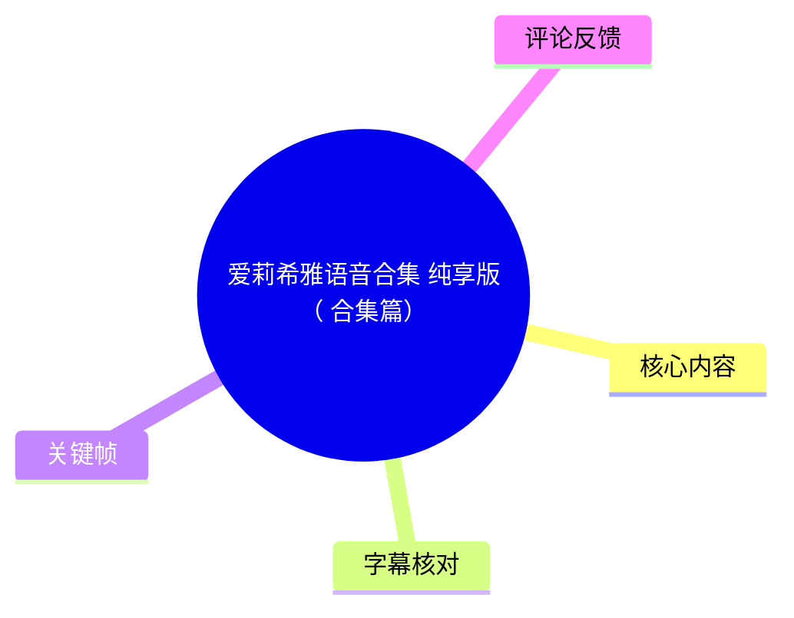
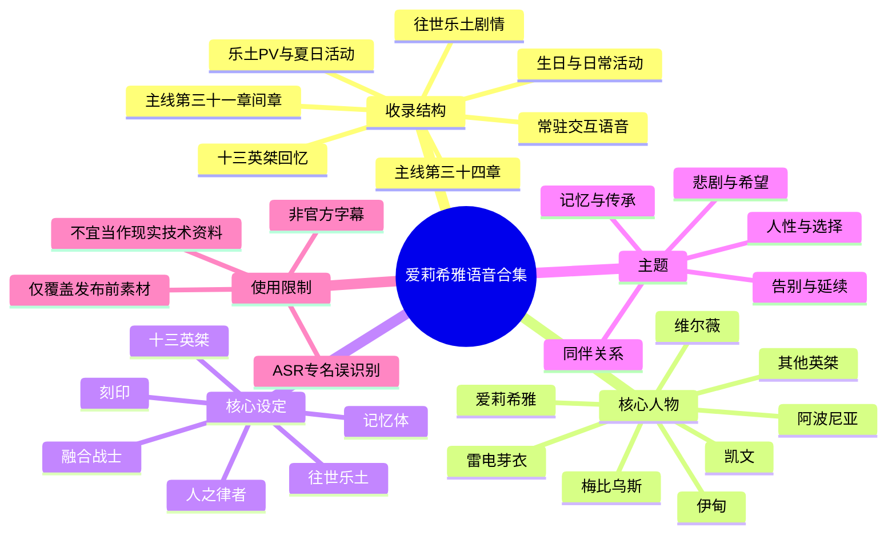
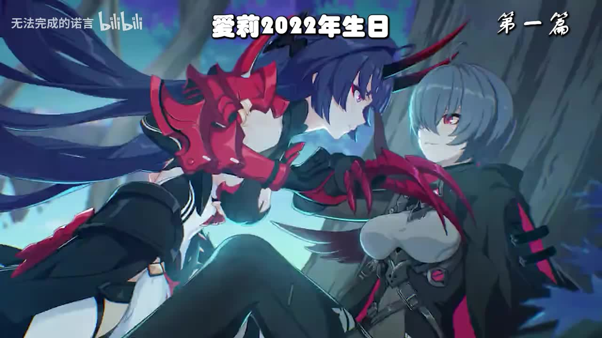
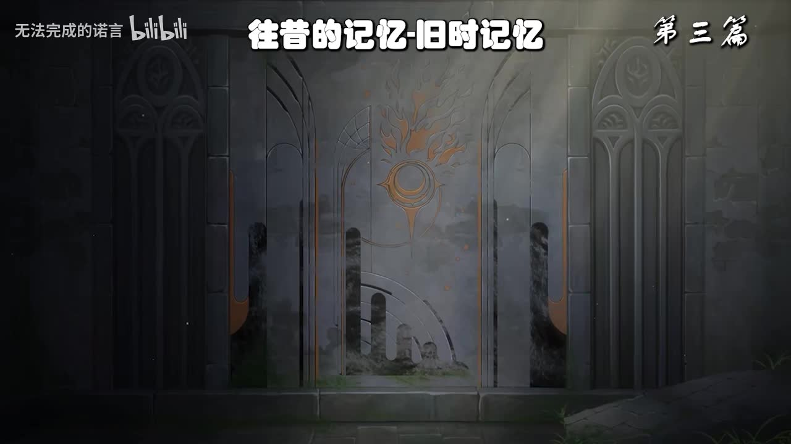

# 爱莉希雅语音合集 纯享版（合集篇）

> 来源：[Bilibili 视频](https://www.bilibili.com/video/BV1rw4m1C7Vr)  
> UP 主：无法完成的诺言｜发布于：2024-05-07｜时长：04:10:48  
> 收藏集：AIcode｜标签：崩坏3、爱莉希雅、语音、语音合集、乐土、剧情、主线  
> 视频说明：UP 主称语音与文本整理自《崩坏3》游戏；若字幕有误可在评论区指出，并提供“仅语音部分”的网盘链接。

## 小结

这是一支长达约 4 小时 11 分钟的《崩坏3》爱莉希雅语音整合视频。它不是原创解说、攻略或新闻节目，而是将游戏内与爱莉希雅有关的生日活动、乐土剧情、主线章节、PV、夏日活动及常驻交互语音按篇章连续收录的“纯享版”合集。

核心内容围绕爱莉希雅的角色叙事展开：从轻松的生日祝福、假日活动与乐土日常，逐渐进入“往世乐土”的构造、十三英桀的成立、融合战士时期的回忆、爱莉希雅对于“人之律者”身份的理解，以及她在终局前对同伴、未来与“人性”的选择。视频后半段还收录主线第 34 章“她的信标”“她的始源”等相关片段，以及大量乐土大厅/探索场景下的交互语音。

对希望补全爱莉希雅语音、按时间线回顾乐土叙事、寻找特定台词或整理角色思想线索的观众，本视频具有较高检索价值。UP 主热评提供了细至篇章级的索引；本笔记据此结合本次 ASR 时间轴建立可跳转目录。

视频中的“技术”信息主要属于作品世界观而非现实技术教程：例如往世乐土由十三位英桀的记忆交织构成、记忆体与现实个体并不等同、SO-1129 被提及为制造记忆体的技术、维尔薇可分割思维进行独立思考、乐土通过记忆回溯与刻印引导来访者探索。它们均为游戏剧情设定，不能当作现实科学或工程事实。

时效性方面，视频发布于 2024 年 5 月，素材覆盖范围以当时游戏已上线内容为准；视频本身没有说明后续版本是否补收，因此不能据此判断其对后续剧情、活动或语音是否完整。站内没有可用字幕，本笔记以带真实分段时间的本次 ASR 为时间轴基础，并对 ASR 中大量专名误识别保持谨慎。

## 思维导图

## 目录

- [视频定位、素材范围与观看建议](#视频定位素材范围与观看建议)
- [开场与爱莉希雅 2022 年生日](#开场与爱莉希雅-2022-年生日)
- [喧闹的假日交响曲：活动日常与新春语音](#喧闹的假日交响曲活动日常与新春语音)
- [尘封的回忆：少女的秘密与花园迷宫](#尘封的回忆少女的秘密与花园迷宫)
- [旧时记忆：爱莉希雅的过去与乐土档案室](#旧时记忆爱莉希雅的过去与乐土档案室)
- [从融合战士到十三英桀](#从融合战士到十三英桀)
- [爱莉希雅的终局：人之律者与希望之门](#爱莉希雅的终局人之律者与希望之门)
- [乐土永存与此即乐园](#乐土永存与此即乐园)
- [主线第三十一章间章：圣痕计划](#主线第三十一章间章圣痕计划)
- [主线第三十四章：她的信标与她的始源](#主线第三十四章她的信标与她的始源)
- [乐土 PV、夏日活动与常驻语音](#乐土-pv夏日活动与常驻语音)
- [关键帧索引](#关键帧索引)
- [世界观信息、参数与限制](#世界观信息参数与限制)
- [字幕比对](#字幕比对)
- [评论分析](#评论分析)
- [处理记录](#处理记录)

## 视频定位、素材范围与观看建议 [00:00:02](https://www.bilibili.com/video/BV1rw4m1C7Vr?t=2)

视频开头即以爱莉希雅的招呼语开启：“没想到，居然有人能抵达这里呢……”。随后在约 00:01:41 起进入可辨识的连续角色语音。ASR 诊断显示：

- 音频时长：15047.36 秒，约 **04:10:47**；
- ASR 语言：中文，语言置信度 **0.9912**；
- 有时间戳：是；
- 语音覆盖时长：14544.31 秒；
- 语音覆盖率：**96.66%**；
- 首段识别语音：00:00:02.580；
- 末段识别语音：04:10:44.430；
- 最大无语音间隔：00:00:15.220—00:01:41.640，约 **86.42 秒**，对应开场后较长的无对白/音乐或画面段落。

观看时可将本合集理解为“角色语音资料库”而非连续单一剧情。不同章节之间会切换游戏活动、乐土探索、主线回忆、PV 文案和交互语音；时间顺序是合集编排顺序，不等于游戏世界内事件严格发生顺序。

## 开场与爱莉希雅 2022 年生日 [00:03:28](https://www.bilibili.com/video/BV1rw4m1C7Vr?t=208)

该段对应 UP 主热评中的“爱莉 2022 年生日”，ASR 在约 00:03:47 起进入生日筹备剧情。爱莉希雅注意到菲莉丝的行为异常、送货清单与若干准备物，并在乐土内寻找线索。

剧情可归纳为以下过程：

1. **生日临近与布置构想**  
   爱莉希雅提起“明天是很特别的日子”，考虑大厅布置、粉红色花束、邀请函、甜点盒、气球与装饰等事项。
2. **菲莉丝商店的物资线索**  
   她在商店观察到浅粉花瓣图案的纸、疑似维尔薇魔术道具、甜点盒、白色花束、水晶小夜灯等，并发现菲莉丝神情紧张。
3. **送货清单与英桀行踪**  
   她借由清单先后接触千劫、樱、华等人；众人对次日晚间安排讳莫如深，使她逐渐猜到可能存在惊喜。
4. **寻找礼物与揭晓派对**  
   发现卡片、礼盒、吊坠与纪念册后，爱莉希雅仍强调“在恰当的时候被揭露才称得上是惊喜”。随后同伴们依次送上礼物、祝福与生日会。
5. **结尾主题**  
   她从纪念册延伸到“再厚的书也会翻到最后一页”，并提出只要名字不被遗忘，故事便会延续，最终把“接下来的故事”交给后来者续写。

> 图：画面标题直接标出“爱莉2022年生日 第一篇”，并呈现活动角色画面。它用于确认合集开篇并非单纯静态语音列表，而是保留了原活动剧情画面与章节标题。

## 喧闹的假日交响曲：活动日常与新春语音 [00:12:01](https://www.bilibili.com/video/BV1rw4m1C7Vr?t=721)

这一段由“景区/迷宫”互动与新春活动语音构成，整体调性较为轻松。ASR 可确认的内容包括：

- 爱莉希雅以“录像模式”“旅游景区”“迷宫地图”等语境和同伴互动；
- 众人讨论未完成的景区、迷宫中心、守卫与合照；
- 她邀请“圣芙蕾雅学园的游客”拍照；
- 随后切换到“妖精艾莉”和德丽莎发压岁钱的内容；
- 解释“压岁钱”与“压祟”的民俗说法：收下压岁钱，寓意在辞旧迎新之际压住邪祟、平安度过新的一岁；
- 出现琪亚娜、德丽莎、维尔薇、希儿等角色的活动互动，以及服装道具被卡住、年货工坊、符纸与天穹等事件。

这部分的重点不在推进爱莉希雅身份真相，而在呈现她面对日常活动时的语言风格：主动搭话、鼓励他人、以“可爱的妖精姐姐”自称、将游戏与仪式感融入互动。

## 尘封的回忆：少女的秘密与花园迷宫 [00:17:26](https://www.bilibili.com/video/BV1rw4m1C7Vr?t=1046)

从约 00:17:33 起，爱莉希雅正式向芽衣介绍“永世乐土”。ASR 可辨识的设定包括：

- 这里被称为由“至深之处”保存的往世乐土最深秘密；
- 它由爱莉希雅的记忆组成，旨在还原她一生所爱的世界；
- 场景被形容为“一切美丽事物的凝聚”“和平而永恒的梦幻仙境”“立于所有理想尽头的无瑕乐园”；
- 芽衣是第一位到达这里、能够领略爱莉希雅“全部真心”的后继者；
- 爱莉希雅表示，关于自己与“第十三律者”的问题，都可以在这里逐步寻获答案。

随后进入花园与迷宫式回忆。她并未一次性给出答案，而是采用“散步、回望、读取档案、与他人相遇”的方式安排芽衣理解过去。其叙事方法具有明确特点：

1. **不直接灌输结论**：强调过程、氛围与亲身经历。
2. **将交手重述为“约会”**：以爱莉希雅一贯的轻快口吻弱化紧张感。
3. **以阿波尼亚的预言为对照**：芽衣面对“十天后死亡”的预言仍选择反抗，成为爱莉希雅认可她的理由之一。
4. **让秘密与角色关系绑定**：爱莉希雅认为芽衣已取得众多英桀许可，距离真相很近，但仍需通过自己的选择抵达答案。

> 图：画面标注“往昔的记忆-旧时记忆 第三篇”，以封闭门扉与徽记构成章节过渡。它直观表现了本合集通过“门”“区域”“篇章”组织乐土回忆的形式。

## 旧时记忆：爱莉希雅的过去与乐土档案室 [00:23:44](https://www.bilibili.com/video/BV1rw4m1C7Vr?t=1424)

### 爱莉希雅的早期回忆 [00:23:44](https://www.bilibili.com/video/BV1rw4m1C7Vr?t=1424)

该段从爱莉希雅加入逐火之蛾前后的生活讲起。她提到：

- 自己对“沃斯托克-51”这一出生地缺少实感；
- 幼年时逐火之蛾曾将小镇居民带走调查，最终没有查出结果，又将大家送回；
- 据她转述，该事件后来被梅比乌斯定性为“乌龙事件”；
- 她自己也不完全了解出生之谜，甚至期待过其中会有隐藏秘密；
- 长大后再次与逐火之蛾相遇，命运由此转动。

这一段应注意：以上是角色在剧情中的自述或转述，不是视频外可独立验证的现实信息。

### 乐土档案室与“客观叙述” [00:24:38](https://www.bilibili.com/video/BV1rw4m1C7Vr?t=1478)

爱莉希雅带芽衣进入“乐土档案室”。其中最重要的设定是：

- 档案并非由单一人物写作；
- 英桀们的记忆会通过打字机具现为文字；
- 其功能被描述为以较“客观公正”的方式呈现事实；
- 爱莉希雅希望芽衣在漫长叙事中获得“自己幸福的答案”。

这构成视频的重要叙事技术：爱莉希雅本人的讲述带有明显主观情感和戏谑语气，而档案室被用来补充或平衡个人叙述。也因此，观看者应区分：

- **角色主观表达**：感情、玩笑、修辞、对同伴的评价；
- **档案式说明**：尝试以记忆材料叙述过往；
- **仍然存在的限制**：档案本身来自记忆，不能被理解为现实世界的全知客观记录。

## 从融合战士到十三英桀 [00:37:38](https://www.bilibili.com/video/BV1rw4m1C7Vr?t=2258)

### 融合战士计划与代价 [00:37:38](https://www.bilibili.com/video/BV1rw4m1C7Vr?t=2258)

视频回顾融合战士时期时，出现以下信息：

- 凯文在心理状态极差时参与融合战士计划；
- 梅比乌斯与爱莉希雅分别对融合、超变因子和副作用表达不同态度；
- 爱莉希雅明确说自己不喜欢“逐渐模糊人与崩坏兽界限”的做法；
- 逐火之蛾还尝试过人工生命、巨型机器人等其他路径；
- 融合战士筛选严格，由梅比乌斯实验室把控；
- 角色叙述中承认存在牺牲，但强调成功率“相对有保障”；
- 不久后，逐火之蛾拥有八位融合战士。

这些内容均涉及角色经历、实验与牺牲，视频没有提供现实层面的技术细节、实验参数、实验流程或可复现实验方法。因此不能将其整理为现实“生物技术教程”。

### 十三英桀的建立与位次 [00:46:40](https://www.bilibili.com/video/BV1rw4m1C7Vr?t=2800)

该段是合集最重要的组织叙事之一。爱莉希雅提出为逐火之蛾中的成员争取新的身份，提出“逐火十三英桀”之名，并介绍位次、刻印与象征物。

视频中的关键点：

- 她希望为成员争取的不只是特权，更是“身份”；
- “英桀”在组织层面可能被视作特殊权力，引发高层顾虑；
- 高层否决并非完全无端，而是担心成员特权化、成员形象与组织管理风险；
- 驳回理由中包含“不认可半数以上成员可称为英雄”之类表述，令爱莉希雅感到失落；
- 即便未获官方完整认可，后人依然会认识、感谢并传承这些人的故事；
- 爱莉希雅强调成员并非“完美英雄”，而是有私心、缺陷、冲动与善意的普通人；他们之所以成为英桀，是因为在那个时代做出了选择。

> 图：画面标题为“我们的开始-十三英桀 第五篇”，画面中心为伊甸。它对应合集从个人回忆转入十三英桀组织建立、成员关系与共同历史的章节。

### “十三人”与组织关系的理解 [00:50:39](https://www.bilibili.com/video/BV1rw4m1C7Vr?t=3039)

爱莉希雅带芽衣重走乐土各区域，逐一回顾凯文、华、千劫、苏、伊甸、梅比乌斯、帕朵菲莉丝、科斯魔、格蕾修、维尔薇、阿波尼亚等人的故事与性格。这一段不适合简化为人物百科，而应抓住其叙事功能：

- 每个区域不仅是场景，也承载某位英桀的记忆、刻印与主观世界；
- 成员之间的历史相互交织，单独理解某人往往不足以理解整体；
- 芽衣之所以能接近乐土最深处，不只因为力量，也因为她与英桀建立了关系；
- 爱莉希雅提出，乐土真正保存的不是冷冰冰的技术资料，而是这些人为何战斗、如何生活、如何彼此相待。

## 爱莉希雅的终局：人之律者与希望之门 [01:10:18](https://www.bilibili.com/video/BV1rw4m1C7Vr?t=4218)

### “悲剧并非终结” [01:07:33](https://www.bilibili.com/video/BV1rw4m1C7Vr?t=4053)

在音乐剧与废墟新芽的回忆中，爱莉希雅提出本合集反复出现的价值判断：

> 悲剧并非终结，而是希望的起始。

她将废墟上破土的新芽视为“新生”的象征：即便未来不确定，即便下一秒也可能枯萎，仍值得珍视当下的存在。她进一步将人类留下的足迹描述为后来者前行的灯火。

这是角色的主题性表达，不是经验科学结论；其作用是将前文明的牺牲、记忆与后世行动连接起来。

### 最终宴会、坦白与告别 [01:12:18](https://www.bilibili.com/video/BV1rw4m1C7Vr?t=4338)

从此处开始，视频集中收录爱莉希雅终局前对同伴的告别与身份揭示。主要内容包括：

- 她承认自己曾隐瞒“第十三律者”相关真相；
- 她以水晶花作为赠礼与情感象征；
- 她分别与伊甸、凯文、阿波尼亚、梅比乌斯等人道别；
- 她问凯文“如果流下眼泪会不会结冰”，随后将冰泪理解为“温暖”的答案；
- 她希望在遥远未来，若人们遇到和她一样的律者，能将消息告诉她；
- 她把“律者不再意味着永别”“人类仍能获得希望”作为愿望；
- 她提出“因为我是律者，所以或许能做到；但因为我是人类，所以一定能做到”的身份自我认定；
- 她最终以“最初的律者、人之律者”表述自己的名字与定位。

### 关键台词与含义 [01:16:28](https://www.bilibili.com/video/BV1rw4m1C7Vr?t=4588)

该段收录告别词中最具代表性的文本：

- “此后将有群星闪亮，因为我如今来过。”
- “此后将有百花绽放，因为我从未离去。”
- “请将我的剑、我的花与我的爱织成新生的种子。”
- “我名为爱莉希雅，最初的律者，人之律者。”

它们共同构成三个层次：

1. **个人的离场**：爱莉希雅必须离开、消散或告别。
2. **记忆的留存**：她以名字、花、故事、同伴记忆维持存在意义。
3. **后继者的责任**：未来不只是被动继承牺牲，而要将其转化为新的选择与道路。

## 乐土永存与此即乐园 [01:17:08](https://www.bilibili.com/video/BV1rw4m1C7Vr?t=4628)

### 少女初成与“人性”的自我理解 [01:17:08](https://www.bilibili.com/video/BV1rw4m1C7Vr?t=4628)

该段补充爱莉希雅与逐火之蛾成员相遇、结识维尔薇、科斯魔、黛丝多比娅、格蕾修、阿波尼亚、千劫等人的片段。视频通过这些较生活化的互动强调：爱莉希雅并非只在终局才拥有“人性”，她与他人建立关系、观察他人、在意细节、开玩笑、害怕、期待和告别的过程，共同构成了她对自身身份的理解。

约 01:26:22 起，她更加明确地推导：

- 自己有人的外表、品性与情感；
- 会喜悦、悲伤、失落、振作；
- 即使不舍过去，也愿意放手未来；
- 因而她将自己命名为“人之律者”。

这里的“全能”不是工程参数，而是游戏剧情中对律者权能的讨论。爱莉希雅将“人性”视作自己最重要的能力或答案。

### 最终宴会的再体验 [01:30:14](https://www.bilibili.com/video/BV1rw4m1C7Vr?t=5414)

爱莉希雅带芽衣重新体验最终宴会。维尔薇准备抓娃娃机，阿波尼亚穿正式礼服，伊甸带来华丽装扮与烟花。视频借小游戏、游乐设施、礼服、甜点与舞会重新组织了原本沉重的告别。

重要叙事信息：

- 阿波尼亚从一开始就知道爱莉希雅“特别”，但选择相信自己所看见的她；
- 维尔薇与梅依靠推演接近真相，却没有提前揭穿；
- 凯文并不以“律者”标签否定她，而说这里只有“以真我为名的英桀”；
- 爱莉希雅知道同伴信任自己，但仍选择以自身消散为代价下注，为未来留下希望；
- 她认为结果未必确定，却仍相信“尝试改变”有意义。

### 告别、毕业与故事的交接 [01:40:02](https://www.bilibili.com/video/BV1rw4m1C7Vr?t=6002)

此后是乐土叙事的重要收束：

- 爱莉希雅祝贺芽衣从往世乐土“毕业”；
- 她让芽衣抬头、走向未来；
- 她希望芽衣记住她的脸、声音与话语，但也说“就算真的忘记了也没关系”；
- 她承认告别会带来失望，却强调未来仍会有人看见他们留下的样子；
- 她将“完美”定义为并非没有缺憾，而是能接受缺憾、直面痛苦并承担重担；
- 她把真我之名赠予新世代的人类，要求后来者自己赋予其新的意义。

这部分的核心不是“必须铭记某个角色”，而是强调：传承不是复制过去，而是基于过去做出自己的命途与刻印。

## 主线第三十一章间章：圣痕计划 [01:52:55](https://www.bilibili.com/video/BV1rw4m1C7Vr?t=6775)

该段开始转入主线相关内容。爱莉希雅进一步谈及自身作为律者的可能性、对“神”的理解，以及与梅、凯文等人的关系。

可确认的剧情信息包括：

- 爱莉希雅并不认为自己能百分之百成功改变律者或改变结局；
- 她提出多种可能：未来律者可能都成为“人之律者”、崩坏可能消失、也可能什么都不发生；
- 即使不确定，她仍认为为所爱之人争取更好结局是“只有自己能完成、也应当由自己完成的事”；
- 她否定“统领律者的神”作为实际存在的明确意识，描述自己感受到的更像混沌与拥抱；
- 她将这种对人类而言过于痛苦的“拥抱”与崩坏经验关联；
- 她认为世界需要可被相信的事物，也需要一个合理说法，因此“最初的律者/人之律者”可成为美丽的童话与信念。

限制在于：ASR 对“圣痕计划”等专名、人物名和部分设定词存在显著误识别；本节只保留能够通过上下文与热评章节索引稳定确认的概念，不将误识别文本逐字当作正式设定原文。

## 主线第三十四章：她的信标与她的始源 [01:54:16](https://www.bilibili.com/video/BV1rw4m1C7Vr?t=6856)

### 她的信标：游乐园梦境与寻宝 [01:54:16](https://www.bilibili.com/video/BV1rw4m1C7Vr?t=6856)

这一段以游乐园导游“爱莉”的形象展开。琪亚娜、布洛妮娅与芽衣在游乐园体验抓娃娃、打气球、寻宝等活动。

剧情结构是：

1. 爱莉以导游身份组织游乐项目；
2. “寻宝”成为主要任务；
3. 梦境中的不同“爱莉”形象被区分；
4. 芽衣逐渐察觉梦境并寻找真正宝藏；
5. 某个作为权能延伸的存在解释：她不愿过早打破芽衣想与伙伴、与爱莉共同游玩的梦；
6. 她提示芽衣，成长并非只是获得力量，也包括为了美好而改变、为了力量而坚忍、为了身心统一而成长。

这里以“游戏设计”“隐藏项目”“宝藏”作为叙事外壳，实际讨论的是芽衣如何在记忆、愿望与现实之间辨认自我。

### 她的始源：重逢与始源之律者 [02:04:10](https://www.bilibili.com/video/BV1rw4m1C7Vr?t=7449)

从约 02:04:11 起，爱莉希雅回应芽衣的呼唤。ASR 中可辨识的核心内容是：

- 她以芽衣心中的投影或权能呈现；
- 始源的力量在被寻获前沉睡了五万年；
- 维尔薇留下的“后门/信标”利用传承、记忆与长信，尝试唤醒原本不复存在的奇迹；
- 结果并非维尔薇能够完全预测，而被爱莉希雅称为真正的“奇迹”；
- 她肯定芽衣已成长、可接受自身全部，并能成为英雄们的一员；
- 她明确指出芽衣抵达此处时已成为“始源之律者”，或正因如此才得以与她相见；
- 随后出现一段仪式性祷词，向十三英桀及其刻印致意，最后赞颂“始源之律者的诞生”。

这一段是合集从“回忆爱莉希雅”转向“芽衣继承并重新诠释爱莉希雅留下之物”的关键节点。

## 乐土 PV、夏日活动与常驻语音 [02:13:32](https://www.bilibili.com/video/BV1rw4m1C7Vr?t=8012)

### 乐土 PV 与夏日生存狂想曲结尾 [02:13:32](https://www.bilibili.com/video/BV1rw4m1C7Vr?t=8012)

此处先收录乐土 PV 文案，再切换到“夏日生存狂想曲”结尾内容。PV 对往世乐土的概念作了高度概括：

- 来访者为探寻过去而来；
- 乐土是末世最后的乐园，也是逐火者命定的终末；
- 其中留存的是十三人“离奇、胡闹、喧嚣”而又“幸福、温暖、美好”的故事；
- 它们可能只是数据中短暂、未被严密保护的一段祝福，却与抗争、祈愿、觉悟同样真实；
- 来访者的道路仍将延续，应“听凭心意前进”。

### 常驻探索语音与角色资料 [02:15:05](https://www.bilibili.com/video/BV1rw4m1C7Vr?t=8105)

后续约两小时为大量乐土常驻语音、探索对话、人物提示、英桀关系与设定补充。由于内容密度极高，可按主题检索：

| 主题 | 推荐时间 | 内容概览 |
| --- | ---: | --- |
| 爱莉希雅的副首领/位次话题 | [02:17:21](https://www.bilibili.com/video/BV1rw4m1C7Vr?t=8241) | 她谈到优雅、美丽、可爱与“副首领”象征性职责，并承认自己曾在早期处于第一位。 |
| 十三英桀位次的调整 | [02:28:57](https://www.bilibili.com/video/BV1rw4m1C7Vr?t=8937) | 她解释自己曾很快卸任第一位，凯文成为第一位；位次与管理、不可替代性、组织需求相关。 |
| 千劫与承诺 | [02:32:11](https://www.bilibili.com/video/BV1rw4m1C7Vr?t=9131) | 爱莉希雅讲述千劫被视为威胁、被送入至深之处，以及自己以某种承诺帮助其离开的往事。 |
| 乐土空间的构成 | [02:53:43](https://www.bilibili.com/video/BV1rw4m1C7Vr?t=10423) | 往世乐土被比作复杂折纸：十三道意识彼此穿插、折叠、相牵。 |
| 刻印与独立领域 | [02:56:04](https://www.bilibili.com/video/BV1rw4m1C7Vr?t=10564) | 爱莉希雅将刻印描述为灵魂卷轴、“我之所以为我”的证明；阿波尼亚区域由其强烈记忆独立构成。 |
| 维尔薇的思维分割 | [03:06:07](https://www.bilibili.com/video/BV1rw4m1C7Vr?t=11167) | 其能力被解释为将思维分割、各自独立思考，不等同于普通意义的多重人格。 |
| 阿波尼亚的预言困境 | [03:08:53](https://www.bilibili.com/video/BV1rw4m1C7Vr?t=11333) | 她能看见未来却难以改变；试图阻止预言，常会使结果以别的方式应验。 |
| 伊甸与乐土资源 | [03:14:21](https://www.bilibili.com/video/BV1rw4m1C7Vr?t=11661) | 爱莉希雅称乐土建立得益于伊甸的资源支持，并介绍伊甸在末世前的多重身份与艺术地位。 |
| 梅比乌斯与融合战士 | [03:17:52](https://www.bilibili.com/video/BV1rw4m1C7Vr?t=11872) | 讨论“制造融合战士”的措辞、技术共同性，以及梅比乌斯在应用上的投入。 |
| 往世乐土存在意义 | [03:22:16](https://www.bilibili.com/video/BV1rw4m1C7Vr?t=12136) | 对伊甸、千劫、梅比乌斯、凯文而言意义不同；对爱莉希雅而言，它是记录时代、征程与十三人生命的故事书。 |
| 融合战士副作用与耳朵 | [03:53:10](https://www.bilibili.com/video/BV1rw4m1C7Vr?t=13990) | 爱莉希雅以自身外貌与代谢变化为例，说明融合手术伴随副作用；内容属于剧情设定。 |
| 千劫传闻与基地轶事 | [03:58:25](https://www.bilibili.com/video/BV1rw4m1C7Vr?t=14305) | 围绕“千劫回来了”的基地传闻、对梅比乌斯的误会等轻松对话。 |
| 凯文、克莱因、梅比乌斯收尾 | [04:02:14](https://www.bilibili.com/video/BV1rw4m1C7Vr?t=14534) | 收录爱莉希雅与凯文、克莱因、梅比乌斯、苏等人的零散互动语音。 |
| 最后招呼 | [04:10:29](https://www.bilibili.com/video/BV1rw4m1C7Vr?t=15029) | “最后还是被你找到了呢……还是好好打个招呼吧。想我了吗？” |

## 关键帧索引

### 生日篇开场 [00:03:28](https://www.bilibili.com/video/BV1rw4m1C7Vr?t=208)

> 图：明确标注“爱莉2022年生日 第一篇”。适合用于定位合集开头的活动剧情来源，也能说明视频并非只有黑屏音频。

### 旧时记忆的章节门扉 [00:23:44](https://www.bilibili.com/video/BV1rw4m1C7Vr?t=1424)

> 图：石门与象征徽记强化“进入回忆/档案”的空间感。适合帮助理解乐土通过区域、门扉和回溯机制组织剧情。

### 十三英桀建立篇 [00:46:40](https://www.bilibili.com/video/BV1rw4m1C7Vr?t=2800)

> 图：画面标题“我们的开始-十三英桀 第五篇”，人物为伊甸。该图直接对应英桀建立、成员关系及黄金庭院相关叙事。

### 维尔薇篇：尘埃落定 [01:06:40](https://www.bilibili.com/video/BV1rw4m1C7Vr?t=4000)

> 图：画面以爱莉希雅坐在沙发上的构图呈现“维尔薇篇-尘埃落定”。它适合作为后半段角色回忆与互动语音的视觉锚点，体现合集持续保留原始剧情画面与篇章题字。

## 世界观信息、参数与限制

### 视频中明确出现的设定性“参数”

| 项目 | 视频/ASR 所述 | 使用边界 |
| --- | --- | --- |
| 视频总时长 | 15048 秒，约 04:10:48 | 元数据参数。 |
| ASR 音频时长 | 15047.36 秒 | 与视频总时长基本一致。 |
| 语音覆盖率 | 96.66% | 仅衡量 ASR 检出的有声语音覆盖，不等于文本绝对准确。 |
| 英桀人数 | 十三人 | 剧情设定与视频反复提及的组织结构。 |
| 乐土意识来源 | 十三道流动意识 | 剧情中的空间构成解释。 |
| 爱莉希雅融合战士编号 | “CM002” | ASR 在约 03:39:07 识别到；缩写含义在台词中也被说成“不记得”。 |
| 记忆体技术名 | “SO-1129” | 剧情中用于说明记忆体制造；专名已依据上下文谨慎保留。 |
| 始源沉睡时间 | 五万年 | 主线第 34 章相关台词中的剧情时间尺度。 |
| 魔法级崩坏兽数量 | 理论中仅三个 | 出现在常驻对话；属于作品设定，且 ASR 对部分名称不稳定。 |

### 观看与引用限制

1. **不是官方原始文本库**  
   视频由 UP 主整理制作，文本与语音来自游戏内容；UP 主也主动提示字幕可能存在错误。

2. **ASR 专有名词误识别明显**  
   本次 ASR 在人物名、组织名、术语上多有错误或同音替换，例如“爱莉希雅/爱丽西娅”“逐火之蛾/烛火之鹅”“英桀/音节”“芽衣/牙医”“律者/绿者”等。正文已按上下文尽可能规范化，但不对未能交叉验证的细枝末节作断言。

3. **剧情设定不等于现实技术**  
   融合战士、记忆体、思维分割、记忆空间、圣痕计划等均为《崩坏3》世界观内容，不提供现实可操作步骤、实验条件、代码、设备参数或工程方案。

4. **合集不保证涵盖后续版本**  
   视频发布于 2024 年 5 月，不能替代官方游戏内当前版本、剧情档案或后续活动资料。

5. **剧透风险高**  
   视频包含爱莉希雅身份、最终宴会、英桀结局、芽衣成为始源之律者等重大剧情信息。

## 字幕比对

| 字幕来源 | 完整性 | 专有名词 | 时间轴 | 主要问题 |
| --- | --- | --- | --- | --- |
| Bilibili 站内字幕 | 未提供可用字幕 | 无法评估 | 无法使用 | 素材处理记录显示字幕工具因 `Invalid URL` 退出，未获得站内字幕文件。 |
| 本次 ASR 字幕 | 高：731 段，覆盖约 96.66% 语音 | 较弱：大量人名、组织名、术语同音误识别 | 高：提供毫秒级 SRT 起止时间 | 长句粘连、角色切换未标注、专名混乱、部分语义受识别错误影响。 |

### 最终字幕选择

本笔记采用 **本次 ASR 的真实 SRT 时间轴** 作为章节跳转依据，并结合：

- 视频元数据中的标题、标签、简介；
- UP 主热评提供的篇章起止时间；
- 关键帧中的章节题字；
- 《崩坏3》语境下能够稳定确认的人名与专名；

对文字进行有限度校正。

### 重要校正规则

- `牙医`：多数语境应为“芽衣”；
- `绿者/绿哲`：多数语境应为“律者”；
- `烛火之鹅/烛火之额`：多数语境应为“逐火之蛾”；
- `音节/阴劫`：多数语境应为“英桀”；
- `衣店`：多数语境应为“伊甸”；
- `菲力斯`：多数语境应为“菲莉丝/帕朵菲莉丝”；
- `维尔威/维儿威`：多数语境应为“维尔薇”；
- `阿布尼亚`：多数语境应为“阿波尼亚”。

未发现 ASR 诊断中的 `noAudioStream=true` 标记；相反，诊断显示源视频存在可识别音频，且 ASR 结果覆盖充分。因此，本次未将字幕缺失归因于视频无音轨。

## 评论分析

仅处理可获取的热评前三条。

### 热评 1：UP 主提供完整章节索引

- 评论者：无法完成的诺言（UP 主）
- 点赞：252
- 价值：最高。

该评论列出从“爱莉 2022 年生日”到“乐土 PV”的完整分段时间，是本视频最直接的导航补充。它将长合集拆为生日、假日、尘封回忆、旧时记忆、融合战士、十三英桀、终局、主线第 31 章间章、主线第 34 章、夏日活动等模块。

可信度判断：该索引由视频发布者提供，且与 ASR 中的实际时间和关键帧章节题字基本吻合，适合用作合集结构索引；但它仍属于 UP 主整理信息，并非官方版本目录。

### 热评 2：情感性祝福

- 评论者：幻焱者
- 点赞：143
- 内容：以“光辉矢愿”风格向观众送上“你是最棒的”“愿你快乐每一天”等祝福。

该评论不提供剧情校勘、技术补充或时间索引，但反映了观众对爱莉希雅角色语音中“鼓励、陪伴、夸赞”气质的接受与再创作。它属于粉丝情感表达，不应作为剧情事实依据。

### 热评 3：引用爱莉希雅终局台词

- 评论者：真我的背负
- 点赞：87
- 内容：整理“致以无瑕之人”风格的告别语，包括“此后将有群星闪耀”“此后将有百花绽放”“最初的律者，人之律者”等。

该评论对应视频约 [01:16:28](https://www.bilibili.com/video/BV1rw4m1C7Vr?t=4588) 后的终局告别段落，便于观众定位情绪高潮。评论文本与 ASR 大意高度一致，但个别字词、标点及“箭/剑”等写法可能与原始游戏文本不同；引用时应回看原视频或游戏文本确认。

## 处理记录

- Worker ID：worker-mrj0wbly-5dc4e50c
- 模型：gpt-5.6-terra
- 调用工具与素材：视频元数据、关键帧素材、ASR 结果 JSON、ASR SRT、评论 JSON。
- 字幕检查：
  - 已检查站内字幕：未提供可用站内字幕；
  - 素材告警显示字幕工具返回 `Invalid URL`；
  - 已检查本次 ASR：存在有效音频识别结果，731 个分段、毫秒级时间戳、语音覆盖率 96.66%；
  - 最终选择：以本次 ASR SRT 为时间轴主依据，以 UP 主热评索引和关键帧篇章题字辅助校正。
- 关键帧选择依据：
  - `frames/frame-001.jpg`：画面带“爱莉2022年生日 第一篇”题字，定位开场活动；
  - `frames/frame-002.jpg`：画面带“往昔的记忆-旧时记忆 第三篇”题字，定位回忆与档案室段落；
  - `frames/frame-003.jpg`：画面带“我们的开始-十三英桀 第五篇”题字，定位十三英桀建立段落；
  - `frames/frame-004.jpg`：画面带“维尔薇篇-尘埃落定 第八篇”题字，定位后半角色篇章。
- 缓存清理：未提供可验证的缓存清理执行记录；不虚构清理结果。
- 未解决问题：
  - 站内字幕不可用，无法逐句比对官方/站内文本；
  - ASR 对专名与长句误识别较多；
  - 视频为合集整理，无法仅凭现有素材确认每一段对应的游戏版本、任务编号或官方原始文本版本；
  - 该合集发布后是否更新、是否覆盖新增语音，现有素材无法确认。
