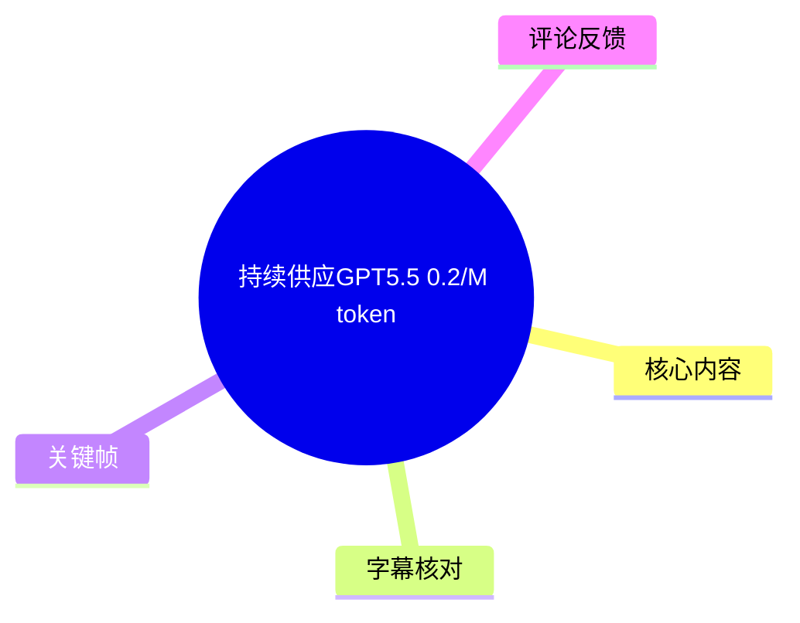
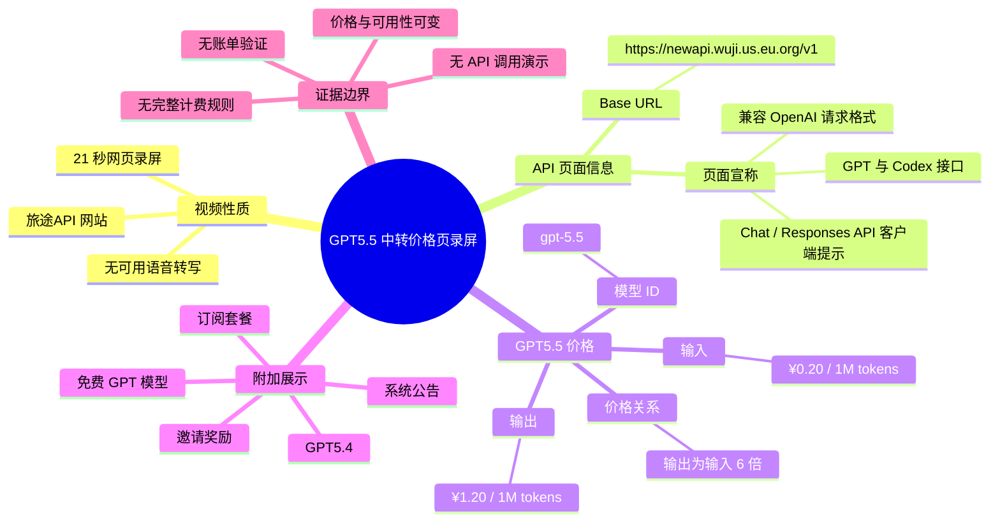
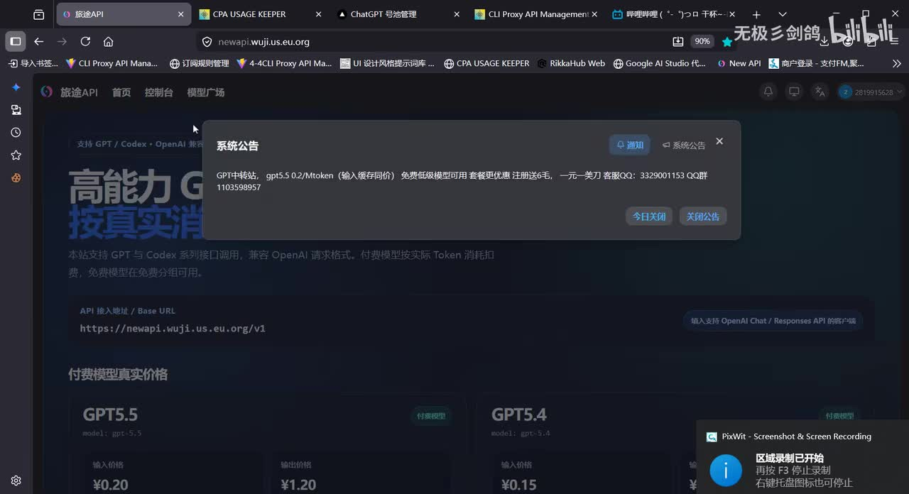
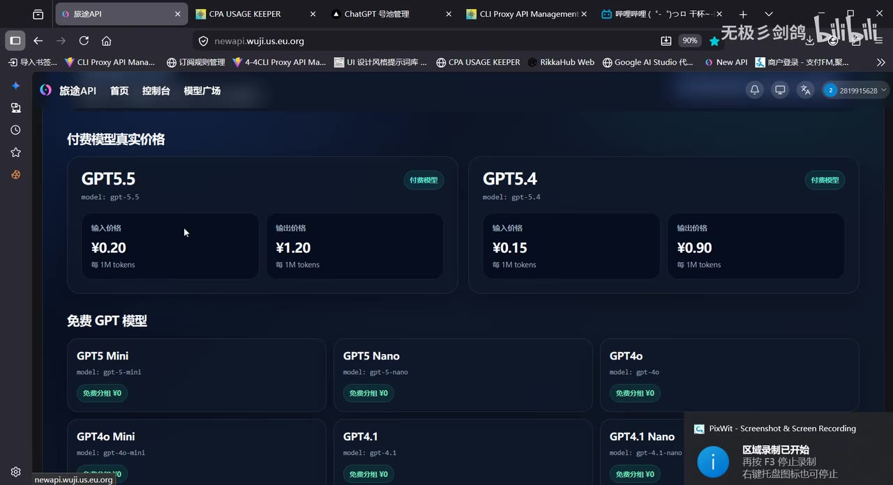
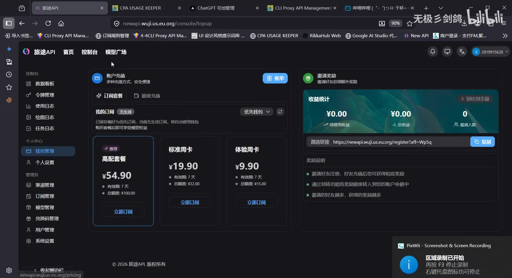

## 小结

这是一段时长 21 秒的网页录屏，展示“旅途API”网站的模型价格页、系统公告及订阅套餐页面。视频标题为“持续供应GPT5.5     0.2/M token”，简介提供站点 `https://newapi.wuji.us.eu.org/`，并写明“专注于gpt中转”。

画面中，“GPT5.5”（模型标识显示为 `gpt-5.5`）的价格为：**输入 ¥0.20 / 每 1M tokens，输出 ¥1.20 / 每 1M tokens**。因此，标题中的“0.2/M token”只能与输入价格对应，不能理解为输入、输出统一按 ¥0.20 / 1M tokens 结算。按展示价格，输出单价是输入单价的 **6 倍**。

页面还展示 API 接入地址 `https://newapi.wuji.us.eu.org/v1`，并写有“支持 GPT / Codex 系列接口调用，兼容 OpenAI 请求格式”等文字；右侧提示涉及支持 OpenAI Chat / Responses API 的客户端。这些是录屏中可见的服务页面陈述，视频未展示 API 请求、鉴权方式、返回结果、调用日志或账单，不能据此验证模型来源、接口兼容范围、服务稳定性或实际扣费。

系统公告中可见“GPT中转站，gpt5.5 0.2/Mtoken（输入缓存同价）”、免费低级模型、套餐优惠及注册赠送额度等营销信息；但缓存命中定义、套餐细则、限速、并发、上下文长度、退款规则及活动条件均未在视频中完整展示。

该视频适合作为某一录制时点的价格页线索，而非接入教程或服务可靠性证明。模型可用性、标价、免费额度、套餐、缓存计费与服务条款均具有时效性；实际使用前应以访问时的控制台、服务规则与小额实测账单为准。

## 思维导图

## 目录

- [视频定位与证据边界](#视频定位与证据边界)
- [服务入口与接口页面信息](#服务入口与接口页面信息)
- [GPT5.5 的分项价格与计算](#gpt55-的分项价格与计算)
- [GPT5.4、免费模型与套餐展示](#gpt54免费模型与套餐展示)
- [使用前的核验步骤](#使用前的核验步骤)
- [限制、风险与时效性](#限制风险与时效性)
- [字幕比对](#字幕比对)
- [评论分析](#评论分析)
- [处理记录](#处理记录)

## 视频定位与证据边界 [00:00](https://www.bilibili.com/video/BV1oqGp6bERJ?t=0)

- **视频标题**：持续供应GPT5.5     0.2/M token
- **UP 主**：无极彡剑鸽
- **视频时长**：21 秒
- **所属合集**：AIcode
- **视频简介**：`https://newapi.wuji.us.eu.org/`；“专注于gpt中转”
- **标签**：`api`、`GPT`、`中转站`、`gpt`
- **页面主体**：画面显示名为“旅途API”的网站，包含首页、控制台、模型广场、令牌管理、使用日志、订阅管理、模型管理等导航项。

本次素材没有提供可用的 Bilibili 站内字幕；ASR 也未识别到语音文字段落。因此，无法依据真实字幕时间码定位页面切换的精确秒数。为避免根据关键帧顺序虚构时间，正文各主题均链接至视频起点 `t=0`，供回看完整录屏。

本文事实依据包括：

1. 视频元数据中的标题、简介、时长与标签；
2. 已提供关键帧中可见的网页文字；
3. 本次 ASR 的空结果与诊断信息；
4. 可获取的热评。

不包括对服务真实上游、模型能力、接口成功率或价格持久性的推断。

## 服务入口与接口页面信息 [00:00](https://www.bilibili.com/video/BV1oqGp6bERJ?t=0)

录屏首页展示的网页域名为 `newapi.wuji.us.eu.org`。页面背景文字及接口区域可辨识出以下内容：

| 项目 | 画面可见信息 | 证据性质 |
| --- | --- | --- |
| 网站名称 | 旅途API | 网页画面文字 |
| 视频简介链接 | `https://newapi.wuji.us.eu.org/` | 视频元数据原文 |
| API 接入地址 / Base URL | `https://newapi.wuji.us.eu.org/v1` | 网页画面文字 |
| 接口描述 | 支持 GPT 与 Codex 系列接口调用，兼容 OpenAI 请求格式 | 服务页面陈述 |
| 客户端提示 | 输入支持 OpenAI Chat / Responses API 的客户端 | 网页画面文字 |
| 后台功能导航 | 令牌管理、使用日志、绘图日志、任务日志、订阅管理、模型管理等 | 网页画面文字 |

> 图：该关键帧展示“系统公告”弹窗，以及背景中的 API 接入地址、接口说明和模型价格区域。其价值在于确认页面展示了 `/v1` 形式的 Base URL 与 OpenAI 格式兼容性描述；但公告遮挡了部分页面信息，不能据此补全未显示的规则。

### 可以确认的内容

- 页面展示了 `https://newapi.wuji.us.eu.org/v1` 作为 API 接入地址。
- 页面宣称支持 GPT、Codex 系列接口调用，并兼容 OpenAI 请求格式。
- 页面提示支持 OpenAI Chat / Responses API 的客户端。
- 服务页面中存在令牌、日志、订阅和模型管理等后台入口。

### 不能从视频确认的内容

视频未展示以下技术细节：

- API Key 的生成、格式、权限范围与撤销流程；
- 实际请求路径、鉴权头、模型参数与完整模型 ID 列表；
- Chat Completions、Responses、流式响应、工具调用等功能是否均可用；
- 请求成功率、限流策略、并发上限、延迟与地区可用性；
- `gpt-5.5` 的实际模型来源、路由方式或能力对应关系；
- 输入、输出以外的计费项目，例如失败请求、重试、图像、工具调用或其他用量。

## GPT5.5 的分项价格与计算 [00:00](https://www.bilibili.com/video/BV1oqGp6bERJ?t=0)

“付费模型真实价格”区域中可见 GPT5.5 与 GPT5.4 两张卡片。GPT5.5 卡片展示的信息如下：

| 字段 | 画面内容 |
| --- | --- |
| 模型名称 | GPT5.5 |
| 模型标识 | `gpt-5.5` |
| 分类 | 付费模型 |
| 输入价格 | **¥0.20 / 每 1M tokens** |
| 输出价格 | **¥1.20 / 每 1M tokens** |

> 图：该关键帧完整显示 GPT5.5 的输入价 ¥0.20、输出价 ¥1.20，以及 GPT5.4 的对应价格。它是区分“标题标价”与“完整输入/输出计费结构”的核心证据。

### 标题“0.2/M token”的实际对应范围

标题中的“0.2/M token”与画面中 GPT5.5 的**输入价格**相符，即：

\[
\text{GPT5.5 输入价格} = ¥0.20 / 1M\ tokens
\]

但画面同时明确显示输出价格为：

\[
\text{GPT5.5 输出价格} = ¥1.20 / 1M\ tokens
\]

因此，不能仅按“¥0.20 / 1M tokens”估算总成本。对于会生成较长回答、代码或推理文本的任务，输出侧价格可能成为主要成本来源。

### 输入与输出的价格比

按画面价格计算：

\[
\frac{¥1.20}{¥0.20}=6
\]

即 GPT5.5 的输出单价是输入单价的 **6 倍**。

若一次调用中输入为 \(I\) 个 tokens、输出为 \(O\) 个 tokens，且实际结算与页面标价一致，则仅按展示价格估算：

\[
\text{预估费用（元）}
=
0.20 \times \frac{I}{1,000,000}
+
1.20 \times \frac{O}{1,000,000}
\]

例如，假设某次调用使用 100 万输入 tokens 并产生 100 万输出 tokens：

\[
0.20 + 1.20 = 1.40\text{ 元}
\]

这是基于录屏价格的算术示例，不是实际账单验证。服务是否存在套餐折扣、赠送余额、缓存规则、失败重试计费或其他条件，视频未能完整说明。

### 关于“输入缓存同价”

系统公告中可读到：

> GPT中转站，gpt5.5 0.2/Mtoken（输入缓存同价）

该文字说明服务页面在公告中将“输入缓存”与输入侧 ¥0.20 / 1M tokens 的信息关联展示。但视频没有给出缓存相关的完整规则，无法确认：

- 缓存命中如何判定；
- 缓存读与缓存写是否按同一规则计费；
- 缓存是否要求特定接口、参数或提示词结构；
- 缓存是否具有保存期限或适用模型限制；
- “同价”是否适用于所有调用场景。

因此，只能记录公告原意，不能将其延伸为普遍的缓存计费结论。

## GPT5.4、免费模型与套餐展示 [00:00](https://www.bilibili.com/video/BV1oqGp6bERJ?t=0)

### GPT5.4 的同屏对照

与 GPT5.5 并列的 GPT5.4 卡片显示：

| 模型 | 模型标识 | 输入价格 | 输出价格 |
| --- | --- | ---: | ---: |
| GPT5.5 | `gpt-5.5` | ¥0.20 / 1M tokens | ¥1.20 / 1M tokens |
| GPT5.4 | `gpt-5.4` | ¥0.15 / 1M tokens | ¥0.90 / 1M tokens |

按画面标价，GPT5.4 的输出价格同样为输入价格的 6 倍。这个比例仅说明该页面的展示定价关系，不代表两个模型之间存在可推导的能力、速度或质量差异。

### 免费 GPT 模型区域

价格页下方的“免费 GPT 模型”区域可见以下卡片：

| 页面显示名 | 可见模型标识 | 页面标签 |
| --- | --- | --- |
| GPT5 Mini | `gpt-5-mini` | 免费分组 ¥0 |
| GPT5 Nano | `gpt-5-nano` | 免费分组 ¥0 |
| GPT4o | `gpt-4o` | 免费分组 ¥0 |
| GPT4o Mini | `gpt-4o-mini` | 免费分组 ¥0 |
| GPT4.1 | `gpt-4.1` | 免费分组 ¥0 |
| GPT4.1 Nano | `gpt-4.1-nano` | 免费分组 ¥0 |

“免费分组 ¥0”是页面可见标签，不等于无条件、无限量、永久可用。视频没有展示免费资格获取条件、日/月额度、速率限制、排队规则、可用状态或模型调用限制。

### 订阅套餐与邀请奖励

订阅管理页面中可见三档套餐：

| 套餐名称 | 画面标价 | 有效期 | 总额度 |
| --- | ---: | ---: | ---: |
| 高配套餐 | ¥54.90 | 7 天 | ¥100.00 |
| 标准周卡 | ¥19.90 | 7 天 | ¥32.00 |
| 体验周卡 | ¥9.90 | 7 天 | ¥15.00 |

页面右侧为“邀请奖励”区域，画面中的收益统计显示为 ¥0.00，并显示邀请链接和奖励说明。

> 图：该关键帧展示高配套餐、标准周卡、体验周卡的标价、7 天有效期和总额度，以及邀请奖励面板。其价值在于表明视频还涉及预付费套餐和推广奖励，而不仅是 token 单价；不过画面未说明套餐是否叠加、余额是否过期或适用哪些模型。

系统公告还提及免费低级模型、套餐优惠以及“注册送彩金”性质的营销信息。由于活动全文和条件未完整展示，不能将其整理为确定的注册奖励规则。

## 使用前的核验步骤 [00:00](https://www.bilibili.com/video/BV1oqGp6bERJ?t=0)

视频没有展示从注册、充值、创建密钥到完成 API 调用的全流程。以下内容是根据画面中出现的 Base URL、模型价格与“兼容 OpenAI 请求格式”文字整理的**使用前核验清单**，不是视频实际演示步骤。

1. **核对实时服务页面**
   - 访问视频简介中的站点；
   - 确认 Base URL 是否仍显示为 `https://newapi.wuji.us.eu.org/v1`；
   - 确认 `gpt-5.5` 是否仍可选择；
   - 核对输入、输出价格是否仍分别为 ¥0.20 与 ¥1.20 / 1M tokens；
   - 阅读访问时可获取的计费、隐私、退款与数据处理规则。

2. **确认账户、套餐与密钥规则**
   - 查明是否需要订阅、充值或加入特定模型分组；
   - 在令牌管理页确认密钥创建、权限和撤销机制；
   - 避免把密钥写入前端、公开仓库、截图或公开聊天记录。

3. **以低成本调用验证接口**
   - 使用服务方当前文档中指定的请求地址、鉴权方式与模型名称；
   - 从低 token 上限、非敏感内容开始测试；
   - 记录请求成功情况、响应中的模型标识、token 用量和账户余额变化。

4. **按控制台记录核验计费**
   - 对照使用日志与余额变动；
   - 区分输入、输出、缓存、重试及可能的附加项目；
   - 不应只依据标题中的“0.2/M”判断完整调用成本。

5. **验证稳定性与业务适配性**
   - 使用多次低风险调用观察延迟、错误率与连续调用表现；
   - 不将“持续供应”标题视为服务等级或可用性承诺；
   - 对含个人信息、商业机密或受监管数据的调用，先确认数据处理边界。

## 限制、风险与时效性 [00:00](https://www.bilibili.com/video/BV1oqGp6bERJ?t=0)

### 素材限制

1. **没有可用站内字幕**：素材明确说明未提供可用 Bilibili 站内字幕。
2. **ASR 无文字结果**：本次 ASR 没有识别出任何语音分段，无法用转写文本补全视频解释。
3. **无 API 调用过程**：没有展示请求体、响应体、SDK 配置、鉴权方式、模型返回内容或实际扣费记录。
4. **部分页面被遮挡**：系统公告与屏幕录制提示遮挡了部分页面内容，无法可靠补全被遮挡文字。
5. **模型名未独立验证**：`gpt-5.5`、`gpt-5.4` 等均为该网页可见名称或标识；素材本身不能验证其与任何上游模型版本的对应关系。

### 主要风险

- **计费风险**：输入与输出分项计价，输出价高于输入价；长输出任务不宜只按输入 ¥0.20 / 1M tokens 估算。
- **规则风险**：缓存同价、免费模型、注册赠送与套餐优惠均缺少完整细则。
- **可用性风险**：服务的模型路由、库存、速率限制和上游策略可能发生变化。
- **数据风险**：第三方 API 中转可能涉及请求内容和输出内容的传输、日志或留存；视频未提供相关政策。
- **时效性风险**：视频仅记录录制时的页面状态。价格、套餐、赠送额度、免费分组、可用模型和条款均可能在发布后调整。

元数据中的发布时间字段对应 2026-05-25，素材抓取时间为 2026-07-16。无论具体录屏日期为何，本文均不将画面价格表述为当前实时价格。

## 字幕比对 [00:00](https://www.bilibili.com/video/BV1oqGp6bERJ?t=0)

| 字幕来源 | 完整性 | 专有名词 | 时间轴 | 主要问题 |
| --- | --- | --- | --- | --- |
| Bilibili 站内字幕 | 未提供可用字幕 | 无法核验 | 无可用 SRT 时间段 | 无法作为正文转写或精确定位依据 |
| 本次 ASR 字幕 | 空 | 未识别任何词语 | ASR 输出支持时间戳，但 `segments` 为空 | 无语音分段、无可用文本时间码 |

本次 ASR 诊断信息如下：

- **ASR 模型**：`medium`
- **自动识别语言**：`en`
- **语言置信度**：`0.541015625`
- **音频诊断时长**：20.16 秒
- **句子数**：0
- **识别语音时长**：0 秒
- **语音覆盖率**：0
- **分段结果**：空数组 `segments: []`
- **诊断提示**：未识别到语音片段，建议检查源视频是否存在可听语音及音轨选择。

素材清单中存在 `audio/audio.wav`，而诊断信息中**没有** `noAudioStream=true` 标记。因此，不能表述为“源视频没有音轨”。更准确的结论是：**已提取音频文件，但本次 ASR 未识别到可转写语音内容。**

最终字幕选择如下：

- 不采用站内字幕：因为未提供可用文件；
- 不采用 ASR 文本：因为 ASR 结果为空；
- 正文改以视频元数据、关键帧可见文字和多模态画面理解为依据；
- 不根据关键帧先后顺序虚构具体秒数。

通过关键帧确认的关键文字包括：

- `GPT5.5`、`gpt-5.5`
- `GPT5.4`、`gpt-5.4`
- `¥0.20`、`¥1.20`
- `每 1M tokens`
- `https://newapi.wuji.us.eu.org/v1`
- `gpt-5-mini`、`gpt-5-nano`
- `gpt-4o`、`gpt-4o-mini`
- `gpt-4.1`、`gpt-4.1-nano`

## 评论分析 [00:00](https://www.bilibili.com/video/BV1oqGp6bERJ?t=0)

本次仅获取到 1 条热评，少于可处理上限“热评前三条”，因此不扩展为不存在的第 2、3 条评论。

| 评论者 | 点赞 | 评论原文 | 分析 |
| --- | ---: | --- | --- |
| jiran9916 | 2 | 这是相当于一比几啊 | 评论关注价格之间的比例或换算问题，说明标题“0.2/M token”可能不足以让观众理解完整计费结构。根据页面可见价格，GPT5.5 输出 ¥1.20 与输入 ¥0.20 的比值为 6:1。评论没有明确其询问的是输入/输出比例、货币换算还是套餐额度关系，因此不能把评论视作服务规则的事实补充。 |

该评论仅反映部分观众的疑问，不构成对价格真实性、模型质量或服务稳定性的验证。

## 处理记录 [00:00](https://www.bilibili.com/video/BV1oqGp6bERJ?t=0)

- **Worker ID**：`worker-mrj0wbly-5dc4e50c`
- **整理模型**：`gpt-5.6-terra`
- **视频标识**：`BV1oqGp6bERJ`
- **使用素材**：视频元数据、关键帧、ASR 诊断结果、ASR 空字幕结果、站内字幕检索结果、热评数据。
- **ASR 模型与配置**：`medium`；自动语言识别；CUDA；`float16`；语言识别结果为 `en`，置信度 `0.541015625`。
- **字幕选择**：站内字幕未提供可用文件；本次 ASR 的 `segments` 为空，未采用任何字幕文本。正文基于关键帧、多模态网页文字与元数据整理。
- **时间轴依据**：没有 Bilibili SRT 时间段，也没有可用 ASR 分段时间码；所有章节使用 `t=0` 链接，避免杜撰页面切换时间。
- **关键帧选择依据**：
  - `frames/frame-001.jpg`：用于记录三档订阅套餐的价格、7 天有效期、总额度及邀请奖励界面；
  - `frames/frame-002.jpg`：用于记录系统公告、服务 Base URL、接口兼容性文字与公告中的缓存同价表述；
  - `frames/frame-003.jpg`：用于确认 GPT5.5、GPT5.4 的输入/输出分项价格及免费模型区域。
- **缓存清理**：提供的素材中未附缓存清理执行日志；本文不声称已执行或完成缓存清理。
- **未解决问题**：`gpt-5.5` 的实际上游来源、完整 API 文档、密钥规则、缓存规则、套餐适用范围、免费额度限制、真实账单、接口兼容性、服务稳定性及录制后的价格变化，均无法仅凭本视频确认。

## 评论分析

- 热评 1：这是相当于一比几啊

以上内容是观众反馈摘录，只用于补充理解视频反响，不作为正文事实依据。
