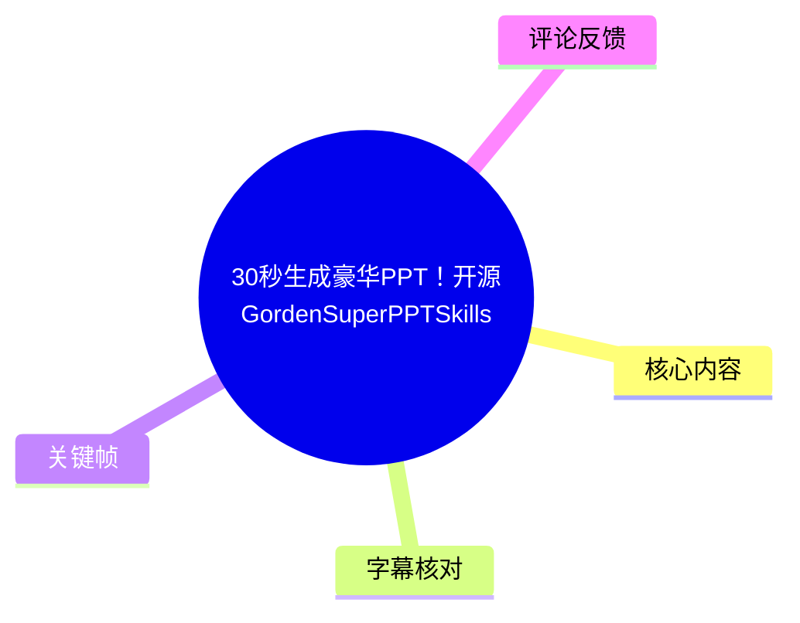
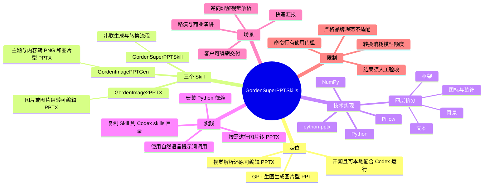
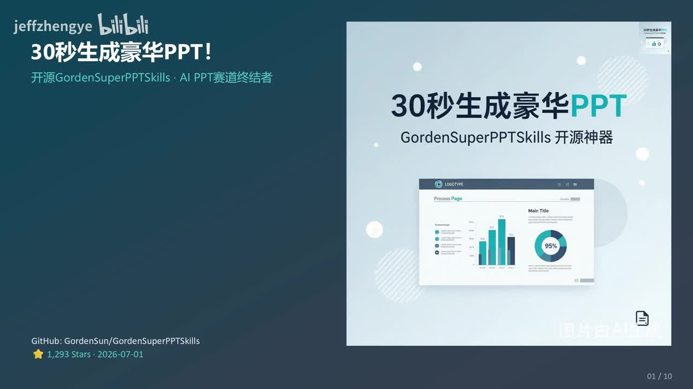
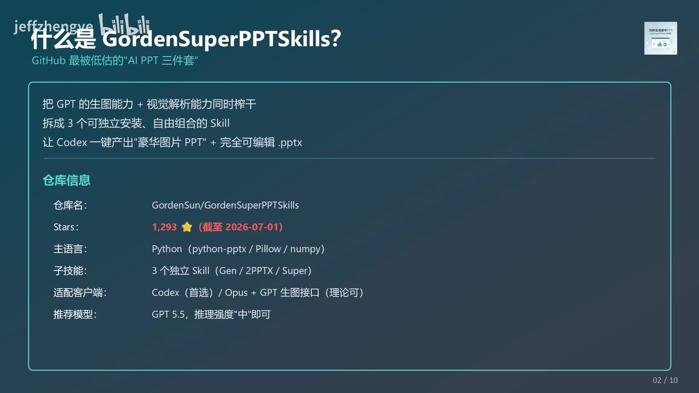
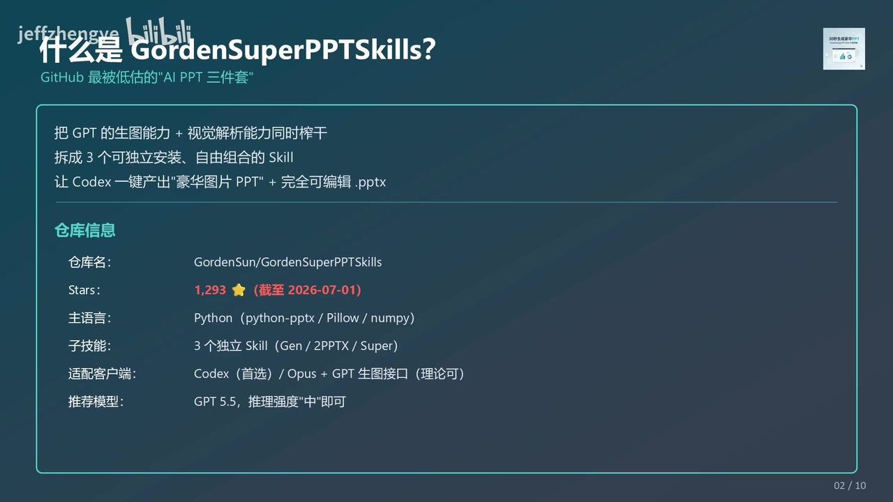

# 30秒生成豪华PPT！开源GordenSuperPPTSkills

> 来源：[Bilibili 视频](https://www.bilibili.com/video/BV1Y4Te6MENF)<br>
> UP 主：jeffzhengye｜发布时间：2026-07-01｜视频时长：09:34｜分辨率：1920×1080  
> 项目地址：<https://github.com/GordenSun/GordenSuperPPTSkills>

## 小结

视频介绍了 GitHub 开源项目 **GordenSuperPPTSkills**。其核心思路并非直接用传统模板拼装 PPT，而是分两步利用 AI 能力：先借助 GPT 的生图能力生成视觉效果较强的图片型幻灯片，再通过视觉解析将图片拆解并重建为可编辑的 `.pptx` 文件。UP 主将其概括为“AI PPT 三件套”，并认为其优势在于视觉冲击力、信息密度和后续编辑能力。

项目由三个可独立安装、按需组合的 Skill 构成：`GordenImagePPTGen` 生成图片型 PPT，`GordenImage2PPTX` 把单张或多张图片还原为可编辑 PPTX，`GordenSuperPPTSkill` 则将前两者串成“先生成、再转换”的一键流程。视频称项目以 Python 为主，涉及 `python-pptx`、Pillow、NumPy，优先适配 Codex；并建议使用 GPT 5.5、推理强度设为“中”。

工作流的关键技术点是“四层拆分”：背景、框架、图标/装饰、文本。转换过程中，模型先理解图片中的页面视觉结构与元素坐标，再由 `python-pptx` 按坐标重组为 PPTX。视频据此主张文本框和图标可独立调整；但“完全可编辑”不等于完全忠实地恢复原设计源文件，复杂字体、素材版权、精确排版和品牌规范仍需人工验收。

视频所称“30 秒生成”“AI PPT 赛道终结者”“五星视觉豪华度”“重度用户可节省 90%+ 订阅费”等均是 UP 主的宣传性判断或经验性说法，不应视为已独立验证的性能基准。视频中明确的额度限制是：图片转可编辑 PPTX 较耗额度，转换一张图片约消耗 Plus 订阅 5 小时额度的 **10%**，因此应按需进行转换。

适用对象包括需要快速制作路演、商业演讲、汇报、招商材料的职场用户，以及希望“AI 出初稿、设计师再修改”的团队和 AI Agent/Skill 玩家。对于必须严格遵守 4A 级品牌规范、复杂企业视觉系统，或不具备 Codex/命令行使用基础的人，视频建议改走专业设计工作流或设计师方案。

时效方面，视频中的仓库数据为 **截至 2026-07-01 的 1,293 Stars**；仓库活跃度、模型名称、接口可用性、依赖版本、价格和额度规则都可能随后变化，应以 GitHub 仓库及当前模型服务说明为准。

## 思维导图





## 目录

- [项目背景与核心承诺](#项目背景与核心承诺-0000)
- [项目结构：三个可组合的 Skill](#项目结构三个可组合的-skill-0050)
- [输入、输出与按需选装](#输入输出与按需选装-0140)
- [五分钟跑通：安装与调用步骤](#五分钟跑通安装与调用步骤-0200)
- [场景一：快速生成图片型路演 PPT](#场景一快速生成图片型路演-ppt-0300)
- [场景二：图片逆向为可编辑 PPTX](#场景二图片逆向为可编辑-pptx-0400)
- [场景三：观察视觉解析的四层结构](#场景三观察视觉解析的四层结构-0450)
- [与主流 AI PPT 方案的比较](#与主流-ai-ppt-方案的比较-0505)
- [结论、限制与时效性](#结论限制与时效性-0850)
- [字幕比对](#字幕比对-0000)
- [评论分析](#评论分析-0000)
- [处理记录](#处理记录-0000)

## 项目背景与核心承诺 [00:00](https://www.bilibili.com/video/BV1Y4Te6MENF?t=0)

UP 主首先将常见 AI PPT 工具的问题概括为：模板化程度高、信息密度偏低、排版单调、视觉冲击力较弱。视频提出的替代路径是：

1. 用 GPT 的图像生成能力，直接生成“豪华图片版 PPT”；
2. 再用视觉解析能力理解页面图像；
3. 将识别出的背景、结构、图标和文字按坐标重组；
4. 输出可继续编辑的 `.pptx` 文件。

这里的“图片型 PPT”是指页面主体首先以图像形式生成，而不是一开始就以原生 PPT 文本框、形状与图表搭建。其优点是容易获得较复杂的视觉布局；其代价是若需要在 PowerPoint 内修改内容，还要额外经过逆向转换步骤。



> 图：封面展示“30秒生成豪华PPT”及项目名称，并标注仓库地址、1,293 Stars 和“截至 2026-07-01”。它用于界定视频的宣传目标与数据时点；“30 秒”是标题级主张，视频未提供可复现的计时过程或硬件、页数、提示词长度等测试条件。

视频称该项目来自 GitHub 用户 **GordenSun**，仓库为 `GordenSun/GordenSuperPPTSkills`。名称在素材中存在 `Gorden` 与 ASR 误识别出的 `Golden` 两种写法；以视频描述、封面和项目链接中的 **Gorden** 为准。

## 项目结构：三个可组合的 Skill [00:50](https://www.bilibili.com/video/BV1Y4Te6MENF?t=50)

项目的目标是将“生成视觉效果”与“恢复可编辑性”拆为可组合模块，而不是要求每位用户都运行全流程。视频列出的三个子技能如下：

| 子技能 | 主要职责 | 输入 | 输出 | 是否可独立安装 |
| --- | --- | --- | --- | --- |
| `GordenImagePPTGen` | 生成图片格式的 PPT 页面 | 主题、内容、页数、风格要求 | 每页 1024×1024 PNG、图片型 PPTX | 是 |
| `GordenImage2PPTX` | 将图片 PPT 或单张图片转为可编辑 PPTX | 单张图片或图片组 | 可二次编辑的 `.pptx` | 是 |
| `GordenSuperPPTSkill` | 编排并串联前两者 | 主题、内容等生成需求 | 图片型 PPT + 可编辑 PPTX | 是，作为全流程入口 |



> 图：关键帧列出仓库名、1,293 Stars、主语言 Python、`python-pptx / Pillow / numpy`、三个独立 Skill、首选 Codex，以及建议使用 GPT 5.5、推理强度“中”。该图为视频内参数信息的主要视觉佐证。

视频对技术栈的表述包括：

- **主语言**：Python。
- **依赖库**：`python-pptx`、Pillow、NumPy。
- **优先客户端**：Codex。
- **理论可行的替代组合**：Opus 加 GPT 生图接口；视频仅称“理论上可以跑通”，未展示实际验证。
- **建议模型**：GPT 5.5。
- **建议推理强度**：中。

需要注意：上述模型、客户端和依赖组合是视频作者在该时点的推荐配置，并不构成项目在所有环境中都可运行的保证。使用前应读取仓库的 `README`、Skill 安装文档和当前版本依赖清单。

## 输入、输出与按需选装 [01:40](https://www.bilibili.com/video/BV1Y4Te6MENF?t=100)

视频强调“按需选装”，以避免将不需要的功能全部装入工作流：

- **只需视觉成稿**：安装 `GordenImagePPTGen`。适合演讲、路演、快速展示，重点是生成较高视觉密度的页面。
- **只需图片转可编辑**：安装 `GordenImage2PPTX`。适合客户要求交付可编辑版本、需要基于现有图片二次修改，或研究图片型幻灯片的结构。
- **需要一条龙**：安装 `GordenSuperPPTSkill`，先生成页面图像，再转为可编辑 PPTX。

视频对第一项的输出规格明确给出：**每页 1024×1024 PNG** 加图片型 PPTX。该规格意味着它更接近正方形输出；若实际要投放到 16:9 会议屏幕、16:10 笔记本或 A4 打印场景，需在当前项目文档中确认画布比例、是否支持自定义尺寸及转换后的版式适配情况。

## 五分钟跑通：安装与调用步骤 [02:00](https://www.bilibili.com/video/BV1Y4Te6MENF?t=120)

视频将上手流程概括为“5 分钟跑通”。这里的“五分钟”是作者估计，实际耗时会受网络、GitHub 可访问性、Python 环境、Codex 配置、模型接口权限和图像生成时间影响。

### 第一步：让 Codex 安装 Skill

视频建议把 GitHub 仓库地址发送给 Codex，让其自动安装。其口述安装逻辑为：

1. 将三个子 Skill 的目录复制到 Codex 的 `skills` 目录；
2. 安装 Python 依赖；
3. 确保当前环境能够调用所需模型或图像生成接口。

素材仅说明依赖安装使用 `pip3`，未给出仓库内的精确目录层级和完整命令，因此不应臆造具体的复制路径。视频中可确认的依赖是：

```bash
pip3 install python-pptx Pillow numpy
```

> 注意：上述命令仅根据视频点名的三个依赖整理。实际项目可能还有版本约束、额外依赖或操作系统差异，应以仓库提供的 `requirements.txt`、`pyproject.toml` 或安装文档为准。

### 第二步：按任务调用对应 Skill

视频提供两类提示词母版，核心要求包括主题、内容、页数和风格限制。将其整理为不补充虚构参数的可替换写法：

**生成图片型 PPT：**

```text
使用 GordenImagePPTGen 技能生成 N 页 PPT。
内容为：[你的主题与内容]。
要求：豪华、信息密度高、排版复杂。
```

**将图片转为可编辑 PPTX：**

```text
把当前文件夹里的 [文件名].PNG
使用 GordenImage2PPTX 还原成可编辑的 PPT。
```

其中 `[你的主题与内容]`、`N`、`[文件名]` 均需由使用者替换。视频示例中出现的 “triplex” 更像占位主题或文件名，未提供其具体业务含义，因此不作为固定参数。

### 额度与调用策略

视频特别提醒，图片转可编辑 PPTX 比图片生成更耗额度：

- **视频陈述**：转换 1 张图片约耗费 Plus 订阅 5 小时额度的 **10%**。
- **行动建议**：不需要可编辑版本时，不必默认执行转换；先产出图片型 PPT，确认页面后再对需要修改的页面或文件执行转换。
- **未说明部分**：此估算对应的模型套餐、图片复杂度、分辨率、具体调用次数及计费规则均未在素材中展开，不能外推至所有账户或版本。

## 场景一：快速生成图片型路演 PPT [03:00](https://www.bilibili.com/video/BV1Y4Te6MENF?t=180)

第一个推荐场景是路演与商业演讲。用户以自然语言指定：

- 主题；
- 内容；
- 页数；
- 风格描述；
- 对“豪华度”、信息密度、复杂排版的要求。

视频称 Codex 配合 GPT 5.5 可生成高质量图片页面，输出为每页 1024×1024 PNG 与图片型 PPTX。UP 主特别认为这类方法适用于：

- 创业项目路演；
- 24 小时内赶制约 20 页 PPT；
- 年终复盘、季度汇报；
- 需要更强视觉冲击力的招商加盟材料。



> 图：该关键帧明确写出“GPT 生图能力 + 视觉解析能力”、三个可独立组合的 Skill，以及“一键产出豪华图片 PPT + 完全可编辑 .pptx”。它有助于理解为何该方案把“视觉生成”和“可编辑交付”视作两个阶段。

### 这一场景的经验边界

视频的可迁移经验是：当需求优先级为“短时间形成有冲击力的视觉初稿”，图片优先的工作流可能比纯模板型自动排版更合适。

但以下问题仍应由用户验收：

1. **事实准确性**：AI 生成的图表、数字、案例和图像文字可能出错。
2. **投影可读性**：所谓高信息密度可能在投影、远距离观看或小屏幕上降低可读性。
3. **版权与商用**：生成图片、图标、字体与素材的使用权需按实际模型服务条款和企业合规要求处理。
4. **版式比例**：视频给出的 1024×1024 不必然适配常见宽屏演示。
5. **“30 秒”条件**：没有展示页面数量、重试次数、模型排队时间或网络条件，不宜将其作为稳定 SLA。

## 场景二：图片逆向为可编辑 PPTX [04:00](https://www.bilibili.com/video/BV1Y4Te6MENF?t=240)

第二个场景是将 AI 生成的图片、图片型 PPT 页面或单张图片，转为可编辑的 `.pptx`。视频将其描述为项目的核心创新：模型先“看懂”页面图像，再以可编辑元素形式重建。

视频给出的处理链条为：

1. 输入任意图片 PPT 页面、图片组或单张图片；
2. 将页面拆为可独立调整的层；
3. 识别元素的位置关系与文本坐标；
4. 用 `python-pptx` 按坐标重组各层；
5. 输出可二次编辑的 PPTX。

四层结构如下：

| 图层 | 视频中的含义 | 重建后的潜在编辑用途 |
| --- | --- | --- |
| 背景 | 页面整体视觉基调 | 替换底图、调整色彩与底纹 |
| 框架 | 页面结构、模块划分 | 调整卡片、区块、容器和布局 |
| 图标/装饰 | 视觉锤、点缀元素 | 移动、替换或删除装饰素材 |
| 文本 | 经坐标定位的文字内容 | 修改文案、字号、位置等 |

视频列举的适用需求包括：

- 客户要求提供可编辑文件；
- 定稿后仍有二次修改；
- 企业内部需按设计规范调整；
- 对图片型 PPT 进行逆向还原。

“每个文本框、每个图标都可以独立调整”是视频对输出效果的描述。实际可编辑程度取决于视觉模型能否正确识别文字、图形边界、层级、字体与图标；图像中的复杂渐变、混合效果、裁剪、表格、公式、异形蒙版或不可识别文字，都可能导致还原结果与原图不完全一致。

## 场景三：观察视觉解析的四层结构 [04:50](https://www.bilibili.com/video/BV1Y4Te6MENF?t=290)

除交付 PPTX 外，视频还将 `GordenImage2PPTX` 用于“逆向工程”：在还原过程中输出背景、框架、图标装饰、文本等图层，使用户能够观察模型如何将一个完整页面拆成可操作对象。

视频认为这对 AI 开发者和希望研究视觉解析工作流的人有教学价值，具体价值包括：

- 提取可复用的背景、框架与图标组织方式；
- 理解 AI 对页面层级与结构模块的识别逻辑；
- 观察“视觉理解 → 坐标定位 → PPT 重建”的实现路径；
- 将其作为设计工作流研究案例，而非仅作为成品生成工具。

需要区分的是：图层输出展示的是该工具对图像的**推断性拆分结果**，并不是原始设计文件的真实图层。对于“逆向还原竞品 PPT”的用途，还应遵守版权、商业秘密和不正当竞争相关约束；可将其用于学习布局规律或内部研究，但不应默认获得原作品的复制、再发布或商业使用授权。

## 与主流 AI PPT 方案的比较 [05:05](https://www.bilibili.com/video/BV1Y4Te6MENF?t=305)

视频将该项目与 Gamma、Beautiful.ai、微软 Copilot 等方案并列比较。以下表格忠实整理视频口径，不将星级、产品功能范围或定价判断视为独立事实验证：

| 比较维度 | GordenSuperPPTSkills | Gamma | Beautiful.ai | Microsoft Copilot |
| --- | --- | --- | --- | --- |
| 开源属性 | 视频称“完全开源” | 视频归为闭源 SaaS | 视频归为闭源 SaaS | 视频归为闭源 SaaS |
| 可编辑 PPTX | 视频称“完全可二次编辑” | 视频称“仅部分” | 视频称“模板限制” | 视频称“可编辑” |
| 视觉豪华度 | 视频给出五星，归因于 GPT 出图 | 视频给出四星 | 视频给出四星 | 视频给出三星 |
| 排版复杂度 | 视频给出五星，称信息密度高 | 视频给出三星 | 视频给出三星 | 视频给出二星 |
| 本地运行 | 视频称支持“本地 + Codex” | 视频称仅 Web | 视频称仅 Web | 视频称仅 Web |

这张对比表体现的是 UP 主的评价框架：以生成视觉复杂度、可编辑性、开源性和本地运行能力为核心指标。实际选型时还应增加视频未量化的指标：

- 企业账号、协作、审计和权限控制；
- 中文排版稳定性；
- 模板与品牌资产管理；
- 数据安全与模型数据处理政策；
- PowerPoint 原生动画、图表、演讲者备注支持情况；
- 导出兼容性和跨平台编辑效果；
- 单页成本、并发速度、失败重试与技术支持。

## 结论、限制与时效性 [08:50](https://www.bilibili.com/video/BV1Y4Te6MENF?t=530)

视频的结论是：GordenSuperPPTSkills 通过“GPT 生图 + 视觉解析”绕开传统 AI PPT 依赖简化模板的局限，将产物定位为高视觉密度、可再编辑的 PPT 工作流。其最有价值的并非单纯生成幻灯片，而是把**先获得视觉初稿**和**后续结构化编辑**连接起来。

### 视频推荐的适合人群

- 经常制作路演、汇报、商业演讲材料的职场用户；
- 熟悉或愿意使用 Codex、Skill、Python 环境的 AI 工具玩家；
- 需要“AI 先出稿、设计师再精修”的团队；
- 希望研究图像到 PPT 逆向解析工作流的开发者。

### 视频指出的不适合人群

- 有强 4A 级品牌规范、严格视觉一致性要求的项目；
- 无法接受 AI 生成结果需要人工检查和返工的交付场景；
- 不会使用 Codex 或命令行、也不愿配置环境的用户。

### 关键限制清单

1. **模型与额度成本**：图片转可编辑 PPTX 被明确提示为高额度步骤；视频给出的单图约 10% 额度仅为经验值。
2. **编辑不等于无损还原**：从最终渲染图逆向得到的结构，本质上是视觉推断，不保证恢复原始字体、素材、图层关系和动画。
3. **严格品牌项目仍需设计流程**：视频自己也建议强品牌规范需求走专业设计师。
4. **提示词和内容质量决定结果**：生成器不能替代资料核实、逻辑结构设计与数据校对。
5. **环境门槛**：需要处理 GitHub、Codex、Skill 安装、Python 依赖和模型接口等配置。
6. **宣传性指标未验证**：标题中的“30 秒”、视频中的“赛道终结者”“五星”“节省 90%+”均缺乏素材内的统一测试方法与完整对照数据。

### 时效性说明

- 视频中的 Stars 数据：**1,293**。
- 数据截止日期：**2026-07-01**。
- 本素材抓取时间：2026-07-13。
- 项目版本、仓库 Stars、模型可用性、Codex 功能、订阅额度和 API 计费均可能变动。
- 最终应以 [GordenSun/GordenSuperPPTSkills](https://github.com/GordenSun/GordenSuperPPTSkills) 当前文档为准。

## 字幕比对 [00:00](https://www.bilibili.com/video/BV1Y4Te6MENF?t=0)

本次任务中**站内字幕存在，且本次 ASR 已执行**。整理正文时以站内字幕为主要文本来源，并用视频描述、关键帧与上下文校正专有名词；ASR 主要用于交叉核对段落语义，不作为专名的优先依据。

| 字幕来源 | 完整性 | 专有名词 | 时间轴 | 主要问题 |
| --- | --- | --- | --- | --- |
| Bilibili 站内字幕 | 较完整，覆盖开场、结构、步骤、场景、对比和总结 | 中等，存在“Golden / Gorden”“PPTS / PPTX”等转写混乱 | 未提供逐句时间戳 | 部分英文名称音译或识别不稳定；“python-pptx”等依赖名称出现变形 |
| 本次 ASR 字幕 | 覆盖整体内容，但缺字、断句和重复较多 | 较弱，专名误识别明显 | 未提供可靠逐句时间戳 | 出现“Golden Image PPT站”“GordonSuperPPT Scale”“RPPTX”“PBTX”“币源 SaaS”等误识别，且有乱码、截断与重复 |

### 最终采用与校正原则

- 项目名采用：`GordenSuperPPTSkills`。
- 仓库作者/组织采用：`GordenSun`。
- 三个模块采用视频描述中的：`GordenImagePPTGen`、`GordenImage2PPTX`、`GordenSuperPPTSkill`。
- 输出扩展名统一校正为：`.pptx`。
- Python 库统一校正为：`python-pptx`、Pillow、NumPy。
- 模型名称采用视频明确口述与关键帧中出现的：GPT 5.5；但其真实性、官方命名与当前可用性不在本素材内独立验证。
- 关键帧中的仓库信息页确认了 `GordenSun/GordenSuperPPTSkills`、Python 及依赖、三个 Skill、Codex 和 GPT 5.5 等关键信息，因此优先于 ASR 中的同音或错拼形式。

## 评论分析 [00:00](https://www.bilibili.com/video/BV1Y4Te6MENF?t=0)

仅处理可获取热评前三条。当前可获取评论数为 3 条，点赞数均较低，不能代表普遍用户评价，也不构成对项目功能的验证。

1. **@petergorww：「加油」**（1 赞）  
   - 观点：表达对作者或项目介绍的支持。  
   - 补充信息：无具体使用体验、技术问题或项目证据。  
   - 可信度判断：属于情感性互动，不能据此推断工具质量或可用性。

2. **@-豆沙可可-：「有多少人能意识到很多时候做ppt是有模板要求的[辣眼睛]」**（0 赞）  
   - 观点：指出许多真实 PPT 制作场景受模板、品牌规范或既有格式约束。  
   - 与视频的关系：这与视频最后所称“强 4A 品牌规范需求建议走专业设计师”相呼应，也提示“视觉豪华”并非唯一选型指标。  
   - 可信度判断：这是合理的场景提醒，但评论未说明所属行业、具体模板要求及该项目是否支持模板锁定，不能进一步推断兼容性。

3. **@天天早起害人：「token爆炸」**（0 赞）  
   - 观点：担忧图像生成、视觉解析或多页转换可能带来较高 Token/额度消耗。  
   - 与视频的关系：视频确实提示图片转可编辑 PPTX 比较耗额度，并给出单张图约消耗 Plus 5 小时额度 10% 的说法。  
   - 可信度判断：评论提出了真实风险方向，但没有调用日志、账单或具体页数，无法量化实际成本。应以当前模型平台计费规则和自身试跑结果为准。

## 处理记录 [00:00](https://www.bilibili.com/video/BV1Y4Te6MENF?t=0)

- Worker ID：`worker-mrj0www4-e8d79408`
- 模型：`gpt-5.6-terra`
- 调用工具与素材：任务提供的视频元数据、视频描述、Bilibili 站内字幕、本次 ASR 字幕、热评 JSON、关键帧清单与已提供的关键帧图像。
- 使用的应用工具：素材解析结果已包含视频、音频、关键帧、字幕、ASR 和评论产物；本次整理未执行仓库联网验证、代码安装或模型接口调用。
- 字幕选择：站内字幕为主，ASR 已执行并用于交叉核对；对明显误识别的项目名、模块名、扩展名和依赖名，依据视频描述、关键帧文字和上下文进行了校正。
- 关键帧选择依据：
  - `frames/frame-001.jpg`：展示标题、项目定位、仓库地址、Stars 与数据截止日期，适合支撑开场与时效说明。
  - `frames/frame-003.jpg`：展示仓库名、Python 依赖、三个 Skill、Codex 与模型建议，适合支撑技术栈和项目结构。
  - `frames/frame-004.jpg`：展示“生图 + 视觉解析 → 图片 PPT + 可编辑 PPTX”的核心链路，适合解释工作流。
- 未选用其余关键帧的原因：当前提供可见图像中，以上帧对项目身份、技术参数与核心流程的信息密度最高；未在未见内容的帧上推断画面信息。
- 评论范围：严格限于可获取热评前三条，未扩展到其他评论。
- 缓存清理：素材目录及其 `merged.mp4`、音频、关键帧、字幕、ASR、评论产物由上游任务生成；本次仅基于提供内容撰写，未产生可报告的额外缓存文件，未执行删除操作。
- 未解决问题：
  - 未联网核验 GitHub 仓库当前版本、许可证、安装目录、实际 API 要求与依赖版本。
  - 未验证“30 秒”生成时间、GPT 5.5 可用性、转换成功率、PPTX 编辑完整度及成本估算。
  - 视频未提供逐句字幕时间码，正文时间轴按视频段落内容定位，适用于跳转阅读而非逐字级校对。

## 评论分析

本次流程未获取到可用热评，因此不推断观众态度或额外结论。
