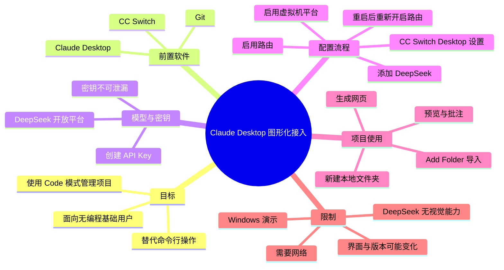
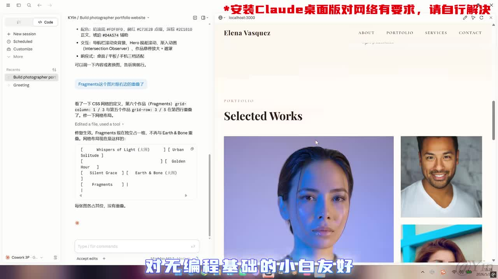
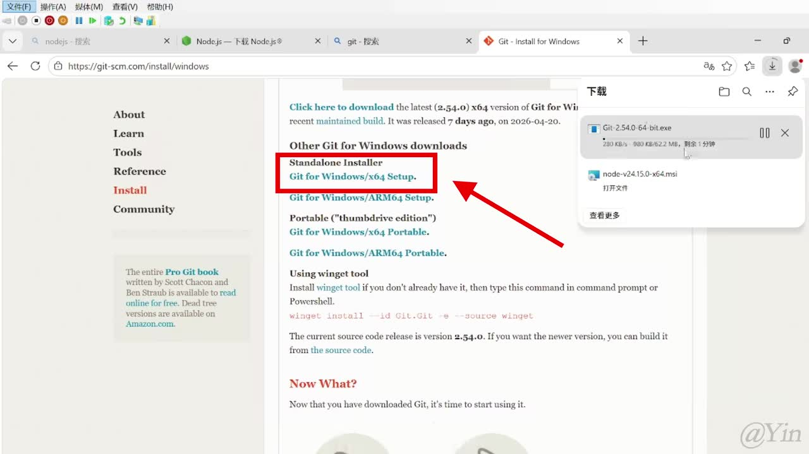
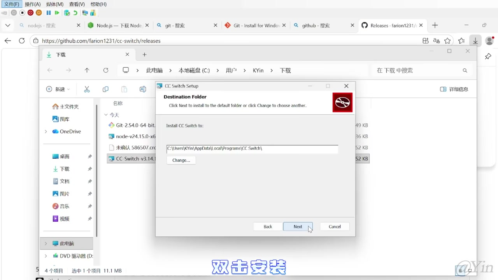
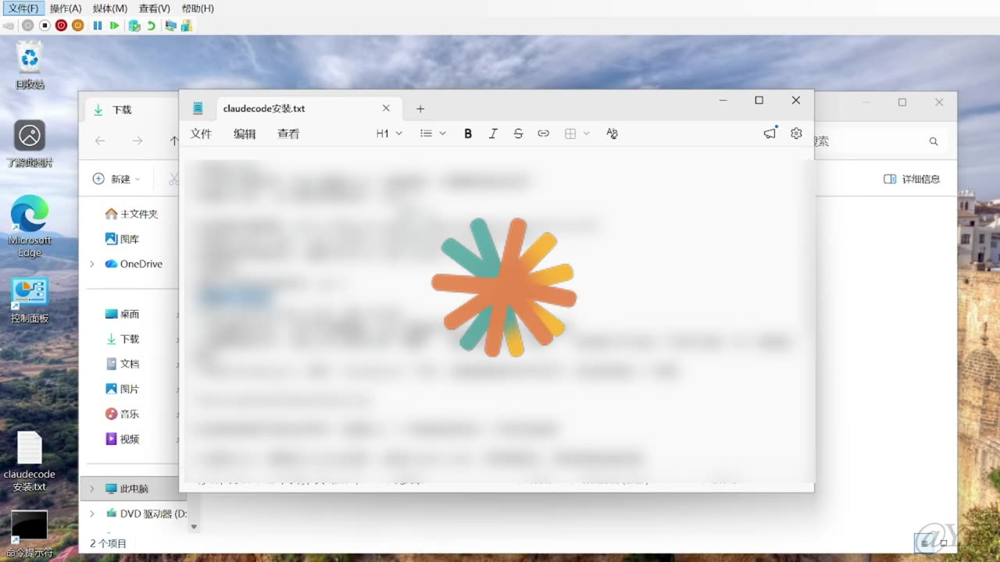

# 命令行不好看？4分钟学会安装Claude桌面版

> 来源：[Bilibili 视频](https://www.bilibili.com/video/BV1kCLb68ERZ) 
> UP 主：Yin_Code｜分区合集：AIcode｜视频时长：04:25｜画面规格：1920×1080  
> 视频简介：命令行太难看？学会安装 Claude 桌面版只需 4 分钟。

## 小结

视频演示了一条在 **Windows** 上使用 Claude Desktop 图形界面的安装与接入路径：先安装 Git、CC Switch，并在 DeepSeek 开放平台创建 API Key；再安装 Claude Desktop；最后通过 CC Switch 将 DeepSeek 配置为可用路由，并在 Claude 的 Code 模式中导入本地文件夹、生成网页和进行页面批注。

相较于 CLI，视频将 Claude Desktop 的价值定位为：提供 GUI 操作，降低无编程基础用户的使用门槛。最终展示中，左侧为对话与代码任务区，右侧会打开网页预览；预览页面支持通过右上角的笔形按钮进入批注流程。

关键依赖不是 Claude Desktop 单独安装即可完成：视频方案还依赖 **Git、CC Switch、DeepSeek API Key、路由功能，以及 Windows 虚拟机平台**。其中，启动 Claude 后若 Cowork 提示“虚拟机平台未启动”，需要在软件提示中启用该功能、等待资源下载并重启电脑。

安全与成本风险明确：DeepSeek API Key 在创建后必须立即复制，关闭页面后不能再次查看；密钥不可泄漏，否则调用费用可能由密钥所有者承担。视频画面还以红字提示安装 Claude Desktop 对网络有要求。

本视频是特定工具版本下的演示。CC Switch 的界面、Claude Desktop 的安装包、可导入的配置选项、模型列表和 Windows 功能启用行为均可能随版本更新发生变化。视频仅明确说明 DeepSeek “没有视觉能力”，因此未演示图像理解相关能力。

## 思维导图

## 目录

- [背景、目标与适用边界](#背景目标与适用边界)
- [第一步：安装运行所需软件](#第一步安装运行所需软件)
- [第二步：安装 Claude Desktop](#第二步安装-claude-desktop)
- [第三步：配置 CC Switch 与 Windows 虚拟机平台](#第三步配置-cc-switch-与-windows-虚拟机平台)
- [第四步：导入项目并使用 Code 模式](#第四步导入项目并使用-code-模式)
- [关键参数、限制与时效性](#关键参数限制与时效性)
- [字幕比对与术语校正](#字幕比对与术语校正)
- [评论分析](#评论分析)
- [处理记录](#处理记录)

## 背景、目标与适用边界 [00:00](https://www.bilibili.com/video/BV1kCLb68ERZ?t=0)

视频开头将 Claude Desktop 描述为区别于 CLI 的桌面应用：它提供 GUI 界面，操作更直观，并被定位为对没有编程基础的用户更友好。UP 主明确表示，即使没有安装或使用过 Claude Code，也可以跟随视频操作。

该教程实际演示的是一套 Windows 环境下的组合方案，而不是单纯安装官方桌面客户端：

1. 安装 Git；
2. 安装 CC Switch；
3. 在 DeepSeek 开放平台创建 API Key；
4. 安装 Claude Desktop；
5. 在 CC Switch 中将 DeepSeek 加入 Desktop 配置并启用路由；
6. 处理 Claude Cowork 所需的 Windows 虚拟机平台；
7. 使用 Claude Desktop 的 Code 模式导入本地项目文件夹。

> 图：该画面展示了视频最终想达到的使用形态：左侧为 Claude Desktop 的 Code 对话区，右侧为本地网页预览。顶部红字提示“安装 Claude 桌面版对网络有要求，请自行解决”，补充了口播中未展开的网络依赖条件。

## 第一步：安装运行所需软件 [00:00](https://www.bilibili.com/video/BV1kCLb68ERZ?t=0)

### 1. 安装 Git [00:00](https://www.bilibili.com/video/BV1kCLb68ERZ?t=0)

视频首先要求安装 Git。操作路径为：

1. 在浏览器中搜索 Git，进入官网；
2. 向下滚动至 Windows 安装区域；
3. 进入下载链接后，选择与电脑架构相符的安装包；
4. 演示机选择的是 **Windows x64**；
5. 下载完成后双击安装，按视频说法“一路下一步”完成安装；
6. 按 `Win` 键，输入 `CMD` 并回车，打开命令提示符；
7. 输入视频中展示的版本查询命令；若能显示版本号，则视为安装成功。

视频没有在可可靠读取的字幕中保留完整命令文本，关键帧中的命令区域也经过模糊处理，因此不能据此补写具体命令。其验证目标明确是：**命令执行后出现 Git 版本号**。

> 图：画面定位到 Git 官网 Windows 下载页，并用红框和箭头标出“Git for Windows/x64 Setup”。它直接说明本视频演示环境选择的是 x64 安装包，而非 ARM64 或便携版。

### 2. 安装 CC Switch [00:38](https://www.bilibili.com/video/BV1kCLb68ERZ?t=38)

Git 安装成功后，视频引入 CC Switch，称其用途是将“自己的模型”接入 Claude Desktop。视频给出的安装步骤为：

1. 打开 GitHub，搜索 **CC-Switch**；
2. 进入对应仓库；
3. 下滑并点击右侧的 **Release / Releases**；
4. 在发布列表中选择适合系统的安装包；
5. 演示选择 **Windows MSI**；
6. 下载完成后双击安装，并继续按安装向导完成安装。

> 图：画面同时显示 CC Switch 的 GitHub Releases 页面、下载目录与安装向导；安装包文件名区域可见 CC-Switch 版本信息，但不宜将画面中的具体版本号视为当前推荐版本。该图的价值在于确认视频确实通过 Releases 下载 Windows 安装器，并非通过命令行安装。

### 3. 创建 DeepSeek API Key [01:03](https://www.bilibili.com/video/BV1kCLb68ERZ?t=63)

视频接着进入 DeepSeek 官网，并使用开放平台的 API Key 页面获取密钥：

1. 打开 DeepSeek 官网；
2. 选择 **API 开放平台**；
3. 进入右侧的 **API Keys**；
4. 滑至页面底部，点击创建 API Key；
5. 为密钥填写名称，视频称名称可自行填写；
6. 点击创建；
7. 在弹出的新页面中复制密钥。

视频特别强调两个约束：

- **必须在创建后的展示页面复制密钥**：关闭页面后不能再次获取原密钥，只能重新创建。
- **不要泄漏密钥**：UP 主以“否则花的是你的钱”提示 API 调用可能产生费用及密钥滥用风险。

> 图：该关键帧展示了 Windows 桌面、命令提示符及安装说明文档，但文档中的关键内容被模糊遮挡。因此它可用于确认视频存在命令行验证步骤，不能用于恢复或推断被遮挡的命令、密钥或配置文本。

## 第二步：安装 Claude Desktop [01:27](https://www.bilibili.com/video/BV1kCLb68ERZ?t=87)

视频的第二步是安装 Claude Desktop：

1. 打开 Claude 官网；
2. 在官网中点击 **Download**；
3. 视频称官网会自动选择与操作系统匹配的安装包；
4. 等待下载完成后点击安装；
5. 安装过程中，客户端会继续下载资源，需等待其完成；
6. 安装结束后，必须**完全退出 Claude**，再进行 CC Switch 配置。

完全退出的操作路径为：

1. 点击 Windows 任务栏右侧的上箭头，查看隐藏图标；
2. 找到 Claude 图标；
3. 点击图标并选择 **Quit / 退出**。

这里“完全退出”是后续配置步骤的前置条件。视频没有解释其内部原因，但从操作顺序看，应避免 Claude Desktop 在配置写入或路由切换时仍占用运行状态。

## 第三步：配置 CC Switch 与 Windows 虚拟机平台 [02:15](https://www.bilibili.com/video/BV1kCLb68ERZ?t=135)

### 1. 更新并进入 Desktop 设置 [02:15](https://www.bilibili.com/video/BV1kCLb68ERZ?t=135)

打开已安装的 CC Switch 后，视频要求：

1. 在主页下方选择 **Claude Desktop** 图标；
2. 如果没有该图标，说明可能不是最新版；
3. 进入主页设置并更新到最新版本；
4. 进入 **Desktop 设置**。

视频提示，不同用户首次进入时可能遇到“导入 Claude Code 配置”一类的两个选项；UP 主称任意选择一个即可。由于视频未解释两个选项的语义和影响，这里只能记录其作为演示中的操作建议，不能把它视为对所有版本均成立的配置原则。

### 2. 添加 DeepSeek 并启用路由 [02:15](https://www.bilibili.com/video/BV1kCLb68ERZ?t=135)

在 Desktop 设置中，视频按以下顺序配置：

1. 点击右上角的加号；
2. 在服务商列表中选择 **DeepSeek**；
3. 滑到下方，在 **API Key** 栏填入刚才复制的密钥；
4. 到模型选择区域，将视频所示的后续模型项全部勾选；
5. 点击右下角的“添加”；
6. 回到主页，进入路由按钮；
7. 启用 **DeepSeek**。

ASR 在模型勾选处识别为“把后面的 EM 都勾选上”，该词缺乏可靠语义，无法确认具体是模型名称、开关名称还是识别错误。因此可确定的操作仅为：**在模型区域勾选视频展示的可选项后添加**，不能据此列出模型名称或数量。

### 3. 首次启动：启用虚拟机平台 [02:39](https://www.bilibili.com/video/BV1kCLb68ERZ?t=159)

完成路由设置后：

1. 按 `Win` 键搜索 Claude；
2. 点击 Claude 图标启动；
3. 视频称此时可以跳过登录步骤；
4. 若界面提示“虚拟机平台没有启动”，将鼠标移动到 **Claude Work / Cowork** 一栏；
5. 在出现的新提示中点击 **Enable**；
6. 在系统提示中选择 **Yes**；
7. 等待系统自动启用虚拟机平台并下载相关资源；
8. 可再次将鼠标移至 Cowork 区域查看进度；
9. 下载安装完成后，按提示重启电脑。

视频在此处的产品名称口播与 ASR 转写存在混淆，“Cloud Work”应结合上下文理解为 Claude 的 Cowork 区域；但具体 UI 文案可能因版本不同而变化。

### 4. 重启后的必要动作与连接测试 [03:03](https://www.bilibili.com/video/BV1kCLb68ERZ?t=183)

重启完成后，视频给出的顺序是：

1. 打开 CC Switch；
2. 再次开启路由功能；
3. 按 `Win` 键搜索并启动 Claude；
4. 在输入框中随便发送一条内容，测试是否已经连上 CC Switch。

其中最关键的经验是：**电脑重启后，使用 Claude 前需要重新开启 CC Switch 的路由功能，否则配置不会生效。** 这是视频明确强调的运行条件。

## 第四步：导入项目并使用 Code 模式 [03:27](https://www.bilibili.com/video/BV1kCLb68ERZ?t=207)

完成安装与连接测试后，视频演示了 Code 模式的基础项目操作：

1. 在本地新建一个文件夹，名称可任意；
2. 返回 Claude Desktop；
3. 切换至 **Code** 模式；
4. 点击输出框下方的加号；
5. 选择 **Add Folder**；
6. 在弹出窗口中选择刚才创建的文件夹；
7. 将该文件夹作为项目文件夹导入。

导入完成后，视频在输入框中让 Claude “做一个个人网页”，发送请求后等待生成。演示结果是窗口右侧自动打开网页预览页面。

> 图：右侧浏览器预览显示个人摄影师作品集网页，左侧记录了需求与生成过程。它说明视频所称“右侧自动打开预览页面”是一个可视化工作流：对话、文件任务和效果预览在同一桌面应用中协同出现。

视频还展示了预览后的修改方式：

1. 点击预览页面右上角的笔形按钮；
2. 直接在页面上进行批注；
3. 提交批注后，内容会自动进入输入框；
4. 用户可据此继续让模型修改。

UP 主将这一点概括为 Claude Desktop 的强大之处：用户不必手动把页面问题重新组织成长文本提示词，可以用预览中的批注衔接下一轮修改。

## 关键参数、限制与时效性 [03:51](https://www.bilibili.com/video/BV1kCLb68ERZ?t=231)

### 视频中可确认的参数与选择

| 项目 | 视频中的选择或行为 | 说明 |
| --- | --- | --- |
| 操作系统 | Windows | 全流程均在 Windows 桌面环境演示。 |
| Git 安装包 | Windows x64 | 仅为演示机选择；应按本机架构选择。 |
| CC Switch 安装包 | Windows MSI | 视频通过 GitHub Releases 获取。 |
| 模型服务商 | DeepSeek | 通过 CC Switch 接入 Claude Desktop。 |
| 授权凭据 | DeepSeek API Key | 创建后需立即复制，且不得泄漏。 |
| Claude 使用模式 | Code | 用于添加本地文件夹、生成网页和预览。 |
| 项目导入方式 | `Add Folder` | 将新建的本地文件夹导入为项目文件夹。 |
| 系统能力 | 虚拟机平台 | Cowork 首次启用时可能要求开启并重启。 |

### 技术限制与风险

- **网络条件**：关键帧明确提示 Claude Desktop 安装对网络有要求；视频未提供网络故障的官方解决方案。
- **仅演示 Windows**：Git x64、MSI 安装器、任务栏隐藏图标、Windows 虚拟机平台等步骤均具有平台依赖性，不能直接套用到 macOS 或 Linux。
- **路由依赖**：该流程是否可用依赖 CC Switch 路由处于开启状态；视频说明重启后需要再次开启。
- **密钥安全与成本**：API Key 一旦泄漏可能被他人调用并产生费用；创建页关闭后无法回看同一个密钥。
- **视觉能力限制**：视频结尾明确称 DeepSeek 没有视觉能力，因此未演示视觉相关功能。该陈述针对视频中使用的模型接入方案，不应泛化为所有 DeepSeek 产品或版本的永久能力结论。
- **未展示的验证项**：视频未展示模型名称、费用、上下文限制、调用额度、请求失败重试、代理/网络配置细节，以及生成网页对应的完整文件改动。

### 时效性判断

视频素材中的 Git 下载页可见当时版本信息，CC Switch 的 Releases 页面也可见版本号，但这些均属于录制时界面，不构成当前版本建议。Claude Desktop、CC Switch、DeepSeek API 平台和 Windows 的系统能力开关可能更新，因此实际操作时应以各软件当前官网、Release 说明和系统提示为准。

视频标题称“4分钟”，实际素材时长为 **265 秒（04:25）**；ASR 最后语音结束于 04:23.810。标题中的“4分钟”应理解为概略宣传语，而非精确时长。

## 字幕比对与术语校正 [00:00](https://www.bilibili.com/video/BV1kCLb68ERZ?t=0)

| 字幕来源 | 完整性 | 专有名词 | 时间轴 | 主要问题 |
| --- | --- | --- | --- | --- |
| Bilibili 站内字幕 | 未提供可用字幕 | 无法核验 | 无法使用 | 素材记录显示字幕工具因 `Invalid URL` 退出，未获得站内字幕。 |
| 本次 ASR 字幕 | 较完整；12 段，语音覆盖约 254.55 秒，占视频约 96.33% | 存在较多同音/形近误识别 | 可用；提供精确 SRT 起止时间 | 将 Claude 频繁识别为“Cloud”，将 CMD、DeepSeek、API、Quit、Cowork 等词识别不稳定；部分配置文本不清。 |

本次 ASR 使用中文识别，语言置信度为 `0.990234375`；诊断显示存在音频流，且没有 `noAudioStream=true` 标记。因此本整理以 **本次 ASR 的 SRT 时间轴** 为章节定位依据，并结合标题、上下文和关键帧进行有限术语校正。

重要校正如下：

| ASR 形式 | 本文采用的写法 | 校正依据 |
| --- | --- | --- |
| Cloud 桌面版 / Cloud | Claude Desktop / Claude | 视频标题、描述、画面界面与后文 Claude Code、Claude 图标上下文一致。 |
| CND | CMD | ASR 段落明确描述按 Win 后打开命令提示符。 |
| CC-Switch / CCS switch | CC Switch | GitHub 页面和安装器画面可见 CC Switch 名称。 |
| Deepseq | DeepSeek | 视频标签、开放平台/API Key 语境及后续路由名称一致。 |
| ABI 开放平台 | API 开放平台 | 与 API Keys 页面操作上下文一致。 |
| Quid | Quit | 用于完全退出 Claude 的托盘菜单语境。 |
| Cloud Work | Cowork | Claude 启动后的功能区语境；具体 UI 名称仍可能随版本改变。 |

以下内容**未作强行校正**：

- Git 版本验证命令：原始画面文字被模糊，ASR 也未保留命令，不能补全。
- 模型勾选项：ASR 中的“EM”没有可靠对应名称，无法确认到底勾选了哪些模型。
- CC Switch、Claude Desktop、Git 的具体版本号：关键帧可能包含录制时版本信息，但不能代表当前可用或推荐版本。

## 评论分析 [03:03](https://www.bilibili.com/video/BV1kCLb68ERZ?t=183)

素材请求热评前三条，但实际仅返回 **2 条**可获取热评；以下不将评论内容视作已验证事实。

1. **爱从西元前开始（16 赞）**  
   - 观点：针对虚拟机相关提示，提出另一种 Windows 处理路径。  
   - 补充方案：搜索“启用或关闭 Windows 功能”，勾选“Linux 子系统”“虚拟机监控程序平台”“虚拟机平台”三个选项，等待系统下载内容并重启。  
   - 可信度与边界：该评论与视频中“虚拟机平台未启动—启用—下载—重启”的问题高度相关，但它额外加入了 Linux 子系统和虚拟机监控程序平台，视频本身没有验证这三个选项必须同时启用。因此可作为排障线索，不应当作视频已证实的唯一解决方案。

2. **亚格斯_（15 赞）**  
   - 观点：反馈即使尝试重启、设置虚拟机、更新 WSL2，并具备网络代理条件，仍然无法下载。  
   - 价值：说明视频中的自动下载与启用过程可能因个体系统环境或网络条件而失败，不能保证所有用户按同一流程成功。  
   - 可信度与边界：这是单一用户的故障报告，未提供具体报错、系统版本、软件版本或最终解决办法，无法据此定位失败原因；但它支持“网络与系统依赖是重要限制”的判断。

## 评论分析

- 热评 1：如果提示虚拟机问题的，还有一个办法，搜索启用或关闭Windows功能，在里面勾选，linux子系统，虚拟机监控程序平台和虚拟机平台三个选项，然后会自动下载一些东西重启就行了
- 热评 2：老大，每次都显示这个问题，我试过重启也试过设置虚拟机也把wsl2更新了，也有魔法但就是没办法下载[25年度表情包_马不]

以上内容是观众反馈摘录，只用于补充理解视频反响，不作为正文事实依据。

## 处理记录

- Worker ID：`worker-mrj0www4-e8d79408`
- 模型：`gpt-5.6-terra`
- 调用工具与素材：视频元数据读取、音频提取结果、ASR（`medium`，CUDA，`float16`）、SRT 时间轴、关键帧、热评数据。
- 使用的应用工具：素材包提供的音频 `audio/audio.wav`、ASR 结果 `asr/asr-result.json`、字幕 `asr/transcript.srt`、关键帧目录 `frames/`、评论文件 `comments/comments.json`。
- 字幕选择：未取得可用 Bilibili 站内字幕；已检查本次 ASR。源视频存在音频流，未标记 `noAudioStream=true`。正文以 ASR SRT 的真实起止时间建立时间轴，并对 Claude、CMD、DeepSeek、CC Switch 等明显误识别术语作了基于上下文与关键帧的校正。
- 关键帧选择依据：`frame-001.jpg` 用于展示 Code 模式、网页预览及网络提示；`frame-002.jpg` 用于确认 Git for Windows x64 选择；`frame-003.jpg` 用于说明命令验证画面存在但关键信息不可读；`frame-004.jpg` 用于确认 CC Switch 从 GitHub Releases 下载并经 Windows 安装向导安装。
- 热评范围：请求上限为前三条，实际可获取 2 条，已全部分析，未虚构第 3 条。
- 缓存清理：素材未提供缓存清理执行记录，无法确认是否已清理。
- 未解决问题：视频中被模糊的 Git 验证命令、CC Switch 中具体模型勾选项、各工具的确切版本号及网络下载失败的通用解决方案，均无法从现有真实素材可靠确定。
