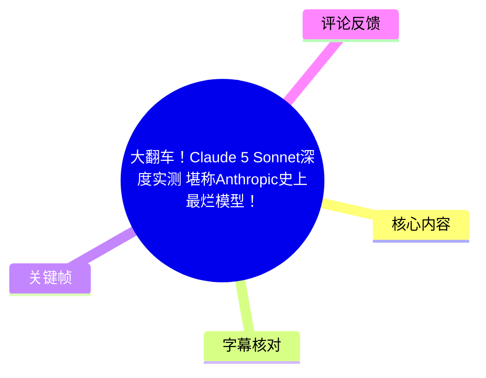
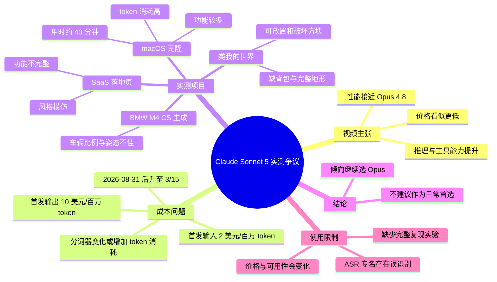
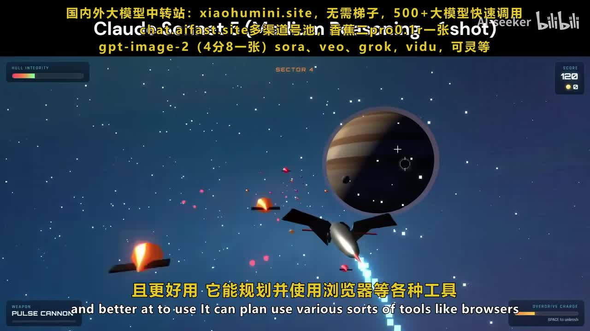
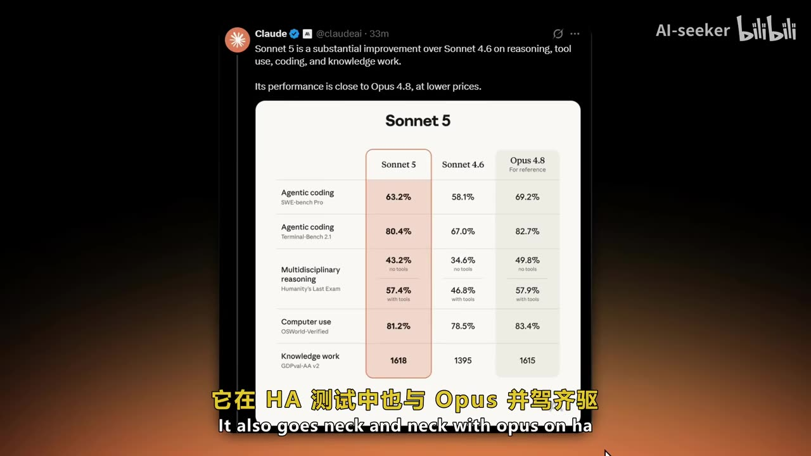
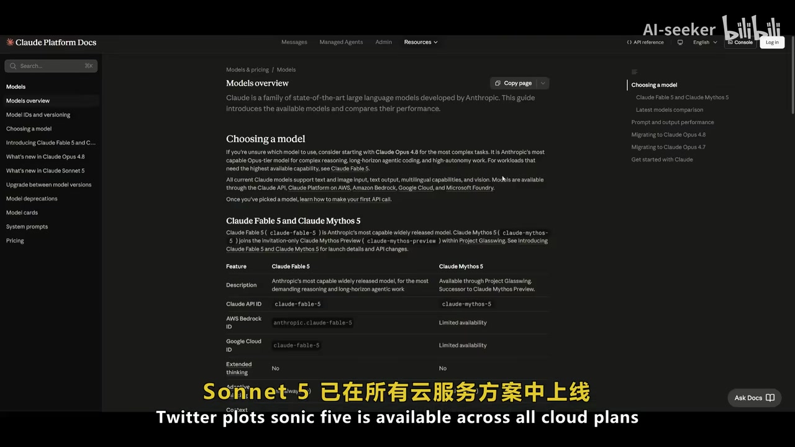
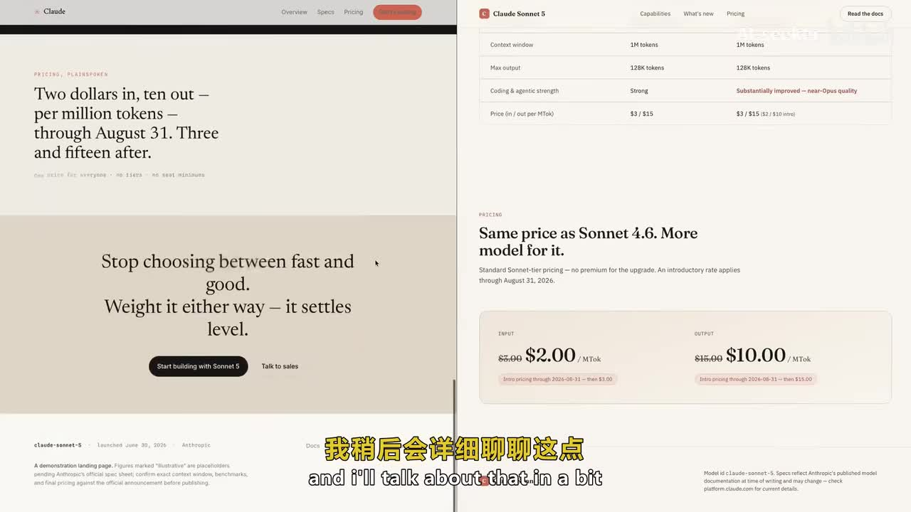

# 大翻车！Claude 5 Sonnet深度实测 堪称Anthropic史上最烂模型！

> 来源：[Bilibili 视频](https://www.bilibili.com/video/BV1TbT86nEkE)  
> UP 主：AI-seeker｜合集：AIcode｜总时长：24:20  
> 分 P：第 1 P「中文配音」与第 2 P「双语字幕」均为 12:10；素材中的 ASR 内容对应一段约 12 分钟的模型测评。

## 小结

视频围绕其所称的 **Claude Sonnet 5** 展开：先复述该模型在推理、工具调用、编程、通用知识及电脑操作基准上的官方/宣传性表现，再通过网页生成项目进行主观实测，最后得出“并不值得作为日常首选”的强烈负面结论。

视频提出的核心矛盾是：模型名义输入/输出价格较低，宣传中也接近 Opus 4.8；但讲述者认为其更换了与 Opus 4.7 相同的分词器，同一文本可能消耗更多 token。因此，表面单价下降未必意味着真实任务成本下降。视频称首发价为输入 **2 美元 / 百万 token**、输出 **10 美元 / 百万 token**，有效至 **2026-08-31**，之后升至 **3 / 15 美元 / 百万 token**。

实测项目包括 macOS 克隆网页、类《我的世界》项目、SaaS 落地页，以及 BMW M4 CS 图像/SVG 类创意生成。讲述者认可 macOS 克隆具备较多可工作的界面和应用，并能生成一个可运行的 FPS 小游戏；但也指出该任务约耗时 40 分钟、最大模式下 token 消耗很大。对《我的世界》、前端落地页与汽车视觉生成的评价则明显较差，主要问题是功能不完整、交互有限、设计完成度低或车辆比例不佳。

需要谨慎对待视频的断言。模型名称、版本号、价格、基准数值、模型可用范围及“更换分词器导致 3 倍 token”等内容均主要来自视频转述；素材未提供可独立复核的原始测试提示词、完整 token 账单、模型调用日志、对照实验控制条件或官方链接。尤其本次 ASR 专有名词混淆较多，不能把其中的“Claude 3.5 / 5”“Opus 4.8”“Gemini 1.5”等识别结果直接等同于已核实事实。

本视频适合希望建立“模型选型不能只看榜单和标价”意识的开发者、API 使用者及 AI 产品观察者。其可迁移的方法不是直接接受“最烂模型”的结论，而是用相同提示词、相同预算、相同上下文长度和相同验收标准，对候选模型进行任务级成本—质量测试。

## 思维导图

## 目录

- [背景、版本与证据边界](#背景版本与证据边界)
- [视频转述的能力、基准与可用性](#视频转述的能力基准与可用性)
- [定价、分词器与真实成本争议](#定价分词器与真实成本争议)
- [实测一：macOS 克隆与游戏生成](#实测一macos-克隆与游戏生成)
- [实测二：类我的世界、SaaS 与创意生成](#实测二类我的世界saas-与创意生成)
- [可复用的模型评测步骤](#可复用的模型评测步骤)
- [结论、限制与时效性](#结论限制与时效性)
- [字幕比对](#字幕比对)
- [评论分析](#评论分析)
- [处理记录](#处理记录)

## 背景、版本与证据边界 [00:00](https://www.bilibili.com/video/BV1TbT86nEkE?t=0)

视频开场将对象称为“Claude 5 Sonnet”或“Sonnet 5”，并称其是 Sonnet 系列的一次重大更新。由于 ASR 中同时出现“Close 3.5 Sonnet”“Claud3.5”“SONET 5”等多种冲突写法，本文统一以**“视频所称 Sonnet 5”**指代，不将其模型命名视为经本整理独立确认的官方事实。

讲述者的初始正面判断包括：

1. 幻觉更少；
2. 智能体属性更强；
3. 可规划，并调用浏览器、终端等工具；
4. 在推理、工具使用、编程、通用知识任务上，相对视频所称的 Sonnet 4.6 有明显提升；
5. 性能接近视频所称的 Opus 4.8，但价格更低。

不过，视频很快抛出反转：即使模型“相当不错”，讲述者也质疑它是否值得作为日常工作的首选，原因集中在实际 token 成本、速度/效率和多类生成任务的质量。

> 图：画面以太空射击游戏为背景，字幕提及模型可规划并使用浏览器等工具。它用于说明视频开场的能力宣传语境；画面本身不是工具调用成功的直接证据。

### 证据层级说明

- **较明确的素材事实**：视频确实展示了网页界面、性能表格、若干生成结果，并由讲述者给出评价。
- **视频转述、待外部核验的信息**：模型版本、官方价格、基准排名、发布日期、分词器归属及其 token 倍率影响。
- **讲述者的主观判断**：“史上最烂”“没有使用意义”“应直接避开”等是评论性结论，不等同于普遍适用的性能结论。
- **本整理不做的推断**：不依据标题或 ASR 自动补全实际官方产品线，也不将未提供的 API 文档、账单或测试日志视为存在。

## 视频转述的能力、基准与可用性 [01:00](https://www.bilibili.com/video/BV1TbT86nEkE?t=60)

视频称该模型的编码基准得分为 **63.2%**，并把它放在 “SWE-bench Verified” 语境中；随后又称其在电脑操作测试中达到 **81.2%**（ASR 在别处识别为“80% 11.2”），在知识工作测试中为 **1618/1619**，并称其在某些项目上接近或超过 Opus。

关键帧中的表格提供了相对清晰的画面信息。表格列为 Sonnet 5、Sonnet 4.6 与 Opus 4.8（for reference），展示：

| 评估项目（画面英文） | Sonnet 5 | Sonnet 4.6 | Opus 4.8 |
| --- | ---: | ---: | ---: |
| Agentic coding / SWE-bench Pro | 63.2% | 58.1% | 69.2% |
| Agentic coding / Terminal-Bench 2.1 | 80.4% | 67.0% | 82.7% |
| Multidisciplinary reasoning / Humanity's Last Exam（无工具） | 43.2% | 34.6% | 49.8% |
| Humanity's Last Exam（使用工具） | 57.4% | 46.8% | 57.9% |
| Computer use / OSWorld-Verified | 81.2% | 78.5% | 83.4% |
| Knowledge work / GDPval-AA v2 | 1618 | 1395 | 1615 |

> 图：此帧直接展示视频引用的 Sonnet 5、Sonnet 4.6 与 Opus 4.8 对比表，是理解视频“基准漂亮、实测不满意”反差的关键证据。表格数值反映视频所展示内容，仍应回查原始发布方的测试条件、版本和日期。

讲述者还称该模型已在各类云服务方案中上线，并称其为免费用户默认模型，专业用户可通过 API 与聊天机器人使用。此处存在两个限制：

- 视频展示的是文档页面，但未在素材中呈现完整 URL、地区限制、账户条件、配额与具体模型 ID；
- “所有云服务方案”“免费用户默认模型”等绝对化表述极易随地区、套餐和发布时间而变化，不能据此直接制定采购或部署方案。

> 图：画面为模型文档/Models overview 页面，用于佐证视频确实以文档可用性页面作为论据；但仅凭截图无法确认具体地区、套餐、版本状态与后续变更。

## 定价、分词器与真实成本争议 [02:30](https://www.bilibili.com/video/BV1TbT86nEkE?t=150)

这是视频最重要、也最值得迁移到实际选型中的论点：**单价不等于任务成本。**

### 视频给出的价格参数

讲述者称，首发期间的价格如下：

| 项目 | 视频转述价格 |
| --- | ---: |
| 输入 | 2 美元 / 百万 token |
| 输出 | 10 美元 / 百万 token |
| 优惠截止 | 2026-08-31 |
| 优惠结束后输入 | 3 美元 / 百万 token |
| 优惠结束后输出 | 15 美元 / 百万 token |
| 上下文窗口 | 100 万 token 级 |

> 图：该帧中左侧英文写有“Two dollars in, ten out — per million tokens — through August 31. Three and fifteen after”，右侧为 Sonnet 5 价格页。这是视频价格论述最直接的可视证据，也提醒读者该价格带有明确期限。

### 视频的分词器成本论证

视频称，模型改用“Opus 4.7 分词器”（专有名词以 ASR 识别为准，未独立核验），其推论是：

1. 相同文本被编码后，可能占用更多 token；
2. 增幅“具体取决于内容”，视频称某些情况下可达约 3 倍；
3. 因而低输入/输出单价可能只是抵消了更多 token 消耗；
4. 在实际工作流中，Sonnet 与更强 Opus 模型的成本差距或许很小；
5. 当质量差距大于价格差距时，选择更强模型可能更合理。

这个逻辑本身具有普适性，但视频没有展示完整的 token 统计表、相同请求的编码对照、缓存命中规则、长上下文计费、工具调用费或输出长度控制策略。因此，正确理解应是：

> 视频提出了一个需要验证的成本假设，而不是已经被素材充分证明的普遍结论。

### 成本评估应采用的任务级公式

实际比较时，应以一次完整任务为单位，而不是只看每百万 token 标价：

\[
\text{任务成本} =
\frac{\text{输入 token}}{1,000,000} \times \text{输入单价}
+
\frac{\text{输出 token}}{1,000,000} \times \text{输出单价}
+
\text{工具调用费、重试费与人工返工成本}
\]

其中，最常被忽略的是：

- 同一原文在不同 tokenizer 下的 token 数；
- 为获得可用结果所需的重试次数；
- 长任务中的上下文膨胀；
- 模型输出不满足验收标准而产生的人工修复时间；
- 最大/高推理模式导致的隐性 token 增长。

## 实测一：macOS 克隆与游戏生成 [05:00](https://www.bilibili.com/video/BV1TbT86nEkE?t=300)

### macOS 克隆：质量认可，但效率受到质疑

视频使用其所称的 “Word-of-AI 基准工具”生成 macOS 克隆版。讲述者对结果的正面描述包括：

- 登录页存在；
- 顶部状态栏似乎正常；
- 可调整显示设置、切换深浅色模式、更换壁纸；
- 多个应用界面存在，包括启动台、Safari、Messenger、照片、日历、备忘录、提醒事项、地图和音乐应用；
- 底部菜单和不同文件类型的展示较完整；
- 各应用有相对细致的视觉界面；
- 还生成了一个可运行的 FPS 游戏。

但其同时指出：

- 与此前 Opus 生成的 macOS 克隆相比，视觉或整体效果不如前者；
- 工作区生成约耗时 **40 分钟**；
- 在“最大模式”下消耗大量 token；
- 结果虽然“做出来了”，但生成效率很低。

这组测试反映了一个重要经验：对于大型前端/交互项目，必须同时验收**完成度、可运行性、生成时间、token 消耗和后续修改成本**。一个功能很多的单次展示，不能自动证明模型适合高频生产。

### FPS 游戏：功能存在不等于复杂度充分

视频认为该 FPS 游戏“功能完整”且能够运行，称其中有不同功能。但也特别说明，它不是“极其复杂”的自动生存游戏。因而可得出的稳妥结论是：视频展示了模型在一次生成中完成基础可运行交互作品的能力；而有关复杂游戏逻辑、稳定性、性能、代码质量与可维护性的结论，素材不足。

## 实测二：类我的世界、SaaS 与创意生成 [07:30](https://www.bilibili.com/video/BV1TbT86nEkE?t=450)

### 类《我的世界》项目：视觉有创意，系统深度不足

视频展示一个具有不同材质风格的类《我的世界》作品。讲述者观察到：

- 水流动态似乎可以工作；
- 存在村民、苦力怕等生物；
- 可以破坏和放置方块；
- 似乎生成了矿石；
- 材质选择和原创性有一定表现。

但主要批评包括：

- 画面不稳定；
- 方块破坏没有实际动画；
- 水流物理不够完善；
- 缺少背包系统；
- 没有无限地形；
- 除破坏、放置方块外，其他互动机制有限；
- 原本要求的洞穴系统未明显呈现。

该测试说明：判断“生成了游戏”时，应将**可见 UI、核心循环、资源/背包系统、世界生成、物理、动画、性能与异常处理**拆开验收。仅有方块放置与破坏，不代表已实现完整沙盒游戏。

### SaaS 落地页：视觉模仿不等于产品功能

讲述者要求模型利用多个开发包、不同排版和触发动画制作 SaaS 落地页。其评价为：

- 页面具有模仿 Anthropic 设计风格的视觉倾向；
- 基础动画、触发效果与部分组件被生成；
- 左上区域等组件未完整生成；
- 页面没有实际功能；
- 与讲述者提到的 Gemini 1.5 相比，前端结果不占优势。

此处的可复用经验是，前端评测应区分至少四层：

1. **静态视觉还原**：布局、字体、配色、间距；
2. **组件完整性**：导航、卡片、表单、按钮、状态；
3. **交互行为**：点击、校验、动画、响应式与错误状态；
4. **业务可用性**：数据流、权限、接口、持久化与异常恢复。

若只用截图对比，模型往往会因视觉相似而被高估；若只看是否有代码，也可能忽略实际交互不可用的问题。

### BMW M4 CS 创意生成：视频认为结果不达标

视频还要求模型生成 BMW M4 CS 的测试图/创意作品。讲述者认为生成结果没有体现该车型应有的：

- 车身比例；
- 姿态；
- 外观特征与设计语言。

视频以 Opus 的结果作对照，称后者至少能呈现该代 BMW 的整体特征。由于素材未提供两者完全一致的提示词、随机种子、生成次数、图像模型链路和原始文件，本整理只能记录“视频中的主观对照结果”，不能进一步判定某一模型在汽车视觉生成上的通用排名。

## 可复用的模型评测步骤 [09:40](https://www.bilibili.com/video/BV1TbT86nEkE?t=580)

视频虽以强烈批评收尾，但其测试主题可以整理为更严谨的选型流程。

### 1. 固定目标任务，而非只看基准

至少准备四类与自身业务相关的任务：

| 任务类型 | 示例验收点 |
| --- | --- |
| Agent/编程 | 是否能运行、测试通过率、修复轮数、工具调用成功率 |
| 大型前端 | 页面完成度、交互、响应式、可维护性、构建是否成功 |
| 创意/视觉 | 主体比例、风格一致性、特征保真、可编辑性 |
| 长上下文/知识工作 | 正确性、引用完整性、遗漏率、输入与输出 token 数 |

### 2. 保持实验条件一致

对比模型时应固定：

- 同一份提示词和输入素材；
- 相同上下文长度；
- 相同工具权限与工具版本；
- 相同推理/最大模式开关；
- 相同输出上限；
- 相同运行环境和超时阈值；
- 每项至少多次运行，避免以单次结果概括稳定性。

### 3. 记录完整成本

每次测试至少记录：

| 指标 | 目的 |
| --- | --- |
| 输入、输出 token | 核算直接 API 成本 |
| 总耗时 | 判断交付速度 |
| 重试次数 | 衡量稳定性与隐性成本 |
| 工具调用次数及失败率 | 评估 agent 可靠性 |
| 首次可用率 | 衡量一次完成能力 |
| 人工修复时长 | 反映真实交付成本 |
| 最终验收得分 | 避免只看代码量或截图 |

### 4. 用“质量—成本前沿”而非单一排名选型

如果模型 A 更贵但首次可用率更高、返工更少，它的总成本可能低于模型 B。反之，若任务简单且可容忍重试，较低单价模型可能更合适。因此应回答：

- 在可接受质量阈值下，哪个模型完成任务最便宜？
- 在固定预算下，哪个模型最稳定？
- 在固定时限下，哪个模型最可能交付可用成品？
- 是否真的需要最大模式，还是普通模式已足够？

## 结论、限制与时效性 [11:05](https://www.bilibili.com/video/BV1TbT86nEkE?t=665)

视频最终立场很明确：讲述者认为视频所称 Sonnet 5 并未带来期待中的巨大跃迁；在 macOS 克隆上能产出质量较高的结果，但 token 消耗和时间成本不理想；在类《我的世界》、SaaS 页面与创意生成上则存在显著短板。因此他建议继续使用 Opus，而不是将 Sonnet 5 作为日常通用首选。

这一结论可保留为**该视频作者在其测试条件下的观点**，但不应被外推为普适事实，原因包括：

1. 没有提供完整提示词、工程文件、调用日志和账单；
2. 生成式任务存在随机性，单次样本不足以概括模型能力；
3. 各项目对视觉、功能、稳定性和速度的权重不同；
4. ASR 对型号、基准名和术语识别不稳定；
5. 模型、价格、配额、免费层默认模型与云端可用性都具有强时效性；
6. 视频称优惠价截止至 **2026-08-31**，即使该信息在发布时准确，之后也可能已经失效；
7. 元数据标签偏向“玩具、手办模玩”等，与实际素材中的 AI 模型测评主题不一致，不能据标签判断视频内容。

最终建议：将本视频作为“识别标价陷阱、重视任务级总成本”的案例，而不是作为某个具体模型长期优劣的唯一依据。实际部署前，应按自身业务复跑测试，并在当前官方文档中重新确认模型名、上下文上限、计费、可用渠道和限制。

## 字幕比对

本次任务中，**站内字幕存在，且本次 ASR 已执行**。两份字幕的内容主题严重不一致。

| 字幕来源 | 完整性 | 专有名词 | 时间轴 | 主要问题 |
| --- | --- | --- | --- | --- |
| Bilibili 站内字幕 | 对其自身内容而言较连续，但与本视频画面/标题不匹配 | 几乎没有 AI 模型相关术语 | 未提供结构化时间戳 | 内容为北京闽菜餐厅探店、菜品评价与猜价，明显不对应本视频 AI 测评内容 |
| 本次 ASR 字幕 | 基本覆盖模型发布、价格、测试与结论 | 较差，出现 Close/Claw/Sonic/Sonnet、Opus/OPER、Gemini/加迷你等混淆 | 文本未附逐句时间戳，只能结合视频线性内容定位 | 中英混杂、部分数字断裂、测试名称与模型版本存在误识别 |

### 最终字幕选择与校正原则

正文采用**本次 ASR 为主、关键帧为辅助**的合并策略，理由是 ASR 的主题与标题、关键帧中的 Claude 页面和模型对比表一致；站内字幕则完全是另一条餐饮视频内容，不能用于本视频知识整理。

基于关键帧和上下文进行的有限校正包括：

- 将 ASR 中反复出现的 “Close”“Claw”“Sonic”“桑内”等统一表述为“视频所称 Sonnet 5”，避免伪造精确官方命名；
- 将对比对象保留为“视频所称 Opus 4.8”，因为关键帧表格中可见 “Opus 4.8”；
- 将价格表述整理为输入 2、输出 10 美元/百万 token，且优惠至 2026-08-31；这与价格关键帧的可见英文一致；
- 将电脑操作得分采用关键帧可见的 **81.2%**，而非 ASR 中断裂的“80% 11.2”；
- 对“Opus 4.7 分词器”“3 倍 token”“Word-of-AI”等无法由画面充分核实的专名，不做超出 ASR 的扩写与确认。

## 评论分析

仅获取到 2 条热评，未达到“热评前三条”的数量；以下仅处理可获取评论，不补造第 3 条。

1. **Im星野（14 赞）**：  
   评论称“套餐有 sonnet 额度挺香的，但是 A 狗给他下架了”。该观点补充了一个潜在使用场景：用户可能因套餐内含 Sonnet 配额而感到性价比不错；同时也提到某个未明确指代的平台/服务下架。由于评论未说明“套餐”“A 狗”的具体产品、地区、时间或证据，不能将其作为模型下架或配额政策的已证实事实。

2. **科比布莱恩特kobi（2 赞）**：  
   评论为“没那么烂吧。”这直接质疑视频标题和讲述者的极端负面结论，说明观众对“史上最烂模型”的定性并未形成一致意见。该评论没有给出具体测试或反例，但与本文的证据边界一致：单一创作者的若干项目实测不足以支撑普遍性的绝对排名。

## 处理记录

- Worker ID：worker-mrj0wbly-5dc4e50c
- 模型：gpt-5.6-terra
- 调用工具与素材：视频元数据、站内字幕文本、本次 ASR 字幕文本、热评 JSON、关键帧目录与已提供关键帧图像。
- 使用的应用工具：素材读取与结构化整理；未执行联网检索、模型 API 调用复测或外部官方文档核验。
- 字幕选择：站内字幕虽存在，但内容为餐饮探店且与当前视频不匹配；本次 ASR 已执行并作为正文主来源。对 ASR 中专有名词和数字仅在关键帧可见信息支持时做有限校正。
- 关键帧选择依据：
  - `frames/frame-001.jpg`：对应开场关于浏览器等工具调用能力的叙述；
  - `frames/frame-002.jpg`：直接展示首发及后续价格、优惠截止日期；
  - `frames/frame-003.jpg`：直接展示 Sonnet 5、Sonnet 4.6、Opus 4.8 的基准对比数值；
  - `frames/frame-004.jpg`：展示模型文档/可用性页面。
  其余关键帧未在给定可视素材中呈现具体内容描述，因此未强行引用。
- 评论处理：按要求仅分析可获取的热评前三条；实际仅获取 2 条，已明确数量不足。
- 缓存清理：素材清单未提供独立缓存目录、缓存大小或清理执行结果；本次整理未产生可报告的额外缓存清理记录。
- 未解决问题：
  - 视频所称模型的精确官方名称、版本号与实际可用状态未作外部核验；
  - 缺少测试提示词、运行环境、完整 token 账单、工程文件和可复现日志；
  - 两个分 P 是否为完全重复内容，素材未提供逐 P 的独立转写映射；
  - 元数据标签与视频主题不一致，无法确定其产生原因。
