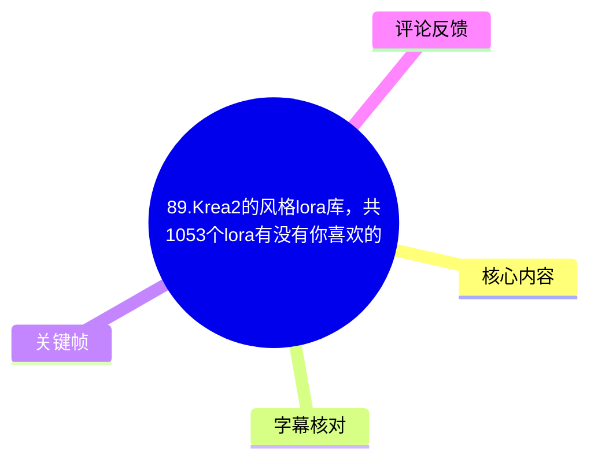
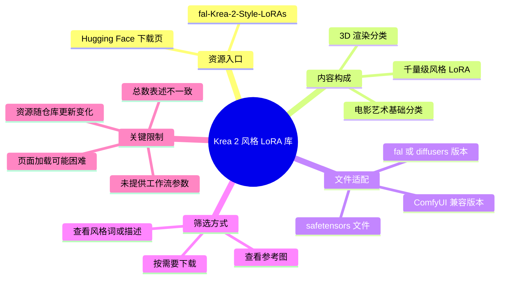
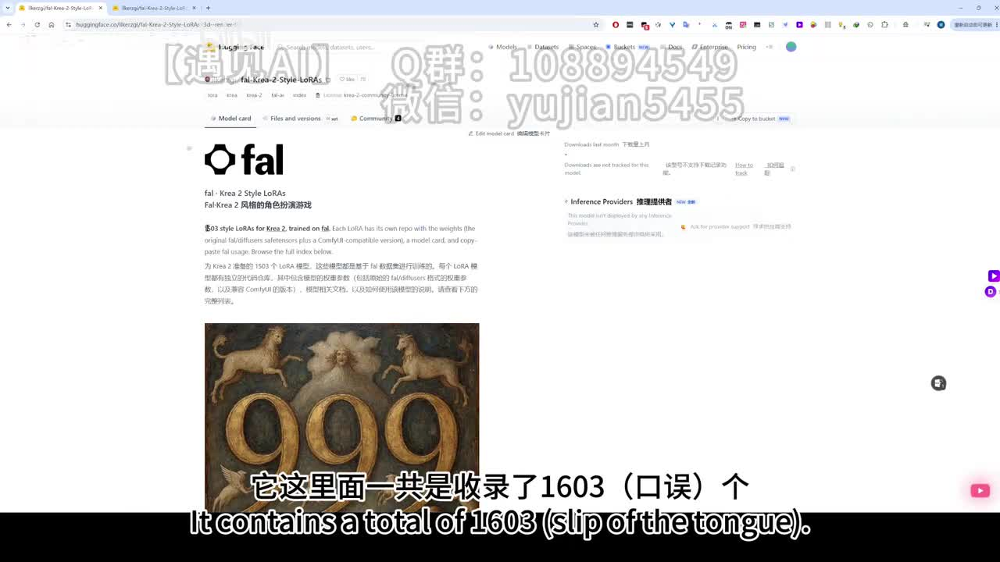
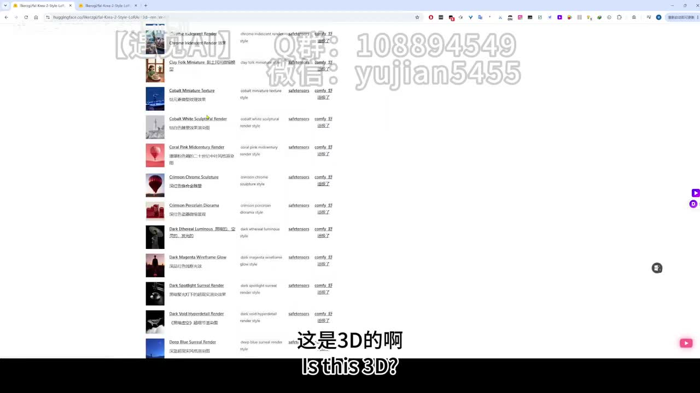

# 89.Krea2的风格lora库，共1053个lora有没有你喜欢的

> 来源：[Bilibili 视频](https://www.bilibili.com/video/BV1FDTF69ELu)  
> UP 主：遇见AI-yujian5455｜合集：AIcode｜时长：1 分 14 秒  
> 元数据发布时间：2026-06-30 07:13:04（按提供的 Unix 时间戳换算，未标注时区）

## 小结

视频介绍了一个面向 **Krea 2** 的风格 LoRA 集合下载页，UP 主引导观众在 Hugging Face 页面中浏览并筛选大量风格模型。视频描述给出的下载地址为 `ilkerzgi/fal-Krea-2-Style-LoRAs`，关键帧显示该页名称为 **fal · Krea 2 Style LoRAs**。

最重要的信息是：该集合中的每个 LoRA 据视频展示与口述，提供两类权重/适配版本——原始 **fal/diffusers** 格式的 `safetensors` 文件，以及 **ComfyUI 兼容版本**。因此，使用者应先确认自己的推理工作流和所需格式，再选择对应下载项，而不是将所有文件不加区分地下载。

页面按风格类型组织内容。视频明确展示并提到 **3D 渲染**分类；随后提及“电影艺术基础”分类，其中口述数量为 **101 个**。列表页面可见每个条目通常带有示例缩略图、风格名称/触发词或描述、`safetensors` 入口，以及 ComfyUI 相关入口，适合以“先看例图与风格词、再下载适配文件”的方式筛选。

需要特别注意总数存在三处互相矛盾的信息：标题写“**1053 个**”，本次 ASR 转写为“**1303 个**”，而第 1 张关键帧中的画面字幕及页面展示为“**1603 个**”。本笔记不将任一数字认定为当前准确总数；它们最多只能说明该库规模在千个量级，实际数量、分类和文件内容应以访问时仓库页面为准。

本视频适合已了解 LoRA、Diffusers 或 ComfyUI 基础使用方式的人，用于发现 Krea 2 的风格资源。它不是安装或训练教程：没有展示模型放置路径、节点工作流、提示词权重、采样参数、显存需求、许可证或具体生成效果的对比测试。

## 思维导图

## 目录

- [视频信息与时效性](#视频信息与时效性)
- [资源页与版本结构（00:00）](#资源页与版本结构0000)
- [分类浏览与条目字段（00:24）](#分类浏览与条目字段0024)
- [筛选与下载步骤（00:50）](#筛选与下载步骤0050)
- [参数、限制与可迁移经验（01:02）](#参数限制与可迁移经验0102)
- [字幕比对](#字幕比对)
- [评论分析](#评论分析)
- [处理记录](#处理记录)

## 视频信息与时效性 [00:00](https://www.bilibili.com/video/BV1FDTF69ELu?t=0)

视频标题将主题概括为“Krea2 的风格 lora 库”，并称有“1053 个 lora”。视频简介补充了一个资源下载地址：

- Hugging Face：`https://huggingface.co/ilkerzgi/fal-Krea-2-Style-LoRAs`
- 另有 UP 主工具箱和 RunningHUB 邀请链接，但视频正文并未演示 RunningHUB 的注册、积分领取或与该 LoRA 库之间的技术关联。

本视频中的“已经出来了几天”“现在”等表述是发布当时的相对时间，不可直接等同于当前状态。Hugging Face 仓库的文件、分类、可见性、总数量、下载方式和兼容性均可能随维护者更新而变化。尤其是视频标题、ASR 与画面对于总数的说法不一致，实际使用前应打开仓库的 **Files and versions** 等页面核验。

## 资源页与版本结构（00:00）[00:00](https://www.bilibili.com/video/BV1FDTF69ELu?t=0)

UP 主打开的是 Hugging Face 上的 **fal · Krea 2 Style LoRAs** 页面。画面正文说明该集合收录的是面向 Krea 2 的风格 LoRA；视频将其描述为一个规模很大的风格资源汇总。

视频中可确认的版本关系如下：

| 项目 | 视频陈述/页面信息 | 使用含义 |
| --- | --- | --- |
| 原始版本 | 口述为 `diffusers` 版本；关键帧页面文字可见原始 `fal/diffusers` 的 `safetensors` 文件 | 面向使用相应 fal 或 Diffusers 格式加载方式的场景 |
| ComfyUI 版本 | 口述为“ComfyUI 用的版本”；页面亦说明有 ComfyUI-compatible version | 面向需要 ComfyUI 兼容权重的工作流 |
| 文件格式 | 关键帧列表中可见 `safetensors` | 下载时仍需按具体条目、版本和自身加载器要求确认 |
| 单条 LoRA 资料 | UP 主提到参考图、触发词；画面列表显示缩略图、名称与链接字段 | 可用于在下载前初步判断风格和调用线索 |

> 图：该帧展示资源页标题、说明文字及大数字视觉素材，并可见页面提及原始 fal/diffusers 文件与 ComfyUI 兼容版本。它是判断“存在双版本分发”以及发现数量表述冲突的关键依据：画面字幕写的是“1603 个”，与标题“1053”、ASR“1303”均不同。

### 关于“训练图片”和“训练参数”的口述 [00:16](https://www.bilibili.com/video/BV1FDTF69ELu?t=16)

ASR 中出现“训练的时候大约使用了 5 张图片”“训练参数是使用了 10 张”“训练级比较小”等说法，但转写语义不完整，且没有可用站内字幕或更清晰的画面文字对其逐字校正。

因此，能谨慎记录的仅是：

- UP 主试图说明这些 LoRA 的训练样本/训练设置较小；
- ASR 出现了 **5 张图片** 和 **10 张** 两个数值；
- 视频未给出训练脚本、训练轮数、学习率、rank、batch size、数据清洗方式、底模版本或验证指标；
- 不能据此推出“每个 LoRA 均以 5 张图训练”或“10 是统一训练参数”的确定结论。

## 分类浏览与条目字段（00:24）[00:24](https://www.bilibili.com/video/BV1FDTF69ELu?t=24)

UP 主向下浏览资源索引，并说明该页面对 LoRA 做了分类。视频明确点到的类别包括：

1. **3D 渲染**：UP 主称“第一类就是 3D 渲染”，并提示该区域带有参考图和触发词。
2. **电影艺术基础**：UP 主称该分类“一共 101 个”。
3. **更多分类**：UP 主未逐一讲解，只提示观众继续向下自行浏览。

从画面可见的列表结构看，单条资源并非只显示一个模型文件，而是伴随多个用于筛选的信息。虽然截图分辨率不足以可靠逐字还原每一列，但可辨识出以下实践上有价值的元素：

- 左侧：风格效果缩略图；
- 中部：风格名称，以及接近触发词/风格描述的文本；
- 右侧：`safetensors` 文件入口；
- 右侧：与 ComfyUI 相关的入口或标记。

> 图：该帧直观呈现“3D”分类下的多条 LoRA，以及每条条目的缩略图、名称/描述、`safetensors` 和 ComfyUI 相关列。相比只看数量，这张图更能说明该库适合按具体视觉效果逐项挑选。

### 视频未验证的事项

视频没有演示任意一个 LoRA 的实际加载、出图、触发词复现或版本兼容测试。故以下问题在本素材中均没有答案：

- 同名 LoRA 的 Diffusers 与 ComfyUI 文件是否完全等效；
- 每个风格是否都有统一且必填的触发词；
- 不同 LoRA 是否可叠加使用，以及叠加后是否会产生风格冲突；
- 哪个 Krea 2 推理环境、节点版本或加载器版本适配这些文件；
- 各文件的许可证、商用条件、肖像/风格相关风险。

## 筛选与下载步骤（00:50）[00:50](https://www.bilibili.com/video/BV1FDTF69ELu?t=50)

按照视频实际展示的顺序，可整理为以下资源检索流程：

1. **进入资源页**  
   使用视频简介提供的 Hugging Face 地址，打开 `fal-Krea-2-Style-LoRAs` 页面。

2. **先看分类，而非按总数判断规模**  
   在索引中从已分类的风格类型开始浏览，例如视频展示的“3D 渲染”及“电影艺术基础”。这比试图一次加载全部条目更符合视频中的浏览方式。

3. **以示例图初筛风格**  
   观察每条 LoRA 附带的缩略图或参考图，判断色彩、材质、构图、渲染感是否符合目标。

4. **查看条目的风格词/触发信息**  
   UP 主明确提到“触发词”。实际调用时应以条目页面或文件说明给出的文本为准；视频没有提供某一个具体 LoRA 的完整提示词示例。

5. **按运行环境选择对应版本**  
   - 使用 fal/diffusers 对应流程时，选择页面所述原始 fal/diffusers `safetensors` 文件；
   - 使用 ComfyUI 时，选择 ComfyUI-compatible 版本或入口。  
   
   这里的“对应”仅指视频和页面的版本标签；具体应放入哪个目录、如何由节点加载，视频没有讲解。

6. **遇到页面加载困难时分批浏览**  
   UP 主表示内容太多，自己已“加载不出来”。这说明大规模索引可能带来浏览压力。可按分类、关键词、分页或仓库文件列表逐步筛选；这些是对视频中“内容过多”的操作性整理，非视频展示的固定功能承诺。

7. **下载后自行完成兼容性验证**  
   视频只到“下载”层面，未展示生成验证。实际应以一个明确的工作流、固定提示词和对照图测试权重能否被正确加载。

> ASR 在末段出现“直接点击去 fill，然后在里面点几”的不清晰表述。结合上下文可知 UP 主是在指向页面中继续查看全部 LoRA 的操作，但无法从现有素材可靠确认具体按钮名或点击路径，故不将其写成确定步骤。

## 参数、限制与可迁移经验（01:02）[01:02](https://www.bilibili.com/video/BV1FDTF69ELu?t=62)

### 已出现的参数与数量

| 信息 | 素材中的表述 | 可靠性与说明 |
| --- | --- | --- |
| 视频时长 | 74 秒 | 元数据明确 |
| 标题中的 LoRA 总数 | 1053 | 标题信息，但与其他来源冲突 |
| ASR 中的总数 | 1303 | ASR 转写结果，专名/数字识别存在误差可能 |
| 关键帧字幕中的总数 | 1603 | 画面可见，但仍与标题、ASR 冲突 |
| 电影艺术基础分类数量 | 101 | UP 主口述；未在本素材中逐项核对 |
| 训练图片相关数字 | 约 5 张、10 张 | ASR 语义断裂，不能视为完整、通用训练配置 |
| 文件格式 | `safetensors` | 关键帧列表可见 |
| 分发版本 | fal/diffusers、ComfyUI-compatible | 页面文字和口述相互支持 |

### 可迁移的经验

- **以环境匹配优先于数量**：面对大量 LoRA，首先确定自己使用 Diffusers 还是 ComfyUI，再选相应版本，可减少下载到无法直接加载文件的概率。
- **以视觉样例和调用信息筛选**：分类、参考图与触发词是该视频实际强调的筛选线索，比单纯按名称或总数选择更有效。
- **不要把索引页当作效果保证**：列表的缩略图只能用于初筛；最终效果还受基础模型、提示词、权重、采样设置和工作流影响，而视频没有给出这些变量。
- **面对数字冲突要回到源页面**：标题、ASR、画面字幕的总数分别为 1053、1303、1603，说明自动转写、标题版本与页面更新都可能造成偏差。应记录冲突而非强行统一为某一数值。

### 使用边界

- 本视频不构成 LoRA 安装、部署、训练或商用授权指南。
- 没有给出模型权重、提示词权重、采样器、步数、CFG、分辨率等生成参数。
- 页面条目过多可能造成浏览器加载缓慢，UP 主已在视频中提到加载问题。
- 关于明星/人物 LoRA 的范围，视频未做明确说明；评论中的提问不能作为库中确有该类资源的证据。
- Krea 2、仓库文件与界面均具有更新性，本文只记录所给视频素材与抓取元数据对应时点的信息。

## 字幕比对

| 字幕来源 | 完整性 | 专有名词 | 时间轴 | 主要问题 |
| --- | --- | --- | --- | --- |
| Bilibili 站内字幕 | 未提供可用字幕，无法比对全文 | 无法评估 | 无可用时间轴 | 素材明确标注“未提供可用站内字幕” |
| 本次 ASR 字幕 | 覆盖了开场、资源规模、分类、下载提示和结尾 | 存在明显误识别，如“Krea 2”被转为“Creative 2 / GRETE2”，“LoRA”被转为“Laura”，“ComfyUI”被拆误 | 提供的是连续文本，未附逐句时间戳 | 数字与术语不稳定；“5 张图片/10 张”等句子语义不完整 |

本次 ASR 已执行，且由于没有可用站内字幕，本文以 **ASR 为主、关键帧与元数据为校正依据** 完成整理。

主要校正如下：

| ASR 表述 | 本文采用的写法 | 校正依据 |
| --- | --- | --- |
| Creative 2 / GRETE2 | Krea 2 | 视频标题及 Hugging Face 页面标题 |
| Laura / lauras | LoRA / LoRAs | 视频标题、标签与页面上下文 |
| 建筑空飞用意 | ComfyUI | 关键帧页面文字与语义上下文 |
| 1303 个 | 保留为“ASR 数字”，不作为定论 | 与标题 1053、画面字幕 1603 冲突 |
| 直接点击去 fill | 不确定的页面操作 | 无法由现有画面和 ASR可靠还原按钮名称 |

## 评论分析

以下仅处理可获取的热评前三条。评论反映的是观众诉求或疑问，不应视为对资源库内容的已验证补充。

1. **回坑渣新**（1 赞）  
   评论询问“1000 多明星有例图吗”，希望先通过示例图筛选喜欢的明星。该评论说明观众关注人物/明星相关资源及可视化预览。  
   视频确实展示了风格条目的缩略图/参考图，但未证明“1000 多个”均为明星 LoRA，也未说明是否含有特定人物。

2. **只要他愿意拆开信封**（0 赞）  
   评论询问是否有国内明星。该问题与人物 LoRA 的覆盖范围和地域相关内容有关。  
   视频没有展示可确认的国内明星条目，不能根据提问推断答案为“有”或“没有”。

3. **猪肉牛肉鸡肉鱼肉人肉**（0 赞）  
   评论为“金陵副将马国成:多少”，语义上像是在询问某一名称对应条目的数量、价格或其他信息，但缺乏上下文，无法可靠判定具体所指。  
   该评论未提供可验证的资源信息，也没有获得视频素材中的回应。

## 处理记录

- Worker ID：`worker-mrj0www4-e8d79408`
- 模型：`gpt-5.6-terra`
- 调用工具与素材：基于已提供的元数据、视频素材清单、ASR 字幕、2 张关键帧、评论 JSON 和封面/页面信息进行整理；本次素材中已产出 `merged.mp4`、`audio/audio.wav`、`frames/`、`comments/comments.json`、`subtitles/`、`asr/`。
- 使用的应用工具：素材提取流程、音频 ASR、关键帧抽取、评论抓取均已由提供素材流程完成；未额外声称进行网页实时访问或模型文件下载验证。
- 字幕选择：站内字幕不可用；确认本次 ASR 已执行。正文以 ASR 为基础，使用视频标题、关键帧中可见的 Hugging Face 页面和上下文校正 Krea 2、LoRA、ComfyUI 等术语；对无法消除的数字冲突保留原始差异。
- 关键帧选择依据：
  - `frames/frame-001.jpg`：显示 Hugging Face 资源页、页面说明及“1603”画面字幕，可支撑版本结构与数量冲突分析。
  - `frames/frame-002.jpg`：显示 3D 分类下的条目列表、缩略图、`safetensors` 与 ComfyUI 相关列，适合说明筛选界面和条目结构。
- 缓存清理：提供的素材清单未包含缓存清理日志；本记录不虚构清理结果。素材输出目录已明确列出，后续是否删除中间视频、音频或 ASR 缓存应由执行环境按保留策略处理。
- 未解决问题：LoRA 实际当前总数、各条目的完整触发词、训练配置、许可证、具体下载按钮路径、ComfyUI 安装位置与实际生成兼容性，均未在现有视频素材中得到充分验证。
