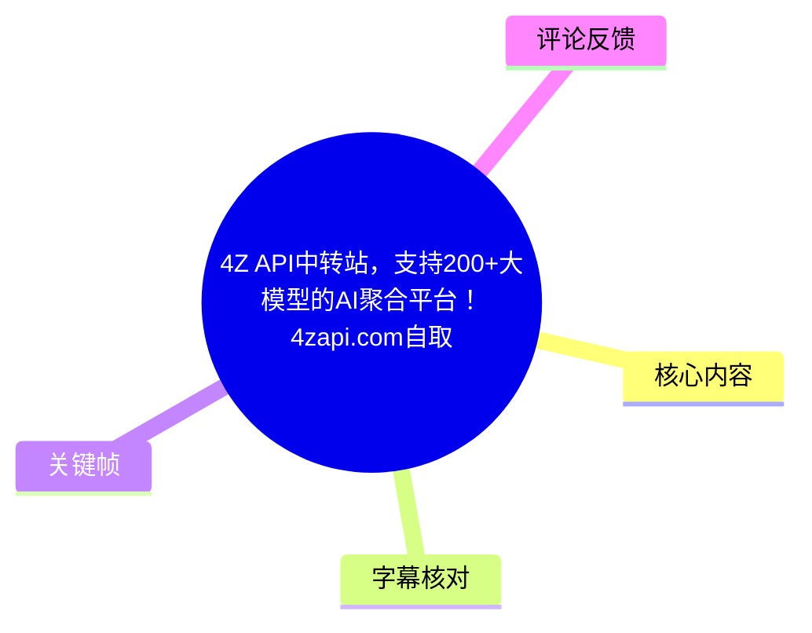
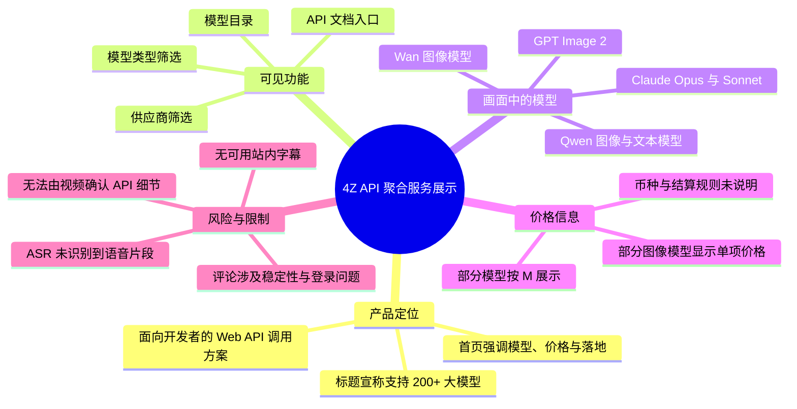
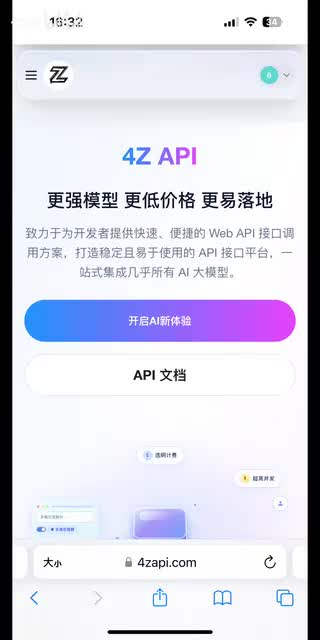
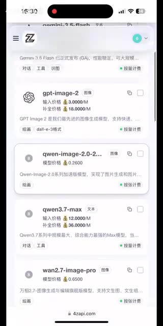
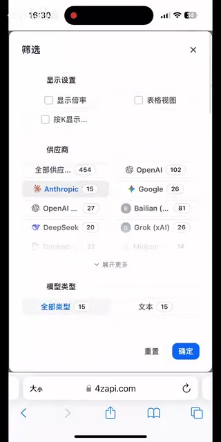
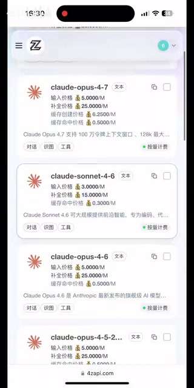

# 4Z API中转站，支持200+大模型的AI聚合平台！4zapi.com自取

> 来源：[Bilibili 视频](https://www.bilibili.com/video/BV1Sh7C6QEWz) 
> UP 主：4zapi｜视频时长：00:34｜竖屏分辨率：960 × 1920 
> 视频标题与画面所指站点：`4zapi.com`

## 小结

该视频是一段约 34 秒的竖屏网页展示，推广名为 **4Z API** 的 AI 模型 API 聚合服务。标题宣称其“支持 200+ 大模型”；首页画面进一步将产品定位表述为面向开发者的 Web API 调用方案，强调“更强模型、更低价格、更易落地”。

从画面可确认，站点具备模型目录与筛选界面：目录中出现 OpenAI、阿里云千问、Anthropic、Google、DeepSeek、Grok（xAI）等相关模型或供应商标签；筛选页展示了供应商与模型类型筛选项。首页还提供“开启AI新体验”与“API 文档”入口。

视频的主要可见信息是**模型聚合、价格展示与筛选能力**，而不是 API 接入教程。画面列出部分模型的按百万 Token（`/M`）计费价格，例如 `gpt-image-2`、`qwen3.7-max`、`claude-opus-4-7` 等；但视频未说明币种、计费结算规则、模型可用区域、并发限制、速率限制、退款机制、账户注册步骤或实际 API 请求格式。

需要特别审慎看待时效性：模型名称、模型数量、供应商数量、价格和可登录性都属于易变信息。标题中的“200+”是视频标题主张；筛选画面中还显示“全部供应…”旁有 `454` 的界面数字，但因截图未完整展示该标签，不能将其直接解释为“454 个供应商”或“454 个模型”。

热评中有用户反映登录掉线、模型无法运行，以及对低价中转服务稳定性的担忧；这些是评论者的个人反馈，不足以单独证实平台状态，但提示使用者在生产接入前应完成可用性与资金风险验证。

## 思维导图

## 目录

- [视频范围与信息来源](#视频范围与信息来源-000000)
- [4Z API 的定位与入口](#4z-api-的定位与入口-000000)
- [模型目录、筛选与可见生态](#模型目录筛选与可见生态-000000)
- [模型与价格信息整理](#模型与价格信息整理-000000)
- [可执行的核验步骤](#可执行的核验步骤-000000)
- [限制、风险与时效性](#限制风险与时效性-000000)
- [字幕比对](#字幕比对-000000)
- [评论分析](#评论分析-000000)
- [处理记录](#处理记录-000000)

## 视频范围与信息来源 [00:00:00](https://www.bilibili.com/video/BV1Sh7C6QEWz?t=0)

本视频总时长为 33.85 秒（ASR 诊断给出的音频时长）/ 元数据标注 34 秒。现有素材中没有可用的站内字幕；本次 ASR 虽成功生成诊断结果，但未识别到任何语音分段，因此不能用字幕时间段重建精确的镜头切换时间。

因此，本文采用以下证据等级：

1. **元数据与标题**：用于确认视频标题、UP 主、时长、标签及标题中“支持 200+ 大模型”的宣传语。
2. **关键帧画面文字**：用于整理站点首页、模型目录、筛选项和局部价格。
3. **ASR 诊断**：用于确认“本次未得到可用语音转写”，不将空转写当作视频已陈述的内容。
4. **热评**：仅作为用户体验与争议线索，不视为已验证的平台事实。

> 时间轴说明：由于站内字幕缺失、ASR 无有效带时间戳文本，除视频起点外没有可依据字幕精确定位的分段时间。本篇涉及画面的章节统一链接至 `00:00:00`，避免按文字顺序虚构时间位置。

## 4Z API 的定位与入口 [00:00:00](https://www.bilibili.com/video/BV1Sh7C6QEWz?t=0)

首页画面将产品名称显示为 **“4Z API”**，并写有主宣传语：

> “更强模型 更低价格 更易落地”

下方的页面介绍可辨识为：

> “致力于为开发者提供快速、便捷的 Web API 接口调用方案，打造稳定且易于使用的 API 接口平台，一站式集成几乎所有 AI 大模型。”

这是站点在画面中的自我定位，而非独立验证结论。它明确面向开发者，关注的产品形式是通过 Web API 调用模型，而不是仅提供网页端对话工具。

首页可见两个主要入口：

- **开启AI新体验**
- **API 文档**

其中，“API 文档”入口表明该站点至少在产品界面上提供开发者文档入口；但视频未进入文档，无法确认文档是否包含 OpenAI 兼容地址、鉴权方式、SDK 示例、模型 ID、请求参数、流式输出规则或错误码。

> 图：该关键帧展示 4Z API 首页的定位文案、站点域名 `4zapi.com` 及“开启AI新体验”“API 文档”两个入口。它是确认视频主题、目标用户和产品入口的核心画面。

### 从标题与首页可确认的主张

| 项目 | 可确认内容 | 证据来源 | 不能据此确认的内容 |
| --- | --- | --- | --- |
| 服务名称 | 4Z API | 首页画面 | 企业主体、运营主体 |
| 域名 | `4zapi.com` | 浏览器地址栏 | 域名当前是否仍可访问 |
| 服务类型 | 面向开发者的 Web API 调用方案 | 首页文案 | 协议兼容性与 SDK 支持范围 |
| 模型规模 | 标题宣称“支持200+大模型” | 视频标题 | 具体模型总数、在线模型数 |
| 文档入口 | 可见“API 文档”按钮 | 首页画面 | 文档内容和准确性 |
| 宣传重点 | 更强模型、更低价格、更易落地 | 首页文案 | 对同类服务的客观性能或成本优势 |

## 模型目录、筛选与可见生态 [00:00:00](https://www.bilibili.com/video/BV1Sh7C6QEWz?t=0)

模型目录画面显示，站点将不同来源、不同模态的模型放在统一列表中，并为条目配有模型类型标识、价格、简介片段和若干能力标签。可见的类型标签包括：

- `图像`
- `文本`
- `模型价格`
- `按量计费`

部分文本模型还出现能力标签，例如“对话”“工具”“识图”等。这说明页面尝试将模型能力与价格并列展示，以帮助调用者筛选；不过视频没有展示这些标签对应的精确定义，也没有展示调用成功的结果。

> 图：该关键帧同时展示 GPT Image、Qwen 图像模型、Qwen 文本模型与 Wan 图像模型条目，体现视频展示的重点是统一模型目录和按条目可见的定价信息。

### 画面中可辨识的模型条目

| 模型名称（按画面可读文本） | 类型/标签 | 画面可见信息 |
| --- | --- | --- |
| `gpt-image-2` | 图像 | 显示输入与补全价格，支持图像生成相关描述 |
| `qwen-image-2.0-2...` | 图像 | 名称在画面中被截断，显示模型价格 `0.2600` |
| `qwen3.7-max` | 文本 | 显示输入、补全价格；带“对话”“工具”“识图”等标签 |
| `wan2.7-image-pro` | 图像 | 显示模型价格 `0.6500` |
| `claude-opus-4-7` | 文本 | 显示输入、补全、缓存写入及缓存命中价格 |
| `claude-sonnet-4-6` | 文本 | 显示输入、补全及缓存命中价格 |
| `claude-opus-4-6` | 文本 | 显示输入、补全及缓存命中价格 |

模型名称和版本号均以视频画面为准。尤其是名称被截断的 `qwen-image-2.0-2...`，不应补全为某个具体官方模型版本。

### 筛选面板中可见的供应商与类型

筛选页的“供应商”区域可辨识到以下标签及其界面数字：

| 画面标签 | 显示数字 |
| --- | ---:|
| 全部供应… | 454 |
| OpenAI | 102 |
| Anthropic | 15 |
| Google | 26 |
| OpenAI …（标签在画面中被截断） | 27 |
| Bailian（画面拼写） | 81 |
| DeepSeek | 20 |
| Grok（xAI） | 26 |

同一面板的“模型类型”区域显示：

| 类型 | 显示数字 |
| --- | ---:|
| 全部类型 | 15 |
| 文本 | 15 |

这些数字仅记录为**该帧筛选界面当前显示值**。由于画面没有完整呈现筛选标签，也没有说明数字统计口径，不能断言它们分别代表供应商数、模型数、可用端点数或其他指标。

> 图：该关键帧证明站点界面提供供应商和模型类型筛选，并保留了部分可读的数量标记。由于标签存在截断，本图也说明不能把界面数字作超出画面证据范围的解释。

## 模型与价格信息整理 [00:00:00](https://www.bilibili.com/video/BV1Sh7C6QEWz?t=0)

视频呈现的是价格展示界面，而不是完整价目表。下表仅抄录画面可辨识值；`/M` 按行业常用写法通常表示每百万 Token 的计价单位，但视频本身没有解释 `M`、币种、税费、缓存计价条件或汇率，因此应以站点实时价格页为准。

### 画面可读的价格

| 模型 | 输入价格 | 补全价格 | 缓存写入价格 | 缓存命中价格 | 备注 |
| --- | ---:| ---:| ---:| ---:| --- |
| `gpt-image-2` | `3.0000/M` | `18.0000/M` | 未见 | 未见 | 图像模型条目 |
| `qwen-image-2.0-2...` | 未见 | 未见 | 未见 | 未见 | 仅见“模型价格 `0.2600`” |
| `qwen3.7-max` | `12.0000/M` | `36.0000/M` | 未见 | 未见 | 文本模型条目 |
| `wan2.7-image-pro` | 未见 | 未见 | 未见 | 未见 | 仅见“模型价格 `0.6500`” |
| `claude-opus-4-7` | `5.0000/M` | `25.0000/M` | `6.2500/M` | `0.5000/M` | 文本模型条目 |
| `claude-sonnet-4-6` | `3.0000/M` | `15.0000/M` | 未见 | `0.3000/M` | 文本模型条目 |
| `claude-opus-4-6` | `5.0000/M` | `25.0000/M` | 未见 | `0.5000/M` | 文本模型条目 |

> 图：该关键帧集中展示 Claude Opus 与 Sonnet 的文本模型条目，包含输入、补全以及部分缓存相关价格字段，是视频中价格结构最完整的可见画面。

### 对价格信息应如何理解

1. **这是界面展示值，不是长期报价承诺。** 视频未给出价格生效时间、修改记录或价格保障条款。
2. **缺少币种。** 虽然数值精确到四位小数，但画面未明确标出 CNY、USD 或其他结算单位。
3. **不同模态的计价单位并不一定相同。** 文本模型常出现 `/M`，而图像模型只显示单项“模型价格”，不能把二者直接按同一单位比较。
4. **缓存价格仅对部分模型显示。** 不能据此推断所有模型均支持缓存，也不能推断缓存读写规则。
5. **不可据此计算实际项目成本。** 实际成本还受输入长度、输出长度、图像分辨率、批量调用、缓存命中、失败重试及平台规则影响；上述参数均未在视频中说明。

## 可执行的核验步骤 [00:00:00](https://www.bilibili.com/video/BV1Sh7C6QEWz?t=0)

视频没有提供完整教程、接口代码或可复现请求。因此以下内容不是“视频演示过的操作步骤”，而是基于画面中已出现的首页、筛选和文档入口，为有意接入者整理的**审慎核验清单**。

### 1. 先核验站点与文档入口

- 访问视频画面所示域名：`4zapi.com`。
- 检查“API 文档”是否可打开。
- 在文档中确认：
  - API Base URL；
  - 鉴权方式及密钥管理要求；
  - 可调用模型 ID；
  - 请求与响应格式；
  - 是否支持流式响应；
  - 错误码、重试建议与限流规则；
  - 数据保留、隐私与训练使用政策。

视频中没有展示这些内容，不能用视频截图替代正式文档。

### 2. 用模型筛选确认真实可用范围

画面显示站点具有供应商和模型类型筛选。实际使用时应逐项确认：

1. 目标模型是否仍在目录中；
2. 目标模型的模型 ID 是否与官方名称一致；
3. 是否有地区、账户等级、实名或余额门槛；
4. 具体模型是否支持文本、视觉、工具调用、图像生成或缓存；
5. 筛选数字的统计范围是否与“可调用模型数”一致。

### 3. 以实时价格页核算成本

应优先读取目标模型的实时定价，而非使用本视频中的静态价格。核验时至少记录：

- 输入、输出、缓存写入、缓存命中的单位与单价；
- 币种与充值/结算单位；
- 图像或音视频模型的计价维度；
- 最低充值额、余额有效期和退款条款；
- 失败请求是否扣费；
- 速率限制、并发限制与超额处理方式。

### 4. 小额度进行功能和稳定性测试

在没有确认服务等级协议、上游授权状态和故障恢复机制前，较稳妥的做法是：

- 使用非敏感测试数据；
- 以小额余额和低频调用验证；
- 记录延迟、成功率、错误码和账单扣费；
- 为关键业务保留官方渠道或第二供应商；
- 不把唯一 API Key、生产密钥或高敏感数据直接投入未经验证的中转服务。

这些建议与热评中出现的稳定性担忧相呼应，但并不意味着视频已证实平台存在对应问题。

## 限制、风险与时效性 [00:00:00](https://www.bilibili.com/video/BV1Sh7C6QEWz?t=0)

### 视频未覆盖的关键技术参数

本视频没有展示或说明以下重要内容：

- API 协议是否与 OpenAI API 兼容；
- 各模型的完整模型 ID、版本锁定策略和弃用策略；
- 上游模型来源、授权关系或转售授权；
- QPS、TPM、RPM、并发数、队列机制和超时设置；
- 上下文窗口、最大输出 Token、视觉输入限制；
- 图像生成尺寸、质量、格式与内容限制；
- 缓存的启用方式、命中规则和失效时间；
- 账户注册、充值、余额、发票、退款与风控规则；
- 数据存储地点、日志保留周期、隐私政策和合规说明；
- SLA、服务状态页、故障补偿与客服响应机制。

因此，视频能支持的结论仅限于：它展示了一个聚合模型目录、筛选与部分定价的网页界面；不能据此证明服务的稳定性、性能、安全性、合规性或成本优势。

### 时效性风险

- 视频发布元数据对应 2026-02-09（UTC）；在后续时间中，模型清单和价格可能已发生变化。
- 标题“支持200+大模型”属于发布时的宣传语，不能自动等同于当前在线可调用数量。
- 关键帧中的模型版本号和价格是当时界面状态，不代表当前报价。
- 热评出现于视频发布后，反映的是不同评论者在评论时的体验；不应倒推视频发布时的平台状态。

## 字幕比对 [00:00:00](https://www.bilibili.com/video/BV1Sh7C6QEWz?t=0)

| 字幕来源 | 完整性 | 专有名词 | 时间轴 | 主要问题 |
| --- | --- | --- | --- | --- |
| Bilibili 站内字幕 | 无可用字幕 | 无法核验 | 无 | 素材明确标注“未提供可用站内字幕” |
| 本次 ASR 字幕 | 空 | 无法识别 | 无有效分段 | ASR 语言自动判定为 `en`，置信度 `0.541015625`；`segments=[]`、语音覆盖率为 `0` |

本次 ASR 使用 `medium` 模型，对 `audio/audio.wav` 进行自动语言识别，运行环境为 CUDA、`float16`。诊断结果显示：

- 总时长：`33.8546875` 秒；
- 识别语音分段数：`0`；
- 识别语音时长：`0` 秒；
- 语音覆盖率：`0`；
- 警告：未识别到语音，需要核查源音频是否含有可听语音或选择正确音轨。

诊断中**没有** `noAudioStream=true` 标记，因此不能断言源视频没有音轨；只能如实记录为：已提供音频文件且完成 ASR 检查，但 ASR 未识别到语音内容。最终正文未采用任何转写文本，而是以元数据、可见关键帧文字和画面结构为依据。

经画面校正并保留原样的关键名词包括：

- `4Z API`
- `4zapi.com`
- `gpt-image-2`
- `qwen3.7-max`
- `wan2.7-image-pro`
- `claude-opus-4-7`
- `claude-sonnet-4-6`
- `claude-opus-4-6`
- `Grok (xAI)`

其中 `qwen-image-2.0-2...` 与一个 `OpenAI ...` 筛选项在画面中被截断，本文没有擅自补全。

## 评论分析 [00:00:00](https://www.bilibili.com/video/BV1Sh7C6QEWz?t=0)

以下仅处理已获取的热评前三条。三条评论点赞数均为 `0`，且均为用户陈述，不能作为平台运营状态的独立证据。

| 评论者 | 评论要点 | 可提供的线索 | 可信度与边界 |
| --- | --- | --- | --- |
| qiyeus | “上一家跑路了……不敢用便宜的……有没有靠谱点的” | 反映用户对低价中转服务持续经营与可靠性的普遍担忧 | 未指明所称“上一家”是谁，也未提供与 4Z API 直接相关的证据 |
| 某天才的初春饰利233 | 称“所有浏览器登录不上+掉线”“三次模型不跑了”，并 @4zapi | 提出了具体的登录与模型调用异常线索 | 未附截图、错误码、发生时间、账户状态或官方回应，无法验证故障范围和原因 |
| TQ188 | 认为其“似乎没兴趣成为平台，只想做好一件小事” | 表达了对产品定位或专注度的正面主观看法 | 评价较抽象，未说明“一件小事”的具体服务内容，也无客观性能依据 |

综合来看，评论区呈现两种相反信号：

- 有用户担忧低价服务的可靠性，并报告疑似登录、掉线和模型执行问题；
- 也有用户给予抽象的正面评价。

两者都不足以证明或否定平台质量。若用于实际业务，应以当前官网状态、文档、服务条款、小额实测、账单记录及官方支持响应为准。

## 处理记录 [00:00:00](https://www.bilibili.com/video/BV1Sh7C6QEWz?t=0)

- Worker ID：`worker-mrj0www4-e8d79408`
- 生成模型：`gpt-5.6-terra`
- 使用的素材与工具结果：
  - 视频元数据与页面信息；
  - 关键帧素材：`frames/frame-001.jpg` 至 `frames/frame-004.jpg`；
  - 音频 ASR 结果：`asr/asr-result.json`、`asr/transcript.srt`、`asr/asr-transcript.txt`；
  - 热评素材：`comments/comments.json`。
- ASR 配置与结果：`medium` / CUDA / `float16` / 自动语言识别；语言判定为英语但无任何识别片段，未采用 ASR 文本。
- 字幕选择：站内无可用字幕；本次 ASR 输出为空且不存在有效时间段；最终以关键帧文字、元数据和评论素材整理，不虚构字幕内容或分段时间。
- 关键帧选择依据：
  - `frame-001.jpg`：首页定位文案、域名和 API 文档入口；
  - `frame-002.jpg`：多类模型目录与部分价格字段；
  - `frame-003.jpg`：供应商、模型类型筛选及界面数字；
  - `frame-004.jpg`：Claude 系列模型的输入、补全与缓存价格字段。
- 时间轴依据：无站内 SRT 时间段，ASR 亦无有效时间戳；章节仅使用可确认的视频起点 `t=0`，未按文字顺序猜测镜头发生时间。
- 缓存清理：素材清单未提供缓存清理执行记录，无法验证是否已清理；本文不将其标记为已完成。
- 未解决问题：
  - 无法确认视频音轨中是否存在未被 ASR 识别的语音；
  - 无法确认模型数量、供应商数字及价格的统计口径；
  - 无法从视频确认 API 文档内容、协议、限流、支付、隐私与服务稳定性；
  - 无法验证热评所述登录和模型调用问题。

## 评论分析

- 热评 1：上一家跑路了 现在都不敢用便宜的了 有没有靠谱点的
- 热评 2：你们是不是跑路了，现在我所有浏览器登录不上+掉线@4zapi ，三次模型不跑了。
- 热评 3：它似乎没兴趣成为平台，只想做好一件小事，这本身就很难得

以上内容是观众反馈摘录，只用于补充理解视频反响，不作为正文事实依据。
