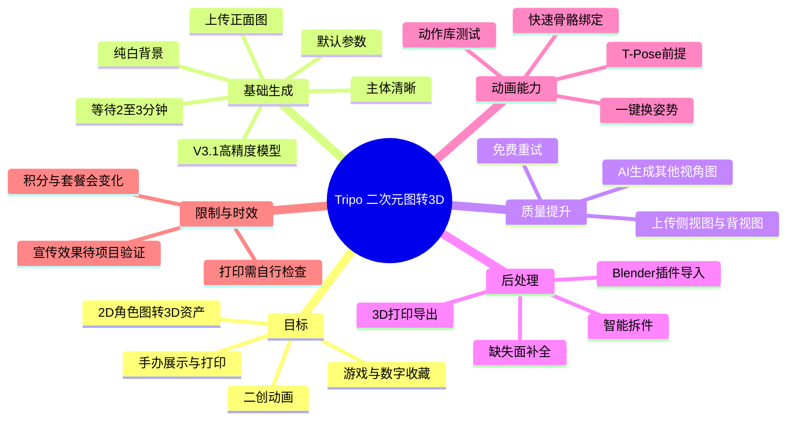
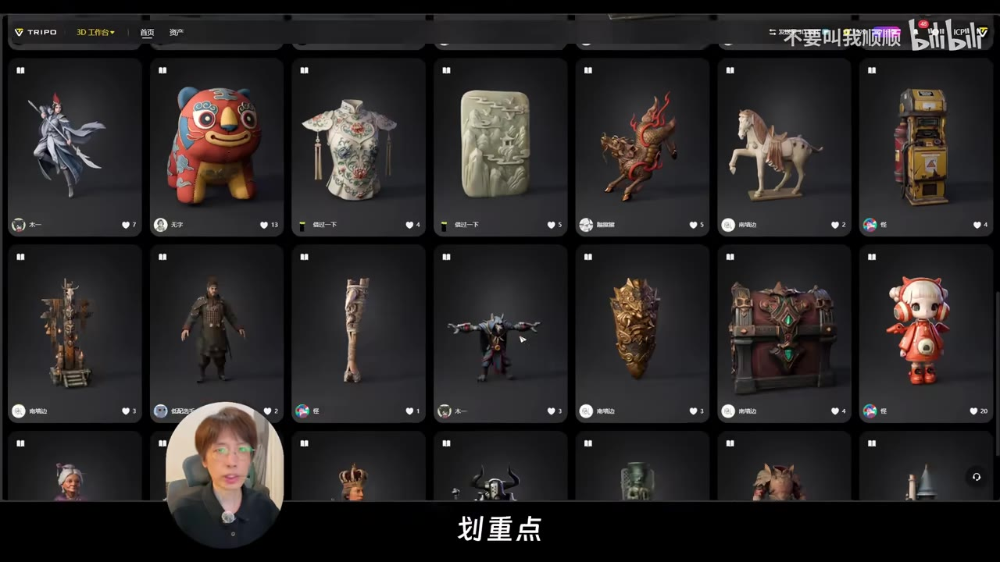
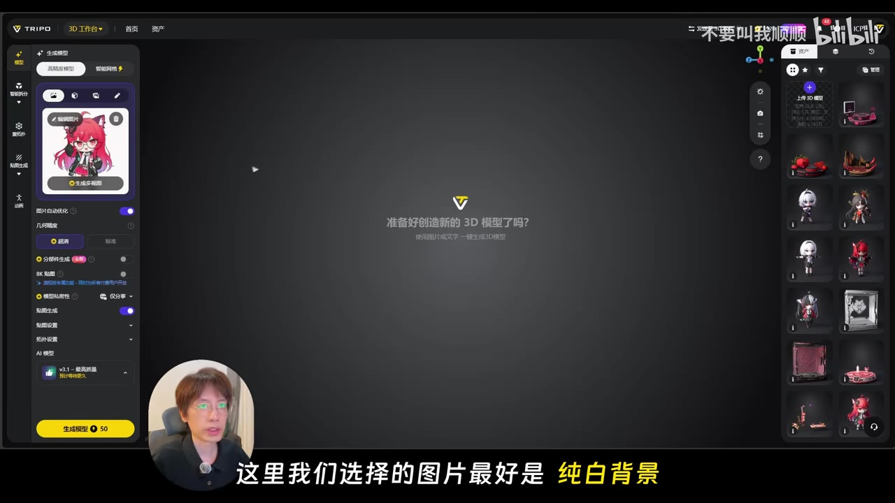
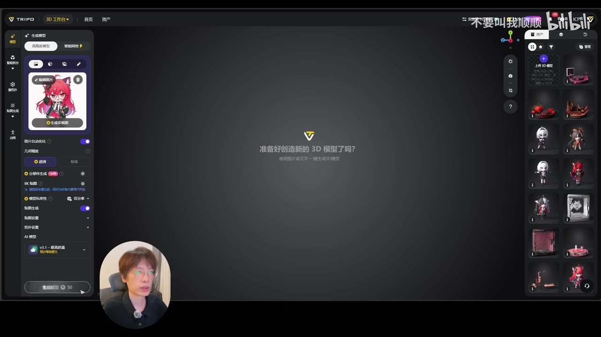
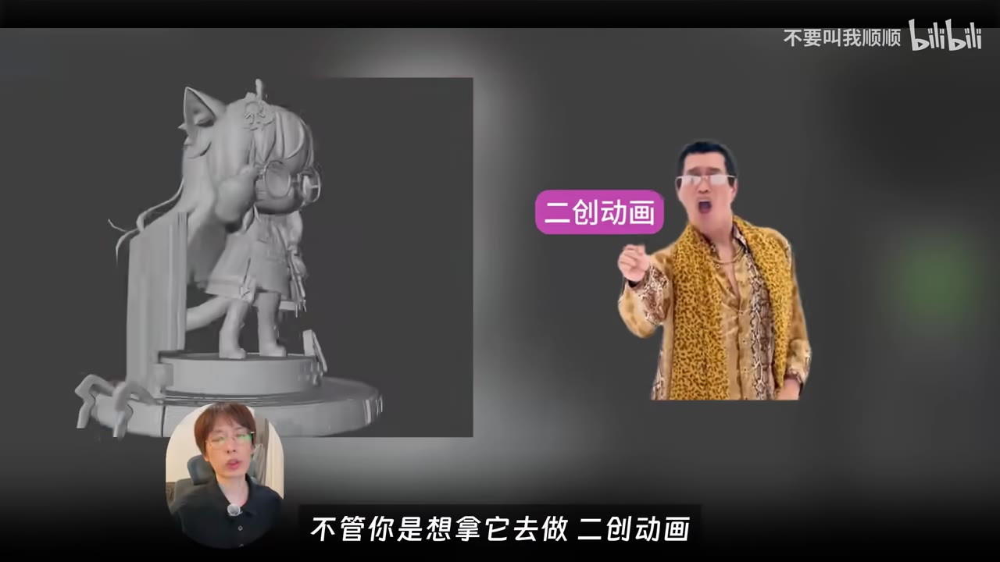

# 一键生成！体验在 Tripo 给二次元角色做成手办数字资产！

> 来源：[Bilibili 视频](https://www.bilibili.com/video/BV1uQ3v6yEHZ) 
> UP 主：不要叫我顺顺｜发布时间：2026-07-29｜视频时长：04:03

## 小结

视频演示了使用 **Tripo AI 网页端**把一张二次元角色二维图转为三维资产的基础流程，并进一步介绍智能拆件、部件补面、3D 打印导出、Blender 插件导入和快速骨骼绑定等后续能力。目标用途包括二创动画、游戏资产、数字虚拟收藏和“赛博手办”展示场景。

最核心的实操路径是：准备主体清晰、最好为纯白背景的正面角色图；进入 3D 工作台上传图片；其余参数保留默认并选择 **V3.1 高精度模型**；点击生成后等待约 **2～3 分钟**。若拥有侧视图、背视图，可以多图上传以改善模型各视角之间的吻合度。

视频将 Tripo 描述为无需下载安装数十 GB 软件、可在网页使用的工具，并展示了资产浏览页与工作台界面。需要注意的是，“不吃电脑配置”“可直接用于游戏”“生成效果非常还原”等属于视频中的产品定位或体验性陈述，不等于模型已经满足特定游戏引擎、生产管线或打印成品的全部技术规范。

对于模型与底座、饰品粘连的问题，视频建议使用智能拆件和部件补全：将角色躯干、复杂底座和小配饰拆分，并为拆分后缺失的面进行封口补全。若用于实体打印，仍需自行检查网格封闭性、细小部位强度、尺寸、支撑和后处理；视频未展示实际切片或打印成品。

快速骨骼绑定有明确前提：**此前上传的图片应为 T-Pose**。绑定完成后可在动作库中测试并一键换姿势，从而减少手动调骨骼的工作；但视频没有展示绑定质量、权重涂绘、复杂服装穿插或动作变形的测试结果。

视频末尾提到“登录送 300 积分”“可免费生成十几个模型”等活动与额度信息，属于强时效性宣传。画面中的生成按钮还显示“50”积分消耗，因此不能仅按 300/50 推导生成次数；不同模型、功能、账户权益或活动规则可能不同，应以 Tripo 当时页面的实际价格和规则为准。

## 思维导图

## 目录

- [视频定位与工具概览](#视频定位与工具概览)
- [从二维角色图生成三维模型](#从二维角色图生成三维模型)
- [多视角、重试与生成质量](#多视角重试与生成质量)
- [智能拆件、补面与 3D 打印](#智能拆件补面与-3d-打印)
- [场景底座与 Blender 导入](#场景底座与-blender-导入)
- [快速骨骼绑定与动作库](#快速骨骼绑定与动作库)
- [积分活动、限制与时效性](#积分活动限制与时效性)
- [字幕比对](#字幕比对)
- [评论分析](#评论分析)
- [处理记录](#处理记录)

## [视频定位与工具概览](https://www.bilibili.com/video/BV1uQ3v6yEHZ?t=0)

视频开头提出的需求是：不学习传统角色建模教程，也能让新手在约 5 分钟内，以一键方式生成角色模型。这里的“5 分钟”是视频的总体宣传性表述；具体实操段明确说模型生成等待时间约为 2～3 分钟，其余时间包含素材准备、上传与后续处理。

UP 主将工作流概括为：把普通的 2D“纸片人”转成可用于游戏、二创动画、数字虚拟收藏或赛博手办展示的 3D 资产。该表述说明了预期应用方向，但视频没有展示导入具体游戏引擎、资产格式要求、面数、UV 标准或授权范围。

约 00:31 起，视频介绍 Tripo AI（站内字幕多处转写为 “Triple AI”，而画面界面品牌为 **TRIPO**）。工具被描述为网页端服务：无需下载数十 GB 的大型软件，并可直接打开网页体验。

> 图：画面展示 TRIPO 的资产卡片浏览界面，包含角色、摆件、物件等不同三维资产缩略图。它的价值在于说明视频介绍的是一个网页端三维资产平台，而不只是单一的“图片转模型”按钮。

## [从二维角色图生成三维模型](https://www.bilibili.com/video/BV1uQ3v6yEHZ?t=47)

### 操作步骤

1. **进入 3D 工作台**  
   在约 00:47，视频进入 Tripo 的 3D 工作台，选择“上传图片”。

2. **上传角色正面图**  
   UP 主使用准备好的角色正面图作为输入。视频以二次元角色示例说明流程，但并未给出文件格式、分辨率、尺寸上限或版权审核规则。

3. **优先选择纯白背景、主体清晰的图片**  
   视频的明确经验是：图片最好为**纯白背景**，主体越清晰，生成效果越好。其逻辑是降低人物轮廓、服装配件与背景混淆的概率。

4. **其余参数保留默认，选择 V3.1 高精度模型**  
   视频说下方参数保持默认，并选择“最新的 **V3.1 高精度模型**”。UP 主称该模型可获得较保真的几何结构与贴图；这是视频中的工具能力描述，未提供与其他模型版本的量化对比。

5. **点击生成并等待**  
   点击“生成模型”后，视频给出的等待时间为 **2～3 分钟**，随后展示第一个模型生成完成。

> 图：工作台左侧可见已上传的二次元角色图，底部为生成按钮，模型区域显示 “v3.1”。这张图直接对应“上传图片—选择模型—生成”的关键操作节点，也能帮助确认“纯白背景”建议所对应的界面环境。

### 界面与参数说明

视频没有逐项解释全部参数的功能。关键帧中可以看到工作台存在图片自动优化、几何模型、纹理相关选项，以及 “8K 贴图”等界面文字；但 UP 主在本次演示中的做法是将下方参数保持默认。因此，不能据此推断视频已经验证了这些额外选项的质量差异、积分消耗或适配场景。

> 图：画面字幕强调“这里我们选择的图片最好是纯白背景”，左侧上传卡片中的角色素材与右侧资产缩略图区共同构成操作上下文。该帧的价值在于把输入素材质量与生成结果联系起来。

## [多视角、重试与生成质量](https://www.bilibili.com/video/BV1uQ3v6yEHZ?t=80)

模型生成后，视频从肢体结构、面部效果和整体一致性三个角度评价结果，认为当前 AI 生模技术已经“非常好”、整体还原度较高。这是对演示样例的主观体验，不能外推为所有复杂二次元角色、遮挡严重角色或非人形资产都能获得同等质量。

### 多图上传的经验

若用户手头有模型的侧视图和背视图，可使用多图上传。视频认为这样能让模型在不同视角间更加“严丝合缝”，即提升结构一致性和拼合精度。

对于缺少侧面或背面参考图的情况，视频建议先使用 “Image2” 或被字幕识别为“香蕉大模型”的图像生成工具补充其他视角图，并提及可获取其提示词。视频没有展示具体提示词内容，也没有验证由 AI 补出的多视图是否具有严格一致的服装纹理、饰品位置和解剖结构。

### 重试权益

当模型生成结果不满意时，视频说可点击“免费重试”：

- “Tripo 专业版”提供 **3 次免费重试机会**；
- 视频称这对日常使用基本够用；
- 对高频建模、反复迭代的用户，视频称某“一键版”可无限重试，更省心。

站内中文字幕中“一键版则可以无线充实”显然是识别错误；结合英文、日文、葡语站内字幕及 ASR 上下文，应校正为“可**无限重试**”。不过视频没有清晰给出该“一键版”的准确产品名、订阅价格、权益条件或地域差异，不能将其视为当前有效的套餐说明。

## [智能拆件、补面与 3D 打印](https://www.bilibili.com/video/BV1uQ3v6yEHZ?t=128)

视频指出，早期或传统 AI 建模的痛点之一，是模型与配件容易粘连为一个整体。针对这一问题，Tripo 提供两项后处理能力：

1. **智能拆件**：可一键拆分角色躯干、复杂底座和小配饰等组件。
2. **部件补全／封口补全**：拆分后若部件存在缺失的面，可通过 AI 快速封口补全。

这里的“完美分开”“快速补全”是视频话术。对于实际生产用途，应额外检查：

- 拆件边界是否符合装配需求；
- 补全后网格是否为封闭体、是否存在非流形边或自交；
- 细小配饰、发丝、裙摆和薄片结构是否具备打印强度；
- 角色与底座分件后的插接、胶水位、尺寸公差是否合理；
- 贴图接缝、法线、UV 与材质在拆分后是否需要人工修整。

约 02:34，视频面向有 3D 打印需求的用户，演示点击“3D 打印”并直接导出打印模型。视频没有展示导出格式、切片软件、树脂/耗材、打印机参数、支撑策略或实际打印结果。因此，“可导出打印模型”不能等同于“无需检查即可直接打印成品”。

## [场景底座与 Blender 导入](https://www.bilibili.com/video/BV1uQ3v6yEHZ?t=162)

生成角色模型后，视频进一步提出“提升逼格”的做法：为手办制作一个小场景或底座。UP 主说底座图同样是用 Image2 大模型 AI 生图生成，然后再转入后续三维工作流。

### Blender 插件导入流程

视频称 Tripo 提供面向各类 3D 建模软件的快速导入插件，并以 **Blender** 为例说明：

1. 安装 Tripo 的相关插件；
2. 打开 Blender；
3. 点击“开启”；
4. 出现悬浮窗；
5. 在悬浮窗中选择自己的资产模型；
6. 将模型导入建模软件；
7. 在 Blender 内组装赛博手办展示盒／展示场景。

视频未给出插件下载地址、兼容的 Blender 版本、登录授权方式、支持的文件格式，亦未展示材质、贴图、比例单位、骨骼或动画数据是否完整导入。若实际使用，应以插件版本说明和导入后的场景检查为准。

> 图：画面左侧展示带底座和装饰结构的灰模手办，右侧标注“二创动画”。它的价值在于具象化视频所说的两类应用：将角色作为三维手办展示资产，以及用于二创动画的角色基础模型。

## [快速骨骼绑定与动作库](https://www.bilibili.com/video/BV1uQ3v6yEHZ?t=198)

若希望角色模型摆出更多姿势，视频建议使用 Tripo 的**快速骨骼绑定**功能。其明确前提是：

> 此前上传的图片必须是 **T-Pose**。

也就是说，角色应以适合绑定的标准站姿呈现；视频未解释 T-Pose 的手臂角度、正侧背多视图要求、服装遮挡容忍度或非人形角色的适配范围。

完成绑定后，用户可在动作库中测试效果，并一键更换姿势。视频将其优势概括为不必手动调节骨骼、节省时间和精力。

需要区分的是：

- 视频展示的是“快速绑定 + 动作库测试”的工作流；
- 视频没有展示权重涂绘、IK/FK 控制器、手指骨骼、面部表情骨骼、布料与头发穿插处理；
- 因而对于动画镜头、游戏角色或高质量展示动作，仍可能需要在 Blender 等 DCC 软件中进行人工修正。

## [积分活动、限制与时效性](https://www.bilibili.com/video/BV1uQ3v6yEHZ?t=220)

视频结尾有三项信息：

- 视频中所用素材和模型已上传至“学习群”；
- 当时登录 Tripo AI 可获赠 **300 积分**；
- 视频称该额度足够免费生成“十几个模型”。

这些均应视为视频发布时间附近的宣传或活动信息，而不是长期有效承诺。特别是关键帧中“生成模型”按钮旁可见 **50** 的数值标识，若把它简单理解为单次固定消耗，则 300 积分与“十几个模型”的口径并不直接一致。合理的解释可能包括：模型模式、分辨率、活动优惠、重试规则或画面录制时的价格不同；但视频未提供足够信息确认原因。

### 使用边界

| 项目 | 视频已说明 | 视频未说明或需自行验证 |
| --- | --- | --- |
| 输入素材 | 正面图优先；纯白背景；主体清晰；多图可提升效果 | 图像尺寸、格式、人物遮挡限制、版权审核 |
| 生成模型 | V3.1 高精度模型；等待约 2～3 分钟 | 面数、拓扑、UV、格式、商用权利 |
| 多视图 | 可上传侧视图、背视图 | AI 补视图的一致性与可靠性 |
| 拆件补面 | 提供智能拆件、缺失面补全 | 拆分精度、封闭性、网格质量 |
| 3D 打印 | 可通过“3D 打印”导出模型 | 切片、比例、支撑、材料与打印成品质量 |
| Blender | 可通过插件快速导入 | 插件版本、材质保留、骨骼与动画导入效果 |
| 骨骼绑定 | T-Pose 前提下快速绑定；动作库换姿势 | 权重质量、复杂动作、面部和布料处理 |
| 积分与套餐 | 视频称登录送 300 积分、专业版 3 次免费重试 | 当前价格、次数、区域、账户和活动限制 |

## 字幕比对

| 字幕来源 | 完整性 | 专有名词 | 时间轴 | 主要问题 |
| --- | --- | --- | --- | --- |
| Bilibili 站内中文字幕 `p01-ai-zh.srt` | 覆盖完整，分段细，00:00:00.320～00:04:02.920 | “Tripo”多处写作“Triple”；“Blender”被识别成“bra”；“T-Pose”写作“TPOS” | 可直接使用，且分段更细 | 存在“AI声模”“免费从试”“无线充实”“香蕉大模型”等明显识别或转写问题 |
| 本次 ASR `large-v3-turbo` | 13 个长段，覆盖约 232.21 秒，语音覆盖率 95.58% | 能识别 Tripo/Triple、V3.1、Image2、T-Pose 等上下文，但错字较多 | 有时间戳，覆盖 00:00:00.110～00:04:02.430 | 分段过粗，存在“纸骗人”“大体机软件”“Brenner”“骨格”等同音或断句错误 |

### 最终字幕选择与校正原则

最终以 **Bilibili 站内中文字幕的细粒度时间轴**作为章节定位依据，并通过本次 ASR 进行交叉检查。ASR 诊断显示源文件存在有效音频：语言识别为中文，置信度约 **0.998**，未标记 `noAudioStream=true`，因此不存在“源视频无音轨”的情况。

主要校正如下：

- 站内字幕与 ASR 均将产品名写作或听作 “Triple AI”，但视频标题与界面画面显示为 **Tripo / TRIPO**，正文统一采用“Tripo AI”，并保留转写差异说明。
- “AI 声模技术”应结合语义校正为 **AI 生模技术**，即 AI 生成三维模型。
- “测试图和背试竹”应校正为 **侧视图和背视图**。
- “免费从试”“无限从事／无线充实”应校正为 **免费重试、无限重试**。
- “智能拆键、部件补权”应校正为 **智能拆件、部件补全**。
- “3D 达印”应校正为 **3D 打印**。
- “Brenner／bra”根据多语言站内字幕及视频语境校正为 **Blender**。
- “T-POS／TPOS”按英文字幕和 ASR 语境写作 **T-Pose**。

## 评论分析

以下仅分析可获取的热评前三条；评论是用户体验或疑问，不构成已验证事实。

1. **kimosincy（4 赞）：“对复杂二次元角色建模效果如何”**  
   该评论提出视频尚未充分覆盖的核心问题：复杂二次元角色往往包含多层服饰、透明/细小饰品、复杂发型、武器和遮挡关系。视频展示了单个案例，并建议多视图上传与拆件补面，但没有给出复杂角色的失败案例、成功率或人工修复成本，因此无法直接回答该问题。

2. **玖夜kuyoru（2 赞）：“掏钱用了下 最多辅助用下”**  
   评论者表达了付费试用后的保留态度，认为工具最多适合作为辅助。该观点与视频中“自动生成—拆件—绑定”的高效率展示形成补充：AI 生模可能适合作为概念验证、基础体块、素材原型或前期资产，但是否能直接替代人工建模，仍取决于具体质量要求。评论未提供模型、素材、参数或结果截图，不能据此量化其结论。

3. **菜鸡与土豆（2 赞）：“建模只是开始，打磨和涂装才是噩梦。”**  
   该评论强调实体手办制作流程的后半段：即使已经得到三维模型，仍可能面对网格修复、分件、切片、打印、打磨、补土、上色和装配等工作。视频确实提及拆件、补面和 3D 打印导出，但没有覆盖物理打印后的后处理与涂装，因此这一评论对视频的应用边界形成了合理提醒。

## 处理记录

- **Worker ID**：`worker-mrj0wjed-b0c290ad`
- **模型**：`gpt-5.6-terra`
- **ASR 模型与结果**：`large-v3-turbo`；识别语言为中文，语言置信度 `0.998046875`；音频时长约 `242.944` 秒；共 13 个识别段；未出现无音轨标记。
- **使用的素材工具**：视频元数据、站内多语言 SRT 字幕、ASR 时间轴 SRT 与 `asr-result.json`、关键帧目录、热评前三条数据。
- **字幕选择**：以站内中文 SRT 的逐段真实时间轴定位章节；使用 ASR 交叉核对语音内容；对产品名、Blender、T-Pose、重试、拆件与打印等误识别词做了上下文校正。
- **关键帧选择依据**：选用 `frames/frame-001.jpg` 展示三维手办与二创应用目标；`frames/frame-002.jpg` 说明 TRIPO 网页端资产界面；`frames/frame-003.jpg` 对应上传图片、V3.1 与生成按钮；`frames/frame-004.jpg` 对应纯白背景输入素材建议。其余关键帧路径虽已提供，但本次正文未在可见素材中获得更明确的画面对应信息，未强行解读。
- **缓存清理**：未执行缓存清理；保留已提供的 `frames/`、`asr/`、`subtitles/` 与 `comments/` 素材引用路径，以保证本文中的相对图片链接和字幕核验可追溯。
- **未解决问题**：未提供 Tripo 当前套餐页面、积分规则、导出格式、商业授权条款、打印实测和 Blender 插件版本信息；上述内容不能由本视频及现有素材确认。
