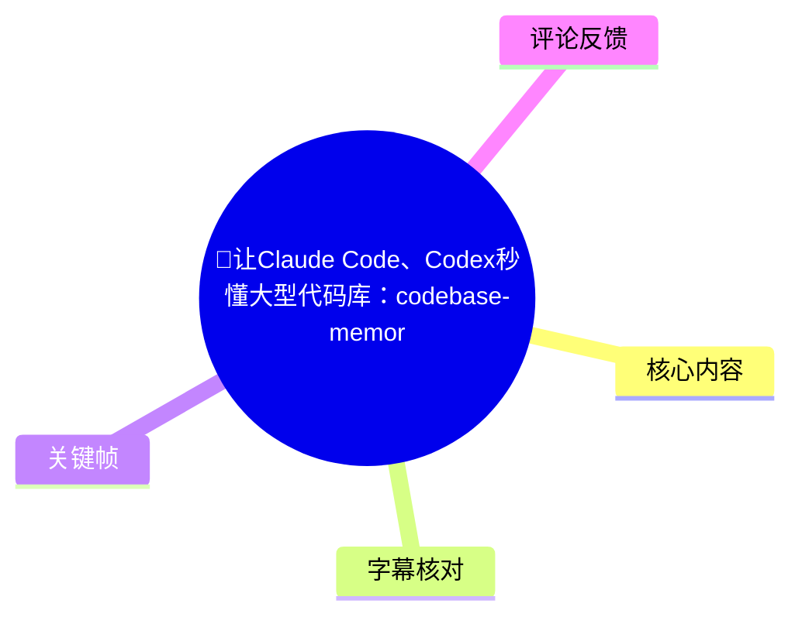
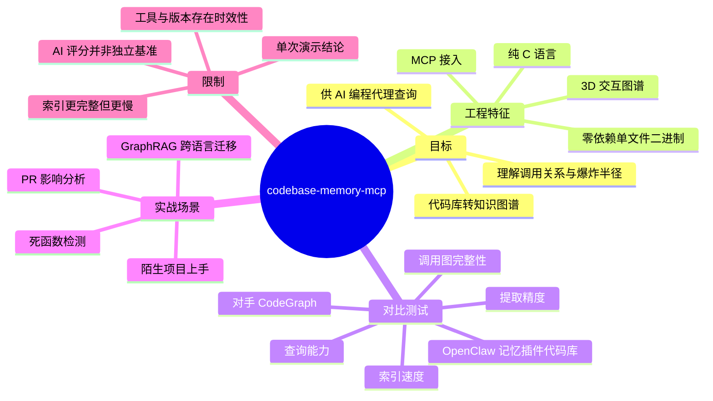
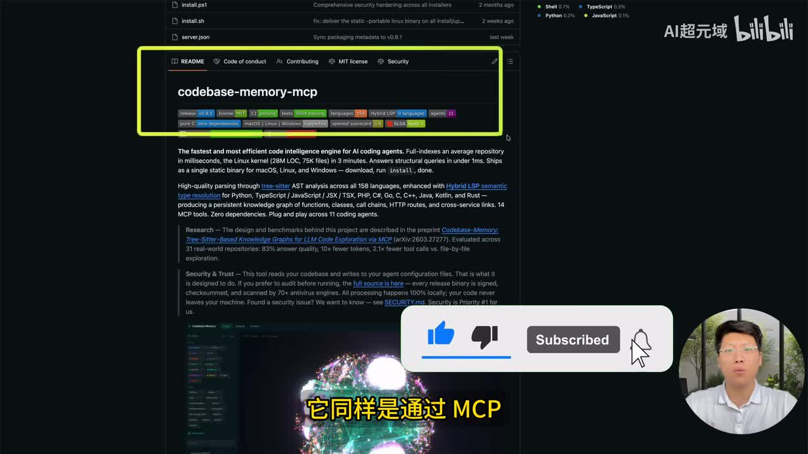
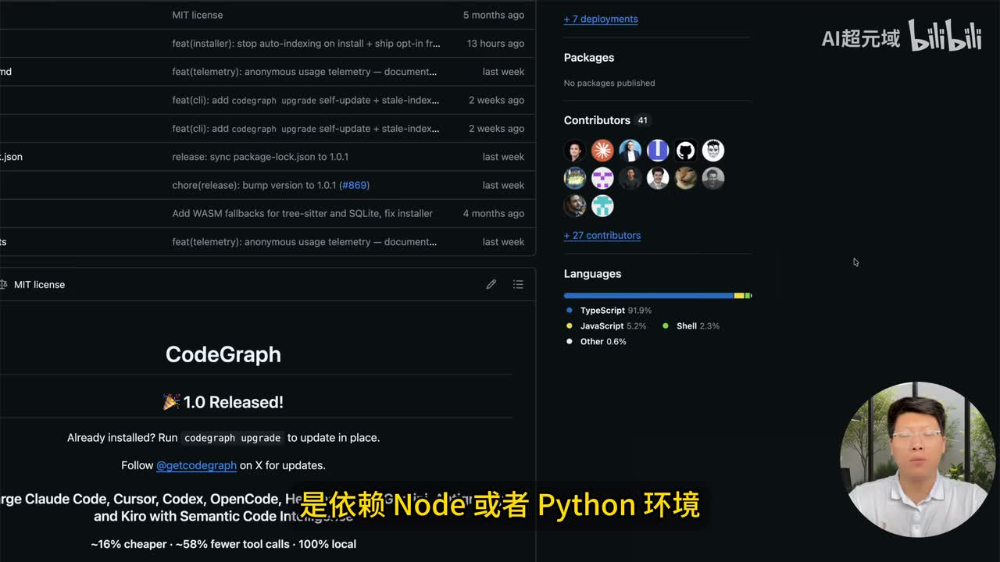
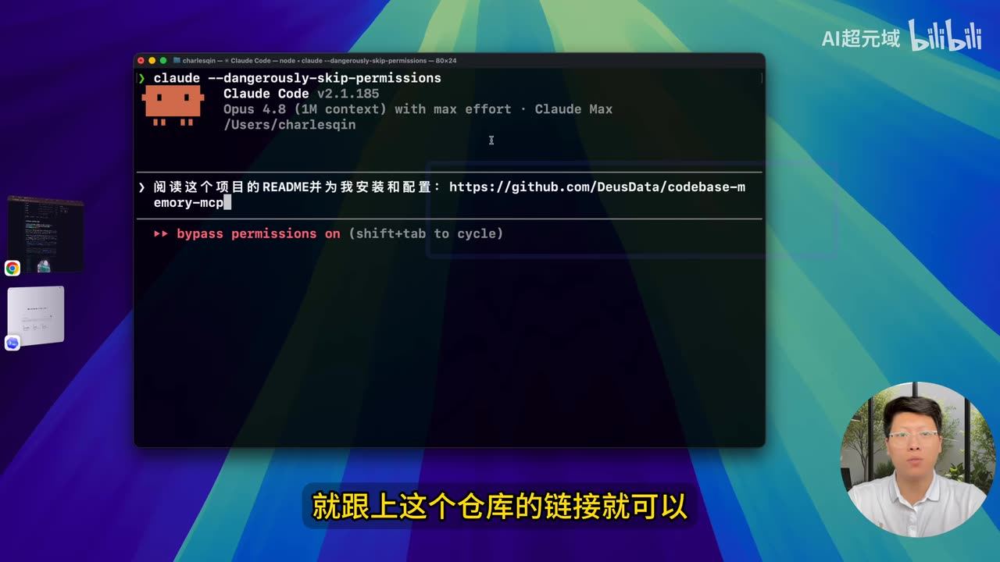
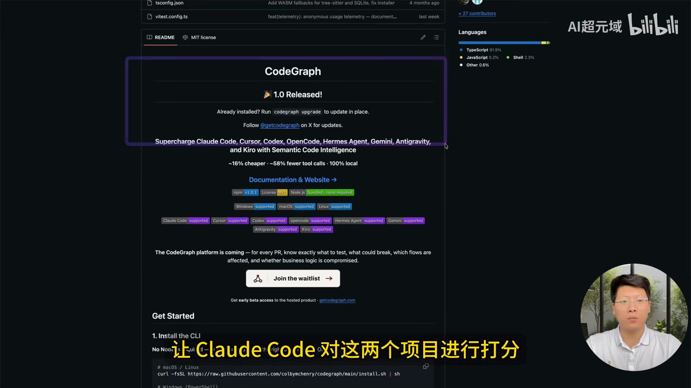

# 🚀让Claude Code、Codex秒懂大型代码库：codebase-memory-mcp让代码秒变知识图谱！实测超越CodeGraph！帮你秒懂陌生项目！

> 来源：[Bilibili 视频](https://www.bilibili.com/video/BV1Ma7T6jEnu)  
> UP 主：AI超元域｜时长：11 分 09 秒｜合集：AIcode  
> 本文中的“领先”“评分”“支持语言数”等均为视频演示或项目页面所述，未在本文中独立复现验证。

## 小结

视频介绍 `codebase-memory-mcp`：一个通过 MCP（Model Context Protocol）将代码库索引为知识图谱的工具，目标是让 Claude Code、Codex、Cursor 等 AI 编程工具在修改代码前理解调用关系、依赖关系与变更“爆炸半径”。视频展示了可交互的 3D 图谱：节点可点击查看代码及其依赖、调用关联。

UP 主强调该工具的工程特点是：纯 C 语言、零依赖、单二进制文件运行；视频和关键帧中的项目页面还展示了其支持 macOS、Linux、Windows，并标注“158 languages”“20+ relations”等信息。视频称其可使用 Cypher 进行图查询，并称具备语义向量搜索、复杂度/热点指标、社区聚类、数据流追踪等能力。

实测部分以一个为 OpenClaw 开发的记忆插件代码库为对象，让 Claude Code 同时调用 `codebase-memory-mcp` 与 CodeGraph 索引并评分。视频展示的结果是：CodeGraph 索引 194 个文件，`codebase-memory-mcp` 索引 221 个文件，后者还纳入 Markdown、JSON、Bash 等文件；在提取精度、调用图完整性、查询能力三项中被评为更优，但索引耗时约 16 秒，慢于 CodeGraph 的 1.7 秒。两者平均分据称只相差 0.1 分，因此“全面超越”应理解为该次提示词、该代码库和该模型评测下的结论，而非普遍基准。

视频给出的实际使用方式很简单：在 Claude Code 或 Codex 中输入“阅读项目 README 并为我安装和配置：仓库链接”一类提示，让代理代为配置。后续演示覆盖陌生项目上手、PR 影响半径分析、死函数排查，以及把 GraphRAG 从一个项目迁移到 OpenClaw 记忆插件的跨仓库、跨语言落地规划。

适合读者：需要让 AI 编程代理处理大型、陌生或多语言仓库的开发者，特别是有架构梳理、重构前影响评估、PR 审查、异常反查和功能迁移需求的人。限制在于：视频未给出可复现的完整命令、测试仓库提交版本、对照“真值”的具体人工标注过程，也未展示全部生成报告；工具版本、兼容性与评测结果均可能随项目迭代而变化。

## 思维导图





## 目录

- [背景、定位与技术特征](#背景定位与技术特征)
- [安装与接入 Claude Code、Codex](#安装与接入-claude-codecodex)
- [与 CodeGraph 的实测比较](#与-codegraph-的实测比较)
- [大型项目图谱与陌生项目上手](#大型项目图谱与陌生项目上手)
- [PR 影响分析与死函数排查](#pr-影响分析与死函数排查)
- [GraphRAG 跨仓库迁移方案](#graphrag-跨仓库迁移方案)
- [结论、限制与时效性](#结论限制与时效性)
- [字幕比对](#字幕比对)
- [评论分析](#评论分析)
- [处理记录](#处理记录)

## 背景、定位与技术特征

### [从代码库图谱到 AI 编程代理上下文｜00:02](https://www.bilibili.com/video/BV1Ma7T6jEnu?t=2)

视频将 `codebase-memory-mcp` 放在 GitNexus、Graphify 等“代码库知识图谱”工具的同一类目中。其核心思路不是仅让大模型读取若干源码文件，而是先将仓库索引成带有节点、边和关系的图谱，再经 MCP 暴露给 AI 编程工具。

视频所称的图谱可提供：

- **调用关系**：函数或模块之间的真实调用链；
- **依赖关系**：代码实体、文件、模块之间的依赖；
- **爆炸半径**：修改某个函数、文件或 PR 后可能受影响的对象范围；
- **代码浏览入口**：在可视化图中点击节点，可查看其代码以及关联关系。

因此，它面向的主要问题是：AI 代理在陌生、大型项目中容易因上下文不完整而误判入口、遗漏调用链，或在改动前无法估算影响范围。视频的判断是，图谱可让代理“在改代码前完整感知项目结构”；这是工具设计目标与演示结论，并不代表任何 AI 在所有仓库中都能获得同等效果。



> 图：关键帧展示项目 README、名称 `codebase-memory-mcp` 以及版本、许可证、CI、语言数、依赖等标签。它为视频关于项目定位、MCP 接入和项目页面能力宣称提供了画面依据。

### [纯 C、零依赖与查询能力｜01:14](https://www.bilibili.com/video/BV1Ma7T6jEnu?t=74)

视频归纳该项目相对同类工具的几个技术卖点：

| 维度 | 视频陈述 | 对实际使用的含义 |
| --- | --- | --- |
| 实现语言 | 纯 C 语言编写 | 视频将其视为启动和运行更轻量的原因之一。 |
| 运行依赖 | 不依赖 Node 或 Python 环境；零依赖单文件程序 | 用户理论上只需下载对应二进制即可运行，减少运行时环境配置。 |
| 查询 | 支持 Cypher 图查询 | 可围绕节点、边、调用与依赖构造图查询，而不仅是文本检索。 |
| 内置关系 | 20 多种语义关系 | 视频未枚举每一种关系名称与定义。 |
| 语言覆盖 | 支持 158 种语言 | 为视频与项目页面展示的数字，未在视频中逐个验证解析质量。 |
| 图谱能力 | 语义向量搜索、复杂度与热点指标、架构社区聚类、数据流追踪 | 视频列为分析深度的组成，未展示所有能力的详细输入输出。 |
| 调用图原则 | “只含真实调用”，并捕获默认参数、测试文件调用 | 这是视频对其调用图质量的概括性描述，仍需按目标语言和仓库复验。 |

关键帧同时对照了 CodeGraph 页面与项目页面。视频的论点并非 CodeGraph 完全不可用，而是认为 `codebase-memory-mcp` 用单二进制和更广关系提取换取了更完整的图结构；代价则会体现在后续对比中的索引耗时。



> 图：画面中上方为 `codebase-memory-mcp` 仓库信息，下方为 CodeGraph 页面，字幕强调后者依赖 Node 或 Python 环境。这张图适合说明视频提出的运行时依赖差异，但不构成对所有版本的独立验证。

## 安装与接入 Claude Code、Codex

### [让代理阅读 README 并自动配置｜01:38](https://www.bilibili.com/video/BV1Ma7T6jEnu?t=98)

视频推荐的接入流程不是手动逐项编辑 MCP 配置，而是把项目文档链接交给 Claude Code 或 Codex，让代理自行阅读 README、安装并配置。视频在 Claude Code 与 Codex 中均采用相同思路。

可按视频意图组织提示词如下：

```text
阅读这个项目的 README，并为我安装和配置：
<codebase-memory-mcp 仓库链接>
```

操作步骤：

1. 打开 Claude Code 或 Codex 的对话/命令输入界面。
2. 输入要求代理“阅读 README 并安装和配置”的提示。
3. 在提示末尾附上目标仓库链接。
4. 发送后，由代理根据 README 完成下载、安装及 MCP 配置。
5. 若要使用 UP 主称已优化的版本，则替换为其页面所给仓库链接，仍可让代理自动安装配置。
6. 完成后，要求代理对当前仓库执行索引，或让其基于图谱回答项目结构、调用关系、影响范围等问题。

视频没有展示完整的 MCP 配置文件内容、二进制安装命令、权限确认流程或失败处理。因此，上述“自动配置”依赖代理的执行权限、操作系统、网络环境、仓库文档准确性以及当前客户端对 MCP 的支持情况。对于来源不明的二进制或自动执行脚本，应先审查 README、发布页、校验信息与权限范围。



> 图：终端中的提示词为“阅读这个项目的 README 并为我安装和配置”，后接 GitHub 仓库链接。它直接呈现了视频最简接入方法，而非手动配置细节。

## 与 CodeGraph 的实测比较

### [测试设计：同仓库、同符号、四个维度｜02:50](https://www.bilibili.com/video/BV1Ma7T6jEnu?t=170)

视频选择一个“为 OpenClaw 开发的记忆插件”代码库，将 `codebase-memory-mcp` 与 CodeGraph 同时安装在 Claude Code 中，并让 Claude Code 对两者作比较。

视频中输入的评测要求包含：

1. 让两套工具索引同一个代码库；
2. 在相同符号上比较；
3. 对比**提取准确度、调用图完整性、查询能力、索引速度**；
4. 每处差异结合“真值”公平列出；
5. 列出各自强项；
6. 保持中立；
7. 给出各维度 0—10 的评分表与结论。

这里存在应当区分的两类耗时：

- 视频称 Claude Code 完成整项比较任务等待了 **20 多分钟**，这应包含代理调用、索引、比较、生成页面等端到端过程；
- 后续表格中给出的“索引耗时”是各工具自身在该次测试中的指标：CodeGraph **1.7 秒**，`codebase-memory-mcp` **约 16 秒**。两者并不矛盾，也不可直接将 20 多分钟当作某个工具的纯索引时间。



> 图：画面展示 CodeGraph 页面，并配有“让 Claude Code 对这两个项目进行打分”的字幕。该图说明评分由 Claude Code 在视频所设定提示词下生成，而非第三方标准化基准。

### [结果：覆盖更多、三项评分更高，但索引更慢｜04:00](https://www.bilibili.com/video/BV1Ma7T6jEnu?t=240)

视频展示的比较结果如下。所有数字均限于视频中的这一次测试与表格，不外推为普遍性能结论。

| 项目 | CodeGraph | codebase-memory-mcp | 视频中的解读 |
| --- | ---: | ---: | --- |
| 索引文件数 | 194 | 221 | 后者还索引了 Markdown、JSON、Bash 脚本等文件，文件覆盖数更高。 |
| 节点与边数量 | 画面有展示但 ASR 未提供具体数值 | 画面有展示但 ASR 未提供具体数值 | 视频称后者生成的节点、边更多。 |
| 索引耗时 | 1.7 秒 | 约 16 秒 | CodeGraph 明显更快。 |
| 提取精度 | 未在 ASR 中给出具体分数 | 8.5 / 10 | 视频称后者领先。 |
| 调用图完整性 | 未在 ASR 中给出具体分数 | 8.0 / 10 | 视频称后者领先。 |
| 查询能力 | 据称比后者低 2 分，具体数值未在 ASR 中清晰给出 | 9.0 / 10 | 视频称后者领先 2 分。 |
| 索引速度评分 | 9.5 / 10 | 未在 ASR 中给出具体分数 | 视频称 CodeGraph 在该项更高。 |
| 平均分 | 与后者仅差 0.1 分 | 与前者仅差 0.1 分 | 总体接近，不是悬殊差距。 |

视频随后把 `codebase-memory-mcp` 的优势总结为：

- 更深的分析与图查询能力；
- 完整 Cypher 支持；
- 语义向量搜索；
- 复杂度、热点指标与架构社区聚类；
- 数据流追踪；
- 更严格的真实调用提取；
- 默认参数与测试文件调用捕获；
- 更广泛的语料覆盖；
- 更细粒度的“值与可执行绑定”提取。

需要注意：评测者本身是 Claude Code，评测流程由自然语言提示词驱动。若要验证“提取精度”和“调用图完整性”，应固定代码库 commit、目标语言、忽略规则、索引参数，并建立人工维护或静态分析器生成的调用关系真值集；同时记录冷启动/热启动、机器配置和缓存状态。视频未展示这些可复现要素，也未展示完整评分表原始内容。

## 大型项目图谱与陌生项目上手

### [18,000+ 节点与 94,000+ 边的图谱演示｜06:01](https://www.bilibili.com/video/BV1Ma7T6jEnu?t=361)

进入更接近开发场景的演示后，视频选取一个开源 AI Agent 记忆项目，要求 Claude Code 使用 `codebase-memory-mcp` 索引当前项目并报告规模。

视频报告：

- 节点数：**18,000 多个**；
- 边数：**94,000 多个**；
- 输出还包括节点构成和边构成；
- 图谱视图支持拖动、放大、缩小，以观察高密度关联。

视频据此判断该仓库“复杂且大型”。这里的节点/边数量能够说明图谱规模，但不能单独代表代码质量、项目复杂度或实际可维护性：不同工具对文件、函数、类、参数、值、测试及文档的建模粒度不同，统计口径会显著影响数字。

### [项目入口、分层、模块与主干数据流｜07:14](https://www.bilibili.com/video/BV1Ma7T6jEnu?t=434)

视频让 Claude Code 基于图谱“快速上手”该项目，要求覆盖项目入口、核心模块和分层。Claude Code 给出的单句摘要是：该项目是供 Agent 使用的“记忆和知识图谱引擎”。

视频展示的入口和架构整理为：

| 分类 | 视频列出的内容 |
| --- | --- |
| 真实入口（6 个） | Path and Code API、HTTP、REST 服务、CLI、MCP、分布式服务化入口、DB Worker 子进程入口 |
| 分层 | 接口层、领域层、任务层、基础设施层 |
| 其他输出 | 核心模块、主干数据流 |

原始口述中“六个真实入口”与后续列出的项目数量在转写中存在不一致：ASR 连续列出了 Path and Code API、HTTP、REST、CLI、MCP、分布式服务化、DB Worker 子进程等项。由于视频未在给定文字素材中提供原始表格的清晰逐行内容，本文保留视频列举，不强行合并或删减为精确六项。

对陌生项目进行图谱化上手时，可把视频的方法转化为一组可审计的问题：

```text
1. 使用 codebase-memory-mcp 索引当前项目。
2. 给出所有外部入口及其对应文件、函数和调用链。
3. 按接口层、领域层、任务层、基础设施层划分模块，并说明划分依据。
4. 给出从请求进入到存储/任务执行的主干数据流。
5. 列出每项结论关联的图谱节点、边和源码位置。
6. 标注无法从静态关系确认的运行时行为。
```

最后两步是视频未明确展示、但对降低 AI 代理“看似合理却不准确”的架构解读很重要的补充：要求引用位置和不确定性边界，避免将推测当作事实。

## PR 影响分析与死函数排查

### [用图谱评估 PR 修改的影响半径｜08:02](https://www.bilibili.com/video/BV1Ma7T6jEnu?t=482)

视频选择一个 PR，要求 Claude Code 调用 `codebase-memory-mcp` 分析改动影响范围并检查受改动函数。输出提供了影响半径及结论，视频口述将其概括为“修复正确、测到位、范围收敛”。

这一场景体现了知识图谱的两种用途：

1. **反向追踪**：从变更函数出发，找调用者、依赖模块、入口路径、测试关联；
2. **正向追踪**：从外部入口或业务流程出发，检查变更是否可能影响下游行为。

视频没有披露该 PR 的链接、具体变更函数、完整受影响节点列表或测试执行结果，因此“修复正确、范围收敛”仅是本次 AI 分析的展示结论，不能替代代码审查、构建、测试及生产环境验证。

建议把视频中的提示要求落到以下检查项：

```text
分析该 PR 的影响半径：
- 列出被修改的文件、符号及其直接/间接调用者；
- 区分生产路径、测试路径、CLI/API/MCP 入口路径；
- 标记可能的破坏性变更、默认参数变化与数据流变化；
- 对每个受影响对象给出源码位置和图谱关系；
- 指出需要补充或复核的测试，而不是直接断言修复正确。
```

### [找出可安全删除的死函数｜08:26](https://www.bilibili.com/video/BV1Ma7T6jEnu?t=506)

视频接着要求工具找出“可以安全删除的死函数”。Claude Code 输出候选函数的名称、所在位置与备注，视频据此认为已能检查代码库中可安全删除的无用代码。

但“静态图中没有调用边”不必然等于安全删除。视频未展开的风险包括：

- 反射、动态导入、字符串注册、依赖注入等运行时调用；
- 配置文件、脚本、外部插件、RPC 或 HTTP 路由中的间接引用；
- 仅在特定平台、特性开关、异常路径或未被索引的生成代码中使用；
- 对外公开 API、兼容层和下游私有调用方。

因此，图谱输出适合作为**候选清单和审查起点**。安全删除仍应要求：全仓检索、构建检查、测试覆盖、公开 API 审核，以及必要时灰度或版本弃用策略。

## GraphRAG 跨仓库迁移方案

### [识别可移植能力：GraphRAG｜08:50](https://www.bilibili.com/video/BV1Ma7T6jEnu?t=530)

视频要求 Claude Code 从前述项目中提取一个最值得迁移到 OpenClaw 记忆插件的能力，用于测试 `codebase-memory-mcp` 的跨代码库、跨编程语言特征迁移效果。

等待数分钟后，视频称工具识别出多个候选能力，其中最具价值的是 **GraphRAG**。随后生成对比列表与迁移步骤。这里应明确：视频没有展示 GraphRAG 的完整原始实现、目标插件现有接口和最终提交的代码，因此它演示的是“生成迁移设计”的能力，不是已经完成且通过测试的迁移事实。

### [从 Python 到 TypeScript 的落地清单｜09:38](https://www.bilibili.com/video/BV1Ma7T6jEnu?t=578)

视频进一步要求 Claude Code 基于两边项目结构，给出将 GraphRAG 迁移到目标项目的方案。提示要求覆盖：

- 哪些核心逻辑可以 **1:1 重写**；
- 哪些 Python 特有依赖需要转换为 TypeScript 等价实现；
- 新代码应放在什么位置；
- 哪些文件需要新增或修改；
- 给出可执行的落地清单和顺序。

输出中据称包括：

| 输出类型 | 视频所示内容 |
| --- | --- |
| 核心逻辑 | 可 1:1 重写的核心逻辑，并附有源项目 Python 代码片段。 |
| 语言转换 | Python 依赖/库与 TypeScript 等价实现的分析。 |
| 文件影响 | 需要新增或改动的文件。 |
| 实施规划 | 落地顺序与细化迁移步骤。 |

这类迁移方案的实用价值在于把“读两个仓库、找边界、对齐接口、判断语言等价物”的任务拆成图谱可查询的关系问题。不过，在真正实施前至少要补充确认：

1. 两个项目的数据模型、错误处理、异步/并发语义和生命周期是否可兼容；
2. Python 库在 TypeScript 生态中是否存在行为相同、许可证兼容且维护活跃的替代品；
3. 图数据库、向量数据库、嵌入模型及检索策略是否与目标运行环境相容；
4. 新功能的 API 边界、配置项、可观测性、迁移脚本和回滚策略；
5. 以基准集和端到端测试验证 GraphRAG 的召回、准确性、延迟与成本。

视频结尾将工具的适用任务归纳为：上手陌生项目、从异常反查根因、重构前评估影响、PR 审查等。它提供的是一条“先图谱化、再让代理查询和规划”的工作流，不能免除开发者对生成计划、改动和测试结果的审核责任。

## 结论、限制与时效性

### [适用边界：把图谱作为 AI 代理的结构化上下文｜10:51](https://www.bilibili.com/video/BV1Ma7T6jEnu?t=651)

视频最有价值的经验不是单纯“让 AI 多读代码”，而是将代码库中的文件、符号、调用、依赖和数据流预先结构化，让 AI 代理能在需要时按关系检索。对于大型或陌生仓库，这比将有限上下文窗口用于盲目全文扫描更有针对性。

可迁移的实践原则：

- **先索引，后提问**：先生成图谱，再让代理回答入口、模块、调用链和影响范围；
- **要求可追溯输出**：让代理返回符号、文件位置、关系类型及不确定点；
- **把 AI 结论视为审查材料**：PR 影响、死代码、迁移方案应经构建、测试和人工审查；
- **平衡质量与时延**：视频中的测试表明，更多文件/节点/边覆盖可能以更慢索引为代价；
- **固定评测条件**：比较工具时应固定仓库提交、解析范围、语言、机器资源、缓存状态和真值集。

主要限制如下：

1. **评测样本有限**：视频只展示一个对比仓库和一个大型项目演示，不能推断所有语言、仓库规模或框架下均领先。
2. **评分主体是 AI**：Claude Code 根据提示词生成比较与评分，可能受模型、提示、上下文、工具调用路径影响。
3. **指标口径不完整**：视频未完整展示节点、边的具体数值、评分表全部内容、真值构造方法、机器配置及索引参数。
4. **动态语言与运行时机制风险**：静态图谱对反射、代码生成、插件、动态注册等场景可能存在遗漏。
5. **自动安装的安全边界**：让代理读取 README 并下载/执行内容，会涉及二进制来源、权限与供应链风险。
6. **信息具有时效性**：视频对应的仓库版本、支持语言数、依赖策略、客户端 MCP 支持及 CodeGraph 特性可能已经变化；实际接入前应以当前仓库 README、Release 和安全说明为准。

## 字幕比对

| 字幕来源 | 完整性 | 专有名词 | 时间轴 | 主要问题 |
| --- | --- | --- | --- | --- |
| Bilibili 站内字幕 `p01-ai-zh.srt` | 不可用于本视频内容 | 与视频主题完全不符 | 仅覆盖约 00:00—04:11 | 内容是“地球承载人口/生物电池”等话题，与代码知识图谱视频无关，明显为错配字幕。 |
| 本次 ASR 字幕 | 高：28 段，语音覆盖约 99.32%，覆盖 00:02.13—11:05.88 | 存在较多音近误识别 | 时间戳连续可用，且与视频时长匹配 | 将 Claude Code 多次误为“Cloud Code”，将代码库、索引、Cypher、GraphRAG、OpenClaw 等出现不同程度错字或错音。 |

本次 ASR 诊断结果显示：识别语言为中文，置信度约 `0.9985`，使用 `medium` 模型、CUDA、`float16`；未标记 `noAudioStream=true`，且音频语音覆盖完整。因此源视频**存在音轨**，本次 ASR 是有效的主时间轴依据。

最终采用策略：

- **时间轴**：采用本次 ASR 的真实起止时间；
- **内容主体**：以 ASR 为基础，并依据标题、视频简介和关键帧校正明显的专有名词；
- **不采用站内字幕**：站内字幕与视频内容完全错配，不能作为事实来源；
- **关键校正**：
  - ASR 的“Cloud Code”按标题、画面和视频上下文校正为 **Claude Code**；
  - “Open Cipher”校正为视频所指的 **Cypher** 图查询语言；
  - “Open Cloud”按视频简介和 ASR 上下文记为 **OpenClaw**；
  - “Graph Rag”统一记为 **GraphRAG**；
  - ASR 中“代砍库/代砂库”“索隐”等统一按语义记为“代码库”“索引”。

## 评论分析

仅处理可获取的热评前三条；评论反映的是用户观点，不作为已验证事实。

1. **obana（4 赞）**：`@MilkyAi总结视频 发送到我邮箱`  
   - 观点：希望借助 AI 对视频进行总结并分发到邮箱。  
   - 补充价值：反映该类工具视频的受众有“快速获取结构化知识”的需求。  
   - 可信度/争议：这是请求而非技术评价，没有提供关于工具效果的证据。

2. **恶人当道的时代（28 赞）**：认为如果知识图谱能大幅提升 LLM 检索效率，Claude Code “恐怕早就集成进去了”。  
   - 观点：对外部知识图谱工具的增益持怀疑态度，以产品原生集成情况作为间接判断。  
   - 补充价值：提出重要的产品化质疑：理论能力、单次演示效果与主流产品是否原生集成之间并不等价。  
   - 可信度/争议：该推论不能单独成立。未原生集成还可能受产品策略、成本、维护、安全、兼容性或用户需求差异影响；但它提示应要求更严格的独立基准与可复现实验。

3. **仲夏夜雨梦（8 赞）**：`和gitnexus比怎么样？`  
   - 观点：希望了解 `codebase-memory-mcp` 与 GitNexus 的直接比较。  
   - 补充价值：视频开头将 GitNexus 列为同类项目，但主体只深度对比了 CodeGraph，没有给出与 GitNexus 的同条件数据。  
   - 可信度/争议：这是合理的未解问题。不能根据本视频推断其相对 GitNexus 的提取精度、查询能力、索引速度或兼容性。

## 处理记录

- Worker ID：`worker-mrj0wjed-b0c290ad`
- 模型：`gpt-5.6-terra`
- 使用的素材与工具结果：
  - 元数据、视频简介、统计信息；
  - ASR 结果 `asr/asr-result.json` 与时间轴字幕 `asr/transcript.srt`；
  - 站内字幕 `p01-ai-zh.srt`；
  - 关键帧目录 `frames/`；
  - 热评数据 `comments/comments.json`，仅使用可获取前三条。
- 字幕选择：
  - 已检查站内字幕与本次 ASR；
  - 站内字幕内容错配，弃用；
  - 本次 ASR 存在音轨且时间戳完整，作为正文时间轴主依据；
  - 对 Claude Code、Cypher、OpenClaw、GraphRAG 等明显误识别词，结合标题、简介、画面和上下文进行有限校正。
- 关键帧选择依据：
  - `frames/frame-001.jpg`：项目 README、能力标签与项目定位；
  - `frames/frame-002.jpg`：与 CodeGraph 页面并列，说明依赖与同类工具背景；
  - `frames/frame-003.jpg`：Claude Code 中的自动安装配置提示词；
  - `frames/frame-004.jpg`：让 Claude Code 对两工具评分的评测设置。
- 缓存清理：素材清单未提供缓存清理执行日志；本文未声称已执行本地文件删除或缓存清理。
- 未解决问题：
  - 未提供完整可读的评测 HTML 表格和全部节点/边统计，无法补全未在 ASR 中明确读出的数值；
  - 未提供测试仓库 commit、硬件环境、索引参数、真值集和完整提示词原文，无法独立复现实测结论；
  - 未提供 GitNexus 的同条件对比数据；
  - 项目版本、支持范围和安全说明可能已变化，需以当前官方仓库资料为准。
