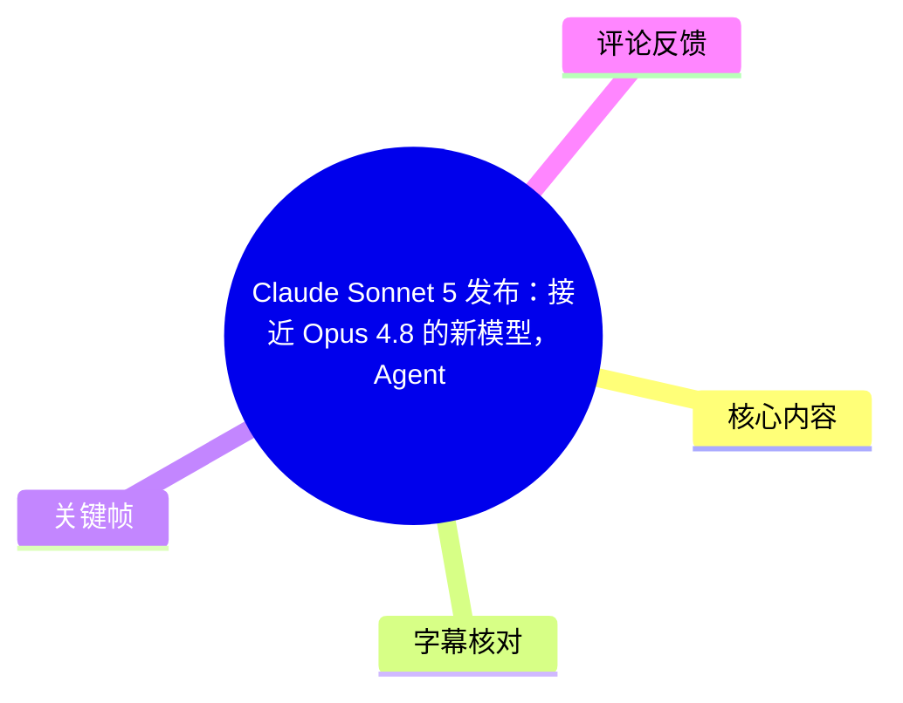
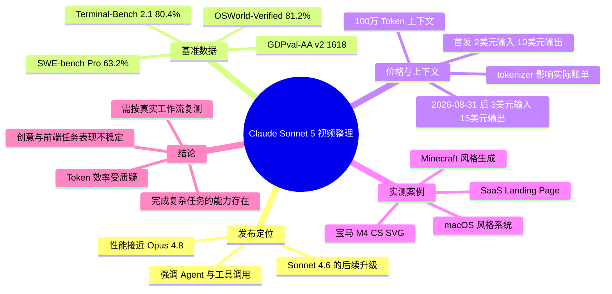
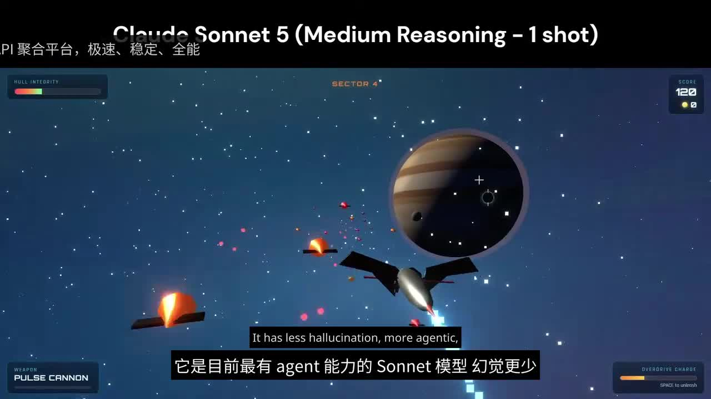
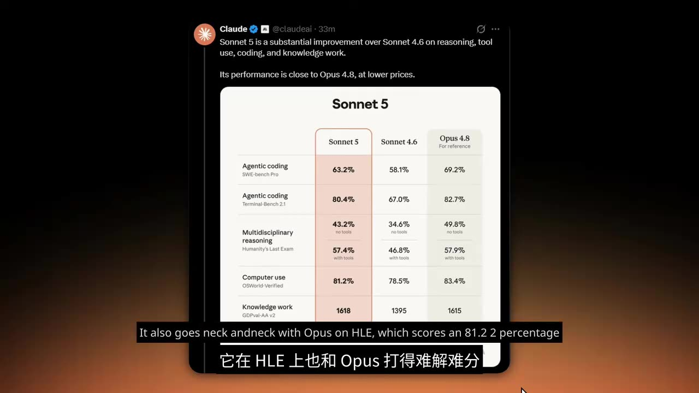
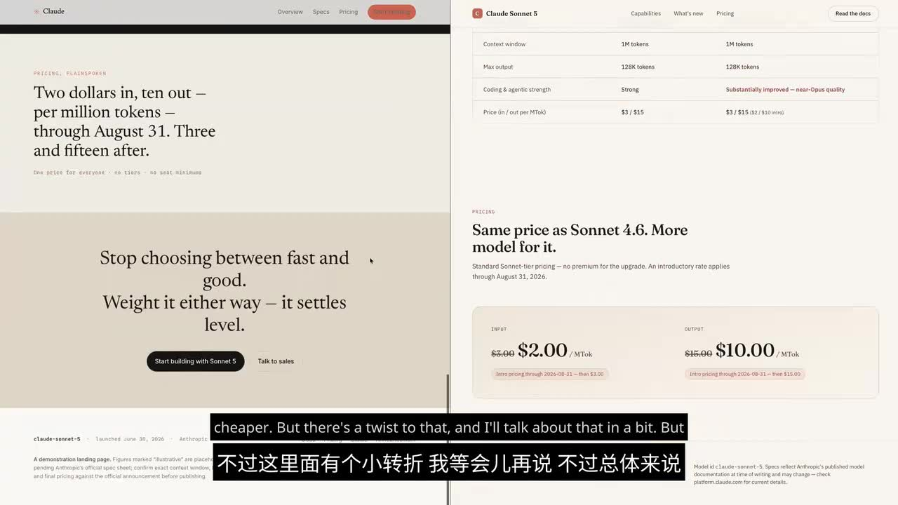
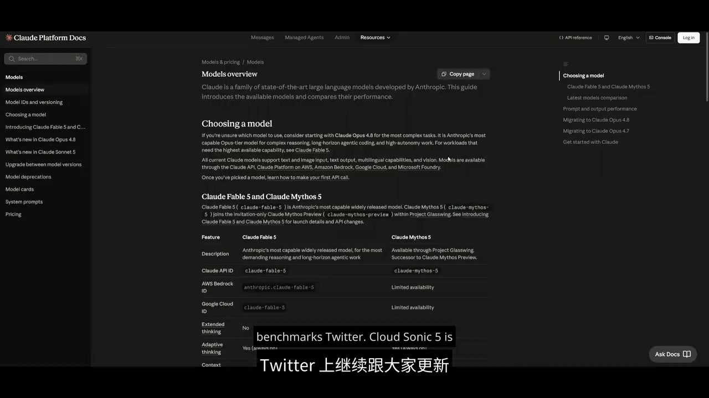

# Claude Sonnet 5 发布：接近 Opus 4.8 的新模型，Agent 能力大幅提升但定价暗藏变化

> 来源：[Bilibili 视频](https://www.bilibili.com/video/BV1ncT86zEWa)  
> UP 主：NixAI｜分区合集：AIcode｜时长：12 分 59 秒｜视频分 P：中文配音  
> **时效提示：**本视频讨论的是发布期模型信息、价格与排行榜表现；其中模型名称、日期和部分指标存在 ASR 识别误差风险。下文以“视频称”“画面显示”区分视频陈述与可由关键帧确认的信息，不将其视为当前仍有效的官方规格。

## 小结

视频围绕“Claude Sonnet 5”展开，核心论点是：该模型在推理、工具调用、编程和知识工作方面相对 Sonnet 4.6 有提升，尤其强调可规划、多工具调用、浏览器与终端环境中的自主执行能力；视频引用的官方对比图显示，其多项基准分数已接近 Opus 4.8。

在量化结果上，画面中可直接读到 Sonnet 5 的 SWE-bench Pro Agentic coding 得分为 **63.2%**、Terminal-Bench 2.1 为 **80.4%**、OSWorld-Verified 的 Computer use 为 **81.2%**、GDPval-AA v2 的知识工作分数为 **1618**。这些项目中，Sonnet 5 接近但大多未超过 Opus 4.8；GDPval-AA v2 是视频特别指出其略高于 Opus 4.8 的例外。

视频最有价值的成本提醒是：首发 API 标价为每百万输入 Token **2 美元**、输出 Token **10 美元**，截至 **2026 年 8 月 31 日**；之后升至输入 **3 美元**、输出 **15 美元**。但视频认为其 tokenizer 切换后，同一文本可能产生约 **1～1.3 倍**于此前的 Token 数，因此“单价下降”不必然意味着“单任务总成本下降”。

实测部分呈现出明显的两面性：Sonnet 5 能做出具备通知、主题切换、壁纸、应用与可运行小游戏的 macOS 风格界面；也能生成带村民、苦力怕、放置/破坏方块能力的 Minecraft 风格作品。但测试者认为其任务过程消耗大量 Token，Minecraft 缺少背包、无限地形、完整水流/方块破坏动画等关键机制；SaaS 落地页与宝马 SVG 图形生成则被评价为不如 GLM 5.2 或 Opus。

因此，这不是一份单纯的“新模型更强”结论。视频作者的主观建议是：若 Opus 4.8 仅贵少量、但整体输出更强，则不宜仅因 Sonnet 5 的表面标价而将其作为日常主力。该判断依赖其特定提示词、Max Effort/Max Mode 设置及外部榜单，不能外推为所有任务的客观结论。

## 思维导图

## 目录

- [发布定位与能力主张](#发布定位与能力主张)
- [基准测试：接近 Opus 4.8 的证据](#基准测试接近-opus-48-的证据)
- [价格、上下文与 Token 成本陷阱](#价格上下文与-token-成本陷阱)
- [实测一：macOS 风格系统生成](#实测一macos-风格系统生成)
- [实测二：Minecraft、前端与 SVG 测试](#实测二minecraft前端与-svg-测试)
- [工作流选择与可迁移经验](#工作流选择与可迁移经验)
- [结论、限制与时效性](#结论限制与时效性)
- [字幕比对](#字幕比对)
- [评论分析](#评论分析)
- [处理记录](#处理记录)

## 发布定位与能力主张 [00:00](https://www.bilibili.com/video/BV1ncT86zEWa?t=0)

视频开头将“Claude Sonnet 5”描述为 Sonnet 系列的一次重大更新，并归纳其相对 Sonnet 4.6 的改进方向：

1. **推理能力：**视频称其推理表现有所增强。
2. **工具使用：**能够调用浏览器、终端等工具。
3. **Agent 工作方式：**可先规划任务，再选择和调用工具，并在环境内自主运行。
4. **编程与知识工作：**视频称在编程、通用知识工作中都有明显提升。
5. **幻觉控制：**视频称其“幻觉更少”，但没有展示定义、测量方法或误差范围。

这些属于视频对模型能力的概述。理解时应避免把“能调用工具”直接等同于“所有 API 场景默认具备完整 Agent 环境”：实际可调用的工具、权限、执行时限和产品套餐均会影响结果。

> 图：画面字幕直接表达“目前最有 agent 能力的 Sonnet 模型、幻觉更少”的发布叙事。它适合用来区分视频的宣传性能力主张与后文的具体测试结果：前者是定位，后者才是有限场景下的验证。

视频还称该模型可通过 Claude 套餐、Pro 默认模型、API 或聊天机器人使用。不过，视频未给出各渠道的地区可用性、模型 ID、速率限制、额度和工具权限，实际接入前仍需以当时产品控制台和官方文档为准。

## 基准测试：接近 Opus 4.8 的证据 [01:05](https://www.bilibili.com/video/BV1ncT86zEWa?t=65)

视频以一张 Claude 官方账号/官方材料样式的对比图支持“接近 Opus 4.8”的说法。关键帧中可读出的数值如下：

| 测试项 | Sonnet 5 | Sonnet 4.6 | Opus 4.8（参考） | 视频可得出的有限结论 |
| --- | ---: | ---: | ---: | --- |
| SWE-bench Pro：Agentic coding | 63.2% | 58.1% | 69.2% | Sonnet 5 高于 4.6，低于 Opus 4.8 |
| Terminal-Bench 2.1：Agentic coding | 80.4% | 67.0% | 82.7% | Sonnet 5 接近 Opus 4.8 |
| Humanity's Last Exam：无工具 | 43.2% | 34.6% | 49.8% | Sonnet 5 高于 4.6，低于 Opus 4.8 |
| Humanity's Last Exam：带工具 | 57.4% | 46.8% | 57.9% | Sonnet 5 与 Opus 4.8 极接近 |
| OSWorld-Verified：Computer use | 81.2% | 78.5% | 83.4% | Sonnet 5 接近 Opus 4.8 |
| GDPval-AA v2：Knowledge work | 1618 | 1395 | 1615 | Sonnet 5 在该图中略高于 Opus 4.8 |

> 图：该帧是视频中最关键的量化证据，能校正 ASR 中“63%”“80.4%”“81.2%”“1619”等零散、部分误识别内容。画面实际显示 GDPval-AA v2 为 **1618**，而非 ASR 转写中的 1619。

需要注意以下边界：

- 这些是视频展示的发布期对比数据，未呈现完整测试提示词、采样次数、置信区间、工具版本和评测日期。
- 视频还提到模型在某排行榜中暂列第五、仍待进一步评估，以及在 Cursor 相关排行榜中排第 13；但 ASR 没有提供可可靠复原的完整榜单名称、版本和分数，不能据此做严格横向排名。
- 基准分数用于刻画特定评测集上的能力，并不直接代表前端审美、长程产品开发、Token 效率或真实业务可靠性。

## 价格、上下文与 Token 成本陷阱 [02:30](https://www.bilibili.com/video/BV1ncT86zEWa?t=150)

视频后半段首先强调定价，画面显示的发布期规则为：

| 项目 | 首发价 | 首发价截止 | 后续价格 |
| --- | ---: | --- | ---: |
| 输入 | 2 美元 / 百万 Token | 2026-08-31 | 3 美元 / 百万 Token |
| 输出 | 10 美元 / 百万 Token | 2026-08-31 | 15 美元 / 百万 Token |
| 上下文窗口 | 100 万 Token | 视频未说明是否所有渠道一致 | 视频未说明后续变化 |

> 图：画面左侧文字明确写有“Two dollars in, ten out — per million tokens — through August 31. Three and fifteen after”，右侧则显示输入 2 美元、输出 10 美元的价格卡片。这是整理定价时优先采用画面而非 ASR 的原因。

### Tokenizer 带来的“标价—账单”差异

视频提出的成本质疑是：Sonnet 5 更换了 tokenizer；同一段内容切分出的 Token 数，可能相对旧 tokenizer 增加约 **1～1.3 倍**，且变化程度取决于文本内容。视频据此认为，首发低价可能在一定程度上抵消 Token 数增长，使总成本未必如单价看起来那样下降。

可以将实际 API 成本理解为：

\[
\text{总成本} =
\frac{\text{输入 Token 数}}{1,000,000}\times\text{输入单价}
+
\frac{\text{输出 Token 数}}{1,000,000}\times\text{输出单价}
\]

因此，比较模型成本不能只比较“美元 / M Token”，还应在**同一批真实请求**上记录：

1. 输入文本经不同 tokenizer 后的 Token 数；
2. 输出长度和是否出现冗长推理/工具调用；
3. 缓存命中、上下文复用和重试次数；
4. 工具循环的轮数；
5. 完成率与人工返工成本。

视频没有提供 tokenizer 名称的可可靠文字依据、实际账单样本或统一工作流的 Token 统计表。因此，“Token 增长 1～1.3 倍”应视为视频陈述，需要在目标语言、代码比例和实际 API 版本下复测。

## 实测一：macOS 风格系统生成 [06:20](https://www.bilibili.com/video/BV1ncT86zEWa?t=380)

视频称使用其 Prompt Catalog 与 World of AI Benchmark 2 进行多领域测试，并展示了模型生成的 macOS 风格界面。测试者观察到的已实现内容包括：

- 登录页；
- 通知系统；
- 顶部栏；
- 显示设置；
- 浅色/深色模式切换；
- 壁纸更换；
- 多个应用与文件；
- Launchpad、Safari、Messenger、邮件、照片、日历、备忘录、提醒事项、地图、音乐等应用外观或功能；
- 终端、计算器、文本编辑器；
- 一个可运行的 FPS 射击小游戏；
- 应用使用 SVG 生成，整体视觉效果获得正面评价。

测试者同时指出，地图的效果不如其此前见到的 Opus 模型结果，顶部栏仍有部分小错误。视频的整体评价是：对于多数模型难以完成的“大型 macOS 克隆”式任务，Sonnet 5 已展示出可观的端到端生成能力。

不过，视频也明确说该任务在 **Max Mode / Max Effort** 一类高强度模式下消耗了大量 Token，过程并不高效。这里的经验是：对于复杂、多文件、长链路应用，必须将“是否最终完成”与“完成所需 Token、时间、重试和修复轮数”分开评估。

## 实测二：Minecraft、前端与 SVG 测试 [08:00](https://www.bilibili.com/video/BV1ncT86zEWa?t=480)

### Minecraft 风格项目

视频展示的 Minecraft 风格生成结果包括：

- 使用不同于原版的材质风格；
- 动态水面效果；
- 村民、苦力怕等生物；
- 可放置方块；
- 可破坏方块；
- 洞穴系统及矿石元素。

测试者同时列出缺陷：

- 运行卡顿；
- 方块破坏没有完整动画；
- 水流机制未完整生成；
- 没有物品栏系统；
- 没有无限地形；
- 除放置和破坏方块外，其他核心交互机制较少。

其主观评分为 **6.5 / 10**。该案例说明：模型可以在较短时间内合成“可展示的游戏原型”，但“视觉上像游戏”不等同于“机制完备、性能稳定、可持续扩展的游戏实现”。

### SaaS Landing Page

视频随后要求模型结合多个 package、字体排版及滚动触发效果，制作 SaaS Landing Page。测试者认为结果较基础，滚动触发与组件风格似乎在模仿 Anthropic 的设计语言，但组件没有完整生成，实际可用性不佳；并主观认为 GLM 5.2 的前端结果更好。

### 宝马 M4 CS SVG 图形

在 SVG 测试中，提示词要求生成宝马 M4 CS 图像。测试者称即使提高某个未能由 ASR 准确识别的参数，结果仍无法呈现合理的车身比例、姿态和车型辨识度；相比之下，其所述 Opus 结果至少具备更清晰的主体结构。

这部分是视频负面结论最集中的证据：模型在 Agent/基准类任务上的提升，并没有自动转化为高质量的创意 SVG 与视觉设计能力。

> 图：该帧展示 Claude Platform Docs 的模型概览页面。虽然画面中的具体模型表格文字与视频叙述、ASR 存在不一致或难以辨认之处，但它有助于说明视频讨论并非只基于口头评价，也涉及官方文档/模型选择页面；具体规格仍应以访问时的原始文档为准。

## 工作流选择与可迁移经验 [10:50](https://www.bilibili.com/video/BV1ncT86zEWa?t=650)

基于视频的正反两类测试，可以提炼出以下实践框架，而不是直接接受“完全不值得用”或“全面替代 Opus”的绝对结论。

### 1. 先按任务类型拆分评测

至少分开测量：

- **Agent 编程：**规划、多工具调用、终端执行、任务完成率；
- **电脑操作：**UI 定位、状态保持、恢复能力；
- **复杂原型：**多文件工程、功能覆盖、可运行性；
- **前端实现：**组件完整度、响应式、交互与可维护性；
- **创意 SVG/视觉：**比例、语义一致性、审美与可编辑性；
- **知识工作：**事实准确性、结构化输出和工具检索质量。

视频的 macOS 与 Minecraft 结果表明，单个“最终演示”不能代表所有类别的表现。

### 2. 将 Token 效率纳入验收指标

对于每一个候选模型，建议记录：

| 指标 | 目的 |
| --- | --- |
| 首次完成率 | 判断是否真正减少返工 |
| 总输入/输出 Token | 检验 tokenizer 与输出冗长度影响 |
| 工具调用次数 | 判断 Agent 是否频繁绕路 |
| 运行时长 | 评估交互等待成本 |
| 重试与人工修复次数 | 衡量生产可用性 |
| 成品功能清单 | 防止只看视觉演示 |
| 单次成功任务成本 | 比较真实业务价格，而非标价 |

### 3. 在价格变更日前后重测

视频所述首发价截至 2026 年 8 月 31 日，之后输入/输出价格上调。若该时间信息与实际产品策略一致，则采购或路由策略不能只使用首发期数据，应在价格切换后重新计算单任务成本，并确认 100 万上下文是否适用于自己的套餐、区域与 API 端点。

### 4. 以对照实验替代品牌预设

视频作者最终倾向继续使用 Opus 4.8，并在 SVG、前端等任务中偏好 GLM 5.2。这个选择来自其测试结果，但更稳妥的做法是：固定提示词、固定工具环境、固定预算和固定验收标准，让 Sonnet 5、Opus 4.8 与其他候选模型处理同一任务集，再按质量—时间—总成本作决策。

## 结论、限制与时效性 [12:00](https://www.bilibili.com/video/BV1ncT86zEWa?t=720)

视频形成了“基准靠近 Opus、实测有亮点、但性价比与稳定性存疑”的结论：

- **可确认的亮点：**画面中的发布对比表显示 Sonnet 5 相对 Sonnet 4.6 有全面提升，并在工具辅助 HLE、Terminal-Bench、OSWorld 等项目上接近 Opus 4.8；macOS 风格系统和游戏原型也显示其能够处理较大规模生成任务。
- **主要风险：**视频称 Tokenizer 变化可能推高实际 Token 消耗；复杂任务在高强度模式下消耗大量 Token；前端组件完整度与 SVG 创作质量被认为不够稳定。
- **作者主观看法：**若 Opus 4.8 的实际成本仅高少量而质量更好，应直接选择 Opus 4.8；该观点尤其针对视频中的测试集，不是对所有用户和所有场景的普遍结论。
- **未验证之处：**视频未提供原始 Prompt、完整工程代码、工具日志、Token 账单、评测运行环境及可复现链接，无法独立核验成功率或成本结论。
- **时效性：**模型版本、套餐默认模型、API 定价、上下文长度、排行榜位置均可能迅速改变。本文仅忠实整理该视频及其关键帧在抓取时提供的信息，不应用作当前官方定价或模型选型的唯一依据。

## 字幕比对 [00:00](https://www.bilibili.com/video/BV1ncT86zEWa?t=0)

本次任务已执行 ASR；Bilibili 站内未提供可用字幕。

| 字幕来源 | 完整性 | 专有名词 | 时间轴 | 主要问题 |
| --- | --- | --- | --- | --- |
| Bilibili 站内字幕 | 不可用 | 无法评估 | 无 | 素材明确标注“未提供可用站内字幕” |
| 本次 ASR 字幕 | 覆盖全片叙述，包含重复片段 | 较多误识别 | 未提供逐句时间戳，仅能按内容估算章节时间 | Anthropic、Claude、Sonnet、Opus、benchmark、tokenizer、模型版本与部分测试名称混淆明显 |

最终采用策略为：**以本次 ASR 作为内容骨架，以关键帧中的可见英文、数值和上下文纠错；无法可靠校正的词保留不确定性，不补造原词。**

重要校正包括：

| ASR 片段/问题 | 本文采用写法 | 校正依据 |
| --- | --- | --- |
| “Enthropic”“Anthropid”“Anthropite” | Anthropic | 视频主题与元数据中的公司标签、画面 Claude 品牌 |
| “Klaus 3D图”“CloudSonic 5”“Sonic 5”“Sonyt5” | Claude Sonnet 5 | 标题、关键帧标题与上下文 |
| “Sunet 4.6” | Sonnet 4.6 | 对比表画面 |
| “OPUS 4.8”“OPPA” | Opus 4.8 | 对比表画面与上下文 |
| “sui benchmark” | SWE-bench Pro | 对比表画面 |
| “HLA” | Humanity's Last Exam（HLE） | 对比表画面 |
| GDPW 1619 | GDPval-AA v2，1618 | 对比表画面 |
| “open 4.7 的 tokenize” | tokenizer 发生变化，具体名称不采信 | ASR 对专有名词不稳定，关键帧未展示该名称 |

## 评论分析 [12:45](https://www.bilibili.com/video/BV1ncT86zEWa?t=765)

当前可获取热评列表为空：`items: []`。视频元数据中的评论数也为 0。

因此没有可分析的热评，亦不存在“热评前三条”。本文不以弹幕、作者口播或外部链接内容替代评论观点。

## 处理记录 [00:00](https://www.bilibili.com/video/BV1ncT86zEWa?t=0)

- **Worker ID：**worker-mrj0wjed-b0c290ad
- **模型：**gpt-5.6-terra
- **调用工具与输入素材：**使用任务提供的 Bilibili 元数据、视频素材清单、ASR 文本、热评 JSON 结果、12 张关键帧的路径信息及其中提供的关键帧画面。
- **素材产物：**素材清单显示已生成 `merged.mp4`、`audio/audio.wav`、`frames/`、`info.json`、`comments/comments.json`、`subtitles/` 与 `asr/`。
- **字幕选择：**站内字幕不可用；本次 ASR 已执行并作为主字幕来源。专有名词、基准名及数值优先按关键帧可见信息校正。
- **关键帧选择依据：**
  - `frames/frame-001.jpg`：对应开场对 Agent 能力、低幻觉的定位；
  - `frames/frame-002.jpg`：直接承载首发价、价格截止日期与后续价格信息；
  - `frames/frame-003.jpg`：直接承载 Sonnet 5、Sonnet 4.6、Opus 4.8 的基准数据；
  - `frames/frame-004.jpg`：呈现模型文档/选择页面，用于说明视频引用了文档型信息源。
- **未采用其余帧的原因：**本任务提供的可见关键帧中，上述四帧与正文的核心可核对事实关联最强；为避免在未见画面内容的情况下臆测其余帧信息，未强行插入。
- **缓存清理：**素材清单未提供缓存清理日志或清理状态；因此不能声称已完成清理。本文仅记录该状态为“未提供可核验记录”。
- **未解决问题：**ASR 无逐句时间戳；部分模型名称、排行榜名称、参数名称及 tokenizer 名称存在识别错误；视频未提供可复现实验配置与原始成本数据。

## 评论分析

本次流程未获取到可用热评，因此不推断观众态度或额外结论。
