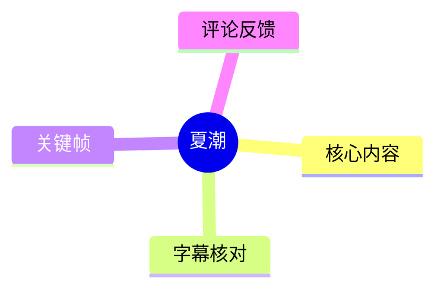
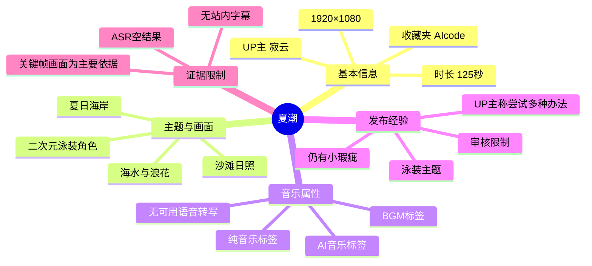

# 夏潮

> 来源：[Bilibili 视频](https://www.bilibili.com/video/BV1isVa6pESD) 
> UP 主：寂云｜发布时间：2026-05-29｜视频时长：02:05｜分辨率：1920×1080

## 小结

《夏潮》是一支时长 125 秒的夏日主题视频。根据标题、封面、可用关键帧、标签及简介可确认：作品以海岸场景中的二次元风格人物为主要画面内容，并关联 BGM、纯音乐、AI 音乐和“AI音乐征集大赛”标签。

画面素材呈现蓝色海面、浪花、沙滩与强烈日照；人物为白发、戴宽檐草帽的女性二次元角色，身着蓝白配色泳装与轻薄外搭。视频简介中，UP 主明确称这是“泳装回”，并表示为了让泳装内容“跑通”审核想过多种办法；该表述说明作品的制作/发布过程受到内容审核要求影响。

本次 ASR 未识别到任何语音片段，且站内未提供可用字幕。因此，无法从字幕可靠地还原配乐歌词、旁白、画面切换节奏、音乐生成工具、提示词、制作流程或具体技术参数。文档对画面的描述仅基于关键帧和元数据，不将其扩展为未经素材支持的制作结论。

该视频适合关注 AI 音乐、二次元视觉短片、夏日氛围影像及平台内容发布限制的读者。若目标是复现同类作品，现有材料只能提供审美方向与发布限制线索，不能作为音乐生成、图像生成或视频生成的完整教程。

数据具有时效性：播放、点赞、收藏、评论等统计值来自 2026-07-15 抓取时的页面数据，后续会变化；审核尺度、活动规则和标签归类也可能随平台规则更新而改变。

## 思维导图

## 目录

- [作品定位与可验证背景](#作品定位与可验证背景)
- [画面内容与关键帧](#画面内容与关键帧)
- [音乐、技术信息与制作经验](#音乐技术信息与制作经验)
- [发布限制、参数与时效性](#发布限制参数与时效性)
- [结论与可迁移经验](#结论与可迁移经验)
- [字幕比对](#字幕比对)
- [评论分析](#评论分析)
- [处理记录](#处理记录)

## [作品定位与可验证背景](https://www.bilibili.com/video/BV1isVa6pESD?t=0)

视频标题为“夏潮”，UP 主为“寂云”，单 P，时长为 125 秒。页面标签包括：

- `BGM`
- `纯音乐`
- `AI音乐`
- `AI音乐征集大赛`

这些标签可以支持“作品被发布者/平台归类为与音乐有关、且涉及 AI 音乐”的判断；但标签本身**不能证明**具体使用了哪一个音乐模型、音源、生成工作流、授权方式或人声处理方案。

简介原文为：

> 喜闻乐见泳装回。审核真严，想了一堆办法跑泳装终于跑通了。还有很多小瑕疵，但先这样吧。

从该表述可整理出以下已知信息：

1. **主题选择**：UP 主将作品定位为泳装主题内容。
2. **发布障碍**：UP 主主观认为审核严格，并表示为通过审核尝试了多种办法。
3. **完成状态**：UP 主认为当前成片仍存在“小瑕疵”，但决定先行发布。
4. **不可确认部分**：简介没有说明“办法”是什么，不能推断其涉及何种裁切、遮挡、重绘、提示词、审核申诉或发布设置。

截至抓取时，页面统计为：播放 49,487、点赞 2,482、收藏 3,555、投币 60、分享 24、评论 17、弹幕 5。收藏数相对于播放量较高，可能意味着部分观众具有留存或二次观看意愿；但这只是基于单次快照的观察，不能据此推断长期传播表现或作品质量。

## [画面内容与关键帧](https://www.bilibili.com/video/BV1isVa6pESD?t=0)

可提供的关键帧画面均呈现同一核心构图：角色位于画面右侧的浅滩位置，左侧保留大面积海面；近景可见沙滩与潮水交界，远处是蓝绿色海水和反光。整体使用高亮度、低对比阴影、浅蓝与米白为主的夏日配色。

> 图：该关键帧展示视频最明确的视觉主体——海边浅滩、波浪、沙滩与戴草帽的二次元角色。它能帮助理解“夏潮”标题所对应的海滨意象，以及角色在画面右侧、海面留白在左侧的构图策略。

画面中可辨识的视觉元素包括：

| 元素 | 关键帧可见信息 | 对内容理解的价值 |
| --- | --- | --- |
| 海面 | 蓝绿色水体、细小波纹与日光高光 | 建立“潮”“夏日”“海岸”的主题环境。 |
| 浪花与浅滩 | 白色浪花贴近沙滩边缘 | 强化潮水正在拍岸的动态联想，但单帧不能证明具体动画质量或运动方式。 |
| 角色服装 | 蓝白色泳装、透明/轻薄感外搭、草帽 | 与简介中的“泳装回”相互印证。 |
| 光线 | 高亮度日照、海面反光、人物投影 | 构成清爽、明亮的夏日视觉氛围。 |
| 构图 | 角色居右、海面居左且留白较多 | 让环境与角色同时成为画面主体，也为封面式观看提供清晰视觉焦点。 |

> 图：该关键帧适合观察角色服装的蓝白配色、宽檐草帽、海面高光与浅滩层次。它说明作品的核心是氛围化角色视觉，而非包含文字说明、操作界面或技术演示的教程画面。

### 画面证据的边界

现有关键帧不足以可靠确定以下事项：

- 角色是否存在明显的动作循环、镜头推进、景别切换或转场；
- 全片是否仅使用一个场景，或是否在未抽到的时间段出现其他画面；
- 图像是否来自 AI 生成、人工绘制、混合制作或其他来源；
- 角色身份、所属 IP、设定名称及服饰设计来源；
- 画面生成模型、分辨率放大方式、插帧方式、后期软件及任何参数。

因此，本节仅将关键帧作为画面理解证据，不把视觉风格反推为具体技术路线。

## [音乐、技术信息与制作经验](https://www.bilibili.com/video/BV1isVa6pESD?t=0)

### 音乐信息：可确认与不可确认项

视频标签包含“BGM”“纯音乐”“AI音乐”“AI音乐征集大赛”。结合本次 ASR 的空结果，可以确认的是：**素材中没有被 ASR 识别出的可转写语音内容**。

这并不等同于“视频无声音”。素材清单中存在 `audio/audio.wav`，ASR 诊断也以约 124.88 秒音频为输入完成检测；只是识别结果为 0 个语音分段、语音覆盖率为 0。对于以纯音乐或非语言声音为主的视频，这种结果是可能的。

| 项目 | 素材支持的结论 |
| --- | --- |
| 是否有可识别旁白 | 未识别到。 |
| 是否有可识别歌词 | 未识别到。 |
| 是否可确认存在音乐 | 标签将其归类为 BGM、纯音乐、AI 音乐；但 ASR 不用于验证音乐内容。 |
| 是否可确认音乐由 AI 生成 | 页面标签指向 AI 音乐属性；无法进一步验证实际生成过程。 |
| 是否可确认使用的模型或平台 | 不可确认。 |
| 是否可整理歌词时间轴 | 不可整理：没有站内歌词字幕或 ASR 文本。 |

### 可提炼的发布经验

UP 主的简介提供的经验不是一套可复现步骤，而是一个明确的约束案例：泳装主题在发布审核中可能面临更高的不确定性。对于创作者而言，可迁移的经验应表述为风险控制原则，而非将其误写为该视频实际使用的操作：

1. **先明确内容边界**：服装、姿态、镜头距离、局部强调方式和整体语境都可能影响内容判定。
2. **将“通过审核”与“作品表达”同时纳入设计**：仅以视觉吸引力为目标，可能增加反复修改或无法发布的风险。
3. **保留迭代预期**：UP 主明确承认成片仍有瑕疵，反映出在发布限制下，先完成可发布版本再逐步优化是一种现实选择。
4. **避免臆测审核策略**：素材没有公开具体规避或调整手法，不能把“想了一堆办法”扩写成某种确定的技术流程。

### 缺失的技术参数

视频没有提供教程口播、操作录屏、工程文件、模型名称或参数说明。以下信息在现有素材中均不可得：

- 音乐模型、版本、提示词、曲风控制、时长设置；
- 图像/视频模型、采样器、步数、CFG、种子、分辨率和参考图；
- 动画驱动、运镜、插帧、去闪烁或超分辨率方案；
- 剪辑、调色、音画同步、封装编码参数；
- AI 音乐征集活动的具体规则、投稿条件及评审标准。

## [发布限制、参数与时效性](https://www.bilibili.com/video/BV1isVa6pESD?t=0)

### 已知参数

| 参数 | 值 |
| --- | --- |
| BV 号 | `BV1isVa6pESD` |
| 视频时长 | 125 秒 |
| 页面音频分析时长 | 124.8769375 秒 |
| 分辨率 | 1920 × 1080 |
| 画面旋转 | 0 |
| 分 P 数量 | 1 |
| 分 P 标题 | 夏潮 |
| ASR 模型 | medium |
| ASR 检测语言 | en |
| ASR 语言置信度 | 0.541015625 |
| ASR 语音分段数 | 0 |
| ASR 语音覆盖率 | 0 |

ASR 将语言自动判断为英语的置信度仅约 0.541，但没有输出任何文本分段。这一语言判断不应被理解为视频内容为英语；更合理的结论是，音频中缺少足以被模型稳定转写的语音内容，或语音不清晰到无法识别。

### 审核限制

视频简介是审核信息的唯一直接来源。UP 主称“审核真严”，并表示反复尝试后才使泳装内容“跑通”。这属于创作者本人对发布经历的陈述，能够说明其遇到审核压力，但不能据此建立平台的固定审核标准。

尤其需要注意：

- 不能据此断言某种特定服装、画面或提示词一定无法通过审核；
- 不能据此推导任何绕过审核的具体方法；
- 平台审核规则可能基于时间、地区、账号状态、画面上下文、举报情况及人工复审而变化；
- 对于同类型作品，最可靠的依据仍应是发布时有效的平台社区规范和投稿规则。

### 时效性说明

页面元数据抓取时间为 2026-07-15。播放量、点赞、收藏、评论数及热评排序均为当时可见状态，不代表当前数值。视频发布时间按提供的元数据记录为 2026-05-29；“AI音乐征集大赛”标签所关联活动是否仍在进行、规则是否变更，现有素材没有提供可验证信息。

## [结论与可迁移经验](https://www.bilibili.com/video/BV1isVa6pESD?t=0)

《夏潮》的可验证核心，是一支以海边泳装二次元角色为视觉主体、以 BGM/纯音乐/AI 音乐标签发布的 125 秒短片。画面以海水、沙滩、浪花、草帽和蓝白色服饰建立夏季海岸氛围；作品简介则补充了一个重要发布背景：泳装题材在审核环节存在现实约束。

对创作者最值得借鉴的不是某个未公开的“跑审核”技巧，而是以下工作判断：

- 在设计阶段同步考虑主题表达、构图、服装呈现与平台发布边界；
- 对于以氛围为主的短片，统一的配色、环境留白与明确视觉主体能够形成稳定的主题识别；
- 将作品标签与实际内容对应：本片使用 BGM、纯音乐、AI 音乐等标签，使受众能快速理解其内容方向；
- 对没有公开的技术流程保持证据克制，不能把视觉效果或标签直接等同于某一模型、参数或工作流。

本视频不适合作为 AI 音乐或 AI 视频生成的参数教程，因为没有可用字幕、口播、项目文件或技术配置。若要进一步研究其音乐和影像制作，应以作者后续公开的制作说明、工程分享或可验证采访为准。

## 字幕比对

| 字幕来源 | 完整性 | 专有名词 | 时间轴 | 主要问题 |
| --- | --- | --- | --- | --- |
| Bilibili 站内字幕 | 未提供可用字幕 | 无法核验 | 无 | 无法用于还原旁白、歌词或镜头段落。 |
| 本次 ASR 字幕 | 空结果，0 个分段 | 无 | 无可用时间戳文本 | ASR 输入时长约 124.88 秒，但未识别出语音；诊断提示无语音分段。 |

### 最终字幕选择

本次没有可采用的文本字幕：

- **站内字幕**：素材明确标记为“未提供可用站内字幕”。
- **本次 ASR**：已检查 `asr-result.json` 对应的诊断信息，识别语言为 `en`，但 `segments` 为空，语音时长为 0，语音覆盖率为 0。
- **音轨判断**：诊断中**没有** `noAudioStream=true` 标记，因此不能称源视频“没有音轨”。相反，素材清单包含音频文件，说明处理流程获得了音频输入；ASR 空结果只表示未识别到可转写语音。
- **正文依据**：关于主题、画面与限制的内容，改由页面标题、标签、简介、元数据和关键帧多模态画面理解支撑。

由于不存在带有 `HH:MM:SS,mmm --> HH:MM:SS,mmm` 的真实字幕分段，除视频起点 `t=0` 外，本文不编造画面段落或歌词段落的时间位置。

## 评论分析

本次仅获取到 2 条热评，少于要求的“热评前三条”；以下只分析实际可获取内容，不补写不存在的第三条评论。

| 排名 | 评论者 | 点赞 | 评论内容 | 分析 |
| --- | --- | ---: | --- | --- |
| 1 | 德日海不是肥物 | 27 | “好可爱” | 这是对角色形象与整体视觉观感的正向评价，与关键帧中偏清新、可爱的二次元人物形象一致。评论未提供制作、音乐或审核方面的可验证补充信息。 |
| 2 | qwq散华礼弥 | 3 | “真段真好听” | 评论表达了对音乐听感的正面态度，可作为观众主观反馈，且与 BGM、纯音乐标签方向相符。但“好听”属于审美判断，不能据此证明音乐的生成方式、版权状态或技术质量。 |

可获取评论中没有出现对 AI 工具、制作过程、审核办法、角色来源或音乐版权的具体讨论，也没有形成可验证争议。评论应被视为受众反馈，不应替代视频本身的事实证据。

## 处理记录

- **Worker ID**：`worker-mrj0wjed-b0c290ad`
- **模型**：`gpt-5.6-terra`
- **ASR 模型与配置**：`medium`；自动语言检测；CUDA；`float16`；检测语言为 `en`，语言置信度 0.541015625。
- **使用的素材与工具产物**：视频元数据、封面、`merged.mp4`、`audio/audio.wav`、关键帧目录 `frames/`、ASR 输出 `asr/transcript.srt` / `asr/asr-transcript.txt` / `asr/asr-result.json`、评论文件 `comments/comments.json`。
- **字幕选择**：站内无可用字幕；本次 ASR 已检查但输出为空，未采用任何转写文本。正文以标题、简介、标签、元数据和关键帧为证据。
- **关键帧选择依据**：选用 `frames/frame-001.jpg` 和 `frames/frame-004.jpg`，因为其清晰呈现海岸环境、角色服装、草帽、光照和构图，能够直接支撑作品的夏日海滨视觉主题；不为未提供真实时间戳的关键帧强行标注具体秒点。
- **时间轴依据**：无站内 SRT，ASR 无分段时间戳；章节链接统一指向可验证的视频起点 `t=0`，未根据文字顺序猜测其他位置。
- **评论范围**：请求上限为 3 条，实际仅取得 2 条，已仅处理这 2 条。
- **缓存清理**：提供的素材记录未包含缓存清理执行日志，无法确认是否已清理；不作已清理声明。
- **未解决问题**：无法确认全片镜头变化、音乐内容与制作工具、AI 工作流、审核调整细节、角色来源及活动规则。
