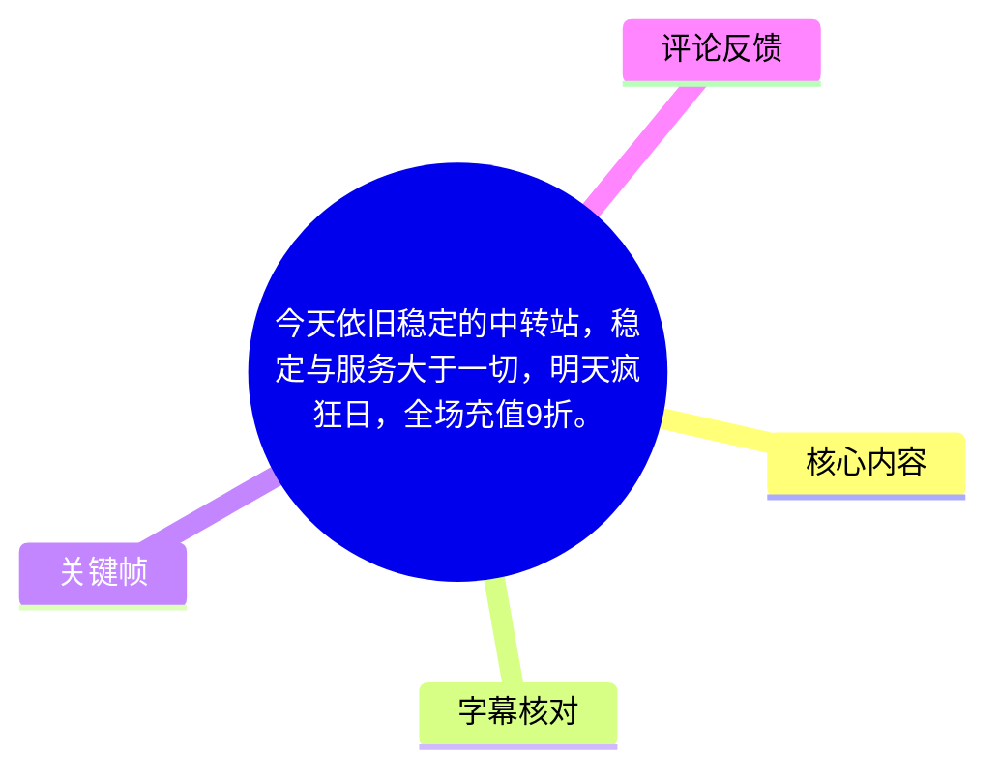
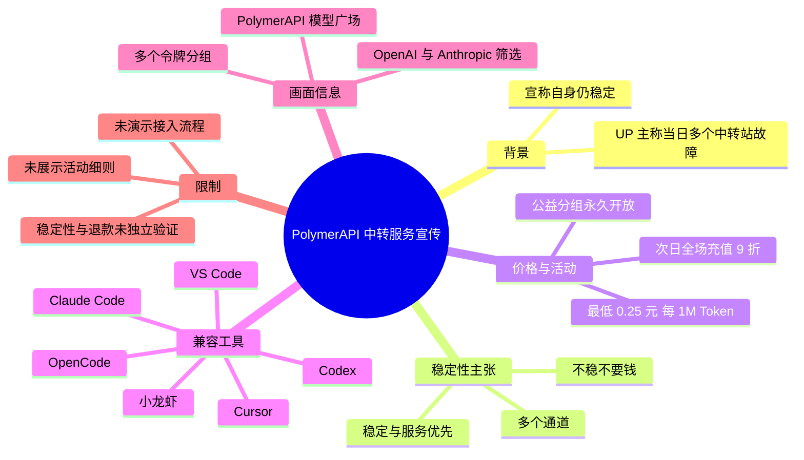
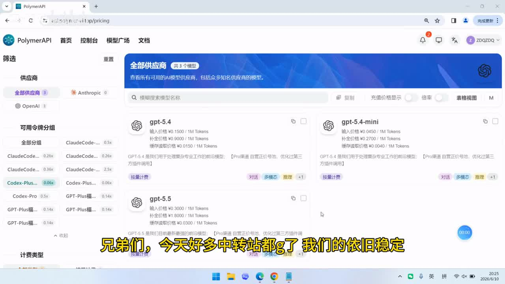
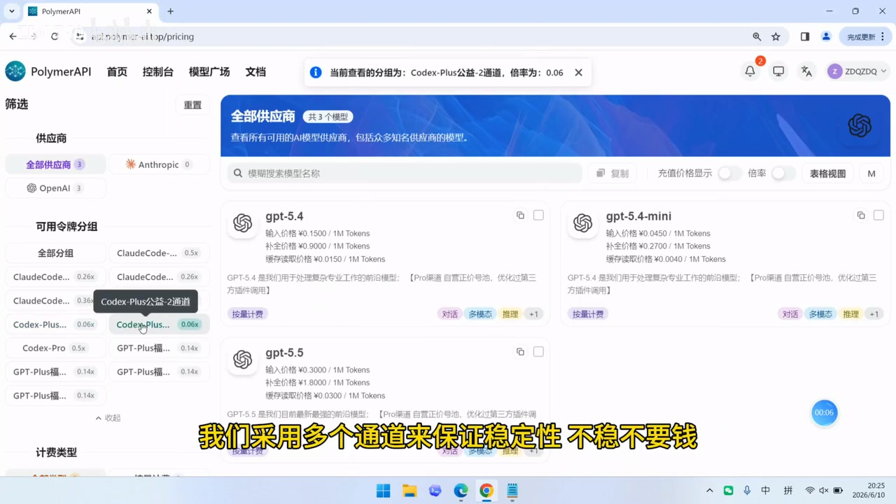
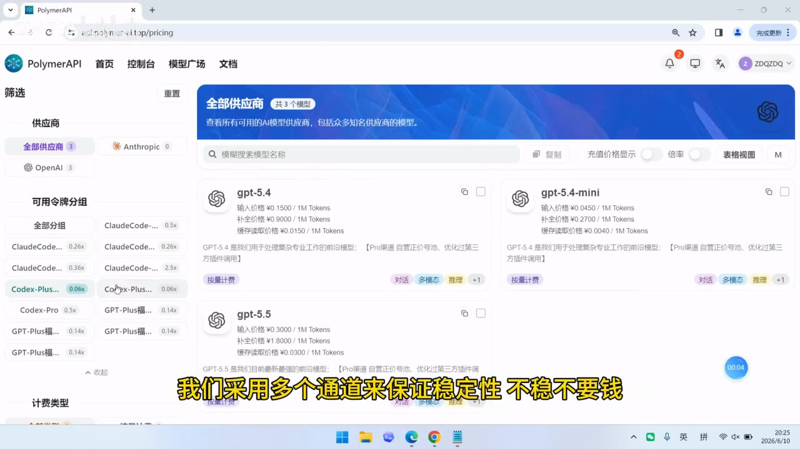

# 今天依旧稳定的中转站，稳定与服务大于一切，明天疯狂日，全场充值9折。

> 来源：[Bilibili 视频](https://www.bilibili.com/video/BV1VoER6tErd) 
> UP 主：ZDQ740｜视频时长：24 秒｜合集：AIcode 
> 视频简介中的注册地址：<https://api.polymer-ai.top/>

## 小结

这是一则面向 AI 编程工具用户的中转 API 服务推广短视频。UP 主称，在“好多中转站都 G 了”的当日，其服务仍保持可用，并将稳定性归因于“多个通道”的部署方式；视频强调的核心价值排序是“稳定与服务大于一切”。

价格与促销是视频的另一重点。UP 主口播称已永久开放“公益分组”，最低价格为 **0.25 元 / 1M Token**；并称“明天”是疯狂星期四，届时“全场充值 9 折”。这两项均属于发布者的营销陈述，视频没有展示活动规则、有效日期、充值门槛、折扣上限或退款执行流程，不能据此推导具体成交价。

画面展示 PolymerAPI 的模型广场/定价页面：可见 OpenAI、Anthropic 供应商筛选与多个可用令牌分组；页面中还显示 `gpt-5.4`、`gpt-5.4-mini`、`gpt-5.5` 等卡片及部分单价。画面只能证明录制时网页呈现过这些信息，不能独立验证这些模型、通道或价格在当前仍可用。

视频称服务可用于 Claude Code、Codex、VS Code、Cursor、OpenCode、“小龙虾”等工具或环境。其中“Cloud Code”是 ASR 原始识别结果，但结合视频简介中“Claude Code 分组”、画面中的 `ClaudeCode...` 分组，正文将其校正为 **Claude Code**；“Viscode”校正为 **VS Code**。这只是兼容性宣传，视频未演示配置方法、API 格式、认证方式、速率限制或真实调用结果。

适合正在比较第三方模型 API 中转服务、且需要了解视频中所宣称价格与活动信息的读者。实际使用前应自行核对官网公告、可用模型、计费单位、服务条款、数据处理规则与退款机制；第三方中转服务的可用性、模型路由和价格均具有高度时效性。

## 思维导图

## 目录

- [背景、时效性与适用对象](#背景时效性与适用对象-0000)
- [稳定性主张与多通道路由](#稳定性主张与多通道路由-0000)
- [公益分组、定价页面与充值活动](#公益分组定价页面与充值活动-0000)
- [可用工具与实际接入边界](#可用工具与实际接入边界-0000)
- [从视频可执行的核验步骤](#从视频可执行的核验步骤-0000)
- [结论与限制](#结论与限制)
- [字幕比对](#字幕比对)
- [评论分析](#评论分析)
- [处理记录](#处理记录)

## 背景、时效性与适用对象 [00:00](https://www.bilibili.com/video/BV1VoER6tErd?t=0)

视频全程唯一一段 ASR 时间轴为 `00:00:00,000 --> 00:00:22,960`，因此以下主体信息均可定位至该真实字幕区间，而不能再拆分为未经素材支持的更细粒度时间点。

UP 主开头称“今天好多中转站都 G 了”，这里的“G”是网络语境中对服务故障、不可用或宕机的概括。该说法描述的是录制当日的行业/服务状态，但视频未列出出现问题的平台名称、故障时间、影响范围或监测指标，因而不能作为对其他服务实际故障情况的独立证据。

视频的落地页面为 PolymerAPI，地址栏可辨识为 `api.polymer-ai.top/pricing`。元数据简介提供注册地址 `https://api.polymer-ai.top/`，并称反馈群 1 已满，可添加 QQ 号 `1107621381` 进入 2 群。上述链接与联系方式均为发布者提供的信息，应在访问前确认域名、账号主体和页面安全性。

> 图：关键帧展示 PolymerAPI 的模型广场界面、供应商筛选与令牌分组列表，并配有“今天好多中转站都 G 了，我们的依旧稳定”的视频内嵌字幕。它将口播中的稳定性主张对应到实际宣传页面，但不构成服务可用率的第三方验证。

## 稳定性主张与多通道路由 [00:00](https://www.bilibili.com/video/BV1VoER6tErd?t=0)

UP 主提出了三项直接相关的服务承诺：

1. **自身在当日仍稳定**：这是发布者对服务状态的自述。
2. **采用多个通道保证稳定性**：可理解为同一类模型或服务可能配置多个上游/路由通道，以降低单一通道故障带来的影响。
3. **“不稳不要钱”**：这是口播中的赔付或收费承诺，但视频没有说明“不稳”的判定指标、监测主体、计费周期、申请方法、赔付比例、例外情形或争议处理机制。

画面左侧的“可用令牌分组”列表中确实可见多个 ClaudeCode、Codex-Plus、Codex-Pro、GPT-Plus 等分组名称，以及不同倍率标签。这支持“服务端存在多个分组/通道路由选项”的画面事实；但页面没有展示每个通道的上游来源、健康检查、自动切换策略、并发额度、RPM/TPM 限制或 SLA，因此不能将“多通道”进一步等同于可量化的高可用保障。

> 图：该帧中页面顶部提示“当前查看的分组为：Codex-Plus公益-2通道，倍率为：0.06”，左侧亦能看到多个分组及倍率。这是视频中与“多个通道”最直接相关的画面依据；它说明界面存在不同分组/通道标签，但没有披露其技术实现或稳定性数据。

### 技术理解：多通道能解决什么、不能证明什么

从工程角度看，多通道路由通常有助于降低单点故障风险：当某一上游不可用时，服务方可能将请求转发到另一通道。但是否真正带来稳定性，仍取决于以下未在视频中披露的条件：

- 不同通道是否拥有独立上游与独立故障域；
- 是否具备自动健康检查、熔断、重试、限流与切换机制；
- 切换后模型版本、上下文窗口、工具调用能力与输出质量是否一致；
- 高峰期是否存在排队、降速、降级或额度限制；
- “稳定”是按可访问性、请求成功率、首 Token 延迟、完整响应率还是模型可用率定义。

因此，视频可传递的经验是：选择中转服务时应关注多通道与服务响应能力；但采购或充值决定不应只依据“多通道”这一宣传词，而应要求查看可量化状态页、服务条款或自行进行多时段测试。

## 公益分组、定价页面与充值活动 [00:00](https://www.bilibili.com/video/BV1VoER6tErd?t=0)

### 视频口播中的价格与促销

UP 主口播给出以下信息：

| 项目 | 视频陈述 | 可确认范围 | 未披露信息 |
| --- | --- | --- | --- |
| 公益分组 | “永久开放了公益分组” | 服务方声称存在公益分组 | 准入资格、供应模型、限额、排队策略、终止条件 |
| 最低价格 | “低至 0.25 元每 1M Token” | 这是宣传最低价，不等于所有模型均按此计价 | 对应具体分组/模型、输入输出分别计费与否、缓存计费、最低充值额 |
| 充值活动 | “明天……全场充值 9 折” | 发布当时对下一日活动的预告 | 具体日期、开始/结束时刻、是否自动生效、是否有封顶/排除项目 |
| 退款承诺 | “不稳不要钱” | 口播中存在这一承诺 | 故障定义、举证和退款规则 |

“明天”是相对日期，只能相对于视频发布时点理解。按元数据发布 Unix 时间戳换算为 **2026-06-10**，则其字面指向可能是 2026-06-11；但视频未说明时区，且“疯狂星期四”是否为固定周期活动、是否实际执行，均未得到视频外证据确认。到当前整理时间，优惠应视为**过期或至少需要重新核验**的信息。

### 画面可见的模型与部分价格参数

定价页面的模型卡片可辨识出下列文字。为避免将画面模糊内容误写为平台当前事实，以下仅记录**视频画面中的显示值**：

| 模型卡片 | 输入价格 | 补全价格 | 缓存读取价格 | 备注 |
| --- | ---: | ---: | ---: | --- |
| `gpt-5.4` | ¥0.1500 / 1M Tokens | ¥0.9000 / 1M Tokens | ¥0.0150 / 1M Tokens | 画面显示为按量计费 |
| `gpt-5.4-mini` | ¥0.0450 / 1M Tokens | ¥0.2700 / 1M Tokens | ¥0.0040 / 1M Tokens | 画面显示为按量计费 |
| `gpt-5.5` | ¥0.3000 / 1M Tokens | ¥1.8000 / 1M Tokens | ¥0.0300 / 1M Tokens | 画面下半部分可见 |

这里的“补全价格”可对应输出 Token 的计费项，“缓存读取价格”可对应命中缓存时的读取计费项；这是依据界面标签做出的术语解释，并非视频对 API 计费规则的完整说明。画面顶部还有“充值价格显示”开关与“倍率”相关界面元素，意味着实际展示成本可能会受到所选分组或显示设置影响。

> 图：该帧可同时看到 `gpt-5.4`、`gpt-5.4-mini`、`gpt-5.5` 模型卡片，以及其输入、补全、缓存读取的每 1M Tokens 价格。它为视频内可读的参数提供依据，但该页面是录屏时的快照，不能替代实时价格表。

### 折扣价格不能直接由视频推算

虽然视频称“全场充值 9 折”，但它指向的是“充值”而不是明确的 Token 单价折扣。可能的机制包括充值到账金额增加、支付金额打折、特定产品适用或其他规则。由于视频未给出活动细则，**不应直接把页面模型单价乘以 0.9 当作最终 API 成本**。正确做法是以活动页、支付确认页与最终账单为准。

## 可用工具与实际接入边界 [00:00](https://www.bilibili.com/video/BV1VoER6tErd?t=0)

UP 主称该服务“可用于 Claude Code、Codex、VS Code、Cursor、OpenCode、小龙虾等等”。这是兼容性范围的宣传，至少表明服务面向 AI 编程工作流，而非仅面向网页对话。

其中需要注意：

- **Claude Code**：ASR 听写为“Cloud Code”，但视频简介写有“多个 Claude Code 分组”，页面左侧也可见 `ClaudeCode...` 分组，因此采用“Claude Code”作为校正结果。
- **VS Code**：ASR 输出为“Viscode”，按常见产品名与口播语境校正为“VS Code”。
- **Codex、Cursor、OpenCode**：名称在 ASR 中较清晰，属于 UP 主列举的使用对象。
- **“小龙虾”**：视频只口播名称，未说明其具体产品、版本、接入协议或配置方式，保留原称呼，不擅自映射到某个软件。

视频**没有演示**以下关键内容：

- API Key 的创建、保管与撤销；
- Base URL、模型名、请求头或兼容协议；
- 在 Claude Code、Cursor、VS Code 等客户端中填写哪些参数；
- 对话、补全、工具调用、流式响应是否均被支持；
- 上下文长度、并发数、速率限制、失败重试与账单查询；
- 数据是否会被记录、转发至哪些上游、是否适合处理敏感代码。

因此，不能从该短视频整理出可直接复制的配置命令或接入教程。任何“可用于”的结论均应理解为发布者的兼容性声明，实际接入需以该服务的文档页面为准。

## 从视频可执行的核验步骤 [00:00](https://www.bilibili.com/video/BV1VoER6tErd?t=0)

视频未展示具体操作流程，以下步骤不是视频中已经演示的教程，而是根据其提供的官网地址、活动宣传与中转服务性质整理的**使用前核验清单**：

1. **核对访问入口**  
   仅从视频简介给出的 `https://api.polymer-ai.top/` 进入，核对域名、HTTPS 证书、注册页与官网公告是否一致；避免通过来历不明的镜像链接充值或导入密钥。

2. **确认当前分组与模型价格**  
   进入模型/定价页后，分别查看目标模型的输入、输出（页面称“补全”）与缓存读取价格；确认当前所选令牌分组及其倍率。不要将录屏中的价格视为实时价格。

3. **查询活动细则**  
   若页面仍显示“充值 9 折”之类活动，应确认开始与结束时间、时区、参与门槛、适用支付渠道、是否自动生效、能否与其他优惠叠加，以及充值后余额的有效期与退款条件。

4. **先做低成本连通性测试**  
   使用小额充值或低风险测试请求，验证认证、模型名称、流式输出和目标客户端的实际兼容性。测试时记录请求时间、返回状态、耗时与实际扣费。

5. **验证稳定性而非只看宣传**  
   在不同时间段对同一模型连续发起请求，记录成功率、延迟、错误码和切换表现；若服务声称“不稳不要钱”，应在充值前保存对应规则页面与客服承诺的可追溯证据。

6. **审查敏感数据风险**  
   中转 API 可能转发提示词、代码、文件内容或工具调用参数。涉及私有仓库、密钥、客户数据或生产环境信息时，应先审查隐私政策、日志保留规则与上游处理路径，并删除请求中的凭据。

## 结论与限制

视频的明确主题是：以“多通道”支撑稳定性，并用公益分组和充值折扣吸引 AI 编程用户。可迁移的选择经验是，在中转 API 场景中，稳定性、服务响应、模型可用性、计费透明度与客户端兼容性都值得同时评估，而不宜只比较标称最低单价。

但本视频仅有 24 秒，属于宣传性质录屏，未提供运行指标、压力测试、状态页、服务协议、退款流程、接入文档或真实调用过程。视频中“依旧稳定”“不稳不要钱”“永久开放”“可用于”等表述均应当作服务方声明，而不是已经独立验证的事实。

价格信息与“明天全场充值 9 折”高度依赖时间。视频发布后，页面模型、价格、通道、倍率、公益分组政策和促销活动都可能调整、暂停或结束。尤其是元数据对应的发布日为 2026-06-10，活动预告所指“明天”不应被当作长期有效优惠。

## 字幕比对

| 字幕来源 | 完整性 | 专有名词 | 时间轴 | 主要问题 |
| --- | --- | --- | --- | --- |
| Bilibili 站内字幕 | 未提供可用站内字幕，无法比对 | 无 | 无 | 素材明确标注“未提供可用站内字幕” |
| 本次 ASR 字幕 | 高：1 段覆盖 00:00:00,000—00:00:22,960，诊断语音覆盖率 98.78% | 存在识别误差 | 有真实 SRT 起止时间 | 将“Claude Code”识别为“Cloud Code”，“VS Code”识别为“Viscode”；“稳定性”识别成“稳并性”；“每 1M Token”识别为“每默Token”；“稳定”出现“稳订”误识 |

本次 ASR 使用 `medium` 模型，语言识别为中文，置信概率为 `0.96337890625`，音频时长约 `23.243` 秒。诊断中未标记 `noAudioStream=true`，且 ASR 具备完整语音段，说明源视频存在可识别音轨；不存在“无音轨而改用画面/站内字幕”的情况。

最终字幕选择为：**以本次 ASR 的真实时间轴为准，以视频画面和元数据简介校正专有名词**。关键校正如下：

- `Cloud Code` → **Claude Code**：由简介“多个 Claude Code 分组”及画面 `ClaudeCode...` 分组佐证。
- `Viscode` → **VS Code**：按常见工具名称与口播上下文校正。
- `稳并性` / `稳订` → **稳定性** / **稳定**：与标题、画面内嵌字幕及完整语义一致。
- `每默Token` → **每 1M Token**：元数据简介明确写作“0.25元/1M token”，画面价格卡片也采用 `/ 1M Tokens` 单位。
- `小龙虾`：音频虽识别到该词，但没有其他材料解释其具体产品，故不作扩展性推断。

## 评论分析

可获取热评不足三条，共 2 条；以下仅分析这两条，不补造第三条评论。

1. **以此身铸吾剑（获赞 1）：“稳定性怎么样？贵不贵”**  
   该评论集中提出用户决策中的两项关键问题：稳定性和价格。它与视频重点高度对应，也反映视频虽然声称稳定、展示部分价格，却未提供足够的可验证指标和完整计费说明。该评论是用户疑问，不是对服务质量或价格水平的事实判断。

2. **ZDQ740（获赞 1）：提供注册地址、QQ群与公益分组信息**  
   UP 主回复再次提供注册地址 `https://api.polymer-ai.top/`、2 群 QQ 号 `1107621381`，并补充“Codex 公益分组，低至 0.25 元/1M token”“多个 Claude Code 分组通道”等信息。它与视频和简介的宣传方向一致，但属于服务提供方的自述；活动、价格、通道和稳定性仍须以实时页面、实际账单及服务规则为准。

## 处理记录

- Worker ID：`worker-mrj0wjed-b0c290ad`
- 模型：`gpt-5.6-terra`
- ASR 模型与运行参数：`medium`｜中文识别｜CUDA｜`float16`｜音频时长约 23.243 秒。
- 使用的素材工具产物：已检查元数据、ASR 诊断、ASR SRT 时间轴、关键帧清单、热评结果与视频简介；未提供可用站内字幕。
- 字幕选择：采用本次 ASR 的唯一真实时间段 `00:00:00,000 --> 00:00:22,960` 作为正文时间轴；根据元数据简介和关键帧将 `Cloud Code` 校正为 Claude Code、`Viscode` 校正为 VS Code，并校正稳定性与 `1M Token` 的明显识别错误。
- 关键帧选择依据：`frames/frame-001.jpg` 用于说明 PolymerAPI 页面和“仍稳定”的画面语境；`frames/frame-003.jpg` 用于记录页面可见模型价格参数；`frames/frame-004.jpg` 用于说明 Codex-Plus 公益二通道及 0.06 倍率提示。未将相近重复帧全部插入，避免冗余。
- 评论处理范围：按要求仅处理可获取热评前三条；实际仅获取 2 条，已如实说明。
- 缓存清理：素材未提供缓存清理执行日志，无法确认是否已清理；本记录不宣称已执行清理。
- 未解决问题：无法由视频确认多通道架构、上游来源、SLA、退款判定、实时活动规则、账户数据处理政策、所有模型的可用性与完整接入配置。
