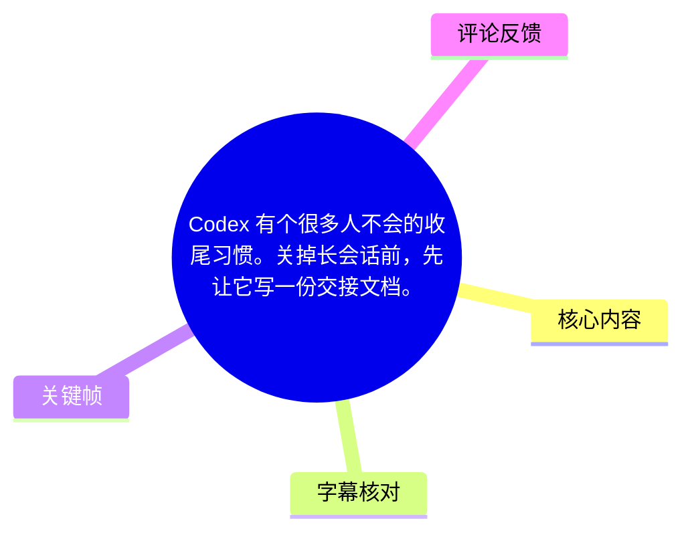
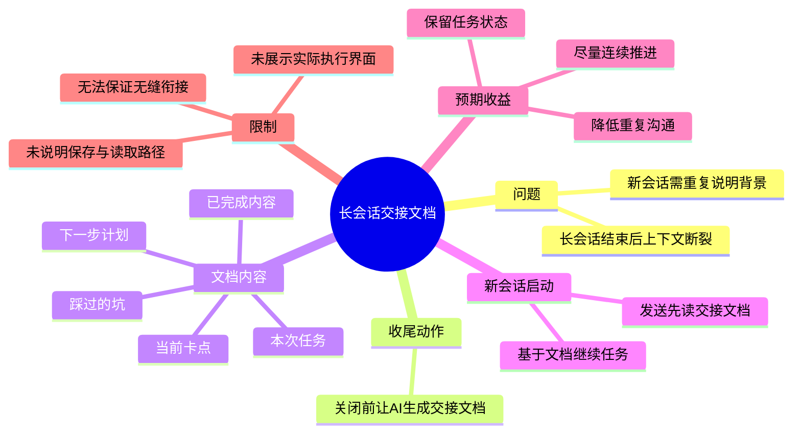

# Codex 有个很多人不会的收尾习惯。关掉长会话前，先让它写一份交接文档。

> 来源：[Bilibili 视频](https://www.bilibili.com/video/BV1aAKw66E4d)  
> UP 主：AI元博士｜时长：12 秒｜合集：AIcode  
> 标签：习惯、文档、ChatGPT来啦

## 小结

视频提出一个面向 Codex 长会话的收尾习惯：在关闭或结束当前长会话之前，不要只停留在对话记录中，而是要求 AI 输出一份写给“新会话”的交接文档。其目的不是总结得好看，而是把下一轮继续执行所必需的任务状态外化、结构化。

视频给出的交接范围包括五项：**本次任务、已完成内容、当前卡点、下一步计划、踩过的坑**。将这五项整理后，新开会话时只需发送“先读交接文档”，即可让新的上下文从已有进度继续工作。

这是一种降低会话切换成本的工作流经验，适合使用 Codex、ChatGPT 或其他具备文件读取与长任务执行能力的 AI 工具处理编码、调试、研究、文档整理等持续性任务的人。其核心价值是减少重复解释背景、遗漏已试过方案及重新定位任务状态的成本。

视频没有展示 Codex 的实际界面、文件保存位置、交接文档格式样例、读取成功率或跨模型兼容性测试。因此，“基本就能无缝接着干”应理解为作者的实践建议，而非已由视频证明的技术保证。是否能连续执行，仍取决于文档是否实际保存、下一会话是否可访问该文件，以及交接信息是否足够准确。

本视频属于简短经验卡片，并非新闻播报；素材中没有涉及版本发布、产品价格、API 参数、模型上下文窗口或具体日期敏感的工具变更。其方法具有一定通用性，但具体提示词能力和文件访问机制会随 Codex 或其他 AI 产品版本变化。

## 思维导图





## 目录

- [背景：为什么长会话需要交接](#背景为什么长会话需要交接)
- [核心方法：结束前生成交接文档](#核心方法结束前生成交接文档)
- [视频给出的两句提示词](#视频给出的两句提示词)
- [可执行的交接流程与检查项](#可执行的交接流程与检查项)
- [关键帧与画面信息](#关键帧与画面信息)
- [结论、限制与时效性](#结论限制与时效性)
- [字幕比对](#字幕比对)
- [评论分析](#评论分析)
- [处理记录](#处理记录)

## 背景：为什么长会话需要交接 [00:00](https://www.bilibili.com/video/BV1aAKw66E4d?t=0)

视频所针对的问题是：当一个 AI 长会话被关闭后，下一次新开会话未必拥有原来的上下文。即使人类用户知道任务进度，也可能需要再次向 AI 说明目标、已经完成的工作、之前失败的尝试和目前阻塞点。

作者将“关掉长会话前”视为一个明确的收尾节点，并建议在该节点产生结构化交接材料。这里的“交接”可理解为把原本散落在多轮对话中的任务状态，压缩为新会话可直接阅读的文档。

视频中可确认的目标是：

1. 保留当前任务的连续性；
2. 让新会话快速获得此前上下文；
3. 避免重新描述任务和重复踩坑；
4. 使后续工作“基本”能继续推进。

需注意，视频没有解释长会话是因上下文长度、任务结束、人工主动关闭、工具会话生命周期，还是其他原因而关闭。因此，不能将其解读为 Codex 某个特定会话限制的官方说明。

## 核心方法：结束前生成交接文档 [00:00](https://www.bilibili.com/video/BV1aAKw66E4d?t=0)

作者的主要建议可以概括为：

> 在结束当前长会话之前，先要求 Codex 把本轮工作的关键状态整理成一份交接文档，并明确该文档的读者是“新会话”。

这里有两个关键设计：

- **先生成文档，再关闭会话**：交接信息由仍然掌握上下文的当前会话生成，而不是由用户在新会话中凭记忆重建。
- **文档面向新会话**：提示词明确要求“写给新会话看”，意味着内容应优先保留下一步执行所需的事实与决策，而非仅写泛泛总结。

视频点名的交接内容可整理如下：

| 交接字段 | 视频中的原始表述 | 对后续会话的作用 |
| --- | --- | --- |
| 任务目标 | 本次任务 | 让新会话了解要解决什么问题 |
| 进度 | 已完成内容 | 避免重复做已完成工作 |
| 阻塞状态 | 当前卡点 | 让新会话从真正未解决的问题切入 |
| 行动安排 | 下一步计划 | 提供继续执行的顺序或方向 |
| 失败经验 | 踩过的坑 | 降低重复尝试无效方案的概率 |

上述“作用”是依据字段语义作出的工作流解释，不是视频展示的实测结果。

## 视频给出的两句提示词 [00:00](https://www.bilibili.com/video/BV1aAKw66E4d?t=0)

视频直接展示了两条中文提示词。第一条用于当前会话的收尾：

```text
把这次任务、已完成内容、当前卡点、下一步计划、踩过的坑，整理成一份交接文档，写给新会话看。
```

第二条用于新会话启动后的恢复：

```text
先读交接文档。
```

第一条提示词的特点是明确列出交接字段。相比只说“总结一下”，它要求输出包含任务状态、阻碍和失败经验，信息密度更适合继续执行。

第二条提示词足够简短，但其成立有前提：

1. 交接文档已被真实地保存下来，而非仅出现在旧对话中；
2. 新会话能够访问该文档，或用户已将文档内容提供给新会话；
3. “交接文档”在当前环境中有可识别的文件名、路径、附件或粘贴内容；
4. 文档本身没有遗漏决定任务走向的关键信息。

视频未规定文档扩展名、目录结构、命名规则或是否必须使用 Markdown；这些均不能从素材中补充为既定事实。

## 可执行的交接流程与检查项 [00:00](https://www.bilibili.com/video/BV1aAKw66E4d?t=0)

根据视频展示的工作流，可按以下顺序执行：

1. **识别会话即将结束**  
   在准备关闭长会话、切换任务环境或另开新会话时，进行交接操作。

2. **向当前 AI 发送交接请求**  
   使用视频给出的完整提示词，要求其整理任务、进度、卡点、计划和踩坑记录。

3. **保存并确认交接产物**  
   视频仅说“写一份交接文档”，没有说明保存方式。实际执行中，应确认文档已保存至后续可访问的位置，或自行复制到可复用的笔记、项目文档或新会话输入中。

4. **在新会话中提供文档访问条件**  
   如果工具支持工作区或文件读取，确保该文档位于新会话可访问范围内；如果不支持，应上传、粘贴或明确指向文档。

5. **让新会话先阅读交接文档**  
   使用视频给出的“先读交接文档”，再根据其阅读结果继续下达执行请求。

6. **验证是否真正接上任务**  
   可要求新会话复述当前目标、已经完成的内容、当前卡点和下一步计划。若复述存在偏差，应先补正文档，而不是直接进入后续执行。

### 建议的文档质量检查

以下检查项是对视频五项字段的可操作化扩展，不是视频中展示的固定模板：

- 任务是否说明了最终目标和当前范围；
- “已完成内容”是否包括已修改的文件、已验证的结果或已做出的决策；
- “当前卡点”是否描述了具体现象、报错、未知条件或待确认假设；
- “下一步计划”是否存在可执行顺序；
- “踩过的坑”是否写清楚失败方案及其失败原因；
- 是否标明仍未验证的结论，避免新会话将猜测当作事实；
- 是否说明文档位置或如何把文档交给新会话。

## 关键帧与画面信息 [00:00](https://www.bilibili.com/video/BV1aAKw66E4d?t=0)


> 图：该关键帧展示了视频的完整核心文字卡，包括“Codex 有个很多人不会的收尾习惯”、交接文档的五项内容，以及新会话中“先读交接文档”的指令。它是核对本视频具体提示词和字段范围的主要视觉依据。

画面为竖屏文字卡，顶部标有“DAILY NOTE”。主体信息以黑色文字和橙色强调词呈现，重点突出“收尾习惯”“交接文档”“已完成内容”“当前卡点”“下一步计划”“踩过的坑”“先读交接文档”等词语；底部为一张猫咪动图风格图片。

素材中展示的多张关键帧画面内容相同或高度重复，均以该文字卡为核心，没有发现可用于补充实际 Codex 操作界面、文件路径、命令行参数或前后步骤变化的独立画面。因此，正文只选用 `frames/frame-001.jpg` 作为证据图，不对其他帧强行赋予未经确认的时序含义。

## 结论、限制与时效性 [00:00](https://www.bilibili.com/video/BV1aAKw66E4d?t=0)

视频传达的是一项简单但实用的 AI 协作习惯：把“结束会话”从直接关闭，改为“先产出交接文档、再关闭”。对长周期任务而言，这可以将隐含在对话历史中的上下文转成可移交信息。

最可迁移的经验不是某一句固定提示词，而是交接信息至少应覆盖：

- 做什么；
- 做到了哪里；
- 卡在哪里；
- 接下来做什么；
- 哪些路径已经失败。

但视频的结论存在明确边界：

- 未展示 Codex 实际生成文档、保存文档和新会话读取文档的全过程；
- 未说明文档是否存入项目工作区、外部文件系统或聊天记录；
- 未展示“无缝接着干”的成功案例；
- 未提供成功率、耗时、上下文节省量等量化参数；
- 未比较不同 AI 工具、不同模型或不同产品版本的兼容性；
- ASR 未识别出语音，视频理解主要依赖画面文字、视频标题和简介，无法确认是否存在未被画面覆盖的口播细节。

时效性方面，视频所用提示词在发布时可作为通用工作流参考；但 Codex 及类似工具对文件读取、工作区持久化、上下文管理和 Agent 执行的支持可能改变。实际使用前应以当前产品的文件访问和会话机制为准。

## 字幕比对 [00:00](https://www.bilibili.com/video/BV1aAKw66E4d?t=0)

| 字幕来源 | 完整性 | 专有名词 | 时间轴 | 主要问题 |
| --- | --- | --- | --- | --- |
| Bilibili 站内字幕 | 未提供可用站内字幕 | 无法评估 | 无可用 SRT 时间段 | 无法用于正文转写或时间轴校对 |
| 本次 ASR 字幕 | 空 | 未识别出有效文本 | 虽输出标记为具有时间戳能力，但没有任何分段 | `large-v3-turbo` 识别结果 `segments: []`，语音覆盖率为 0，无法提供转写依据 |

本次 ASR 已检查。识别配置显示：模型为 `large-v3-turbo`，自动语言识别结果为英语（置信概率 `0.6005859375`），音频时长约 `11.9815` 秒；但没有识别到任何语音分段，诊断中给出“未识别到语音片段”的警告。

诊断材料**没有**标记 `noAudioStream=true`。同时，素材清单中存在 `audio/audio.wav`，因此不能将本视频断言为“源视频没有音轨”，也不能把 ASR 空结果写成工具失败。可如实确认的是：本次 ASR 对所提供音频未产生可用文字结果。

最终未采用站内字幕或 ASR 字幕作为正文文本来源，转而依据以下真实素材交叉整理：

1. 视频标题；
2. 视频简介中的两条提示词及其说明；
3. 关键帧文字卡；
4. 视频元数据中的时长、作者、标签与发布信息。

由于没有可用的 ASR 或站内 SRT 分段，除视频起点 `00:00` 外，不能依据字幕为内部内容划分更细粒度的真实时间轴；文中各章节均链接至视频起点，而非根据文字顺序臆测秒数。

## 评论分析 [00:00](https://www.bilibili.com/video/BV1aAKw66E4d?t=0)

当前仅获取到 1 条热评，少于可处理上限 3 条；不存在可获取的第二、第三条热评。

| 排名 | 用户 | 获赞 | 评论观点 | 分析 |
| --- | --- | ---: | --- | --- |
| 1 | 讲5GGGGG | 1 | “AI Agent时代已来 从对话到执行” | 评论将视频的交接做法放入 AI Agent 趋势中理解，强调工作方式可能从单纯聊天转向持续执行与任务接力。这是评论者的概括性观点，未提供关于 Codex 能力、产品版本或实际效果的可验证证据，不能据此作为事实结论。 |

该评论与视频主题有一定关联：交接文档确实更适合需要跨会话延续任务的执行型工作流。但视频本身未讨论“AI Agent 时代已来”的行业判断，也未展示自主执行 Agent 的完整运行案例。

## 处理记录 [00:00](https://www.bilibili.com/video/BV1aAKw66E4d?t=0)

- Worker ID：`worker-mrj0wbly-5dc4e50c`
- 整理模型：`gpt-5.6-terra`
- ASR 模型：`large-v3-turbo`
- 已使用素材：视频元数据、视频简介、关键帧列表与画面、ASR 诊断结果、热评数据。
- 字幕选择：站内未提供可用字幕；本次 ASR 结果为空且无时间分段；最终以视频标题、简介和关键帧文字作为正文依据，并明确保留字幕缺失限制。
- 关键帧选择依据：`frames/frame-001.jpg` 清晰展示视频的完整文字卡，直接包含交接文档字段和新会话提示词；其余已展示关键帧与该画面重复或高度相近，未额外增加可验证信息。
- 时间轴依据：不存在可用的站内 SRT 或 ASR 分段时间；仅使用可确认的视频起点 `t=0`，未臆测内容的内部发生秒数。
- 缓存清理：素材清单未提供缓存清理执行结果；本文不将其补写为已完成。
- 未解决问题：无法从现有素材确认原视频是否有可辨识口播、交接文档的实际保存方式、Codex 的具体版本及新会话读取文件的实际演示结果。

## 评论分析

- 热评 1：AI Agent时代已来 从对话到执行

以上内容是观众反馈摘录，只用于补充理解视频反响，不作为正文事实依据。
