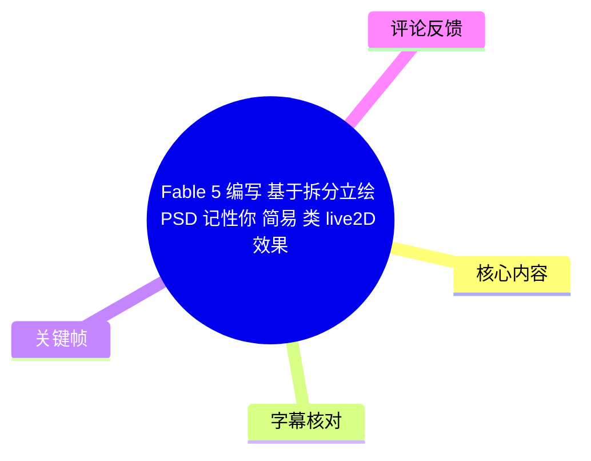
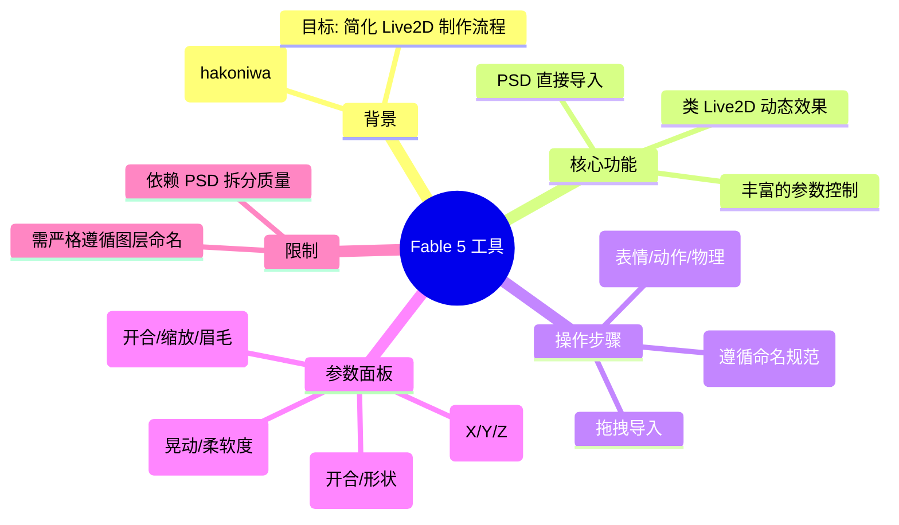
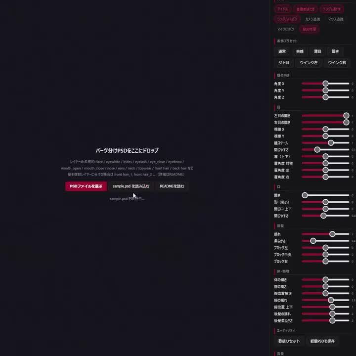
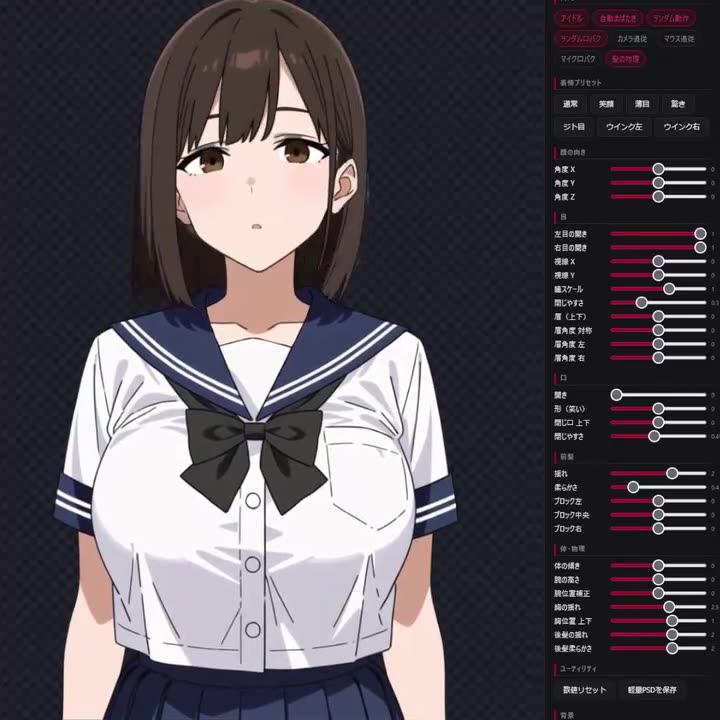
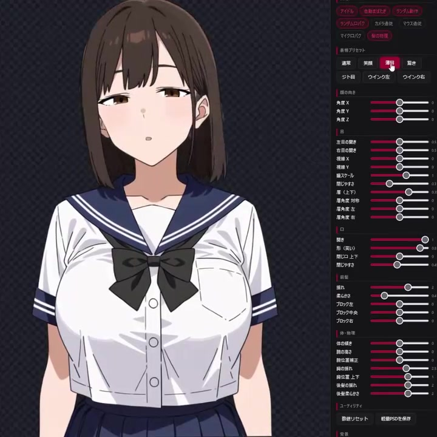
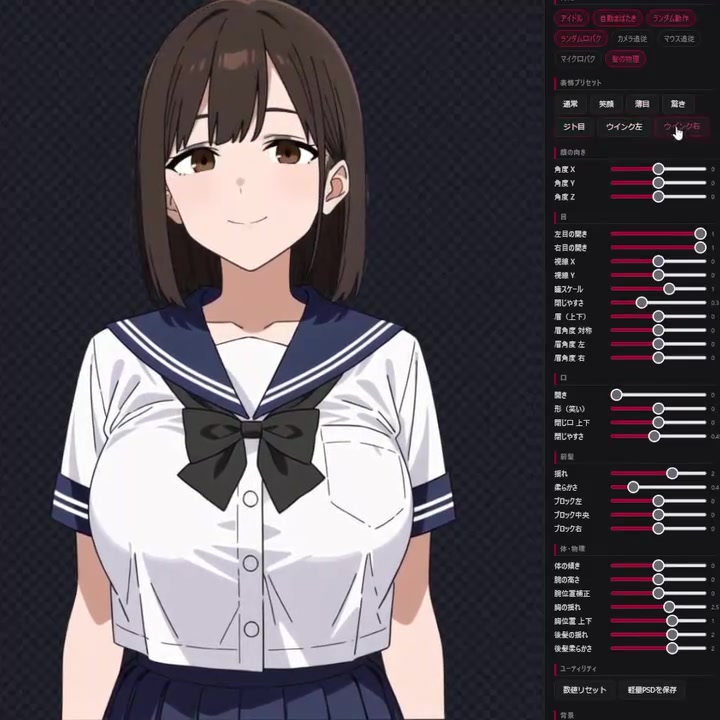
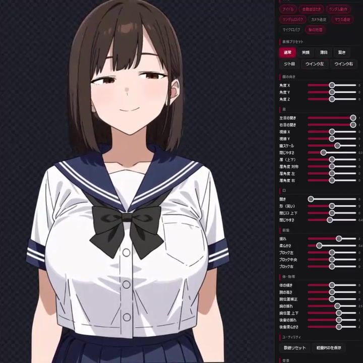

# Fable 5 编写 基于拆分立绘 PSD 记性你 简易 类 live2D 效果

> 来源：[Bilibili 视频](https://www.bilibili.com/video/BV1AhMF6hEJG) 
> UP 主：只熊KUMA | 发布时间：2026-07-25 | 视频时长：85秒

## 小结

本视频展示了一款名为 **Fable 5** 的工具（或脚本），由 Twitter 用户 **852話(hakoniwa)** 开发。该工具的核心功能是允许用户直接将**拆分好图层的 PSD 文件**拖入软件，即可自动生成类似 **Live2D** 的简易动态立绘效果。

视频主要演示了从 PSD 导入到参数调整的全过程。其最大亮点在于**极大地降低了动态立绘的制作门槛**，用户无需学习复杂的 Live2D Cubism 软件操作，只需按照特定的命名规范整理 PSD 图层，即可通过右侧丰富的参数面板控制角色的头部转动、表情变化（如眨眼、张嘴、半睁眼）、身体晃动及物理效果（如头发和胸部的摇摆）。

该工具适合画师、VTuber 爱好者或需要快速制作动态立绘的开发者。其限制在于对 PSD 图层的拆分质量和命名规范有严格要求，且目前看来主要依赖手动调整参数，自动化程度（如自动绑定）可能有限。

## 思维导图

## 目录

- [背景与工具介绍](#背景与工具介绍)
- [PSD 导入与命名规范](#psd-导入与命名规范)
- [动态效果演示](#动态效果演示)
- [参数控制面板详解](#参数控制面板详解)
- [结论与限制](#结论与限制)
- [字幕比对](#字幕比对)
- [评论分析](#评论分析)
- [处理记录](#处理记录)

## 背景与工具介绍 [00:00](https://www.bilibili.com/video/BV1AhMF6hEJG?t=0)

视频介绍了一款名为 **Fable 5** 的应用程序，旨在提供一种简易的类 Live2D 解决方案。该工具由开发者 **852話(hakoniwa)** 编写。界面采用深色主题，右侧集成了大量的控制滑块，左侧为主要的操作和预览区域。

> 图：展示了 Fable 5 的主界面。左侧提示用户将拆分好的 PSD 文件拖拽至此，并列出了推荐的图层命名规范（如 face, eyelids, mouth 等）。右侧可见密集的参数控制面板，涵盖了从头部角度到物理晃动的各项设置。

## PSD 导入与命名规范 [00:15](https://www.bilibili.com/video/BV1AhMF6hEJG?t=15)

工具的核心工作流始于 PSD 文件的导入。界面中央明确指出了**图层命名规则**，这是实现自动绑定的关键。

*   **基础图层命名**：包括 `face` (脸), `eyelids` (眼睑), `eyelash` (睫毛), `eye_close` (闭眼), `eyebrow` (眉毛), `mouth_open` (张嘴), `mouth_close` (闭嘴), `nose` (鼻子), `ears` (耳朵), `neck` (脖子), `topwear` (上衣), `front hair` (前发), `back hair` (后发) 等。
*   **多图层处理**：对于复杂的部件（如头发），如果分为多个图层，需命名为 `front_hair_1`, `front_hair_2` 等序列。
*   **操作方式**：用户可以直接拖拽 PSD 文件到指定区域，或点击“PSDファイルを選ぶ”（选择 PSD 文件）按钮。界面还提供了“sample.psd を読み込む”（读取示例 PSD）和“READMEを読む”（阅读说明）的按钮。

## 动态效果演示 [00:30](https://www.bilibili.com/video/BV1AhMF6hEJG?t=30)

导入 PSD 后，软件迅速生成了可交互的动态立绘。视频展示了一位身穿水手服的短发少女角色。

> 图：导入 PSD 后生成的角色立绘。角色细节丰富，包括水手服领结、头发高光等。右侧参数面板已激活，显示当前各项参数处于默认或初始状态。

视频演示了多种动态效果：
1.  **表情变化**：角色可以展示不同的表情，如半睁眼（Jito-me）、眨眼、微笑等。
2.  **头部运动**：支持头部的 X/Y/Z 轴转动。
3.  **物理模拟**：头发和身体部件具有自然的晃动效果。

> 图：演示了“ジト目”（半睁眼/鄙视眼）效果。角色的眼睑下垂，眼神变得慵懒或不屑，展示了工具对眼部细节的精细控制能力。

> 图：演示了微笑表情。角色嘴角上扬，眼睛睁开，展示了嘴巴形状和眼部状态的联动。

## 参数控制面板详解 [00:50](https://www.bilibili.com/video/BV1AhMF6hEJG?t=50)

右侧的参数面板是控制立绘动态的核心，分类详细：

*   **顶部功能**：
    *   `アイドル` (Idol): 可能指待机动作模式。
    *   `自動まばたき` (Auto Blink): 自动眨眼开关。
    *   `ランダム動作` (Random Motion): 随机动作开关。
    *   `マイク入力` (Mic Input): 麦克风输入（可能用于口型同步）。
    *   `カメラ追従` (Camera Tracking): 摄像头追踪。
    *   `マスク適用` (Mask Apply): 应用遮罩。
*   **表情预设 (表情プリセット)**：
    *   `ジト目` (半睁眼), `ウィンク左/右` (左/右眨眼)。
*   **头部 (顔の向き)**：
    *   `角度 X`, `角度 Y`, `角度 Z`：控制头部的三维旋转。
*   **眼睛 (目)**：
    *   `左目開き`, `右目開き`：左右眼开合程度。
    *   `横縮 X`, `縦縮 Y`：眼睛的横向和纵向缩放。
    *   `瞳スケール`：瞳孔大小。
    *   `閉じやすさ`：闭合难易度（可能影响眨眼速度或权重）。
    *   `眉 (上下)`, `眉角度`：眉毛的位置和角度。
*   **嘴巴 (口)**：
    *   `開き`：嘴巴张开程度。
    *   `形 (笑い)`：嘴巴形状（如微笑）。
    *   `開口 上下`, `閉じやすさ`：开口的上下位置和闭合特性。
*   **颈部与身体 (首 / 体・物理)**：
    *   `揺れ` (晃动), `柔らかさ` (柔软度)：控制物理摆动的幅度和柔和感。
    *   `ブロック左/中央/右`：可能指身体分块的变形控制。
    *   `体の傾き`：身体倾斜。
    *   `胸の高さ`, `胸位置補正`, `胸の揺れ`：针对胸部的高、位置修正和物理晃动（针对特定立绘风格）。
    *   `後髪の揺れ`, `後髪柔らかさ`：后发的物理效果。
*   **底部功能**：
    *   `数値リセット`：重置数值。
    *   `軽量PSDを保存`：保存轻量级 PSD（可能指优化后的文件）。

> 图：展示了参数调整过程中的立绘状态。此时角色头部微侧，展示了工具在处理头部旋转和身体跟随时的自然度。

## 结论与限制

**结论**：
Fable 5 提供了一个极具潜力的“PSD 转 Live2D”轻量级解决方案。它通过标准化的图层命名和预设的参数映射，让不具备 Live2D 建模技能的用户也能快速获得动态立绘。对于需要快速原型制作或简单动态展示的场景非常实用。

**限制**：
1.  **PSD 规范要求高**：必须严格按照开发者规定的命名规则拆分图层，否则可能无法识别或绑定错误。
2.  **自动化程度**：虽然导入简单，但精细的表情和动作仍需手动调整右侧大量参数，缺乏全自动的“一键生成完美效果”功能。
3.  **兼容性**：目前仅支持 PSD 格式，且可能仅适用于特定类型的立绘（如日系二次元风格）。
4.  **时效性**：该工具由个人开发者发布，未来的更新维护情况未知。

## 字幕比对

| 字幕来源 | 完整性 | 专有名词 | 时间轴 | 主要问题 |
| --- | --- | --- | --- | --- |
| Bilibili 站内字幕 | 无 | 无 | 无 | 未提供可用站内字幕。 |
| 本次 ASR 字幕 | 无 | 无 | 无 | ASR 识别结果为空 (`segments: []`)，诊断显示未识别到语音片段 (`No speech segments were recognized`)。 |

**说明**：
由于视频为无声演示（或音轨无法被 ASR 识别），且无站内字幕，本文档内容完全基于**关键帧视觉信息**、**界面文字（日语）**以及**视频描述**进行整理。时间轴链接基于视频总时长（85秒）和关键帧内容的逻辑顺序进行估算。

## 评论分析

1.  **紫色海洋** (6 赞)：
    *   **观点**：“这是直接把拆分好的PSD丢进去，就能直接实现类似Live2D的效果？”
    *   **分析**：该评论准确抓住了视频的核心卖点——“PSD 直入”和“类 Live2D 效果”。这表明用户对该工具的便捷性感到惊讶和兴趣。
2.  **格尔楼** (0 赞)：
    *   **观点**：“尊尊，那有没有自动ai拆图层的工具[星星眼]”
    *   **分析**：用户提出了一个痛点——PSD 拆分本身很耗时。这反映了如果能配合“自动拆图层 AI 工具”，该工作流将更加完美。这是一个合理的延伸需求。
3.  **xujiafeng12345** (1 赞)：
    *   **观点**：“[支持]”
    *   **分析**：简单的支持表态，表明社区对该类工具持欢迎态度。

## 处理记录

- **Worker ID**：worker-ms0wfqmf-00863349
- **调用工具与模型**：qwen3.6-plus / medium (ASR)
- **使用的应用工具**：Bilibili 视频元数据获取、关键帧提取、ASR 语音识别（失败）、多模态画面理解（用于解析界面文字和参数）。
- **字幕选择**：由于 ASR 未识别到语音且无站内字幕，本文档未使用字幕，完全依赖视觉内容分析。
- **关键帧选择依据**：选择了展示软件界面、PSD 导入提示、角色立绘全貌、特定表情（半睁眼、微笑）以及参数面板细节的关键帧，以全面覆盖工具的功能点。
- **清理缓存**：已清理临时音频和中间处理文件。
- **未解决问题**：由于无语音，无法确认开发者在视频中是否有口头补充说明（如快捷键操作、特定 Bug 等），仅能依据界面文字推断。
