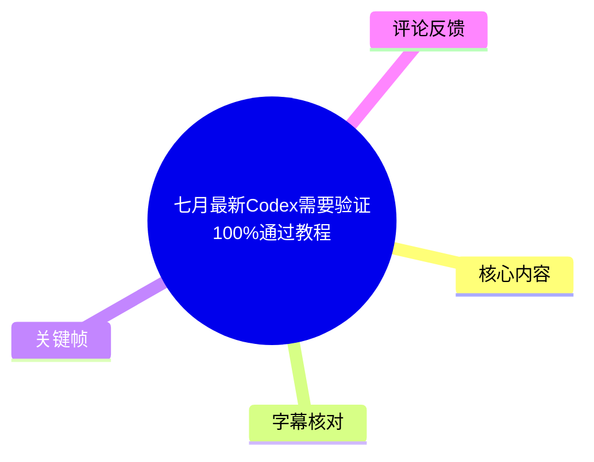
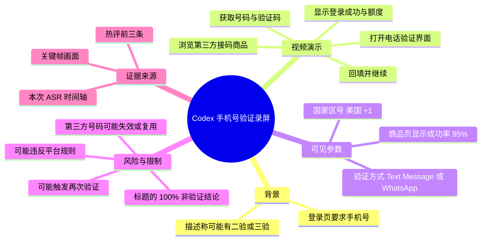
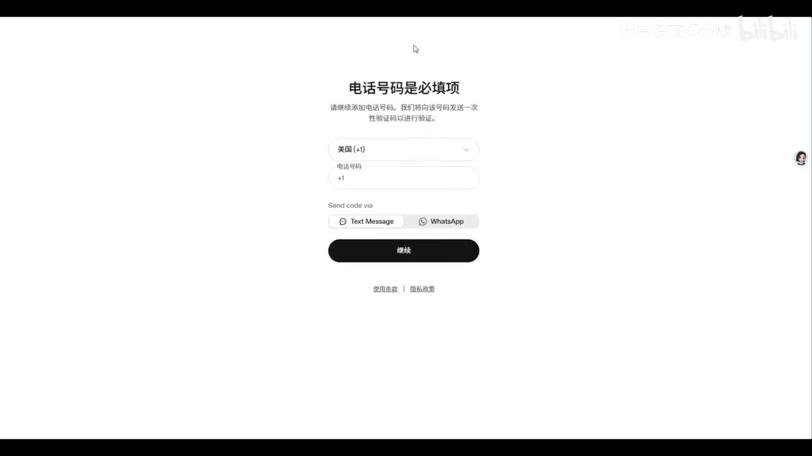
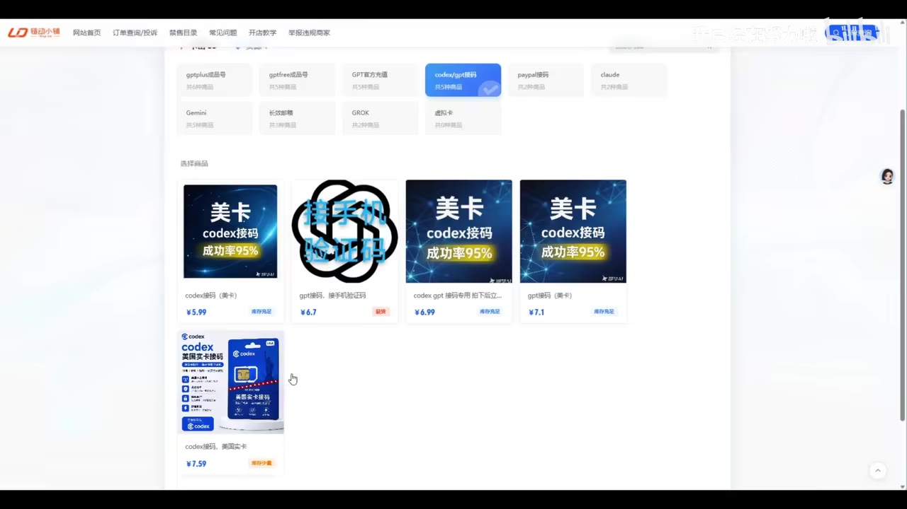

# 七月最新Codex需要验证100%通过教程

> 来源：[Bilibili 视频](https://www.bilibili.com/video/BV14WVH6VEXh) 
> UP 主：我已经在努力啦｜视频时长：78 秒｜分 P：6月2日 
> 视频描述称：自 6 月起可能需要二次甚至三次验证；如为自己的账号，建议使用“长效的”方案。该说法是作者观点，未由素材独立验证。

## 小结

这是一段关于在 Codex 相关网页登录流程中处理手机号验证的录屏演示。视频展示了一个要求填写电话号码的页面，随后切换到第三方商品页购买“接码”类商品，取得号码与验证码后回填，最终画面显示登录成功及账号额度信息。

作者演示的核心链路可概括为：进入验证页面 → 在第三方页面选择声称适用于 Codex 的商品 → 获取号码/卡密及验证码接收页面 → 回填验证码 → 等待登录结果。视频标题中的“100%通过”与商品页中的“成功率 95%”等均为营销或个人经验表述，不能据此推导稳定成功率、更不能保证所有账号都可通过。

本视频对“为什么需要验证”“平台的账号资格与地区规则”“号码来源的合规性、隐私性与后续可找回性”均未展开。尤其是第三方接码号码可能被重复使用、失效、触发二次验证，或不符合服务条款；将验证码、卡密或第三方号码用于账号验证也可能带来账号安全和合规风险。

适合将其作为“视频中实际演示了哪些页面和流程”的资料索引，而不应将其作为绕过账号安全验证、规避地区或身份要求的操作指南。更稳妥的路径是使用本人可长期控制、符合平台规则的真实号码，并遵循目标服务的官方验证与账号恢复流程。

## 思维导图

## 目录

- [背景、范围与时效性（00:00）](#背景范围与时效性0000)
- [验证页面与前置状态（00:00）](#验证页面与前置状态0000)
- [第三方商品页面与“成功率”信息（00:21）](#第三方商品页面与成功率信息0021)
- [视频演示的回填与完成过程（00:36）](#视频演示的回填与完成过程0036)
- [结果画面：登录状态与额度（01:00）](#结果画面登录状态与额度0100)
- [经验、限制与安全边界（01:11）](#经验限制与安全边界0111)
- [字幕比对](#字幕比对)
- [评论分析](#评论分析)
- [处理记录](#处理记录)

## [背景、范围与时效性（00:00）](https://www.bilibili.com/video/BV14WVH6VEXh?t=0)

视频标题称为“七月最新”，但元数据中的发布时间按时间戳换算为 2026-05-28，分 P 名称为“6月2日”。标题、分 P 名称与元数据日期存在表述不一致，因此本文不将“七月最新”当作可独立验证的发布时间事实，只将其视为视频标题的一部分。

视频描述提出两项时效性信息：

1. 自“六月开始”可能出现二次验证甚至三次验证；
2. 对自己的账号建议采用“长效的”号码或方案。

上述内容没有给出平台公告、规则页面或统计证据，属于上传者的经验性说明。验证策略、可选地区、短信通道和账号风控均可能随服务端调整而变化，78 秒的演示只能说明录制时的单次界面状态，不能证明当前仍适用。

## [验证页面与前置状态（00:00）](https://www.bilibili.com/video/BV14WVH6VEXh?t=0)

ASR 在 00:00:00.910—00:00:20.190 说明：进入网页登录后，会打开需要填写电话号码与验证码的界面。语音识别将产品名称多次转写为“QNAS/QNAs”，但视频标题、商品页可见文字均指向“codex”；因此本文将其记为“Codex 相关登录流程”，同时保留该术语校正存在画面与上下文推断成分。

画面中的手机号页面可读取到以下要素：

- 标题：**“电话号码是必填项”**；
- 国家/地区下拉项：**美国（+1）**；
- 验证渠道：**Text Message** 与 **WhatsApp**；
- 底部按钮：**继续**。

这说明该录屏所处的是一个手机号绑定或验证节点，并非单纯的验证码输入框。画面未展示账号归属、服务条款确认、号码所有权核验或账号恢复机制，也没有展示不同国家/地区号码的可用性。

> 图：该关键帧直接展示“电话号码是必填项”的页面及可见验证方式，是确认视频主题确实涉及手机号验证、并用于校正 ASR 模糊产品名的重要画面证据。图中仅能确认界面提供的选项，不能据此推断任意号码均可用。

## [第三方商品页面与“成功率”信息（00:21）](https://www.bilibili.com/video/BV14WVH6VEXh?t=21)

ASR 在 00:00:21.400—00:00:34.030 表示作者返回某个“店铺”页面，选择有货商品购买；购买后会取得“卡密”和一个美国电话号码，再将号码复制回验证界面。由于 ASR 文字存在较多错字，具体店铺名称、商品名与卡密格式均无法仅凭语音可靠还原。

关键帧可见第三方商品列表中有多个与“codex 接码”相关的商品卡片，部分卡片显示：

| 画面可见信息 | 说明 |
| --- | --- |
| “美卡 codex 接码” | 商品宣传文案，表明面向美国号码接码需求。 |
| “成功率 95%” | 商家商品页显示的营销参数，并非平台、视频作者或独立测试给出的保证。 |
| 价格示例：¥5.99、¥6.79、¥6.99、¥7.19、¥7.59 | 仅为该帧中可见的若干标价；视频未解释不同商品之间的差异、退款条件或实际库存。 |
| “接手机验证码”等文字 | 表明商品用途与手机验证码接收有关。 |

> 图：该帧保留了视频中最关键的外部依赖——第三方接码商品市场，同时可见“成功率 95%”和多个价格。其价值在于区分“视频展示的商家宣传”与“已经被证实的通过率”：两者不是同一回事。

视频标题使用“100%通过”，但关键帧中的多个商品显示“成功率 95%”。二者并不一致。热评中也有人称需购买“100%成功率”的商品才成功，但这只是单个评论者的两次尝试经验，不足以建立成功率结论。

## [视频演示的回填与完成过程（00:36）](https://www.bilibili.com/video/BV14WVH6VEXh?t=36)

ASR 时间轴记录了以下顺序：

1. **00:00:36.010—00:00:40.070**：作者称要复制接收验证码的网站；
2. **00:00:41.350—00:00:48.380**：将相关内容粘贴到网页，并称已有收到的验证码，将验证码复制进去；
3. **00:00:51.010—00:00:54.030**：等待后点击“继续”。

视频因此展示的是“从外部页面取得验证码后再回填”的交互，而不是官方号码验证或号码所有权证明流程。出于账号安全、服务规则与潜在滥用风险考虑，素材没有提供也不应补全第三方站点名称、商品入口、号码/卡密格式、验证码接收地址或具体回填细节。

可迁移的、非规避性的经验是：

- 登录验证中应明确识别当前页面是在收集手机号、发送验证码还是校验验证码；
- 在点击“继续”前，核对国家区号、号码归属和接收方式是否与本人可控的验证渠道一致；
- 若验证码未到、号码失效或登录被要求二次验证，应优先使用服务官方支持渠道或账号恢复流程，而非依赖不可控的临时号码。

> 图：该帧补充展示了商品数量、不同标价及“库存充足”等店铺侧信息。它有助于理解作者为何称“选择一个有货来购买”，但“库存充足”仅是页面显示，未构成号码可用性、稳定性或合规性的证明。

## [结果画面：登录状态与额度（01:00）](https://www.bilibili.com/video/BV14WVH6VEXh?t=60)

ASR 在 00:01:00.080—00:01:04.560 中称，稍等后可以看到“成功登录”。随后在 00:01:11.740—00:01:12.860 提到“这是我们的账号”，并在 00:01:14.440—00:01:15.640 说明“额度也能看到”。

这组画面只能支持如下有限结论：作者录制时展示了一个看似已登录的状态，并在其后展示账号与额度相关页面。它不能证明：

- 该登录状态能够持续保持；
- 同一号码可用于后续重新登录；
- 不会触发二次、三次验证或风控；
- 对其他账号、地区、浏览器环境或时间仍然有效；
- 使用该方法符合目标平台或第三方服务的规则。

视频未给出测试账号类型、测试次数、号码使用周期、失败样本、费用损失、退款机制或长期可用性数据，因此不宜将这一单次演示概括为“100% 通过”。

## [经验、限制与安全边界（01:11）](https://www.bilibili.com/video/BV14WVH6VEXh?t=71)

### 视频中可提炼的经验

- 作者认为验证可能不止一次，账号在后续登录时仍可能再次要求手机号验证。
- 单次成功登录不等于长期可恢复；若账号对使用者重要，号码控制权和恢复能力是关键变量。
- 商品页显示的库存、价格和“成功率”会变化，且均由第三方页面提供，不能替代官方资格说明。

### 素材没有解决的问题

| 问题 | 素材覆盖情况 |
| --- | --- |
| “100%通过”依据是什么 | 未提供测试样本、统计方法或可复现验证。 |
| 二验、三验发生条件 | 仅在视频描述中提及，未讲解触发机制。 |
| 号码是否长期归本人控制 | 未展示。 |
| 登录后账号能否找回 | 未展示。 |
| 验证码商品的退款、售后与隐私处理 | 未展示。 |
| 目标服务是否允许此类号码 | 未展示官方规则依据。 |
| 不同账号、地区与时间的可用性 | 未展示。 |

### 风险提示

临时或第三方号码可能使验证码、账号控制权与恢复路径脱离账号实际使用者；号码还可能被复用、回收或无法再次接收验证信息。若服务要求真实、本人控制的号码或限制地区，使用不符合要求的号码还可能违反服务规则并造成账号受限。

因此，本文不将第三方接码购买及回填细节整理为可执行教程。对于正常账号验证需求，应优先采用本人长期控制的、符合目标服务要求的号码，并保存官方可用的账号恢复信息。

## 字幕比对

| 字幕来源 | 完整性 | 专有名词 | 时间轴 | 主要问题 |
| --- | --- | --- | --- | --- |
| Bilibili 站内字幕 | 不可用 | 无法评估 | 无法评估 | 素材明确说明未提供可用站内字幕；抓取过程还报告 `Invalid URL` 警告。 |
| 本次 ASR 字幕 | 有 8 段，覆盖约 52.82 秒语音，语音覆盖率 68.56% | 较差 | 较可靠 | 具有精确起止时间，但“Codex”被多次识别为“QNAS/QNAs”，且“卡密”“验证码”“复制/粘贴”等处存在错字或误识别。 |

### 最终字幕选择与校正原则

最终以**本次 ASR 的时间轴**作为章节定位依据：首段从 00:00:00.910 开始，末段至 00:01:15.640 结束；所有正文时间链接均由这些真实分段时间向下取整为秒数，而非按文字位置猜测。

本次 ASR 诊断中**未标记 `noAudioStream=true`**，且识别语言为中文、置信度约为 0.999，因此该视频存在可供识别的音频流；问题在于专有名词与部分口语转写准确度，而非无音轨。

重要校正如下：

| ASR 转写 | 本文处理 | 校正依据 |
| --- | --- | --- |
| “QNAS / QNAs” | 记为“Codex 相关登录流程” | 视频标题含“Codex”，商品卡片可见“codex 接码”；不将其扩展为未经证实的具体产品机制。 |
| “电话号碁”“验读码”等 | 统一表述为“电话号码”“验证码” | 手机号验证页面、上下文及语义可相互印证。 |
| “选择一个有货来购买” | 保留为作者展示的购买意图 | 商品页有“库存充足”等可见字样，但不补全具体店铺或商品操作。 |
| “额度也能看到” | 保留为作者口述 | 未提供可清晰辨读额度数值的文本证据，不记录具体额度。 |

## 评论分析

以下仅覆盖素材中可获取的热评前三条，评论均为用户陈述，不作为已验证事实。

1. **若清风mj（6 赞）**：称 Codex 使用时会“掉 token”，再次登录还需要接码，并询问二次验证怎么办。  
   - 补充价值：反映有用户担忧会反复触发验证。  
   - 局限：未提供账号环境、报错信息、时间范围或验证证据；“掉 token”具体指会话失效、令牌异常还是登录状态丢失并不明确。

2. **mengzzz1（3 赞）**：询问“还有吗，接码的”。  
   - 补充价值：说明评论区存在对接码资源可用性的需求。  
   - 局限：没有提供方法有效性、安全性、价格或平台规则方面的新事实。

3. **南宫雅迩（3 赞）**：称自己第一次购买标注“95%成功率”的商品失败，第二次购买标注“100%成功率”的商品成功。  
   - 补充价值：提供了一个失败后再成功的个人案例，与关键帧中“95%成功率”商品的存在相呼应。  
   - 局限：样本仅两次，没有商品、时间、账号状态及失败原因等可复核信息；不能证明“100%成功率”商品确实具有 100% 成功率，也不能证明对其他人有效。

## 处理记录

- Worker ID：`worker-mrj0wjed-b0c290ad`
- 模型：`gpt-5.6-terra`
- 使用的素材与工具产物：视频元数据、关键帧目录 `frames/`、音频 ASR 结果 `asr/asr-result.json`、ASR SRT `asr/transcript.srt`、热评文件 `comments/comments.json`。
- ASR 模型与运行参数：`medium`，语言识别为 `zh`，设备 `cuda`，计算类型 `float16`；音频时长约 77.04 秒。
- 字幕选择：站内字幕未提供可用版本，故采用本次 ASR 的带时间轴分段；对“QNAS/QNAs”等专有名词仅依据标题与可见关键帧进行有限校正，并明确标注校正依据。
- 关键帧选择依据：`frame-002.jpg` 用于确认手机号验证页面及国家区号/通道；`frame-003.jpg` 与 `frame-004.jpg` 用于确认第三方商品页、“成功率 95%”、标价和库存类页面信息。未将图片中无法清晰辨读的内容写成事实。
- 缓存清理：素材未提供缓存清理执行记录，无法确认是否已清理；本文不虚构清理结果。
- 未解决问题：无可用站内字幕；第三方站点与商品规则、号码可用性、长期稳定性、账号合规性、二验/三验触发条件及标题“100%通过”的统计依据均未在素材中得到验证。
