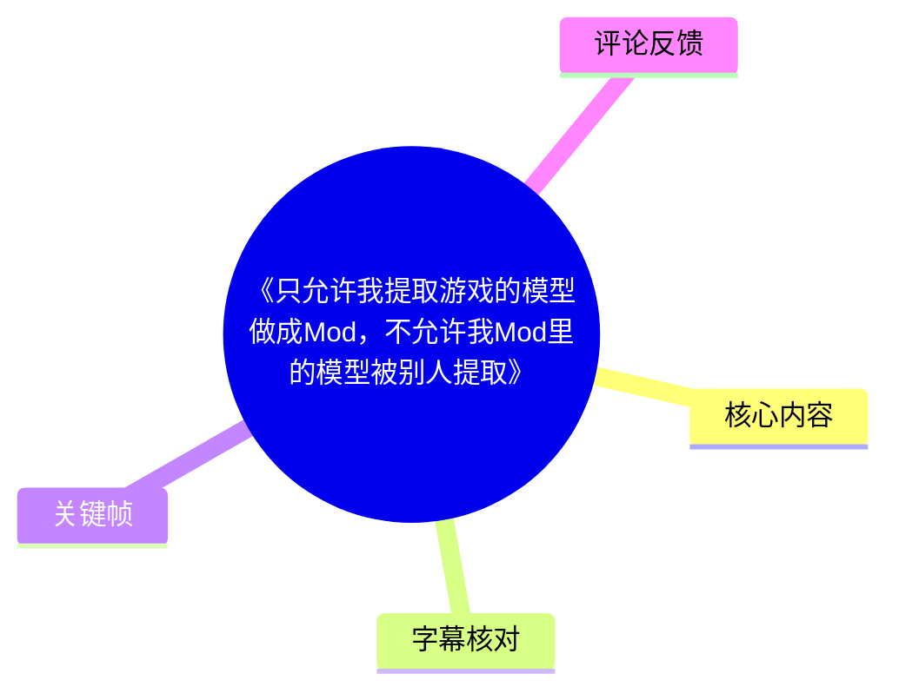
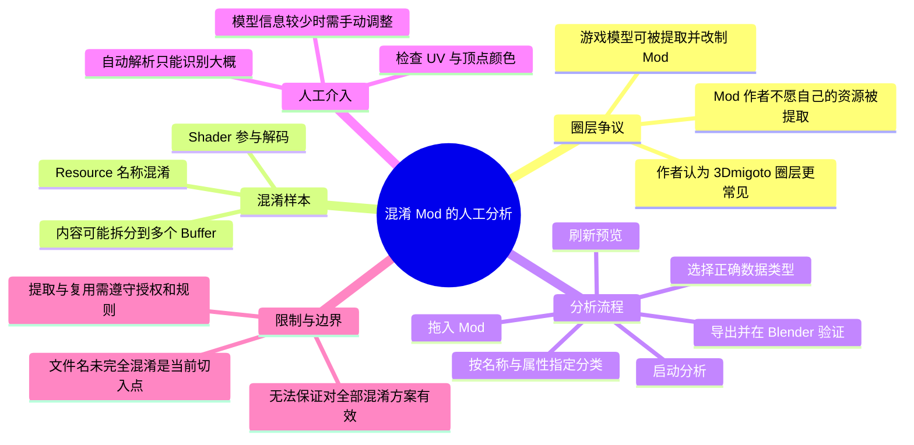
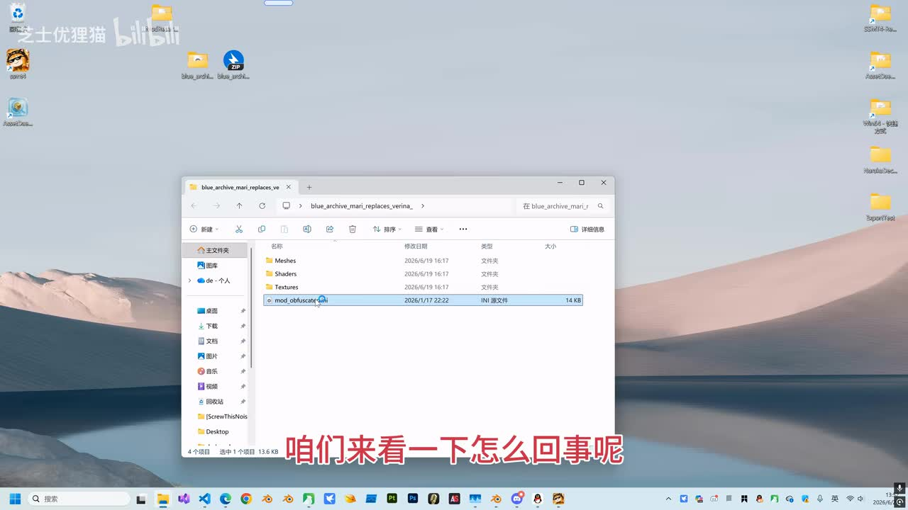
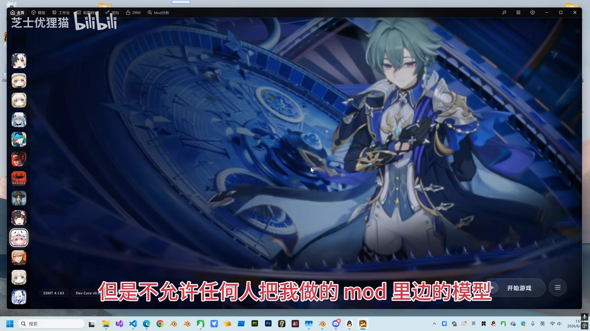
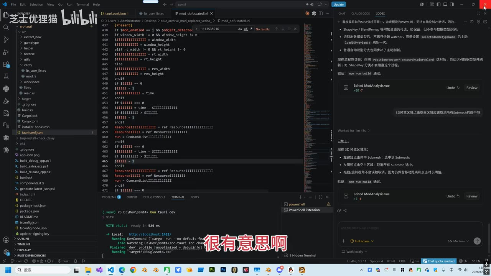
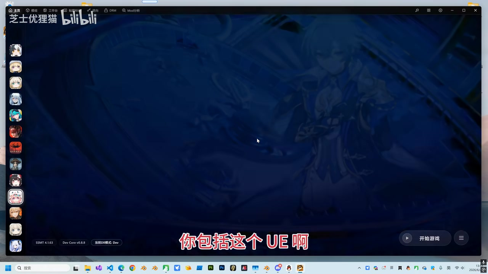

# 《只允许我提取游戏的模型做成Mod，不允许我Mod里的模型被别人提取》

> 来源：[Bilibili 视频](https://www.bilibili.com/video/BV1Ddj761ENu) 
> UP 主：芝士优狸猫｜视频时长：04:33｜标签：3Dmigoto、Mod 逆向、Mod 混淆、SSMT、Mod 保护等

## 小结

视频以一个经过资源混淆的 3Dmigoto Mod 为例，演示了作者所称的“MOD 分析”工具在无法完全自动解析时，如何通过人工指定资源类别、切换数据类型、刷新预览并导出模型，最终在 Blender 中检查模型、UV 和顶点颜色。

作者描述的混淆表现包括：资源名称被大量替换为类似 `ResourceIL...` 的形式、资源内容可能被拆入多个 buffer 后再由 shader 解码。这会削弱依靠 Resource 名称进行自动识别的能力，但作者认为，只要文件名及一部分结构信息仍可利用，仍能人工辅助恢复出可用模型。

视频的核心观点不仅是技术演示，也批评了某些 3Dmigoto Mod 圈层中的单向规则：创作者可以提取游戏原始模型并改制 Mod，却不希望自己的 Mod 被他人提取模型。作者将其与其他可直接通过模型查看/提取工具打开的 Mod 生态作对比，并认为 3Dmigoto 社区中“禁止逆向 Mod”的诉求更突出。

实际操作的关键限制是：当模型信息被混淆得较少或属性无法自动判定时，工具不能做到全自动解析，必须人工为资源归类，并选择合适的数据类型；视频中没有给出通用的资源格式规范、脚本源码、工具下载地址、具体游戏名称或可复现项目文件。因此，这是一段操作思路展示，而非可直接复刻的完整教程。

视频结尾的“任何混淆都没用”“DLL 加密也没用”属于作者立场和经验性判断，不应理解为已对所有加密实现、所有游戏或所有 Mod 格式完成了普遍性验证。Mod 提取、再分发和二次使用还可能受到游戏 EULA、原作者许可、平台规则及著作权规则约束，技术上可行不等于具有授权。

## 思维导图

## 目录

- [样本与 Mod 圈层争议](#样本与-mod-圈层争议)
- [混淆机制与自动分析的边界](#混淆机制与自动分析的边界)
- [人工修正逆向结果：实际步骤](#人工修正逆向结果实际步骤)
- [导出后的 Blender 校验](#导出后的-blender-校验)
- [结论、限制与时效性](#结论限制与时效性)
- [字幕比对](#字幕比对)
- [评论分析](#评论分析)
- [处理记录](#处理记录)

## [样本与 Mod 圈层争议](https://www.bilibili.com/video/BV1Ddj761ENu?t=0)

### [特殊样本：资源名称与内容均被混淆](https://www.bilibili.com/video/BV1Ddj761ENu?t=0)

视频开头展示一个 Mod 文件夹，作者称该 Mod 通过脚本对资源进行了混淆。根据 ASR，资源标识被处理为大量类似 `ResourceIL, IL, IL` 的名称，使分析者难以再通过 Resource 名称直接判断资源用途。

作者进一步推测/描述，资源内容也可能经过混淆：例如使用多个 buffer 承载数据，再由 shader 进行解码。这里的“多个 buffer + shader 解码”是视频中的口述说明；素材没有提供具体 shader、buffer 布局或脚本实现，因此不能据此确认其精确实现方式。

> 图：画面展示 Windows 文件资源管理器中的 Mod 目录，包含 `Meshes`、`Shaders`、`Textures` 等文件夹及 `mod_obfuscated.ini`。它说明本视频讨论的是含网格、着色器、纹理和配置文件的 Mod 结构，而非单一模型文件。

### [“可提取游戏模型、不可提取 Mod 模型”的矛盾](https://www.bilibili.com/video/BV1Ddj761ENu?t=24)

从约 00:24 开始，作者提出其观察到的圈层现象：

1. Mod 制作者可以从游戏中提取模型并进行任意修改；
2. 也可以使用他人的模型制作 Mod；
3. 但部分制作者不允许别人从自己发布的 Mod 中再提取模型使用。

作者将此概括为“只允许我做，不允许其他人做”的单向规则，并将其作为后续混淆与逆向讨论的社会背景。这是作者对 Mod 社区生态的评价，不是经统计调查得出的行业结论。

> 图：画面中可见带角色背景的 Mod/启动器界面，以及“但是不允许任何人把我做的 mod 里边的模型”的字幕。该帧直观对应视频的争议焦点：模型资源的提取权与再利用权是否对称。

### [与其他 Mod 社区的对比](https://www.bilibili.com/video/BV1Ddj761ENu?t=72)

作者称，在其所提到的其他 Mod 社区中，例如 RE 系列相关 Mod 社区以及 Unreal Engine 相关 Mod 社区，Mod 往往可被对应的软件直接打开或提取；即使存在额外密钥，掌握制作流程的人通常仍可以获得资源。因此，作者认为这些生态中较少出现“禁止 Mod 逆向”的规则。

需要保留以下信息边界：

- ASR 将软件名识别为“FMOD”，但结合上下文，作者意图可能是指用于查看/提取某类游戏资源的对应工具；素材不足以据此准确核定软件名，本文不将其扩展为确定事实。
- “其他社区没有禁止逆向的规定”是视频作者的概括性陈述，未提供社区规则链接、样本范围或调查方法。
- 即使资源可被技术读取，也不表示其授权允许任意转载、改造、售卖或署名使用。

## [混淆机制与自动分析的边界](https://www.bilibili.com/video/BV1Ddj761ENu?t=97)

### [作者的工具判断：一键逆向受阻，但分析仍可继续](https://www.bilibili.com/video/BV1Ddj761ENu?t=97)

作者表示，3Dmigoto Mod 中的保护或混淆，面对其“MOD 分析”流程并非完全有效。视频随后进入工具界面演示：将严重混淆的 Mod 拖入后，点击“开始分析”，工具能够产生初步结果，但无法直接给出可用的具体内容。

这一区别很重要：

| 阶段 | 视频展示的结果 |
| --- | --- |
| 一键/自动分析 | 可启动、可得到部分初步识别结果 |
| 具体资源解析 | 未能直接正确呈现，需要修正 |
| 人工分类后预览 | 可逐步恢复识别结果 |
| 导出后验证 | 视频中导出的样本通过了基本视觉检查 |

作者认为该样本的混淆“级别还不够”，理由是文件名尚未被完全混淆；因此其工具还可暂时依据名称线索进行归类。作者同时表示，若文件名也被混淆，后续需要开发相应的去混淆能力。这说明视频展示的是工具与混淆方案之间持续迭代的对抗状态，而不是一次性、永久有效的自动解法。

> 图：画面中代码编辑器打开 `mod_obfuscated.ini`，大量字段和 `Resource...` 引用呈现为难以阅读的混淆文本。它帮助理解为何仅依靠资源命名规则的一键识别会失效。

### [无法全自动解析的原因](https://www.bilibili.com/video/BV1Ddj761ENu?t=208)

约 03:28 起，作者明确说明：当前样本已经被混淆到无法“全自动解析”的程度。其给出的直接原因是该模型中的信息较少，分析工具无法仅依靠现有数据自动确定全部属性，因此只能人工手动介入。

这意味着视频中的“成功恢复”依赖以下前提：

- 仍能获得某些资源名称、数据或结构线索；
- 操作者能够识别模型各类数据属性的合理归属；
- 预览区域可用于验证人工选择的效果；
- 导出的文件可进一步导入 Blender 检查。

视频没有说明当名称、资源关系、数据类型、索引结构和 shader 解码逻辑均被完整隐藏时，工具如何处理；这部分属于未展示的能力边界。

## [人工修正逆向结果：实际步骤](https://www.bilibili.com/video/BV1Ddj761ENu?t=121)

以下按视频中的演示顺序整理。术语以 ASR 与画面可确认内容为基础；少数专有字段存在识别不稳定，保留其不确定性。

### [1. 导入 Mod 并启动分析](https://www.bilibili.com/video/BV1Ddj761ENu?t=121)

1. 将目标 Mod 拖入分析工具。
2. 点击“开始分析”。
3. 工具生成初步分析结果，但具体内容没有正确显示。
4. 判断该情况并非“没有结果”，而是资源类别或数据属性尚未被正确对应，需要人工修正。

视频中的经验是：不要把初步预览异常直接等同于导入失败；应先检查工具是否已读取到资源，再对分类和数据类型进行干预。

### [2. 利用当前仍可见的名称线索指定资源分类](https://www.bilibili.com/video/BV1Ddj761ENu?t=145)

作者称当前版本仍通过“名字”辅助识别，因此在文件名未完全混淆时，可以为每个条目指定其对应分类。完成指定后，工具就能识别出“大概”的结果，但仍可能有不少数据处于错误分类状态。

视频中口述并尝试指定的类别包括：

- `TexCoord`：ASR 在此处有“Tex Core”等误识别，结合图形模型常用语义，本文以 `TexCoord` 标注为较高可能的校正，但原视频未提供字段拼写截图；
- `Color`：顶点颜色相关属性；
- `Blend`：ASR 在此处识别不稳定，可能指骨骼蒙皮相关的混合权重/索引语义；
- `Tex ID`；
- `Tex Offset`。

这些字段的具体名称、枚举范围、数据长度与工具内部定义均未在素材中展示。正确做法是将其视为作者在该样本中的分类示范，而不是适用于所有游戏模型的固定字段表。

### [3. 刷新预览区域](https://www.bilibili.com/video/BV1Ddj761ENu?t=194)

在完成资源分类指定后，作者点击“刷新预览区域”。其目的不是创建新数据，而是让工具使用更新后的分类关系重新解释已有数据并呈现模型预览。

从演示逻辑看，刷新是连接“人工标注”与“可视化验证”的关键一步：如果预览仍然混乱，应继续检查资源类别或属性映射，而不是直接导出。

### [4. 切换到正确的数据类型并检查 UV](https://www.bilibili.com/video/BV1Ddj761ENu?t=208)

当预览仍无法完全正确时，作者进一步手动切换到“正确的数据类型”，并称一般情况下模型的数据类型相对固定，“就那么几个”。视频没有列出具体数据类型名称、位宽、归一化方式或字节序，因此不能补写为特定的顶点格式参数。

视频可确认的判断顺序是：

1. 选择较常用、且与该属性相符的数据类型；
2. 观察 UV 是否正确；
3. 观察模型整体形状是否正确；
4. 在模型和 UV 均无明显问题后再导出。

这里的 UV 检查是重要的可视化校验：若顶点属性解释错误，纹理坐标通常会发生拉伸、错位或不连续；但视频没有给出量化阈值或自动校验指标。

## [导出后的 Blender 校验](https://www.bilibili.com/video/BV1Ddj761ENu?t=232)

### [导出与重新导入](https://www.bilibili.com/video/BV1Ddj761ENu?t=232)

作者在确认 UV 和模型预览无明显异常后，点击导出当前模型，随后转到 Blender 进行检查。视频的校验重点不是渲染成品，而是确认导出数据在通用 DCC 软件中仍保持正确的模型结构与顶点属性。

Blender 检查流程包括：

1. 导入刚刚导出的最新文件；
2. 检查模型整体是否正常；
3. 检查顶点绘制（Vertex Paint）中的 `Color`；
4. 观察颈部红色区域是否符合预期；
5. 检查权重相关结果，作者口述为“权重没问题”。

> 图：画面仍处于角色启动/预览界面，展示本次分析所面对的角色资源背景。结合后续 Blender 检查段落，它有助于读者将“恢复出的模型数据”与原本角色外观建立对应；但关键帧未附采样时间，不能将该图作为精确时间定位证据。

### [视频中采用的验证标准](https://www.bilibili.com/video/BV1Ddj761ENu?t=232)

| 检查项 | 作者的判断方式 | 可确认的结果 |
| --- | --- | --- |
| 模型几何 | 直接观察导入后的模型 | 作者称“没问题” |
| UV | 在导出前观察 UV 是否正确 | 作者称 UV 正确 |
| 顶点颜色 `Color` | Blender 顶点绘制查看颈部颜色 | 作者称颈部为红色且正确 |
| 权重 | 检查“权重”显示/效果 | 作者称权重没有问题 |

这些检查能够确认该次样本的导出结果在视觉上可用，但不能单独证明模型的所有隐藏属性、材质逻辑、动画兼容性、骨骼命名、LOD、物理数据或游戏内运行效果完全正确。

## [结论、限制与时效性](https://www.bilibili.com/video/BV1Ddj761ENu?t=259)

作者的结论是：即便使用资源混淆或 DLL 加密，只要有人持续投入分析，模型仍可能被恢复。这一结论强调了客户端可渲染资源在运行和图形管线中必须以某种可用形式存在，因此保护措施通常会提高提取成本，而不必然消除风险。

但需要严格区分视频实际演示与可泛化结论：

- **已演示**：一个名称和资源内容均受干扰的 Mod，经过人工分类、调整数据类型与 Blender 校验后，导出了看似正确的模型。
- **未演示**：对完全匿名化资源、复杂自定义 shader 解码、运行时动态生成数据、完整 DLL 保护或其他游戏引擎格式的通用破解流程。
- **作者判断**：混淆与 DLL 加密“都没有用”。这是该 UP 主在视频中的结论，不能直接外推为所有保护方案均无价值。
- **现实限制**：混淆可能显著提高分析的时间、专业知识和维护成本；游戏更新、Mod 工具版本和资源格式变化也会使当前流程失效或需要重做。
- **合规边界**：对游戏资源和他人 Mod 资源的提取、修改、传播、售卖或署名，应以原作授权、Mod 作者许可、平台规则和适用法律为准。视频讨论技术可行性，不构成授权或法律意见。

本视频发布时点由元数据换算为 2026 年 6 月，演示工具界面、自动识别能力及混淆策略均可能在之后迭代；阅读和实际操作时应以当前工具版本、目标游戏规则和资源授权状态为准。

## 字幕比对

| 字幕来源 | 完整性 | 专有名词 | 时间轴 | 主要问题 |
| --- | --- | --- | --- | --- |
| Bilibili 站内字幕 | 未提供可用字幕，无法比较文本完整性 | 无法核验 | 无可用时间轴 | 素材明确标注“未提供可用站内字幕” |
| 本次 ASR 字幕 | 较完整：12 段，语音覆盖约 265.11 秒，占音频 97.38% | 存在多处误识别或不稳定识别 | 完整，含毫秒级 SRT 起止时间 | 口语断句较长；`3Dmigoto`、`TexCoord`、`Blend`、软件名等可能被误识别 |

本次 ASR 使用 `medium` 模型，识别语言为中文，语言置信度为 `0.99951171875`；音频时长为 272.256 秒。诊断中未标记 `noAudioStream=true`，且语音覆盖率较高，说明源视频存在可用音轨，本记录以本次 ASR 的 SRT 时间轴作为章节定位依据。

最终字幕选择为：**以本次 ASR 的时间戳和主要语义为准，结合关键帧及图形领域上下文对少数术语作保守标注**。由于没有站内字幕，无法进行逐句对照校订。

重点校正与保留项：

- ASR 中的“3D Migoto”统一写作 **3Dmigoto**，与视频标签一致。
- ASR 中的“Tex Core”较可能对应图形顶点语义 **TexCoord**，但未获得清晰字段截图，因此在正文中明确标注为上下文校正，而非百分之百确定的转写。
- ASR 中“Color”较稳定，可对应顶点颜色检查。
- ASR 对“Blend”及部分字段有明显口语/专名误识别，正文不补造字段细节。
- ASR 中的“FMOD”无法仅凭音频确定是否为准确工具名，正文保留不确定性，不将其作为确定的软件事实。

## 评论分析

以下仅处理可获取的热评前三条。评论代表个人经验或观点，未被视为已验证事实。

1. **Fljsky（23 赞）**  
   评论以 “ninjaripper：我管你这的那的，有本事你的做的mod不用显卡渲染。” 调侃资源保护的局限。其核心观点是：只要 Mod 最终要被显卡渲染，资源或可用数据就必须在某个阶段进入可被分析的链路，因此单纯保护难以绝对阻止提取。该观点与视频结尾“混淆提高成本而非绝对阻断”的倾向一致，但评论没有提供技术条件、适用范围或验证过程。

2. **Nordlicht_（130 赞）**  
   评论补充了红色警戒 Mod 圈的案例：据其说法，相关官方协议允许使用系列官方素材制作 Mod，但要求尊重其他 Mod 作者的劳动、使用二创内容需征得许可，并限制直接商业售卖。评论进一步认为，二次元游戏 Mod 的规则环境较灰色，缺少官方约束时更易混乱。该评论为视频的“社区规则差异”提供了另一种解释框架，但所述官方协议内容未附链接，不能在本文中当作已核验规则。

3. **梦梦Velia（62 赞）**  
   评论认为，部分资源保护和单向限制的动机主要与“卖钱”有关，并称 3Dmigoto 的特性适合相关操作，还举出模型被多次替换头部、被他人声称原创的现象。它补充了经济利益和署名争议这一可能动机，但属于评论者的经验判断；视频本身未提供交易记录、侵权案例或因果证据，不能据此确认其普遍性。

## 处理记录

- Worker ID：`worker-mrj0wjed-b0c290ad`
- 模型：`gpt-5.6-terra`
- 调用工具与素材：视频元数据、关键帧、ASR 诊断、ASR SRT、热评数据；未提供站内字幕文本。
- 使用的 ASR：`medium`，中文识别，CUDA / `float16`；共 12 个带时间戳分段。
- 字幕选择：站内字幕不可用；已检查本次 ASR，采用其 SRT 的真实起止时间作为时间轴依据，并对专有名词采取保守校正。
- 关键帧选择依据：选用 `frame-001` 展示 Mod 目录结构、`frame-002` 展示混淆配置/资源引用、`frame-003` 展示视频讨论的核心争议、`frame-004` 作为角色资源上下文补充。关键帧素材未提供各帧采样时刻，因此未以帧序号推断章节时间位置。
- 时间轴依据：所有章节链接均按 ASR SRT 给出的分段起始时间换算为秒，未按文字顺序臆测时间。
- 缓存清理：素材中未提供缓存清理执行日志；本记录不虚构清理结果。
- 未解决问题：视频未提供分析工具名称、版本、下载方式、源码、完整资源格式、原始 Mod 文件、具体游戏名及完整 Blender 导出设置；部分 ASR 专有名词无法通过站内字幕复核。
