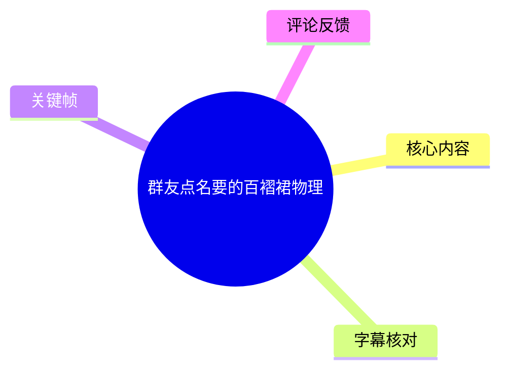
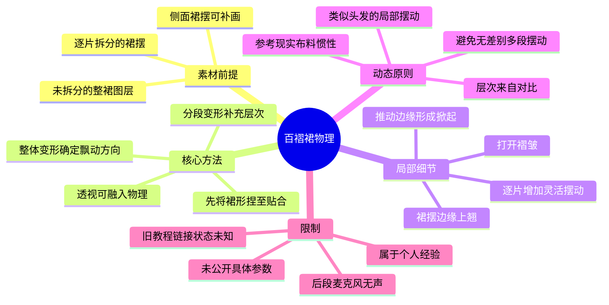
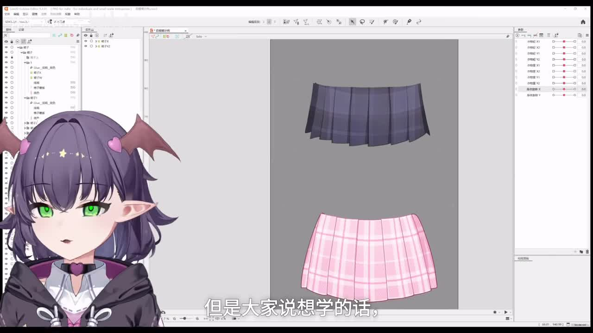
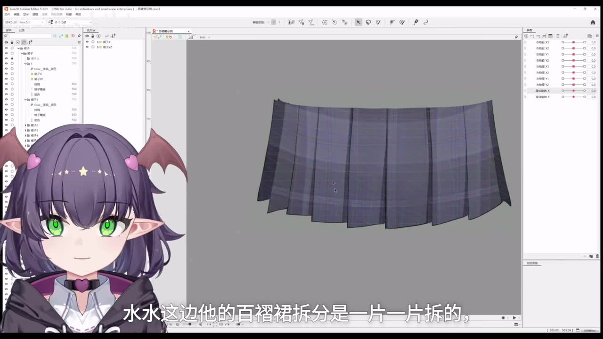
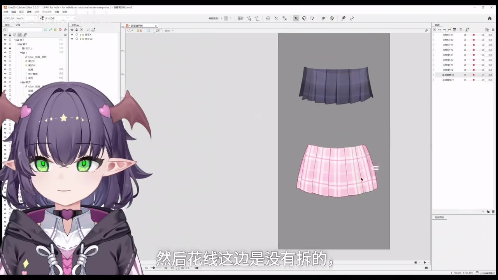
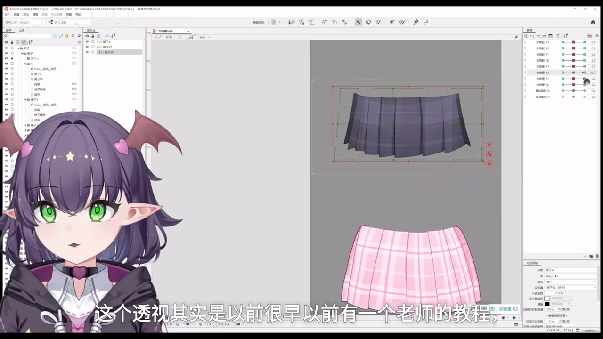

# 群友点名要的百褶裙物理

> 来源：[Bilibili 视频](https://www.bilibili.com/video/BV1dALR6XEeS) 
> UP 主：沐沐_Murhez｜合集：AIcode｜视频时长：05:24｜标签：Live2d  
> 数据抓取时视频统计：2309 播放、247 收藏、172 点赞、43 投币、9 条回复。此类互动数据会随时间变化。

## 小结

本视频是一份 Live2D 百褶裙物理制作经验教程。UP 主以两种素材拆分状态为例，说明百褶裙即使是“逐片拆分”和“整裙单图层”两种不同前提，均可先通过**整体变形器**确定飘动方向与基本形状，再以局部或分段变形补充层次。

教程最关键的方法不是堆叠更多物理段数，而是以现实布料的惯性逻辑为约束：层次感来自不同部件、不同变形幅度和不同摆动节奏之间的对比。UP 主认为，普通布料不应在受惯性带动后长时间持续摇晃；只有类似绸缎等材质，才可能呈现更明显、持续的动态感。

对于逐片拆开的裙摆，视频提出可在各片裙摆上增加更灵活的局部摆动，并用向上推动边缘、掀起边缘、打开褶皱等变形，增强翻动和褶皱展开的视觉效果。对于未拆分的整裙图层，则可直接用单个变形器将裙形捏至贴合，再做整体物理。

视频未给出物理模拟面板中各项数值、参数名或可复现的具体配置；在约 04:48 后，UP 主明确说明麦克风没有声音，后段改以截图展示。因此，本片适合已经会使用 Live2D Cubism 基础变形器、希望建立裙摆动态设计思路的制作者，而不应将其视为完整的参数配置教程。

教程中的“以前一位老师将透视融入物理的教程”被描述为约两三年前的内容，UP 主也不确定该教程当前是否仍可访问；其出处和现状均未在本视频中核实。视频本身没有新闻资讯或版本更新公告，技术信息应以录制画面所示的软件界面与作者个人经验为准。

## 思维导图

## 目录

- [背景、素材与适用范围](#背景素材与适用范围)
- [两种拆分前提与侧面补画](#两种拆分前提与侧面补画)
- [整体变形、透视与单图层制作](#整体变形透视与单图层制作)
- [物理层次：以对比替代堆叠段数](#物理层次以对比替代堆叠段数)
- [逐片裙摆的局部动态设计](#逐片裙摆的局部动态设计)
- [物理模拟设置与效果预览](#物理模拟设置与效果预览)
- [可执行步骤与参数缺口](#可执行步骤与参数缺口)
- [结论与限制](#结论与限制)
- [字幕比对](#字幕比对)
- [评论分析](#评论分析)
- [处理记录](#处理记录)

## 背景、素材与适用范围 [00:00](https://www.bilibili.com/video/BV1dALR6XEeS?t=0)

UP 主开场说明，此教程源于群友看过其短视频后提出的学习需求。她此前已发过相关内容，本次将制作更详细、带语音的版本；并预告原始录制中有较多需要后期剪掉的片段。

视频感谢两位提供素材的出镜者：**睡睡不睡觉**与**花心卡森**。后续示例分别展示了两种不同的百褶裙图层准备状态，因此本片的重点并非从绘制、切图开始，而是讨论已有裙摆素材进入 Live2D 后的变形与物理组织。

从画面可见，操作环境为 Live2D Cubism Editor 界面；但视频没有讲解软件安装、模型导入、网格生成或物理参数的基础操作。建议读者至少已具备以下前置能力：

1. 能在 Cubism 中选中美术对象并建立、编辑变形器。
2. 能理解“整体变形”和局部变形之间的父子或叠加关系。
3. 能在物理模拟相关界面中检查摆锤/输入输出效果。
4. 已完成裙摆基础切图，或接受以整张裙子图层制作较简化动态的方案。

> 图：画面同时展示深色与粉色两套百褶裙素材，以及 Cubism 编辑界面。它说明本教程以实际模型素材为对象，并非抽象示意图讲解。

## 两种拆分前提与侧面补画 [00:33](https://www.bilibili.com/video/BV1dALR6XEeS?t=33)

### 逐片拆分：以睡睡不睡觉的裙摆为例 [00:33](https://www.bilibili.com/video/BV1dALR6XEeS?t=33)

UP 主说明，睡睡不睡觉的百褶裙采用“**一片一片拆分**”的方式。逐片拆分意味着每一片裙摆具备独立操作空间，后续可分别加入更多局部摆动与不同形状的变化。

同时，该素材原本没有补画侧面的裙摆。UP 主的处理方式是自行使用**蒙版**捏出侧边部分，使画面出现可见侧面，从而提高立体感。这里的“捏”指在软件中借助变形调整蒙版或对应显示区域；视频没有公开蒙版层级关系、网格密度或具体控制点位置。

> 图：深色裙摆的褶片边界清晰可见，能直观说明“逐片拆分”并非只画出褶线，而是为后续各片独立变形预留结构。

### 侧面显示的价值 [00:43](https://www.bilibili.com/video/BV1dALR6XEeS?t=43)

补出侧面裙摆的目的，是让裙摆摆动时不只呈现平面轮廓，而能显示侧缘的空间朝向。UP 主直接评价，这种做法会“比较立体一点”。

这里应区分两件事：

- **视频明确陈述**：UP 主通过蒙版处理，做出可显示侧边的感觉。
- **实践上的含义**：侧缘区域为透视变化、边缘掀起和动态展开提供了视觉依据；但这属于对画面用途的整理，不代表视频给出了完整的侧面绘制规范。

## 整体变形、透视与单图层制作 [01:01](https://www.bilibili.com/video/BV1dALR6XEeS?t=61)

### 未拆分整裙也可制作 [01:01](https://www.bilibili.com/video/BV1dALR6XEeS?t=61)

花心卡森的裙子没有做逐片拆分，而是以正常方式通过变形器调整透视，这一部分即为教程所讨论的“物理”表现。UP 主给出的总思路是：

1. 先使用一个**整体变形**完成裙摆物理的飘动方向。
2. 再根据需要加入透视和局部变化。
3. 不论素材是否是单一完整图层，均可沿用这一思路。

这意味着“切得很细”并非百褶裙物理的必要前提。未拆分的整裙图层不能像逐片拆分那样分别赋予每片独立的精细摆动，但仍可以通过整体形变、轮廓变化与透视调整，建立可信的方向性运动。

> 图：画面将较小的深色裙摆和较完整的粉色裙摆并置，字幕同步说明花心卡森的素材没有拆分。这一对照有助于理解两种素材前提的差异。

### 透视融入物理 [01:23](https://www.bilibili.com/video/BV1dALR6XEeS?t=83)

UP 主提到，自己关于“透视融入物理”的理解来自一位老师较早以前的教程；其记忆中该内容约为两三年前，但她不确定教程是否仍存在。视频没有给出作者名称、链接或具体版本，故无法进一步追溯或验证。

视频中的可迁移原则是：当裙摆发生横向摆动、远近变化或边缘翻起时，不只移动整体位置，还可让裙形本身产生相应的透视变化。即使裙子为一整张图层，仍可以采用这种整体变形方式。

> 图：裙摆被置于变形控制框中，右侧可见参数/控制区域。该画面是“将透视变化放进裙摆物理”的直接操作场景，但未显示足以复现的具体数值。

### 单图层整体变形的具体顺序 [01:51](https://www.bilibili.com/video/BV1dALR6XEeS?t=111)

针对画面中的裙摆，UP 主描述了以下操作逻辑：

1. 直接使用一个整体变形器。
2. 先将变形器的形状捏成与裙子贴合的样子。
3. 再用这个整体变形器制作裙子的整体动态。
4. Y 方向的物理也沿用相同思路：先调整整体变形。

“贴合”在这里是指变形器的控制范围与裙摆轮廓、预期变形区域相适应。视频没有说明变形器的具体类型、层级关系、参数绑定方式，也没有展示 Y 方向的数值范围；因此可复现的是操作顺序，而不是固定参数。

## 物理层次：以对比替代堆叠段数 [02:14](https://www.bilibili.com/video/BV1dALR6XEeS?t=134)

UP 主在这一段明确强调，以下内容仅是其个人看法，供参考，不以教师或标准规范自居。

她的核心判断是：**物理的层次感通过对比出现。**如果一个物体的物理被一律拆成很多段，例如常见的两三段起步、四五段摆动，可能使其脱离现实逻辑。她以现实布料为参照，认为普通布料在惯性带动后通常不会长时间晃动；类似绸缎的材质则可能表现出不同的动态特征。

由此形成的设计原则是：

- 不要因为“能做更多段”就让所有部分都做很多段。
- 可以只给某些物理做一段，但让整体部件采用不同的层次组织。
- 先由整体变形控制统一的摆动方向。
- 再通过分段变形补充细节和层次。
- 某些局部的运动感可接近头发摆动的处理方式，但不能忽略布料材质和惯性差异。

该段没有给出“几段为正确答案”的硬性参数。视频中“两三段起步”“四五段”是 UP 主用来描述常见倾向的例子，不是推荐配置值。

## 逐片裙摆的局部动态设计 [03:47](https://www.bilibili.com/video/BV1dALR6XEeS?t=227)

当裙摆已经被拆成独立的片时，UP 主建议可在每一片上增加更多局部段数，以取得更丰富的层次；未拆分时则回到此前的整体变形方案。换言之，细分控制应建立在素材结构允许的基础上，而不是强行要求所有裙子重新拆分。

### 可加入的局部变化 [04:10](https://www.bilibili.com/video/BV1dALR6XEeS?t=250)

视频给出两类具体视觉目标：

1. **边缘上翘与掀起**：当某片裙摆的边缘需要向上翘时，将边缘向上推，使其产生被风或惯性掀起的效果。
2. **褶皱打开**：通过变形制作褶皱展开的变化，使裙摆不只是整体左右摆动，也呈现褶片之间的开合关系。

这两类变化适合用于局部细节，且应服从先前建立的整体摆动方向。若局部翘起方向和整体运动相互矛盾，或持续时间过长，便会违背 UP 主所强调的现实布料逻辑。

## 物理模拟设置与效果预览 [04:37](https://www.bilibili.com/video/BV1dALR6XEeS?t=277)

UP 主随后打开物理模拟设置，并称将展示自己的“摆锤”。但在约 04:48 时，她明确表示麦克风之后没有声音，因此后续会通过截图展示。

这一段可确认的信息仅包括：

- 视频确实进入了物理模拟设置相关界面。
- UP 主打算展示其摆锤设置。
- 后续展示没有可靠语音说明，内容理解需以截图和画面为辅助。
- 视频未在所提供字幕中记录摆锤的具体数值、输入输出参数、归一化范围、延迟、加速度或模型导出设置。

最终在约 05:13，UP 主提示观看效果。该效果展示是对前述制作思路的结果预览，而非新增参数教学。

## 可执行步骤与参数缺口 [01:51](https://www.bilibili.com/video/BV1dALR6XEeS?t=111)

以下步骤按视频实际讲述顺序整理；其中“建议检查”属于根据视频流程作出的操作整理，不是视频已展示的固定参数。

1. **确认素材拆分状态**
   - 若每片裙摆已经独立拆分，可为各片设计更灵活的局部动态。
   - 若裙子是单一完整图层，也可以继续，无需因未拆分而放弃制作。

2. **处理侧面可见区域（按素材需要）**
   - 对没有侧面裙摆的逐片素材，使用蒙版补出或塑造侧缘显示。
   - 目标是使裙摆在变形时能表现侧边，从而增加立体感。

3. **建立整体变形**
   - 使用整体变形器覆盖裙摆主要区域。
   - 先将其形状调整得贴合裙子轮廓。
   - 用整体变形确定主要飘动方向和整体姿态。

4. **加入透视变化**
   - 在整体摆动中调整裙形，使远近、开合或侧缘变化与运动方向一致。
   - 对整图层裙摆，可将透视变化直接融入整体变形。

5. **处理 Y 方向动态**
   - 先按照整体变形的方式建立 Y 方向变化。
   - 视频未公开 Y 方向的参数范围，不能据此填入固定数值。

6. **按需补充分段或逐片动态**
   - 在已拆分的裙摆片上添加局部摆动。
   - 可对边缘作向上推动，形成上翘和掀起。
   - 可通过局部形变模拟褶皱打开。

7. **进入物理模拟设置检查摆锤**
   - 视频展示了会进入该设置页，但没有保留可准确抄录的参数说明。
   - 应以模型实际播放效果、裙摆材质设定和整体运动节奏进行调节。

8. **预览并回调**
   - 检查局部褶片运动是否服务于整体方向。
   - 避免所有部件同频、同幅度、长时间摆动。
   - 普通布料应避免过度延迟或持续振荡；这是视频的经验性判断，不是软件强制规则。

### 视频未提供的关键参数

| 项目 | 视频是否提供 | 可确认情况 |
| --- | --- | --- |
| 物理摆锤数值 | 未提供 | 仅称会展示自己的摆锤，字幕没有记录具体数值。 |
| 输入/输出参数名称与范围 | 未提供 | 画面与字幕素材不足以可靠转录。 |
| 变形器网格密度 | 未提供 | 仅能确认使用整体变形器及局部变形思路。 |
| 逐片裙摆数量 | 未提供 | 画面可见多片褶片，但未给出标准数量。 |
| 物理段数推荐值 | 未提供固定值 | 作者反对无差别堆叠；“两三段”“四五段”仅为举例。 |
| 软件版本 | 画面可见但未作教程声明 | 界面标题可见 Live2D Cubism Editor 5.3.01；不应据此推定功能只适用于该版本。 |

## 结论与限制 [05:13](https://www.bilibili.com/video/BV1dALR6XEeS?t=313)

本片最具迁移性的经验是“**先整体、后局部；层次依靠对比，而非无差别增加摆动段数**”。无论裙摆是否切成独立褶片，都可先通过贴合裙形的整体变形器建立方向和透视；逐片拆分的额外价值，在于可以进一步塑造边缘翘起、褶皱打开等细节。

使用时需注意以下限制：

- 本教程主要是作者个人经验，UP 主已主动声明仅供参考。
- 具体物理模拟参数没有被完整公开，不能据此直接复刻同一套摆锤。
- 约 04:48 后麦克风无声，后段只能依赖截图和最终效果判断。
- 关于旧版“透视融入物理”教程的来源、作者与是否仍可访问，均未证实。
- 视频录制时所示软件界面、功能名称及操作方式可能随 Live2D Cubism 版本变化。
- 本片不是新闻或官方标准教程；其时效性主要受软件版本与外部旧教程可访问状态影响。

## 字幕比对

| 字幕来源 | 完整性 | 专有名词 | 时间轴 | 主要问题 |
| --- | --- | --- | --- | --- |
| Bilibili 站内字幕 | 较完整，覆盖开场至最终效果提示 | 相对更可靠，正确出现“百褶裙”“蒙版”“变形器”等 | 细至约 1—3 秒的分段，可直接引用 | 个别名称仍有口语转写问题；“HOI 模拟设置”无法从现有素材确认准确含义。 |
| 本次 ASR 字幕 | 覆盖约 259.09 秒语音，占总时长约 80.13% | 误识别较多，如“百折拳”“瓜條”“盲板”“头饰”；人名也有缺失 | 有时间戳，但多数分段较长；与站内字幕存在秒级差异 | 04:52—05:13 存在约 20.44 秒大间隔；未准确保留部分人名与术语。 |

最终正文以**站内时间轴字幕**为主要文本与时间依据，并逐段检查本次 ASR 结果。站内字幕的分段更细，且对“百褶裙、蒙版、变形器、透视”等关键术语识别明显优于 ASR；本次 ASR 则用于验证有声内容覆盖范围和确认后段无语音的时间缺口。

本次 ASR 诊断中**未标记 `noAudioStream=true`**，且检测到约 259.09 秒语音，说明源视频存在音轨；04:48 后的无声是 UP 主在视频中说明的麦克风失声情况，而非工具失败或源视频无音轨。术语校正主要依据站内字幕、上下文与关键帧画面：

- ASR“百折拳”校正为“百褶裙”；
- ASR“盲板”校正为“蒙版”；
- ASR“头饰”校正为“透视”；
- ASR“花心”与站内字幕“花线”均未能与元数据交叉核验，正文采用开场中明确出现的“花心卡森”；
- 站内字幕“HOI 模拟设置”与 ASR“物理模拟设置”不一致，正文保守表述为“物理模拟设置相关界面”，不将其扩展为未经证实的功能名。

## 评论分析

以下仅分析本次可获取的热评前三条。评论反映的是用户反馈，不构成对教程效果或技术结论的验证。

1. **烂番茄倒腾臭鸡蛋（0 赞）**
   - 评论称赞 UP 主认真讲解，尤其提到“侧边裙摆用蒙版捏出来”的立体感，并认为内容细心、宠粉。
   - 该评论尾部明确标注“该评论由 AI 生成”，因此其情感反馈可以记录，但不宜将其当作普通用户的独立实操验证，也没有新增可核实的技术参数。

2. **问号菌子（1 赞）**
   - “如此宠粉的主包”表达了对 UP 主响应群友需求、补充详细教程的认可。
   - 该评论对应视频开场所述的创作动机，但未对百褶裙物理方法提出技术补充或争议。

3. **猫猫头骑士_（0 赞）**
   - 评论表示自己“来晚了”，反映出对视频或群友话题的关注。
   - 未提供制作经验、参数、错误报告或可验证的效果反馈。

整体而言，前三条评论以支持和互动为主，没有出现关于操作失效、参数争议、软件兼容性或素材版权的实质性讨论。

## 处理记录

- Worker ID：worker-mrj0wbly-5dc4e50c
- 模型：gpt-5.6-terra
- 调用工具与素材：视频元数据、站内 SRT 字幕 `p01-ai-zh.srt`、本次 ASR 结果 `asr/asr-result.json` 与 `asr/transcript.srt`、关键帧目录 `frames/`、热评数据 `comments/comments.json`。
- 字幕选择：以站内字幕为主，逐项比对本次 ASR。时间轴链接优先使用站内 SRT 的实际起止时间换算秒数；ASR 用于检查音轨、覆盖率、间隔与误识别。
- 关键帧选择依据：选用 `frame-001.jpg` 至 `frame-004.jpg`，分别用于展示双素材起点、逐片拆分裙摆、未拆分与拆分素材对照、变形器中的透视/整体变形操作；均直接服务于正文所述的素材结构与操作逻辑。
- 缓存清理：未执行缓存清理；本任务仅基于已提供的素材清单、字幕、关键帧与评论数据生成文档，未提供可验证的清理日志。
- 未解决问题：物理模拟摆锤的具体参数未出现在可用字幕文本中；04:48 后麦克风无声；“透视融入物理”的旧教程出处和可访问性未知；站内字幕中的“HOI 模拟设置”术语无法仅凭现有材料确定。
