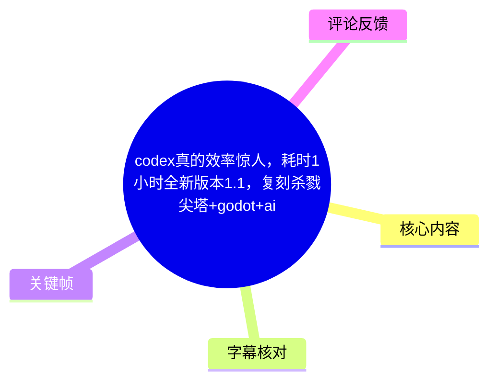
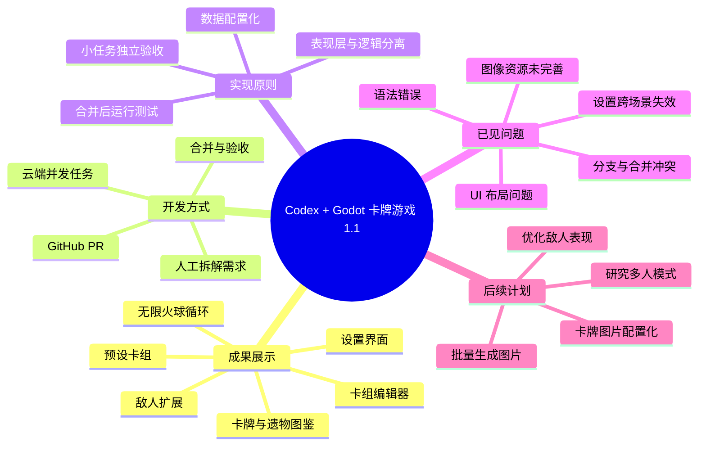
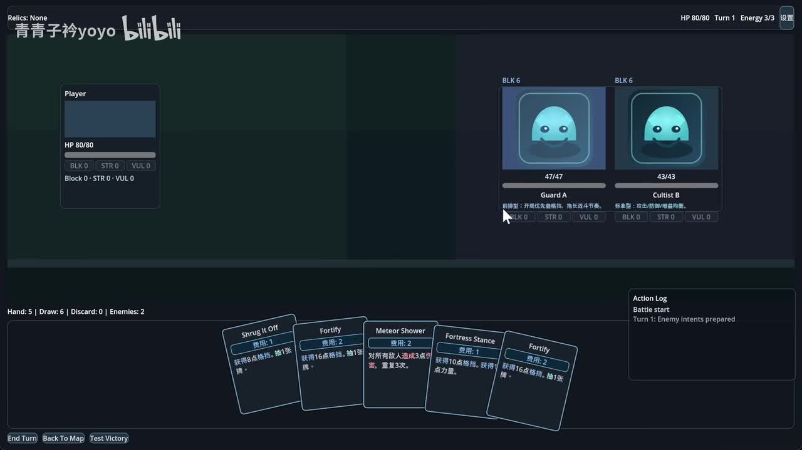

# codex真的效率惊人，耗时1小时全新版本1.1，复刻杀戮尖塔+godot+ai

> 来源：[Bilibili 视频](https://www.bilibili.com/video/BV1BawozyEpD)  
> UP 主：青青子衿yoyo｜合集：AIcode｜总时长：45:20（含 3 个分 P）  
> 项目地址：<https://github.com/frankqwang/slay-the-hs>  
> 说明：视频第 1 P 是约 127 秒的版本 1.1 成果展示；第 3 P 是约 42 分 49 秒的直播过程录像。本文以第 1 P 的本次 ASR 时间轴为主，并用第 3 P 的站内字幕补充完整开发过程。

## 小结

这是一段以“AI 协作开发卡牌游戏”为主题的成果展示与直播录像。UP 主以一个仿《杀戮尖塔》战斗框架为基础，让 Codex 在云端并发处理多个需求，并通过 GitHub Pull Request（PR）合并代码；游戏引擎标签为 Godot。视频所称的“仅一小时”，指在既有 1.0 基础上，围绕版本 1.1 增加功能和改进体验的直播开发时段，并非从零完成一款完整商业游戏。

第 1 P 展示的 1.1 新增内容包括：多套预设卡组与流派、类似“无限火球”的循环机制、卡组编辑器、卡牌图鉴、遗物图鉴、设置界面，以及敌人机制和表现层的补充。UP 主强调，AI 的突出价值不只是生成单个函数，而是能够将多个相对独立的任务放到云端并行完成，再由人进行验收、合并与返工。

直播过程显示，实际工作方式并不是“一句话后完全不用管”。UP 主持续承担产品拆分、需求描述、效果验收、逻辑测试、PR 合并、冲突处理、报错修复与优先级决策。AI 能较快完成界面、数据配置和局部玩法，但也出现了遗漏括号、分支已存在、功能未正确绑定、UI 布局溢出、不同场景设置不生效、卡牌图鉴打不开、图片未接入等问题。

视频中可复用的经验是：将需求拆成“可独立验收的小任务”；明确区分表现层与实现逻辑；让 AI 输出可配置的数据，而不是把数值硬编码；每次合并后都做运行时验证；并行任务必须预留 Git 冲突处理与集成测试时间。视频自身也证明，迭代效率的瓶颈会从“写代码”转移到“定义需求、验收质量和整合分支”。

时效性方面，视频涉及 Codex、OpenAI 云端容器、PR 工作流、OpenClaw／“龙虾”、图像生成服务等工具或服务体验。这些产品的模型、套餐、额度、联网权限、接口能力和实际稳定性均可能变化。视频展示的是作者当时的个人项目实践，不应视为对任何工具能力、价格或适用范围的长期保证。

## 思维导图

## 目录

- [视频结构、范围与时效性](#视频结构范围与时效性)
- [1.1 成果概览：卡组、流派与设置](#11-成果概览卡组流派与设置)
- [关键帧：当前战斗界面](#关键帧当前战斗界面)
- [直播开发流程：从需求描述到并发任务](#直播开发流程从需求描述到并发任务)
- [玩法与数据设计：卡牌、敌人、遗物](#玩法与数据设计卡牌敌人遗物)
- [设置、性能与图像资源工作流](#设置性能与图像资源工作流)
- [Git、PR 与并发协作的限制](#gitpr-与并发协作的限制)
- [可复用步骤与实践清单](#可复用步骤与实践清单)
- [结论与限制](#结论与限制)
- [字幕比对](#字幕比对)
- [评论分析](#评论分析)
- [处理记录](#处理记录)

## [视频结构、范围与时效性](https://www.bilibili.com/video/BV1BawozyEpD?t=0)

本视频共有 3 个分 P：

| 分 P | 标题 | 时长 | 本文使用方式 |
| --- | --- | ---: | --- |
| P1 | 全新版本1.1，codex仅用时一小时，+godot+ai | 127 秒 | 本次 ASR 有完整时间轴；用于成果概览与展示功能整理。 |
| P2 | 老版本1.0 solid base | 24 秒 | 说明 1.1 建立在已有基础之上；未提供该分 P 字幕细节。 |
| P3 | 3月18日直播全程录像 | 2569 秒 | 有站内中文 SRT；用于还原开发、验收、报错和合并过程。 |

“耗时 1 小时”应谨慎理解。视频中 UP 主既说“从十几点到大概一点左右”，也在结尾反复强调“一个小时”。更可靠的表述是：**作者将这次 1.1 功能扩充称为约一小时的直播开发成果，但项目已有 1.0 基础，且直播中还包含沟通、试玩、等待任务、处理冲突与讨论时间。**

元数据描述列出的 1.1 方向为：

1. 丰富卡牌流派与卡组编辑器，方便测试；
2. 卡牌编辑器；
3. 卡牌、遗物浏览器；
4. 设置界面。

## [1.1 成果概览：卡组、流派与设置](https://www.bilibili.com/video/BV1BawozyEpD?t=12)

第 1 P 的 ASR 从约 00:12 开始概述 1.1 的主要功能。虽然 ASR 对专有名词与部分汉字识别不稳定，但可与后续站内直播字幕相互印证。

### 预设卡组与流派

作者展示了“卡组预设”以及不同逻辑方向的卡组。重点例子是“无限火球”式循环：通过低费卡、回能、抽牌和伤害效果构造连续行动。第 1 P 中的口述可归纳为：

- 有多种卡组／预设卡组；
- 有不同玩法逻辑；
- “无限火球”是实际测试的代表性流派；
- 循环核心涉及手牌循环、获得能量、低费增益与抽牌。

直播中，作者曾要求 AI 围绕“多套路、能量循环”扩展卡牌，举例包括无限手牌循环、无限火球等；后续验收时提到 AI 一次性扩展了 **12 张卡牌**，并同步更新测试与卡牌构筑逻辑。该“12 张”是直播口述中的具体数量，不等同于整个项目所有卡牌数量。

### 设置与性能控制

第 1 P 提到新增设置界面，内容包括：

- 分辨率；
- 最大帧率／帧率限制；
- 垂直同步；
- 帧率显示；
- 音频／音量；
- 图鉴及筛选相关入口。

直播验收中，UP 主进一步测试了 30、60、240 等帧率限制效果，并指出初版问题：帧率显示一度只在设置或主界面出现，进入战斗后消失；后续确认在战斗左上角可显示帧率，并能看到 60、240 等读数。这里的数值是作者在其设备上看到的运行情况，不能推导为所有设备都能达到相同帧率。

### 卡组编辑器、图鉴与 JSON

约 01:04 起，ASR 明确提到卡组编辑器会“自动帮你生成这个 JSON”。结合直播内容，可确认设计方向是：

- 在编辑器中增删卡牌；
- 载入预设卡组；
- 将当前编辑结果设为起始卡组；
- 保存并回填至项目数据；
- 将卡牌或图像资源逐步做成配置化数据。

这类设计的价值在于将“数值、卡牌定义和资源引用”从代码逻辑中抽离，使测试、扩展流派和后续替换资源更可控。

## [关键帧：当前战斗界面](https://www.bilibili.com/video/BV1BawozyEpD?t=97)

> 图：这是素材提供的唯一关键帧。画面展示了当前可运行的战斗界面：左侧是玩家 HP、格挡／力量／易伤等状态；右侧有两名敌人、生命值和意图说明；底部有手牌、回合结束、返回地图和“Test Victory”按钮；右下角为行动日志。它的价值在于直观证明本项目已经不仅是文本原型，而是具备基本战斗 UI、状态显示、敌人意图与回合操作的可运行界面。  
>
> 注意：关键帧文件未附带独立提取时间戳，因此不能将其精确断言为 P1 的 01:37；本节时间链接依据 P1 ASR 在约 01:37 开始提到地图后敌人与战斗增强的真实时间段。

从画面还能观察到几个与直播描述一致的事实：

- 界面已经拥有玩家状态、敌人状态、手牌区与行动日志等《杀戮尖塔》式基本布局；
- 敌人头像在该阶段仍较简化，和作者后续“敌人表现层缺少图、图标相同、辨识度不足”的评价相符；
- 部分卡牌文本、敌人名称和日志为英文或混合语言，和直播中多次要求汉化、优化表现层的过程一致；
- 战斗界面包含显式测试入口，契合作者将预设卡组和玩法构筑用于快速验收的做法。

## [直播开发流程：从需求描述到并发任务](https://www.bilibili.com/video/BV1BawozyEpD?t=12)

第 3 P 从开头即展示作者如何把自然语言需求交给 AI。最早的例子是卡牌展示：作者认为逻辑已经可用，但卡牌在某处只是平铺文本，希望复用战斗中卡牌的视觉样式，同时明确要求：

> 表现层与实现分开；此处只做展示，复用卡牌展示效果，不要把另一处逻辑整体复制过来。

这是视频中最清晰的工程原则之一：**UI 复用不应无差别复制业务逻辑。** 随后 AI 通过修改布局与复用组件完成了视觉改造，作者观察到效果基本达成，但发现悬浮时卡牌抖动，又立即创建一个专门的修复任务。

### 并发工作模式

作者在等待一个任务完成期间继续派发其他任务，例如：

- 扩展卡牌流派；
- 增加敌人与敌人技能差异；
- 增加设置界面；
- 制作遗物图鉴；
- 补充卡组选择与编辑；
- 修复卡牌悬浮效果；
- 提升敌人表现层和说明；
- 增加帧率设置及显示；
- 修复主菜单至卡牌图鉴的跳转。

这使作者形成“后台改代码，前台试玩；完成后回去验收”的工作节奏。其效率前提并非 AI 自动理解所有项目状态，而是任务之间尽量独立、需求足够具体，并且作者愿意负责合并和测试。

### 从“只看结果”到重新验收

作者一度表示只看结果、不看过程，甚至想直接合并较简单的改动；但后续出现报错、冲突、图鉴打不开、设置跨场景不生效等情况，说明这种策略存在明显风险。视频最终形成的实际模式仍是：

1. AI 提交修改；
2. 作者查看变更或 PR；
3. 本地运行；
4. 按功能逐项验证；
5. 发现问题后再次描述修复需求；
6. 合并或手动解决冲突；
7. 再运行验证。

因此，视频展示的不是“无需工程管理”，而是**把工程管理的重点迁移到需求与验收**。

## [玩法与数据设计：卡牌、敌人、遗物](https://www.bilibili.com/video/BV1BawozyEpD?t=79)

### 卡牌流派与“无限火球”验证

作者先要求 AI 增加更多套路，并提出“无限手牌”“无限火球”等方向。初次扩展后，作者发现虽然 AI 声称加入了相关卡牌，但战斗中无法抽到，定位到问题是缺少卡组功能或测试入口没有指定卡组。

随后作者将需求改为：

- 预设多套卡组；
- 进入战斗测试时可直接选择卡组；
- 使新增的流派卡可在测试时被实际抽到。

后续直播显示 AI 增加了 **14 套可玩预设卡组**。作者选择“无限火球”测试，逐项检查卡牌描述与实战效果，包括：

- 对所有敌人造成多次伤害；
- 获得力量；
- 获得能量；
- 抽牌；
- 通过手牌与能量循环继续行动。

作者起初怀疑伤害不一致，后发现力量增益会影响后续伤害，因而部分看似“数值不对”的结果实际上符合叠加后的逻辑。这一段展示了验收时的关键原则：**不能只看卡面文案，也要在运行中追踪状态变化、能量上限、力量修正和多段效果。**

### 敌人：先有逻辑，再补表现与可读性

作者对敌人提出的要求包括：

- 增加多个敌人；
- 让敌人具有不同技能和组合方式；
- 增加敌人池与编队层次；
- 让敌人差异在表现层可见；
- 悬浮敌人时显示说明或特性。

AI 曾一次增加 4 个敌人，但过程中出现“分支已存在”类错误以及语法问题，后续修复时作者发现“少写了一个括号”。此后敌人能运行，但作者仍指出：

- 敌人逻辑可能已不同；
- 画面上图标相同、缺少图片；
- 玩家难以直观看出敌人能力；
- 需要敌人介绍、悬浮提示和差异化表现。

后续验收中，作者确认某些敌人已具备前排／辅助等定位、紫色效果或背景、力量增益等机制；但这仍是一个未完成的表现层优化方向。结尾试玩时，敌人增多导致 UI 变宽或布局有问题，作者将其列为后续小优化。

### 遗物图鉴

遗物图鉴的需求来自《杀戮尖塔》式百科页面参考图。作者要求：

- 按参考形式制作遗物图鉴；
- 如果现有遗物太少，则做成配置化数据；
- 增加更多遗物组；
- 让遗物支持流派设计。

最终作者认为遗物图鉴“没毛病”，但仍提出未来可以优化为默认仅显示图标、悬浮后展示详细信息。该评价说明功能入口和基本展示已完成，但交互密度和视觉方案尚未最终定型。

## [设置、性能与图像资源工作流](https://www.bilibili.com/video/BV1BawozyEpD?t=38)

### 设置界面迭代

设置最初被定义为简单版本：分辨率与音量。后续作者扩展为：

- 分辨率选择；
- 尝试支持 2K、4K 或读取本机支持的全部分辨率；
- 最大帧率；
- 垂直同步；
- 帧率计数器；
- 战斗页右上角的设置入口；
- 设置对所有场景生效。

作者明确否定了“只给少数固定分辨率档位”的初版实现，要求直接识别本机支持的分辨率并展示。验收时，他也发现设置项不能只在一个页面生效，例如帧率显示不能在设置页显示、进入战斗就丢失。

最终的确认结果是：

- 战斗中存在右上角设置按钮；
- 可设置帧率并显示当前帧率；
- 功能基本可用；
- 仍应注意不同场景的全局应用；
- 不应把作者机器上的 240 FPS 读数解释为普适性能结论。

### 图像生成尚未打通

视频里图像资源是最明确的未完成部分。作者尝试通过不同图像服务生成卡牌和敌人图片，并讨论：

- 卡牌图应采用竖向比例；
- 尝试 `3:4`；
- 初步选择 `1K` 输出；
- 希望批量生成约 10 张卡牌图片；
- 希望由自动化工具批量调用图像服务；
- 希望后续把卡牌图片引用写入 JSON，实现“替换配置即可换图”。

但当时的实际问题包括：

- 服务界面或地区语言设置不便；
- 无法直接调用或批量调用图像生成；
- 生成图片质量不理想；
- 积分会消耗；
- 图像没有完整接入游戏；
- 敌人仍使用相同或简化图标。

作者最终将“批量生成图片—把图片配置化—通过 JSON 替换资源”的流程留作后续任务。因此，视频不能证明完整美术资产管线已经完成。

## [Git、PR 与并发协作的限制](https://www.bilibili.com/video/BV1BawozyEpD?t=117)

直播后段，作者解释了其理解中的 Codex 云端工作机制：

1. 用户提交任务；
2. 任务不在本机运行，而是在远端环境／容器中执行；
3. 环境配置完成后，可能关闭互联网访问；
4. AI 修改代码并创建 PR；
5. 代码推送到 GitHub；
6. 作者审阅后决定是否合并到 `master`。

这是作者对工具运行方式的口述说明，应作为其个人使用体验记录，而非平台官方技术文档。

### 真实出现的协作问题

并发任务越多，集成问题越明显。视频中至少出现了以下类型：

| 问题类型 | 视频中表现 | 对应经验 |
| --- | --- | --- |
| 语法错误 | 少写括号导致错误 | 低级语法错误也必须由测试拦截。 |
| 分支问题 | 出现“分支已存在”类错误 | 并发任务应统一分支命名和生命周期管理。 |
| 合并冲突 | 多个任务修改主菜单或相同文件时冲突 | UI 入口、路由、主场景文件是高冲突区域。 |
| 任务环境不同步 | 作者称因关闭网络，AI 看不到最新代码 | 派发任务前要确保远端可获取正确基线。 |
| 功能未接通 | 卡牌图鉴按钮点击无反应 | 合并成功不等于事件绑定与路由正确。 |
| UI 回归 | 按钮漏出、敌人多时界面变形 | 合并后要进行多分辨率与极端数据测试。 |
| 测试不足 | 作者曾表示简单任务不想验证 | “小改动”累积后仍可能造成系统性回归。 |

作者还明确表示，GitHub 的冲突图对他而言不够直观，某些冲突仍需在本地处理。AI 可以协助解冲突，但不能替代对最终代码状态的确认。

## [可复用步骤与实践清单](https://www.bilibili.com/video/BV1BawozyEpD?t=108)

以下是依据视频实际操作整理出的适用流程，不添加视频未展示的命令或实现细节。

### 1. 先从可运行的最小基线开始

视频中的 1.0 已具备基础战斗与界面，因此 1.1 可以专注于功能扩展。对类似项目，应先确保：

- 能启动；
- 能进入战斗；
- 基础卡牌与敌人逻辑可运行；
- 有最小可验证的 UI。

不要把“从零到可玩”与“基于原型扩展”混为一谈。

### 2. 将需求切成可验收模块

视频中相对适合并发的模块包括：

- 卡牌流派扩展；
- 遗物图鉴；
- 设置页面；
- 敌人池扩展；
- 卡组编辑器；
- 单一 UI 抖动修复；
- 单一按钮事件修复。

每项任务都应有明确验收标准，例如：

- “进入战斗测试时可选择预设卡组”；
- “悬浮整个卡牌区域都高亮，不发生缩放抖动”；
- “帧率显示在战斗页面左上角仍可见”；
- “敌人悬浮后可显示能力说明”。

### 3. 明确架构边界

视频中最有价值的提示词约束是：

- 复用卡牌外观；
- 不复制原业务逻辑；
- 保持表现层和实现层分离。

同样，卡牌、遗物、图像资源应尽量配置化。作者后续计划以 JSON 管理图片与卡牌数据，正是为了减少“每加一张卡就改核心代码”的耦合。

### 4. 并发前控制修改范围

并发提升速度，也会提升冲突概率。实践上应避免让多个任务同时修改：

- 主菜单；
- 场景路由；
- 同一份卡牌配置；
- 同一核心战斗循环；
- 同一 UI 容器结构。

视频中多个功能都要在主菜单添加按钮，最终确实出现冲突和入口失效，说明主界面是高风险共享区域。

### 5. 用“运行结果”验收逻辑

作者对无限火球的验收方式具有参考意义：

1. 选中预设卡组；
2. 进入实际战斗；
3. 查看卡牌描述；
4. 打出卡牌；
5. 观察伤害、抽牌、能量、力量等状态变化；
6. 判断多段效果是否受增益影响；
7. 对异常结果再创建修复任务。

仅阅读 AI 的变更摘要，无法替代运行时验证。

### 6. 保留未完成事项，而不是强行收尾

视频结束时作者明确留下了后续事项：

- 批量生成卡牌、敌人图片；
- 接通图像生成工作流；
- 将图片引用配置化；
- 优化卡牌图鉴；
- 修复敌人数量增加后的 UI；
- 优化背景图；
- 研究多人模式与多开测试；
- 继续理解 AI 编码工具的边界。

这比将半成品描述为“完整成品”更符合实际工程状态。

## [结论与限制](https://www.bilibili.com/video/BV1BawozyEpD?t=120)

视频最重要的结论不是“AI 一小时完成了完整游戏”，而是：在已有 Godot 卡牌原型、明确功能拆分、云端并发任务、Git PR 流程和人工持续验收的条件下，AI 能非常快地为小型项目增加可演示的功能模块。

适合从中借鉴的人群包括：

- 已有可运行原型、希望快速验证玩法的独立开发者；
- 想了解 AI 编程代理与 Git 协作方式的开发者；
- 希望通过卡组、图鉴、设置、敌人等离散模块练习 AI 协作开发的人；
- 愿意承担测试、验收、代码整合工作的产品／技术负责人。

不应忽略的限制包括：

1. **项目不是从零开始。** 1.0 已经存在，1.1 是在既有战斗框架上扩展。
2. **AI 输出并不稳定。** 视频中有语法错误、错误分支、UI 问题、功能绑定失效、资源未接入等例子。
3. **并发带来集成成本。** 多任务同时修改主菜单、场景或共享数据，会产生冲突和回归。
4. **美术与资源流程未完成。** 卡牌和敌人的图像生成、批量生产、资源接入仍是后续计划。
5. **多人模式尚未实现和验证。** 作者只是讨论其实现可能性与后续测试思路。
6. **代码质量未被系统性证明。** 作者在直播中甚至将部分单测视为可暂缓事项；视频未提供完整测试覆盖、架构文档或长期维护数据。
7. **工具能力具有时效性。** 模型版本、服务额度、远端网络策略、图像接口和价格均可能变化。

## [字幕比对](https://www.bilibili.com/video/BV1BawozyEpD?t=0)

本次素材同时提供了第 3 P 的 Bilibili 站内字幕与第 1 P 的 ASR 结果。两者覆盖的分 P 不同，不能简单视为同一段内容的逐字竞争关系。

| 字幕来源 | 覆盖内容 | 完整性 | 专有名词与术语 | 时间轴 | 主要问题 |
| --- | --- | --- | --- | --- | --- |
| Bilibili 站内字幕 `p03-ai-zh.srt` | P3 直播录像，约 42:47 | 高，覆盖了需求、验收、报错、合并和收尾讨论 | 整体较好，但仍有口语、省略、英文名与识别混杂，如 CodeX、OpenClaw、JSON、PR、GitHub 等 | 高，提供真实 `HH:MM:SS,mmm --> HH:MM:SS,mmm` 分段 | 直播口语密集，部分英文词、模型名和工具名转写不稳定；部分句子缺失上下文。 |
| 本次 ASR `medium` | P1 成果展示，126.71 秒 | 高，诊断显示语音覆盖约 74.71%，无大间隔 | 较弱，如“无限火球”“JSON”“帧率”“图鉴”等出现误识别或近音字 | 高，28 个带时间戳分段 | 将“无限火球”识为“无线／无纤／无纷火球”，将 JSON 识为“Jason”，对“帧率、分辨率、图鉴”等存在错字。 |

### 最终字幕选择

- **P1 成果展示：**采用本次 ASR 的真实时间轴作为章节定位依据，并依据上下文校正明显术语错误。  
- **P3 直播过程：**采用站内 `p03-ai-zh.srt` 的真实时间轴作为过程描述依据。  
- **未发现 `noAudioStream=true` 标记。** 本次 ASR 实际识别到中文语音，诊断显示语言为 `zh`、置信度约 `0.9937`、音频时长约 `126.71` 秒，因此不能将字幕差异归因于“源视频没有音轨”。

### 重要校正

| 原始识别形式 | 本文采用 | 校正依据 |
| --- | --- | --- |
| 无线火球／无纤火球／无纷火球 | 无限火球 | P3 站内字幕多次明确提到“无限火球”，且上下文是卡牌循环流派。 |
| Jason | JSON | P1 上下文为编辑器自动生成并保存配置；P3 也提到 JSON 菜单与配置化。 |
| 显示真率 | 显示帧率 | P3 明确讨论最大帧率、垂直同步与帧率计数器。 |
| 分较率 | 分辨率 | P3 多次讨论分辨率档位、2K、4K 与识别屏幕支持分辨率。 |
| 遗误图件 | 遗物图鉴 | 与视频元数据描述“卡牌、遗物浏览器”及 P3 内容相互印证。 |

## [评论分析](https://www.bilibili.com/video/BV1BawozyEpD?t=0)

仅分析当前可获取热评前三条；评论代表用户观点，不构成已经验证的技术事实。

### 1. fiofio1（285 赞）

评论认为：AI 很适合快速做 Demo，能根据一句话搭出可调整的原型；但正式项目必须重新进行人为架构设计与管线设计，否则随着代码、文档、资源增长，项目会变得难以控制。

这一观点与视频高度相关。直播中已经出现分支冲突、图鉴按钮失效、设置跨场景失效、资源未接入等问题，说明“生成模块”与“维护系统”是不同难度层级。不过，评论中关于“最多 M 级上下文水平也就几万行代码”的表述是概括性判断，视频本身没有提供模型上下文上限或项目真实代码规模，不能当作本视频证实的参数。

### 2. 夏文纯一（62 赞）

评论提醒：AI 容易让初学者产生“使用 AI 就无所不能”的错觉；更理想的关系是 AI 提供思路、知识预览与灵感，人类负责学习、掌握和评判，模板型代码可交由 AI 生成。

该观点能解释视频中作者的角色：作者并非只输入一句需求，而是在观察效果、检查数值、发现括号错误、判断冲突、要求表现层分离、修改优先级。也就是说，视频里的高效率依赖人的产品判断和基本工程理解。评论的价值在于补足了视频中较少展开的“使用者能力边界”。

### 3. 凤飨（11 赞）

评论认为：AI 首次生成的 Demo 往往很惊艳，但持续迭代可能导致 Bug 增多、代码质量下降；AI 更适合作为开发辅助，而不适合让完全不懂代码的人独立完成有规模的完整游戏。

视频能部分支持其风险提示：后续迭代确实出现了 Bug、冲突、未完成美术资源和 UI 回归。但“纯 AI 制作完整游戏不可能”属于评论者的强判断，视频不足以证明或反驳。更稳妥的结论是：本视频展示了 AI 对原型和小功能迭代的高效率，同时也展示了规模化维护、集成和质量控制仍需要人负责。

## [处理记录](https://www.bilibili.com/video/BV1BawozyEpD?t=0)

- Worker ID：`worker-mrj0wjed-b0c290ad`
- 模型：`gpt-5.6-terra`
- ASR 模型与配置：`medium`，CUDA，`float16`，自动识别语言为中文；识别音频时长 `126.7113125` 秒。
- 使用素材与工具结果：
  - 视频元数据与分 P 信息；
  - P1 本次 ASR 结果、SRT 与覆盖诊断；
  - P3 Bilibili 站内字幕 `p03-ai-zh.srt`；
  - 热评前三条；
  - 关键帧 `frames/frame-001.jpg`；
  - 项目描述中提供的 GitHub 地址。
- 字幕选择：
  - P1 使用本次 ASR 的真实时间轴；
  - P3 使用站内 SRT 的真实时间轴；
  - 对“无限火球、JSON、帧率、分辨率、遗物图鉴”等 ASR 明显误识别内容，依据站内字幕与上下文做了最小必要校正；
  - 未检测到 `noAudioStream=true`，且 ASR 已确认存在中文语音。
- 关键帧选择依据：
  - 素材仅提供 `frame-001.jpg`；
  - 画面直接展示可运行的卡牌战斗 UI、玩家状态、敌人意图、手牌和行动日志；
  - 该帧适合支撑“已有可运行战斗原型、但敌人美术与表现层仍待增强”的正文结论；
  - 关键帧没有独立提取时间戳，正文未虚构其精确出现时间。
- 缓存清理：
  - 素材未提供缓存清理执行日志；无法确认是否已执行清理，故不编造清理结果。
- 未解决问题：
  - P2 未提供可用字幕细节；
  - P1 ASR 与 P3 站内字幕对应不同分 P，不能作逐句一致性比较；
  - 图像批量生成与资源配置化流程在视频中仅有计划和尝试，尚未完成；
  - 多人模式仅讨论了可行性，未见实现与测试证据；
  - 项目长期代码质量、测试覆盖率、完整架构与最终可发布状态均未由视频证明。

## 评论分析

- 热评 1：目前ai就是做demo容易，但是落地困难。做demo给一句话描述基本就能搭个差不多的东西，还能随时调整。但是做正式版本还是得重新人为设计好架构和管线，否则项目几乎不可控（以现在最多m级上下文水平也就几万行代码，更别说还涉及各类文档、文本、资源素材）
- 热评 2：现在ai很多让人感到百花齐放，甚至很多小白都开始用ai制作东西了，诚然，或许能做出简单的示例，但是ai的不确定性因素还是太多了，能试着回想一下吗，自己学技术的时，当自己掌握了一个技术点的时候的那种喜悦，自己能够掌握制作工具的那种喜悦，ai好像给人一种错觉，就是好像用了ai人就会无所不能，但是别忘了，看似无所不能的是ai，而不是人（对小白和一些想要让ai生成自己不懂的领域的人说的）；我认为人与ai智能工具的最佳相处方式，应当是ai提供思路和知识预览或灵感，人类对其学习和掌握或评判，实质创造活动仍然由人类来做（当然，一些样板类代码可以生成）。
- 热评 3：有句话很适合现阶段的ai: “出道既巅峰”，ai刚做出来的demo是很好很不错，但是越迭代就会变得越烂，bug一堆，代码屎山，对于完全不懂代码的人来说第一个demo是很NB很厉害，但你再像继续完善你就会发现ai变得越来越笨，做出来的东西越来越差，现阶段的ai做小游戏还好，想纯ai制作出一个完整的有点体量的游戏是不可能的，更适合的是作为开发者的辅助工具，不会代码的人玩玩就好了

以上内容是观众反馈摘录，只用于补充理解视频反响，不作为正文事实依据。
