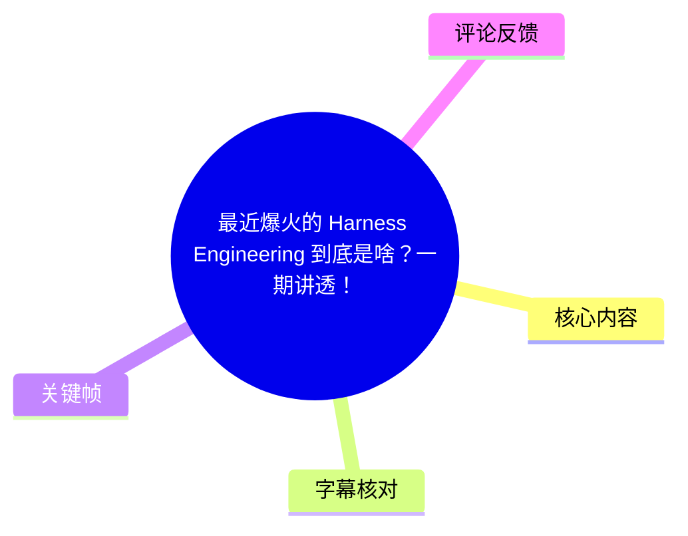
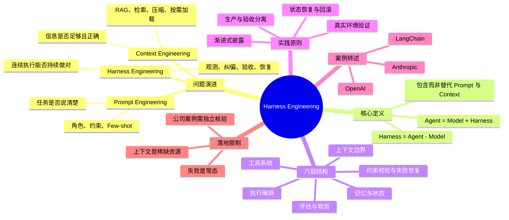
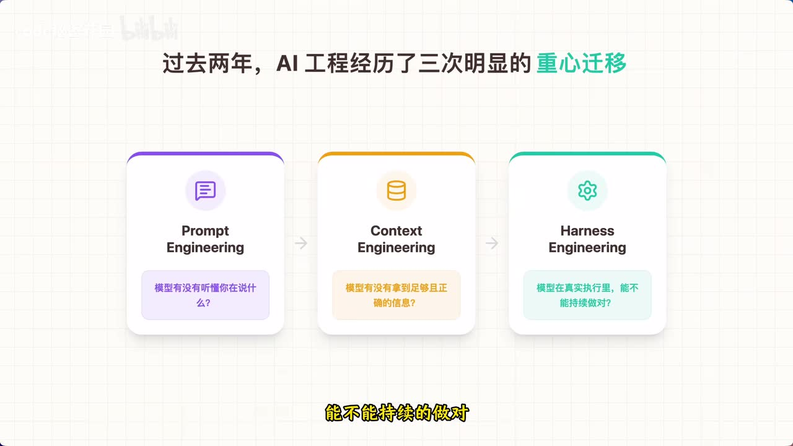
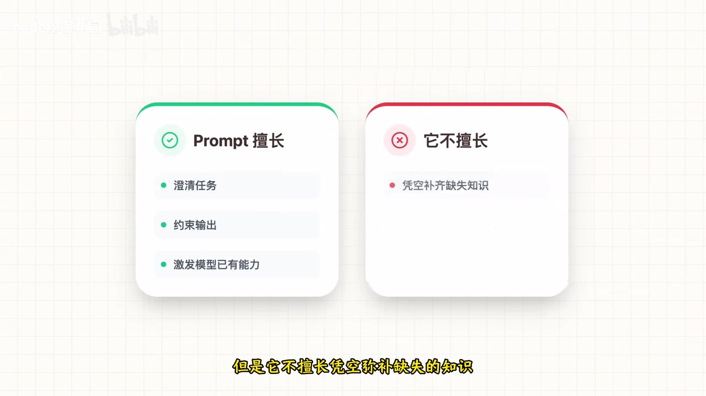
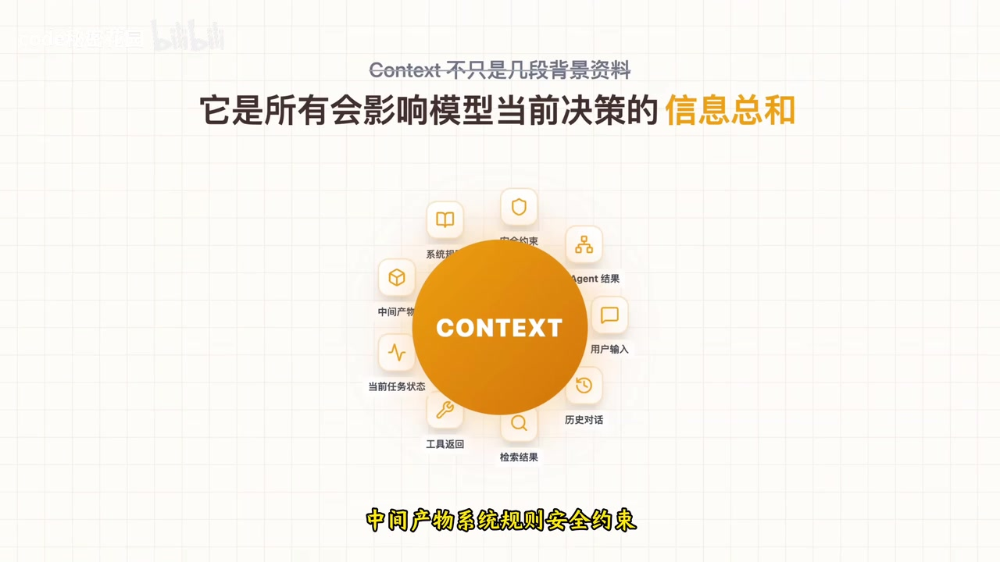

# 最近爆火的 Harness Engineering 到底是啥？一期讲透！

> 来源：[Bilibili 视频](https://www.bilibili.com/video/BV1Zk9FBwELs) 
> UP 主：code秘密花园｜时长：18 分 31 秒｜合集：AIcode  
> 视频主题：从 Prompt Engineering、Context Engineering 的演进，理解 Harness Engineering 如何解决 Agent 在真实长链路任务中的稳定交付问题。

## 小结

视频将 **Harness Engineering（约束/驾驭系统工程）** 定义为：在 Agent 系统中，除模型本身外，几乎所有保障任务可稳定交付的运行机制。用公式表示即：**Agent = Model + Harness；Harness = Agent - Model**。

作者认为，AI 工程近两年的重心经历了三层外扩：Prompt Engineering 解决“是否把任务说清楚”；Context Engineering 解决“是否在正确时机给到正确的信息”；Harness Engineering 则解决“模型在真实环境的连续执行中，是否能持续做对、被及时发现偏差并恢复”。

一个成熟 Harness 被视频拆为六层：**上下文边界、工具系统、执行编排、记忆与状态、评估与观测、约束校验与失败恢复**。其中，评估独立性、真实环境验收、可恢复机制，是从“能演示”走向“能上线”的关键。

视频以一个作者自述的 Agent 优化案例说明：在不更换模型、不更换提示词的前提下，通过任务拆分、状态管理、关键步骤校验和失败恢复，将任务成功率从不足 70% 提高到 95% 以上。这是视频陈述的经验案例，未提供外部复现实验材料。

视频还转述了 LangChain、OpenAI、Anthropic 的实践方向：渐进式披露上下文、上下文重置、生产与验收分离、让 Agent 接入浏览器/日志/指标系统、将资深工程师经验写成可执行规则等。相关具体成绩与公司案例均应视作**视频中的转述**，需要回到原始技术报告或项目资料进一步核验。

适合正在搭建 Agent、RAG、多工具工作流、自动化编码或生产级 AI 应用的读者。核心启发不是继续堆叠 Prompt，而是把失败当作常态，以工程化的观测、验证、纠偏和恢复机制提升交付稳定性。

## 思维导图

## 目录

- [问题：为什么同一模型的 Agent 表现差异很大？](#问题为什么同一模型的-agent-表现差异很大)
- [三次工程重心迁移：Prompt、Context 与 Harness](#三次工程重心迁移promptcontext-与-harness)
- [Prompt Engineering：解决表达，不替代事实](#prompt-engineering解决表达不替代事实)
- [Context Engineering：在恰当时机供给正确信息](#context-engineering在恰当时机供给正确信息)
- [Harness Engineering：从输入优化到全过程驾驭](#harness-engineering从输入优化到全过程驾驭)
- [成熟 Harness 的六层结构](#成熟-harness-的六层结构)
- [公司实践与可迁移方法](#公司实践与可迁移方法)
- [落地步骤、限制与时效性](#落地步骤限制与时效性)
- [关键帧索引](#关键帧索引)
- [字幕比对](#字幕比对)
- [评论分析](#评论分析)
- [处理记录](#处理记录)

## 问题：为什么同一模型的 Agent 表现差异很大？ [00:00:00](https://www.bilibili.com/video/BV1Zk9FBwELs?t=0)

视频从一个工程现象切入：同样的基础模型，别人构建的 Agent 可能可以长期连续运行且成功率较高，自己的系统却容易跑偏。模型能力、Prompt 调优和 RAG 都会影响结果，但作者的核心判断是：**决定系统是否稳定运行的，往往不只是模型，而是模型外部的运行系统。**

作者自述了一个年初帮助朋友优化 Agent 的案例：

- 团队已换用旗舰模型；
- 提示词修改了上百版；
- 参数也进行过多次调整；
- 进入真实场景后仍不稳定，任务成功率不足 **70%**；
- 最终优化重点转向：
  1. 任务如何拆分；
  2. 状态如何管理；
  3. 关键步骤如何校验；
  4. 失败后如何恢复；
- 在“相同模型、相同提示词”前提下，新版本成功率提升到 **95% 以上**。

这里的百分比是作者口述案例，视频未给出测试集规模、任务定义、评估标准、时间跨度或对照实验，因此不能直接外推为普遍效果。

> 图：画面写有“年初的一个真实案例：帮朋友调优 Agent 系统”。它说明视频并非仅从术语定义切入，而是试图从工程交付不稳定的问题解释 Harness 的必要性。

## 三次工程重心迁移：Prompt、Context 与 Harness [00:01:41](https://www.bilibili.com/video/BV1Zk9FBwELs?t=101)

作者将近两年的 AI 工程关注点归纳为三次迁移。它们不是替代关系，而是系统边界逐级扩大。

| 阶段 | 核心问题 | 主要工程对象 | 视频中的简化结论 |
| --- | --- | --- | --- |
| Prompt Engineering | 模型有没有听懂任务 | 指令、角色、格式、示例、约束 | 把话说清楚 |
| Context Engineering | 模型是否获得充分且正确的信息 | 检索、历史、状态、工具结果、规则 | 把信息给对 |
| Harness Engineering | 模型能否在真实执行中持续做对 | 编排、工具、验证、观测、恢复 | 防止跑偏并拉回 |

> 图：关键帧明确展示 Prompt、Context、Harness 三张卡片及其对应问题，直接支撑“从单次理解、信息供给到持续执行”的层级关系。

### Prompt、Context、Harness 是包含关系 [00:08:23](https://www.bilibili.com/video/BV1Zk9FBwELs?t=503)

作者用“派新员工拜访重要客户”说明三者差别：

- **Prompt**：明确交代工作顺序，例如先寒暄、介绍方案、确认需求、确认下一步。
- **Context**：提供客户背景、历史沟通记录、产品报价、竞品情况、会议目标等资料。
- **Harness**：要求携带检查清单、在关键节点汇报、会后核查纪要与录音、发现偏差立即纠正、最后按标准验收。

因此：

- Prompt 是对**指令**的工程化；
- Context 是对**输入环境**的工程化；
- Harness 是对**整个运行系统**的工程化。

## Prompt Engineering：解决表达，不替代事实 [00:02:14](https://www.bilibili.com/video/BV1Zk9FBwELs?t=134)

作者认为，大模型本质上是对上下文高度敏感的概率生成系统。改变角色设定、风格限制、Few-shot 示例和输出格式，可能明显改变结果。

视频给出的 Prompt 有效原因包括：

- 赋予不同角色，模型倾向按相应身份回答；
- 提供不同示例，模型倾向沿示例范式补全；
- 强调不同约束，模型更可能将其视为重点。

因此，作者将 Prompt Engineering 的本质概括为：**不是命令模型，而是塑造局部概率空间。**

但 Prompt 很快会遇到上限。面对以下任务，即使指令写得很好，也不能代替真实信息：

- 分析企业内部文档；
- 回答产品的最新配置；
- 依据长规范编写代码；
- 跨多个工具完成复杂任务；
- 管理长链路中的动态信息和状态。

> 图：画面以“Prompt 擅长”和“它不擅长”对照，强调其可澄清任务、约束输出、激发既有能力，但不能凭空补齐缺失知识。这是理解 Context Engineering 必要性的关键过渡。

## Context Engineering：在恰当时机供给正确信息 [00:03:46](https://www.bilibili.com/video/BV1Zk9FBwELs?t=226)

当 Agent 从单轮问答走向真实环境中的多轮执行时，问题不再是“一次回答是否正确”，而是“整条任务链是否能跑通”。

视频举例：如果要求 Agent 分析需求文档、识别风险、结合历史评审意见提出改进建议、再生成给产品经理的反馈稿，系统至少要向它提供：

- 当前需求文档；
- 历史评审记录；
- 相关规范；
- 当前目标；
- 中间结论的接收对象；
- 需要使用的语气和输出形式。

作者对 Context 的工程化定义是：**所有影响模型当前决策的信息总和**，其中包括用户输入、历史对话、检索结果、工具返回、当前任务状态、中间产物、系统规则、安全约束，以及其他 Agent 传来的结构化结果。

> 图：画面将用户输入、历史对话、检索结果、工具返回、任务状态、中间产物、系统规则、安全约束、Agent 结果纳入 Context，便于避免将 Context 狭义理解成“几段背景资料”。

### RAG、Skills 与渐进式披露 [00:05:10](https://www.bilibili.com/video/BV1Zk9FBwELs?t=310)

视频将 RAG 视为 Context Engineering 的典型实践：先检索，再把相关信息放入上下文，以补充模型参数中不存在的运行时知识。

但成熟的 Context Engineering 不止于检索，还要处理完整信息链：

1. 文档如何切块；
2. 检索结果如何排序；
3. 长文本如何压缩；
4. 历史对话何时保留、何时摘要；
5. 工具返回是否全部暴露给模型；
6. 多 Agent 间应传原文摘要还是结构化字段。

作者特别强调：上下文窗口是稀缺资源。把十几个工具、说明和所有参数定义一次性塞给模型，理论上信息更多，实践中却可能因注意力分散而更差。

对应策略是 **渐进式披露（Progressive Disclosure）**：

- 初始只提供最少量的原始信息；
- 当任务确实要触发某个能力时；
- 再动态加载对应 SOP、详细参考资料与脚本。

可迁移原则是：上下文优化不是“给得更多”，而是**按需给、分层给、在正确时机给**。

## Harness Engineering：从输入优化到全过程驾驭 [00:07:04](https://www.bilibili.com/video/BV1Zk9FBwELs?t=424)

视频指出，即使提供了正确的信息，模型仍可能在长链路执行中出错：

- 规划看似合理，但执行偏离；
- 调用了工具，却误解工具返回；
- 偏差逐步积累；
- 系统没有检测到错误。

Prompt 和 Context 主要优化输入侧：

- Prompt 优化意图表达；
- Context 优化信息供给。

Harness 面对的则是连续行动过程中的治理问题：**谁来监督模型、约束模型、发现偏差并纠正模型？**

“Harness”原意与缰绳、马具、约束装置相关。放入 AI 系统中，作者将其解释为：当模型从回答问题转向执行任务，系统不只要负责输入信息，还要能够驾驭全过程。

### 核心定义 [00:08:39](https://www.bilibili.com/video/BV1Zk9FBwELs?t=519)

视频转述 LangChain 工程师的典型定义：

\[
\text{Agent} = \text{Model} + \text{Harness}
\]

\[
\text{Harness} = \text{Agent} - \text{Model}
\]

通俗理解是：在一个 Agent 系统中，模型之外、几乎一切影响稳定交付的机制，都属于 Harness 范畴。

## 成熟 Harness 的六层结构 [00:09:01](https://www.bilibili.com/video/BV1Zk9FBwELs?t=541)

### 1. 上下文边界与结构化组织 [00:09:02](https://www.bilibili.com/video/BV1Zk9FBwELs?t=542)

Harness 的第一职责，是让模型在正确的信息边界内思考。该层包含：

- **角色目标与定义**：模型是谁、要完成什么任务、成功标准是什么；
- **信息裁剪与选择**：上下文不是越多越好，而是越相关越好；
- **结构化组织**：固定规则、当前任务、运行状态与外部证据应分层放置。

视频提醒：信息混乱时，模型容易遗漏重点、忘记约束，甚至发生“自我污染”。

### 2. 工具系统 [00:09:39](https://www.bilibili.com/video/BV1Zk9FBwELs?t=579)

没有工具时，模型仍主要是文本预测器，只能解释和总结；连接工具后，才可能搜索网页、读取文档、写代码、调用 API。

Harness 在工具层要解决三件事：

1. **给什么工具**：工具太少则能力不足，工具太多又可能被错误使用；
2. **何时调用工具**：不需要检索时不应乱查，需要核验时不应硬答；
3. **怎样回灌工具结果**：数十条搜索结果不应原样回填，而要筛选、提炼并维持任务相关性。

### 3. 执行编排 [00:10:15](https://www.bilibili.com/video/BV1Zk9FBwELs?t=615)

执行编排处理的是“模型下一步该做什么”。视频认为，许多 Agent 的问题不是某一步不会做，而是不能把多个步骤组成稳定流程，导致“会搜索、会总结、会写代码，但最终交付一堆半成品”。

视频给出的完整轨道是：

1. 理解目标；
2. 判断信息是否充足；
3. 不足则补充；
4. 基于结果继续分析；
5. 生成输出；
6. 检查输出；
7. 不符合要求则修正或重试。

### 4. 记忆与状态 [00:10:51](https://www.bilibili.com/video/BV1Zk9FBwELs?t=651)

没有状态的 Agent，会在每轮交互中像“失忆”一样：不知道刚做过什么、不知道哪些结论已确认、也不知道哪些问题未解决。

视频要求至少区分三类信息：

| 类别 | 用途 |
| --- | --- |
| 当前任务状态 | 当前进度、阶段、待办与阻塞项 |
| 中间结果 | 任务过程中生成、待验证或待传递的产物 |
| 长期记忆与用户偏好 | 跨任务持续有效的偏好、规则和历史信息 |

三类信息混在一起会让系统越来越混乱；清晰划分后，Agent 才更接近稳定协作者。

### 5. 评估与观测 [00:11:14](https://www.bilibili.com/video/BV1Zk9FBwELs?t=674)

作者认为，评估与观测是很多团队最容易忽视的一层。系统可能不是“生成不出来”，而是生成后不知道自己是否真的完成得正确。

该层通常包括：

- 输出与验收环境验证；
- 自动化测试；
- 日志与指标；
- 错误归因；
- 独立评估能力。

核心要求是：系统不仅要会做，还要能够判断自己是否做对。

### 6. 约束校验、失败与恢复 [00:11:40](https://www.bilibili.com/video/BV1Zk9FBwELs?t=700)

视频强调：真实环境中，失败不是例外，而是常态。可能出现：

- 搜索结果不准确；
- API 超时；
- 文档格式混乱；
- 模型误解任务；
- 工具调用或返回结果异常。

没有恢复机制时，Agent 每次出错都只能从头再来。成熟 Harness 至少应包含：

- **约束**：什么能做、什么不能做；
- **校验**：输出前、输出后分别如何检查；
- **恢复**：失败后如何重试、切换路径、回滚到稳定状态。

## 公司实践与可迁移方法 [00:12:15](https://www.bilibili.com/video/BV1Zk9FBwELs?t=735)

> 以下内容均为视频对公司实践的转述与作者解读，不应在未查阅原始资料前视为已独立验证的事实。

### 视频转述的成绩信息 [00:12:28](https://www.bilibili.com/video/BV1Zk9FBwELs?t=748)

视频提到：

- LangChain 在不改变底层模型的前提下，仅改造和迭代 Harness，将其 Agent 在某榜单中的排名从 30 名开外提升至前 5；
- OpenAI 以数名人类工程师组成的团队，借助 Agent 从零构建超百万行代码的生产级应用，且代码 100% 由 Agent 编写，耗时仅为纯人工开发的十分之一；
- Anthropic 构建了完全自主编码系统，只需一句自然语言需求，便能无人工干预连续运行数小时，最终构建完整游戏或数字音频工作站。

这些说法涉及具体排名、代码量、效率和组织实践，视频未提供原始报告链接、项目名称、基准定义或测量方法。实践中应按“方向性案例”吸收其工程思想，而非直接采用其效果数字。

### Anthropic：上下文重置与独立验收 [00:13:02](https://www.bilibili.com/video/BV1Zk9FBwELs?t=782)

视频概述了两个问题与设计策略。

**问题一：上下文逐步饱和。**

长时间自主任务中，上下文越来越满，模型开始丢失细节和重点，甚至可能出现“急于收尾”的现象。常规做法是 Context Compaction，即压缩历史上下文后继续运行；视频认为，对于部分模型，这只会缩短文本，不一定消除负担。

对应方案是 **Context Reset**：

1. 不继续在原有上下文中反复压缩；
2. 启动一个干净的新 Agent；
3. 将必要的工作状态交接给新 Agent；
4. 类比工程中的内存泄漏：不是持续清缓存，而是重启进程后恢复状态。

**问题二：自评失真。**

模型既生成又自评时可能偏乐观，尤其在设计体验、产品完整度等缺少标准答案的问题上。

视频给出的角色分离：

- **Planner**：将模糊需求扩展为完整规格；
- **Generator**：逐步实现；
- **Evaluator**：像 QA 一样真实测试。

Evaluator 不只看代码，还要实际操作页面、检查交互和结果。其原则是：**生产与验收必须分离**，从而构成“生成 → 检查 → 修复 → 再检查”的闭环。

### OpenAI：环境设计、渐进披露与自验证 [00:14:46](https://www.bilibili.com/video/BV1Zk9FBwELs?t=886)

视频认为，OpenAI 的核心思想是重新定义 Agent 时代工程师的工作：工程师不必只聚焦写代码，而要设计 Agent 工作的环境。

作者归纳为三项工作：

1. 将产品目标拆成 Agent 可以理解的小任务；
2. Agent 失败时，不是简单要求“更努力”，而是定位环境缺失了什么结构性能力；
3. 建立反馈链路，让 Agent 能看到自己的工作结果。

#### 渐进式披露：把 AGENTS.md 从大而全改为目录 [00:15:28](https://www.bilibili.com/video/BV1Zk9FBwELs?t=928)

视频转述：早期把规范、框架、约定全部放入巨型 `AGENTS.md`，结果上下文被塞满，Agent 更困惑。

调整方式：

- `AGENTS.md` 仅保留核心索引；
- 细节拆分到架构文档、设计文档、执行计划、质量评分、安全规则等子文档；
- Agent 先读目录；
- 只有需要时再深入具体文档。

这与前文 Skills 的渐进式披露一致：不是一次性全给，而是按需暴露。

#### 让 Agent 在真实环境中验证结果 [00:16:16](https://www.bilibili.com/video/BV1Zk9FBwELs?t=976)

视频描述的自验证环境包含：

- 接入浏览器，可截图、点击页面、模拟真实用户操作；
- 接入日志系统与指标系统，可查日志、查监控；
- 每个任务在独立隔离环境中运行，互不影响；
- Agent 不仅写代码，还能运行应用、观察结果、发现 Bug、修复并再次验证。

这覆盖了 Harness 中的工具系统、执行编排、评估观测、约束与恢复。

#### 将工程经验写成可运行的治理规则 [00:16:46](https://www.bilibili.com/video/BV1Zk9FBwELs?t=1006)

视频还指出，不应只靠人类在最终 Code Review 阶段兜底，因为 Agent 的提交速度可能超过人工审查能力。

可编码的经验规则包括：

- 模块如何分层；
- 哪一层不能依赖哪一层；
- 哪些条件必须拦截；
- 发现问题后应如何修复。

关键不只是“报错”，还应将修复方法反馈给 Agent，进入下一轮上下文。作者因此将其视作从传统代码规范升级而来的、可持续运行的自动治理系统。

## 落地步骤、限制与时效性 [00:17:19](https://www.bilibili.com/video/BV1Zk9FBwELs?t=1039)

### 可执行的落地清单

结合视频内容，可按以下顺序补齐一个 Agent 的 Harness：

1. **定义任务与成功标准**
   - 写清角色、目标、边界、输入和验收条件；
   - 把大任务拆成可验证的小任务。

2. **设计上下文分层**
   - 分离固定规则、当前任务、运行状态、外部证据和长期记忆；
   - 避免把所有工具和资料一次性塞入上下文。

3. **建立工具调用策略**
   - 限制工具集合；
   - 明确何时必须检索、何时必须验证；
   - 对工具返回进行筛选、摘要和结构化。

4. **实现执行编排**
   - 用“理解目标 → 补充信息 → 分析 → 输出 → 校验 → 修复/重试”的轨道约束流程；
   - 防止 Agent 想到哪里做哪里。

5. **维护状态并支持交接**
   - 独立管理当前任务状态、中间产物、长期记忆；
   - 对长任务考虑状态快照、上下文压缩或上下文重置。

6. **建立独立评估**
   - 生成者与评估者角色分离；
   - 让评估在真实或隔离的验收环境中执行；
   - 接入测试、日志、指标和错误归因。

7. **把失败设计进系统**
   - 定义重试次数、备用路径、回滚点与人工介入条件；
   - 对 API 超时、检索失败、格式错误、任务误解等建立恢复策略。

### 适用边界与限制

- 对简单、单轮、低风险文本生成，重点投入 Prompt 可能已足够；Harness 的复杂工程成本未必划算。
- 当任务依赖外部知识、多工具调用、长链路执行、低容错或生产交付时，Harness 几乎不可避免。
- Harness 不会替代模型能力。视频观点是：模型可能决定性能上限，但 Harness 更影响能否稳定落地和交付。
- 自动评估并不天然可靠。即使设置 Evaluator，也需关注评估标准、测试环境、覆盖率、评价偏差和安全边界。
- 上下文重置会带来状态交接要求；若状态恢复不完整，可能造成信息丢失、重复执行或错误决策。
- 视频发布时间相关元数据与抓取时间存在时间信息不一致的可能；本文不据此推断概念的最新行业状态。OpenAI、Anthropic、LangChain 的产品、论文和工程实践变化较快，应以其后续一手资料为准。

### 视频结论 [00:17:28](https://www.bilibili.com/video/BV1Zk9FBwELs?t=1048)

作者最终总结：

- Prompt Engineering：解决如何把任务讲清楚；
- Context Engineering：解决如何把信息给对；
- Harness Engineering：解决如何让模型在真实执行中持续做对。

AI 落地的核心挑战正从“让模型看起来更聪明”，转向“让模型在真实世界里稳定工作”。

## 关键帧索引

| 关键帧 | 对应内容 | 使用价值 |
| --- | --- | --- |
|  | 作者的 Agent 调优案例 | 解释视频为何从稳定性问题引出 Harness |
|  | Prompt → Context → Harness | 直观呈现全文最重要的概念层级 |
|  | Prompt 擅长与不擅长的事 | 明确 Prompt 不能替代事实与外部知识 |
|  | Context 的组成 | 避免把 Context 误解成静态背景资料 |

## 字幕比对

| 字幕来源 | 完整性 | 专有名词 | 时间轴 | 主要问题 |
| --- | --- | --- | --- | --- |
| Bilibili 站内中文字幕 `p01-ai-zh.srt` | 覆盖全片，分段细 | `Harness`、`Prompt`、`Context`、`Agent` 等总体可辨 | 时间从 00:00:00,040 起，和视频内容对齐 | 存在 ASR 式错词，如“IG”代替 RAG、“ALICE/Arnis”代替 Harness、“long cha”等；部分断句不自然 |
| 本次 ASR `medium` | 诊断显示语音覆盖约 96.21%，末尾覆盖至 1109.9 秒 | 中文识别语言置信度高，但英文术语大量失真 | 首段从 23.5 秒开始，和站内字幕及视频内容存在明显约 23 秒偏移 | 分段过长，混入大量错字，如 `Arnis/Hernes`、`IG`、`Lunchen`；不宜直接作为正文逐字依据 |

### 最终字幕选择

正文以 **Bilibili 站内中文字幕的真实 SRT 时间轴** 为主，因为它从视频开头开始、分段更细，且时间位置可靠；再参考本次 ASR 的中文语义和覆盖诊断进行交叉检查。

已根据上下文、英文站内字幕与画面校正的关键术语包括：

- `Harness Engineering`：站内中文和本次 ASR 有时误识别为“Arnis”“Hernes”“ALICE”等；
- `RAG`：站内中文字幕多处识别成“IG”，根据英文字幕与语义校正为 RAG；
- `LangChain`：站内字幕/ASR 有“LUNCHA”“Lunchen”“long cha”等误识别；
- `Anthropic`：站内字幕/ASR 有“astrobic”“ATHROPIC”等误识别；
- `AGENTS.md`：站内字幕与 ASR 个别位置写作 `agent.md` 或“agent词典MD”，正文按英文字幕统一为 `AGENTS.md`。

本次 ASR 结果未标记 `noAudioStream=true`；诊断显示音轨存在且有较高语音覆盖，因此未采用“无音轨”处理路径。

## 评论分析

以下仅处理可获取的热评前三条，评论内容代表评论者观点，不视作已验证事实。

### 1. UP 主补充：Harness 是为 Agent 服务的软件工程基础设施

- 评论者：`code秘密花园`
- 点赞：525
- 核心观点：程序员角色正在从“人编写全部代码”转向“人辅助 Agent 编写代码”；基础架构、可观测性、自动化测试、质量保障和安全测试不会消失，只是服务对象从人转为 Agent。
- 价值：这补强了视频的核心论点——Harness 并非神秘的新模块，而是将既有软件工程能力重新组织为面向 Agent 的运行环境。
- 争议与限制：评论进一步讨论“造新词”具有传播和话语权作用，这是一种行业观察，不构成对术语来源或公司动机的事实证明。

### 2. 观众调侃：新名词也可能承担“向上管理”作用

- 评论者：`秋水泡茶`
- 点赞：388
- 核心观点：Agent 工程师过去已经在做很多业务逻辑细化、任务拆解等工作；新概念的出现能让管理者理解其中工作量，减少“模型本身自然能完成任务”的幻想。
- 价值：指出 Harness 的现实组织意义：将隐性的工程劳动显性化，方便沟通系统投入、风险与职责。
- 争议与限制：该评论带有调侃色彩。“所有 Agent 工程师都干过”等绝对化表述不宜作为行业统计结论。

### 3. 观众设想：Agent 到 Agent 的自动订阅与知识传递

- 评论者：`Kaede_君`
- 点赞：275
- 核心观点：设想创作者用 Agent 制作内容、观众用 Agent 学习内容后，进一步让双方 Agent 自动订阅、注册并传递新知识。
- 价值：以玩笑式设想延伸出 Agent 间自动化工作流与知识分发问题。
- 限制：这不是视频中已实现的功能或工程方案；若真要落地，还会涉及身份认证、授权、数据质量、提示注入、费用控制与安全隔离等 Harness 层问题。

## 处理记录

- Worker ID：`worker-mrj0wjed-b0c290ad`
- 模型：`gpt-5.6-terra`
- ASR 模型与运行信息：`medium`，CUDA，`float16`，识别语言 `zh`，语言置信度 `0.99951171875`
- 使用素材与工具：视频元数据、Bilibili 站内 SRT 字幕、`asr/asr-result.json`、`asr/transcript.srt`、关键帧目录 `frames/`、热评数据 `comments/comments.json`
- 字幕选择：以 `p01-ai-zh.srt` 为主时间轴；使用本次 ASR 对照检查语义与覆盖；英文站内字幕辅助校正 RAG、LangChain、Anthropic、AGENTS.md 等专有名词。
- 关键帧依据：选择画面中直接呈现案例、三阶段迁移、Prompt 边界与 Context 构成的 `frame-001` 至 `frame-004`，用于支撑核心论述；未对未展示画面的其余关键帧进行臆测性描述。
- 热评处理：仅分析可获取热评前三条，未扩展至其他评论或回复。
- 缓存清理：素材清单未提供缓存删除或清理执行结果；本文不虚构清理完成状态。
- 未解决问题：
  - 视频中转述的 LangChain、OpenAI、Anthropic 具体成绩缺少一手出处链接，未做外部独立核验；
  - 本次 ASR 起始时间比站内字幕晚约 23 秒，且英文专有名词误识别较多，因此不用于章节精确定位。
