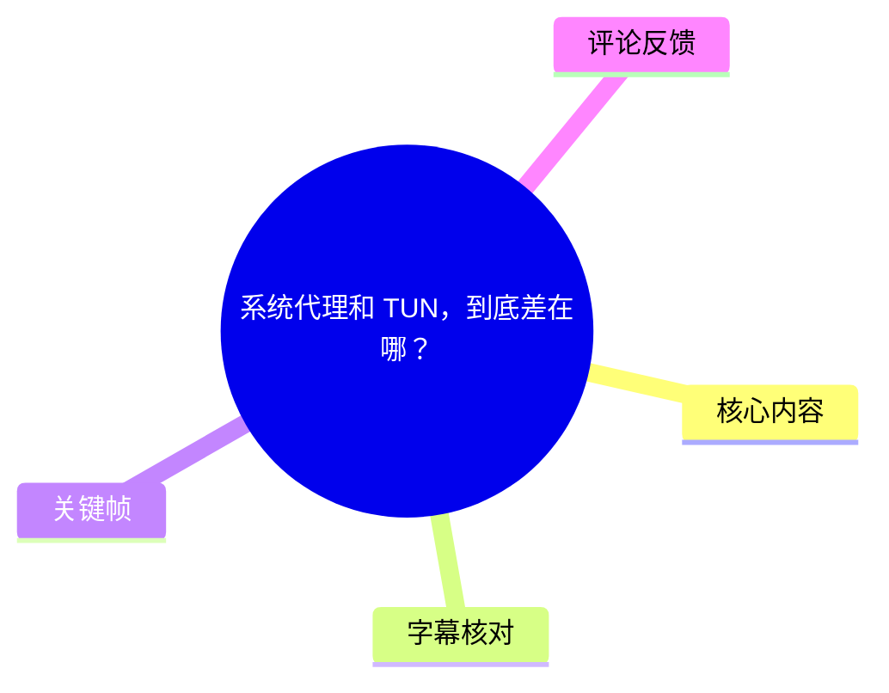
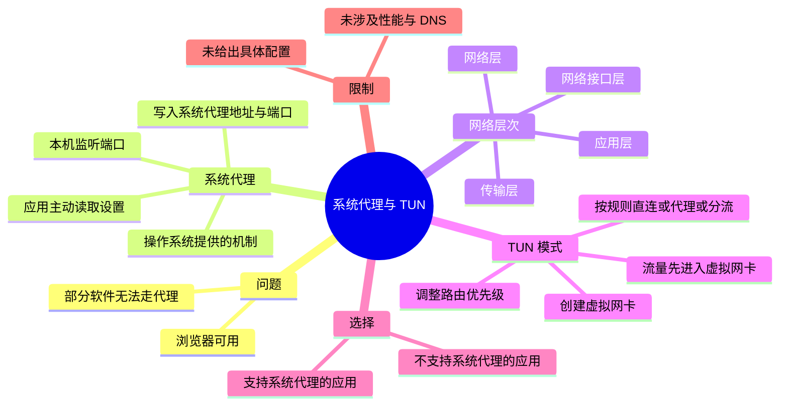
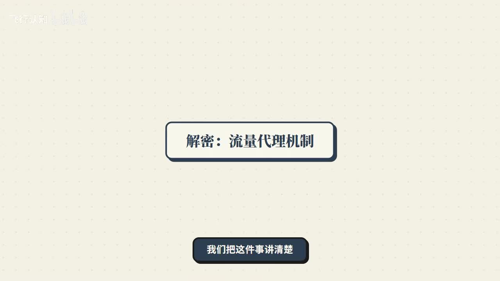
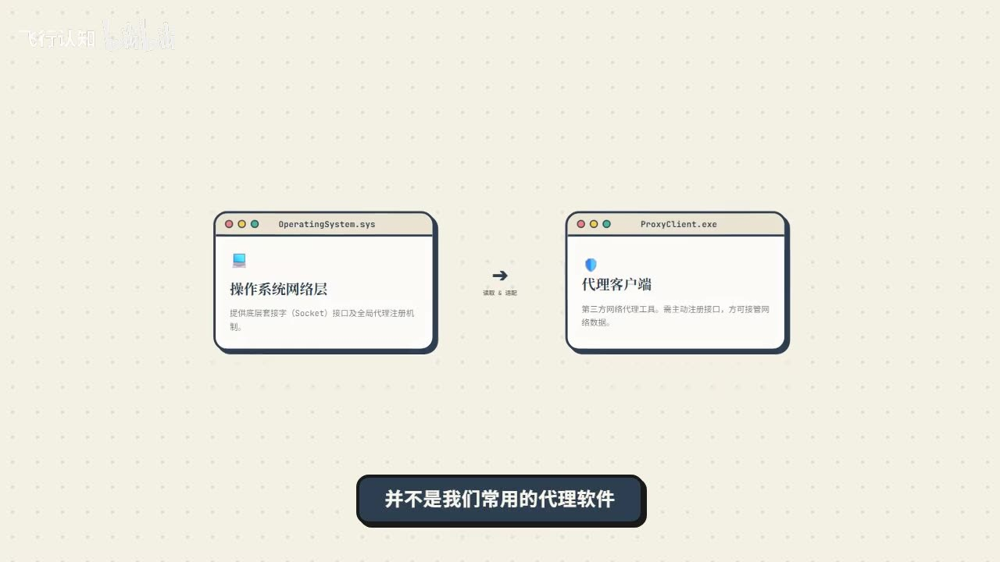
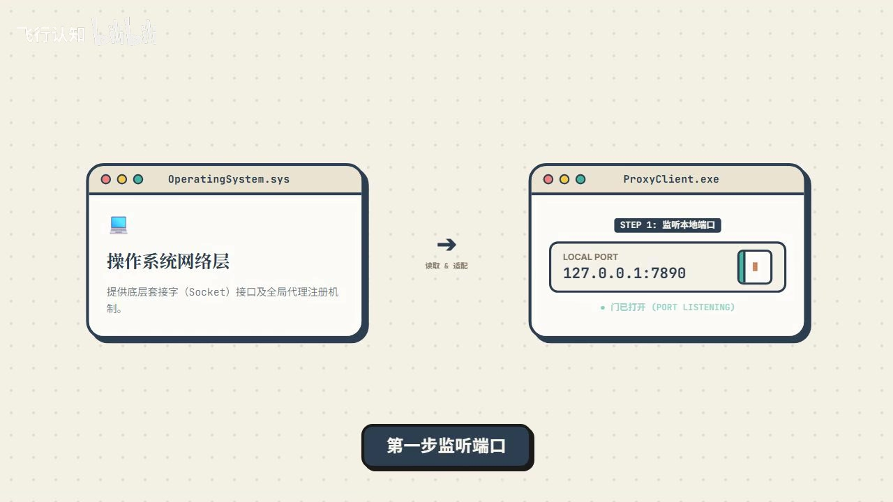
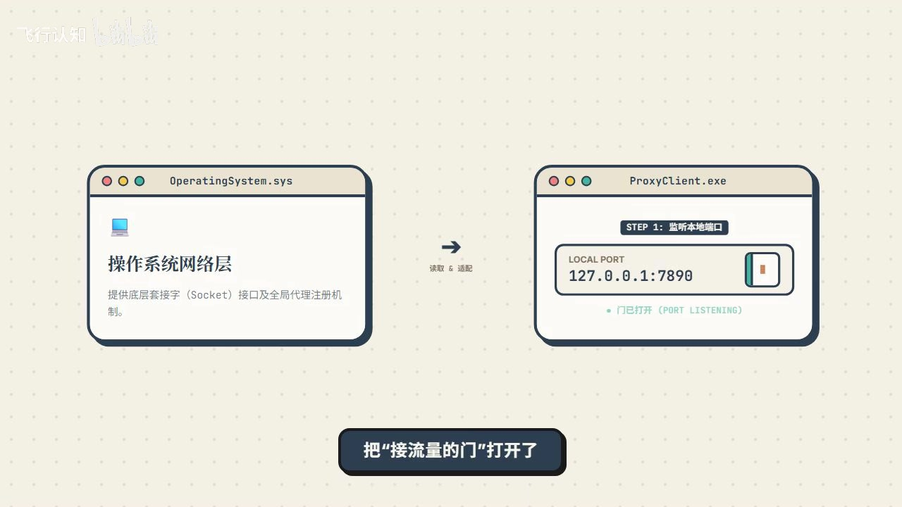

# 系统代理和 TUN，到底差在哪？

> 来源：[Bilibili 视频](https://www.bilibili.com/video/BV1PJEx6cEjj)  
> UP 主：飞行认知｜发布时间：2026-06-07｜视频时长：03:44  
> 标签：系统代理、TUN 代理、TUN 模式

## 小结

视频回答了一个常见现象：明明已经开启代理，浏览器可以访问网络，但部分软件仍不能正常走代理。作者将原因归结为两种模式接管流量的位置不同：**系统代理**主要为支持该机制的应用提供上层代理入口；**TUN 模式**则借助虚拟网卡与路由规则，在更底层先接管流量。

系统代理不是代理客户端“自行发明”的机制，而是操作系统已有的一套网络代理配置能力。代理客户端开启系统代理时，视频将其拆为两步：先在本机监听端口，再把本机代理地址和端口写入系统代理设置。应用若主动读取该设置，就会把请求交给本机代理客户端。

视频用四层网络传输的简化模型解释局限：应用层、传输层、网络层、网络接口层。系统代理主要影响较上层、尤其是 HTTP/HTTPS 一类请求；不读取系统代理设置，或在更低层自行发起网络通信的软件，可能绕开该代理入口。

TUN 模式的关键动作是：创建一张虚拟网卡，并调整路由规则优先级，让原本会从真实网卡直接发出的流量优先进入虚拟网卡。之后，代理客户端可根据规则判定流量应当直连、走代理还是分流。因此，它能覆盖一部分不支持系统代理的软件。

这是一支面向入门用户的原理说明视频，并**没有**展示具体客户端、操作系统设置界面、协议配置、规则语法、性能数据或故障排查命令。实际软件对系统代理、TUN、路由与 DNS 的具体实现可能不同；应以所用客户端和系统版本的官方文档为准。

## 思维导图





## 目录

- [问题与视频范围](#问题与视频范围)
- [系统代理：监听端口并登记系统设置](#系统代理监听端口并登记系统设置)
- [为什么部分软件不会走系统代理](#为什么部分软件不会走系统代理)
- [TUN 模式：虚拟网卡与路由接管](#tun-模式虚拟网卡与路由接管)
- [两种模式的选择与实践检查](#两种模式的选择与实践检查)
- [结论、限制与时效性](#结论限制与时效性)
- [字幕比对](#字幕比对)
- [评论分析](#评论分析)
- [处理记录](#处理记录)

## 问题与视频范围 [00:00:37](https://www.bilibili.com/video/BV1PJEx6cEjj?t=37)

视频从“开了代理但有的软件仍无法使用”的现象切入，说明要讲清三个问题：

1. 什么是系统代理；
2. 什么是 TUN 模式；
3. 两者如何处理设备发出的网络流量。

ASR 的首段有效语音从 **00:00:37.600** 开始，之后连续覆盖至 **00:03:43.220**。视频的实质内容集中在这一段；前约 37 秒在本次 ASR 中未识别出语音，而站内字幕在 00:00:13—00:00:34 的文字内容是与珊瑚保育相关的叙述，与本视频标题、ASR 主体和关键帧画面不一致，不能作为本视频内容依据。



> 图：画面直接写有“解密：流量代理机制”“我们把这件事讲清楚”，概括了视频以流量路径解释系统代理与 TUN 差异的目标，适合作为主题定位图。

## 系统代理：监听端口并登记系统设置 [00:00:38](https://www.bilibili.com/video/BV1PJEx6cEjj?t=38)

### 概念定位 [00:00:38](https://www.bilibili.com/video/BV1PJEx6cEjj?t=38)

作者强调，**系统代理是操作系统提供的一套网络代理机制**，不是常见代理软件独立创造的能力。代理客户端在其中的角色，是利用操作系统可供应用读取的代理配置，将应用请求导入自身。



> 图：画面把“操作系统网络层”和“代理客户端”并列，并标示客户端需要读取、适配系统能力。它有助于区分“系统提供代理配置机制”与“代理客户端负责利用该机制”两个角色。

### 第一步：本机监听端口 [00:00:38](https://www.bilibili.com/video/BV1PJEx6cEjj?t=38)

打开系统代理开关时，视频先描述代理客户端会在本机启动代理服务并监听端口。这相当于在本机创建一个用于接收流量的入口。

关键帧中出现了示意参数：

| 项目 | 画面示例 | 视频中的含义 |
| --- | --- | --- |
| 本地地址与端口 | `127.0.0.1:7890` | 代理客户端监听的本机入口 |
| 状态 | `PORT LISTENING` / 已打开 | 端口已开始等待接收连接或流量 |

视频同时特别指出：**仅仅开始监听端口，并不代表系统流量已经自动被导入这里。**



> 图：画面明确标注“STEP 1：监听本地端口”及 `127.0.0.1:7890`。该帧提供了视频中唯一直接可见的端口参数示例，并说明“监听”只是建立入口。

### 第二步：修改系统代理设置 [00:01:02](https://www.bilibili.com/video/BV1PJEx6cEjj?t=62)

端口开始监听后，代理客户端借助操作系统自带的系统代理能力：

1. 打开系统代理功能；
2. 修改操作系统中的代理设置；
3. 将代理地址和客户端监听端口写入设置；
4. 让支持系统代理的应用知道，应将网络请求交给该代理客户端处理。

因此，系统代理的流量路径不是“客户端强制截获所有流量”，而是“支持该设置的应用读取配置后，主动把请求交给本机代理入口”。



> 图：该帧延续本地端口示意，并以“把接流量的门打开了”说明监听端口的作用。结合后续写入系统设置的说明，可避免误解为端口监听本身会自动代理全部流量。

## 为什么部分软件不会走系统代理 [00:01:26](https://www.bilibili.com/video/BV1PJEx6cEjj?t=86)

作者以一个简化的四层结构说明系统代理的覆盖边界：

| 层次 | 视频列举内容 | 与系统代理的关系 |
| --- | --- | --- |
| 应用层 | 浏览网页时常见的 HTTP、HTTPS 请求 | 系统代理主要影响这一类较上层请求 |
| 传输层 | 位于应用层之下 | 部分软件可能在此层或相关路径自行联网 |
| 网络层 | 位于传输层之下 | 视频未展开具体协议或配置 |
| 网络接口层 | 最底层 | TUN 模式在视频中被描述为从这一层接管流量 |

### 浏览器为何通常可用 [00:01:50](https://www.bilibili.com/video/BV1PJEx6cEjj?t=110)

视频给出的典型例子是浏览器：浏览器通常会读取系统代理设置，并把 HTTP/HTTPS 等请求交给代理客户端。因此，在系统代理正确开启、地址端口正确写入的前提下，浏览器通常可以走代理。

这里的“通常”是视频的概括性措辞，并非对所有浏览器、全部请求或所有平台的绝对保证。

### 软件为何可能绕开系统代理 [00:02:14](https://www.bilibili.com/video/BV1PJEx6cEjj?t=134)

作者给出两类原因：

- 软件**不读取系统代理设置**；
- 软件自身的通信已经通过更下层的路径发出，例如视频概括为“通过传输层已经出去了”。

在这些情形下，软件流量不会进入代理客户端的监听端口，系统代理对它便会失效。视频要表达的核心不是系统代理“完全不能用”，而是它依赖应用对操作系统代理设置的支持。

## TUN 模式：虚拟网卡与路由接管 [00:02:38](https://www.bilibili.com/video/BV1PJEx6cEjj?t=158)

### 接管位置更靠近网络接口层 [00:02:38](https://www.bilibili.com/video/BV1PJEx6cEjj?t=158)

与系统代理的上层入口不同，视频将 TUN 模式描述为更“直接”或更“霸道”的方案：它从最底层的**网络接口层**接管全部流量。这里的“全部流量”是视频对其工作方向的概括，实际可接管范围仍会受客户端实现、操作系统权限、路由规则及配置影响。

### 两个实现动作 [00:02:38](https://www.bilibili.com/video/BV1PJEx6cEjj?t=158)

视频列出 TUN 模式的两个关键动作：

1. **创建虚拟网卡**  
   系统中会多出一条虚拟网络通道；视频用它来承接原本准备从真实网卡发出的流量。

2. **调整路由规则优先级**  
   将原本会从真实网卡直接出去的流量，优先导向虚拟网卡。

其逻辑链可以整理为：

```text
原本的路径：应用 → 真实网卡 → 网络

开启 TUN 后：应用 → 路由规则 → 虚拟网卡 → 代理客户端按规则处理
```

这段流程是根据视频口述整理的概念路径，不代表某一特定软件的实际进程、网卡名称或系统调用顺序。

### 进入虚拟网卡后的分流 [00:03:02](https://www.bilibili.com/video/BV1PJEx6cEjj?t=182)

流量进入虚拟网卡后，代理客户端可以依据规则作出处理：

- 哪些流量**直连**；
- 哪些流量**走代理**；
- 哪些流量需要**分流**。

这也是视频给出的解释：即使某软件不支持系统代理，开启 TUN 模式后，它的流量也有机会因为路由被导向虚拟网卡而被代理客户端处理。

## 两种模式的选择与实践检查 [00:03:27](https://www.bilibili.com/video/BV1PJEx6cEjj?t=207)

视频最后用一句话对比两种模式：

| 维度 | 系统代理 | TUN 模式 |
| --- | --- | --- |
| 接管位置 | 较上层 | 更底层，视频定位为网络接口层 |
| 关键机制 | 提供代理入口，等待应用主动交付请求 | 虚拟网卡与路由规则先接管流量 |
| 流量进入方式 | 应用读取系统代理设置后导入 | 路由优先将流量导入虚拟网卡 |
| 典型适用对象 | 支持系统代理设置的应用，如视频举例的浏览器 | 不支持系统代理、但需要纳入代理处理的软件 |
| 视频明确的限制 | 不读取设置的软件可能绕过 | 未展开权限、性能、DNS、具体规则等实现细节 |

### 基于视频内容可执行的检查顺序

视频没有给出特定客户端的操作界面或命令，以下仅将其原理整理为判断步骤，而不是额外的通用配置教程：

1. **确认问题范围**：区分“浏览器可用、个别软件不可用”与“所有软件均不可用”。前者正是视频重点解释的场景。
2. **确认系统代理是否完成两个动作**：代理客户端是否在本机监听端口；系统代理地址和端口是否已被写入操作系统设置。
3. **判断目标软件是否读取系统代理设置**：若会读取，系统代理是视频所描述的直接路径；若不会读取，单开系统代理可能无效。
4. **对不支持系统代理的软件考虑 TUN 路径**：开启后，需要由虚拟网卡与路由优先级把流量先带入客户端。
5. **检查分流规则的结果**：进入 TUN 虚拟网卡不等于必然“全走代理”；视频明确指出客户端还会根据规则决定直连、代理或分流。

> 注意：视频中没有说明具体应选择何种端口、规则集、DNS 配置、虚拟网卡驱动、权限设置或客户端开关名称。关键帧里的 `127.0.0.1:7890` 是讲解画面示例，不能视为所有环境都应使用的固定参数。

## 结论、限制与时效性 [00:03:27](https://www.bilibili.com/video/BV1PJEx6cEjj?t=207)

视频的结论可压缩为：

- **系统代理**：在较上层提供一个代理入口，支持系统代理的应用会主动把流量交给代理客户端。
- **TUN 模式**：通过虚拟网卡与路由规则，在更底层优先接管流量，再由客户端按规则处理。

可迁移的经验是：遇到“浏览器能用、某应用不行”时，优先不要把问题简单归因为“代理失效”，而要先判断该应用是否遵循系统代理设置；若不遵循，视频所述的 TUN 路径才是解释和排查方向。

同时，视频的知识边界较清晰：

- 未解释 HTTP/HTTPS 之外的具体协议处理；
- 未讨论 DNS 解析、IPv6、局域网流量、权限要求、虚拟网卡安装失败、系统防火墙或杀毒软件干扰；
- 未比较两种模式的性能、耗电、稳定性及安全影响；
- 未指定任何代理客户端，因此不能据此推导某个软件的具体配置；
- “接管所有流量”是原理讲解中的概括，实际范围以客户端规则、平台限制和系统网络栈实现为准。

时效性方面，视频发布于 **2026-06-07**。系统代理接口、TUN 驱动实现、客户端功能与默认规则均可能随操作系统和软件版本更新而变化；本文保留的是该视频中呈现的概念模型，不将其扩展为对后续版本行为的保证。

## 字幕比对

| 字幕来源 | 完整性 | 专有名词 | 时间轴 | 主要问题 |
| --- | --- | --- | --- | --- |
| Bilibili 站内字幕 `p01-ai-zh.srt` | 不适用于本视频主体 | 出现“珊瑚苗圃”“珊瑚保育”等，与主题不符 | 仅覆盖 00:00:13.920—00:00:34.140 | 内容明显属于其他主题，不能用于本视频转写 |
| 本次 ASR 字幕 | 覆盖主体讲解，语音覆盖约 185.62 秒，首段为 00:00:37.600 | 原始识别将“系统代理”“TUN”“软件”“网络接口层”等多处误识别或错字 | 有效时间戳覆盖 00:00:37.600—00:03:43.220 | 分段过长，存在“系综代理”“PUN”“网咖”等明显识别错误 |

### 最终字幕选择与校正

最终以**本次 ASR 的时间轴**作为正文各章节的定位依据，因为它与视频标题、关键帧所示“流量代理机制”主题一致，且覆盖了完整主讲内容。基于视频标题、上下文和关键帧画面，对 ASR 中的关键术语作了最小必要校正：

| ASR 原文或近似误识别 | 正文采用 | 校正依据 |
| --- | --- | --- |
| 系综代理 / 系绅代理 | 系统代理 | 视频标题、上下文反复对比对象 |
| PUN 模式 | TUN 模式 | 视频标题标签含“TUN 代理”“TUN 模式”，且后文谈虚拟网卡 |
| 端头 / 端孔 | 端口 | 关键帧显示 `LOCAL PORT 127.0.0.1:7890` |
| 虚尼王卡 / 真实网咖 | 虚拟网卡 / 真实网卡 | TUN 段落的完整工作逻辑 |
| HTTPHTTPs | HTTP/HTTPS | 视频列举网页请求类型的语境 |

本次 ASR 诊断中**未标记** `noAudioStream=true`；其记录显示音频时长约 223.25 秒、识别语言为中文、语言置信度约 0.9995。因此，不存在“源视频没有音轨”的情况。

## 评论分析

以下仅处理可获取的热评前三条；评论表达的是用户经验或比喻，不作为已验证的技术事实。

1. **我是帅帅维（583 赞）**：“直接在路由器上弄代理[doge]”  
   - 观点：提出将代理设置放在路由器侧的替代思路。  
   - 补充价值：从“单台设备的流量接管”延伸到“网络出口侧处理”的思路。  
   - 限制：评论没有说明路由器型号、代理协议、路由规则、DNS 处理或适用网络环境，且原视频未讨论路由器部署，不能据此得出具体可行性。

2. **double-c-啦啦啦（183 赞）**：“用 codex，Claude code必须得开tun，不然有问题[吃瓜]”  
   - 观点：该用户声称，在其使用 Codex、Claude Code 的场景中，TUN 模式是必要条件。  
   - 与视频的关联：该经验符合视频“某些软件不读取系统代理设置，TUN 因更底层接管而可能有效”的解释方向。  
   - 限制：这是个人环境结论，未提供系统、客户端版本、网络配置或错误表现；“必须”不能被视为适用于所有用户的普遍结论。

3. **波伊凹（73 赞）**：“系统代理：你过我这个门？那你就走代理。TUN：先过我这个门我看看你去哪里。”  
   - 观点：用“门”的比喻概括两者差异。  
   - 补充价值：准确抓住视频的核心叙事：系统代理依赖应用主动使用入口，TUN 则先将流量引入可处理的路径后再分流。  
   - 限制：比喻省略了系统代理设置、虚拟网卡、路由优先级和规则处理等实现条件，适合记忆，不应替代实际配置判断。

## 处理记录

- Worker ID：`worker-mrj0wjed-b0c290ad`
- 模型：`gpt-5.6-terra`
- 调用工具与素材：任务提供的 Bilibili 元数据、站内 SRT、ASR 结果与 ASR SRT、热评 JSON、关键帧清单及已提供的关键帧画面。
- 字幕选择：已检查站内字幕和本次 ASR。站内字幕内容为珊瑚保育主题，与本视频不匹配，未采用；正文采用本次 ASR 的真实时间戳，并依据标题、上下文和关键帧校正明显术语错误。
- 关键帧选择依据：选用 `frame-001` 作为主题定位图，`frame-002` 说明操作系统与代理客户端关系，`frame-003` 和 `frame-004` 展示本地监听端口及“接流量入口”的视觉解释；未将未提供画面内容的其余帧强行编入正文。
- 时间轴依据：正文时间点均取自本次 ASR SRT 的有效起止时间，换算为链接秒数；未按文字顺序臆测时间。
- 缓存清理：未提供缓存目录、清理命令或执行结果；无法核验是否已清理，故不虚构清理完成状态。
- 未解决问题：素材没有提供 TUN 段落对应的可见关键帧画面，也没有提供具体客户端、操作系统、规则或性能测试数据；本文未对此补写或推断。
