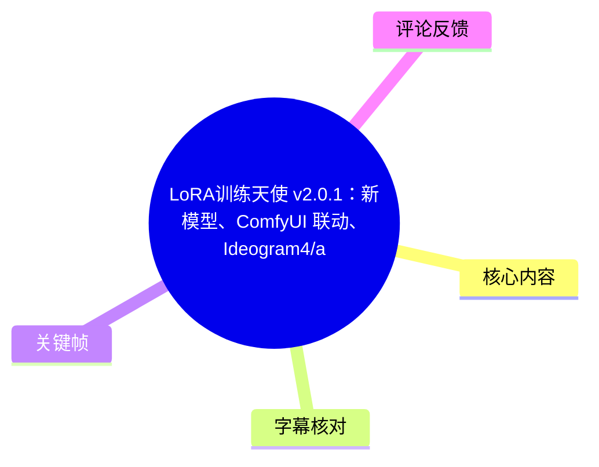
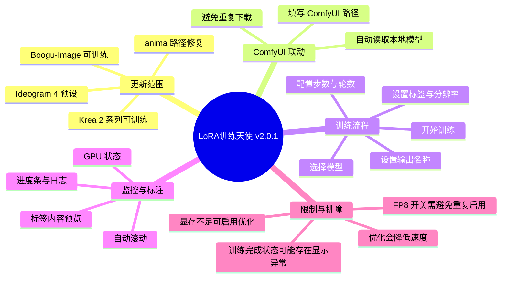
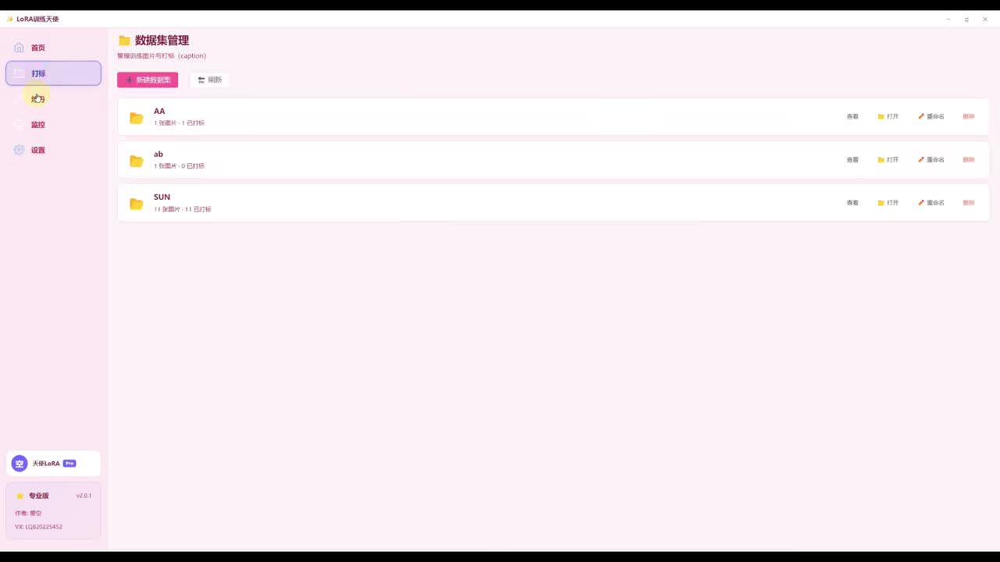
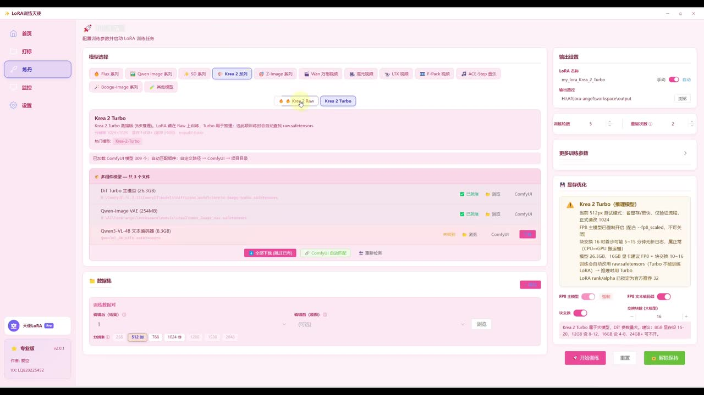
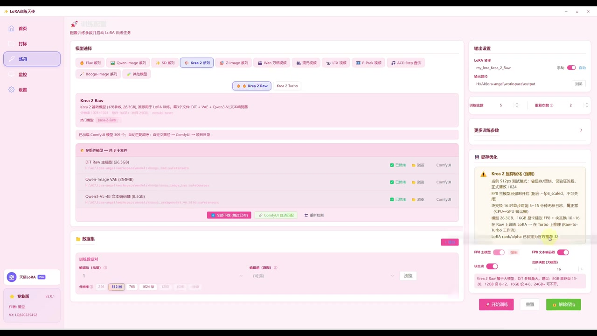
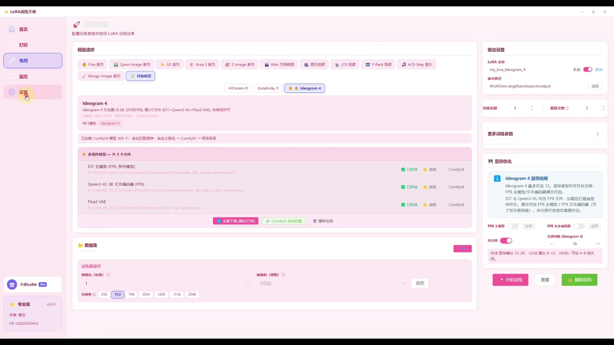

# LoRA训练天使 v2.0.1：新模型、ComfyUI 联动、Ideogram4/anima/boogu-image/Krea2训练修复。

> 来源：[Bilibili 视频](https://www.bilibili.com/video/BV1fATN6cEX6) 
> UP 主：LoRA训练天使｜时长：09:16｜标签：`lora训练`、`lora训练天使`、`lora`

## 小结

本视频演示了桌面端工具“LoRA训练天使”专业版 **v2.0.1** 的更新内容，重点是新增或调整模型训练入口、修复若干模型路径/训练问题，以及将本地 **ComfyUI** 已有模型目录接入训练工具，避免重复下载模型文件。

视频明确提到已经修复或可继续使用的模型包括 **anima、Krea 2 系列、Boogu-Image**；标题还列出 **Ideogram 4**。从界面关键帧可见，工具内提供 Krea 2 Raw、Krea 2 Turbo、Ideogram 4 等预设，并按不同模型展示依赖、显存建议、分辨率选项与参数开关。

最实用的更新是 ComfyUI 联动：用户可将 ComfyUI 的模型路径填写到工具中，让程序自动读取已存在的模型，而非重新下载或将文件再复制到本项目目录。此功能的前提是本机 ComfyUI 路径正确、模型文件与所选训练预设匹配。

训练演示采用了非常小的测试设置：**1 张图片、512 分辨率、约 5 步、2 轮**，目的只是快速确认流程和输出，并不构成适用于正式 LoRA 训练的数据规模或推荐超参数。UP 主还提到，对于某个演示模型使用了 **FP8**，并强调模型本身已是 FP8 时，相应 FP8 开关不应重复开启。

视频展示了训练日志、GPU 状态、进度条、自动滚动日志、日志置顶查看与标签预览等辅助功能。对于显存不足的机器，UP 主建议开启对应的显存优化/交换类开关；代价是训练速度可能变慢。演示末尾还出现“模型已保存但界面未停止”的现象，UP 主判断可能是切换造成的小 bug，并建议卡顿时清理缓存。

> **时效性提示：** 本文只记录视频及所给关键帧中可确认的 v2.0.1 状态。模型依赖、ComfyUI 路径结构、显存需求、下载可用性和软件 bug 均可能随版本变化；实际操作应以当前软件界面、更新日志和模型说明为准。

## 思维导图

## 目录

- [更新背景与版本范围](#更新背景与版本范围-0000)
- [模型修复与新增预设](#模型修复与新增预设-0030)
- [ComfyUI 模型目录联动](#comfyui-模型目录联动-0150)
- [训练配置与演示步骤](#训练配置与演示步骤-0250)
- [标注、日志与训练监控](#标注日志与训练监控-0410)
- [显存优化、完成状态与已知限制](#显存优化完成状态与已知限制-0710)
- [字幕比对](#字幕比对)
- [评论分析](#评论分析)
- [处理记录](#处理记录)

## 更新背景与版本范围 [00:00](https://www.bilibili.com/video/BV1fATN6cEX6?t=0)

UP 主说明自己通宵完成了“LoRA训练天使”的一次更新，本期针对主题/UI与模型训练支持进行展示。视频中的界面为粉色浅色主题；UP 主也提到可选择深色版与中性版，其中中性版被描述为更护眼、也更符合“天使”风格。

工具左侧导航在关键帧中可见“首页、打标、练习、设置”等入口。首页的数据集管理页面以文件夹形式呈现数据集，并显示每个数据集的图片数量和标签状态；这说明软件将数据准备、打标和训练组织在同一客户端内。

> 图：该帧展示“数据集管理”界面和左侧功能入口。它有助于确认视频所讲工具并非只提供单一训练按钮，而是包含数据集管理、标注和训练的连续工作流。

### 本期可确认的更新重点

1. 改善 UI 与使用便利性。
2. 修复 anima 的路径相关问题。
3. 使 Krea 2 系列可进行打标和训练。
4. 使 Boogu-Image 可训练。
5. 展示 Ideogram 4 训练预设。
6. 增加或重点展示 ComfyUI 本地模型自动读取能力。
7. 补充训练过程日志、GPU 监控、自动滚动与标签显示等体验功能。
8. 修复触发词相关的小 bug，但视频未给出该 bug 的具体复现条件与修复版本细节。

## 模型修复与新增预设 [00:30](https://www.bilibili.com/video/BV1fATN6cEX6?t=30)

UP 主称，**anima** 的路径“已经完全修复”，用户可继续使用；但 ASR 对模型名称识别存在不稳定，因此本文保留视频标题中的写法“anima”，不进一步推断其具体模型仓库、架构或版本。

随后，UP 主表示 **Krea 2 系列**已经可以打标并训练出图；**Boogu-Image** 也可以训练。有相应需求的用户可下载使用。关键帧中的模型标签还可见 Flux、Qwen Image、SD 系列、Z-Image、Wan、Hunyuan、LTX、F-Pack、ACE-Step、Boogu-Image 等入口，但视频未逐一说明所有入口均为本次新增或均经过测试，因此不能将它们全部视作 v2.0.1 新功能。

### Krea 2 Raw 与 Krea 2 Turbo

从界面可见，Krea 2 训练入口区分为：

- **Krea 2 Raw**
- **Krea 2 Turbo**

两者均列出了需要的模型文件，并以状态标记显示“已安装”或可下载状态；界面中还提供“全部下载（缺少已选）”、`ComfyUI 自动匹配` 与“重新检测”等操作。

> 图：该帧直接展示 Krea 2 Turbo 的模型选择、依赖检查、训练数据设置和右侧显存优化区域，是理解“先选预设、再确认依赖与参数”流程的关键依据。

> 图：该帧显示 Krea 2 Raw 与 Turbo 是独立预设，且二者依赖/显存说明可能不同。因此实际训练时不应仅因同属 Krea 2 就默认复用全部参数和模型文件。

关键帧右侧的 Krea 2 Turbo 提示框可辨识出以下信息：

- 默认训练分辨率提到 **512px**；
- 文案提示高分辨率训练可能仅建议在更高显存条件下使用；
- 提到 **FP8** 选项；
- 提到可根据显存状况调整设置；
- 提示中存在多个显存档位/建议，但画面文字并非全部清晰，本文不把无法可靠辨认的具体显存数字作为精确配置结论。

### Ideogram 4

视频标题点名 Ideogram 4，关键帧也显示了 **Ideogram 4** 预设。其依赖列表在画面中可见包括：

- DiT 模型（FP8，具体文件名画面不完全清晰）；
- Qwen3-VL-8B 文本/视觉模型；
- Flux2 VAE。

界面说明框还显示 Ideogram 4 需要一定显存，支持不同分辨率档位，并提供 FP8 相关控制项。由于视频没有实测 Ideogram 4 的完整训练过程，也没有展示成功样张，因此只能确认该预设已出现在工具界面及本期更新范围中，不能据此评估其训练质量或稳定性。

> 图：该帧为 Ideogram 4 支持情况的直接视觉证据，尤其展示了模型依赖列表与右侧显存说明，便于使用者在下载前先检查本地资源与硬件条件。

## ComfyUI 模型目录联动 [01:50](https://www.bilibili.com/video/BV1fATN6cEX6?t=110)

本次最关键的体验更新是 **ComfyUI 自动匹配/读取**。UP 主描述的目标是：若用户的模型已经位于本地 ComfyUI 目录，则不必再下载一次，也不必手动将模型文件复制到 LoRA训练天使的项目目录。

### 使用逻辑

1. 在 LoRA训练天使中选择要训练的模型预设。
2. 将本机 **ComfyUI 的路径**填入软件指定位置。
3. 工具自动扫描/读取该路径下匹配的模型。
4. 已被识别的模型会显示在依赖列表中，减少重复下载。
5. 若未正确识别，界面还提供重新检测和下载缺失文件等操作。

### 使用条件与边界

- 视频只说明“填入 ComfyUI 路径”即可读取，没有明确展示 Windows、macOS 或 Linux 的具体路径格式。
- 自动匹配依赖于模型文件确实放在该 ComfyUI 目录中，且文件版本、名称或目录结构能被软件识别。
- 若工具要求的文件与用户已有文件不是同一版本、格式或命名，仍可能显示缺失；此时不能简单假定已有文件一定可复用。
- 视频没有展示网络下载流程、代理配置的完整规则，只提到部分场景可能需要“魔法/网络工具”，且不同工作流的强制要求不同。该说法属于 UP 主经验描述，未给出可复现的判断标准。

## 训练配置与演示步骤 [02:50](https://www.bilibili.com/video/BV1fATN6cEX6?t=170)

视频中的训练页把操作聚合为模型选择、依赖检查、数据集/标签、输出设置、训练参数和开始训练几个区域。UP 主强调基本流程较少：选择模型、选择或处理标签、设置后点击训练；在满足默认配置的情况下，部分参数可不修改直接运行。

### 实际操作顺序

1. **选择模型预设**  
   在顶部模型区域选择目标模型，例如 Krea 2 Raw、Krea 2 Turbo 或 Ideogram 4。选择后，界面会显示模型说明、依赖文件和推荐/可选配置。

2. **检查或下载依赖模型**  
   查看依赖列表状态。若已通过 ComfyUI 自动匹配读取，则无需重新下载；缺失时可使用界面下载按钮补齐。

3. **选择训练数据集与标注分辨率**  
   选择用于训练的数据集。视频中提到打标分辨率存在多个可选项，“有哪个就点哪个”；关键帧能确认分辨率区包含 `256`、`512`、`768`、`1024` 等选项，具体可用项会随预设变化。

4. **设置 LoRA 名称与输出目录**  
   右侧“输出设置”中存在 LoRA 名称输入项和输出路径。UP 主演示了“自动”和“手动”两类命名：  
   - 自动：名称会随选择的模型而变化，便于区分训练所用模型；  
   - 手动：可自行键入名称，保存后界面显示为手动命名状态。  
   输出目录在画面中为软件工作区下的 `output` 路径示例，实际应按本机磁盘与项目位置设置。

5. **设置训练轮数、重复次数、步数或等价参数**  
   界面中可见“训练轮数（epoch）”和“重复次数”等参数。视频口述“跑多少步数，就显示多少步数”，说明软件会根据数据量和参数计算或显示训练进度。

6. **按模型状态处理 FP8 选项**  
   UP 主在演示中称某模型“直接用了 FP8”，并提醒模型本身已为 FP8 时，相关开关不应重复打开。由于 ASR 未能稳定识别具体开关名称，实际应以当前模型说明卡片的文字为准。

7. **点击开始训练并观察日志**  
   参数设置完成后点击“开始训练”，随后通过训练日志、GPU 信息、进度条与步数确认运行状态。

### 演示参数：仅用于快速验证

UP 主为缩短演示，使用了近乎最小的测试规模：

| 项目 | 视频演示值 | 解释 |
| --- | ---: | --- |
| 图片数 | 1 张 | 仅用于流程演示，不足以代表正常数据集 |
| 分辨率 | 512 | 视频口述并与界面选项相符 |
| 训练轮数 | 约 2 轮 | 口述为快速演示 |
| 步数 | 约 5 步 | UP 主中途口述“跑个五” |
| 模型精度 | 使用 FP8 的演示情境 | 应避免与模型自身精度设置重复冲突 |

> **不要照抄为正式训练方案。** 单图、少步数、少轮数只能说明按钮、依赖与训练链路大致能够启动，无法证明 LoRA 的泛化性、主体一致性、风格保持或过拟合控制表现。

## 标注、日志与训练监控 [04:10](https://www.bilibili.com/video/BV1fATN6cEX6?t=250)

UP 主展示了打标区域的几个体验调整：

- 修改打标位置后，可在页面上直接看到标签内容，而不必进入更深层页面查看；
- 支持自动打标；
- 可将文件拖入处理；
- UP 主表示，对不熟悉电脑操作的用户而言，打标流程可更直接；
- 在其演示环境中，打标约“一分钟”或“一分十几秒”完成，但这不是通用性能指标，会受图片数量、分辨率、模型下载状态、GPU、CPU 与磁盘性能影响；
- 修复了触发词的小 bug，但没有给出触发词规则、旧版本症状或验证示例。

### 日志与进度查看

训练过程中，视频展示了以下监控信息：

- **GPU 状态/利用率类信息**；
- 训练进度条；
- 当前步数或已完成比例；
- 训练日志中的时间、步骤和问题信息；
- 自动滚动日志；
- 可通过置顶/固定查看位置来阅读此前日志。

UP 主指出，自动滚动可以持续显示新日志；遇到问题可根据日志所报内容排查。视频没有给出具体错误码、完整日志文本或对应修复手册，因此不能把“诊断”功能理解为可自动解决所有训练错误。

## 显存优化、完成状态与已知限制 [07:10](https://www.bilibili.com/video/BV1fATN6cEX6?t=430)

### 显存不足时的处理

UP 主提到，显存不足时界面有对应开关可启用。其目的在于降低爆显存风险，使低显存设备仍有机会运行训练；UP 主举例提到 **8GB 显存**用户可以考虑开启。

但视频同时明确指出代价：启用此类显存优化/交换机制后，**速度会变慢**。因此它是“可运行优先”的折中，而不是免费提升性能的开关。

可迁移的判断原则是：

- 显存足够且当前模型说明没有要求时，优先遵循模型预设默认值；
- 出现显存不足或设备容量较低时，再尝试开启显存优化；
- 开启后应接受吞吐下降，并留意是否出现系统内存、磁盘交换或训练时间明显增长；
- 不应在不了解模型精度状态时盲目叠加 FP8/量化/显存优化开关。

### 完成后“未停止”的展示异常

演示训练达到 100% 后，UP 主观察到模型输出似乎已保存，但前端仍显示没有停止。他推测可能是操作切换导致的一个小 bug；又通过 GPU 使用率下降来判断任务大致不再继续计算。

UP 主给出的临时处理建议包括：

1. 等待程序自动停止；
2. 若确认已保存且 GPU 已基本不再运行，可尝试关闭相关界面/任务；
3. 若界面卡顿，清理缓存后再观察。

这属于视频中的经验性处理，而不是经过完整验证的故障修复流程。更稳妥的做法是：在关闭程序前确认输出目录中存在预期 LoRA 文件，并避免在仍有 GPU 高负载、日志继续刷新或文件仍在写入时强制结束进程。

### 下载与项目获取信息

视频简介称，用户可私信回复“lora训练天使”，并提供了百度网盘和夸克网盘链接。UP 主说明由于粉丝数量原因无法开启自动回复。链接有效性、文件版本、下载限制与安全性未在素材中验证，使用者应自行核验文件来源、校验完整性并遵循相关平台及模型许可要求。

## 结论与限制 [09:00](https://www.bilibili.com/video/BV1fATN6cEX6?t=540)

LoRA训练天使 v2.0.1 的核心价值在于把数据集管理、打标、模型依赖检查、训练参数、日志监控及本地 ComfyUI 模型复用整合在一个面向新手的界面中。对已有 ComfyUI 环境的用户而言，自动读取模型路径可减少重复下载和复制文件的麻烦。

但本视频是更新演示而非严格测评：没有提供完整模型版本号、下载文件校验值、不同显卡上的基准训练速度、正式数据集参数、生成对比图或跨平台安装指南。特别是训练质量不能由“单图、512 分辨率、少量步数和轮数”的演示推断。

实践时建议按以下顺序降低风险：

1. 先确认当前软件版本与目标模型预设是否匹配；
2. 检查 ComfyUI 本地路径和依赖文件是否被正确识别；
3. 用小规模测试确认能训练、能保存、能加载；
4. 再基于实际数据量、目标分辨率、显存和训练目标调整 epoch、重复次数与步数；
5. 保存关键日志、训练配置和输出文件，便于在异常停止时复盘。

## 字幕比对

本次任务中，**站内字幕与 ASR 均已获取并执行比对**。两份字幕内容明显不属于同一视频：站内字幕讲述的是 iPhone 16 钢化膜跌落、覆盖率、疏油层和透光率测试；本视频实际内容则是 LoRA训练天使 v2.0.1、模型训练、ComfyUI 联动与显存设置。因此站内字幕不能作为本文事实依据。

| 字幕来源 | 完整性 | 专有名词 | 时间轴 | 主要问题 |
| --- | --- | --- | --- | --- |
| Bilibili 站内字幕 | 与本视频内容完全不匹配 | 出现 iPhone 16、钢化膜等无关词 | 无可靠分段时间信息 | 疑似串片/错配字幕，不能用于本视频整理 |
| 本次 ASR 字幕 | 覆盖了更新说明、ComfyUI 联动、训练、打标、监控、显存优化及收尾 | 多个模型名和界面术语误识别明显 | 未提供逐句精确时间戳，按视频叙述阶段整理 | 存在口语断裂、同音错字及模型名误转写 |

### 最终字幕选择与校正原则

本文以 **本次 ASR 字幕为主**，结合视频标题、元数据、上下文及关键帧中的界面文本校正；站内字幕因主题完全错误而弃用。

已进行的关键术语校正包括：

| ASR 可疑转写 | 本文采用写法 | 校正依据 |
| --- | --- | --- |
| “看法ui”“看不下去” | ComfyUI | 视频标题、叙述上下文及界面中的 `ComfyUI` 按钮 |
| “科学二”“这个月二” | Krea 2 | 标题及关键帧中 `Krea 2 Raw`、`Krea 2 Turbo` |
| “不补”“不古不古” | Boogu-Image | 视频标题和模型标签 |
| “楼老天使”“血连天使” | LoRA训练天使 | 视频标题、UP 主名称及界面品牌 |
| “MP8” | FP8 | 训练精度上下文与界面 FP8 控制项 |
| “代表” | 标签/打标内容 | 标注功能的上下文 |

对于无法由画面、标题或上下文可靠确认的参数、文件名和具体显存数字，本文不作补写。

## 评论分析

以下仅处理可获取的热评前三条；评论代表个人陈述，不视为已验证事实。

1. **LoRA训练天使（2 赞）**  
   评论称软件采用“随喜模式”，由个人独立开发；并称训练算力消耗“超过 4 亿 token”，希望用户按意愿支持。  
   - 补充价值：说明项目的支持方式与开发者自述的投入背景。  
   - 可信度边界：这是开发者本人陈述，素材未提供算力账单、token 统计口径或财务数据，不能独立验证“超过 4 亿 token”的具体含义和成本。

2. **ooooooooachong（1 赞）**  
   评论希望 UP 主少装一个 AI 模型，原因是百度网盘空间不足。  
   - 补充价值：反映模型整合包或依赖文件可能占用较大下载/存储空间，用户存在网盘容量压力。  
   - 可信度边界：评论未说明所指具体模型、文件体积和软件是否允许按需安装，不能据此认定工具强制安装全部模型。

3. **EX正义（1 赞）**  
   评论内容为“好耶”。  
   - 补充价值：表达对更新的正向反馈。  
   - 可信度边界：未包含具体使用体验、技术问题或可验证补充信息。

## 处理记录

- Worker ID：`worker-mrj0www4-e8d79408`
- 模型：`gpt-5.6-terra`
- 素材范围：视频元数据、视频简介、12 张关键帧路径清单、站内字幕、本次 ASR 字幕、可获取热评前三条。
- 工具：素材采集流程已产出 `merged.mp4`、`audio/audio.wav`、`frames/`、`comments/comments.json`、`subtitles/`、`asr/` 等目录；本整理仅依据任务提供的已采集结果生成。
- 字幕选择：站内字幕内容为手机钢化膜测试，与本视频主题完全不符，判定为错配并弃用；本次 ASR 已执行且作为主字幕来源，模型名、ComfyUI、FP8 等术语通过标题、界面关键帧与上下文校正。
- 关键帧依据：
  - `frames/frame-001.jpg`：数据集管理与功能导航，支撑工作流概述；
  - `frames/frame-002.jpg`：Krea 2 Turbo 的依赖、参数与显存区域；
  - `frames/frame-003.jpg`：Krea 2 Raw 与 Turbo 为不同预设的界面证据；
  - `frames/frame-004.jpg`：Ideogram 4 预设及依赖/显存说明。
- 缓存清理：素材清单仅确认采集任务已完成，未提供实际缓存清理日志；因此不宣称已执行文件删除或缓存清理。视频中 UP 主提出“卡顿时清理缓存”的建议，已作为其经验性建议记录。
- 未解决问题：
  - 无法从现有 ASR 精确恢复每一句的时间戳；
  - 无法可靠辨认部分模型依赖文件名与显存档位的完整文本；
  - 未提供软件安装包校验、版本更新日志、正式训练结果或跨硬件基准；
  - 演示末尾训练已保存但界面未停止的现象，视频未给出最终根因和正式修复状态。
