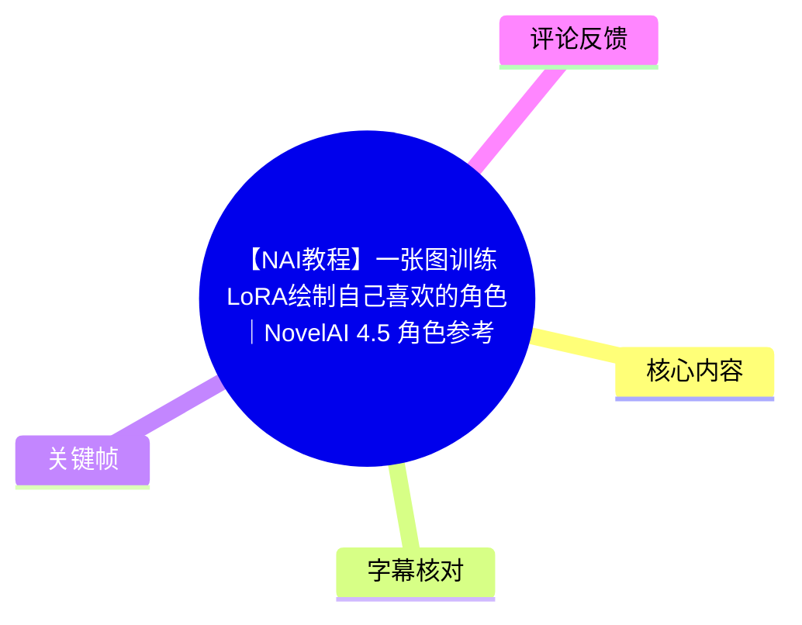
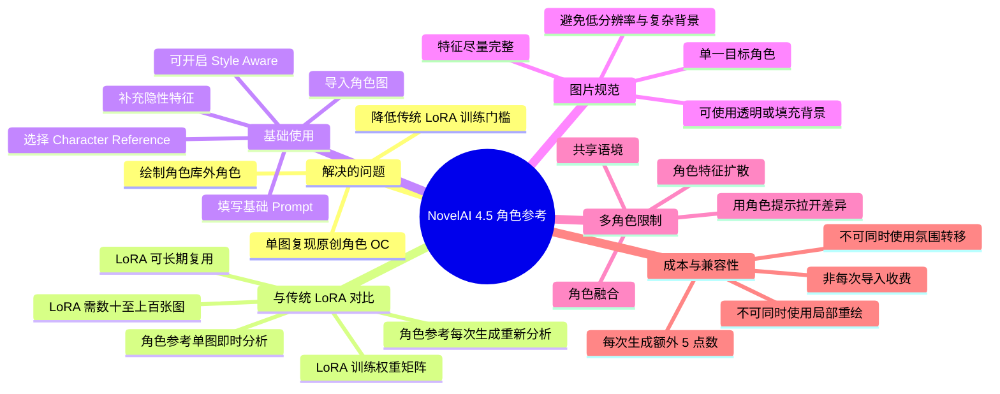
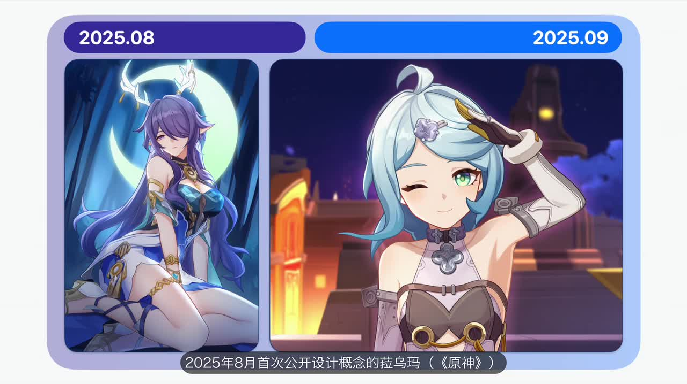
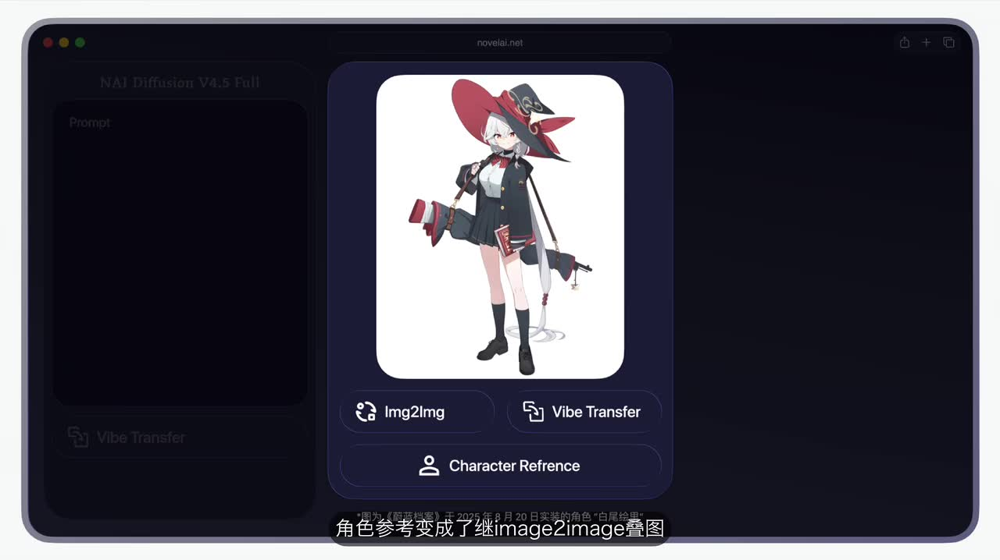
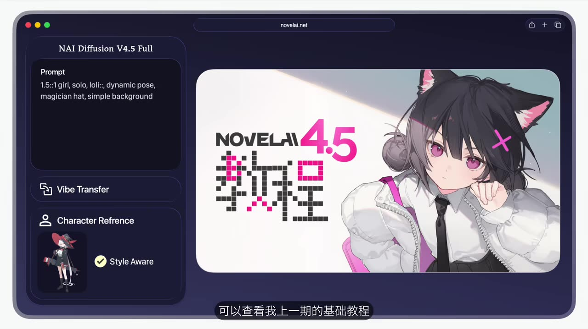
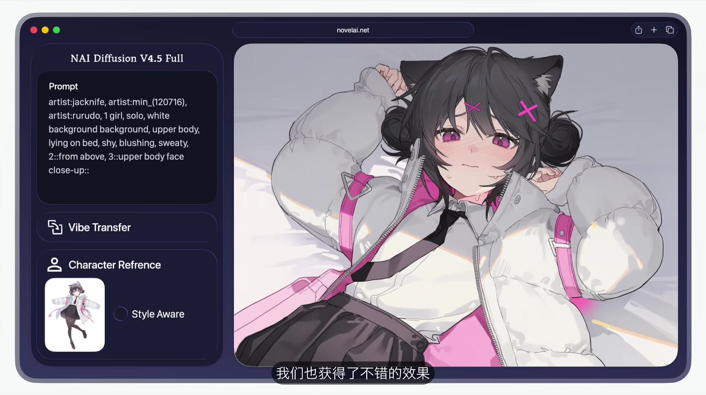

# 【NAI教程】一张图训练LoRA绘制自己喜欢的角色｜NovelAI 4.5 角色参考 教程

> 来源：[Bilibili 视频](https://www.bilibili.com/video/BV1rhpFzrEHZ) 
> UP 主：衡鲍｜时长：13:03｜所属合集：AIcode  
> 本文以视频内演示与 ASR 时间轴为准；其中关于 NovelAI 功能、点数、角色库更新时间均为视频发布时的陈述，可能已发生变化。

## 小结

视频介绍了 NovelAI 4.5 的 **Character Reference（角色参考）** 功能：用户上传一张角色图后，可让模型在当前生成中提取并参考角色的外观特征，从而绘制未被 NovelAI 角色支持库收录的新角色，或更方便地复现原创角色（OC）。这并不是传统意义上的 LoRA 训练；视频标题中的“一张图训练 LoRA”指向其使用体验，实际功能不需要训练和导出模型文件。

相较于传统 LoRA 通常需准备数十至上百张同角色图片、借助 Stable Diffusion 等工具训练权重修正矩阵，角色参考的优势是“上传单图、即时分析、即时生效”。但它只在本次采样中临时注入图像特征，每次生成都需重新分析；据视频陈述，使用一次角色参考生成会在基础费用外额外消耗 **5 点数**。

实操上，角色参考入口位于 NovelAI 制图界面中 Vibe Transfer（氛围转移）下方；导入外部图片后，会与 Img2Img、Vibe Transfer 一并显示。默认可开启 **Style Aware（风格感知）**，以增强对导入图画风的转移。作者建议日常保持开启，但在自己的 OC 测试中也演示了关闭该选项后，仅以提示词控制风格与动作的做法。

单角色场景中，角色参考对发色、发型、脸型、服装等“显性特征”还原较好；人物气质、常见神态、性格倾向等“隐性特征”并不会被可靠读取，必须由用户在 Prompt 中补充。否则模型容易服从作品风格词带来的刻板印象，而不是忠实地还原人物性格。

多角色场景是本功能的重要限制：角色参考提取的向量与主提示词、各角色提示词会共同参与采样，角色槽位并非天然一一绑定。两个角色共享 `girl`、风格等大语境时，参考角色的发色、配饰等特征可能扩散给另一角色，甚至融合为一个角色。作者的应对策略是分别详细描述每位角色的显性和隐性特征，以 Prompt 拉开差异、降低共享语境影响；但双人图的细节还原通常仍弱于单人图。

视频发布时，作者称 NovelAI 支持库更新截至约 **2025 年 6 月**，并以 2025 年 8 月、9 月公开设计概念的角色举例说明“库外角色”需求。这是强时效性信息；当前支持库范围、功能入口、兼容关系和点数规则应以 NovelAI 现行界面及官方说明为准。

## 思维导图

## 目录

- [背景：角色库外角色与传统 LoRA](#背景角色库外角色与传统-lora)
- [功能入口、Style Aware 与单图生成](#功能入口style-aware-与单图生成)
- [点数成本与 OC 测试](#点数成本与-oc-测试)
- [参考图规范与隐性特征补全](#参考图规范与隐性特征补全)
- [多角色生成、污染现象与原理](#多角色生成污染现象与原理)
- [降低多角色串扰的实操方法](#降低多角色串扰的实操方法)
- [资源、适用边界与时效性](#资源适用边界与时效性)
- [字幕比对](#字幕比对)
- [评论分析](#评论分析)
- [处理记录](#处理记录)

## [背景：角色库外角色与传统 LoRA](https://www.bilibili.com/video/BV1rhpFzrEHZ?t=34)

视频首先说明角色参考功能出现前的限制：NovelAI 只能较稳定地生成角色支持库中已有的固定角色。作者称，截至视频发出时，支持库更新大约停留在 **2025 年 6 月**；因此后来公开设计的新角色可能尚未被收录。

作者以两张图片展示角色库更新滞后与新角色需求：左图标注为 2025 年 8 月首次公开设计概念的“拉乌玛（《原神》）”，右图则标注 2025 年 9 月。视频称，这类库外角色的示例图均由 NovelAI 4.5 的角色参考功能生成。

> 图：该帧用具体角色图说明“角色公开时间晚于知识库更新”的问题，是理解角色参考功能应用场景的直接证据。图片中的角色名称、作品归属及日期以画面和视频陈述为准。

### 传统 LoRA 与 Character Reference 的区别

| 维度 | 传统 LoRA（视频中的概括） | NovelAI Character Reference（视频中的概括） |
| --- | --- | --- |
| 数据准备 | 数十至上百张同角色图片 | 一张角色图 |
| 主要流程 | 使用 Stable Diffusion 等工具训练 | 上传后由内部模型分析 |
| 产物 | 新的权重修正矩阵 / 可复用角色模型 | 不保存为文件的临时特征向量 |
| 生效时间 | 训练完成后使用 | 即时分析、即时生效 |
| 复用方式 | 可长期复用训练成果 | 每次生成时重新分析 |
| 适用价值 | 适合长期、可控地训练专属模型 | 适合快速尝试库外角色、OC |

需要注意：以上是作者对两种技术路线的教学性解释，不等同于 NovelAI 官方公开的完整底层实现文档。尤其“向量注入采样流程”的描述，应理解为视频作者对现象和工作机制的说明。

## [功能入口、Style Aware 与单图生成](https://www.bilibili.com/video/BV1rhpFzrEHZ?t=76)

### 1. 找到角色参考入口

进入 NovelAI 制图界面后，角色参考入口位于 **Vibe Transfer（氛围转移）下方**。当用户先导入外部图片时，界面会提供三种后续方向：

1. `Img2Img`：叠图；
2. `Vibe Transfer`：氛围转移；
3. `Character Reference`：角色参考。

> 图：该帧清楚展示了导入图片后的 `Img2Img`、`Vibe Transfer` 与 `Character Reference` 三个选项，可用于定位功能入口，而非仅凭文字查找。

### 2. 导入角色图并开启 Style Aware

作者导入一张知识库外角色图后，NovelAI 自动勾选了 **Style Aware（风格感知）**。视频对该选项的经验判断是：

- 开启后可更好地还原角色；
- 同时会转移一部分导入图的风格；
- 实测中，风格转移强度较低，通常会被主提示词中的风格描述覆盖；
- 因而不必过度担忧导入图风格与目标 Prompt 风格互相污染；
- 作者建议常规生成时保持 Style Aware 开启，以获得更准确的结果。

> 图：该帧展示了左侧 `Character Reference` 已加载参考图、`Style Aware` 已勾选的状态，以及右侧生成结果；它对应视频关于“角色外观和原作画风均被较好还原”的演示。

### 3. Prompt 写法：先给基础画面，不重复写角色名与外观

在该单角色演示中，作者只填写基础提示词，并**不再额外添加角色名称或外观描述**，随后点击生成。视频称，在角色参考协助下，生成结果达到了较高的角色还原度，画风也尽可能转向原作风格。

这一做法可理解为最低限度测试：让参考图承担主要的外观信息，使用户观察该功能本身对角色识别的贡献。实际创作中，后文的案例表明仍需通过 Prompt 明确补充模型不可见的气质、性格与神态信息。

## [点数成本与 OC 测试](https://www.bilibili.com/video/BV1rhpFzrEHZ?t=164)

### 点数规则：每次生成额外 5 点数

作者指出，角色参考因为存在额外计算开销和更复杂的采样融合，收费高于部分常规方式。根据视频发布时的说明：

- 每次使用角色参考进行生成，**额外消耗 5 点数**；
- 这里是“额外”消耗，即使最高等级会员的基础生成费用为 0 点数，角色参考仍会产生 5 点数费用；
- 收费单位是**每次生成**，不是每次导入参考图；
- 对比之下，作者称叠图在生成时可节约点数，而氛围转移为每次导入一次性收费 2 点数。

这些成本规则直接决定试错策略：在角色参考下反复抽卡的成本更高，应尽量在导入图质量、角色 Prompt 与构图要求上提前降低错误率。

### OC（原创角色）测试

在约 03:14 的案例中，作者以自创角色进行测试：

1. 导入 OC 图；
2. 关闭 `Style Aware`；
3. 在提示词中填写画风、动作等画面需求；
4. 生成后得到作者评价为“不错”的结果。

> 图：该帧显示参考图已载入而 `Style Aware` 未开启，同时左侧 Prompt 包含画风、画面与动作描述。它说明 Style Aware 并非功能使用的强制条件，但作者仍建议日常开启以追求更准确的角色还原。

## [参考图规范与隐性特征补全](https://www.bilibili.com/video/BV1rhpFzrEHZ?t=221)

### 参考图选择规范

作者给出了导入图片的经验规则，可整理为以下检查清单：

| 项目 | 建议 | 原因 |
| --- | --- | --- |
| 主体数量 | 最好只包含目标角色 | 避免多个角色造成识别对象不明确 |
| 背景与特效 | 不要有干扰性背景特效；背景不宜刻意复杂 | 降低画面无关信息对识别的干扰 |
| 分辨率 | 不宜过低；追求更好效果时，可使用 NovelAI 预设中较大的三种图片尺寸 | 保留服饰、五官等可识别信息 |
| 人物完整性 | 人物尽量完整，重点是“特征完整” | 避免关键发型、面部或服饰信息缺失 |
| 遮挡 | 尽量避免闭眼等遮挡角色特征的状态 | 角色参考难以从不可见部分稳定推断特征 |
| 取景 | 可以是全身、上半身或立绘 | 按目标出图构图选择 |
| 背景透明度 | 可为透明通道，也可有填充背景 | 透明背景不是必要条件 |
| 半身目标 | 若目标是上半身，最好导入对应半身立绘 | 让输入构图与预期输出更一致 |

### 显性特征与隐性特征

作者认为，Character Reference 主要识别的是图像中可见的显性信息，例如：

- 发色；
- 发型；
- 脸型；
- 服装；
- 配饰和其他可见外观元素。

但角色的气质、人物性格、常见表情、神态倾向等属于模型无法直接从单张图稳定读取的“隐性特征”。即使画面第一眼看起来像目标角色，也可能没有复现其冷静、神出鬼没等风格特质。

因此，推荐的单角色工作流是：

1. 用干净、特征完整的单角色图建立外观锚点；
2. 在主 Prompt 写清风格、构图、动作；
3. 在角色 Prompt 主动补充性格、神态、情绪、典型姿态等隐性设定；
4. 对照输出检查“外观”和“神态”是否同时达到预期；
5. 若只还原外观而神态不对，优先修改隐性描述，而不是单纯重复抽卡。

作者以《蔚蓝档案》小鸟游星野的例子说明风险：一次生成中既未加入角色参考、也没有写角色名，只写了作品风格词，模型却基于统计关联靠近了该作品中的“典型角色”形象。该例用来警示：**风格词可能带来角色刻板印象，不能替代具体角色设定。**

在补充隐性特征后，作者称再次生成的结果同时具备了角色显性和隐性特征，实现外观与神态的“双还原”。

## [多角色生成、污染现象与原理](https://www.bilibili.com/video/BV1rhpFzrEHZ?t=355)

### 多角色案例中的问题

作者先以主提示词生成一个已存在于知识库内的角色，再导入一张未收录的新角色图用作角色参考。角色提示中：

- `角色 1`：填写原角色名称；
- `角色 2`：填写导入角色的明显特征，用于区分两人。

生成结果总体还原出两名角色的各自特征，但角色 1 的手套等细节被污染。作者主观给该图约 **80 分**，说明多角色结果可用但并不稳定。

### 兼容性限制

视频明确指出，角色参考与下列功能不能同时使用：

- Image-to-Image 叠图的子功能；
- 局部重绘（作者提及常用 `Impact` 局部重绘修正错误）；
- Vibe Transfer（氛围转移）。

这意味着在多角色图中出现局部污染时，不能直接沿用作者惯常的局部重绘修正方案；再加上每次角色参考生成会额外耗费 5 点数，前置 Prompt 约束尤为重要。

### 视频中的机制解释

作者用传统 LoRA 与角色参考的差别解释多角色串扰：

1. 传统 LoRA 的训练目标，是得到一组权重修正矩阵，让模型学习“该角色长什么样”，并实现长期复用。
2. Character Reference 则在生成前由内部模型分析导入图，抽取发色、发型、脸型、服装等关键特征为一个向量。
3. 该向量不会保存为文件，而是直接注入本次采样流程；用完即弃，因此下一次生成要重新分析并再次收费。
4. 多角色时，主 Prompt、角色提示词和参考向量会共同作用于采样。即使写了 `2 girls`，并分别填写角色提示词，模型也不天然保证 `slot 1` 必然完全对应角色 A、`slot 2` 必然完全对应角色 B。
5. 当两人共享 `girl`、同一作品风格等大语境时，角色参考中的外观信息就可能扩散到另一个角色。

作者总结了两种典型后果：

- **轻度污染**：参考角色 B 的发色、配饰等跑到文字角色 A 身上；
- **严重融合**：只生成一个角色，外观混合 A 与 B 的特征。

因此，角色参考在多角色任务中的整体还原度通常低于单角色任务。这是视频中的经验结论，不代表所有 Prompt、构图和角色组合均会得到同样结果。

## [降低多角色串扰的实操方法](https://www.bilibili.com/video/BV1rhpFzrEHZ?t=523)

作者给出第二个双人案例以尝试弱化串扰：

1. 导入知识库外角色 `Sui` 的图片作为角色参考；
2. 在主提示词写明大场景：基本风格、黄昏背景、河边、两名角色、一男一女、站立互动等；
3. 在角色提示词中细化导入角色的显性与隐性特征，如女孩、黑发、凌乱头发、刘海等；
4. 在 `角色 2` 中写明另一人的信息：中年武士、大草帽、深色斗篷等；
5. 观察输出并与单人版本比较。

结果并不完美，但作者认为角色、互动、风格与背景基本实现。随后他单独重新生成目标人物的单人图，确认其细节还原明显优于双人图。

### 可执行的 Prompt 约束策略

根据视频案例，可归纳为：

- **主 Prompt 只定义共用画面层**：人数、性别组合、环境、时间、互动和统一画风；
- **角色 Prompt 分别定义人物层**：每个角色单独写发色、发型、服装、身份、姿态、气质等；
- **同时写显性与隐性特征**：不要只写“黑发”“斗篷”等外观，也补充人物状态或性格倾向；
- **拉开角色语义差异**：两人越容易共享同类标签，越需要用具体细节区分；
- **先单人验证再做双人图**：先确认参考角色在单人状态下的外观与神态，再进入多角色组合；
- **把第一次双人输出当作诊断结果**：优先修正遗漏或相似的角色描述，避免只靠重复生成消耗点数。

视频最终将策略概括为：单人模式重点补齐隐性特征；双人模式则应尽量分别描述两个角色的显性或隐性特征，以 Prompt 增强约束、减少共享语境造成的扩散。

## [资源、适用边界与时效性](https://www.bilibili.com/video/BV1rhpFzrEHZ?t=621)

### 视频提供的资源

根据视频简介与结尾说明，作者提供或提及：

- NovelAI 图像生成入口：<https://novelai.net/image>
- 参考文件下载：夸克网盘与 Mega 网盘链接，见视频简介；
- QQ 与 Discord 交流群，具体状态与可用性以简介或作者动态置顶为准；
- Bilibili 小店中的幻灯片原文件，作者称其中包含设计思路、排版动画以及视频中出现的图片文件；
- Patreon 支持与购买渠道，面向支付方式受限的观众。

外部网盘、群组邀请、商店内容和 Patreon 页面均可能失效、变更或受地区/账户限制，本文不对其持续可用性作保证。

### 适用范围与限制汇总

| 适用情形 | 推荐程度 | 理由 |
| --- | --- | ---|
| 单个库外角色 | 高 | 单图即可建立明显外观参考，且不需训练 |
| 原创角色 OC | 高 | 可用立绘快速建立外观锚点，再用 Prompt 补充设定 |
| 只需临时尝试某角色 | 高 | 无需准备大规模训练集，也无需保存 LoRA |
| 希望长期稳定复用的角色模型 | 需权衡 | 视频中传统 LoRA 具备模型文件与长期复用优势 |
| 两名或更多角色同框 | 中等 | 容易出现特征扩散、污染或融合 |
| 需要局部重绘修错 | 不适合当前组合 | 视频称角色参考不能与局部重绘等功能同时使用 |
| 高频反复抽卡 | 成本需评估 | 每次生成额外 5 点数，试错成本累积明显 |

### 时效性说明

本视频约于 2025 年 9 月发布。下列信息具有明显时效性：

- NovelAI 支持库更新截止时间；
- Character Reference 的界面位置；
- `Style Aware` 默认状态及实际表现；
- 与叠图、局部重绘、氛围转移的兼容关系；
- 每次生成额外 5 点数、氛围转移 2 点数等收费规则；
- 简介中的网盘、社群、商店与 Patreon 链接。

在实际操作前，应以 NovelAI 当前产品界面、账户套餐和官方公告为准。

## 字幕比对

| 字幕来源 | 完整性 | 专有名词 | 时间轴 | 主要问题 |
| --- | --- | --- | --- | --- |
| Bilibili 站内字幕 | 未提供可用字幕 | 无法核验 | 无可用分段 | 素材明确标注“未提供可用站内字幕” |
| 本次 ASR 字幕 | 较完整，语音覆盖约 595.15 秒，占视频约 76.03% | 存在音近误识别 | 完整 SRT 分段可用 | `NovelAI` 常被识别为“NobleAI”；`LoRA` 被识别为“Laura”；部分“角色库 / 支持库”“提示词”等词有误识别 |

最终采用本次 ASR 的 SRT 时间轴作为章节定位依据。ASR 诊断显示：

- 识别语言：中文；
- 模型：`medium`；
- 语言置信度：0.99658203125；
- 音频总时长：782.814 秒；
- 首段语音：00:00:34.060；
- 末段语音：00:11:08.950；
- 未标记 `noAudioStream=true`，因此源视频存在音轨，本次 ASR 不是无音轨情况下的替代方案。

结合视频标题、画面中界面文字与上下文，对正文中的关键术语做了规范化处理：

- ASR “NobleAI”统一为 **NovelAI**；
- ASR “Laura”统一为 **LoRA**；
- “角色参数功能”按视频主题与界面文字规范为 **角色参考 / Character Reference**；
- ASR 中“知词库”“支持庇”等表述统一为 **角色支持库 / 知识库**，但不额外推断两者是否为官方正式术语；
- “Style Aware”“Vibe Transfer”“Img2Img”“Impact”等英文功能名按视频画面和语境保留。

## 评论分析

> 仅处理素材中实际可获取的热评。任务数据请求前三条，但仅返回 2 条，以下不补造第 3 条。

### 1. 嗷呜wuwu｜172 赞

评论者认为角色参考“出人意料地好用”，并从个人体验补充其价值：过去需要置备硬件、反复训练，现在可通过“单图加描述”获得较高还原率。评论还将 AI 快速出图与约稿成本、画师制作周期进行对比，表达对生产效率提升的震撼，同时也对画师职业生态和时代变化表现出复杂、克制的情绪。

这条评论与视频“降低训练门槛、单图即时生效”的核心观点一致，但其中关于约稿价格、画师耗时及 AI 对行业影响的陈述属于个人经历和感慨，不应视作可普遍验证的行业统计结论。

### 2. 配達員エクシア｜120 赞

评论者补充了复杂度边界：对于《碧蓝档案》这类角色设计元素相对少的图，角色参考还原度较好；遇到设计复杂或特别冷门的人物，即使使用 LoRA，也不能保证百分之百还原。

该观点与视频的核心限制相契合：角色参考并非绝对的角色复现工具，输入图质量、角色复杂度、Prompt 完整性与生成任务复杂度都会影响结果。评论中针对特定作品和“复杂设计”的判断是使用者经验，具有参考价值，但未提供对照样本或测试参数。

## 处理记录

- Worker ID：`worker-mrj0www4-e8d79408`
- 模型：`gpt-5.6-terra`
- ASR 模型与运行信息：`medium`，中文识别，CUDA，`float16`
- 使用的素材工具产物：视频元数据、ASR 时间轴 SRT、ASR 分段诊断、关键帧目录、热评 JSON、视频简介。
- 字幕选择：站内字幕未提供可用文件；已检查本次 ASR，采用其带毫秒时间戳的 SRT 作为全部章节时间轴依据，并对明显音近误识别进行术语规范化。
- 关键帧选择依据：选用已提供画面中能够直接支撑正文论点的帧——`frame-001.jpg` 用于库外角色需求背景，`frame-002.jpg` 用于角色参考入口，`frame-003.jpg` 用于 Style Aware 状态与效果，`frame-004.jpg` 用于关闭 Style Aware 的 OC 示例；所有图片均以相对路径引用。
- 评论处理：仅分析可获取热评前 2 条；素材未提供第 3 条，未进行补充或推测。
- 缓存清理：提供的素材中没有缓存清理执行日志，无法确认是否已执行；本文未声称完成未记录的清理操作。
- 未解决问题：未提供 NovelAI 当前官方功能文档，无法独立核验视频所述点数规则、功能兼容性和角色支持库状态在视频发布后的变化。
