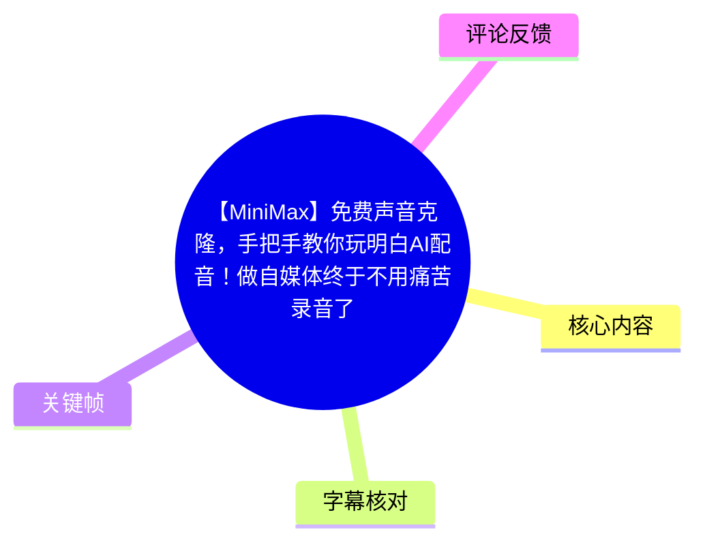
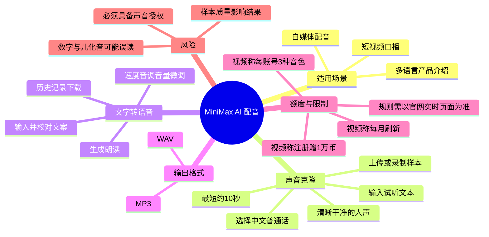
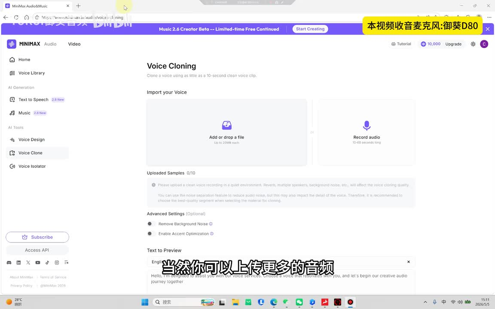
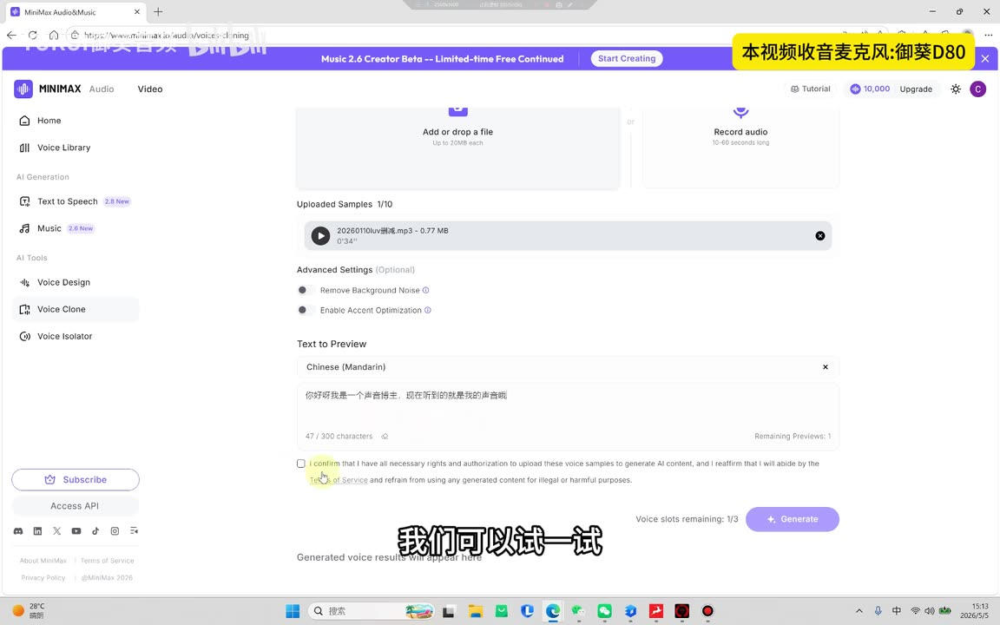
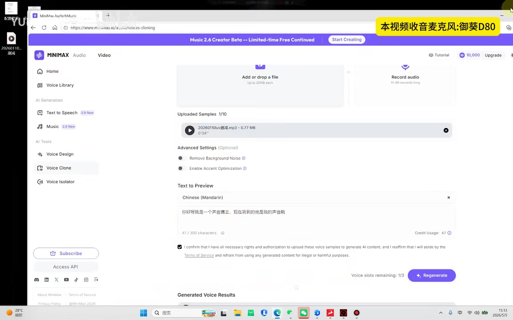
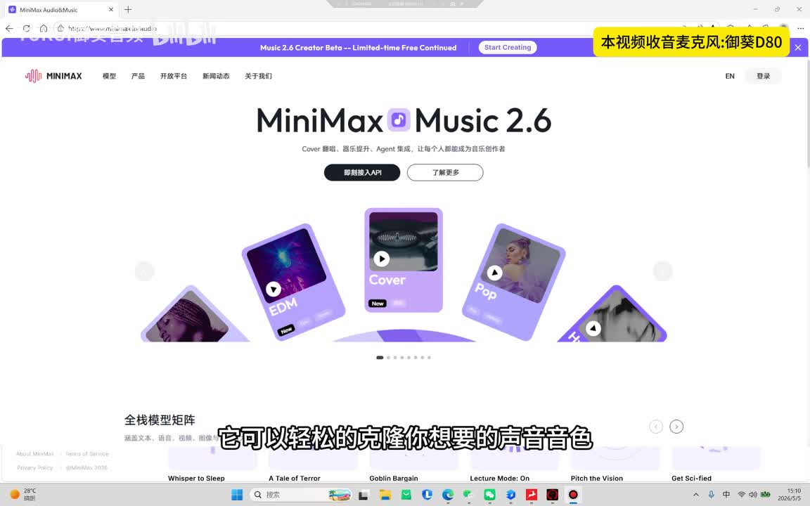

# 【MiniMax】免费声音克隆，手把手教你玩明白AI配音！做自媒体终于不用痛苦录音了！！

> 来源：[Bilibili 视频](https://www.bilibili.com/video/BV1Uk546bEyW) 
> UP 主：YUKUI御葵音频｜视频时长：4 分 55 秒｜分辨率：1728 × 1080

## 小结

视频演示 MiniMax Audio 的 **Voice Cloning（声音克隆）** 与后续 **Text to Speech（文字转语音）** 流程，面向不愿反复录制口播、希望快速制作配音的短视频创作者。核心路径是：上传或录制一段干净的人声样本，选择语言并输入试听文本，生成并保存声音模型，再以该模型朗读文案。

视频中的关键门槛是样本音频：讲解者称最短约 **10 秒**即可建模，但反复强调应使用清晰、干净、尽量无杂音的单人语音，否则克隆质量会受影响。画面进一步显示上传单个文件上限为 **20 MB**，也提供 **10–60 秒**的录音入口。

完成建模后，可以在文本转语音界面输入文案，先检查数字、儿化音等可能被 AI 读错的内容，再生成音频。视频展示可调节速度、音调、音量，并提到可以选择面向不同国家/语言的声音；历史记录中的成品可导出为 MP3 或 WAV。

视频把“注册赠送 1 万币、每月刷新、每个账号可克隆 3 种音色”作为当时的使用说明，并据此判断普通使用“正常来说够用”。这属于视频发布时的产品策略陈述，**不能视为当前仍然有效的官方承诺**：热评中已有用户反馈账号没有积分、免费克隆受限或需要充值，实际额度、计费规则、克隆数量与功能入口应以使用时官网为准。

声音克隆涉及人格、隐私、肖像及录音使用授权。演示页面也要求用户确认拥有上传样本及生成内容所需权利；因此仅应克隆自己或已获明确授权的声音，不应将工具用于冒充、误导或侵害他人权益。

## 思维导图

## 目录

- [场景、工具入口与样本要求](#场景工具入口与样本要求)
- [创建声音模型：上传、语言、试听与保存](#创建声音模型上传语言试听与保存)
- [用已建音色生成配音](#用已建音色生成配音)
- [参数微调、语言选择与导出](#参数微调语言选择与导出)
- [额度、应用场景与时效性](#额度应用场景与时效性)
- [完整实操清单](#完整实操清单)
- [限制、风险与验证边界](#限制风险与验证边界)
- [关键帧索引](#关键帧索引)
- [字幕比对](#字幕比对)
- [评论分析](#评论分析)
- [处理记录](#处理记录)

## 场景、工具入口与样本要求 [00:30](https://www.bilibili.com/video/BV1Uk546bEyW?t=30)

视频首先针对两类痛点：一是创作者不习惯或不愿意开口录口播；二是自行录制时，音色、音质不理想，需要反复重录。讲解者将 MiniMax 作为替代方案，称其可通过短音频建立目标声音的模型，并强调视频演示时该功能可免费使用。

操作入口位于 MiniMax Audio 页面左侧的 **Voice Clone**。从关键帧可以确认，页面左栏还包括 Home、Voice Library、Text to Speech、Music、Voice Design、Voice Isolator 等入口；本视频只实际演示了 Voice Clone 与 Text to Speech 相关流程。

声音样本质量决定后续效果。视频的经验是：

1. 上传尽可能清晰、干净的语音；
2. 避免背景噪声、多位说话人、明显混响等干扰；
3. 可上传更多音频，但视频没有给出“更多样本一定更好”的量化标准；
4. 声音样本应为用户本人所有，或已经取得充分、明确的授权。

> 图：关键帧展示 Voice Cloning 的核心入口。页面可见“Add or drop a file（上传或拖放文件）”与“Record audio（录音）”，并标示单文件最高 20 MB、录音长度 10–60 秒。这是核对样本提交方式和界面限制的重要画面依据。

## 创建声音模型：上传、语言、试听与保存 [00:49](https://www.bilibili.com/video/BV1Uk546bEyW?t=49)

### 1. 上传样本并选择语言

讲解者在上传音频后，将语言选择为 **Chinese (Mandarin)**，随后输入一段文本作为试听内容。画面显示可上传文件或直接录音；ASR 中“最短是 10 秒”的说法与画面中录音入口的“10–60 seconds long”并不冲突：前者是讲解者说明的最低建模门槛，后者是页面所示录音入口长度范围。

> 图：画面显示已上传 1 个样本、语言为 Chinese (Mandarin)、文本输入框及生成按钮。它补充了 ASR 未完整识别出的可视参数：页面当时显示文本上限 300 characters，并要求勾选确认拥有上传声音样本的必要权利和授权。

### 2. 输入试听文案并生成

[01:00](https://www.bilibili.com/video/BV1Uk546bEyW?t=60) 讲解者称等待几秒即可生成试听结果。随后依次播放原始音频和生成音频，并以主观听感判断“非常像”。

这里应区分两层信息：

- **视频演示事实**：该演示中生成了试听声音，并播放了原音与生成结果。
- **讲解者主观判断**：其认为生成结果“非常像”。
- **不可从视频推出的结论**：不能据此保证每个样本、每种语言或每段文案均能达到相同相似度。

页面可见一次生成会消耗相应额度；在截图中，47 个字符的试听文本显示 `Credit Usage: 47`。这是演示页面当时的可视状态，不足以证明所有账号、所有模型始终按“每字符 1 币”结算。

### 3. 创建、命名并保存音色

[01:30](https://www.bilibili.com/video/BV1Uk546bEyW?t=90) 讲解者点击创建，为声音输入名称并保存。之后在声音条目后点击“使用”，进入文字转语音窗口；该窗口允许继续输入任意待生成文案。

> 图：关键帧显示页面底部的权限确认勾选项、`Voice slots remaining: 1/3` 及 `Regenerate` 按钮。它既说明生成/重生成处于克隆流程中，也提示声音槽位与授权确认是实际操作中的显性限制。

## 用已建音色生成配音 [01:54](https://www.bilibili.com/video/BV1Uk546bEyW?t=114)

进入文字转语音界面后，视频以一段童话故事为例，让已保存的声音朗读文本。讲解者给出的实用建议是：**生成前先人工检查文案**，尤其注意数字和儿化音等容易产生发音不符合预期的部分；如果无法接受某种读法，可通过改写文案规避。

视频示例中，生成完成后播放了以“小白兔”为内容的故事片段。讲解者认为效果“非常真实”，但该评价基于该条样本和该段文本，使用者仍应以自己的目标脚本试听验收。

建议的文本准备方式：

- 将阿拉伯数字改写为清晰的中文读法，或在生成前逐项试听；
- 对产品名、人名、缩写、单位和多音字进行单独校验；
- 对儿化音、方言表达和强口语化句子，准备替代写法；
- 长文案建议分段生成和检查，避免一处发音问题影响整段成片。

## 参数微调、语言选择与导出 [02:16](https://www.bilibili.com/video/BV1Uk546bEyW?t=136)

### 速度、音调、音量

[02:40](https://www.bilibili.com/video/BV1Uk546bEyW?t=160) 讲解者展示生成后的三个调节方向：

| 参数 | 视频中的调节方向 | 讲解者描述的听感目标 |
| --- | --- | --- |
| 速度 | 想更快时向右调整 | 加快朗读节奏 |
| 音调 | 想更高、更有情绪时提高 | 提升明亮感或情绪感 |
| 音调与速度 | 希望低沉、慢一些、更有磁性时向左调整 | 获得更沉稳的语感 |
| 音量 | 按需求调整 | 匹配成片的响度需求 |

视频没有展示这些控件的具体数值、可调范围或不同参数之间的耦合关系。因此，适合采用“小幅调整—重新试听—再修改”的方式，而不是将“向左/向右”理解成通用固定配方。

### 多语言声音与下载格式

[03:04](https://www.bilibili.com/video/BV1Uk546bEyW?t=184) 讲解者称，页面还可选择面向不同国家的声音，适用于海外账号、生意或多语言内容。视频没有逐项展示哪些语言、口音或音色当前可用，也没有验证跨语言克隆后的稳定性。

生成完成的文件可在 **历史记录** 中找到并下载到桌面，格式包括：

- **MP3**：讲解者称为压缩格式，通常使用已足够；
- **WAV**：讲解者建议在需要无损音质时选择。

“无损”是相对于 WAV 的未压缩编码特征而言，并不意味着 AI 生成语音本身在听感、发音或音色上没有损失；最终成片仍需试听。

## 额度、应用场景与时效性 [03:29](https://www.bilibili.com/video/BV1Uk546bEyW?t=209)

视频对账户规则的原始表述如下：

- 注册 MiniMax 后会获得 **1 万币**；
- 生成文字会扣除额度；
- 每月会刷新并重新赠送 **1 万币**；
- 每个账号可克隆 **3 种不同音色**；
- 页面中还有多种模型与不同国家、音色可供试听和选择。

这些是讲解者在视频录制时的说明，而非本次整理对产品政策的独立验证。关键帧仅能确认录制画面右上角显示 `10,000`，以及生成页出现 `Voice slots remaining: 1/3`；无法据此确认赠送周期、余额发放条件、价格、服务范围或地域差异。

[04:17](https://www.bilibili.com/video/BV1Uk546bEyW?t=257) 讲解者认为该工具适合：

- 自媒体创作者制作口播或故事朗读；
- 企业出海时制作多语言产品介绍；
- 需要快速生成服务说明等语音内容；
- 不想反复寻找配音员、安排录音和处理口语问题的场景。

这些是适用场景建议，不意味着 AI 配音可以完全替代专业配音。品牌广告、角色表演、法律/金融等高风险播报，以及需要精确情绪控制的内容，仍需更严格的听审、授权与质量流程。

## 完整实操清单 [00:30](https://www.bilibili.com/video/BV1Uk546bEyW?t=30)

依据视频实际演示，可按以下顺序复现：

1. 打开 MiniMax Audio 官网，进入左栏的 **Voice Clone**。
2. 选择上传音频或直接录音。
   - 视频口述：样本最短约 10 秒；
   - 页面画面：录音入口为 10–60 秒，上传单个文件最高 20 MB。
3. 提交清晰、干净、以单一说话人为主的声音样本。
4. 选择目标语言；视频示例为 **Chinese (Mandarin)**。
5. 输入用于试听的文本。
6. 确认自己对上传样本拥有必要的权利与授权，再执行生成。
7. 等待生成，分别试听原始样本和生成结果；若不符合预期，先检查样本质量和文本读法。
8. 创建声音模型，为其命名并保存。
9. 在声音条目中点击“使用”，进入文字转语音界面。
10. 粘贴待朗读的脚本，重点检查数字、儿化音、多音字、专名与缩写。
11. 生成音频并试听；按需要调节速度、音调和音量。
12. 在历史记录中找到成品，按需求下载：
    - 日常发布可选 MP3；
    - 需要未压缩文件时可选 WAV。

## 限制、风险与验证边界 [04:42](https://www.bilibili.com/video/BV1Uk546bEyW?t=282)

1. **样本质量限制**：噪声、混响、多说话人或不清晰录音会影响声音模型。视频未提供可量化的信噪比、推荐时长或最佳文件规格。
2. **文本可读性限制**：数字、儿化音等可能读得不符合预期，生成前的文本预处理和生成后的试听不可省略。
3. **情绪控制限制**：视频展示的是速度、音调、音量调节，没有说明如何实现更细腻的情绪，例如“快哭了”的压抑感或渐进式情感变化。
4. **额度与功能时效性**：1 万币、月度刷新、3 个音色槽位均为视频陈述；热评已出现“没有积分、需要充值”的反馈，说明不同账户或不同时点可能存在差异。
5. **跨语言能力未充分展示**：视频提到可生成不同国家的声音，但没有展示具体语种、音色质量、发音准确率或可用范围。
6. **授权与合规限制**：页面要求授权确认。技术可行不等于拥有使用他人声音的权利；不得将克隆声音用于冒充、诈骗、诽谤或其他违法、侵权用途。
7. **“免费”表述的边界**：标题与讲解均强调免费，但视频也明确提到生成会扣币，且评论存在充值反馈。更准确的理解是：视频演示时可能存在免费额度，而非无条件、无限制免费。

## 关键帧索引 [00:30](https://www.bilibili.com/video/BV1Uk546bEyW?t=30)

| 关键帧 | 正文位置 | 可确认信息 | 选用价值 |
| --- | --- | --- | --- |
|  | 场景与入口 | MiniMax Audio 网站首页及导航环境 | 说明视频是在网页端 MiniMax Audio 环境中演示，而非仅口头介绍。 |
|  | 样本要求 | Voice Cloning 页面、上传/录音入口、20 MB 与 10–60 秒提示 | 为样本提交形式和页面参数提供可视化佐证。 |
|  | 创建模型 | 已上传样本、Chinese (Mandarin)、300 字符输入限制、授权确认 | 对应“上传—选语言—填试听文本—确认授权”的核心步骤。 |
|  | 创建与额度 | 生成结果区域、重生成、剩余声音槽位显示 | 说明该流程含生成/重生成和槽位限制，不只是一次性上传。 |

## 字幕比对 [00:30](https://www.bilibili.com/video/BV1Uk546bEyW?t=30)

| 字幕来源 | 完整性 | 专有名词 | 时间轴 | 主要问题 |
| --- | --- | --- | --- | --- |
| Bilibili 站内字幕 | 未提供可用字幕 | 无从核验 | 无从使用 | 素材记录显示字幕工具因 `Invalid URL` 退出，未取得站内字幕。 |
| 本次 ASR 字幕 | 覆盖主要讲解内容；语音覆盖约 250.29 秒，占视频约 85.02% | 存在误识别 | 有真实起止时间，可用于章节定位 | 多个长句被合并为单条；“Voice Clone”“MiniMax”“音色”“上传”等词有识别错误或同音替代。 |

本次已检查 ASR 结果：识别语言为中文，语言置信度约 `0.9990`，使用 `medium` 模型、CUDA 与 float16 处理；ASR 最早语音时间为 **00:30.240**，最后语音时间为 **04:53.880**。诊断中**没有** `noAudioStream=true` 标记，且实际提取到了 `audio/audio.wav`，因此源视频存在可供识别的音轨。

最终以 **本次 ASR 时间轴** 作为章节链接依据，并结合关键帧进行术语校正。主要校正包括：

- ASR 的“Voicelone”“Voice Clone”等不稳定写法，按页面左栏统一为 **Voice Clone / Voice Cloning**；
- ASR 的“声仪音色”“声明模型”等，按语境统一为“声音音色”“声音模型”；
- ASR 的“上众”“上伸”等，按操作语境校正为“上传”“上传更多音频”；
- ASR 将部分“币”“扣费/扣币”识别不稳定，保留视频可明确支持的表述：生成会消耗额度，视频称注册赠送与每月刷新均为 1 万币。

## 评论分析 [03:29](https://www.bilibili.com/video/BV1Uk546bEyW?t=209)

仅处理本次可获取的热评前三条，评论均视为用户反馈或线索，不作为已验证事实。

1. **DK影（11 赞）**  
   评论提供链接：`https://www.minimax.io/audio`。  
   这为寻找视频所述产品入口提供了补充线索，但链接当前是否有效、入口是否仍含同一功能，需用户自行访问核实。

2. **王大神父（4 赞）**  
   评论称“要充值”“账号没积分”，无法免费克隆。  
   该反馈直接与视频中“注册赠 1 万币、正常够用”的陈述形成张力，提示免费额度可能受账户状态、时间、地区、活动或产品改版影响。评论未提供截图、账号条件或发生时间，不能据此断言产品已全面取消免费克隆。

3. **涂山仙狐小葵（1 赞）**  
   评论询问如何调出“快哭了”一类更细腻、情感饱满的声音，称界面似乎只有开心、伤心等简单选项。  
   这指出视频教程未覆盖的实际需求：视频只展示速度、音调和音量，并没有给出复杂情绪的控制方法。若项目依赖表演级情绪，应在投入生产前做模型、提示方式或人工配音方案的额外测试。

## 处理记录 [00:30](https://www.bilibili.com/video/BV1Uk546bEyW?t=30)

- Worker ID：`worker-mrj0wbly-5dc4e50c`
- 模型：`gpt-5.6-terra`
- 调用工具与素材：视频元数据、关键帧提取结果、`audio/audio.wav`、本次 ASR 的 `asr/transcript.srt` 与 `asr/asr-result.json`、热评 `comments/comments.json`。
- ASR 配置与结果：`medium`，中文识别，CUDA / float16；带时间戳，未标记 `noAudioStream=true`。
- 字幕选择：未取得可用 Bilibili 站内字幕；采用本次 ASR 的 SRT 起止时间制作时间轴，并用关键帧校正界面术语与可视参数。
- 关键帧选择依据：优先选择能直接核验操作入口、上传限制、录音时长、语言选择、文本输入限制、授权确认和声音槽位的页面帧，即 `frame-001.jpg` 至 `frame-004.jpg`。
- 缓存清理：素材中未提供缓存清理执行回执；本记录不宣称已删除原始视频、音频、ASR 或关键帧缓存。
- 未解决问题：未能获得站内字幕；无法独立核验 MiniMax 当前的免费额度、刷新周期、计费规则、可克隆音色数量、语言覆盖与情绪控制能力。

## 评论分析

- 热评 1：兄弟们拿去用https://www.minimax.io/audio
- 热评 2：要充值，我只想要个minimax的声音ID，没法免费克隆，账号没积分
- 热评 3：怎么让声音情感饱满呀，这里只有简单的开心，伤心，这些，快哭了的呢种情感怎么调

以上内容是观众反馈摘录，只用于补充理解视频反响，不作为正文事实依据。
