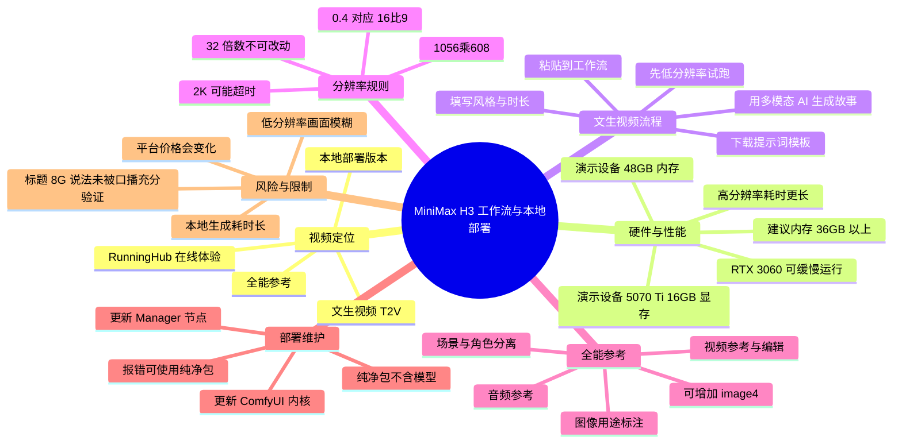
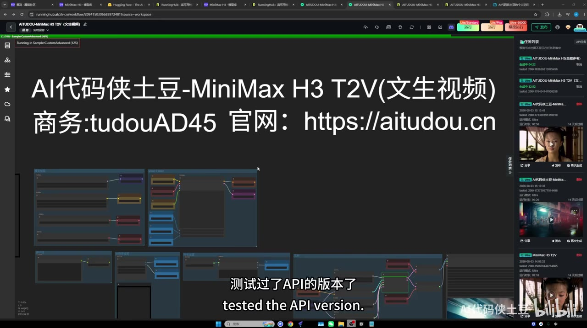
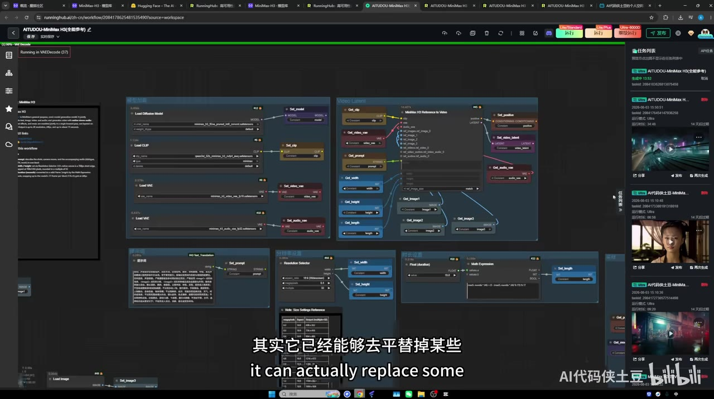

## 小结

本视频介绍了 UP 主“AI代码侠土豆”提供的 **MiniMax H3 文生视频（T2V）** 与 **全能参考** 两套工作流：既可在 RunningHub 在线工作流中直接体验，也提供本地部署方向、提示词模板及网盘资料。

视频中的核心主张是：MiniMax H3 开源版本可在本地运行。UP 主表示，RTX 3060 可以“缓慢运行”；其自己的测试设备为 **RTX 5070 Ti、16GB 显存、48GB 内存**，运行较充裕。对于本地部署，UP 主建议内存尽量达到 **36GB 以上**，否则生成耗时会更长。

文生视频工作流的关键经验是先用多模态 AI 根据“人物、地点、事件、情绪冲突、故事情节、视觉风格、时长”等信息生成适用于 H3 的结构化提示词，再粘贴进工作流。分辨率配置中，涉及尺寸的 **32 倍数参数不能随意改动**，否则可能报错。

全能参考工作流可把不同素材标记为场景、角色、服装、道具或构图等参考，并支持继续扩展 `image4` 等输入。UP 主称该工作流还支持音频与视频参考及编辑；这是视频中的演示/主张，实际兼容性和效果仍需按所用版本自行测试。

性能与成本之间存在明显取舍：UP 主称其测试时，以 6000D 显卡在 RunningHub 跑 1280 分辨率约需半小时；2K 分辨率可能超时。低分辨率预览更快，但远景及人物脸部可能模糊；UP 主称 API 跑 2K 约 11 元，价格与服务规则均可能变化。

> **时效性提示**：本片数据、工作流链接、模型版本、RunningHub 队列与算力价格均与视频发布时点相关。元数据显示抓取时间为 2026-08-03；应以视频简介、项目仓库和平台当前页面为准。标题写有“8G 显存可玩”，但视频口播仅明确提到“3060 可缓慢运行”和其本人 16GB 显存设备，未给出对“8GB 显存”的完整测试参数或稳定性证据，因此不能把标题表述视作已在视频中充分验证的硬件结论。

## 思维导图

## 目录

- [视频信息与适用对象](#视频信息与适用对象-0100)
- [开场样片与模型定位](#开场样片与模型定位-0100)
- [硬件门槛、工作流与开源生态](#硬件门槛工作流与开源生态-0133)
- [文生视频提示词模板：从故事到工作流](#文生视频提示词模板从故事到工作流-0258)
- [尺寸、分辨率、速度与成本取舍](#尺寸分辨率速度与成本取舍-0423)
- [全能参考工作流：多图角色与场景控制](#全能参考工作流多图角色与场景控制-0623)
- [在线运行与本地部署步骤](#在线运行与本地部署步骤-0850)
- [资料获取、限制与时效性](#资料获取限制与时效性-0930)
- [字幕比对与采用说明](#字幕比对与采用说明)
- [评论分析](#评论分析)
- [处理记录](#处理记录)

## 视频信息与适用对象 [01:00](https://www.bilibili.com/video/BV1g9MX6xExH?t=60)

- **视频标题**：全网首发！全能参考！MiniMax H3满血版开源！8G显存可玩 可本地部署
- **UP 主**：AI代码侠土豆
- **合集**：AIcode
- **视频时长**：590 秒（约 9 分 50 秒）
- **主题**：面向视频生成使用者，演示 MiniMax H3 的文生视频与多参考工作流，并说明在线使用和本地部署时的关键配置。
- **适合人群**：
  1. 想先在云端试跑 AI 视频工作流的人；
  2. 有 ComfyUI 使用基础、计划本地生成视频的人；
  3. 需要通过场景图、角色图等多素材维持视频参考一致性的人；
  4. 需要在生成质量、耗时和 API 成本间做选择的人。

视频前约一分钟为生成样片片段：包含人物台词、英文说唱/音乐画面及剧情冲突效果；UP 主从 01:00 左右开始正式讲解。开场样片用于展示生成能力，不等同于对模型稳定性、角色一致性、长视频连续性或所有提示词场景的全面测评。

## 开场样片与模型定位 [01:00](https://www.bilibili.com/video/BV1g9MX6xExH?t=60)

开场演示展示了“文生音乐 MV”“高动效”等类型的 AI 视频片段，并出现都市巷道、人物近景和剧情化冲突镜头。正式讲解中，UP 主称此前已测试过 MiniMax H3 的 API 版本，认为效果不错；此次重点转向“开源版本”及其本地运行可能性。

> 图：画面标注“文生音乐MV”，以街巷人物镜头展示视频开场所强调的风格化生成效果。它的价值在于说明视频不是仅讲部署，也以样片作为画质和动效的直观参照；但单帧不能证明运动连续性或音画同步质量。

> 图：画面标注“高动效”，可用于理解 UP 主后续关于低分辨率远景、人物脸部清晰度的讨论背景。静态关键帧仅能辅助观察构图与人物细节，无法替代对完整动态片段的判断。

UP 主的判断是，该模型已能在某些视频素材生成任务中替代部分其他模型，并且本地运行可避免每次都支付较高的云端生成费用。这里的“平替”是主观使用体验判断，不是对不同模型在质量、速度、版权、可控性与价格上的严格横向基准测试。

> 图：关键帧显示 RunningHub 内名为“AI代码侠土豆-MiniMax H3 T2V（文生视频）”的工作区和节点图。它帮助确认视频讨论的是图形化工作流操作，而不是命令行 API 调用。

## 硬件门槛、工作流与开源生态 [01:33](https://www.bilibili.com/video/BV1g9MX6xExH?t=93)

### 视频中明确给出的硬件信息

| 项目 | 视频陈述 | 解读与边界 |
| --- | --- | --- |
| RTX 3060 | “能够缓慢运行” | 仅说明可尝试运行；未说明具体显存版本、分辨率、时长、量化配置、推理步数或成功率。 |
| UP 主设备 | RTX 5070 Ti、16GB 显存、48GB 内存 | UP 主称该配置运行模型“绰绰有余”，属于个人使用经验。 |
| 建议内存 | 尽量 36GB 以上 | 内存不足时，UP 主称运行时长可能更长。视频没有给出最低内存、CPU 或硬盘容量。 |
| 标题中的“8G 显存” | 标题宣称“8G显存可玩” | 正式口播未给出 8GB 显存的实际完整复现参数；应谨慎验证，不能直接推导为所有 8GB 显卡均可稳定生产。 |

### 两套工作流

UP 主提供：

1. **文生视频（T2V）工作流**：配套提示词模板，用于把自然语言创意整理成可粘贴到 H3 工作流中的提示词。
2. **全能参考工作流**：将场景、角色、服装、道具、构图等参考素材按用途组织后生成视频。

两者都被称为有本地部署版本，提示词模板和工作流资料被放在视频简介所列网盘/链接中。

### 对开源生态的判断

UP 主认为 H3 的开放对开源社区是好事：使用者不再完全受某些闭源模型限制，并期待开发者围绕生态制作更多 LoRA。此处“会有更多 LoRA”等属于对未来生态的期待，不是视频中已经展示的现成兼容 LoRA 清单。

## 文生视频提示词模板：从故事到工作流 [02:58](https://www.bilibili.com/video/BV1g9MX6xExH?t=178)

### 操作流程

1. **下载文生视频提示词模板**  
   UP 主称模板在视频简介所列资料中。下载后打开模板。

2. **选择可理解图片的多模态 AI 工具**  
   视频建议选择支持图片理解的 AI 工具，而非限定某个具体产品或模型版本。

3. **将模板粘贴进 AI 工具并发送**  
   工具会通过问题收集创作信息，例如：
   - 想拍摄的内容；
   - 人物；
   - 地点；
   - 正在发生的事情；
   - 情绪冲突；
   - 大致故事情节。

4. **不会编故事时，先让 AI 补足剧情**  
   UP 主举例称可把需求交给豆包、DeepSeek 等工具，要求其“按上面的需求设计一个故事情节”。这一步的功能是先生成叙事素材，不是直接生成最终视频。

5. **补充视觉风格与目标时长**  
   视频举例：两个人在隧道打架；风格可选惊悚、暗黑赛博朋克或现实主义电影风格；示例时长为 **15 秒**。

6. **获取 H3 可用提示词并复制**  
   AI 整理出最终的可用提示词后，将其粘贴到工作流中的提示词输入位置。

### 可复用的需求整理结构

以下结构是根据视频口述归纳的填写框架，并非视频提供的原始模板全文：

| 字段 | 应描述的内容 | 视频中的例子/方向 |
| --- | --- | --- |
| 人物与关系 | 谁参与、相互关系 | 两个人；也可描述男主与实习生 |
| 地点 | 场景位置与环境 | 隧道 |
| 事件 | 角色正在做什么 | 打架、争执 |
| 情绪冲突 | 戏剧张力或情感目标 | 对峙、冲突 |
| 视觉风格 | 影像美术方向 | 惊悚、暗黑赛博朋克、现实主义电影 |
| 时长 | 希望生成的短片长度 | 示例为 15 秒 |
| 参考素材用途 | 若使用多模态输入，需要解释图片用途 | 场景、角色、服装、道具、构图 |

### 经验要点

- 不要只输入一个模糊句子。先把故事、角色、场景、风格和时长明确化，能让 AI 生成更结构化的 H3 提示词。
- 先在低成本/低分辨率下验证“提示词方向是否有效”，再提高输出规格。
- 提示词生成工具与视频生成工作流是两步：前者负责整理描述，后者负责推理生成。

## 尺寸、分辨率、速度与成本取舍 [04:23](https://www.bilibili.com/video/BV1g9MX6xExH?t=263)

### 工作流中需要注意的参数

UP 主指出，工作流界面中已标出提示词输入、分辨率和时长设置位置。分辨率配置有两类关键约束：

1. **与 32 倍数相关的设置不要改动**  
   视频明确说“32 不要去动”，因为它是 32 的倍数；随意改动可能导致出错。视频未说明该参数在所有 H3 实现中都相同，因此应以具体节点和工作流的字段说明为准。

2. **按比例表选择输出尺寸**  
   视频示例中：
   - 比例值 **0.4** 对应 **16:9**；
   - 输出尺寸示例为 **1056 × 608**；
   - 2K 示例同为 16:9，口播提及“1920”的分辨率，但未完整明确另一边像素值。

### 视频中提到的性能数据

| 场景 | 视频中的数据/判断 | 注意事项 |
| --- | --- | --- |
| 2K 输出 | UP 主尝试后认为“可能会超时” | 没有说明超时阈值、时长、平台队列与具体任务内容。 |
| RunningHub、1280 分辨率 | 使用“6000D 显卡”约半小时 | “6000D”按口播记录，视频未给出更完整的型号、显存或任务设置。 |
| 初次试跑 | 建议从比例值 0.2 的低分辨率开始 | 目的在于更快出结果、先确认提示词效果。 |
| 后续提升 | 效果满意后可尝试 480 分辨率 | 视频仅给出口头建议，未展示统一对比测试。 |
| 低分辨率画质 | 远景和人物脸部可能较模糊 | UP 主称是低分辨率造成的现象。 |
| API 2K 价格 | 约 11 元 | 属于视频发布时的经验值，平台计价随时可能变化。 |

### 推荐的试跑策略

1. 保持工作流中要求为 32 倍数的尺寸规则不变；
2. 先使用低分辨率/比例值 0.2 快速验证提示词；
3. 观察主体、动作、镜头和内容是否符合预期；
4. 提示词有效后，再将输出提升到更高规格，例如视频提到的 480 分辨率档位；
5. 如需 2K，预先接受更长耗时或可能超时的风险；
6. 对比本地电力/时间成本与云端 API 单次成本，而不是仅比较“是否免费”。

> 图：该关键帧展示参考工作流中的模型、提示词、尺寸、图像输入和输出节点关系。它有助于理解“参数不能乱改”的原因：工作流多个节点之间存在尺寸、潜空间和参考输入的联动。

## 全能参考工作流：多图角色与场景控制 [06:23](https://www.bilibili.com/video/BV1g9MX6xExH?t=383)

UP 主将“全能参考”定位为对标 Seedance 2.0 一类参考能力的工作流。视频演示的核心不是只上传图片，而是要求用户明确每一张参考图在生成中承担的用途。

### 三张参考图的演示分工

| 输入名称 | 视频演示中的用途 | 作用 |
| --- | --- | --- |
| `image1` | 场景图/背景图 | 提供环境、空间与场景氛围参考。 |
| `image2` | 角色图 | 提供一个角色参考。 |
| `image3` | 角色图 | 提供另一个角色参考。 |

UP 主同时说明，参考图还可用于服装、道具和构图。关键不是固定必须三张图，而是把每张图的语义职责写清楚，避免模型无法判断哪张是背景、哪张是人物或物件。

### 演示中的剧情描述

视频用以下剧情作为提示词示例：男主贪污 1000 万后甩锅给实习生，实习生不接受，两人发生争执、可能动手。这个内容是为了说明如何把“人物关系 + 冲突事件 + 视频时长”交给提示词模板，不是关于真实人物或真实事件的新闻陈述。

### 生成全能参考提示词的步骤

1. 打开 UP 主提供的全能参考提示词模板；
2. 粘贴到多模态 AI 工具中；
3. 上传所有参考图片；
4. 逐张标注用途，例如“图一是场景，图二、图三是角色”；
5. 描述剧情发生了什么，以及视频需要多长；
6. 获取带有图片标签的完整提示词；
7. 将提示词粘贴到工作流中生成视频的潜空间相关输入区域。

### 增加第四张及更多参考图

视频演示的扩展方式为：

1. 复制一份已有的参考图输入配置；
2. 将新输入名改为 `image4`；
3. 在对应位置接入第四张素材；
4. 让工作流继续产出下一个参考图输入。

这一操作说明工作流可扩展多参考图，但 UP 主也明确表示，多参考图的实际效果需要使用者自行测试。视频没有给出最大支持图片数、显存随图片数增加的变化、不同类型参考之间的优先级规则。

### 音频、视频参考与编辑能力

UP 主称全能参考同样支持：

- 音频参考；
- 视频参考；
- 基于参考内容进行编辑。

这被 UP 主称为此次开源模型的“大惊喜”。由于视频未展示音频参考、视频参考及编辑的完整独立操作流程，也未提供成功率或限制条件，实践时应把它理解为工作流/模型能力宣称，并优先在实际版本中验证支持的文件格式、时长和节点配置。

## 在线运行与本地部署步骤 [08:50](https://www.bilibili.com/video/BV1g9MX6xExH?t=530)

### 方案一：RunningHub 在线工作流

UP 主此前介绍的是 RunningHub 版本：打开视频简介中对应链接后可直接使用。简介列出国际站与国内站的文生视频和全能参考工作流入口。

适用情况：

- 需要先快速体验工作流；
- 本地显卡性能不足；
- 不想先处理 ComfyUI 依赖、节点版本与模型文件；
- 需要先验证提示词效果再决定是否本地部署。

限制是云端任务可能有队列、超时、算力规格与费用等平台因素；视频中的半小时测试时间不能保证对所有用户、所有时段和所有任务成立。

### 方案二：本地部署

视频提出以下操作顺序：

1. **更新 ComfyUI 内核至最新版本**  
   UP 主强调本地部署前要更新 ComfyUI 核心。

2. **在 ComfyUI Manager 更新节点**  
   启动后，还需要在 ComfyUI Manager 中更新相关节点。

3. **出现错误时使用“纯净包”排查环境**  
   如果当前 ComfyUI 出错，UP 主建议尝试其提供的纯净包。

4. **区分纯净包和模型文件**  
   视频明确说纯净包**不包含模型**；整合环境/启动器与模型是分开的，不能下载纯净包后就假定模型已经齐全。

5. **按硬件条件降低初始规格**  
   优先用低分辨率试跑，以降低等待时间；内存尽量 36GB 以上。

> 本视频没有提供完整命令行、具体 Git 提交版本、Python/CUDA 版本、模型文件名、模型放置目录、节点名称或报错日志。因此，本地部署只能整理为上述原则性步骤，不能据此虚构可直接复制执行的安装命令。

## 资料获取、限制与时效性 [09:30](https://www.bilibili.com/video/BV1g9MX6xExH?t=570)

### 视频简介中列出的资源类型

UP 主在简介中提供了：

- RunningHub 国际站工作流；
- RunningHub 国内站工作流；
- 工作流合集页面；
- 本期本地工作流、模型和提示词模板的夸克网盘链接；
- 模型超市（自选区）；
- 不含模型、包含启动器的纯净整合包。

文中不复写外部下载地址，以避免链接变动后造成误导；应从视频原简介获取当前链接并核验文件来源。

### 后续计划

UP 主表示会继续设计 H3 玩法，例如：

- 20 宫格一键短剧；
- 智能体；
- 更多效果。

这些属于后续计划，并非本视频已经交付或演示完成的功能。

### 重要限制汇总

1. **“能跑”不等于“实用生产”**：RTX 3060 被描述为可缓慢运行，但视频未给出足以复现的完整参数。
2. **标题中的 8GB 显存说法证据不足**：口播没有演示或列明 8GB 显存下的模型格式、分辨率、时长和推理设置。
3. **本地速度可能很慢**：视频中 1280 分辨率在指定云端显卡下约半小时，本地实际时间可能更长。
4. **高分辨率并非无代价**：2K 虽可能改善远景与面部模糊，但视频称其存在超时风险。
5. **低分辨率有画质损失**：远景和人物脸部会更模糊。
6. **多参考图效果未量化**：图片越多不必然越稳定，参考冲突和一致性问题需自行试验。
7. **工作流依赖版本环境**：ComfyUI 核心和节点需要更新；环境不一致可能报错。
8. **成本信息会变化**：约 11 元的 API 2K 价格只是视频口述时的参考。
9. **开源、模型授权和商用范围未在视频中展开**：不能从标题“开源”直接推导出具体许可证或商用许可，应查看模型官方说明。

## 字幕比对与采用说明

### 比对结果

| 字幕来源 | 完整性 | 专有名词表现 | 时间轴 | 主要问题 |
| --- | --- | --- | --- | --- |
| Bilibili 站内字幕 `p01-ai-zh.srt` | 较完整，按短句切分，覆盖开场与主要讲解 | “MiniMax H3”“RunningHub”“ComfyUI”等仍有个别转写错误，如“mini max4H三”“CONFUI” | 精细，含毫秒级起止时间，可作为正文时间定位依据 | 开场英文歌词存在不自然转写；部分技术词和型号有误识别。 |
| 本次 ASR `large-v3-turbo` | 诊断显示语音覆盖约 85.16%，含 27 个较长分段 | 多处专名误识别，如“Milimux H3”“rending hub”“Conf UI”“DBC给” | 有真实时间戳，整体与站内字幕相近 | 分段过长；在约 03:53—04:23 存在约 29.54 秒大间隔；“文生视频”“DeepSeek”“RunningHub”“ComfyUI”等误识别较多。 |

### 最终字幕选择

正文以 **站内字幕的毫秒级分段时间** 作为时间轴链接依据，并逐段检查本次 ASR 结果：

- 本次 ASR 诊断未标记 `noAudioStream=true`，且提供了中文音频识别、501.66 秒语音时长与时间戳，因此源视频**有音轨**；不存在“无音轨导致 ASR 不可用”的情况。
- 站内字幕在技术讲解处切分更细，便于定位章节；ASR 可用于交叉确认说话内容和时间范围。
- 两份字幕都存在自动识别/转写误差，因此在正文中结合视频上下文和关键帧，将以下词语统一规范为：**MiniMax H3、文生视频、全能参考、RunningHub、ComfyUI、ComfyUI Manager、DeepSeek、LoRA、RTX 3060、RTX 5070 Ti**。
- 对站内字幕未充分明确、ASR 也未能可靠补全的细节，不作扩写。例如“6000D 显卡”的完整型号、2K 输出的完整宽高、8GB 显存运行时的完整配置，均保留为未解决信息。

## 评论分析

以下仅处理可获取热评前三条；评论是观众观点，不能作为模型能力或部署门槛的验证证据。

1. **剑泯八荒（5 赞）**  
   评论称该模型“能够直出18x的视频，都不需要破甲”。这属于对输出内容尺度的调侃式评价，视频正文没有展示或验证“18x”内容，也没有讨论相关内容生成限制，因此不能据此判断模型的实际内容政策、稳定性或功能边界。

2. **天师钟馗VIP（35 赞）**  
   评论“苦 seedance 久矣”表达了对 Seedance 或类似既有方案的不满，并将 H3 视为潜在替代选择。这与视频中“对标 Seedance 2.0 参考能力”“减少对某些模型限制”的叙述形成呼应，但仍只是用户态度，不构成性能优劣的客观比较。

3. **DE_鹿_ER（2 赞）**  
   评论表示自己的游戏本仍会选择 API。该观点与视频的实际限制一致：本地部署虽可能降低单次云端费用，但需要显卡、内存、环境维护时间和较长推理时间。对于硬件较弱或希望节省部署时间的用户，云端/API 仍可能更合适。

## 处理记录

- **Worker ID**：worker-mrj0wjed-b0c290ad
- **模型**：gpt-5.6-terra
- **素材与工具结果**：
  - 视频元数据、视频简介、关键帧、站内 SRT、ASR SRT/JSON、热评前三条均为任务提供的真实素材；
  - 本次 ASR 模型为 `large-v3-turbo`，语言识别为中文，置信度 0.998046875，使用 CUDA、`int8_float16`；
  - 已检查 ASR 诊断：`asrHasTimestamps=true`，未出现 `noAudioStream=true` 标记。
- **字幕选择**：采用站内字幕 `p01-ai-zh.srt` 的细粒度真实时间段生成章节时间轴；同时核对本次 ASR，使用其时间范围辅助确认。对两者共有的专有名词误识别进行了规范化，但未补造原素材未出现的参数。
- **关键帧依据**：
  - `frames/frame-001.jpg`：开场“文生音乐MV”样片，说明视频用生成片段展示能力；
  - `frames/frame-002.jpg`：开场“高动效”样片，用于理解画质与动态展示语境；
  - `frames/frame-003.jpg`：RunningHub 的 MiniMax H3 T2V 工作流界面，支持“在线工作流”说明；
  - `frames/frame-004.jpg`：全能参考节点图，支持多图输入、提示词、尺寸与节点联动的讲解。
- **缓存清理**：未执行额外缓存清理；本次仅依据任务注入的素材进行整理，未生成或保留新的下载缓存。
- **未解决问题**：
  - 8GB 显存实际可运行的模型格式、分辨率、时长与速度；
  - “6000D 显卡”的准确完整型号；
  - 2K 输出的完整尺寸及超时规则；
  - 本地部署所需的准确版本、节点清单、模型文件与路径；
  - 音频/视频参考及编辑功能的完整操作流程、文件限制与稳定性。
