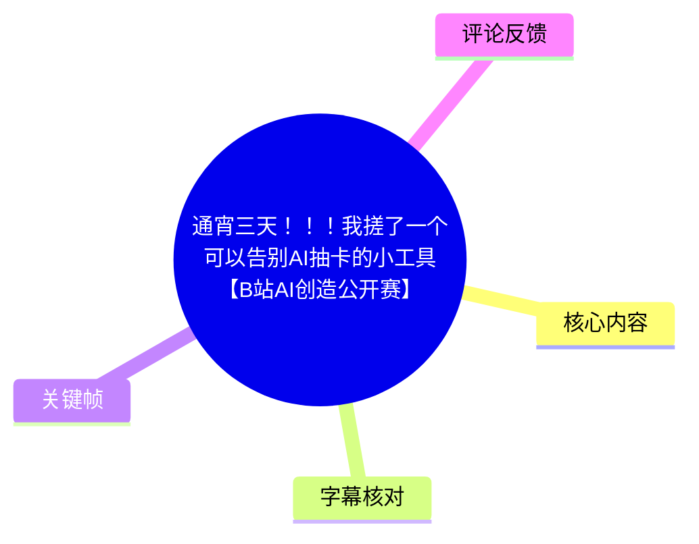
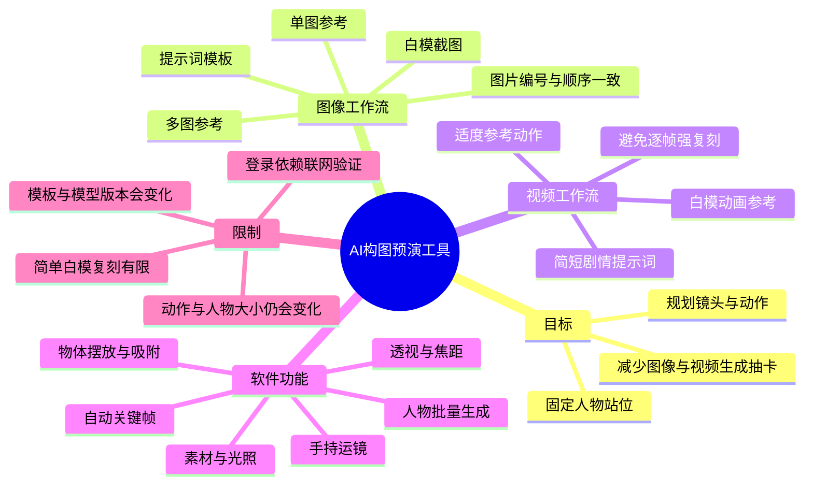
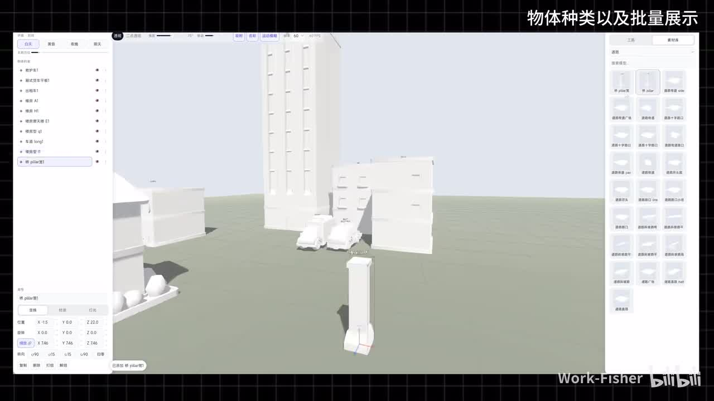
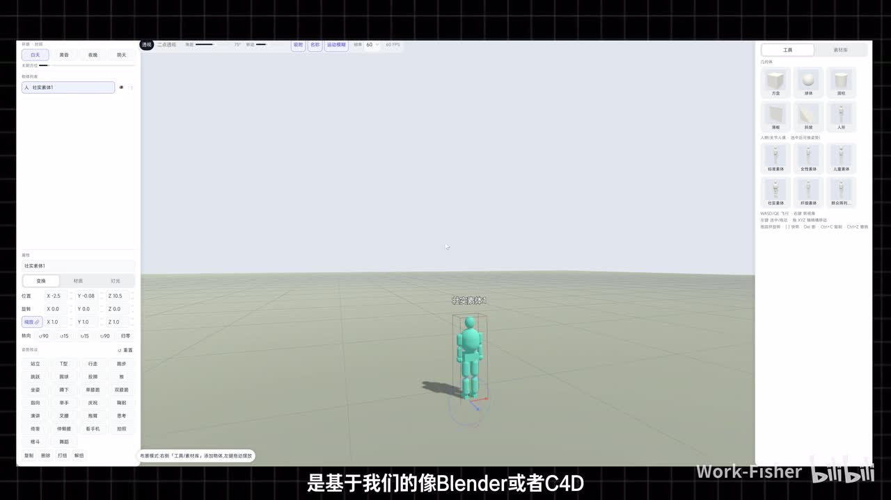
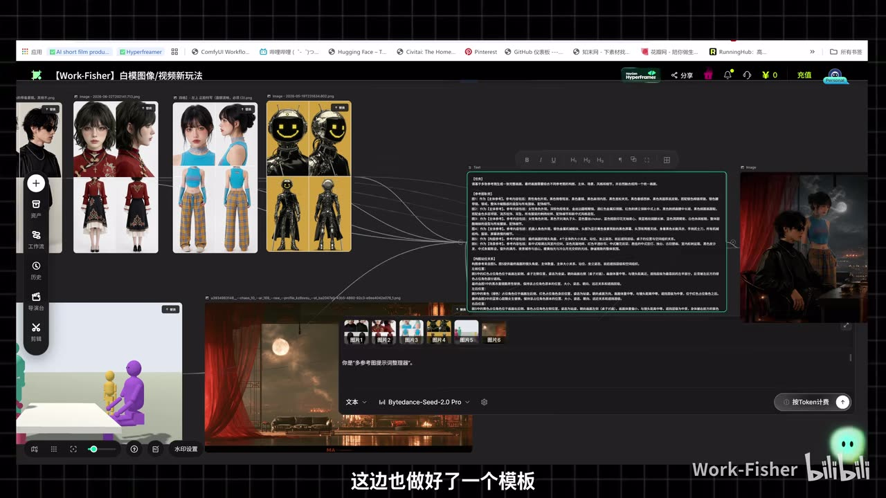
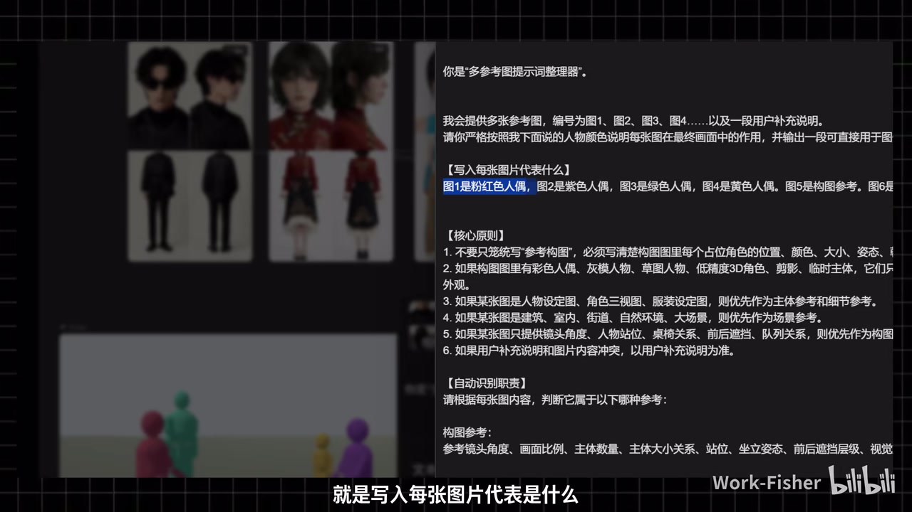

## 小结

这期视频介绍了 UP 主 Work-Fisher 制作的一款轻量化三维构图与动画预演工具。它借鉴 Blender、C4D、SketchUp 一类三维软件的场景编辑逻辑，但把操作简化为面向 AI 图像、AI 视频创作者的“白模搭景—截图/动画参考—生成模型出图或出视频”工作流。

工具要解决的核心问题是 AI 生成中的“抽卡”：尤其是多人场景里角色站位、大小、动作、前后关系与镜头构图经常失控。视频的方案不是单纯增加生成次数，而是先用白模、人偶、物体和相机预先确定空间关系，再将构图图、角色图、场景图和结构化提示词交给生成模型。

图像工作流分为单图与多图两类。单图玩法是用白模截图配合人物、场景和简短提示词；多图玩法则通过提示词模板说明每张图的职责，例如角色设定、人物颜色、构图参考与场景参考。最重要的约束是：**模板中的图片编号、文字描述和实际上传图片顺序必须一致**。

视频工作流的重点是用白模动画提供动作与镜头参考。UP 主建议剧情提示词保持简短，让视频参考承担大部分运动信息；但简单白模不适合强行逐帧复刻，否则人物可能动作僵硬、漂移或出现不自然姿态。该工具改善的是构图与运动规划的可控性，不保证最终 AI 输出完全一致。

软件操作覆盖账号登录、FPS、运动模糊、透视、两点透视、焦距、物体预设、自由缩放、坐标轴移动、自动吸附、人物批量生成、素材库、光照、文件保存与加载，以及拍摄模式中的自动关键帧、时长调整和手持运镜。

视频中的软件、画布模板、免费领取链接、账号体系、模型版本与兼容性均有时效性。UP 主称工具目前免费提供，但这属于视频发布时的陈述；外链可用性、价格、模型支持范围应以当前页面为准。

## 思维导图

## 目录

- [工具定位：将“抽卡”前移为构图控制](#工具定位将抽卡前移为构图控制)
- [图像生成：单图、多图与结构化参考](#图像生成单图多图与结构化参考)
- [提示词模板：编号、颜色、职责与顺序](#提示词模板编号颜色职责与顺序)
- [视频生成：白模参考与复刻边界](#视频生成白模参考与复刻边界)
- [软件基础操作：镜头、物体、素材与保存](#软件基础操作镜头物体素材与保存)
- [拍摄模式：自动关键帧、速度与运镜](#拍摄模式自动关键帧速度与运镜)
- [限制、适用范围与时效性](#限制适用范围与时效性)
- [字幕比对](#字幕比对)
- [评论分析](#评论分析)
- [处理记录](#处理记录)

# 通宵三天！！！我搓了一个可以告别AI抽卡的小工具【B站AI创造公开赛】

> 来源：[Bilibili 视频](https://www.bilibili.com/video/BV14uMG6PENT)  
> UP 主：Work-Fisher  
> 时长：17:18（1038 秒）  
> 合集：AIcode  
> 视频简介提供软件免费领取、画布提示词与知识库链接；其当前可访问性未在本记录中验证。

## 工具定位：将“抽卡”前移为构图控制 [01:32](https://www.bilibili.com/video/BV14uMG6PENT?t=92)

UP 主在约 01:32 开始说明，自己三天未更新视频的主要原因是集中开发这款工具。工具的底层思路参考 Blender、C4D、SketchUp 等三维软件，但进行了大量简化，目的是让非专业三维用户也能较快搭建用于 AI 生成的空间参考。

视频所说的“告别 AI 抽卡”，具体针对以下痛点：

1. 多人物生成时，人物位置容易变化；
2. 人物姿势、大小与前后遮挡关系难以稳定；
3. 场景元素与角色关系不符合预期；
4. 连续生成 5 次、10 次仍难以得到目标构图；
5. 视频生成中，动作和机位难以通过纯文字精确约束。

视频给出的替代策略是先做预演：

1. 使用白模人物、基础几何体或素材库搭建场景；
2. 调整人物站位、物体位置、镜头角度和光照；
3. 截取白模构图作为图像生成参考；
4. 或通过拍摄模式制作基础动画，作为视频生成参考；
5. 结合角色图、场景图和提示词模板进行生成。

这意味着该软件定位更接近 AI 创作前的“构图预演工具”，而不是直接取代图像或视频生成模型的最终渲染器。

> 图：关键帧展示白模城市场景，左侧可见场景物体列表，右侧可见素材区域。它说明软件的关键输入是可编辑的三维空间关系，而不仅是文本提示词。

> 图：画面中央为可选中的青色人偶，左侧是属性与变换区域，右侧有基础几何体及人物素材。该画面对应视频所说的 Blender、C4D 类编辑逻辑被简化后用于搭建白模场景。

## 图像生成：单图、多图与结构化参考 [02:20](https://www.bilibili.com/video/BV14uMG6PENT?t=140)

### 单图玩法：白模截图作为构图约束 [02:20](https://www.bilibili.com/video/BV14uMG6PENT?t=140)

视频演示的第一类方式是以单个白模场景截图为构图基础。UP 主描述的步骤包括：

1. 在软件中搭建人物、场景和基础空间关系；
2. 截取当前白模画面；
3. 提供人物参考；
4. 补充场景信息；
5. 填入简短提示词；
6. 将这些输入交给图像生成模型。

UP 主认为，这样可以让生成结果与白模中的人物关系、画面构图有较高吻合度。这里的“吻合度高”属于视频演示中的经验判断，并未提供跨模型、跨题材或大规模样本的成功率统计。

### 多图玩法：解决多人物位置错乱 [02:44](https://www.bilibili.com/video/BV14uMG6PENT?t=164)

多图工作流针对的是多人场景。UP 主提到，许多用户反馈 AI 在多人画面中会随机改变人物位置；视频演示中有 4 个角色，并引用了 6 张图像，最终人物相对位置“基本吻合”。

视频中的多图输入不是无序堆叠，而是给每张图分配不同职责，例如：

| 图像职责 | 作用 |
| --- | --- |
| 角色设定图 | 提供人物外观、服装或身份信息 |
| 白模角色颜色图 | 对应构图中不同角色的位置 |
| 构图参考图 | 约束主体数量、站位、构图比例与前后关系 |
| 场景参考图 | 约束环境、建筑、室内外氛围或自然景观 |
| 补充说明图 | 补足角色、物体或局部细节 |

UP 主指出，单纯通过手写提示词描述“谁在什么位置、朝向哪里、与谁互动”，对用户而言很难精确表达。因此，模板和白模构图的作用是将空间关系显式化。

### 多图控制的能力边界 [03:08](https://www.bilibili.com/video/BV14uMG6PENT?t=188)

视频明确说明，多图参考并不能做到绝对一比一复刻。

| 相对可控的内容 | 仍可能发生偏差的内容 |
| --- | --- |
| 人物的大致位置 | 人物体积和比例 |
| 人物之间的相对关系 | 局部姿态 |
| 场景中的角色分布 | 简单动作变化 |
| 构图的整体结构 | 细粒度动作与细节 |

UP 主的结论是：人物位置可以较接近白模，但人物大小及部分简单动作仍会变化。因此，该方法适合做**构图级控制**，不等同于像素级、骨骼级或逐帧级控制。

## 提示词模板：编号、颜色、职责与顺序 [04:21](https://www.bilibili.com/video/BV14uMG6PENT?t=261)

### 固定模板与可编辑区域 [03:56](https://www.bilibili.com/video/BV14uMG6PENT?t=236)

UP 主要求用户配合画布中的提示词模板使用。视频称，图像与视频、不同玩法之间均有对应的提示词规格。

模板的使用原则是：

- 前置固定内容不要随意改动；
- 用户主要编辑“用户画面说明”或图片说明区域；
- 每张参考图都应有明确身份和用途；
- 提示词模板用于协助大语言模型将多图关系整理为复杂提示词。

视频未完整展示所有模板字段，也未给出一份可复制的完整模板文本，因此不能据此补写未出现的字段或假设模板适配所有 AI 平台。

> 图：画面显示多张角色图、白模构图图、场景图、模板文本区和最终图像区域。它说明多图工作流需要同步管理参考图、文本结构与生成任务。

### 多图提示词工作流 [04:21](https://www.bilibili.com/video/BV14uMG6PENT?t=261)

根据视频讲解，可整理为以下步骤：

1. **打开大语言模型模板**  
   打开配套模板，除指定的编辑区域外，不需要修改其他固定内容。

2. **写明每张图片代表什么**  
   为每张图指定角色与用途。视频举例：图 1 是粉红色人偶，图 2 是紫色人偶。

3. **建立角色与颜色映射**  
   白模构图中不同颜色的人偶代表不同人物；文字中必须说明颜色与角色的对应关系，否则模型可能无法识别“谁是谁”。

4. **标记构图参考与场景参考**  
   视频示例中，图 5 是构图参考、图 6 是场景参考。该编号属于演示案例，不是通用固定规则。

5. **按模板顺序上传图片**  
   图片接入顺序必须与文字中图 1、图 2、图 3 等定义完全一致。

6. **生成复杂提示词**  
   模板生成一段用于图像模型的复杂提示词。

7. **将提示词与全部参考图投入生成模型**  
   图像生成时，除了粘贴提示词，也必须插入对应图像；如果没有图像参考，模型无法获取相应视觉信息。

8. **再次核验顺序**  
   文本中的图像引用与实际上传顺序必须一一对应，不能随意调整。

> 图：关键帧中可见“你是多参考图提示词整理器”“写入每张图片代表什么”“核心原则”等模板内容，以及“图1是粉红色人偶、图2是紫色人偶”等示例。它直接支持“编号、颜色、职责与图片顺序必须对应”的操作结论。

### 可迁移的方法：让模型理解图像之间的分工 [05:09](https://www.bilibili.com/video/BV14uMG6PENT?t=309)

视频的关键经验可以概括为：不要只给模型“多张图片”，而应让每张图片拥有稳定身份。

推荐检查项：

- 是否为每张图编号；
- 是否说明每个角色对应的颜色或位置；
- 是否区分角色参考、构图参考和场景参考；
- 文字里的编号是否与上传顺序一致；
- 白模构图是否足以表达主次、遮挡、站位和视角；
- 是否将复杂的空间关系交给模板整理，而不是完全手写。

这一策略降低了多图输入语义混乱的概率，但最终效果仍依赖目标图像模型本身的多图理解能力。视频未提供不同模型的横向评测，因此不能得出不同模型效果相同的结论。

## 视频生成：白模参考与复刻边界 [05:57](https://www.bilibili.com/video/BV14uMG6PENT?t=357)

### 视频输入与提示词原则 [05:57](https://www.bilibili.com/video/BV14uMG6PENT?t=357)

对于视频生成，UP 主建议的流程较为直接：

1. 插入图片；
2. 插入白模动画或其他视频参考；
3. 复制视频提示词；
4. 剧情描述尽量保持简单；
5. 生成视频。

其理由是视频参考已经提供较多动作、运动方向和镜头信息，因此提示词只需大致说明剧情，不宜写得过于复杂。这是视频作者的经验性建议，不代表所有视频模型都必须使用短提示词。

### 当前阶段的动画理解问题 [06:31](https://www.bilibili.com/video/BV14uMG6PENT?t=391)

UP 主以简单白模动画说明，当前提及的“2.0 阶段”对动画理解并不十分准确。他推测这可能与将来的“2.5”版本有关，也可能是当前版本能力本身有限。视频没有提供可验证的官方版本说明或更新日志，因此该判断只能视为作者经验与推测。

他还指出，网络上看起来复刻非常准确的案例，可能建立在两个条件上：

1. 进行了大量生成与筛选；
2. 参考模型本身更精细，例如先在 Blender 中建立较准确的人物与动作，再进行视频复刻。

视频中部分模型或服务名称存在 ASR 识别不稳定，正文不将无法明确辨认的名称写作可验证的产品事实。

### 逐帧强复刻的副作用 [07:19](https://www.bilibili.com/video/BV14uMG6PENT?t=439)

UP 主展示了追求强复刻时可能出现的问题：简单模型虽然可能更接近参考视频，但人物动作会显得呆滞，甚至出现漂移、躺倒等不自然结果。

视频提出的不是“完全复刻”或“完全不参考”二选一，而是在参考约束与模型发挥之间寻找平衡。

| 方式 | 可能优势 | 主要风险 |
| --- | --- | --- |
| 强行逐帧参考 | 动作和构图更贴近输入 | 简单白模下动作僵硬、不自然 |
| 完全不使用视频参考 | 模型自由度更大 | 人物位置、动作和镜头更难控制 |
| 适度使用视频参考 | 吸收部分运动与机位关系 | 仍可能与预演不完全一致 |

视频所称的“模糊地带”是：白模要提供足够的运动指导，但又不能要求生成模型机械复制每一帧。

### 图像方案与视频方案的选择顺序 [09:12](https://www.bilibili.com/video/BV14uMG6PENT?t=552)

针对人物站位、动作和场景不稳定的问题，UP 主给出如下思路：

1. 优先使用白模截图解决静态构图问题；
2. 先把人物站位、场景关系和镜头画面固定；
3. 如果静态图仍无法解决动作或镜头问题，再使用白模视频；
4. 接受视频模型对动作的二次生成，而不是要求完全逐帧照搬。

因此，视频中的软件更适合作为 AI 视频生成前的动作和机位草图工具。

## 软件基础操作：镜头、物体、素材与保存 [10:01](https://www.bilibili.com/video/BV14uMG6PENT?t=601)

### 账号、运动模糊与 FPS [09:36](https://www.bilibili.com/video/BV14uMG6PENT?t=576)

软件首次使用需要注册账号。UP 主称该工具与“创剧”账号体系互通，已有相关账号的用户可以直接使用。视频未展示账号服务条款、权限范围或数据处理机制，因此这里只记录其口述事实。

界面提供运动模糊和 FPS 设置：

- 如果用户感觉画面或操作显示过于模糊，可以关闭运动模糊；
- FPS 可以设置；
- UP 主表示 FPS 不是本次教学的核心。

### 透视、两点透视与焦距 [10:25](https://www.bilibili.com/video/BV14uMG6PENT?t=625)

UP 主认为，基础使用中最值得理解的是透视、两点透视和焦距。

- **普通透视**：保留明显的远近和空间纵深效果。
- **两点透视**：视频通过界面效果说明，切换后场景视觉上更偏垂直、规整。
- **焦距**：可控制拉近、拉远及空间压缩感；即便物体实际距离较远，增大焦段后在视觉上也可能显得更接近。
- **较广视角的感觉**：画面会呈现更明显的纵深感。

视频没有要求用户先掌握完整摄影或三维理论，建议先在实际摆场景时理解这些差异。

### 物体预设、自由缩放、坐标移动与吸附 [11:13](https://www.bilibili.com/video/BV14uMG6PENT?t=673)

选中物体后，用户可以使用预设姿势或状态。视频提及的主要编辑能力包括：

- 选择物体预设；
- 使用自由缩放控制点放大或缩小物体；
- 通过传统 XYZ 坐标轴移动；
- 使用自动吸附贴合其他物体或地面；
- 修改物体颜色；
- 使用自定义颜色选项。

UP 主特别提到自由缩放适合巨物或大型场景：基础对象放大后即可承担建筑、城堡等粗略空间占位功能。

自动吸附可以加快摆放效率，但视频未说明碰撞规则、吸附阈值和开关方式；复杂场景应以实际画面为准。

### 批量人物、框选、复制与视角移动 [12:20](https://www.bilibili.com/video/BV14uMG6PENT?t=740)

右侧工具区提供多种人物形状与物体类型。视频展示了批量生成矩阵式人物的能力，可用于快速搭建群像、人群或士兵等构图。

可确认的操作思路包括：

- 框选多个对象进行批量移动；
- 复制对象；
- 使用 `WASD` 做类似游戏的移动操作；
- 通过常见交互逻辑快速移动、复制和调整场景。

ASR 将部分按键识别为“Country”“8键”“Config UI”等，存在明显误识别；因此，除视频中可明确确认的 `WASD` 外，本文不把这些词扩展为具体快捷键组合。

### 素材库、方块搭景、光照、保存与加载 [13:32](https://www.bilibili.com/video/BV14uMG6PENT?t=812)

软件提供基础素材库与模板。UP 主强调，白模预演不需要精细建模：放大基础方块可以充当房屋、城堡等场景结构，重点是传达空间布局，而非制作最终资产。

视频还展示了：

- 调整太阳角度；
- 调整黄昏等光照氛围；
- 保存文件；
- 加载此前保存的文件。

ASR 对保存快捷键的识别不可靠，正文仅确认视频展示了保存与加载能力，不把疑似快捷键写成确定操作。

## 拍摄模式：自动关键帧、速度与运镜 [14:20](https://www.bilibili.com/video/BV14uMG6PENT?t=860)

### 手动关键帧与自动模式 [14:20](https://www.bilibili.com/video/BV14uMG6PENT?t=860)

进入拍摄模式后，软件有两类模式：

| 模式 | 视频中的说明 |
| --- | --- |
| 手动关键帧 | 面向已熟悉关键帧操作的用户，视频没有详细展开 |
| 自动模式 | 本期重点讲解，可通过记录机位和状态自动生成基础运动 |

自动模式的核心是记录不同时间点的画面、人物位置和姿势，再让软件在这些状态之间产生运动。

### 自动关键帧基础步骤 [14:44](https://www.bilibili.com/video/BV14uMG6PENT?t=884)

视频演示的基础流程可整理为：

1. 搭好场景，并把人物放在初始位置；
2. 确定初始镜头；
3. 点击记录机位，生成第一帧；
4. 将人物移动到更远的位置；
5. 再次记录机位，生成第二帧；
6. 预览人物从起点到终点的移动；
7. 在中间增加一帧，使运动过程更自然；
8. 拖动该帧到合适的时间位置；
9. 将人物切换为跑步姿势；
10. 更新后再次预览。

UP 主的经验是：如果只有起点和终点，人物可能只是机械平移；增加中间帧并设置跑步姿势后，运动更容易被理解为跑动。

### 时长参数、速度感与运动模糊 [15:43](https://www.bilibili.com/video/BV14uMG6PENT?t=943)

在进一步演示中，UP 主调整了动画时间：

- 一个时间节点设为约 1 秒；
- 跑动段设为约 4 秒；
- 缩短时长后，人物移动看上去更快；
- 如果速度感不足，可以增加运动模糊；
- 通过预览比较调整前后的效果。

其中“约 1 秒”和“约 4 秒”是视频中该示例的参数，不是通用推荐值。合理的时长还会受场景尺度、角色移动距离、镜头焦距与最终视频生成模型影响。

### 手持运镜与帧管理 [16:21](https://www.bilibili.com/video/BV14uMG6PENT?t=981)

UP 主还演示了添加手持运镜效果：

1. 在已有自动动画基础上增加手持运镜；
2. 调整手持效果强度；
3. 视频示例中将强度拉满；
4. 预览后画面出现更明显的摇摆感。

帧管理方式包括：

- 点击加号添加新帧；
- 删除不需要的帧；
- 拖拽时间轴中的帧调整时机；
- 修改人物姿势后更新；
- 持续预览和迭代。

这类动画更适合作为 AI 视频的参考输入，而非替代专业三维动画、角色绑定或最终摄影机制作。

## 限制、适用范围与时效性 [17:01](https://www.bilibili.com/video/BV14uMG6PENT?t=1021)

### 视频明确说明的限制

1. **人物细节不能完全锁定**  
   多图流程可以较好固定人物位置，但人物大小、局部姿势和简单动作仍可能变化。

2. **简单白模不适合逐帧强复刻**  
   过度追求参考一致性，可能造成动作僵硬、漂移或不自然姿态。

3. **生成结果仍有随机性**  
   工具降低的是站位、构图和基础运动的不确定性，不保证最终输出完全满足预期。

4. **多图流程依赖顺序与定义一致**  
   如果模板中的图片编号、角色说明与实际上传顺序错位，模型可能错误理解图像角色。

5. **登录需要联网验证**  
   若卡在登录界面，UP 主建议关闭并重新登录；他认为原因可能是网络不稳定，而软件本身需要联网验证。

### 适合的使用场景

- 多人物对话、群像、站位明确的 AI 图像；
- 需要控制前景、中景、背景和角色关系的场景；
- 需要给 AI 视频提供基础跑动、移动、转身或机位参考的项目；
- 希望减少重复随机生成、先确定构图再出图的创作者。

### 不应过度期待的能力

- 精确角色动作捕捉；
- 简单白模到复杂角色的逐帧完全迁移；
- 不经迭代就稳定获得最终成片；
- 在不同模型、不同版本、不同平台间获得相同结果；
- 仅靠模板即可解决所有角色一致性问题。

### 时效性

元数据中的发布时间戳对应约 2026 年 7 月。视频提及“2.0 阶段”及可能到来的“2.5”，但没有明确给出可核验的完整产品名称、发布时间或更新日志。

视频简介中的软件领取链接、画布模板链接和知识库链接，以及工具的免费策略、账号体系和模型兼容性都可能在之后调整。UP 主在结尾称工具和模板“目前”免费提供，这不是永久免费的可验证承诺。

## 字幕比对

| 字幕来源 | 完整性 | 专有名词可靠性 | 时间轴 | 主要问题 |
| --- | --- | --- | --- | --- |
| Bilibili 站内字幕 `p01-ai-zh.srt` | 很低；仅约覆盖 00:01–04:49 | 极低 | 有真实 SRT 时间段 | 内容为电动车性能、赛道试驾与英文采访，与本视频 AI 工具主题明显不符 |
| 本次 ASR 字幕 `asr/transcript.srt` | 较高；覆盖约 01:32–17:16 | 中等 | 有真实起止时间 | 部分软件名称、模型名、术语、快捷键和个别词语误识别 |

### 本次 ASR 检查结果

本次 ASR 已检查，诊断信息显示：

- 识别模型：`medium`；
- 识别语言：中文；
- 音频时长：约 1037.12 秒；
- 首段连续语音：01:32.020；
- 末段连续语音：17:16.810；
- 语音覆盖率：约 86.83%；
- 有时间戳；
- 未标记 `noAudioStream=true`，即源视频存在音轨；
- 存在两段较大语音空档：
  - 07:30.440–07:45.760，约 15.32 秒；
  - 08:10.160–08:24.660，约 14.50 秒。

因此，本视频不是无音轨视频；正文以本次 ASR 的真实时间轴为主要依据。

### 最终字幕选择与校正原则

站内字幕的文本内容与实际视频主题严重错配，疑似串入另一条汽车视频字幕，不能用于本视频事实整理。

正文采用本次 ASR 字幕作为主时间轴来源，并使用关键帧与上下文做谨慎校正：

- ASR 中“铁齿”依语境校正为“提示词”；
- ASR 中“CSD”与 Blender、C4D、SketchUp 并列，但无法可靠确认具体软件名称，正文仅保留画面及上下文可确认的 Blender、C4D、SketchUp；
- ASR 中“Country”“8键”“Config UI”等存在明显误识别，未写成确定快捷键；
- 对无法确认的模型、服务与版本名称，正文保留为“视频提及的版本”或“相关视频模型”，不将其编造成具体产品结论；
- `frames/frame-001.jpg` 至 `frames/frame-004.jpg` 显示的白模编辑界面、素材区、多图画布和提示词模板，与 ASR 主线内容一致，用于辅助验证工作流。

## 评论分析

本次仅获取到 2 条热评，少于热评前三条的上限；以下只分析可获取内容，不补造第三条。

1. **綿誮糖（102 赞）**  
   > “感觉ai最后会变成一个类似渲染器的东西”

   这条评论将视频中的创作分工概括为：人先控制空间结构、人物关系、动作与镜头，AI 再把白模预演转化为成品视觉画面。它与视频展示的工作流高度相关。  
   但“AI 最后会变成渲染器”是对未来工具形态的观点，不是视频已经证明的技术事实。

2. **吃花喵的面酱（1 赞）**  
   > “能接LTX2.3么”

   评论关注工具能否接入 LTX2.3，反映观众关心白模预演是否能进入特定视频生成工作流。  
   视频没有展示 LTX2.3 接口、节点、导出格式或兼容性说明，因此无法据此确认该工具支持或不支持 LTX2.3，需要以 UP 主后续回复、软件更新说明或工具页面为准。

## 处理记录

- Worker ID：`worker-mrj0wbly-5dc4e50c`
- 模型：`gpt-5.6-terra`
- 使用工具与素材：
  - 视频元数据；
  - 站内字幕：`subtitles/p01-ai-zh.srt`；
  - 本次 ASR 结果：`asr/asr-result.json`；
  - 本次 ASR 时间轴字幕：`asr/transcript.srt`；
  - 关键帧目录：`frames/`；
  - 热评数据：`comments/comments.json`。
- 字幕选择：
  - 已比较站内字幕与本次 ASR；
  - 站内字幕内容明显错配为汽车视频字幕，不采用；
  - 本次 ASR 与视频主题及关键帧一致，采用其真实 SRT 起止时间作为正文时间轴依据。
- 音频检查：
  - ASR 结果未标记 `noAudioStream=true`；
  - 源视频存在音轨；
  - 本次 ASR 的时间戳可用。
- 关键帧选择依据：
  - `frames/frame-001.jpg`：展示白模城市场景、对象列表和素材区域，支持工具“先搭空间关系”的定位；
  - `frames/frame-002.jpg`：展示人偶、三维编辑属性和素材面板，支持简化三维编辑逻辑说明；
  - `frames/frame-003.jpg`：展示角色图、白模构图、场景图、模板文本和画布工作区，支持多图工作流说明；
  - `frames/frame-004.jpg`：直接展示“写入每张图片代表什么”及人物颜色示例，支持图片编号、角色职责与顺序约束。
- 缓存清理：
  - 未提供可执行缓存清理工具或清理回执；
  - 未删除原始视频、音频、ASR、字幕与关键帧，以保留素材溯源依据。
- 未解决问题：
  - 视频未明确给出软件正式名称、完整版本号、安装包信息及完整兼容性列表；
  - ASR 对部分模型名、快捷键和软件术语存在误识别；
  - 站内字幕与实际视频主题严重错配，无法用于还原 00:00–01:32 的开场 Demo；
  - 视频简介外链、模板、免费领取状态及模型支持情况具有时效性，未验证当前可访问性。
