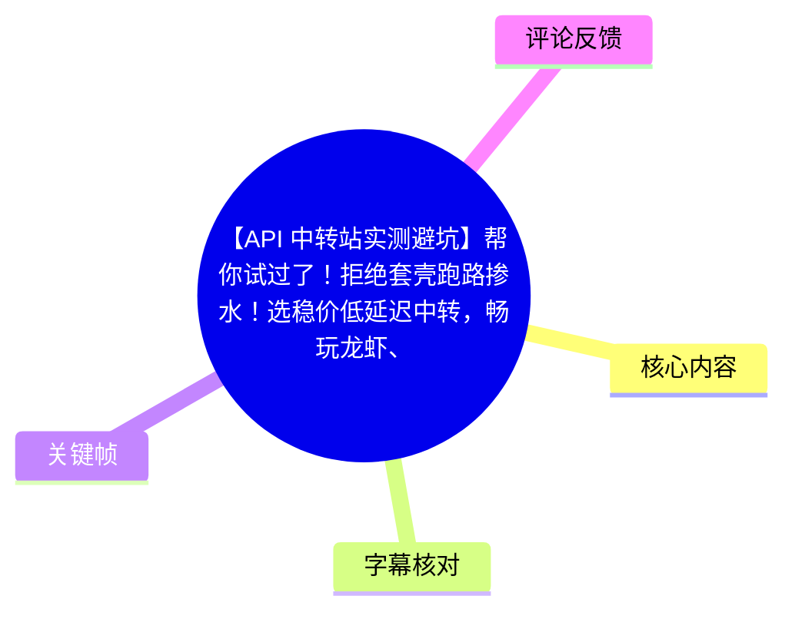
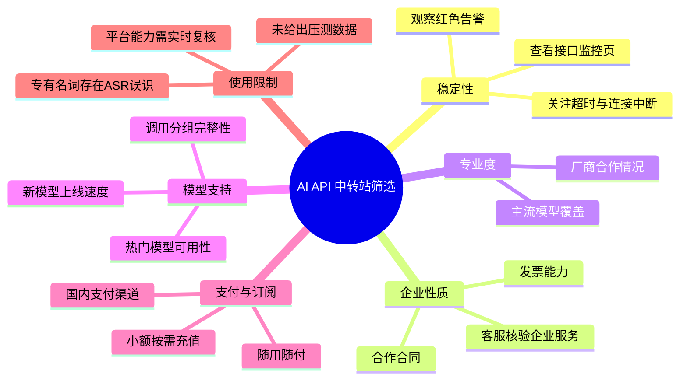
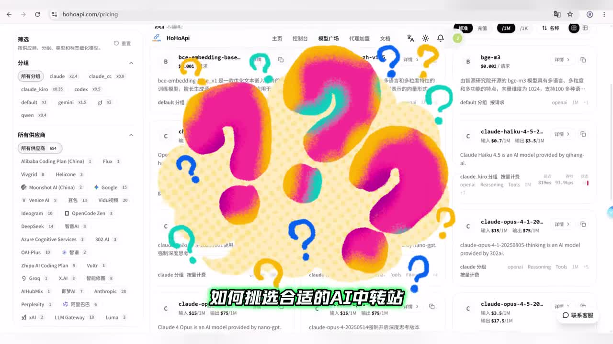
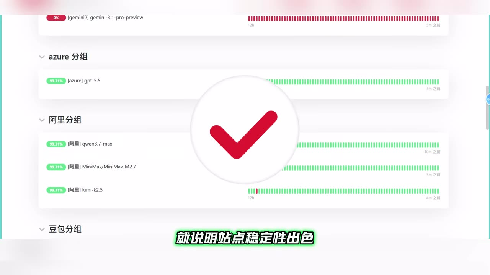
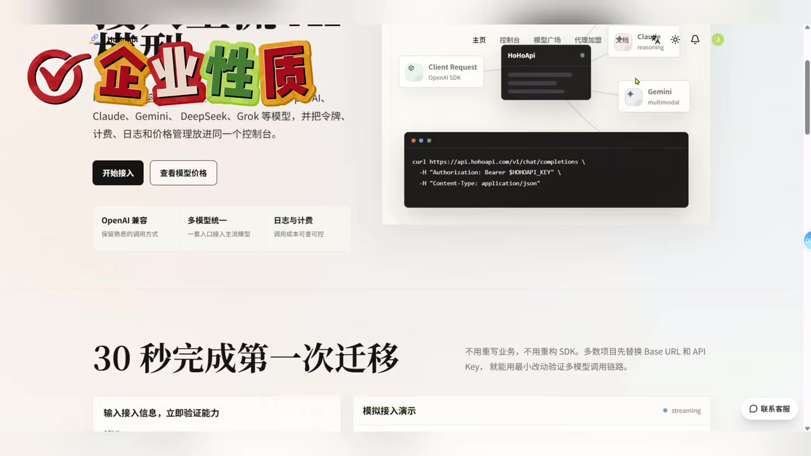
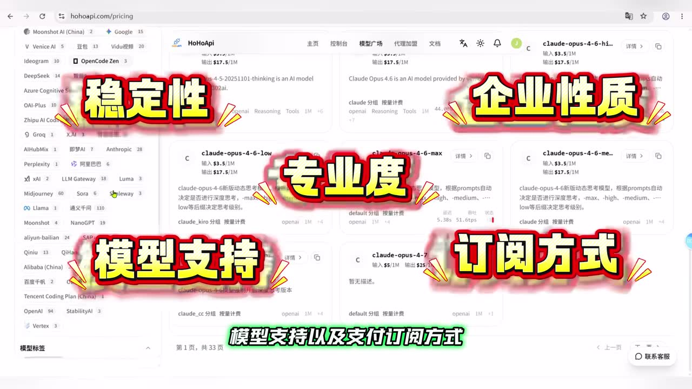

# 【API 中转站实测避坑】帮你试过了！拒绝套壳跑路掺水！选稳价低延迟中转，畅玩龙虾、CC、Codex 不白花冤枉钱

> 来源：[Bilibili 视频](https://www.bilibili.com/video/BV1osE968ETu) 
> UP 主：Ai学术小火龙｜发布时间：2026-06-10｜视频时长：100 秒｜分辨率：3840×2160  
> 视频简介提及：`www.hohoapi.com`，称其汇集 200+ 主流 AI 大模型，并标注“up 自用”。该信息属于发布者陈述，不构成对平台能力、合规性或稳定性的独立验证。

## 小结

视频以“如何选择 AI API 中转站”为主题，提出一套五维筛选框架：**稳定性、企业性质、专业度、模型支持与更新、支付/订阅方式**。其核心建议是，用户不应只看低价或模型数量，而要结合接口监控、企业服务能力、模型覆盖与分组、支付便利度综合判断。

在稳定性上，作者建议查看平台公开的接口监控页：若长期不存在大量红色告警，可作为站点运行较稳的一个信号；同时应关注高负载调用下是否出现请求超时或连接中断。需要注意，视频没有提供具体压测方法、样本时段、成功率或延迟数据，因此这是一项经验性检查，而非可复现的性能评测结论。

在企业属性与专业度上，视频建议确认能否开具发票、签订合作合同，并通过客服补充核验页面未明确的信息；还建议考察平台与国内厂商的合作情况，以及对多家主流模型厂商的覆盖程度。画面中展示了一个聚合平台的模型价格/筛选页与企业服务页面，但并未逐项展示合作证明或资质文件。

模型维度强调“更新速度”和“调用分组”是否完善，ASR 中提到 GPT、Claude、OpenAI 官方等分组，以及价格更低的某类分组。由于本次 ASR 对专有名词存在明显误识，具体型号、分组名称和版本号不宜据此作为准确采购依据；应以目标平台实时模型页、模型提供方公告和 API 文档为准。

最后，作者偏好随用随付、支持国内支付渠道、可小额充值的平台。该建议适合需要控制试用成本、按量调用模型的个人开发者或小团队；但视频未涉及数据跨境、密钥保管、速率限制、退款规则、服务等级协议（SLA）、日志留存和模型内容合规等关键风险，实际接入前仍需自行尽调。

## 思维导图

## 目录

- [背景与视频框架](#背景与视频框架)
- [稳定性：先看监控与调用连续性](#稳定性先看监控与调用连续性)
- [企业性质与服务保障](#企业性质与服务保障)
- [专业度：合作信息与模型覆盖](#专业度合作信息与模型覆盖)
- [模型更新、分组与型号核验](#模型更新分组与型号核验)
- [支付与订阅：按量付费之外的门槛](#支付与订阅按量付费之外的门槛)
- [可执行的筛选步骤](#可执行的筛选步骤)
- [结论、限制与时效性](#结论限制与时效性)
- [关键帧索引](#关键帧索引)
- [字幕比对](#字幕比对)
- [评论分析](#评论分析)
- [处理记录](#处理记录)

## [背景与视频框架](https://www.bilibili.com/video/BV1osE968ETu?t=27)

本次 ASR 的首段语音从 **00:00:27.040** 开始。作者称自己近期一直在使用“Cloud Code”（该名称可能存在 ASR 误识），并说明视频将从五个维度讨论如何挑选“靠谱”的 AI 中转站：

1. 稳定性；
2. 企业性质；
3. 专业度；
4. 模型支持；
5. 支付与订阅方式。

视频前约 27 秒没有可用 ASR 文本；素材中的画面关键帧显示，视频围绕一个名为 HoHoApi 的模型聚合/价格页面进行讲解。该页面展示筛选分组、供应商和若干模型卡片，但**页面存在不等于服务质量已被验证**。

> 图：画面将“如何挑选合适的 AI 中转站”叠加在模型价格与供应商筛选页上，直观说明视频讨论对象是多模型 API 聚合平台；其价值在于界定视频的使用场景，而非证明该页面中服务的真实性或性能。

## [稳定性：先看监控与调用连续性](https://www.bilibili.com/video/BV1osE968ETu?t=27)

作者首先将稳定性列为筛选项，提出两个观察点：

- 查看平台的**接口监控页面**；
- 若页面没有长期、大量的红色告警，可将其视作运行表现较好的信号；
- 在较长时间、高负载调用下，重点观察是否发生**请求超时**或**连接中断**。

画面展示的监控列表中，多个分组条目以绿色状态条显示，并有少量红色条段；视频以勾选图形强调“站点稳定性出色”的判断。这里应谨慎理解：监控页通常只能反映平台公开展示的状态，未必覆盖全部节点、全部模型、全部地区或历史事故。

> 图：画面可见按“azure 分组”“阿里分组”等分类排列的状态条，并以大勾号强调稳定性。它有助于理解作者所说的“看监控页”，但未提供可计算的可用性百分比、P95/P99 延迟或完整历史窗口。

### 实际核验要点

视频没有给出具体性能参数，因此以下是对其建议的执行化整理，不是视频已完成的实测结果：

| 检查项 | 可观察证据 | 不能仅凭其得出的结论 |
| --- | --- | --- |
| 状态监控 | 近期告警密度、故障持续时间、模型维度状态 | 全量真实可用性 |
| 调用稳定性 | 用同一请求多次调用，记录成功/失败与超时 | 不同地区、不同并发下的表现 |
| 延迟 | 分别记录首 token 延迟、完整响应耗时 | 高峰期或长期延迟分布 |
| 故障恢复 | 出错后的重试、备用模型/分组切换情况 | 平台是否具备正式 SLA |

## [企业性质与服务保障](https://www.bilibili.com/video/BV1osE968ETu?t=28)

在企业属性方面，作者建议核查平台的企业背书。ASR 内容明确提到：

- 正规企业运营的站点通常支持**开具发票**；
- 可进一步询问是否可以**签订合作合同**；
- 如果网站页面未写明，可直接联系**客服**确认；
- 具备较完整企业服务的平台，作者认为保障性更强。

素材画面中展示了带有“企业性质”标识的页面，其中可见“OpenAI 兼容”“多模型统一”“日志与计费”等功能文案，以及“30 秒完成第一次迁移”的宣传语。这些属于页面展示或平台宣传，不能代替营业主体、合同条款、发票资质、数据处理条款等独立验证。

> 图：画面展示“企业性质”字样、统一 API 接入示意和迁移宣传语，有助于说明视频为何将企业服务纳入筛选标准；但图中未展示营业执照、合同样本或服务协议，因此不能据此确认主体资质。

### 建议优先确认的事项

1. **签约主体一致性**：网站运营方、收款方、开票主体与合同主体是否一致。
2. **发票与付款信息**：可开具何种发票、税点与开票周期如何约定。
3. **服务边界**：故障响应、账户冻结、余额有效期、退款与争议处理规则。
4. **数据处理**：请求内容是否留存、留存时间、是否用于训练或分析、是否支持删除。
5. **密钥安全**：API Key 的创建、查看、轮换、权限限制及泄露后的处置机制。

以上清单是对视频“企业性质”观点的风险扩展；视频本身未逐项展开。

## [专业度：合作信息与模型覆盖](https://www.bilibili.com/video/BV1osE968ETu?t=28)

作者将“专业度”拆为两个方向：

- 是否与国内知名厂商开展合作；
- 模型覆盖是否足够广泛。

ASR 中列举了多个可能的厂商或模型生态名称，包括“Claude、Grok、Meta、月之暗面、OpenAI、xAI、字节跳动、快手”等。其中部分文本受识别质量影响，例如 ASR 的“虎哥”较可能是与画面中 “Grok” 对应的误识；因此本文将其作为**候选专名校正**，不将 ASR 原字面当作可靠名称。

视频画面中的模型筛选侧栏能看到供应商与分组列表，右侧则是模型卡片、价格与分组标签。作者的判断是：主流模型覆盖越全面，平台的专业能力通常越强。

> 图：画面将“稳定性、企业性质、专业度、模型支持、订阅方式”五项大字叠加在模型平台页面上，是视频五维框架最集中、最适合用于复核结构的关键帧。

但“模型多”与“专业”不是等价关系。至少还应区分：

- 平台是否只是展示模型名，还是确实可以稳定调用；
- 具体模型是否为官方渠道、云厂商渠道或其他转售/代理路径；
- 不同模型的上下文窗口、工具调用、视觉输入、缓存、推理能力是否完整；
- 模型别名是否对应原始版本，是否有静默降级或路由；
- 价格单位是输入/输出 token、请求次数，还是按时长计费。

## [模型更新、分组与型号核验](https://www.bilibili.com/video/BV1osE968ETu?t=52)

作者认为模型更新速度“十分关键”，并建议检查：

1. 是否及时上线最新模型；
2. 模型调用分组是否完善；
3. 是否支持热门新模型；
4. 是否有更具价格优势的分组可选。

ASR 在这一段出现了“GPT5.4”“Cloud 4.6”“微软分组”“Cloud Code 的印象分组”“OpenAI 官方分组”“Cloud 2.0”等文本。由于存在以下问题，不能将其作为准确型号或产品功能清单：

- ASR 将 “Claude” 多次识别为 “Cloud”；
- 关键帧中可见 `gpt-5.5`、`claude-opus-4-6` 等文本，与 ASR 所称版本并不完全一致；
- “印象分组”这一表述语义不清，缺少站内字幕和更细粒度的原始语音分段，无法可靠还原；
- 所有模型版本和分组价格均属于高度时效信息。

因此，视频中可迁移的原则是：**不要只看“是否有模型”，还要核验其上线时间、具体路由分组、接口能力、价格与稳定性。**

### 分组选择的风险意识

如果一个平台把同一模型分成“官方”“云厂商”“共享/其他”等不同组别，且不同组别价格不同，建议逐项确认：

- 底层模型版本是否相同；
- 限流、并发数与上下文窗口是否相同；
- 是否支持流式输出、工具调用、图像/文件输入；
- 是否存在请求内容过滤、排队或高峰降级；
- 失败重试、余额扣除和异常计费如何处理。

视频仅表达某类分组“价格更实惠、性价比更高”的倾向，未给出定价表、调用日志或性能对照，故不能推导出任一具体分组一定更优。

## [支付与订阅：按量付费之外的门槛](https://www.bilibili.com/video/BV1osE968ETu?t=76)

作者把支付与订阅方式称为“最为重要”的一项，主张优质平台应当：

- 采用**随用随付**模式；
- 配备**国内支付渠道**；
- 支持**按需、小额充值**；
- 不推荐虽然可以按量付费、但无法使用国内支付方式的站点。

这套偏好主要服务于个人用户和小团队：先小额验证模型效果、延迟及兼容性，再决定是否扩大用量，从而避免一次性订阅或大额预存带来的资金风险。

### 支付方式不能替代的核验

即使平台具备按量充值与国内支付，仍应检查：

- 余额是否会过期；
- 最低充值额、手续费、汇率或税费；
- 退款条件及处理周期；
- 失败请求、超时请求是否扣费；
- 套餐与按量价格是否存在不同限流；
- 账户被风控或平台停止服务时的余额处理方式。

视频的结论是：可靠的中转站应兼具稳定运行、正规企业资质、专业能力、及时而丰富的模型支持、灵活便捷的支付方式。这个结论是作者的筛选标准，不是针对某个站点的已验证评级。

## [可执行的筛选步骤](https://www.bilibili.com/video/BV1osE968ETu?t=27)

根据视频五维框架，可将实际选择过程整理为以下顺序：

1. **列出刚需模型与接口能力**  
   明确需要文本、视觉、工具调用、代码能力还是长上下文；不要仅以模型数量作为初筛条件。

2. **检查状态页和故障历史**  
   查看监控页的当前状态、告警密度与历史窗口；用小额调用测试超时、连接中断和流式响应连续性。

3. **核验企业服务信息**  
   查看主体、发票、合同、服务协议、隐私政策与客服响应；页面缺失的信息应留存书面答复。

4. **逐模型核对可用性**  
   在模型页确认精确模型名、版本、分组、输入/输出价格、限流与上下文窗口；不要只凭宣传标题判断。

5. **以小额充值测试支付与计费**  
   验证支付渠道、最低充值额、扣费明细、余额规则和退款政策；避免在未完成测试前大额预存。

6. **保留替代方案**  
   对关键业务准备官方 API、其他聚合站或可切换模型，避免将单一中转站作为唯一依赖。

## [结论、限制与时效性](https://www.bilibili.com/video/BV1osE968ETu?t=76)

### 可迁移结论

视频最有价值的部分不是某一平台推荐，而是其五维检查顺序：**先确认稳定性与主体，再看模型可用性和更新速度，最后核对支付体验与成本控制。** 对低频试用者而言，小额按需充值的策略确实比未经验证的大额预付更审慎。

### 视频未覆盖或未验证的限制

- 没有展示跨平台的真实压测结果、请求成功率、并发量、延迟统计或成本对比。
- 没有出示企业合作、模型渠道、服务资质的原始证明。
- 没有讨论 API 请求数据的留存、隐私、训练用途、跨境传输与合规风险。
- 没有解释服务中断、余额冻结、退款、赔付和 SLA。
- 没有对标题所涉“套壳”“跑路”“掺水”等风险给出可验证案例或判定方法。

### 时效性说明

模型名称、版本、分组、价格、支付方式、可用地区和平台运营状态变化很快。视频发布于 2026-06-10，且 ASR 中部分版本号与关键帧文字不一致；本文不将其中任何具体型号、价格或分组视为截至当前仍有效的信息。接入前应以目标平台实时文档、价格页、状态页、合同与实际小额测试为准。

## [关键帧索引](https://www.bilibili.com/video/BV1osE968ETu?t=27)

| 关键帧 | 正文用途 | 画面信息与价值 |
| --- | --- | --- |
|  | 背景与对象界定 | 显示模型价格页、供应商筛选与“如何挑选合适的AI中转站”主题，说明视频面向多模型聚合 API 场景。 |
|  | 核心框架 | 直接呈现“稳定性、企业性质、专业度、模型支持、订阅方式”五项维度，是还原视频结构的主要视觉依据。 |
|  | 稳定性说明 | 显示多分组状态条和绿色可用标记，对应作者“查看接口监控页面”的建议。 |
|  | 企业性质说明 | 显示“企业性质”、统一接入与迁移文案，辅助说明作者为何建议核查企业服务能力。 |

> 关键帧用于辅助理解画面内容。它们反映视频中出现的网页与字幕叠加，不构成对页面所示数据、型号、价格或平台能力的独立验证。

## [字幕比对](https://www.bilibili.com/video/BV1osE968ETu?t=27)

| 字幕来源 | 完整性 | 专有名词 | 时间轴 | 主要问题 |
| --- | --- | --- | --- | --- |
| Bilibili 站内字幕 | 未提供可用字幕 | 无法核验 | 无法使用 | 素材明确标注“未提供可用站内字幕”。 |
| 本次 ASR 字幕 | 覆盖 27.040–98.900 秒；语音覆盖诊断为 72.41% | 存在明显误识 | 有 SRT 时间轴 | 首段仅 1.48 秒却容纳大量内容，分段与文本长度不匹配；“Cloud/Claude”“虎哥/Grok”等专名可靠性不足。 |

### 最终字幕选择

本次没有站内字幕可供比较，故正文以**本次 ASR 的带时间轴 SRT**作为章节定位依据，并使用关键帧对主题、五维框架、监控页和企业服务页面进行辅助核验。

ASR 诊断显示：识别语言为中文，语言置信度为 `0.99658203125`，使用 `medium` 模型、CUDA 与 `float16` 计算；未见 `noAudioStream=true` 标记，因此不能将该视频描述为无音轨视频。尽管有音轨，ASR 仍存在专有名词和断句质量问题。

### 重要校正与保留项

- ASR 中的“Cloud”在上下文和关键帧里可能对应 **Claude**，但因为没有站内字幕或逐词原始对照，本文仅在必要处以“可能”表述。
- ASR 中的“虎哥”可能对应画面中的 **Grok**，本文不将“虎哥”作为模型名称使用。
- ASR 中出现的 GPT、Claude 版本号及“印象分组”等词，缺乏稳定的音视频证据支撑，未被当作精确参数写入结论。
- 所有章节链接均优先使用 ASR/SRT 可直接获得的分段起点：27、28、52、76 秒。

## [评论分析](https://www.bilibili.com/video/BV1osE968ETu?t=76)

本次仅获取到 2 条热评，少于“前三条”的上限；以下仅处理可获取内容。

1. **逆战未来ssd啊**：“已三连，求”  
   - 观点：表达了互动支持，但“求”的具体诉求未完整说明。  
   - 补充信息：无。  
   - 可信度/争议：不含对平台能力或视频观点的可验证评价，无法用于判断服务质量。

2. **你好hjm**：“hohoapi还是挺好用的”  
   - 观点：该用户给出了正面使用感受。  
   - 补充信息：未说明使用模型、调用量、延迟、价格、使用时长或故障情况。  
   - 可信度/争议：这是个人体验，不是独立测评或性能数据；不能据此推导平台整体稳定、合规或长期可靠。

## [处理记录](https://www.bilibili.com/video/BV1osE968ETu?t=27)

- Worker ID：`worker-mrj0wjed-b0c290ad`
- 模型：`gpt-5.6-terra`
- ASR 模型与运行参数：`medium`；语言自动识别为 `zh`；CUDA；`float16`。
- 使用的素材工具产物：视频合并文件、音频 WAV、关键帧目录、ASR SRT/分段 JSON、视频元数据、评论 JSON。
- 字幕选择：站内字幕未提供可用版本；已检查本次 ASR，采用 ASR SRT 时间轴定位，并对低可信专有名词保留不确定性说明。
- 关键帧选择依据：选用 `frame-001` 至 `frame-004`，分别对应主题/模型页、五维框架、接口监控页、企业服务页；这些画面与正文主要论点直接相关。
- 评论处理范围：仅分析可获取的 2 条热评，未将评论主观看法当作已验证事实。
- 缓存清理：提供的素材中未记录缓存清理操作或结果，无法确认是否已执行。
- 未解决问题：
  - 无可用站内字幕，无法对 ASR 的型号、厂商和分组名称逐句校正；
  - ASR 首段时间跨度与文本长度明显不匹配，不适合用于更细的句级定位；
  - 视频未给出跨平台实测数据、资质文件与协议文本，无法验证其针对具体平台的隐含推荐结论。

## 评论分析

- 热评 1：已三连，求
- 热评 2：hohoapi还是挺好用的

以上内容是观众反馈摘录，只用于补充理解视频反响，不作为正文事实依据。
