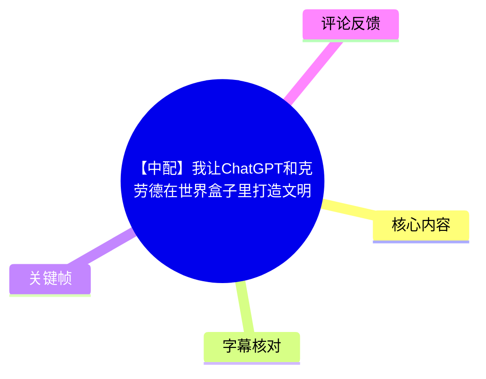
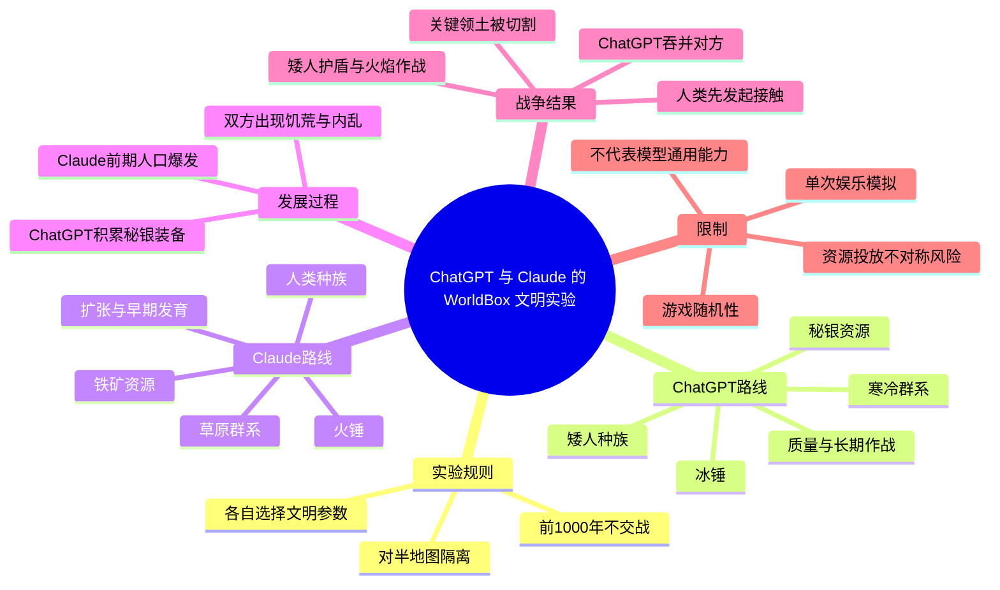
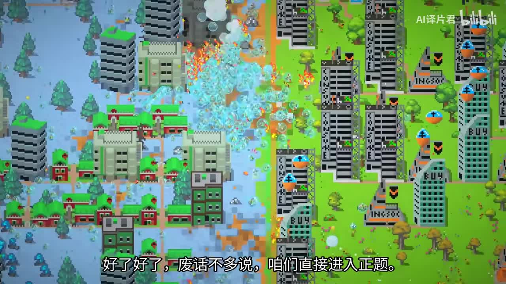
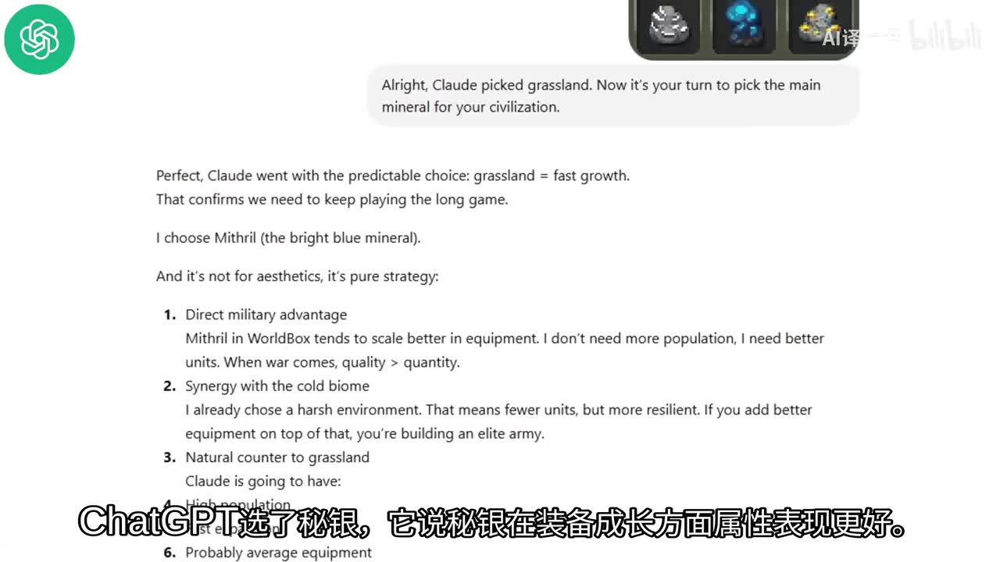
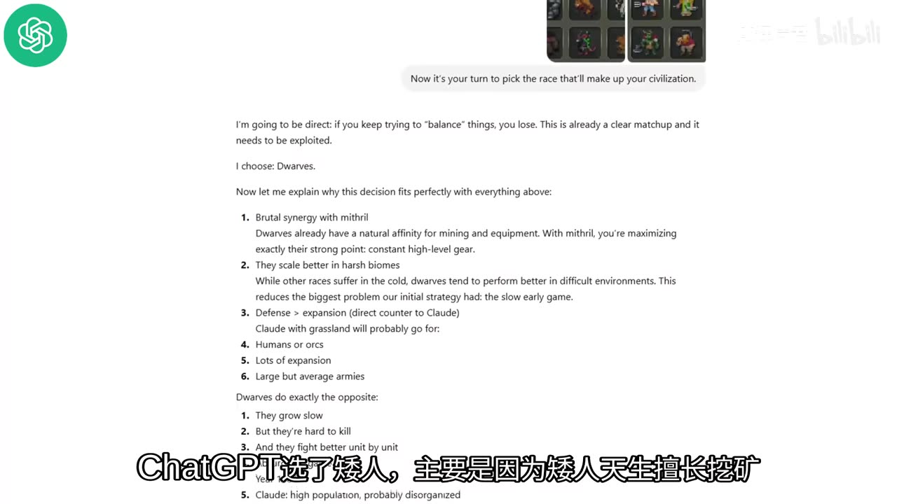
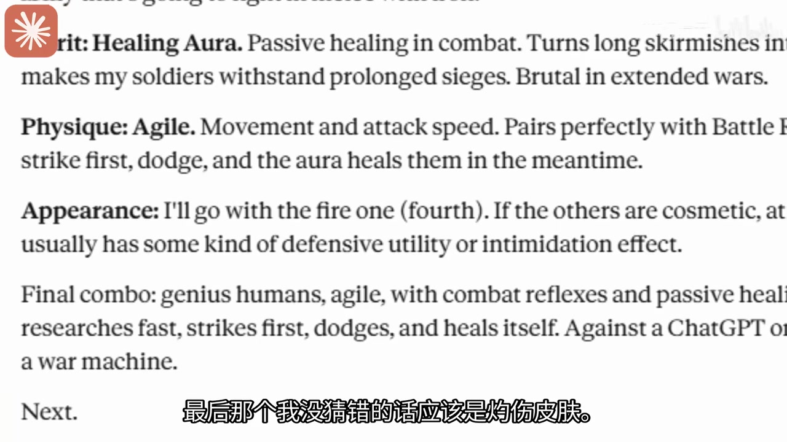

# 【中配】我让ChatGPT和克劳德在世界盒子里打造文明

> 来源：[Bilibili 视频](https://www.bilibili.com/video/BV15xLH6fEZR) 
> UP 主：AI译片君｜视频时长：10 分 56 秒｜合集：AIcode  
> 视频简介称原始来源为 YouTube，上传日期为 2026-05-11；Bilibili 元数据显示发布时间为 2026-05-18。本文将其视为搬运/译配内容，不将其中结果视为对模型能力的正式测评。

## 小结

视频在《世界盒子》（WorldBox）的单张对半地图上，安排 ChatGPT 与 Claude 分别从零设计一个文明，在前 1,000 年隔离发展后拆除边界、进行战争。实验者让两方依次选择生物群系、矿物资源、种族、五类特质、建筑风格、国策与专属武器；随后观察人口、基础设施、装备、饥荒、内乱和战争过程。

ChatGPT 走的是“长期质量优先”路线：寒冷群系、秘银、矮人，重点利用矮人的采矿与耐寒特性，并选择力量、治疗等偏持续作战的能力，最终以冰锤作为特殊武器。Claude 则选择草原、铁矿和人类，以扩张政策、人口增长与火锤建立大规模军队。前期 Claude 的人口、领土和军力明显领先；中后期其高人口引发粮食与稳定性压力。

战争阶段中，Claude 人类先冲向边境，ChatGPT 的矮人以爆炸攻击反击；旁白观察到矮人学会护盾法术后，可以更好承受火焰相关伤害，战场优势扩大。Claude 攻打矮人首都失败且损失严重后，ChatGPT 夺取关键领地、将对方领土切开，最终以约 3,500 余人对 600 余人的规模优势吞并 Claude 一方。

这是一场娱乐性、单次运行的游戏沙盒实验，而非可复现的 AI 基准测试。模型获得的选项、游戏随机过程、资源无限投放、特质名称识别歧义、游戏机制与操作执行均会显著影响结果；因此，“ChatGPT 更强”仅是这局设定下的叙事结果，不能外推到现实中的通用推理、编程或决策能力。

适合希望了解“如何把大语言模型决策接入文明模拟游戏”、以及关注人口扩张与装备质量如何在策略游戏中形成取舍的读者。阅读时尤其应区分：**模型给出的策略理由**、**实验者在游戏中的执行**与**游戏运行产生的偶然结果**。

## 思维导图

## 目录

- [实验目标、规则与边界](#实验目标规则与边界)
- [文明设计：生物群系、矿物与种族](#文明设计生物群系矿物与种族)
- [特质、政策与武器配置](#特质政策与武器配置)
- [千年发展：人口扩张与结构性问题](#千年发展人口扩张与结构性问题)
- [拆墙开战与最终吞并](#拆墙开战与最终吞并)
- [可迁移经验、限制与时效性](#可迁移经验限制与时效性)
- [关键帧索引](#关键帧索引)
- [字幕比对](#字幕比对)
- [评论分析](#评论分析)
- [处理记录](#处理记录)

## 实验目标、规则与边界 [00:25](https://www.bilibili.com/video/BV15xLH6fEZR?t=25)

视频在约 00:25 才进入有声讲解。实验目标是：让 ChatGPT 与 Claude 分别设计文明，在《世界盒子》的模拟中发展 1,000 年后交战，观察哪一方最终获胜。

实验者使用一张“简单且平衡”的地图，并从正中间切开。切分的直接目的，是防止两个文明在发展期过早接触；视频明确说明两方在 1,000 年内不会开战。地图左侧交给 ChatGPT，右侧交给 Claude。

两方拥有的决策范围包括：

1. 居住的生物群系；
2. 可供文明利用的主矿物；
3. 种族；
4. 认知、心智、精神、体能、外观五类特质；
5. 王国建筑/基建风格；
6. 国策；
7. 可量产的特殊武器蓝图。

实验者并非只向模型提问，而是把模型给出的选择实际配置进游戏。因此，结果同时受提示方式、模型回答、游戏版本机制、实验者的解释与执行、地图及随机演算影响。

> 图：画面展示寒冷区域与草原区域被中线分隔的世界盒子地图，左右两方文明已经形成明显差异。它直观说明实验的核心空间约束：两国发展与战争均发生在同一张被人为隔开的地图上。

## 文明设计：生物群系、矿物与种族 [00:25](https://www.bilibili.com/video/BV15xLH6fEZR?t=25)

### 生物群系：恶劣环境与早期增长的取舍 [00:25](https://www.bilibili.com/video/BV15xLH6fEZR?t=25)

ChatGPT 选择寒冷生物群系。旁白转述其理由是：恶劣环境可以培养更坚韧的种群；它的整体思路是为长期竞争做准备，并预判 Claude 会选择更利于早期发展的群系。

Claude 如 ChatGPT 所预判地选择了草原。其理由是草原更适合早期文明生存。实验者随后将寒冷群系布置在左侧、草原布置在右侧。

这构成实验最初的战略分野：

| 阵营 | 生物群系 | 视频呈现的战略含义 |
| --- | --- | --- |
| ChatGPT | 寒冷群系 | 早期生存困难，但希望以韧性和后期质量取胜 |
| Claude | 草原 | 更适合早期生存、人口和领土扩张 |

### 矿物：秘银对铁 [01:14](https://www.bilibili.com/video/BV15xLH6fEZR?t=74)

ChatGPT 选择**秘银（Mithril）**。画面中显示的英文回答强调，它看重的是装备成长与单位质量，而不是更多人口；同时将寒冷环境下的较少但更坚韧单位，与更好的装备结合，形成精锐军队。

Claude 选择**铁**，理由是铁适合制作合格的武器和护甲，是更稳妥的基础金属。旁白将其概括为继续走前期发育路线。

执行层面上，实验者：

- 在 ChatGPT 左侧投放秘银生成器，旁白称这会持续提供秘银；
- 在 Claude 右侧投放铁矿刷新点。

这里存在一个影响公平性的关键条件：视频没有给出两种资源生成方式、产量、采集效率是否完全等价的参数。尤其“无限秘银”的供给描述，意味着资源系统并非完全依靠自然生成；不能仅把结果归因于模型策略。

> 图：画面显示 ChatGPT 的英文策略文本，其中明确出现“quality > quantity（质量大于数量）”以及秘银与寒冷群系协同的论述。它是理解 ChatGPT 长期路线的重要一手画面依据。

### 种族：矮人对人类 [02:02](https://www.bilibili.com/video/BV15xLH6fEZR?t=122)

ChatGPT 选择**矮人**。视频说明的理由包括：

- 矮人擅长采矿，能充分利用秘银；
- 矮人更耐寒；
- 该选择与“寒冷 + 高级资源 + 高质量装备”的前述路线形成协同。

Claude 选择**人类**。旁白认为这一选择符合其草原、早期发展与规模扩张的思路。实验者将矮人放入寒冷区域、人类放入草原区域后开始模拟。

视频随即指出寒冷区域十分恶劣，矮人需要努力生存并积累食物。这说明 ChatGPT 的路线并不意味着无代价优势：它在前期需要承受更慢的生存和发展节奏。

> 图：画面中的英文文本将矮人选择与秘银、采矿能力、严酷环境适应性直接关联，也列出“防御优先于扩张”的思路。它补足了语音转述中容易被压缩的策略逻辑。

## 特质、政策与武器配置 [02:26](https://www.bilibili.com/video/BV15xLH6fEZR?t=146)

### 五类特质与识别歧义 [02:26](https://www.bilibili.com/video/BV15xLH6fEZR?t=146)

两国建成王国后，实验者要求两方分别从认知、心智、精神、体能、外观五类中各选一项特质。

依据本次 ASR、画面文字与叙述，可整理为：

| 类别 | ChatGPT/矮人 | Claude/人类 | 视频中的效果或解释 |
| --- | --- | --- | --- |
| 认知 | 天才/智力类 | 天才 | 加速发展相关能力；ASR 在“智力”“天才”间存在识别不稳 |
| 心智 | 纵火狂 | 战斗反射 | Claude 的战斗反射被旁白称为可提高战斗属性 |
| 精神 | 治疗光环 | 治疗光环 | 提供战斗中的持续治疗 |
| 体能 | 力量 | 敏捷 | 力量被说明为增加 50% 伤害；敏捷被说明为带来 20% 战斗加成 |
| 外观 | 火焰相关特质，后由实验者猜测为“烧焦皮肤/烧焦皮膜” | 烧焦皮肤 | 原始模型/字幕对该名称表述不一致，实验者依据游戏内选项进行猜测 |

视频中最明确的数值是：

- ChatGPT 矮人的**力量**：增加 **50% 伤害**；
- Claude 人类的**敏捷**：旁白称额外带来 **20% 战斗加成**；
- Claude 的**战斗反射**：旁白也称其将战斗属性提高 **50**，但原话未清楚说明百分号、具体属性或叠加规则，因此不能将其精确等同于“+50% 总战斗力”。

外观特质名称是一个重要限制。旁白明确说游戏里不存在其听到的“火焰光环”特质，因此推测应为“烧焦皮肤/烧焦皮膜”。这不是视频验证过的精确映射，应保留为实验者的解释，而非确定事实。

> 图：画面可见 Claude 对“治疗光环”“敏捷”以及火焰相关外观特质的英文说明。其价值在于验证了 Claude 的组合思路：先手/闪避与治疗并存，而不是只堆单一攻击属性。

### 建筑风格、国策与特殊武器 [03:15](https://www.bilibili.com/video/BV15xLH6fEZR?t=195)

基础建设风格方面：

- ChatGPT 选择了“6 号牌”的建筑风格；
- Claude 选择了要塞风格。

由于视频未展示“6 号牌”对应的明确中文名称或效果，不能补写其具体机制。

国策与特殊武器方面：

| 阵营 | 国策 | 特殊武器 |
| --- | --- | --- |
| ChatGPT | 2 号选项；旁白解释为允许女性与男性同工/同样参军的选项 | 冰锤 |
| Claude | 扩张主义 | 火锤 |

视频还提到国策候选中包含扩张主义、限制特定性别参军等方向，但 ASR 对个别词语识别较混乱。可以确定的是：ChatGPT 最终选择了与“同工/男女均可参军”有关的选项，Claude 选择扩张政策；二者特殊武器分别为冰锤与火锤。

至此实验者称准备工作完成，邀请观众押注，并让两国继续发展。

## 千年发展：人口扩张与结构性问题 [04:27](https://www.bilibili.com/video/BV15xLH6fEZR?t=267)

### 约第 33 年：Claude 的早期扩张 [04:27](https://www.bilibili.com/video/BV15xLH6fEZR?t=267)

视频来到约第 33 年时，Claude 的王国人口快速增加，领地很快铺满其区域。ChatGPT 的领土则几乎未扩张，但已建设宫殿、练兵场、防御塔，并开始建设风车、开垦耕地。

Claude 方面的风车更早投入使用，并建起矿井。旁白将其大规模扩张归因于铁矿资源储量与基础设施发展。这里应注意，这是旁白的观察性判断，并未给出游戏内生产率、粮食产量或矿产吞吐量的完整统计。

### 第 100 年：规模差距显现 [05:15](https://www.bilibili.com/video/BV15xLH6fEZR?t=315)

到第 100 年，视频给出的关键规模数据为：

| 指标 | Claude | ChatGPT |
| --- | ---: | ---:|
| 总人口 | 接近 550 | 不足 150 |
| 士兵 | 约 170 | 未给出 |
| 领土 | 接近半张地图 | 基本未扩张 |

旁白称 Claude 的发展是典型的前期爆发：房屋不断增加，人口与军队猛涨，但整体显得杂乱，士兵与平民也难以区分。ChatGPT 一方则在挖掘秘银并将其用于铸造盔甲，体现出“规模落后、装备积累”的路线。

### 中期：大军、低级基建与装备差异 [06:01](https://www.bilibili.com/video/BV15xLH6fEZR?t=361)

ASR 在此处将年份识别为“第 24 年”，但它紧接着描述 Claude 人口近 3,000、士兵超过 1,500、占据半张地图，这与前后发展顺序存在明显异常。视频素材未提供足以可靠校正该年份的独立文字证据，因此本文仅保留其呈现的状态，而不将“24 年”作为可靠参数。

该阶段的观察包括：

- Claude 人类人口接近 3,000，士兵超过 1,500，军人约占总人口一半；
- Claude 的居住密度尚可，但大量建筑仍是简陋小屋，基建升级不足；
- ChatGPT 的建筑发展也没有明显压倒性优势，但更专注锻造护甲、储备秘银；
- 旁白展示 Claude 一方时称，不少人类没有盔甲，较好的装备也多为青铜或铁制。

这揭示出模拟中的一个结构性风险：人口和军队占比快速上升，不等于经济、住房和装备体系同步成熟。

### 第 500 年：人口优势转化为粮食与稳定性压力 [06:45](https://www.bilibili.com/video/BV15xLH6fEZR?t=405)

到第 500 年，Claude 的人口仍是 ChatGPT 的两倍以上。视频给出的数字为：

- Claude 总人口：约 **7,300**；
- Claude 士兵：约 **5,000**；
- 士兵约占总人口：近 **70%**。

尽管 Claude 已完成住宅升级并继续增长，风车产能无法匹配人口扩张，居民出现接近饥饿的状态。旁白认为这开始威胁其稳定，但当时尚能维持局面。

ChatGPT 一方同样有饥荒，却出现了更直接的内部矛盾：风车区域爆发全面内战。旁白在这一刻不看好其能否在战争前收拾残局。这一段表明，后来的胜利并不是线性发展：ChatGPT 一方也存在严重内乱和人口损失。

### 第 1,000 年：双方接近、拥挤与异常长寿观察 [07:33](https://www.bilibili.com/video/BV15xLH6fEZR?t=453)

实验进入第 1,000 年后，旁白称 ChatGPT 的人口已经追上 Claude，双方数量“基本不相上下”，并且画面中已看不到有人饿死。两国都呈现人口向首都集中、边缘区域较为空置的状态。

此时旁白还观察到：

- Claude 的居民装备有钢甲和火锤；
- 有些角色似乎活了 800—900 年；
- 旁白称这些角色身上没有“永生”特质，因此对寿命现象表示疑惑。

这些是视频中的观察，而非经过机制验证的结论。特别是寿命上限的说法，未提供游戏版本、角色属性面板或事件日志，不能据此断定游戏机制发生了什么。

## 拆墙开战与最终吞并 [08:21](https://www.bilibili.com/video/BV15xLH6fEZR?t=501)

### 边境接触：人类突击与矮人反击 [08:45](https://www.bilibili.com/video/BV15xLH6fEZR?t=525)

实验者拆除隔离墙，让两国首次直接接触。最先行动的是 Claude 一方的人类：他们手持看似火枪的武器向矮人冲锋。矮人则在边境投掷爆炸物反击，旁白认为这发挥了火焰相关特质的效果。

但爆炸也会波及矮人自身。随后矮人学会护盾法术，旁白将其视为明显转折：护盾能帮助矮人承受自身火焰/爆炸造成的伤害，使其在持续混战中获得优势。

在北部较平静的地区也不断发生小规模冲突。没过多久，ChatGPT 拿下 Claude 的第一块领地。

### 内乱与反攻失败 [09:20](https://www.bilibili.com/video/BV15xLH6fEZR?t=560)

战局并不完全由一方稳定掌控。视频称：

- 矮人曾放火烧掉一座风车，加重 Claude 王国的恐慌与压力；
- 矮人首都的暴乱仍持续发酵；
- 即使矮人损失了一半人手，仍在战局中占上风；
- Claude 一方得知矮人首都内乱后，决定发动全面进攻；
- 矮人暂时放下内斗，合力击退 Claude 的进攻，之后又回到内部冲突。

这里的经验是：内部不稳定并不必然等同于立刻战败。实际战场结果还取决于进攻时机、兵力消耗、装备和防御能力。

### 关键领土切割与终局 [10:08](https://www.bilibili.com/video/BV15xLH6fEZR?t=608)

Claude 攻打 ChatGPT 首都失败后损失了大半人口。ChatGPT 随即发动总攻，夺取一块关键领土，把 Claude 的王国切成两半，并顺势扩大占领范围。

视频临近结束时给出的兵力/人口对比是：

| 阵营 | 视频叙述的剩余规模 |
| --- | ---:|
| Claude 一方 | 600 余人 |
| ChatGPT 一方 | 3,500 余人 |

随后一队矮人向 Claude 首都进军。旁白称此前发生冲突的矮人重新联合，试图彻底结束战争；ChatGPT 最终吞并了 Claude 的地盘。

结尾仍保留一个未解决状态：尽管战争结束，一部分矮人仍陷在无意义的内部斗争中。视频没有展示更长期的战后治理结果，因此不能把“吞并领土”理解为文明内部问题已经被彻底解决。

## 可迁移经验、限制与时效性

### 可迁移的策略观察

1. **资源、种族与环境需要形成组合，而非单点最优。**  
   ChatGPT 的寒冷环境、矮人和秘银形成了采矿、耐寒、装备质量相互配合的路线；Claude 的草原、铁矿、人类、扩张政策则形成前期规模路线。

2. **人口与军队规模需要由粮食、住房和装备体系支撑。**  
   Claude 在第 500 年拥有约 7,300 人和约 5,000 名士兵，但风车产能难以支撑人口，显示兵力比例过高可能反而扩大系统压力。

3. **开战前的装备质量与防御技能可能改变数量优势。**  
   视频把矮人的护盾与火焰攻击组合视为关键优势，但未给出详细战斗数值，因而只能说其在该次演算中与逆转相关，不能证明其为唯一胜因。

4. **内乱是独立于对外战争的系统变量。**  
   两边都有资源和粮食压力，ChatGPT 一方甚至爆发首都暴乱；一方能在内乱中暂时集结抵抗，说明文明模拟中的状态变化不应被简化为单一“强/弱”指标。

### 实验限制

- **只有一次可见演算**：没有多轮重复、胜率、随机种子、置信区间或对照组。
- **初始条件并非完全可审计**：地图虽被称为平衡，但群系差异、资源生成器与矿点的供给参数没有完整公开。
- **模型并不直接操控游戏**：模型只作选择，实验者执行配置，游戏 AI 和随机机制决定大部分后续过程。
- **特质名称存在歧义**：火焰相关外观特质由实验者猜测映射，可能影响配置准确性。
- **胜利指标单一**：以战争吞并作为结果，不评估经济效率、居民福祉、科技、长期稳定或战后治理。
- **旁白中部分年份与术语识别不稳定**：例如中期“第 24 年”的 ASR 结果与上下文不一致，不应据此建立精确时间序列。

### 时效性

本视频所涉及的 ChatGPT、Claude、WorldBox 游戏内容及模型能力均具有时效性。视频简介标注原始上传日期为 2026-05-11，Bilibili 元数据标注发布时间为 2026-05-18；截至本次素材抓取时间（2026-07-15），模型版本、提示策略、游戏平衡和特质机制都可能已经变化。视频没有注明具体模型版本、WorldBox 版本、模组情况或随机种子，因此后续复现实验时不能默认会得到相同结论。

## 关键帧索引

| 关键帧 | 对应内容 | 正文使用价值 |
| --- | --- | --- |
|  | 寒冷与草原文明在中线两侧的地图画面 | 直观呈现实验的空间隔离与两边环境差异 |
|  | ChatGPT 解释选择秘银的英文文本 | 证实“质量优先、长期作战”的策略理由 |
|  | ChatGPT 解释选择矮人的英文文本 | 证实秘银、采矿、耐寒与防御路线的组合 |
|  | Claude 的治疗、敏捷和火焰相关特质文本 | 用于核对特质组合，说明语音转述之外的画面信息 |

## 字幕比对

| 字幕来源 | 完整性 | 专有名词 | 时间轴 | 主要问题 |
| --- | --- | --- | --- | --- |
| Bilibili 站内字幕 `p01-ai-zh.srt` | 与本视频完全不匹配 | 不适用 | 虽有 00:00:00—00:04:58 时间轴，但对应的是亲子沟通话题 | 内容讲“萝卜”“父母与孩子沟通”“教育家争议言论”，与 WorldBox、ChatGPT、Claude 实验无关，不能采用 |
| 本次 ASR `medium` | 较高；语音覆盖约 610.77 秒，占全片约 93.17% | 存在明显错识别 | 25.38—649.25 秒带真实分段时间 | 将 Claude 多次识别为 Cloud/克勒德，将 ChatGPT 识别为 Chad/Chet GPT；秘银、特质名、个别年份和政治选项识别混乱 |

### 最终字幕选择与校正原则

本次采用**ASR 时间轴**作为章节定位依据，原因是其内容与视频主题一致，且诊断显示：

- 识别语言：中文；
- 音轨时长：约 655.51 秒；
- 首段语音：25.38 秒；
- 末段语音：649.25 秒；
- 语音覆盖率：约 93.17%；
- 未标记 `noAudioStream=true`，因此该视频存在可识别音轨。

站内字幕虽存在，但属于明显错误匹配，已排除。对于 ASR 中的关键校正：

| ASR 表述 | 采用表述 | 校正依据 |
| --- | --- | --- |
| Cloud、克勒德 | Claude / 克劳德 | 视频标题、简介、画面中的 Claude 英文文本 |
| Chad's GPT、Chet GPT、查 GPD | ChatGPT | 视频标题、画面中的 ChatGPT 标识与英文文本 |
| 蜂吟、蜗银等 | 秘银（Mithril） | 画面英文明确显示 `Mithril` |
| 火焰光环 | 火焰相关外观特质；具体名保留不确定 | 旁白自己说明游戏内找不到该名称，并猜测为烧焦皮肤/皮膜 |
| “第 24 年” | 不作为可靠年份使用 | 与人口近 3,000、前后演进顺序不一致，缺少可靠画面文字可校正 |

## 评论分析

以下仅分析当前可获取的热评前三条；每条均为用户观点，不构成对视频事实的验证。

1. **章语哥的咪咪嘎**（3 赞）：  
   > “哈哈哈哈哈，最后世界核平了[笑哭][笑哭][笑哭]”  
   评论用“世界核平”调侃结局中的大规模战争、爆炸和吞并。它反映观众将视频作为娱乐性沙盒对决观看，没有补充可验证的实验信息。

2. **RevereR**（3 赞）：  
   > “真有钱烧token啊。”  
   评论关注让两个大语言模型反复参与设定时可能产生的 Token 成本。这是合理的使用成本提醒，但视频未披露具体调用次数、模型 API、上下文长度或费用，无法据此估算真实成本。

3. **BFG-90000**（3 赞）：  
   > “UP，ChatGPT在哪下啊”  
   该评论以“下载 ChatGPT”的提问/玩笑回应视频主题。它没有涉及实验设计或结果，也不应被理解为 ChatGPT 存在某种游戏内可下载版本的事实陈述。

## 处理记录

- Worker ID：`worker-mrj0wjed-b0c290ad`
- 模型：`gpt-5.6-terra`
- 使用素材与工具结果：
  - 视频元数据与统计信息；
  - 站内字幕 `p01-ai-zh.srt`；
  - 本次 ASR：`medium`，CUDA / float16；
  - ASR 时间轴字幕与 `asr-result.json` 诊断；
  - 关键帧：`frames/frame-001.jpg` 至 `frames/frame-004.jpg`；
  - 热评数据：可获取热评前三条。
- 字幕选择：检查后排除与视频主题不符的站内字幕；正文时间轴以本次 ASR 的真实起止时间为准，并结合标题、简介与关键帧中的英文文本校正 ChatGPT、Claude、Mithril 等专名。
- 关键帧选择依据：优先选取能验证实验地图结构、ChatGPT 的秘银与矮人策略原文、Claude 特质原文的画面，而非仅选择战斗特效截图。
- 缓存清理：素材清单未提供缓存清理执行记录；本文不虚构已清理结果。
- 未解决问题：
  - 未提供具体 ChatGPT、Claude 模型版本、提示词全文、调用成本和随机种子；
  - 未提供 WorldBox 具体版本、模组信息及资源生成参数；
  - 火焰相关外观特质的精确游戏名称仍无法从现有素材完全确认；
  - ASR 中个别年份与术语存在错识别，已在正文中避免将其作为确定参数。
