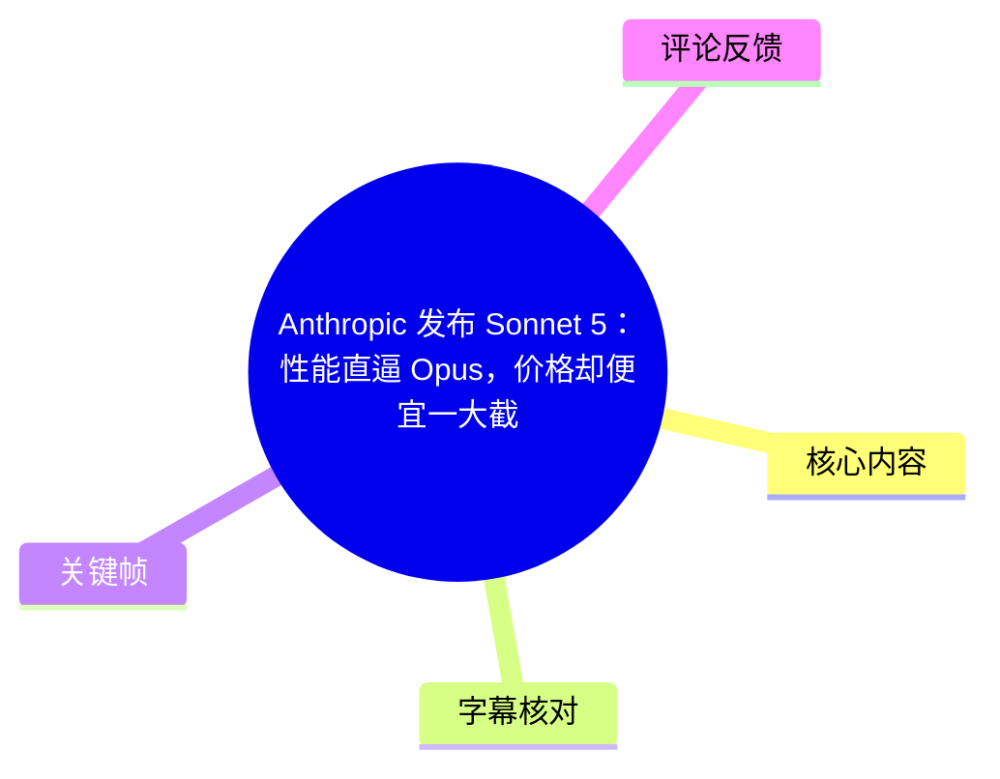
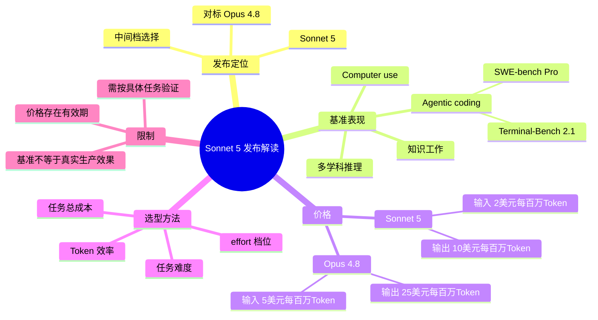
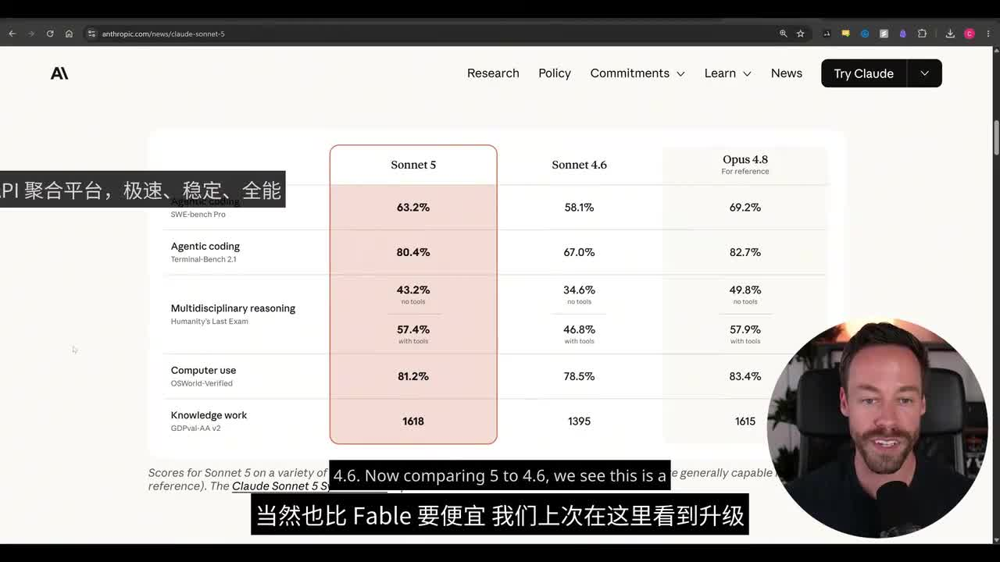
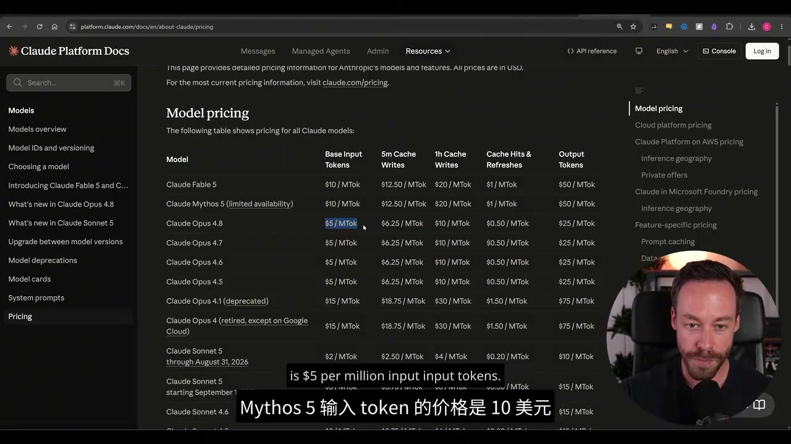

# Anthropic 发布 Sonnet 5：性能直逼 Opus，价格却便宜一大截

> 来源：[Bilibili 视频](https://www.bilibili.com/video/BV1KaT86EEtx)  
> UP 主：NixAI｜分 P：中文配音｜时长：06:20  
> 视频说明：该视频为 Chase AI 原视频《Sonnet 5 is LIVE And It Competes With Opus》的中文配音与二次创作版本；以下内容整理自视频画面、站内字幕和本次 ASR，模型名称、分数与价格均以视频展示为准。

## 小结

视频的核心新闻是：Anthropic 发布了 **Claude Sonnet 5**。视频将其定位为一个更便宜的中间档模型——与 Claude Opus 4.8 相比，Sonnet 5 在多项能力基准上接近 Opus，但 API 标价明显更低。

视频画面中的对比表显示，Sonnet 5 相较 Sonnet 4.6 在 agentic coding、Terminal-Bench 2.1、多学科推理、computer use 和知识工作等项目上均有提升；与 Opus 4.8 相比，差距并非消失，但在部分项目中较小。尤其是知识工作分数，视频表中 Sonnet 5 为 **1618**，略高于 Opus 4.8 的 **1615**。

价格是视频最强调的判断维度。视频所展示的 Claude Platform 定价表中，Sonnet 5 在一项标注“through August 31, 2026”的价格下，基础输入为 **$2 / MToken**、输出为 **$10 / MToken**；Opus 4.8 则为输入 **$5 / MToken**、输出 **$25 / MToken**。按这组标价，Sonnet 5 的输入价格为 Opus 4.8 的 40%，输出价格也更低，但这不等同于任意任务的实际完成成本一定更低。

视频进一步引入不同 `effort` 档位的 Agentic Search 对比，指出“模型单价”不能替代“任务总成本”。Sonnet 5 的低、中、高 effort 档位会带来不同通过率与成本；在复杂任务上，若 Opus 的 token 效率更高，Opus 可能以更少的推理/调用完成任务，最终反而更经济。

因此，视频给出的实用结论不是“Sonnet 5 全面取代 Opus”，而是：日常且难度适中的强能力任务可优先评估 Sonnet 5；高复杂度、前沿能力要求极高或需要比较不同 effort 后总成本的任务，仍应把 Opus 4.8 放进对照测试。视频本身也呼吁 Anthropic 给出更清晰的模型选择边界。

> **时效性提示**：本视频元数据发布时间为 2026 年 6 月 30 日，且画面中的 Sonnet 5 价格明确带有截至 **2026 年 8 月 31 日**的期限说明。模型版本、可用性、限时价格、缓存价格与各项 benchmark 均可能后续变动；接入生产环境前应复核 Anthropic 当前官方文档。

## 思维导图

## 目录

- [发布背景与视频主张](#发布背景与视频主张)
- [基准对比：Sonnet 5、Sonnet 4.6 与 Opus 4.8](#基准对比sonnet-5sonnet-46-与-opus-48)
- [价格参数与成本含义](#价格参数与成本含义)
- [Agentic Search：effort 档位改变结论](#agentic-searcheffort-档位改变结论)
- [模型选型步骤与适用场景](#模型选型步骤与适用场景)
- [视频中的安全与评测保留意见](#视频中的安全与评测保留意见)
- [结论、限制与时效性](#结论限制与时效性)
- [字幕比对](#字幕比对)
- [评论分析](#评论分析)
- [处理记录](#处理记录)

## [发布背景与视频主张](https://www.bilibili.com/video/BV1KaT86EEtx?t=0)

视频开场介绍 Anthropic 发布 Sonnet 5，并称将从基准表现和实际使用中需要关注的重点展开。由于中英文自动转写对模型名存在大量误识别，结合视频标题、网页画面和英文列标题，正文统一采用以下名称：

- **Claude Sonnet 5**
- **Claude Sonnet 4.6**
- **Claude Opus 4.8**
- **Claude Fable 5**
- **Claude Mythos 5**

其中，后两者主要出现在价格表中；视频并未对其能力、可用范围或产品定位作完整解释，因此不据此延伸推断。

视频的主要论点可拆为两层：

1. **能力层面**：Sonnet 5 相较 Sonnet 4.6 有明显升级，且与 Opus 4.8 的差距已缩小到值得比较的范围。
2. **成本层面**：如果面对的不是必须追逐最前沿能力的任务，Sonnet 5 可能以更低标价提供足够强的效果；但复杂任务还必须考虑 token 效率和 effort 档位，不能只看单价。

## [基准对比：Sonnet 5、Sonnet 4.6 与 Opus 4.8](https://www.bilibili.com/video/BV1KaT86EEtx?t=20)

视频展示了 Anthropic 网页中的三模型对照表。下表按画面可辨识文字整理；其中“分数越高是否一定代表现实任务更好”并不能仅凭该表确定。

| 能力类别 / 测试 | Sonnet 5 | Sonnet 4.6 | Opus 4.8（参考） | 视频中的解读 |
| --- | ---: | ---: | ---: | --- |
| Agentic coding：SWE-bench Pro | 63.2% | 58.1% | 69.2% | Sonnet 5 高于 4.6，但与 Opus 的最大差距出现在此项。 |
| Agentic coding：Terminal-Bench 2.1 | 80.4% | 67.0% | 82.7% | Sonnet 5 接近 Opus，视频口述概括为约差 2 个百分点。 |
| Multidisciplinary reasoning：Humanity's Last Exam，无工具 | 43.2% | 34.6% | 49.8% | Sonnet 5 明显高于 4.6、低于 Opus。 |
| Multidisciplinary reasoning：Humanity's Last Exam，带工具 | 57.4% | 46.8% | 57.9% | Sonnet 5 与 Opus 极接近。 |
| Computer use：OSWorld-Verified | 81.2% | 78.5% | 83.4% | Sonnet 5 与 Opus 相差 2.2 个百分点。 |
| Knowledge work：GDPval-AA v2 | 1618 | 1395 | 1615 | Sonnet 5 在该表中略高于 Opus 4.8。 |

> 图：该关键帧直接呈现三个模型在六个项目上的数据，是核对“Sonnet 5 接近 Opus、同时高于 Sonnet 4.6”这一视频主张的核心证据。图中还保留了测试名称及“with tools / no tools”的条件，避免把不同测试环境的分数混为一谈。

### 视频如何解读这些数据

视频强调，Sonnet 5 对 Sonnet 4.6 的提升并非局限于单一项目，而是覆盖了 agentic coding、多学科推理、computer use 与知识工作。与 Opus 4.8 对比时：

- 在 **SWE-bench Pro**，Sonnet 5 为 63.2%，Opus 4.8 为 69.2%，相差 6.0 个百分点。
- 在 **Terminal-Bench 2.1**，Sonnet 5 为 80.4%，Opus 4.8 为 82.7%，相差 2.3 个百分点。
- 在 **OSWorld-Verified**，Sonnet 5 为 81.2%，Opus 4.8 为 83.4%，相差 2.2 个百分点。
- 在带工具的 Humanity's Last Exam 项目中，Sonnet 5 为 57.4%，与 Opus 4.8 的 57.9% 相差 0.5 个百分点。
- 在 GDPval-AA v2 项目中，视频表内 Sonnet 5 的 1618 高于 Opus 4.8 的 1615，差值为 3。

这些分数支持“若干特定评测中较接近”的说法，但不支持“Sonnet 5 在所有任务上优于或等同于 Opus”的泛化结论。特别是 SWE-bench Pro 的差距说明，涉及复杂软件工程代理任务时仍应独立验证。

## [价格参数与成本含义](https://www.bilibili.com/video/BV1KaT86EEtx?t=86)

视频随后转到 Claude Platform Docs 的模型价格页面，并以每百万 Token（MToken）计价进行比较。

| 模型 | 基础输入价格 | 输出价格 | 视频中可见的补充信息 |
| --- | ---: | ---: | --- |
| Claude Fable 5 | $10 / MToken | $50 / MToken | 画面表中可见缓存相关列。 |
| Claude Mythos 5（limited availability） | $10 / MToken | $50 / MToken | 画面标注“limited availability”。 |
| Claude Opus 4.8 | $5 / MToken | $25 / MToken | 页面同时列出缓存写入、缓存命中与刷新价格。 |
| Claude Sonnet 5 | $2 / MToken | $10 / MToken | 画面标注该行价格“through August 31, 2026”。 |

> 图：该关键帧保留了计价单位、输入与输出列以及 Sonnet 5 的期限标注。它说明视频所说的“便宜”是 API 单位标价的比较，而不是未经计算的端到端任务成本结论。

### 可直接从画面得出的比例

以视频画面中的基础输入/输出价格计算：

- Sonnet 5 输入：$2 / MToken；Opus 4.8 输入：$5 / MToken。  
  Sonnet 5 输入单价为 Opus 4.8 的 **40%**，即低 **60%**。
- Sonnet 5 输出：$10 / MToken；Opus 4.8 输出：$25 / MToken。  
  Sonnet 5 输出单价同样为 Opus 4.8 的 **40%**，即低 **60%**。

视频口述“不到 Opus 成本的一半”时，比较的是该基础价格层面的输入与输出单价。更严谨地说，实际账单还会受以下因素影响：

- 输入和输出 token 的实际比例；
- 是否使用 prompt cache，以及对应的缓存写入、缓存命中、刷新价格；
- 单任务需要的调用次数；
- 使用的 `effort` 档位；
- 模型是否能以更少 token 或更少轮次完成任务；
- 任务失败后重试、人工审查和工具调用造成的附加成本。

因此，**标价低于一半**不等于**每个任务的总成本都低于一半**。

## [Agentic Search：effort 档位改变结论](https://www.bilibili.com/video/BV1KaT86EEtx?t=159)

视频明确提醒：除固定 benchmark 外，还应看 Agentic Search 在不同 `effort` 等级下的表现。视频口述比较对象为 Opus 4.8、Sonnet 5 和 Sonnet 4.6，但所给字幕没有完整保留图表中的每个具体数值。

可确认的关键信息如下：

1. **Sonnet 5 的不同 effort 档位差异显著。**  
   视频举例称 Sonnet 5 在 `low` 模式下的通过率为 **55%**。

2. **低 effort 并不保证 Sonnet 5 优于 Sonnet 4.6。**  
   视频称，在低 effort 设定下，Sonnet 4.6 的表现反而更好，且成本更低。这里的含义是：版本号升级不能替代档位间的实际比较。

3. **中等 effort 的意义是压低成本。**  
   视频称切换到 `medium` 后，可以获得与 Sonnet 4.6 接近的表现，同时价格更低。由于缺失完整图表数值，不能进一步写成精确成本差。

4. **高 effort 才开始超过 Sonnet 4.6，但成本也随之上升。**  
   视频称 Sonnet 5 到 `high effort` 后才开始超过 Sonnet 4.6；此时的花费已接近 Sonnet 4.6 的高 effort 成本。

5. **Sonnet 5 高 effort 与 Opus 的对比更微妙。**  
   视频称，当 Sonnet 5 使用高档位时，成本与 Opus 接近；同时还称 Opus 在中、高档位的表现和价格比较中可能具有更高通过率或效率优势。由于字幕中该处模型名及具体档位有明显误识别，正文只保留其稳定结论：复杂任务不能用低 effort 的 Sonnet 5 表现代表 Sonnet 5 的全部能力，也不能仅按单位 token 标价宣称其一定更省钱。

### 如何理解 `effort`

本视频未定义底层实现机制，因而不能将其具体解释为某一种固定的推理 token、思维链长度或运行时间策略。依据视频可作的保守理解是：

- `low`、`medium`、`high` 代表影响模型成本与通过率的不同工作强度设置；
- 更高 effort 通常旨在换取更高的任务完成能力；
- 选型时需要同时观察**通过率、延迟、token 消耗和总账单**，而非只选模型或只选最低档位。

## [模型选型步骤与适用场景](https://www.bilibili.com/video/BV1KaT86EEtx?t=236)

视频没有提供可复制的 API 命令、SDK 代码或完整实验配置，但给出了明确的决策框架。可按以下顺序把视频经验落到实际评估中。

### 第 1 步：先按任务难度分组

视频将任务大致分为两类：

- **日常、对模型而言不那么困难的工作**：不一定需要 Opus 4.8 的最高能力，Sonnet 5 是值得测试的候选。
- **复杂、对成功率和深度要求极高的工作**：Opus 4.8 可能因 token 效率更高而在最终成本上更有优势。

此处“日常”与“复杂”没有精确定义，实际项目应使用自身历史工单、代码库任务、浏览器操作任务或知识工作样本划分。

### 第 2 步：不要只比较模型名，要比较模型加档位

对每类任务分别测试至少以下候选组合：

| 任务类型 | 建议优先比较的组合 | 比较目的 |
| --- | --- | --- |
| 成本敏感、难度一般 | Sonnet 5 `low` / `medium` 与既有方案 | 确认更低成本下是否已达到可接受成功率。 |
| 需要更高稳定性 | Sonnet 5 `high` 与 Sonnet 4.6 高档位 | 验证版本升级能否抵消更高 effort 的成本。 |
| 高复杂度代理任务 | Sonnet 5 高档位与 Opus 4.8 | 计算成功完成一次任务的总成本，而非 token 单价。 |
| computer use 类任务 | Sonnet 5 与 Opus 4.8 | 视频表中差距较小，但仍需用真实页面、权限和失败恢复流程验证。 |

### 第 3 步：用“成功任务成本”替代“Token 单价”

可用如下指标组织内部测试：

\[
\text{成功任务成本} =
\frac{\text{该批任务总 API 成本 + 重试成本}}{\text{成功完成的任务数量}}
\]

同时记录：

- 首次成功率；
- 重试后的最终成功率；
- 平均输入与输出 token；
- 平均调用次数；
- 任务耗时；
- 是否需要人工接管；
- 输出是否满足业务质量门槛。

这一定义与视频关于“Opus 可能因 token 效率高而更便宜”的提醒一致：即便某模型每 MToken 更贵，只要它显著减少失败、重试或冗长推理，总体上仍可能胜出。

### 第 4 步：将 benchmark 视为候选筛选，而不是上线证明

视频展示的 SWE-bench Pro、Terminal-Bench 2.1、OSWorld-Verified、GDPval-AA v2 等数据适合帮助理解模型能力方向，但不能替代生产验证。实际任务还受到上下文长度、工具可靠性、权限设计、提示词、数据质量、评估规则及失败恢复能力影响。

## [视频中的安全与评测保留意见](https://www.bilibili.com/video/BV1KaT86EEtx?t=294)

视频后段提出两类保留意见。

### 对 benchmark 图表保持警惕

视频作者明确表示，自己不会过度在意这些 benchmark 图表。其真正关心的问题是：Anthropic 需要更清楚地说明模型选择的分界线——

- 哪些情况下 Sonnet 5 已足够，并且确实比 Opus 便宜；
- 哪些情况下任务复杂度达到某个阈值后，Opus 因效率更高而更值得使用。

这也是视频最具可迁移性的观点：模型比较不应停留在“谁的单项分更高”，而应回到特定工作流中的完成率与实际总成本。

### 安全相关内容无法作精确技术复述

视频字幕与 ASR 在约 05:00 附近出现了严重的专有名词错误，例如“漏洞利用”“网络安全问题”“MATHS/MESAS”等片段虽被识别到，但无法从现有文本稳定还原其指代的具体评测、漏洞类别或 Anthropic 原始结论。

因此，只能保留视频层面的概括：作者提到 Anthropic 发布模型时的对齐/安全讨论，并认为这些内容不构成其当前最关注的模型选型问题。**现有素材不足以支持对安全能力、漏洞利用能力或网络安全风险作任何具体判断。**

## [结论、限制与时效性](https://www.bilibili.com/video/BV1KaT86EEtx?t=342)

视频把 Sonnet 5 描述为 Anthropic 产品线中一个有吸引力的“中间档”选择：它在画面所示多个测试中明显超过 Sonnet 4.6，并在若干项目上接近 Opus 4.8，而输入/输出基础单价均为 Opus 4.8 的 40%。

但“性能接近、价格更低”是一个需要附条件理解的命题：

- Sonnet 5 在 SWE-bench Pro 上仍落后 Opus 4.8；
- 测试项目不能自动代表内部业务任务；
- `effort` 设置会同时改变效果与成本；
- 高难度任务中，Opus 可能凭 token 效率和更少重试获得更低成功任务成本；
- 视频展示的 Sonnet 5 价格带有截至 2026 年 8 月 31 日的期限；
- 视频未提供完整的 Agentic Search 图表数值、实验提示词、调用参数、任务集和统计方法，无法复现实验或验证所有口述结论。

对实践者而言，最稳妥的做法是：将 Sonnet 5 纳入候选池，用自己的典型任务分别测试低、中、高 effort，并以成功率、延迟、重试率和成功任务总成本与 Opus 4.8 比较后再做路由或采购决策。

## 字幕比对

> 本次任务已执行 ASR。两份字幕均未提供逐句时间戳，因此章节时间轴依据视频内容顺序与关键帧语境估计，适合导航，不适合作为逐字对齐证据。

| 字幕来源 | 完整性 | 专有名词 | 时间轴 | 主要问题 |
| --- | --- | --- | --- | --- |
| Bilibili 站内字幕 | 覆盖了视频主体与结尾推广语，整体较完整 | 较差，模型名频繁被写为“SUNY图”“opp s”“fable”“miths”等 | 未提供逐句时间戳 | 中英混杂术语和数字上下文存在误识别；`effort` 段落及安全段落尤为不稳定。 |
| 本次 ASR 字幕 | 覆盖开场、基准、价格、effort、选型与结尾 | 较差，与站内字幕类似，出现“三里图”“Sunny 5”“OPPUS”“Viginti computer”等误识别 | 未提供逐句时间戳 | 断句重复，如“离谱的”；模型、评测和安全术语的识别错误较多。 |

### 最终字幕使用策略

本整理没有机械选择任一单独字幕，而是采用“**站内字幕与 ASR 交叉核对 + 关键帧文字优先**”的策略：

- 通过视频标题、网页地址栏、表格列标题和关键帧，校正为 **Claude Sonnet 5、Claude Sonnet 4.6、Claude Opus 4.8**。
- 通过基准表校正并保留精确数值：63.2%、58.1%、69.2%、80.4%、67.0%、82.7%、43.2%、34.6%、49.8%、57.4%、46.8%、57.9%、81.2%、78.5%、83.4%、1618、1395、1615。
- 通过定价页校正价格为 Sonnet 5 输入 $2 / MToken、输出 $10 / MToken；Opus 4.8 输入 $5 / MToken、输出 $25 / MToken。
- 对无法由画面和上下文可靠复原的术语不强行纠错，尤其是 Agentic Search 图表的完整参数与后段安全相关内容，均保留不确定性说明。

## 评论分析

当前可获取的热评数据为空：`items: []`。因此没有可分析的热评前三条。

- 未获取到第 1 条热评；
- 未获取到第 2 条热评；
- 未获取到第 3 条热评。

这不代表视频没有评论，仅表示本次提供的评论抓取结果中没有可用条目；不应据此推断观众态度、争议点或使用反馈。

## 处理记录

- **Worker ID**：worker-mrj0wjed-b0c290ad
- **模型**：gpt-5.6-terra
- **调用工具与素材**：基于任务提供的视频元数据、站内字幕、本次 ASR 字幕、关键帧目录、封面信息与评论抓取结果完成整理；未提供可复述的独立工具调用日志或工具名称。
- **字幕选择**：本次 ASR 已执行；最终采用站内字幕与 ASR 交叉校验，并以关键帧中的网页表格、视频标题和上下文校正核心模型名、分数与价格。无法可靠校正的安全术语与部分 effort 图表细节不作补写。
- **关键帧选择依据**：
  - `frames/frame-001.jpg`：包含 Sonnet 5、Sonnet 4.6、Opus 4.8 的完整能力对照表，适合支撑基准章节。
  - `frames/frame-003.jpg`：包含 Claude Platform Docs 定价表及 Sonnet 5 的价格期限，适合支撑价格与时效性章节。
- **缓存清理**：提供的素材清单未包含缓存目录、缓存清理命令或清理结果；本记录不能证实已执行缓存清理，故不作已清理声明。
- **未解决问题**：
  - Agentic Search 各 effort 档位的完整图表数值未在现有字幕中可靠保留。
  - 视频后段安全、对齐与网络安全相关术语存在严重转写歧义，无法作技术级复述。
  - 价格与模型状态具有时效性，尤其 Sonnet 5 画面价格存在截至 2026 年 8 月 31 日的期限标注。
