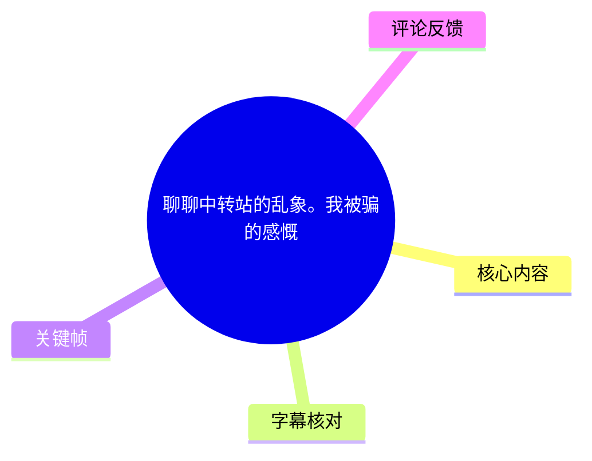
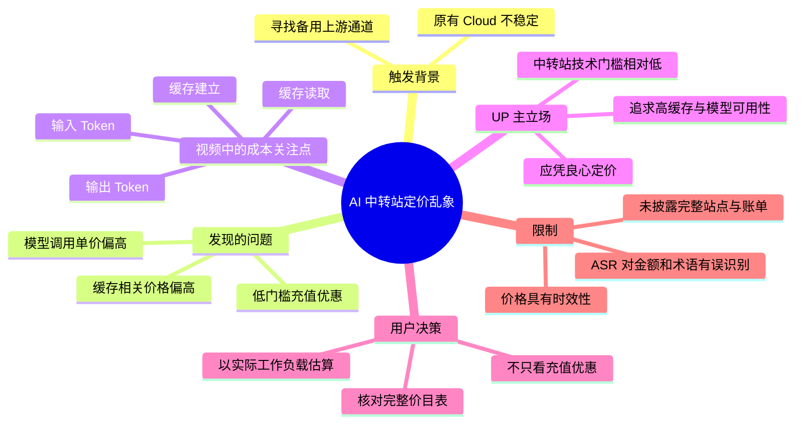
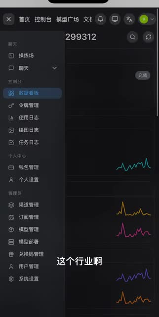
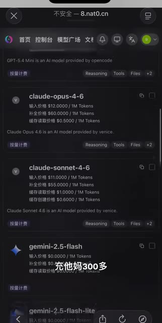
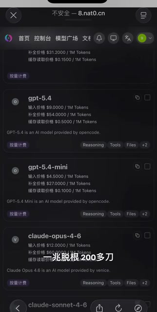
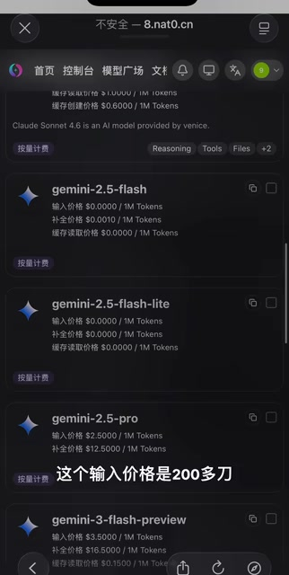

# 聊聊中转站的乱象。我被骗的感慨

> 来源：[Bilibili 视频](https://www.bilibili.com/video/BV1Mx9wBQEH9)<br>
> UP 主：又是爱媳妇儿的一天呀｜视频时长：1 分 33 秒｜合集：AIcode  
> 视频主题：UP 主结合自己寻找备用上游通道时看到的报价页面，批评部分 AI 模型中转站以低充值门槛吸引用户、再通过高模型单价或高缓存相关价格收费的现象。

## 小结

视频讨论的是 AI 模型“中转站”行业中的定价乱象。UP 主称，自己原有的中转站 Cloud 近期不够稳定，因此在寻找可作为备份的上游通道；在此过程中，他看到部分站点以“少量优惠、充值 300 美元”等方式吸引充值，但实际模型调用价格可能很高。

UP 主重点质疑两类收费：其一是个别模型的输入、输出 Token 单价被抬高，导致“一次打字”也可能产生数美元成本；其二是缓存读取与缓存建立价格偏高。他的核心逻辑是：缓存本应服务于降低重复上下文调用的成本，若缓存价格本身过高，就削弱了缓存机制的节省作用。

视频并未给出完整站点名称、收费规则截图的全部上下文、官方价格基准或可复现实测账单。因此，“被骗”“乱象”“价格高”等是 UP 主的个人经历和评价，不应直接外推为对所有中转站的已验证结论。画面可确认存在模型列表及多种价格字段，但不能仅凭短视频确认每项价格对应的币种、计费单位、折扣条件、渠道成本或是否为实时价格。

可迁移的经验是：选择中转站不能只看充值优惠、单一输入价或首页宣传价，应同时核对输入、输出、缓存读取、缓存建立等完整计费项，并以实际请求的 Token 构成估算总成本。对于长上下文、重复提示词和 Agent 工作流，缓存相关计费尤其重要。

本视频发布于 2026 年 4 月初；模型名称、供应商、上游成本与中转站价格均可能快速变化。视频中的具体数字应视为当时页面或口述所反映的信息，而非当前有效报价。

## 思维导图





## 目录

- [背景：为稳定性寻找备用通道](#背景为稳定性寻找备用通道)
- [案例一：优惠充值与高模型单价的反差](#案例一优惠充值与高模型单价的反差)
- [案例二：缓存价格不应背离省钱目的](#案例二缓存价格不应背离省钱目的)
- [UP 主的服务原则与用户关系](#up-主的服务原则与用户关系)
- [可执行的核价与选站步骤](#可执行的核价与选站步骤)
- [参数、证据边界与时效性](#参数证据边界与时效性)
- [字幕比对](#字幕比对)
- [评论分析](#评论分析)
- [关键帧索引](#关键帧索引)
- [处理记录](#处理记录)

## 背景：为稳定性寻找备用通道 [00:00:01](https://www.bilibili.com/video/BV1Mx9wBQEH9?t=1)

ASR 从 1.27 秒开始识别到讲话。UP 主开场表示要谈“中转站”行业，并判断目前“乱象太大”。结合视频简介，他此前使用的中转站 Cloud 近两天“不太稳定”，于是准备寻找较好的上游通道，建立备份通道。

这里的“中转站”在视频语境中，指向用户提供多模型调用入口、模型路由或 API 转发服务的平台。该视频并未技术性说明其架构、上游授权链路、模型转发方式、并发限制或数据处理策略，重点仅在定价与经营方式。



> 图：画面显示一个深色后台界面，左侧包括“数据看板”“令牌管理”“使用日志”“订阅管理”“模型管理”“模型部署”等菜单。这张图的价值在于确认视频讨论的对象是带有令牌、模型和用量管理功能的平台后台，而非泛泛而谈的消费类产品。

## 案例一：优惠充值与高模型单价的反差 [00:00:01](https://www.bilibili.com/video/BV1Mx9wBQEH9?t=1)

UP 主在 1.27—40.27 秒描述自己看到的一类做法：站点以“便宜 10 块钱充 300 刀”（ASR 原文）一类促销信息吸引用户充值，但用户进入模型价格页后，发现实际调用成本很高。视频简介对这段口述补充称，有中转站“便宜三块钱充三百刀”，但用户发现想用的模型“输入价格 80 刀、输出价格两百刀”。

由于 ASR 在金额、模型名和数字处存在明显重复与乱码，且站内没有字幕，不能把 ASR 中的“70 多刀”“200 多”等当作精确可核验报价。较稳妥的结论是：**UP 主认为某些平台的充值优惠与实际调用报价之间存在强烈反差，尤其是输出侧价格可能显著偏高。**

他用“打个字出去好几块钱”描述高价对使用体验的影响。这是对单次请求综合成本的口语化表达，并未说明该请求的输入长度、输出长度、是否命中缓存、所用模型、汇率、折扣等级或其他附加费用，不能据此反推统一的每 Token 成本。



> 图：该关键帧显示模型列表中 `claude-opus-4-6`、`claude-sonnet-4-6` 等条目，并能看到“输入价格”“补全价格”“缓存读取价格”“缓存创建价格”等字段。其价值在于直观说明：比较价格时不能只看充值优惠或某一个价格字段，而要阅读完整计费结构。画面顶部还出现浏览器“不安全”提示，但视频没有解释该提示的原因，不能据此判定站点安全性。



> 图：画面可见 `gpt-5.4`、`gpt-5.4-mini` 与 Claude 模型条目。以画面可辨字段为例，`gpt-5.4` 条目显示输入价格 `$4.0000 / 1M Tokens`、补全价格 `$4.0000 / 1M Tokens`、缓存读取价格 `$0.1500 / 1M Tokens`。这与 UP 主口述的高价案例不必然对应同一模型、同一时刻或同一计费条件；它的主要价值是展示平台按 1M Tokens 拆分多项价格的呈现方式。

## 案例二：缓存价格不应背离省钱目的 [00:00:41](https://www.bilibili.com/video/BV1Mx9wBQEH9?t=41)

41.54—65.55 秒，UP 主将批评重点转向缓存价格。他认为缓存的存在是为了节省重复上下文带来的调用成本，如果平台把缓存读取或缓存建立也定得很高，用户难以获得预期的节省效果。

由于 ASR 对这段的识别质量较差，诸如“赌缓分价”“建立缓团价”等不是可靠术语。结合视频简介，可较明确地还原为：

- UP 主提到有平台的**缓存价格**可达约 5—6 美元；
- **建立缓存价格**可达 7 美元左右；
- 以上数字的具体计费单位、模型归属及实际页面对应关系，视频没有完整交代；
- UP 主据此认为，平台是在通过缓存相关项目进一步收费。

需要区分“缓存读取”和“缓存建立”两类项目：

1. **缓存读取**：在平台已有可复用上下文后，后续请求读取该缓存时的计费。
2. **缓存建立**：首次将可复用上下文写入或建立为缓存时的计费。
3. **实际是否省钱**：取决于缓存建立成本、读取折扣、重复使用次数、缓存命中率、缓存有效期，以及未命中时是否仍按普通输入计费。

视频的观点是“缓存应该用于省钱”；但它没有给出每个站点的缓存命中规则、最短缓存长度、有效时长、折扣倍率或可复现账单，因此无法从视频中计算明确的盈亏临界点。



> 图：该帧展示 `gemini-2.5-flash`、`gemini-2.5-flash-lite`、`gemini-2.5-pro` 等条目，同样列出了输入、补全、缓存读取、缓存创建四类字段。其中部分条目画面显示为 `$0.0000`，而 `gemini-2.5-pro` 可见输入 `$2.5000 / 1M Tokens`、补全 `$12.5000 / 1M Tokens`。图像价值在于说明不同模型的计费结构可能差异很大；但零价格是否代表免费、暂未配置、限时活动或显示异常，视频未说明。

## UP 主的服务原则与用户关系 [00:01:05](https://www.bilibili.com/video/BV1Mx9wBQEH9?t=65)

65.55—75.08 秒，UP 主转而说明自己的经营取向：当前用户数量不多，主要是已有的一批忠实用户或粉丝；他不准备做“花里胡哨”的操作，希望做一个“有价值”的中转站，并强调“扛用”（即稳定、实用、能够使用）。

视频简介进一步表述了他的目标：打造“高缓存，所有模型都扛用”的中转站。这里的“高缓存”是 UP 主的服务愿景或宣传性表述，视频没有给出缓存命中率、缓存容量、命中规则、SLA、可用性统计、故障恢复时间或模型覆盖清单，因此不能将其视为已经量化验证的性能承诺。

## 结语：在合理范围内赚钱 [00:01:16](https://www.bilibili.com/video/BV1Mx9wBQEH9?t=76)

76.91—92.56 秒，UP 主总结其价值判断：平台可以在自身合理范围内赚钱，但不应采用“整水”（口语，意指不透明或不厚道操作）的方式；否则用户可能只使用一次，之后不再回访。

这段没有新增技术参数，主要传达两点：

- **商业边界**：UP 主不反对中转站获利，反对的是其认为不合理、缺乏诚意或导致用户成本失控的收费方式。
- **长期经营逻辑**：短期高收费可能损害复购和信任，透明、可用、价格结构合理才更可能形成长期用户关系。

## 可执行的核价与选站步骤 [00:00:41](https://www.bilibili.com/video/BV1Mx9wBQEH9?t=41)

以下是根据视频所提出问题整理出的核查流程；这是对视频观点的实践化归纳，不是视频中逐条演示的操作教程。

### 1. 先确认要使用的模型与工作负载

至少记录：

- 目标模型；
- 单次请求的大致输入 Token 数；
- 预期输出 Token 数；
- 是否有长系统提示词、知识库内容或重复上下文；
- 是否会多轮调用、并发调用或反复复用同一提示词。

只有知道工作负载，才不能被“充值立减”或单项低价误导。

### 2. 抄录完整价格表，而非只看一个数字

对每个候选平台，逐模型记录：

| 项目 | 需要核对的内容 |
| --- | --- |
| 输入价格 | 通常按每 1M Tokens 计费；确认币种与单位 |
| 输出／补全价格 | 输出常与输入价格不同，可能是总成本的大头 |
| 缓存读取价格 | 确认命中缓存后的读取单价 |
| 缓存建立价格 | 确认首次写入缓存的成本 |
| 充值规则 | 充值门槛、优惠金额、赠金限制、有效期、退款规则 |
| 模型状态 | 是否可用、是否限流、是否为真实目标模型、是否注明上游 |
| 其他费用 | 最低消费、服务费、倍率、并发套餐或账户等级差异 |

视频画面中的模型列表以 `/ 1M Tokens` 展示价格，因此单位确认是必要步骤。不同平台也可能使用不同币种、不同倍率或不同文本命名，不能仅按“数字大小”横向比较。

### 3. 用自己的 Token 结构计算预估成本

可以使用下式进行估算：

```text
单次总成本
= 输入 Token ÷ 1,000,000 × 输入单价
+ 输出 Token ÷ 1,000,000 × 输出单价
+ 缓存读取 Token ÷ 1,000,000 × 缓存读取单价
+ 缓存建立 Token ÷ 1,000,000 × 缓存建立单价
+ 其他已披露费用
```

注意：缓存读取 Token 和缓存建立 Token 不一定同时出现，也不一定覆盖全部输入；具体取决于平台的缓存机制。若平台不公开命中与计费规则，就无法可靠计算缓存是否真正划算。

### 4. 小额测试并保留用量记录

视频批评的一个风险点正是先充值、后发现价格不合适。因此更稳妥的做法是：

1. 不因小额优惠立即大额充值；
2. 用相同提示词在候选平台发起小额测试；
3. 记录请求前后余额、请求 Token 用量与账单明细；
4. 对比页面标价、实际扣费和响应稳定性；
5. 确认提现、退款、账户封禁与服务条款后，再决定是否长期使用。

这些步骤可降低预付费后才发现计费规则不符合预期的风险，但不能消除平台变更价格、上游涨价或服务中断的风险。

## 参数、证据边界与时效性 [00:00:01](https://www.bilibili.com/video/BV1Mx9wBQEH9?t=1)

### 视频明确涉及的参数

| 参数/信息 | 视频所述或画面所示 | 可靠性说明 |
| --- | --- | --- |
| 视频时长 | 93 秒 | 元数据可确认 |
| ASR 有效语音区间 | 00:00:01.270—00:01:32.560 | 本次 ASR 诊断可确认 |
| ASR 语音覆盖率 | 93.52% | 本次 ASR 诊断值；不等于文本准确率 |
| 促销充值 | 口述“便宜 10 块钱充 300 刀”；简介称“便宜三块钱充三百刀” | 两处表述不一致，不能确定准确优惠额 |
| 高价案例 | UP 主口述高输入/输出成本；简介称输入 80 刀、输出 200 刀 | 属于 UP 主陈述，缺少可完整复核的站点与账单 |
| 缓存价格 | 简介称缓存可 5 或 6 刀、建立缓存可到 7 刀 | 未说明单位、模型与条件 |
| 页面单位 | 可见多个条目使用 `/ 1M Tokens` | 可从关键帧直接读取 |
| GPT-5.4 画面价格 | 输入 `$4.0000`、补全 `$4.0000`、缓存读取 `$0.1500` / 1M Tokens | 仅能确认该帧可见页面文本；不代表整个行业价格 |
| Gemini 2.5 Pro 画面价格 | 输入 `$2.5000`、补全 `$12.5000` / 1M Tokens | 同上 |

### 不能由视频确认的事项

- 被批评平台的完整名称、所有权、上游渠道与定价历史；
- UP 主所称“被骗”的具体交易过程、实际充值金额及最终损失；
- 高价条目是否来自同一个页面、同一时刻、同一账户等级；
- 页面中模型名称是否等同于原厂官方模型、是否存在路由或倍率；
- 缓存价格的计费单位、命中条件、有效期及真实节省效果；
- “高缓存”“所有模型都扛用”是否已经达到可量化的服务水平。

### 时效性提示

元数据显示视频发布于 2026 年 4 月初，素材获取时间为 2026-07-15。AI 模型命名、定价、缓存政策和平台规则可能在短时间内调整。任何充值或迁移决定都应以当前价目表、当前条款和小额实测为准，不能直接依赖本视频中的价格口述或截图。

## 字幕比对

| 字幕来源 | 完整性 | 专有名词 | 时间轴 | 主要问题 |
| --- | --- | --- | --- | --- |
| Bilibili 站内字幕 | 未提供可用字幕 | 无法评估 | 无法评估 | 素材明确标注“未提供可用站内字幕” |
| 本次 ASR 字幕 | 5 段，覆盖约 86.75 秒语音，诊断覆盖率 93.52% | 较差，模型名、金额、缓存术语存在误识别 | 可用，SRT 提供 1.270—92.560 秒真实分段 | 数字重复、乱码，且将“中转站”“缓存”等词识别为近音字 |

本次 ASR 已检查：识别语言为中文（`zh`），语言置信度为 `0.994140625`，使用 `medium` 模型、CUDA 与 `float16` 推理；诊断中**没有**标记 `noAudioStream=true`，说明源视频存在音轨，不能将字幕误差归因为无音轨。

最终字幕策略为：**以本次带时间戳 ASR 作为时间轴依据，以视频简介、关键帧中可读文字和语义上下文做有限校正；不虚构未听清的金额或专有名词。** 由于没有站内字幕，无法进行逐句官方字幕对照。

重点校正与保留原则如下：

| ASR 原文问题 | 正文处理方式 | 依据 |
| --- | --- | --- |
| “中整站”“中整战” | 统一写作“中转站” | 标题、简介、标签均为“中转站” |
| “Cloud” | 保留为 Cloud | 视频简介明确提及“中转站cloud” |
| “GBT5.4” | 不将其直接改写为确定模型名；图中可见 `gpt-5.4` | ASR 存在错误，但关键帧可见相关条目 |
| “赌缓分价”“建立缓团价” | 归纳为缓存价格、缓存建立价格 | 视频简介明确提供相应术语 |
| “70多刀”“200多”连续重复 | 不作为精确价格引用 | ASR 数字识别严重失真；简介与 ASR 数字也不一致 |
| “整那么些水” | 以“UP 主认为是不透明或不厚道操作”转述 | 口语含义存在解释空间，不强作技术术语 |

## 评论分析

仅处理本次可获取的热评前三条。评论是用户观点或个人经验，不构成已验证事实。

1. **旁边是上帝｜60 赞：**“Openrouter 大善人”  
   - 观点：评论者以调侃或赞誉方式将 OpenRouter 与视频批评的中转站作对照。  
   - 补充价值：反映部分用户会把聚合路由平台视为价格或体验的比较对象。  
   - 可信度边界：未给出模型、时间、Token 用量或价格证据，也没有解释“善人”具体指价格、稳定性、透明度还是模型覆盖，不能据此认定其更便宜或更可靠。

2. **LirxOwO｜46 赞：**“低价高计费高缓存高倍率，咸鱼淘宝的都这样，太坑了”  
   - 观点：评论者概括其观察到的风险组合：入口低价、实际计费高、缓存贵、倍率高。  
   - 补充价值：与视频对“充值优惠—调用高价—缓存高价”的担忧相呼应，并提醒用户关注倍率。  
   - 可信度边界：评论将范围概括为“咸鱼淘宝的都这样”，属于宽泛判断；没有样本、页面或账单，不能据此对全部相关卖家作事实认定。

3. **茶霖霜｜19 赞：**“官方5.5 1.1亿token花了180刀，这算贵算便宜”  
   - 观点：评论者给出一笔个人使用数据，询问 1.1 亿 Token 花费 180 美元的成本水平。  
   - 可计算信息：按评论字面计算，平均成本约为 `$180 ÷ 110 = $1.64 / 1M Tokens`。  
   - 可信度边界：该平均值无法直接判断贵或便宜，因为缺少模型的准确名称，“官方 5.5”的含义、输入输出比例、缓存占比、是否含订阅或折扣、计费时段等关键信息均未披露。尤其是输入和输出单价通常不同，混合平均价不能替代完整价目比较。

## 关键帧索引

| 关键帧 | 正文位置 | 画面信息 | 选用价值 |
| --- | --- | --- | --- |
| [frame-001.jpg](frames/frame-001.jpg) | 背景 | 平台后台、数据看板、令牌与模型管理菜单 | 确认讨论对象具有中转/API 服务后台特征 |
| [frame-002.jpg](frames/frame-002.jpg) | 案例一 | Claude 模型列表及输入、补全、缓存字段 | 说明价格结构不止一项，需整体核验 |
| [frame-003.jpg](frames/frame-003.jpg) | 案例一 | GPT-5.4、GPT-5.4-mini 与 Claude 条目 | 提供可读的按 1M Tokens 拆分计费示例 |
| [frame-004.jpg](frames/frame-004.jpg) | 案例二 | Gemini 模型与缓存相关字段 | 支撑“不同模型、不同字段均需比较”的分析 |

> 素材清单列出了 `frame-001.jpg` 至 `frame-012.jpg` 的路径，但本次实际提供可供多模态核对的画面内容为前四张；正文仅使用已见且与论述直接相关的关键帧，避免对未展示帧编造描述。

## 处理记录

- Worker ID：`worker-mrj0wjed-b0c290ad`
- 模型：`gpt-5.6-terra`
- 调用工具与素材：任务提供的 Bilibili 元数据、视频简介、关键帧、ASR 诊断、ASR SRT、热评 JSON；未提供可用站内字幕。
- ASR 检查结果：已检查 `asr-result.json` 所列 5 个分段及诊断信息；音频时长约 `92.76375` 秒，未见 `noAudioStream=true` 标记。
- 字幕选择：站内字幕缺失；采用本次 ASR 的真实 SRT 起止时间生成章节时间轴。对“中转站”“缓存”等术语依据标题、简介与画面校正；金额、模型名等高歧义内容保留不确定性。
- 关键帧选择依据：选取了能直接展示后台属性、模型列表、`/ 1M Tokens` 单位、输入/补全/缓存字段的前四张画面，用于支撑计费结构分析；未将页面截图延伸解释为完整账单或行业普遍事实。
- 评论范围：仅分析可获取热评前三条，按点赞数列示；未扩展到其他评论。
- 缓存清理：未执行本地缓存删除操作；本任务仅基于已提供素材生成文档，未获得可操作的缓存目录或清理回执。
- 未解决问题：被批评平台的完整身份、价格单位与适用条件、具体充值和扣费账单、缓存规则、模型上游及当前价格均未在素材中充分提供，无法进一步核验。
