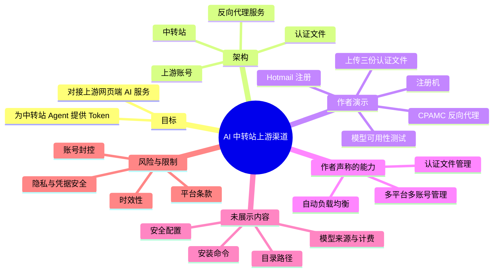
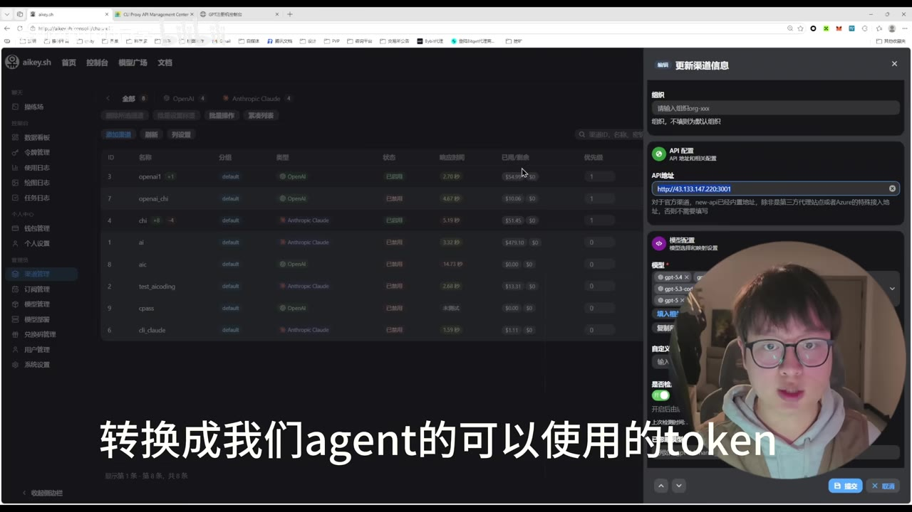
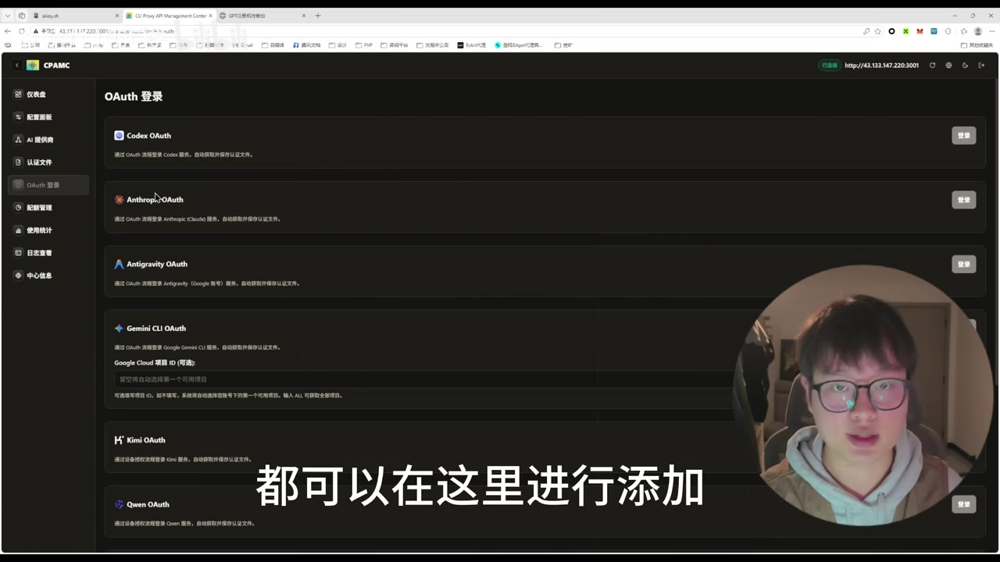

# 中转站揭秘-揭秘AI中转站上游渠道配置

> 来源：[Bilibili 视频](https://www.bilibili.com/video/BV1stDiBqEZN)<br>
> UP 主：会diy的小明同学｜视频时长：02:21｜分区合集：AIcode  
> 视频简介称，本期用于补充其上期 New API 对接/搭建内容，主题是“上游渠道”与反向代理配置。

## 小结

本视频展示了一种“中转站 + 反向代理服务 + 认证文件”的接入思路：将网页端 AI 服务经由反向代理转换为中转站 Agent 可使用的 Token/API 接入。作者在中转站界面中配置反代服务的 IP 与端口，并以一个名为 **CPAMC** 的开源项目作为反向代理服务示例。

作者的核心经验是：反向代理服务可集中管理多个平台、多个账号的认证状态；部分账号即使额度耗尽或被封控，作者声称服务会通过自动负载均衡寻找可用账号。因此，规模化管理时不必逐个在反代面板登录，而可将“注册机”生成的认证文件上传到服务器对应目录。

演示流程包括：选择注册机、以 Hotmail（微软邮箱）注册三个账号、解压得到三份认证文件、上传至服务器对应目录，最后回到中转站测试模型。视频中测试的模型名称被字幕记为 **“GBT5.4”**，但关键帧中的下拉菜单可见近似 **“gpt-5.4”** 的文本；两者均未提供官方模型来源、版本说明或调用参数，不能据此确认其真实模型身份。

这是一段快速概览式演示，而不是可复现的完整部署文档：视频没有展示服务器系统、安装命令、Docker/环境变量、目录绝对路径、权限设置、域名与 TLS、鉴权策略、限流、日志、成本、稳定性指标，也没有公开注册机来源或认证文件格式。因此，适合用于理解作者所描述的组件关系和流程顺序，不足以直接照做部署。

时效性尤其重要。视频中涉及的网页端登录、OAuth/认证文件、账号状态、模型命名、第三方开源项目与平台策略都可能随时变化；将网页端服务转换为 API 形式、批量账号管理或使用第三方认证文件，可能涉及服务条款、账号安全、数据隐私与合规风险。视频未就授权范围、用户数据流向和平台许可作出验证，需自行核实。

## 思维导图




## 目录

- [背景、目标与素材边界](#背景目标与素材边界)
- [反向代理在中转站中的位置](#反向代理在中转站中的位置)
- [账号、认证文件与负载均衡说法](#账号认证文件与负载均衡说法)
- [部署与接入流程](#部署与接入流程)
- [注册机与认证文件上传演示](#注册机与认证文件上传演示)
- [模型测试与可验证范围](#模型测试与可验证范围)
- [技术要点、限制与风险](#技术要点限制与风险)
- [字幕比对](#字幕比对)
- [评论分析](#评论分析)
- [处理记录](#处理记录)

## 背景、目标与素材边界 [00:00:00](https://www.bilibili.com/video/BV1stDiBqEZN?t=0)

作者开场说明，上期关于 AI 中转站的视频获得反馈，本期回应观众对“上游渠道”和相关账号池/账号管理问题的疑问，并提出两个目标：

1. 搭建反向代理；
2. 解决中转站的上游渠道接入问题。

这里的“上游渠道”在视频语境中，指可由反向代理接入的网页端 AI 服务及其账号认证资源，而非官方 API 的具体采购或授权方案。作者没有列出上游渠道的官方名称、采购方式、服务等级协议或授权证明。


> 图：画面以字幕明确标出“和解决上游渠道的问题”。它用于确定视频主题与作者的表述边界：视频主讲的是接入链路，不是官方 API 申请流程或模型性能评测。

### 已知前置条件

从作者的口述与界面可归纳出，演示默认读者已经具备以下条件：

- 已有一个“中转站”管理端；作者提及可参考上期 New API 搭建视频。
- 有一台可部署反向代理服务的服务器，并能向其中上传文件。
- 有反向代理服务的访问地址，作者以“IP 和端口”进行配置。
- 能取得或生成认证文件；作者将其来源称作“注册机”。
- 有待测试的中转站模型渠道配置。

上述是视频呈现的依赖关系，不代表这些做法已获得相关服务商许可。

## 反向代理在中转站中的位置 [00:00:16](https://www.bilibili.com/video/BV1stDiBqEZN?t=16)

作者在中转站的渠道配置界面中说明：反代服务部署在某个 IP 与端口下；中转站通过该地址访问反向代理。作者将其作用概括为：把“网页端的 AI 服务”转换为其 Agent 可使用的 Token。

从视频可见的组件关系可整理为：

```text
中转站管理端
    │ 配置反代服务的访问地址
    ▼
反向代理服务（作者示例：CPAMC）
    │ 读取或管理认证文件
    ▼
网页端 AI 服务 / 对应账号
```

这只是作者演示的逻辑链路。视频没有展示请求协议、Token 生成机制、请求头、API 路由、模型映射规则或数据是否经代理留存，因而不能据此推断其与官方 API 的兼容性、可靠性或安全性。



> 图：画面左侧为中转站的渠道列表，右侧“更新渠道信息”面板可见 API 地址输入项和模型配置区域。这一帧的价值在于直观展示了作者所说的“中转站配置反代服务地址”发生在渠道配置层，而非直接在客户端侧操作。

### 视频中出现的参数与对象

| 项目 | 视频信息 | 可确认程度 |
| --- | --- | --- |
| 中转站 | 作者已有的管理端，视频内进行渠道/模型配置与测试 | 可从界面和口述确认 |
| 反向代理访问方式 | 通过 IP 与端口部署、连接 | 可从作者口述确认 |
| 反向代理项目 | 作者称为“CPAMC” | 可从站内字幕、ASR 与界面左上角文字交叉确认 |
| 上游平台示例 | OpenAI、Claude（站内字幕如此记录） | 作者口述的示例，不代表实际均已成功接入 |
| 认证方式 | 面板登录后生成认证文件，或外部提供认证文件后上传 | 作者口述；格式与授权状态未知 |
| 模型测试名 | 站内字幕为“GBT5.4”，画面近似显示“gpt-5.4” | 名称存在转写/界面可读性歧义，不能视为官方型号证明 |

## 账号、认证文件与负载均衡说法 [00:00:29](https://www.bilibili.com/video/BV1stDiBqEZN?t=29)

作者称，反向代理服务可管理多个平台下的多个账号，例如 OpenAI 和 Claude；每个账号在页面完成登录后会生成一个文件，并可在“认证文件”管理栏中查看已添加的账号。

作者进一步称：

- 一些账号可能额度已经用完；
- 一些账号可能已被封控；
- 上述状态“不会影响使用”，因为服务会自动负载均衡，寻找合适账号进行反向代理。

这段内容应严格理解为**作者对其所用服务行为的描述**，而非已独立验证的技术结论。视频没有展示：

- 负载均衡算法、账号健康检查频率或切换条件；
- 失败重试、并发控制、速率限制和配额探测机制；
- 已封控账号为何仍保留、如何隔离；
- 账号状态的实际检测日志；
- 用户请求在账号切换时的会话一致性；
- 凭据加密、最小权限、审计和撤销机制。

因此，“账号额度耗尽/封控不影响使用”不能被理解为普适保证。实际服务是否可用取决于认证有效性、平台限制、账号许可、网络情况、模型侧策略与代理实现。



> 图：页面左侧导航可见“认证文件”“OAuth 登录”“配额管理”“使用统计”“日志查看”等入口，主区域展示 Codex、Anthropic、Antigravity、Gemini CLI、Kimi、Qwen 等 OAuth 登录选项。该帧能支持“反向代理面板包含 OAuth 与认证管理功能”的描述，但不能证明任一选项已成功授权或长期可用。

### 规模化管理的作者建议

在 [00:00:57](https://www.bilibili.com/video/BV1stDiBqEZN?t=57) 至 [00:01:10](https://www.bilibili.com/video/BV1stDiBqEZN?t=70)，作者解释：当管理的账号数量较多时，不现实逐一登录；其通常做法是将注册机给出的认证文件，直接放入反向代理服务的对应目录。

这一经验的关键前提是“认证文件可被目标代理服务识别、格式正确且具备有效授权”。视频并未公开：

- “对应目录”的路径；
- 文件名规则、格式、权限、属主；
- 是否需要重启服务或执行导入动作；
- 是否应加密存储；
- 文件泄露后的撤销与轮换流程。

认证文件属于高度敏感凭据。即使仅用于个人测试，也不应在不可信环境、公开仓库、截图或聊天记录中暴露；更不应使用无授权来源的账号文件。

## 部署与接入流程 [00:01:11](https://www.bilibili.com/video/BV1stDiBqEZN?t=71)

作者在此明确称其使用的代理服务为 **CPAMC**，并称其为“很有名的开源项目”。对于不会安装的观众，作者建议参考上期 New API 搭建视频；并表示可“一行命令让 Agent 帮我们搭建好这个开源项目”。

素材中没有提供该“一行命令”的原文，也没有提供项目地址、版本号、镜像标签或部署日志。因此不能补写命令、推断仓库地址，或将“CPAMC”与某个未在素材中出现的项目强行对应。

### 按视频顺序整理的操作链路

1. **部署反向代理服务**  
   在服务器上部署作者称为 CPAMC 的代理服务，并保证其可通过 IP 与端口访问。  
   - 视频未展示部署命令、端口号、操作系统和网络策略。
   - 作者将安装细节指向其“上期 New API 搭建视频”。

2. **在中转站中添加反代服务地址**  
   将反向代理服务的 IP 与端口填入中转站渠道/API 配置。  
   - 关键帧显示配置界面存在“API 地址”字段。
   - 视频没有展示鉴权密钥、Base URL 路径、协议版本或请求格式。

3. **准备账号认证文件**  
   可在代理面板完成 OAuth 登录，使其生成认证文件；也可采用作者称为“注册机”生成的文件。  
   - 选择哪种方式取决于账号数量和部署成本，这是作者的偏好判断。

4. **将认证文件上传至服务器对应目录**  
   作者实际演示了三个认证文件的解压与上传。  
   - 未展示目标路径及上传命令。
   - 不应因视频未给出细节而自行猜测路径。

5. **回到中转站测试模型**  
   作者在中转站中以字幕记作“GBT5.4”的模型进行测试，并称“可以正常使用”。

### 视频未给出的必要生产配置

若将该思路用于任何真实系统，以下事项是工程上不可省略、但本视频未覆盖的部分：

| 类别 | 视频是否展示 | 需要自行核实的问题 |
| --- | --- | --- |
| 服务部署 | 否 | 版本、依赖、容器/进程运行方式、升级与回滚 |
| 网络安全 | 否 | HTTPS、访问控制、防火墙、反向代理暴露面 |
| 凭据保护 | 否 | 加密存储、文件权限、密钥轮换、泄露处置 |
| 授权合规 | 否 | 上游服务条款、账号是否允许自动化/代理使用 |
| 成本与计量 | 否 | 真实计费、配额来源、用量统计可信度 |
| 高可用 | 否 | 健康检查、重试、限流、日志、告警、数据备份 |
| 数据隐私 | 否 | 请求内容是否记录、保留多久、谁可访问 |

## 注册机与认证文件上传演示 [00:01:25](https://www.bilibili.com/video/BV1stDiBqEZN?t=85)

作者将“注册机”分为两类：

| 类型 | 作者描述 | 作者倾向 |
| --- | --- | --- |
| 网页端注册机 | 通过网页操作 | 更推荐，理由是部署成本较低 |
| 需要自行跑代码的注册机 | 需要运行代码 | 作者未展开部署与风险 |

随后，作者表示找到了一个注册机进行演示，并使用 Hotmail（微软邮箱）注册，投入三个邮箱进行演示。之后作者称已将认证文件解压出来，得到三个账号的认证文件，再将三个文件上传到服务器对应目录。

### 这里能确认与不能确认的内容

**可确认：**

- 作者演示中使用了 Hotmail/微软邮箱。
- 演示涉及三个邮箱、三份认证文件。
- 作者把认证文件上传至反向代理服务所在服务器的对应目录。
- 作者偏好网页端注册机，原因是其认为部署成本较低。

**不能确认：**

- 注册机的名称、网站、代码来源、运营者或安全性；
- 三个账号是否均已实际成功注册并获得有效授权；
- 认证文件的具体格式、过期周期、权限范围与可迁移性；
- 上游平台是否允许该注册、认证和代理使用方式；
- 作者所谓“部署成本”是否包括服务器、邮箱、维护、封控、合规与数据安全成本。

视频没有提供注册机链接，也没有展示批量注册的具体网页字段、自动化步骤或代码。为避免扩散潜在违规使用方式，本整理不补充素材外的账号注册、认证绕过、批量化或规避平台限制操作。

## 模型测试与可验证范围 [00:01:59](https://www.bilibili.com/video/BV1stDiBqEZN?t=119)

作者在 [00:01:59](https://www.bilibili.com/video/BV1stDiBqEZN?t=119) 表示“账号池和反向代理都已经搭建好”，随后回到中转站测试模型；站内字幕记录为“以 GBT5.4 进行测试”，在 [00:02:10](https://www.bilibili.com/video/BV1stDiBqEZN?t=130) 作者称“可以看到可以正常使用”。

这一测试能说明的范围非常有限：

- **能说明**：在录屏当时，作者界面中一次模型测试得到了其认为正常的结果。
- **不能说明**：模型的官方身份、实际后端、输出质量、持续可用性、延迟、并发能力、计费准确性、数据安全性，以及所有账号都可用。

视频也没有展示具体提示词、模型回复全文、HTTP 状态码、调用日志、Token 消耗、耗时与错误处理。因此不能将这次演示视为性能测试、可用性承诺或商业服务证明。

## 技术要点、限制与风险 [00:02:10](https://www.bilibili.com/video/BV1stDiBqEZN?t=130)

### 可迁移的技术认识

1. **将接入层与中转站管理层分离**  
   作者的架构中，反向代理承担上游账号/认证的接入，中转站承担渠道配置和模型调用入口。这种分层有助于将上游变化集中在接入层处理，但前提是接口、认证与安全机制都经过可靠实现。

2. **认证文件是该方案的关键依赖**  
   无论通过面板登录还是外部导入，最终依赖都落在认证文件及其生命周期上。认证文件的有效性、权限、存储安全和可撤销性，比“能否上传成功”更关键。

3. **“多账号 + 负载均衡”不等于稳定性**  
   多账号可能提高冗余，但也会增加凭据泄露、授权不一致、状态漂移、封控和审计难度。若没有透明的健康检查与错误处理，负载均衡本身不能保证可用。

4. **快速演示不等于生产级方案**  
   视频是 2 分 21 秒的流程展示，未覆盖部署细节和生产运维。任何实际接入都应先进行小范围、合规、可审计的验证。

### 风险清单

| 风险 | 与视频内容的关系 | 建议 |
| --- | --- | --- |
| 服务条款与账号授权 | 视频以网页端服务、OAuth 与认证文件作为上游来源 | 使用前核对对应平台的最新条款、API 许可与账号适用范围 |
| 凭据泄露 | 认证文件被上传到服务器并由服务读取 | 实施最小权限、加密存储、严格文件权限、定期轮换与撤销预案 |
| 请求数据隐私 | 请求经中转站和反向代理处理 | 明确数据流向、日志保留范围和访问人员；避免提交敏感数据 |
| 账号封控与可用性 | 作者明确提到部分账号额度耗尽或被封控 | 不应将账号池当作服务稳定性保证；准备合法的故障降级方案 |
| 模型身份不透明 | 演示模型名存在字幕与画面读数差异，未给出官方验证 | 通过官方文档、响应元数据、合同或账单核验模型与计费来源 |
| 项目维护变化 | CPAMC、New API、网页端认证流程均可能更新 | 锁定版本、阅读变更日志、测试升级、保留回滚机制 |

### 时效性说明

- 视频时长为 141 秒，且元数据记录的发布时间为 2026 年 4 月；截至素材抓取时间 2026-07-16，相关界面、项目功能、模型选项与平台政策都可能已经变化。
- 视频中的“OpenAI”“Claude”“OAuth”“Hotmail”“CPAMC”“New API”和模型名称仅记录作者在视频中的说法或界面信息，不等同于这些服务当前仍支持同样流程。
- 作者在结尾宣传后续将发布“好玩有趣且能赚钱的内容”。这属于创作者的内容宣传，不构成收益、稳定性或合规性的承诺。

## 字幕比对

| 字幕来源 | 完整性 | 专有名词 | 时间轴 | 主要问题 |
| --- | --- | --- | --- | --- |
| Bilibili 站内字幕 `p01-ai-zh.srt` | 较完整，覆盖 00:00:00.120—00:02:20.100 的主要口述 | 相对较好，保留了 OpenAI、Claude、CPAMC、New API、Hotmail 等 | 细分到短句，适合作为章节时间轴依据 | 存在“反带/反弹”“好奇”“塑封”“GBT5.4”等明显同音或识别错误；部分词义需结合上下文判断 |
| 本次 ASR（medium） | 诊断显示语音覆盖约 75.29%，7 个长分段 | 较差，出现 “Know”“CPAMC/CPAMC”“New API”“GBT5.4”等混淆或不稳定转写 | 有时间戳，但首段从 00:00:29.480 才开始，明显与站内字幕开场时点不一致 | 分段过长；时间整体后移或对齐异常；繁简混杂；“耗池/上渠渠套/我A2端”等误识别较多 |

### 最终字幕选择与校正原则

正文以**站内 SRT**作为主要内容与时间轴依据，因为其时间分段从视频开头开始，且句级时标与章节定位更可靠；同时已按要求检查本次 ASR。

本次 ASR 并未标记 `noAudioStream=true`：诊断显示音频时长约 140.11 秒、识别语言为中文、语音覆盖约 75.29%，因此不能将其视为“无音轨”素材。其问题在于首个识别段从 29.48 秒开始而站内字幕从 0.12 秒开始，且每段文本过长、专有名词误识别较多，故不用于正文时间轴。

结合站内字幕、ASR 和关键帧，对以下词语作审慎校正：

| 原始转写现象 | 正文处理方式 | 依据 |
| --- | --- | --- |
| “反带”“反弹”“反向带里” | 统一写作“反向代理/反代” | 站内字幕上下文与视频主题一致 |
| “好奇”“耗时”“耗池” | 不将其作为确定技术名词；在上下文中表述为“账号池/账号管理”并标明转写歧义 | 作者前后持续讨论多个账号、额度与封控 |
| “CPAMC” | 保留为“CPAMC”，不扩展其全称或项目地址 | 站内字幕、ASR 和关键帧左上角项目名相互支持 |
| “Know 的” | 不采用；正文仅沿用站内字幕中的 Claude | ASR 专有名词误识别明显，站内字幕更通顺 |
| “GBT5.4” | 保留为“字幕记作 GBT5.4”；同时说明界面近似显示 `gpt-5.4`，不确认官方型号 | 站内字幕与关键帧存在读数差异，视频未提供官方来源 |

## 评论分析

素材仅获取到 **2 条**热评，未达到“前三条”的数量；以下仅分析可获取的两条，不将评论观点当作已验证事实。

### 热评 1：暮雪劉年（18 赞）

评论认为中转站技术门槛不高，竞争重点在宣传、与厂商/政策的关系、稳定性和可信度；还质疑低价服务可能存在非法、假模型、隐私暴露等问题，并认为用户未来可能更倾向使用大型或官方背景的中转平台，例如评论中提到的 OpenRouter。

- **补充价值**：提出了视频未覆盖的商业与安全维度，包括竞争同质化、用户隐私、模型真实性、平台政策和商业化门槛。
- **与视频的关系**：视频确实没有说明模型来源、隐私策略、授权边界、稳定性与商业方案，因此这些属于值得追问的问题。
- **可信度边界**：评论中的“非法”“假模型”“隐私裸奔”等是评论者判断，未提供针对该视频或作者服务的证据，不能据此认定视频所述方案存在违法、假模型或数据泄露。

### 热评 2：刺激怕啦丶（18 赞）

评论以调侃口吻称“cc 封的狠，中转站不赚钱，开始卖中转站课程了是吗”。

- **补充价值**：反映部分观众对账号封控、赛道盈利能力和教程商业化的怀疑。
- **与视频的关系**：作者确实提到账号被封控，并在简介及结尾提到“能赚钱的内容”；这可能是评论产生质疑的背景。
- **可信度边界**：评论未给出“cc”的明确指代、封控数据、营收证据或课程售卖证据，不能据此确认作者或该方案的盈利情况。

## 处理记录

- **Worker ID**：`worker-mrj0www4-e8d79408`
- **生成模型**：`gpt-5.6-terra`
- **ASR 模型**：`medium`（CUDA / float16；识别语言 `zh`，语言概率 `0.998046875`）
- **使用的素材/工具结果**：视频元数据、站内字幕 `p01-ai-zh.srt`、本次 ASR 结果与 SRT、关键帧目录 `frames/`、热评文件 `comments/comments.json`。
- **字幕选择**：以站内 SRT 为正文转写与时间轴的主依据；已检查本次 ASR。ASR 有音频识别结果，未标记 `noAudioStream=true`，但其首段从 29.48 秒开始且分段/专名误差较大，因此仅用于交叉核对。
- **关键帧选择依据**：  
  - `frames/frame-002.jpg`：出现“解决上游渠道的问题”，用于界定主题；  
  - `frames/frame-003.jpg`：显示中转站渠道/API 地址与模型配置面板，用于说明反代接入位置；  
  - `frames/frame-004.jpg`：显示 CPAMC 的 OAuth 登录与认证管理界面，用于说明认证文件/OAuth 的界面语境。  
  未使用的关键帧未在提供的画面材料中具备更强的正文说明价值。
- **时间轴依据**：所有章节时间链接均按站内 SRT 的真实起止时间换算为秒数，不按文字顺序推测。
- **评论范围**：请求上限为 3 条，实际仅获取 2 条，已完整处理可获取的热评，未补造第三条。
- **缓存清理**：素材未提供缓存清理执行记录；本整理未宣称已执行或已完成缓存清理。
- **未解决问题**：CPAMC 的项目来源与版本、反代实际接口、认证文件格式与授权、服务器目录、模型真实后端、计费与性能、数据处理方式，以及相关平台条款兼容性，均未在素材中披露。
