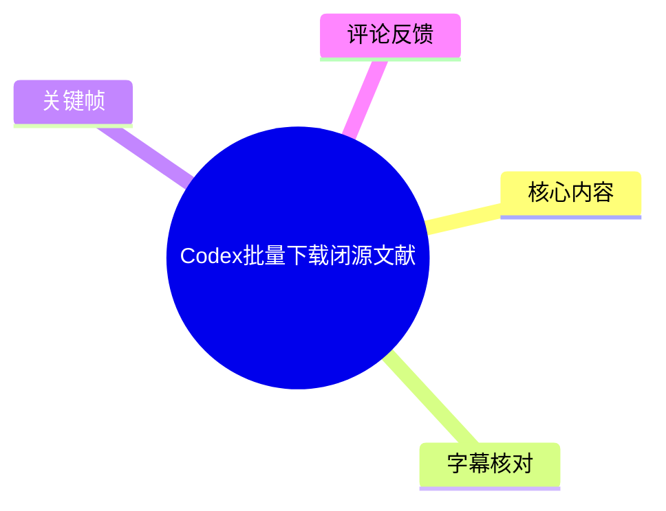
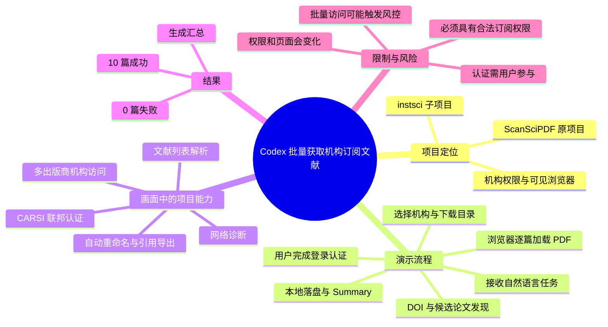
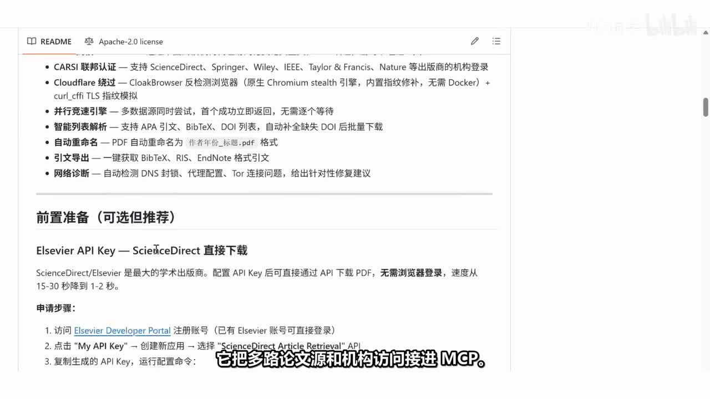
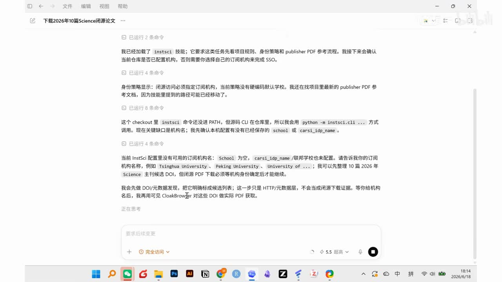
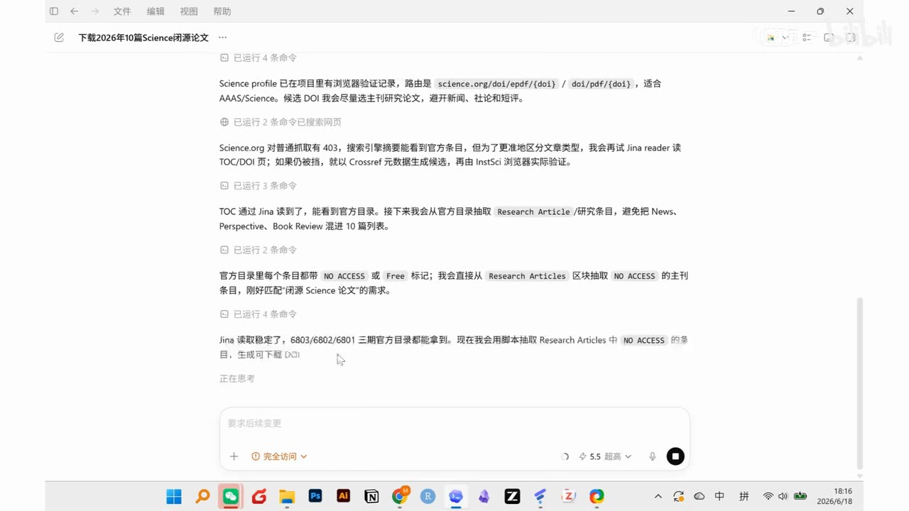
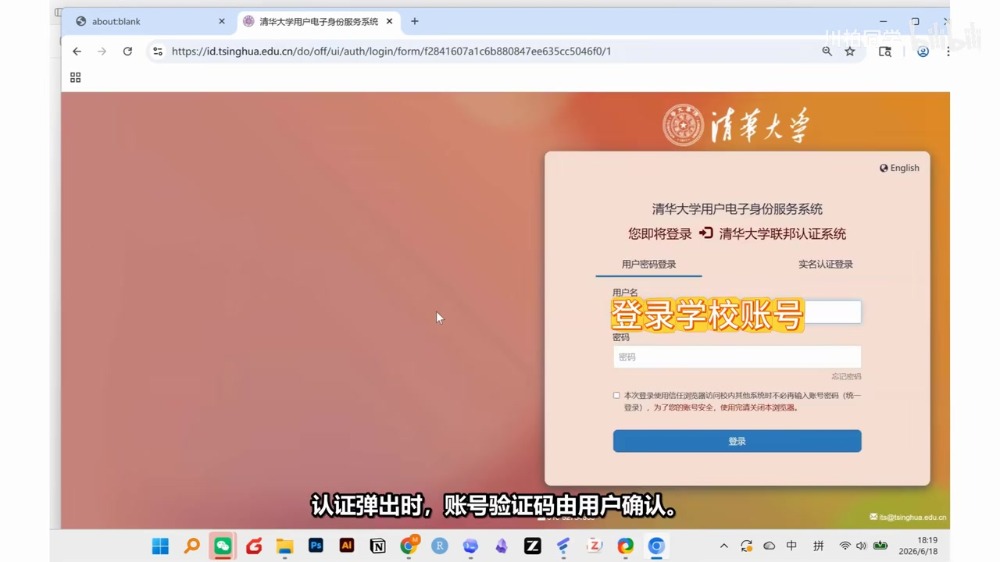

# Codex批量下载闭源文献

> 来源：[Bilibili 视频](https://www.bilibili.com/video/BV1NRja6CEmN) 
> UP 主：川柏同学｜视频时长：4 分 18 秒｜合集：AIcode  
> 本文仅记录视频演示的、通过所属机构订阅与登录认证获取全文的流程；不将其延伸解释为绕过付费墙、访问控制或网站反自动化机制的方案。

## 小结

视频演示了一个名为 `instsci` 的子项目如何配合 Codex，自动完成一批需要机构订阅权限的论文全文获取任务。UP 主将它定位为原项目 ScanSciPDF 的“纯净版”：不依赖 Sci-Hub 等集成数据库，而是将重点放在高校图书馆订阅、CARSI 联邦认证和浏览器中实际打开 PDF 的流程上。

演示的核心不是“只找到 DOI 或候选文献”，而是将成功标准设为**目标 PDF 在浏览器中真实加载并落盘到本地**。Codex 先发现 DOI、筛选候选论文，再确认下载路线、目标目录与订阅机构；需要认证时，账号、验证码等敏感交互由用户确认，之后浏览器逐篇处理 PDF。

从画面可见，项目 README 列出了 CARSI 联邦认证、机构访问、候选文献解析、并行尝试、PDF 自动重命名、引用导出和网络诊断等能力；并建议可选配置 Elsevier API Key，以把 ScienceDirect 的直接下载耗时从约 15–30 秒降至约 1–2 秒。这些是画面中展示的项目说明，不等同于本次演示已逐项验证。

本次样例中，Codex 使用“清华大学（Tsinghua University）”作为机构，进入清华大学用户电子身份服务系统进行登录。视频称最终有 **10 篇成功、0 篇失败**，并生成 Summary；这一结果仅代表该录制环境、当时的机构权限和目标文献集合，不能推及所有学校、出版社或账号。

适合有合法高校/科研机构订阅权限、希望减少重复检索与下载操作的研究者参考。主要限制在于：各机构的身份认证、订阅范围、验证码/MFA、站点页面结构、出版社策略和下载频率限制均可能变化；批量操作还可能触发机构或出版社的风控。热评中也明确提示过高频使用可能导致学校网段 IP 被封禁，应优先遵守机构许可、出版社条款及合理使用规则。

## 思维导图

## 目录

- [背景、项目定位与适用边界](#背景项目定位与适用边界)
- [项目页面展示的能力与参数](#项目页面展示的能力与参数)
- [Codex 任务拆解：先发现，再取得 PDF](#codex-任务拆解先发现再取得-pdf)
- [机构认证与浏览器逐篇下载](#机构认证与浏览器逐篇下载)
- [结果、经验与操作步骤](#结果经验与操作步骤)
- [限制、合规与时效性](#限制合规与时效性)
- [字幕比对](#字幕比对)
- [评论分析](#评论分析)
- [处理记录](#处理记录)

## 背景、项目定位与适用边界 [00:00](https://www.bilibili.com/video/BV1NRja6CEmN?t=0)

视频开头回应“Agent 怎么自动下载文献”的问题，并先展示原项目 **ScanSciPDF**。ASR 提到，该项目将多路论文源与机构访问接入 MCP；随后展示的 `instsci` 是从中独立出的子项目，专门处理图书馆权限及可见浏览器相关流程。

结合视频简介，UP 主说明此前 ScanSciPDF 很受关注，但部分用户反馈 Codex 无法使用其中集成的某些数据源；因此将支持“100+ 高校”登录认证批量下载论文的模块单独拆出为 `instsci`。简介还称清华、浙大、中海洋、南理工等学校用户曾反馈可用；这是作者在发布时的用户反馈，未附带逐校、逐出版社和逐账户的可复现实验记录。

视频中的关键区分是：

1. **发现候选文献不等于下载成功**：仅有 DOI、网页元数据或候选列表，尚未证明已经获得全文。
2. **下载路径依赖机构权限**：对于需要订阅访问的内容，演示采用机构身份认证后在浏览器中打开 PDF 的方式。
3. **认证交互仍由用户负责**：当出现账号、验证码等认证提示时，需要用户确认或输入，而不是由自动化流程代为处理。
4. **最终以 PDF 实际落盘为准**：视频将浏览器页面加载 PDF 和本地生成文件作为成功验证的一部分。

## 项目页面展示的能力与参数 [00:15](https://www.bilibili.com/video/BV1NRja6CEmN?t=15)

> 图：该帧显示项目 README 的功能清单及 “前置准备” 区域，可直接核对视频所展示的能力名称、适用出版商和 API Key 速度说明，避免将 ASR 的模糊转写当作精确参数。

画面中的 README 可读出以下功能点：

| 类别 | 画面展示内容 | 解读与边界 |
| --- | --- | --- |
| 机构认证 | **CARSI 联邦认证**；支持 ScienceDirect、Springer、Wiley、IEEE、Taylor & Francis、Nature 等出版商的机构登录 | “支持”不意味着每所学校均有订阅，也不保证所有出版物或年份都可访问。 |
| 浏览器处理 | README 提到 CloakBrowser 及 Chromium 相关实现 | 视频未展示其完整安装、调用参数或具体效果；不能据此断言能绕过任意网站限制。 |
| 并行尝试 | “多数据源同时尝试，首个成功立即返回，无需逐个等待” | 属于 README 的能力描述，演示中未展示并发数量、速率或队列配置。 |
| 输入解析 | 支持 APA 引文、BibTeX、DOI 列表；可补全缺失 DOI 后批量下载 | 演示实际强调 DOI 发现和候选筛选。输入数据的质量仍会影响结果。 |
| 文件组织 | PDF 自动命名为“作者年份_标题.pdf”格式 | 画面给出命名约定，但未显示实际输出文件名。 |
| 引用输出 | 可一键获取 BibTeX、RIS、EndNote 格式引文 | 视频结尾称会生成 Summary；未在本段中具体演示上述各引用文件。 |
| 网络诊断 | 自动检测 DNS 封锁、代理配置、Tor 连接问题并给出修复建议 | 仅为项目说明，演示未出现网络故障排查过程。 |

README 的“前置准备（可选但推荐）”还给出一个明确性能参数：配置 **Elsevier API Key** 后，可通过 API 直接下载 ScienceDirect PDF，画面称速度可由约 **15–30 秒降至约 1–2 秒**。该数字是 README 在录屏中的陈述，可能受网络、API 配额、文件大小、权限和服务状态影响，不应视作稳定基准。

## Codex 任务拆解：先发现，再取得 PDF [00:42](https://www.bilibili.com/video/BV1NRja6CEmN?t=42)

> 图：该帧显示 Codex 已加载 `instsci` 技能，并明确区分“DOI/元数据发现”和“使用机构权限实际获取 PDF”两步，是理解流程边界的关键证据。

UP 主向 Codex 下达自然语言任务后，流程首先判断：需要闭源/受订阅保护内容时，应走浏览器与机构认证路线。ASR 中“碧源”应结合上下文理解为“闭源”，但该词本身来自低置信度转写，本文不将其扩展为具体技术规则。

画面中的 Codex 记录表明，它会：

1. 加载 `instsci` 技能；
2. 阅读项目规则、身份策略和 publisher PDF 参考流程；
3. 检查是否存在机构配置，例如 `school` 或 `carsi_idp_name`；
4. 要求提供订阅机构名称，画面示例包括 `Tsinghua University`、`Peking University` 等；
5. 先进行 DOI / 元数据发现，整理候选列表；
6. 明确声明此阶段不会把 HTTP 元数据或检索结果当作“获取成功”，而要等待用机构授权的浏览器实际取得 PDF。

> 图：该帧展示 Codex 处理 Science 目录、筛选 `Research Article` 并识别 `NO ACCESS` / `Free` 标记的记录，说明候选筛选仍是信息发现步骤，而非全文交付完成。

后续画面中，Codex 记录到 Science.org 可能返回 403，因此尝试通过 Jina reader 读取目录或 DOI；若仍受阻，则以 Crossref 元数据生成候选，再由 InstSci 浏览器进行实际验证。它还说明会从官方目录中抽取 `Research Article`，避开 News、Perspective、Book Review 等类型，并对未具自由访问标识的条目形成待处理列表。

这里可提炼出一个可迁移的任务设计原则：

> **将“文献发现”“权限判断”“PDF 获取”“文件验证”拆成独立状态。**  
> DOI、网页题录、目录条目只能说明候选存在；获得机构授权后 PDF 页面成功打开、文件写入目标目录，才是视频所采用的完成条件。

## 机构认证与浏览器逐篇下载 [01:30](https://www.bilibili.com/video/BV1NRja6CEmN?t=90)

视频在确认路线和目标目录后，输入“清华 University / Tsinghua University”作为机构，随后打开机构认证界面。UP 主强调：认证弹出时，账号、验证码由用户确认；登录完成后，浏览器开始逐篇打开 PDF。

> 图：该帧直观显示机构统一身份认证页面及“登录学校账号”的提示，证明本次演示依赖学校身份体系，而非无凭证下载；账号、密码和验证码均不应交给第三方自动化工具或记录在脚本中。

该环节的实际职责划分如下：

| 环节 | 视频中由谁完成 | 说明 |
| --- | --- | --- |
| 指定机构名称 | 用户/任务发起者 | 用于选择相应订阅与认证路径。 |
| 填写账号、密码、验证码或确认 MFA | 用户 | 视频明确说明需用户确认；这是安全与合规边界。 |
| 登录后访问页面、逐篇打开 PDF | 浏览器自动流程 | 以已登录状态和机构订阅权限访问。 |
| 判断 PDF 是否真实加载 | 自动流程结合页面状态 | ASR 称“页面真实打开”，并将此作为非“假成功”的验证。 |
| 保存本地 PDF、继续下一篇 | 自动流程 | 结束后回到 Codex 持续汇报状态。 |

ASR 还提到“手机拍屏，鼠标没动，流程在跑”，这是 UP 主用来表现自动化持续执行的现象描述。它不提供后台运行方式、浏览器控制协议、重试次数或并发数等技术细节，因此不能据此复现具体自动化实现。

## 结果、经验与操作步骤 [03:10](https://www.bilibili.com/video/BV1NRja6CEmN?t=190)

视频后段展示首篇 PDF 加载后继续处理下一篇，并不断回到 Codex 更新进度。UP 主的总结是：逐篇验证通过后，最终 **10 篇成功、0 篇失败**，同时生成 Summary，并以本地 PDF 证明全文获取能力。

按视频顺序，可将可见操作整理为以下流程：

1. **准备合法访问条件**  
   确认自己拥有学校或机构的有效账号、相应数据库/出版商订阅权限，以及符合学校和出版商规定的使用资格。

2. **安装并加载项目能力**  
   使用 `instsci` 子项目；视频画面表明 Codex 会先读取项目规则和技能说明。视频未提供完整安装命令、仓库地址、版本号或配置文件，不能补写。

3. **以自然语言提交任务**  
   任务至少需要表达目标文献范围、下载诉求；画面中 Codex 会进一步询问或读取订阅机构配置与目标目录。

4. **确认机构信息和目录**  
   提供机构名称，例如画面中的 `Tsinghua University`。如果本地未配置 `school` / `carsi_idp_name`，需要补全这一信息。

5. **先获取 DOI 与候选列表**  
   利用官方目录、Jina reader、Crossref 元数据等渠道组织候选。此时不得把候选列表记为全文下载完成。

6. **在认证节点由用户完成交互**  
   浏览器跳转到机构统一身份认证页后，由用户输入账号、密码、验证码或完成其他必要确认。不要把凭证写入任务文本、日志、共享截图或代码仓库。

7. **让浏览器逐篇验证 PDF 并保存**  
   登录状态建立后，流程逐篇打开 PDF；以页面真实加载与本地文件落盘来验证，而不是仅凭链接可访问、HTTP 响应或题录存在判断成功。

8. **核对最终汇总**  
   查看 Codex 状态和生成的 Summary，重点检查成功数、失败数、文件目录及每篇的实际 PDF 可读性。视频样例的结果为 10 成功、0 失败。

视频未提供以下决定可复现性的细节：实际命令行、仓库链接、版本/提交号、操作系统、浏览器版本、MCP 配置、目标目录路径、论文 DOI 列表、重试策略、限速参数、单校适配项。因此，上述是工作流整理，不是可直接复制执行的完整教程。

## 限制、合规与时效性 [03:55](https://www.bilibili.com/video/BV1NRja6CEmN?t=235)

### 适用范围

- 适用于具有**合法机构订阅及有效身份凭证**的用户；
- 适用于需要将重复的 DOI 发现、机构登录后的页面访问、PDF 保存与汇总操作串联起来的场景；
- 视频简介称部分高校用户反馈可用，但这不是对全部“100+高校”、全部出版社或所有网络环境的保证。

### 不应作出的推论

- 不能因项目可处理机构认证，就推断可以访问未被本机构订阅的内容。
- 不能因本次十篇样例全成功，就推断其他论文、其他期刊、其他学校或长期运行同样成功。
- 不能将 README 中的浏览器、网络或反爬相关文字理解为规避访问控制的授权；访问应始终遵从数据库许可、网站规则和机构政策。
- 视频没有展示批量规模上限、间隔、速率、失败重试、账号安全策略及异常恢复逻辑。

### 风险控制建议

1. **限制频率与规模**：不要持续高频请求、无间隔轮询或并发打开大量页面。
2. **保留人工确认点**：认证、MFA、异常访问提示与授权范围判断应由用户处理。
3. **验证文件质量**：检查 PDF 是否真的能打开、页数是否合理，避免将错误页、登录页或损坏文件误判为正文。
4. **遵从机构政策**：学校图书馆通常对批量下载、用途和传播有额外要求；若收到异常流量通知，应停止任务并咨询图书馆。
5. **保护凭证与隐私**：不在提示词、日志、截图、代码或第三方服务中暴露账号、密码、验证码、Cookie 与会话信息。

### 时效性

视频元数据时间为 2026-06-18（时区未提供）；录屏右下角亦显示 2026/6/18。认证系统、数据库授权、出版商页面、CARSI 接入状态、Codex 能力和项目代码均可能在发布后变化。README 中的支持范围、性能数据及视频简介中的学校反馈应视为录制/发布时的陈述，使用前需要自行核验。

## 字幕比对 [00:00](https://www.bilibili.com/video/BV1NRja6CEmN?t=0)

本次任务已执行 ASR，但没有提供可用的 Bilibili 站内字幕，因此无法进行逐句对齐校验。

| 字幕来源 | 完整性 | 专有名词 | 时间轴 | 主要问题 |
| --- | --- | --- | --- | --- |
| Bilibili 站内字幕 | 未提供可用字幕 | 无法评估 | 无法评估 | 不存在可供比对、纠错和时间对齐的站内文本。 |
| 本次 ASR 字幕 | 覆盖开场、项目说明、认证、PDF 验证与结果，但为短句转写 | 存在明显误识别，如“碧源”“Wirefied MyH”“餐店街”等 | 未提供逐句时间戳；本文按视频顺序估算章节时间 | 中英文混合专名、界面文本与术语识别不稳定，部分句子缺词或语义不完整。 |

### 最终字幕选择与校正原则

采用**本次 ASR 为主、视频关键帧与元数据为辅**的整理策略；不以未经证实的 ASR 片段补充技术细节。

已依据上下文或画面进行的关键校正如下：

- `ScanSciPDF`、`instsci`：由 ASR 和项目界面文本共同支持。
- `Tsinghua University` / 清华大学：由 Codex 界面和清华统一身份认证页支持。
- `school`、`carsi_idp_name`：在 Codex 界面中可见。
- “碧源必须走浏览器”：按上下文仅解释为“闭源/受订阅保护内容需走浏览器与机构权限路径”；原始 ASR 字词不可靠。
- “每篇都要 Wirefied MyH 才算成功”：无法从现有帧或上下文可靠还原，不采纳为术语或规则。
- “这不是餐店街”：明显语义异常，不采纳。
- “10 篇成功、0 失败、生成 Summary”：来自 ASR 的结尾陈述；关键帧未展示最终统计面板，因此保留为视频口述结果并注明范围。

## 评论分析 [03:55](https://www.bilibili.com/video/BV1NRja6CEmN?t=235)

本次仅获取到 2 条热评，少于要求上限“前三条”；以下仅分析这两条可获取评论，不将评论内容当作已经验证的事实。

1. **御坂18899号（41 赞）**  
   - 观点：批量下载“容易让学校整个网段被 ban IP”。  
   - 价值：直接补充了视频中未详细展开的流量风控风险，与机构订阅资源的合理使用要求高度相关。  
   - 可信度与边界：评论没有给出具体学校、平台、触发频率或处罚记录，不能据此断言必然发生；但它是应当纳入风险评估的合理警示。

2. **橙味橘猫（7 赞）**  
   - 观点：其曾手工实现基于视觉识别下载图标、再操作浏览器的文献下载器；速度不一定比人工快很多，但可持续不间断运行。  
   - 补充信息：指出浏览器视觉自动化的优势可能是连续性，而非单篇下载速度。  
   - 可信度与边界：这是评论者自述，未提供实现、性能测试或合规信息；不能用来证明本视频项目的技术路线、速度或效果，也不构成对自动化批量访问的授权。

## 评论分析

本次流程未获取到可用热评，因此不推断观众态度或额外结论。

## 处理记录

- Worker ID：`worker-mrj0wjed-b0c290ad`
- 调用模型：`gpt-5.6-terra`
- 使用的素材与工具结果：任务提供的 Bilibili 元数据、视频素材清单、ASR 字幕、热评 JSON、关键帧 `frames/frame-001.jpg` 至 `frames/frame-004.jpg`；本次未提供可用站内字幕。
- 字幕选择：已执行本次 ASR；因站内字幕缺失，采用 ASR 为主，并以关键帧、界面可见文本和视频简介校正专有名词与流程边界。对无法可靠辨认的 ASR 内容明确保留不确定性或不采纳。
- 关键帧选择依据：  
  - `frame-001.jpg`：README 功能与 Elsevier API Key 耗时参数；  
  - `frame-002.jpg`：`instsci`、机构配置及 DOI 发现与 PDF 验证的状态区分；  
  - `frame-003.jpg`：Science 目录、文章类型与访问标识筛选；  
  - `frame-004.jpg`：清华机构统一身份认证，支撑“用户确认登录”的边界。  
  其余已给路径未附可核对画面内容，未强行引用。
- 热评处理：仅获取 2 条热评，因此只分析这 2 条；未虚构第三条。
- 缓存清理：未执行本地下载、转码或缓存写入操作；无新增缓存需要清理。
- 未解决问题：缺少逐句时间戳、完整项目安装说明、版本号、公开仓库链接、最终结果页关键帧、失败处理与限速参数；无法独立验证“100+高校支持”、各校可用性、10 篇样例的文件质量及长期稳定性。
